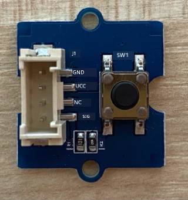
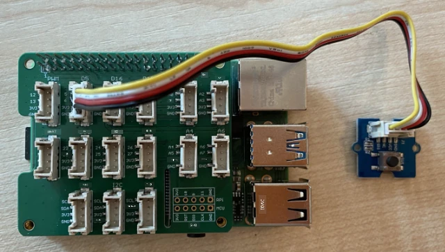

# ចាប់យកសំឡេង - Raspberry Pi

ក្នុងផ្នែកនេះនៃមេរៀន អ្នកនឹងសរសេរកូដដើម្បីចាប់យកសំឡេងលើ Raspberry Pi របស់អ្នក។ ការចាប់យកសំឡេងនឹងត្រូវគ្រប់គ្រងដោយប៊ូតុងមួយ។

## ឧបករណ៍Hardware

Raspberry Pi ត្រូវការប៊ូតុងមួយដើម្បីគ្រប់គ្រងការចាប់យកសំឡេង។

ប៊ូតុងដែលអ្នកនឹងប្រើគឺប៊ូតុង Grove។ នេះជាឧបករណ៍សន្សំតែប្រេនឌីជីថលមួយដែលបង្វិលសញ្ញាដើម្បីបើកឬបិទ។ ប៊ូតុងទាំងនេះអាចត្រូវបានកំណត់ឲ្យផ្ញើសញ្ញាខ្ពស់នៅពេលប៊ូតុងត្រូវបានចុច ហើយផ្ញើសញ្ញាលាបណ៌ទាបនៅពេលមិនចុច ហើយផ្ញើសញ្ញាលាបណ៌ទាបនៅពេលចុច និងខ្ពស់ពេលមិនចុច។

ប្រសិនបើអ្នកកំពុងប្រើ ReSpeaker 2-Mics Pi HAT ជាមីក្រូហ្វូន នោះក៏មិនចាំបាច់ភ្ជាប់ប៊ូតុងទេ ព្រោះ HAT នេះមានប៊ូតុងភ្ជាប់រួចហើយ។ អ្នកអាចរំលងទៅផ្នែកបន្ទាប់។

### ភ្ជាប់ប៊ូតុង

ប៊ូតុងអាចភ្ជាប់ទៅ Grove base hat។

#### បេសកកម្ម - ភ្ជាប់ប៊ូតុង



1. ដាក់ទ្រាប់ខ្សែ Grove មួយចុងទៅច្រកនៅលើម៉ូឌុលប៊ូតុង។ វានឹងចូលតែម្ខាងតែប៉ុណ្ណោះ។

1. ដោយ Raspberry Pi មិនមានគ្រោងដំណើរការ សូមភ្ជាប់ចុងខ្សែ Grove ផ្សេងទៀតទៅច្រកឌីជីថលមានស្លាក **D5** លើ Grove Base hat ដែលភ្ជាប់ទៅ Pi ។ ច្រកនេះជាច្រកទីពីរពីឆ្វេង នៅជួរច្រកឆ្វេងជិតហ្វីងពិនិត្យ GPIO។



## ចាប់យកសំឡេង

អ្នកអាចចាប់យកសំឡេងពីមីក្រូហ្វូនដោយប្រើកូដ Python ។

### បេសកកម្ម - ចាប់យកសំឡេង

1. បើក Pi ហើយរង់ចាំវាប៊ូត

1. បើក VS Code មួយវិញទៀត ដោយផ្ទាល់លើ Pi ឬភ្ជាប់តាមបន្ថែម Remote SSH ។

1. កញ្ចប់ PyAudio Pip មានមុខងារច្រើនសម្រាប់ថត និងចាក់សំឡេងត្រឡប់វិញ។ កញ្ចប់នេះពឹងផ្អែកលើបណ្ណាល័យសំឡេងចាក់ខ្លះដែលត្រូវតំឡើងជាមុន។ ដំណើរការបញ្ជា ខាងក្រោមនៅក្នុងផ្ទាំងបញ្ជាទៅតំឡើងវា៖

    ```sh
    sudo apt update
    sudo apt install libportaudio0 libportaudio2 libportaudiocpp0 portaudio19-dev libasound2-plugins --yes 
    ```

1. តំឡើងកញ្ចប់ PyAudio Pip។

    ```sh
    pip3 install pyaudio
    ```

1. បង្កើតថតថ្មីមួយឈ្មោះ `smart-timer` ហើយបន្ថែមឯកសារ `app.py` ទៅក្នុងថតនេះ។

1. បន្ថែមការនាំចូលដូចខាងក្រោមនៅកម្ពស់ឯកសារ៖

    ```python
    import io
    import pyaudio
    import time
    import wave
    
    from grove.factory import Factory
    ```

    នេះគឺនាំចូលម៉ូឌុល `pyaudio` មួយ ចំនួនម៉ូឌុល Python ស្ដង់ដារដើម្បីដោះស្រាយឯកសារ wave និងម៉ូឌុល `grove.factory` ដើម្បីនាំចូល `Factory` សម្រាប់បង្កើតថ្នាក់ប៊ូតុងមួយ។

1. តាមក្រោមនេះ បន្ថែមកូដដើម្បីបង្កើតប៊ូតុង Grove។

    ប្រសិនបើអ្នកកំពុងប្រើ ReSpeaker 2-Mics Pi HAT សូមប្រើកូដខាងក្រោម៖

    ```python
    # ប៊ូតុងលើ ReSpeaker 2-Mics Pi HAT
    button = Factory.getButton("GPIO-LOW", 17)
    ```

    នេះបង្កើតប៊ូតុងនៅផត់ត **D17** ដែលភ្ជាប់នឹងប៊ូតុងលើ ReSpeaker 2-Mics Pi HAT។ ប៊ូតុងនេះកំណត់ឲ្យផ្ញើសញ្ញាលាបណ៌ទាបនៅពេលចុច។

    ប្រសិនបើអ្នកមិនប្រើ ReSpeaker 2-Mics Pi HAT ហើយកំពុងប្រើប៊ូតុង Grove ភ្ជាប់ទៅ base hat សូមប្រើកូដនេះ។

    ```python
    button = Factory.getButton("GPIO-HIGH", 5)
    ```

    នេះបង្កើតប៊ូតុងនៅផត់ត **D5** ដែលកំណត់ឲ្យផ្ញើសញ្ញាខ្ពស់នៅពេលចុច។

1. តាមក្រោមនេះ បង្កើតអនុគមន៍មួយពី PyAudio សម្រាប់គ្រប់គ្រងសំឡេង៖

    ```python
    audio = pyaudio.PyAudio()
    ```

1. ប្រកាសលេខកាតឧបករណ៍សំឡេងសម្រាប់មីក្រូហ្វូន និងអ្នកចាក់សំឡេង។ នេះគឺជាលេខកាតដែលអ្នកបានរកឃើញពេលរត់ពាក្យបញ្ជា `arecord -l` និង `aplay -l` នៅមុនក្នុងមេរៀននេះ។

    ```python
    microphone_card_number = <microphone card number>
    speaker_card_number = <speaker card number>
    ```

    ជំនួស `<microphone card number>` ជាលេខកាតមីក្រូហ្វូនរបស់អ្នក។

    ជំនួស `<speaker card number>` ជាលេខកាតអ្នកចាក់សំឡេង រួមគ្នានឹងលេខដែលអ្នកបានកំណត់ក្នុងឯកសារ `alsa.conf`។

1. តាមក្រោមនេះ ប្រកាសអត្រាគំរូសម្រាប់ការចាប់យក និងចាក់សំឡេង។ អ្នកអាចត្រូវប្តូរតម្លៃនេះទៅតាមឧបករណ៍ដែលអ្នកប្រើ។

    ```python
    rate = 48000 #៤៨KHz
    ```

    ប្រសិនបើអ្នកមានបញ្ហាអត្រាគំរូពេលរត់កូដនេះក្រោយ សូមប្តូរតម្លៃទៅ `44100` ឬ `16000`។ តម្លៃខ្ពស់ មើលមានគុណភាពសំឡេងល្អជាង។

1. តាមក្រោមនេះ បង្កើតអនុគមន៍មួយឈ្មោះ `capture_audio` ហៅចាប់យកសំឡេងពីមីក្រូហ្វូន៖

    ```python
    def capture_audio():
    ```

1. នៅក្នុងអនុគមន៍នេះ បន្ថែមខាងក្រោមដើម្បីចាប់យកសំឡេង៖

    ```python
    stream = audio.open(format = pyaudio.paInt16,
                        rate = rate,
                        channels = 1, 
                        input_device_index = microphone_card_number,
                        input = True,
                        frames_per_buffer = 4096)

    frames = []

    while button.is_pressed():
        frames.append(stream.read(4096))

    stream.stop_stream()
    stream.close()
    ```

    កូដនេះបើកសត្រួត់ទិន្នន័យសំឡេងក្នុងប្រព័ន្ធ PyAudio ដែលចាប់យកសំឡេងពីមីក្រូហ្វូននៅ 16KHz ប្រមូលសំឡេងជាប៊ឺហ្វ័រពីរអំណោយទំហំ 4096 បៃ។

    កូដនោះបន្តបង្វិលបិទចាំប៊ូតុង Grove នៅពេលចុច ហើយអានប៊ឺហ្វ័រនីមួយៗចូលទៅក្នុងអារេរៀងរាល់ពេល។

    > 💁 អ្នកអាចអានបន្ថែមអំពីជម្រើសដែលផ្ដល់ទៅវិធីសាស្ត្រ `open` នៅក្នុង [ឯកសារ PyAudio](https://people.csail.mit.edu/hubert/pyaudio/docs/) ។

    ពេលប៊ូតុងបានដោះ ការចាប់យកត្រូវបានបញ្ឈប់ហើយបិទកម្មវិធីចាប់យក។

1. បន្ថែមខាងក្រោមចុងអនុគមន៍នេះ៖

    ```python
    wav_buffer = io.BytesIO()
    with wave.open(wav_buffer, 'wb') as wavefile:
        wavefile.setnchannels(1)
        wavefile.setsampwidth(audio.get_sample_size(pyaudio.paInt16))
        wavefile.setframerate(rate)
        wavefile.writeframes(b''.join(frames))
        wav_buffer.seek(0)

    return wav_buffer
    ```

    កូដនេះបង្កើតប៊ឺហ្វ័រពីរប៊ីនាទី និងសរសេរសំឡេងដែលបានចាប់យកជាឯកសារ [WAV file](https://wikipedia.org/wiki/WAV)។ វាជារបៀបស្តង់ដារសម្រាប់សរសេរសំឡេងដែលមិនបង្រួមទៅក្នុងឯកសារ។ ប៊ឺហ្វ័រនេះត្រូវបានត្រឡប់ចេញ។

1. បន្ថែមអនុគមន៍ `play_audio` ខាងក្រោមដើម្បីចាក់សំឡេងពីប៊ឺហ្វ័រ៖

    ```python
    def play_audio(buffer):
        stream = audio.open(format = pyaudio.paInt16,
                            rate = rate,
                            channels = 1,
                            output_device_index = speaker_card_number,
                            output = True)
    
        with wave.open(buffer, 'rb') as wf:
            data = wf.readframes(4096)
    
            while len(data) > 0:
                stream.write(data)
                data = wf.readframes(4096)
    
            stream.close()
    ```

    អនុគមន៍នេះបើកសត្រួត់សំឡេងមួយផ្សេងទៀត សម្រាប់ចាក់សំឡេង។ វាប្រើកំណត់ដូចជាការចាប់យក។ ប៊ឺហ្វ័រត្រូវបានបើកជាឯកសារ wave ហើយសរសេរចូលក្នុងសត្រួត់ក្នុងទំហំ 4096 បៃ ដើម្បីចាក់សំឡេង។ បន្ទាប់មកបិទសត្រួត់។

1. បន្ថែមកូដខាងក្រោមក្រោមអនុគមន៍ `capture_audio` ដើម្បីបង្វិលរង់ចាំរហូតដល់ប៊ូតុងត្រូវបានចុច។ ពេលប៊ូតុងត្រូវបានចុច គឺចាប់យកសំឡេង ហើយបន្ទាប់មកចាក់សំឡេងវិញ។

    ```python
    while True:
        while not button.is_pressed():
            time.sleep(.1)
        
        buffer = capture_audio()
        play_audio(buffer)
    ```

1. រត់កូដ។ ចុចប៊ូតុង ហើយនិយាយទៅកាន់មីក្រូហ្វូន។ ដាប៊ូតុងនៅពេលអ្នកបានបញ្ចប់ ហើយអ្នកនឹងឮការថត។

    អ្នកអាចមានកំហុស ALSA បន្ទាប់ពីបង្កើត PyAudio instance។ នេះជាលទ្ធផលពីការកំណត់លំនាំនៃឧបករណ៍សំឡេងដែលអ្នកមិនមាន។ អ្នកអាចមិនយកចិត្តទុកដាក់ទៅកំហុសនេះ។

    ```output
    pi@raspberrypi:~/smart-timer $ python3 app.py 
    ALSA lib pcm.c:2565:(snd_pcm_open_noupdate) Unknown PCM cards.pcm.front
    ALSA lib pcm.c:2565:(snd_pcm_open_noupdate) Unknown PCM cards.pcm.rear
    ALSA lib pcm.c:2565:(snd_pcm_open_noupdate) Unknown PCM cards.pcm.center_lfe
    ALSA lib pcm.c:2565:(snd_pcm_open_noupdate) Unknown PCM cards.pcm.side
    ```

    ប្រសិនបើអ្នកទទួលបានកំហុសដូចខាងក្រោម៖

    ```output
    OSError: [Errno -9997] Invalid sample rate
    ```

    សូមប្តូរអត្រា `rate` ទៅ 44100 ឬ 16000។

> 💁 អ្នកអាចរកមើលកូដនេះនៅក្នុងថត [code-record/pi](../../../../../6-consumer/lessons/1-speech-recognition/code-record/pi) ។

😀 កម្មវិធីថតសំឡេងរបស់អ្នកបានជោគជ័យ!

---

<!-- CO-OP TRANSLATOR DISCLAIMER START -->
**ការ​អះអាង**៖  
ឯកសារនេះត្រូវបានបកប្រែដោយ​ប្រព័ន្ធបកប្រែ AI [Co-op Translator](https://github.com/Azure/co-op-translator)។ នៅពេលយើងខិតខំសំរាប់ភាពត្រឹមត្រូវ សូមយល់ឲ្យបានថា​ការ​បកប្រែ​អូតូម៉ាទៅអាចមានកំហុស ឬការមិនត្រឹមត្រូវ។ ឯកសារដើមក្នុងភាសា​ដើមគួរត្រូវបានគិតថាជា​ប្រភព​ដែលមានអំណាច។ សម្រាប់ព័ត៌មានសំខាន់ៗ ការបកប្រែ​ដោយ​មនុស្សជំនាញ​ត្រូវបានណែនាំ។ យើងមិនទទួលខុសត្រូវចំពោះការយល់ច្រឡំ ឬការបកប្រែខុសៗដែលបង្កើតឡើងពីការប្រើប្រាស់​ការបកប្រែនេះឡើយ។
<!-- CO-OP TRANSLATOR DISCLAIMER END -->