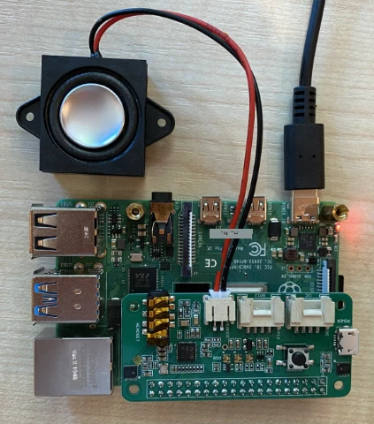

# បញ្ជាក់ការកំណត់មីក្រូហ្វូន និងម្ហូបសំឡេងរបស់អ្នក - Raspberry Pi

នៅក្នុងផ្នែកនេះនៃមេរៀន អ្នកនឹងបន្ថែមមីក្រូហ្វូន និងម្ហូបសំឡេងទៅកាន់ Raspberry Pi របស់អ្នក។

## ឧបករណ៍រឹង

Raspberry Pi ត្រូវការមីក្រូហ្វូន។

Pi គ្មានមីក្រូហ្វូនបញ្ចូលក្នុងខ្លួនទេ អ្នកត្រូវតែបន្ថែមមីក្រូហ្វូនខាងក្រៅ។ មានវិធីជាច្រើនក្នុងការធ្វើនេះ៖

* មីក្រូហ្វូន USB
* ស្រោមត្រចៀក USB
* សំពត់សំឡេង USB all in one
* អ្នកបម្លែងសំឡេង USB និងមីក្រូហ្វូនជាមួយជក់ 3.5mm
* [ReSpeaker 2-Mics Pi HAT](https://www.seeedstudio.com/ReSpeaker-2-Mics-Pi-HAT.html)

> 💁 មីក្រូហ្វូនប្លូធូសមិនទំនេរទាំងអស់លើ Raspberry Pi ទេ ដូច្នេះបើអ្នកមានមីក្រូហ្វូនប្លូធូស ឬស្រោមត្រចៀក ប្លូធូស អ្នកអាចមានបញ្ហាក្នុងការចងភ្ជាប់ ឬថតសំឡេង។

Raspberry Pi មានជក់ត្រចៀក 3.5mm។ អ្នកអាចប្រើវា ដើម្បីភ្ជាប់ត្រចៀក ស្រោមត្រចៀក ឬម្ហូបសំឡេង។ អ្នកក៏អាចបន្ថែមម្ហូបសំឡេងដោយប្រើ៖

* សំឡេង HDMI តាមរយ:មកមូនីទ័រឬទូរទស្សន៍
* ម្ហូបសំឡេង USB
* ស្រោមត្រចៀក USB
* សំពត់សំឡេង USB all in one
* [ReSpeaker 2-Mics Pi HAT](https://www.seeedstudio.com/ReSpeaker-2-Mics-Pi-HAT.html) ជាមួយម្ហូបសំឡេងភ្ជាប់ ទាំងនៅជក់ 3.5mm ឬនៅច្រក JST

## ភ្ជាប់ និងកំណត់មីក្រូហ្វូន និងម្ហូបសំឡេង

មីក្រូហ្វូន និងម្ហូបសំឡេងត្រូវការត្រូវភ្ជាប់ ហើយកំណត់រួចរាល់។

### កិច្ចការណ៍ - ភ្ជាប់ និងកំណត់មីក្រូហ្វូន

1. ភ្ជាប់មីក្រូហ្វូនដោយវិធីសាស្រ្តដែលសមរម្យ។ ឧទាហរណ៍ ភ្ជាប់វាតាមច្រក USB មួយ។

1. ប្រសិនបើអ្នកប្រើកំពូល ReSpeaker 2-Mics Pi HAT អ្នកអាចដោះគំពូល Grove base hat បន្ទាប់មកដាក់កំពូល ReSpeaker ជំនួស។

    

    អ្នកនឹងត្រូវការប៊ូតុង Grove នៅពេលក្រោយក្នុងមេរៀននេះ ប៉ុន្តែមួយគឺក្នុងកំពូលនេះហើយ ដូច្នេះគ្មានការទាមទារទៅ Grove base hat។

    បន្ទាប់ពីដាក់កំពូលរួច អ្នកត្រូវដំឡើងឌ្រាយវើរំ។ មើលការណែនាំចាប់ផ្តើមពី [Seeed](https://wiki.seeedstudio.com/ReSpeaker_2_Mics_Pi_HAT_Raspberry/#getting-started)សម្រាប់ការដំឡើងឌ្រាយវើរំ។

    > ⚠️ ការណែនាំប្រើ`git` ដើម្បីClone រ pigeon។ ប្រសិនបើអ្នកមិនមាន `git` នៅលើ Pi របស់អ្នក អ្នកអាចដំឡើងវាតាមការបញ្ជារខាងក្រោម៖
    >
    > ```sh
    > sudo apt install git --yes
    > ```

1. ប្រតិបត្តិកម្មបញ្ជារខាងក្រោមនៅក្នុងTerminal របស់អ្នក ទៅលើ Pi ឬភ្ជាប់ជាមួយ VS Code និងសេស្សិន SSH ពីចម្ងាយ ដើម្បីមើលព័ត៌មានពីមីក្រូហ្វូនដែលបានភ្ជាប់៖

    ```sh
    arecord -l
    ```

    អ្នកនឹងឃើញបញ្ជីមីក្រូហ្វូនដែលភ្ជាប់។ វានឹងមានរបៀបដូចខាងក្រោម៖

    ```output
    pi@raspberrypi:~ $ arecord -l
    **** List of CAPTURE Hardware Devices ****
    card 1: M0 [eMeet M0], device 0: USB Audio [USB Audio]
      Subdevices: 1/1
      Subdevice #0: subdevice #0
    ```

    តាមគំនិតថាអ្នកមានមីក្រូហ្វូនតែមួយ អ្នកគួរតែឃើញត្រឹមការ១ផ្ទាត់។ ការកំណត់មីក្រូហ្វូនលើ Linux អាចពិបាក អាស្រ័យលើនោះវាងាយការអស់បំផុតក្នុងការប្រើមីក្រូហ្វូនតែមួយ និងដោះតាំងមីក្រូហ្វូនផ្សេងទៀតអោយចេញ។

    ចងចាំលេខកាត ដោយសារអ្នកត្រូវការព្រះនេះក្រោយ។ លេខកាតក្នុងលទ្ធផលខាងលើគឺ 1។

### កិច្ចការណ៍ - ភ្ជាប់ និងកំណត់ម្ហូបសំឡេង

1. ភ្ជាប់ម្ហូបសំឡេងដោយវិធីសាស្រ្តដែលសមរម្យ។

1. ប្រតិបត្តិកម្មបញ្ជារខាងក្រោមនៅក្នុង Terminal របស់អ្នក ទៅលើ Pi ឬភ្ជាប់ជាមួយ VS Code និងសេស្សិន SSH ពីចម្ងាយ ដើម្បីមើលព័ត៌មានពីម្ហូបសំឡេងដែលបានភ្ជាប់៖

    ```sh
    aplay -l
    ```

    អ្នកនឹងឃើញបញ្ជីម្ហូបសំឡេងដែលភ្ជាប់។ វានឹងមានរបៀបដូចខាងក្រោម៖

    ```output
    pi@raspberrypi:~ $ aplay -l
    **** List of PLAYBACK Hardware Devices ****
    card 0: Headphones [bcm2835 Headphones], device 0: bcm2835 Headphones [bcm2835 Headphones]
      Subdevices: 8/8
      Subdevice #0: subdevice #0
      Subdevice #1: subdevice #1
      Subdevice #2: subdevice #2
      Subdevice #3: subdevice #3
      Subdevice #4: subdevice #4
      Subdevice #5: subdevice #5
      Subdevice #6: subdevice #6
      Subdevice #7: subdevice #7
    card 1: M0 [eMeet M0], device 0: USB Audio [USB Audio]
      Subdevices: 1/1
      Subdevice #0: subdevice #0
    ```

    អ្នកនឹង luônឃើញ `card 0: Headphones` ព្រោះវាជាជក់ត្រចៀកដែលភ្ជាប់នៅក្នុងផ្ទៃ។ បើអ្នកបានបន្ថែមម្ហូបសំឡេងបន្ថែម ដូចជាម្ហូបសំឡេង USB អ្នកនឹងឃើញវាបញ្ជាក់អំពីនេះផងដែរ។

1. ប្រសិនបើអ្នកប្រើម្ហូបសំឡេងបន្ថែម ហើយមិនមែនម្ហូបសំឡេងឬត្រចៀកដែលភ្ជាប់ទៅជក់ត្រចៀកផ្ទាល់ទេ អ្នកត្រូវកំណត់វាជាម្ហូបសំឡេងលំនាំដើម។ ដើម្បីធ្វើបែបនេះ ប្រតិបត្តិការបញ្ជារខាងក្រោម៖

    ```sh
    sudo nano /usr/share/alsa/alsa.conf
    ```

    វានឹងបើកឯកសារកំណត់រចនាសម្ព័ន្ធនៅក្នុង `nano` ដែលជាកម្មវិធីកែសម្រួលអត្ថបទនៅក្នុង terminal។ ប្រ_rosចំហូរចុះ ប្រើក្រចះសៀកលើក្តារចុចរបស់អ្នករហូតដល់អ្នកឃើញបន្ទាត់ដូចខាងក្រោម៖

    ```output
    defaults.pcm.card 0
    ```

    ប្តូរតម្លៃពី`0`ទៅលេខកាត ដែលអ្នកចង់ប្រើពីបញ្ជីដែលវាយតិចស៍ពីការហៅ `aplay -l`។ ឧទាហរណ៍ នៅលទ្ធផលខាងលើមានកាតសំឡេងទីពីរហៅថា `card 1: M0 [eMeet M0], device 0: USB Audio [USB Audio]`, ប្រើលេខកាត 1 ។ ដើម្បីប្រើវា ខ្ញុំនឹងធ្វើបច្ចុប្បន្នភាពបន្ទាត់ទៅជាយ៉ាងនេះ៖

    ```output
    defaults.pcm.card 1
    ```

    កំណត់តម្លៃនេះទៅលេខកាតដែលសមរម្យ។ អ្នកអាចទៅរកលេខវាប្រើក្រចះសៀកលើក្តារចុចរបស់អ្នក បន្ទាប់មកលុប និងវាយលេខថ្មីដូចធម្មតា​នៅពេលកែសម្រួលឯកសារ។

1. រក្សាទុកការផ្លាស់ប្តូរ ហើយបិទឯកសារដោយចុច `Ctrl+x`។ ចុច `y` ដើម្បីរក្សាទុកសារ​ួច ហើយចុច `return` ដើម្បីជ្រើសឈ្មោះឯកសារ។

### កិច្ចការណ៍ - សាកល្បងមីកឺហ្វូន និងម្ហូបសំឡេង

1. ប្រតិបត្តការបញ្ជារខាងក្រោម ដើម្បីថតសំឡេង 5 វិនាទីតាមរយៈមីក្រូហ្វូន៖

    ```sh
    arecord --format=S16_LE --duration=5 --rate=16000 --file-type=wav out.wav
    ```

    ខណៈពេលបញ្ជានេះកំពុងដំណើរការ ប្រូត់សំឡេងចូលទៅក្នុងមីក្រូហ្វូន ដូចជា និយាយ ច្រៀង ប៊ីតបុកស៊ីង រាំតន្ត្រី ឬអ្វីជាការចូលចិត្តរបស់អ្នក។

1. បន្ទាប់ពី 5 វិនាទី ការថតនឹងបញ្ឈប់។ ប្រតិបត្តិការបញ្ជារខាងក្រោម ដើម្បីចាក់សំឡេងដែលបានថត៖

    ```sh
    aplay --format=S16_LE --rate=16000 out.wav
    ```

    អ្នកនឹងស្ដាប់សំឡេងភ្លេងត្រឡប់តាមរយៈម្ហូបសំឡេង។ ផ្លាស់ប្តូរកម្រិតសម្លេងលើម្ហូបសំឡេងមានតម្រូវការ។

1. ប្រសិនបើអ្នកត្រូវការកែសម្រួលកម្រិតសំឡេងនៃច្រកមីក្រូហ្វូនក្នុងផ្ទៃ ឬកែលម្អកម្រិតការទទួលសំឡេង អ្នកអាចប្រើកម្មវិធី `alsamixer`។ អ្នកអាចអានបន្ថែមអំពីកម្មវិធីនេះនៅលើ [ទំព័រ Linux alsamixer man](https://linux.die.net/man/1/alsamixer)

1. ប្រសិនបើអ្នកទទួលបានកំហុសពេលចាក់សំឡេងត្រឡប់ សូមពិនិត្យមើលកាតដែលអ្នកកំណត់ជា `defaults.pcm.card` ក្នុងឯកសារ `alsa.conf`។

---

<!-- CO-OP TRANSLATOR DISCLAIMER START -->
**ការព្រមាន**៖  
ឯកសារនេះត្រូវបានបកប្រែដោយប្រើសេវាបកប្រែ AI [Co-op Translator](https://github.com/Azure/co-op-translator)។ ទោះយ៉ាងណា យើងខ្ញុំខិតខំក្នុងការត្រឹមត្រូវ អ៏ំពើដូច្នេះ សូមកត់សម្គាល់ថា ការបកប្រែដោយស្វ័យប្រវត្តិនេះអាចមានកំហុស ឬការខ្វះត្រឺមត្រូវ។ ឯកសារដើមក្នុងភាសាដើមគួរត្រូវបានពេញចិត្តជាឈ្មោះប្រភពអាជ្ញាសិទ្ធិ។ សម្រាប់ព័ត៌មានសំខាន់ៗ គួរតែប្រើប្រាស់ការបកប្រែដោយអ្នកជំនាញមនុស្សវិជ្ជាជីវៈ។ យើងខ្ញុំមិនទទួលខុសត្រូវចំពោះការយល់ច្រឡំ ឬការបកប្រែខុសៗណាមួយដែលកើតឡើងពីការប្រើប្រាស់ការបកប្រែនេះទេ។
<!-- CO-OP TRANSLATOR DISCLAIMER END -->