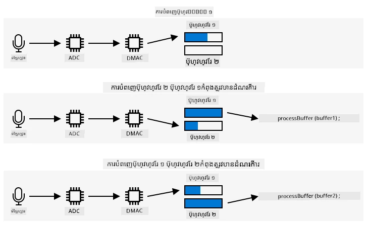

# យកសំឡេង - Wio Terminal

នៅផ្នែកនេះនៃមេរៀន អ្នកនឹងសរសេរកូដដើម្បីយកសំឡេងលើ Wio Terminal របស់អ្នក។ ការយកសំឡេងនឹងត្រូវគ្នា តាមប៊ូតុងមួយនៅលើ Wio Terminal ។

## កម្មវិធីឧបករណ៍ដើម្បីយកសំឡេង

អ្នកអាចយកសំឡេងពីម៉ីក្រូហ្វូនដោយប្រើកូដ C++។ Wio Terminal មាន RAM 192KB មិនគ្រប់គ្រាន់ដើម្បីយកសំឡេងលើសពីពីរកាលវិនាទីនៃសំឡេង។ វាមានអង្គចងចាំ flash 4MB ដូច្នេះអាចប្រើជំនួសដោយការសន្សំសំឡេងដែលយកបានទៅក្នុង flash memory។

ម៉ីក្រូហ្វូនដែលមានក្នុងស៊ុមយកសញ្ញាអានាឡោះ ដែលត្រូវបានបម្លែងទៅជាសញ្ញាឌីជីថលដែល Wio Terminal អាចប្រើបាន។ ពេលយកសំឡេង ត្រូវការយកទិន្នន័យនៅពេលពិតប្រាកដ - ដូចជា ដើម្បីយកសំឡេងនៅ 16KHz ត្រូវការយកសំឡេងចំនួន 16,000 ដងក្នុងមួយវិនាទី ជាមួយចន្លោះស្មើគ្នារវាងគំរូនីមួយៗ។ បង្អស់មិនបានប្រើកូដរបស់អ្នកសម្រាប់ធ្វើការនេះទេ អ្នកអាចប្រើឧបករណ៍គ្រប់គ្រងការចូលប្រើចងចាំត្រង់ (DMAC) ដែលជាសាស្ត្រអេឡិចត្រូនិចដែលអាចយកសញ្ញាពីកន្លែងណាមួយហើយសរសេរទៅចងចាំ ដោយមិនរំខានលើកូដដែលកំពុងរត់លើកម្រិតដំណើរការ។

✅ អានបន្ថែមអំពី DMA នៅលើ [ទំព័រទាក់ទងមិនប្រើ CPU នៅលើ Wikipedia](https://wikipedia.org/wiki/Direct_memory_access)។



DMAC អាចយកសំឡេងពី ADC នៅចន្លោះពេលថេរដូចជា 16,000 ដងក្នុងមួយវិនាទីសម្រាប់សំឡេង 16KHz។ វាអាចសរសេរទិន្នន័យនេះទៅក្នុង buffer ដែលបានរៀបចំជាមុនម្ដង ហើយពេល buffer ពេញ វាធ្វើអោយមាននៅសម្រាប់កូដរបស់អ្នកដំណើរការ។ ការប្រើប្រាស់ចងចាំនេះអាចធ្វើឲ្យការយកសំឡេងមានការពន្យារពេល ប៉ុន្តែអ្នកអាចរៀបចំផ្ទាំងចងចាំច្រើនផ្ទាំងបាន។ DMAC សរសេរទៅ buffer ១ ផ្ទាល់ខ្លួន ហើយពេលវាពេញ វា​ជូនដំណឹងកូដរបស់អ្នកដើម្បីដំណើរការ buffer ១ ខណៈដែល DMAC សរសេរទៅ buffer ២។ ពេល buffer ២ ពេញ វាជូនដំណឹងកូដរបស់អ្នក ហើយត្រឡប់ទៅសរសេរទៅ buffer ១ ជាដើម។ ដូចនេះ ប្រសិនបើអ្នកដំណើរការ buffer ទាំងនេះឲ្យបាននៅតែឆាប់ជាងពេលបំពេញមួយ អ្នកមិនគួរបាត់បង់ទិន្នន័យទេ។

ពេល buffer នីមួយៗត្រូវបានយក រួចវាអាចត្រូវបានសរសេរទៅជា flash memory។ Flash memory ត្រូវបានសរសេរតាមអាសយដ្ឋានដែលបានកំណត់ បញ្ជាក់កន្លែងដែលត្រូវសរសេរ និងទំហំដែលត្រូវសរសេរ ដូចជាការអាប់ដេតអារេរបស់ Byte នៅក្នុងចងចាំ។ Flash memory មានភាពចំរូងទំហំ ហៅថា granularity មានន័យថា ការលុប និងសរសេរតម្រូវឲ្យមានទំហំថេរនិងតម្រូវឲ្យគ្នាទៅតាមទំហំនេះ។ ឧ. ប្រសិនបើ granularity គឺ 4096 bytes ហើយអ្នកស្នើឲ្យលុបនៅអាសយដ្ឋាន 4200 វាអាចលុបទិន្នន័យទាំងអស់ពីអាសយដ្ឋាន 4096 ដល់ 8192។ នេះមានន័យថា នៅពេលសរសេរទិន្នន័យសំឡេងទៅ flash memory វាត្រូវតែមានទំហំឆបគ្នា។

### ការងារ - កំណត់ការកំណត់ flash memory

1. បង្កើតគម្រោងWio Terminal ថ្មីមួយក្នុង PlatformIO។ ឈ្មោះគម្រោងនេះ `smart-timer`។ បន្ថែមកូដក្នុងមុខងារ `setup` ដើម្បីកំណត់ជំពូកស៊េរៀល។

1. បន្ថែមការ dependency នៃបណ្ណាល័យដែលក្រោមនៅឯកសារ `platformio.ini` ដូចខាងក្រោម ដើម្បីអោយអាចចូលដំណើរការទៅ flash memory:

    ```ini
    lib_deps =
        seeed-studio/Seeed Arduino FS @ 2.1.1
        seeed-studio/Seeed Arduino SFUD @ 2.0.2
    ```

1. បើកឯកសារ `main.cpp` ហើយបន្ថែម include directive សំរាប់បណ្ណាល័យ flash memory នៅផ្នែកជើងសៀវភៅ៖

    ```cpp
    #include <sfud.h>
    #include <SPI.h>
    ```

    > 🎓 SFUD មានន័យថា Serial Flash Universal Driver ហើយវាជាបណ្ណាល័យដែលរចនាឡើងសម្រាប់ប្រើប្រាស់ជាមួយខ្សែឡើង flash memory ទាំងអស់

1. ក្នុងមុខងារ `setup` បន្ថែមកូដខាងក្រោមដើម្បីកំណត់បណ្ណាល័យ flash storage៖

    ```cpp
    while (!(sfud_init() == SFUD_SUCCESS))
        ;

    sfud_qspi_fast_read_enable(sfud_get_device(SFUD_W25Q32_DEVICE_INDEX), 2);
    ```

    នេះវីដល់រហូតដល់បណ្ណាល័យ SFUD ត្រូវបានផ្តល់កំណត់ ហើយបើកការអានលឿន។ Flash memory ដែលមានស្រាប់អាចចូលប្រើបានតាមរយៈ Queued Serial Peripheral Interface (QSPI) ដែលជាប្រភេទ SPI controller ដែលអាចអនុញ្ញាតឲ្យចូលប្រើដោយបន្តទាំងអស់តាមរយៈកิวដោយប្រើកម្រិត processor អប្បបរមា។ ដែលធ្វើឲ្យការអាន និងសរសេរទៅ flash memory លឿនឡើង។

1. បង្កើតឯកសារថ្មីនៅក្នុងថត `src` ហៅថា `flash_writer.h`។

1. បន្ថែមខាងលើឯកសារនេះ:

    ```cpp
    #pragma once

    #include <Arduino.h>
    #include <sfud.h>
    ```

    វារួមបញ្ចូលឯកសារដែលត្រូវការ ដូចជា header file សំរាប់បណ្ណាល័យ SFUD ដែលបំពេញការប្រាស្រ័យទាក់ទងនឹង flash memory

1. និយមថ្នាក់មួយក្នុង header file ថ្មីនេះ ហៅថា `FlashWriter`:

    ```cpp
    class FlashWriter
    {
    public:
    
    private:
    };
    ```

1. នៅផ្នែក `private` បន្ថែមកូដដូចខាងក្រោម៖

    ```cpp
    byte *_sfudBuffer;
    size_t _sfudBufferSize;
    size_t _sfudBufferPos;
    size_t _sfudBufferWritePos;

    const sfud_flash *_flash;
    ```

    នេះកំណត់វាលមួយចំនួនសម្រាប់ buffer ដើម្បីផ្ទុកទិន្នន័យ មុនពេលសរសេរទៅ flash memory។ មានអារេ bytes ឈ្មោះ `_sfudBuffer` សម្រាប់សរសេរទិន្នន័យ និងពេលវាពេញ ទិន្នន័យនឹងត្រូវបានសរសេរទៅ flash memory។ វាល `_sfudBufferPos` រក្សាទីតាំងបច្ចុប្បន្នដែលត្រូវសរសេរទៅ buffer នេះ និង `_sfudBufferWritePos` រក្សាទីតាំងនៅ flash memory សម្រាប់សរសេរ។ `_flash` ជាគន្លងទៅ flash memory សម្រាប់សរសេរ - មួយចំនួន microcontroller មានខ្សែ flash memory ច្រើន។

1. បន្ថែមវិធីសាស្រ្តខាងក្រោមនៅក្នុងផ្នែក `public` ដើម្បីដើមថ្នាក់នេះ៖

    ```cpp
    void init()
    {
        _flash = sfud_get_device_table() + 0;
        _sfudBufferSize = _flash->chip.erase_gran;
        _sfudBuffer = new byte[_sfudBufferSize];
        _sfudBufferPos = 0;
        _sfudBufferWritePos = 0;
    }
    ```

    វាកំណត់ flash memory នៅលើ Wio Terminal សម្រាប់សរសេរ ហើយកំណត់ buffer ដែលផ្អែកលើទំហំ grain size របស់ flash memory។ វាត្រូវបានទទួលនៅមុខងារ `init` មិនមែនជា constructor ទេ ព្រោះវាត្រូវបានហៅបន្ទាប់ពី flash memory ត្រូវបានកំណត់នៅក្នុងមុខងារ `setup`។

1. បន្ថែមកូដខាងក្រោមទៅផ្នែក `public`៖

    ```cpp
    void writeSfudBuffer(byte b)
    {
        _sfudBuffer[_sfudBufferPos++] = b;
        if (_sfudBufferPos == _sfudBufferSize)
        {
            sfud_erase_write(_flash, _sfudBufferWritePos, _sfudBufferSize, _sfudBuffer);
            _sfudBufferWritePos += _sfudBufferSize;
            _sfudBufferPos = 0;
        }
    }

    void writeSfudBuffer(byte *b, size_t len)
    {
        for (size_t i = 0; i < len; ++i)
        {
            writeSfudBuffer(b[i]);
        }
    }

    void flushSfudBuffer()
    {
        if (_sfudBufferPos > 0)
        {
            sfud_erase_write(_flash, _sfudBufferWritePos, _sfudBufferSize, _sfudBuffer);
            _sfudBufferWritePos += _sfudBufferSize;
            _sfudBufferPos = 0;
        }
    }
    ```

    កូដនេះកំណត់វិធីសាស្រ្ត ក្នុងការសរសេរប៊ាយទៅប្រព័ន្ធ flash storage។ វាធ្វើការសរសេរទៅ buffer នៅក្នុងចងចាំដែលមានទំហំត្រឹមត្រូវសម្រាប់ flash memory និងពេល buffer ពេញ វាត្រូវបានសរសេរទៅ flash memory ដោយលុបទិន្នន័យដែលមានស្រាប់ជាមុន។ មានវិធីសាស្រ្ត `flushSfudBuffer` ដើម្បីសរសេរប៊ុពិបក buffer ដែលមិនបំពេញអ្នក។ ពីព្រោះទិន្នន័យដែលត្រូវបានយកមកនឹងមិនមែនជាចំនួនគុណនៃ grain size ទេ ដូច្នេះចំណុចចុងនៃទិន្នន័យត្រូវបានសរសេរ។

    > 💁 ចំណុចចុងនៃទិន្នន័យនឹងសរសេរទិន្នន័យចូរ ប៉ុន្តែវាអ្នកឲ្យចូលចិត្ត ពីព្រោះគ្រាន់តែទិន្នន័យដែលត្រូវការនឹងត្រូវបានអាន។

### ការងារ - កំណត់ការយកសំឡេង

1. បង្កើតឯកសារថ្មីក្នុងថត `src` ហៅថា `config.h`។

1. បន្ថែមខាងលើឯកសារនេះ៖

    ```cpp
    #pragma once

    #define RATE 16000
    #define SAMPLE_LENGTH_SECONDS 4
    #define SAMPLES RATE * SAMPLE_LENGTH_SECONDS
    #define BUFFER_SIZE (SAMPLES * 2) + 44
    #define ADC_BUF_LEN 1600
    ```

    កូដនេះកំណត់អថេរជាច្រើនសម្រាប់ការយកសំឡេង។

    | អថេរ                | តម្លៃ   | ពណ៌នា |
    | --------------------- | -----: | - |
    | RATE                  | 16000  | អត្រាគំរូសំឡេង ១៦,០០០ គឺ 16KHz |
    | SAMPLE_LENGTH_SECONDS | 4      | រយៈពេលសំឡេងដែលត្រូវយក។ កំណត់ជា ៤ វិនាទី។ ដើម្បីថតបានយូរជាងនេះ ត្រូវបង្កើនតម្លៃនេះ។ |
    | SAMPLES               | 64000  | ចំនួនគំរូសំឡេងសរុបដែលនឹងត្រូវបានយក។ កំណត់ជា អត្រាគំរូ * បរិមាណវិនាទី |
    | BUFFER_SIZE           | 128044 | ទំហំ buffer សំឡេងដែលត្រូវយក។ សំឡេងត្រូវបានយកជាឯកសារ WAV ដែលមាន ៤៤ បៃ់ header ហើយបន្ទាប់មក 128,000 បៃ់ សំឡេង (គំរូមួយស្មើ ២ បៃ) |
    | ADC_BUF_LEN           | 1600   | ទំហំ buffer ដែលប្រើសម្រាប់យកសំឡេងពី DMAC |

    > 💁 ប្រសិនបើអ្នកឃើញថា ៤ វិនាទីខ្លីពេកសម្រាប់ស្នើសុំ timer អ្នកអាចបង្កើនតម្លៃ `SAMPLE_LENGTH_SECONDS` ហើយតម្លៃផ្សេងទៀតទាំងអស់នឹងត្រូវគណនា ខុសគ្នាវិញ។

1. បង្កើតឯកសារថ្មីក្នុងថត `src` ហៅថា `mic.h`។

1. បន្ថែមខាងលើឯកសារនេះ៖

    ```cpp
    #pragma once

    #include <Arduino.h>

    #include "config.h"
    #include "flash_writer.h"
    ```

    វារួមបញ្ចូលឯកសារដែលត្រូវការ រួមមាន `config.h` និង header file `FlashWriter`។

1. បន្ថែមសំរាប់កំណត់ថ្នាក់ `Mic` ដែលអាចយកពីម៉ីក្រូហ្វូន៖

    ```cpp
    class Mic
    {
    public:
        Mic()
        {
            _isRecording = false;
            _isRecordingReady = false;
        }
    
        void startRecording()
        {
            _isRecording = true;
            _isRecordingReady = false;
        }
    
        bool isRecording()
        {
            return _isRecording;
        }
    
        bool isRecordingReady()
        {
            return _isRecordingReady;
        }
    
    private:
        volatile bool _isRecording;
        volatile bool _isRecordingReady;
        FlashWriter _writer;
    };
    
    Mic mic;
    ```

    ថ្នាក់នេះពេលនេះមានវាលមួយចំនួនត្រឹមត្រូវ សម្រាប់តាមដានថាតើការថតចាប់ផ្តើមហើយ ក៏ដូចជាតើស្រេចជាការថតរួចទៅហើយ ឬអត់។ នៅពេល DMAC ត្រូវបានកំណត់ វាពីព្រោះគឺសរសេរទៅ buffer ចងចាំជាបន្ត ប៉ុន្តែដូច្នេះព្រោះតួអក្សរ `_isRecording` បញ្ជាក់ថាតើត្រូវដំណើរការឬមិនដំណើរការ។ ទស្សន៍ `_isRecordingReady` ត្រូវបានកំណត់ពេលដែលបានយកសំឡេង ៤ វិនាទីត្រឹមត្រូវ។ វាល `_writer` ត្រូវបានប្រើសម្រាប់រក្សាទុកសំឡេងទៅ flash memory។

    មានអថេរជាផ្សាយសកលបន្ទាប់ពីនេះសម្រាប់អង្គភាព `Mic`។

1. បន្ថែមកូដខាងក្រោមទៅផ្នែក `private` របស់ថ្នាក់ `Mic`៖

    ```cpp
    typedef struct
    {
        uint16_t btctrl;
        uint16_t btcnt;
        uint32_t srcaddr;
        uint32_t dstaddr;
        uint32_t descaddr;
    } dmacdescriptor;

    // ពិភពលោក - DMA និង ADC
    volatile dmacdescriptor _wrb[DMAC_CH_NUM] __attribute__((aligned(16)));
    dmacdescriptor _descriptor_section[DMAC_CH_NUM] __attribute__((aligned(16)));
    dmacdescriptor _descriptor __attribute__((aligned(16)));

    void configureDmaAdc()
    {
        // កំណត់រចនាសម្ព័ន្ធ DMA ដើម្បីសម្លឹងពី ADC នៅចន្លោះពេលទៀងទាត់ (បញ្ចេញចលនា​ដោយម៉ោង/រាប់ភាគ)
        DMAC->BASEADDR.reg = (uint32_t)_descriptor_section;                    // បញ្ជាក់ទីតាំងនៃអ្នកពិពណ៌នា
        DMAC->WRBADDR.reg = (uint32_t)_wrb;                                    // បញ្ជាក់ទីតាំងនៃអ្នកពិពណ៌នាថែមត្រឡប់
        DMAC->CTRL.reg = DMAC_CTRL_DMAENABLE | DMAC_CTRL_LVLEN(0xf);           // ចាប់ផ្តើមឧបករណ៍ DMAC
        DMAC->Channel[1].CHCTRLA.reg = DMAC_CHCTRLA_TRIGSRC(TC5_DMAC_ID_OVF) | // កំណត់ DMAC នូវការបញ្ចេញចលនាដើម្បីកើតឡើងនៅពេល TC5 ម៉ោងរំកិល
                                        DMAC_CHCTRLA_TRIGACT_BURST;             // ការបញ្ជូនប្លុក DMAC

        _descriptor.descaddr = (uint32_t)&_descriptor_section[1];                    // រៀបចំអ្នកពិពណ៌នាដោយរបៀបវង់
        _descriptor.srcaddr = (uint32_t)&ADC1->RESULT.reg;                           // យកលទ្ធផលពីកំណត់ត្រា ADC0 RESULT
        _descriptor.dstaddr = (uint32_t)_adc_buf_0 + sizeof(uint16_t) * ADC_BUF_LEN; // ដាក់វាលើអារេ adc_buf_0
        _descriptor.btcnt = ADC_BUF_LEN;                                             // ចំនួនបទចំរៀង
        _descriptor.btctrl = DMAC_BTCTRL_BEATSIZE_HWORD |                            // ទំហំបទចំរៀងគឺ HWORD (16-ប៊ីត)
                                DMAC_BTCTRL_DSTINC |                                    // បន្ថែមអាសយដ្ឋានគោលដៅ
                                DMAC_BTCTRL_VALID |                                     // អ្នកពិពណ៌នាដំណើរការត្រឹមត្រូវ
                                DMAC_BTCTRL_BLOCKACT_SUSPEND;                           // ប្រឈមមុខជាមួយការផ្អាកបន្ទាន់សម្រាប់ប្លុកកន្លែង DMAC ជា channel 0 បន្ទាប់ពីបញ្ជូន
        memcpy(&_descriptor_section[0], &_descriptor, sizeof(_descriptor));          // ចម្លងអ្នកពិពណ៌នាទៅស្នូលអ្នកពិពណ៌នា

        _descriptor.descaddr = (uint32_t)&_descriptor_section[0];                    // រៀបចំអ្នកពិពណ៌នាដោយរបៀបវង់
        _descriptor.srcaddr = (uint32_t)&ADC1->RESULT.reg;                           // យកលទ្ធផលពីកំណត់ត្រា ADC0 RESULT
        _descriptor.dstaddr = (uint32_t)_adc_buf_1 + sizeof(uint16_t) * ADC_BUF_LEN; // ដាក់វាលើអារេ adc_buf_1
        _descriptor.btcnt = ADC_BUF_LEN;                                             // ចំនួនបទចំរៀង
        _descriptor.btctrl = DMAC_BTCTRL_BEATSIZE_HWORD |                            // ទំហំបទចំរៀងគឺ HWORD (16-ប៊ីត)
                                DMAC_BTCTRL_DSTINC |                                    // បន្ថែមអាសយដ្ឋានគោលដៅ
                                DMAC_BTCTRL_VALID |                                     // អ្នកពិពណ៌នាដំណើរការត្រឹមត្រូវ
                                DMAC_BTCTRL_BLOCKACT_SUSPEND;                           // ប្រឈមមុខជាមួយការផ្អាកបន្ទាន់សម្រាប់ប្លុកកន្លែង DMAC ជា channel 0 បន្ទាប់ពីបញ្ជូន
        memcpy(&_descriptor_section[1], &_descriptor, sizeof(_descriptor));          // ចម្លងអ្នកពិពណ៌នាទៅស្នូលអ្នកពិពណ៌នា

        // កំណត់រចនាសម្ព័ន្ធ NVIC
        NVIC_SetPriority(DMAC_1_IRQn, 0); // កំណត់អាទិភាព Nested Vector Interrupt Controller (NVIC) សម្រាប់ DMAC1 ទៅ 0 (ខ្ពស់បំផុត)
        NVIC_EnableIRQ(DMAC_1_IRQn);      // ភ្ជាប់ DMAC1 ទៅ Nested Vector Interrupt Controller (NVIC)

        // បើកកាត់ធ្នូចការផ្អាក (SUSP) នៅលើ DMAC channel 1
        DMAC->Channel[1].CHINTENSET.reg = DMAC_CHINTENSET_SUSP;

        // រៀបចំ ADC
        ADC1->INPUTCTRL.bit.MUXPOS = ADC_INPUTCTRL_MUXPOS_AIN12_Val; // កំណត់ប្រភេទចូលអាណាឡូកទៅ ADC0/AIN2 (PB08 - A4 លើ Metro M4)
        while (ADC1->SYNCBUSY.bit.INPUTCTRL)
            ;                              // សូមរង់ចាំការសំរួល
        ADC1->SAMPCTRL.bit.SAMPLEN = 0x00; // កំណត់រយៈពេលសម្លឹង (Sampling Time Length)អតិបរមា ដល់ពាក់កណ្តាលនៃចលនាគន្លងម៉ោង ADC (2.66us)
        while (ADC1->SYNCBUSY.bit.SAMPCTRL)
            ;                                         // សូមរង់ចាំការសំរួល
        ADC1->CTRLA.reg = ADC_CTRLA_PRESCALER_DIV128; // បំបែកម៉ោង ADC GCLK ដោយ 128 (48MHz/128 = 375kHz)
        ADC1->CTRLB.reg = ADC_CTRLB_RESSEL_12BIT |    // កំណត់ទំរង់ភាគរយ ADC ទៅ 12 ប៊ីត
                            ADC_CTRLB_FREERUN;          // កំណត់ ADC ទៅរបៀបរត់ដោយស្វ័យប្រវត្តិ
        while (ADC1->SYNCBUSY.bit.CTRLB)
            ;                       // សូមរង់ចាំការសំរួល
        ADC1->CTRLA.bit.ENABLE = 1; // បើកការប្រើប្រាស់ ADC
        while (ADC1->SYNCBUSY.bit.ENABLE)
            ;                       // សូមរង់ចាំការសំរួល
        ADC1->SWTRIG.bit.START = 1; // ចាប់ផ្តើមការបញ្ចេញចលនាសម្រាប់បំលែង ADC តាមរយៈកម្មវិធីសូហ្វវែរ
        while (ADC1->SYNCBUSY.bit.SWTRIG)
            ; // សូមរង់ចាំការសំរួល

        // បើកបច្ចេកវិទ្យា DMA channel 1
        DMAC->Channel[1].CHCTRLA.bit.ENABLE = 1;

        // រៀបចំម៉ោងរាប់ (Timer/Counter) 5
        GCLK->PCHCTRL[TC5_GCLK_ID].reg = GCLK_PCHCTRL_CHEN |     // បើកឧបករណ៍ផ្នែកក្រោម TC5
                                            GCLK_PCHCTRL_GEN_GCLK1; // ភ្ជាប់ម៉ោងទូទៅ 0 នៅ 48MHz

        TC5->COUNT16.WAVE.reg = TC_WAVE_WAVEGEN_MFRQ; // កំណត់ TC5 ទៅរបៀបទំហំត្រូវគ្នា (Match Frequency - MFRQ)
        TC5->COUNT16.CC[0].reg = 3000 - 1;            // កំណត់បញ្ចេញចលនាឲ្យមានចំនួន 16 kHz: (4Mhz / 16000) - 1
        while (TC5->COUNT16.SYNCBUSY.bit.CC0)
            ; // សូមរង់ចាំការសំរួល

        // ចាប់ផ្តើមម៉ោងរាប់ 5
        TC5->COUNT16.CTRLA.bit.ENABLE = 1; // បើកម៉ោង TC5
        while (TC5->COUNT16.SYNCBUSY.bit.ENABLE)
            ; // សូមរង់ចាំការសំរួល
    }

    uint16_t _adc_buf_0[ADC_BUF_LEN];
    uint16_t _adc_buf_1[ADC_BUF_LEN];
    ```

    កូដនេះកំណត់វិធីសាស្ត្រ `configureDmaAdc` ដែលកំណត់ DMAC ចូលទៅ ADC ហើយកំណត់វាឲ្យបញ្ចូល buffer ជាពីរពីម្ដង ទៅបន្ទាប់គ្នា `_adc_buf_0` និង `_adc_buf_1`។

    > 💁 មួយក្នុងចំណោមចំនុចខាតខាតនៃការអភិវឌ្ឍន៍ microcontroller គឺភាពចំរូងស្មុគស្មាញនៃកូដដែលត្រូវការ សម្រាប់ធ្វើការប្រាស្រ័យទាក់ទងជាមួយ hardware ពីព្រោះកូដរបស់អ្នកដំណើរការលើកម្រិតទាប ដោយផ្ទាល់ជាមួយ hardware។ កូដនេះមានភាពស្មុគស្មាញជាងការសរសេរសម្រាប់កុំព្យូទ័រតែមួយក្រុមហ៊ុន ឬកុំព្យូទ័រ desktop ពីព្រោះគ្មានប្រព័ន្ធប្រតិបត្តិការដើម្បីជួយ។ មានបណ្ណាល័យខ្លះដែលអាចធ្វើឲ្យងាយស្រួល ក៏ប៉ុន្តែភាពស្មុគស្មាញនៅតែមានយ៉ាងច្រើន។

1. ខាងក្រោមនេះ បន្ថែមកូដខាងក្រោម៖

    ```cpp
    // ឯកសារ WAV មានចំណងជើង។ រចនាសម្ព័ន្ធនេះកំណត់ចំណងជើងនោះ
    struct wavFileHeader
    {
        char riff[4];         /* "RIFF"                                  */
        long flength;         /* file length in bytes                    */
        char wave[4];         /* "WAVE"                                  */
        char fmt[4];          /* "fmt "                                  */
        long chunk_size;      /* size of FMT chunk in bytes (usually 16) */
        short format_tag;     /* 1=PCM, 257=Mu-Law, 258=A-Law, 259=ADPCM */
        short num_chans;      /* 1=mono, 2=stereo                        */
        long srate;           /* Sampling rate in samples per second     */
        long bytes_per_sec;   /* bytes per second = srate*bytes_per_samp */
        short bytes_per_samp; /* 2=16-bit mono, 4=16-bit stereo          */
        short bits_per_samp;  /* Number of bits per sample               */
        char data[4];         /* "data"                                  */
        long dlength;         /* data length in bytes (filelength - 44)  */
    };

    void initBufferHeader()
    {
        wavFileHeader wavh;

        strncpy(wavh.riff, "RIFF", 4);
        strncpy(wavh.wave, "WAVE", 4);
        strncpy(wavh.fmt, "fmt ", 4);
        strncpy(wavh.data, "data", 4);

        wavh.chunk_size = 16;
        wavh.format_tag = 1; // PCM
        wavh.num_chans = 1;  // ម៉ូណូ
        wavh.srate = RATE;
        wavh.bytes_per_sec = (RATE * 1 * 16 * 1) / 8;
        wavh.bytes_per_samp = 2;
        wavh.bits_per_samp = 16;
        wavh.dlength = RATE * 2 * 1 * 16 / 2;
        wavh.flength = wavh.dlength + 44;

        _writer.writeSfudBuffer((byte *)&wavh, 44);
    }
    ```

    កូដនេះកំណត់ header WAV ជា struct ដែលមានទំហំ ៤៤ បៃ។ វាសរសេរព័ត៌មានអំពីអត្រា សំឡេង ទំហំ និងចំនួនឆានែល។ header នេះបន្ទាប់មកត្រូវបានសរសេរទៅ flash memory

1. ខាងក្រោមកូដនេះ បន្ថែមសម្រាប់ប្រកាសមុខងារដែលត្រូវហៅពេល buffer សំឡេងរួចរាល់សម្រាប់ដំណើរការ៖

    ```cpp
    void audioCallback(uint16_t *buf, uint32_t buf_len)
    {
        static uint32_t idx = 44;

        if (_isRecording)
        {
            for (uint32_t i = 0; i < buf_len; i++)
            {
                int16_t audio_value = ((int16_t)buf[i] - 2048) * 16;

                _writer.writeSfudBuffer(audio_value & 0xFF);
                _writer.writeSfudBuffer((audio_value >> 8) & 0xFF);
            }

            idx += buf_len;
                
            if (idx >= BUFFER_SIZE)
            {
                _writer.flushSfudBuffer();
                idx = 44;
                _isRecording = false;
                _isRecordingReady = true;
            }
        }
    }
    ```

    buffer សំឡេងគឺជារបារប្រាំ៩មួយ (arrays) ទ្រង់ទ្រាយ 16-bit រួមបញ្ចូលសំឡេងពី ADC។ ADC បង្វិលតម្លៃ 12-bit unsigned (0-1023) ដូចនេះត្រូវបម្លែងទៅ 16-bit signed ជាមុន ហើយបម្លែងទៅជា 2 byte ដើម្បីរក្សាទុកជាទិន្នន័យប៊ីណារី raw។

    ប៊ាយទាំងនេះត្រូវបានសរសេរទៅ buffer flash memory។ ការសរសេរចាប់ផ្តើមពីលំដាប់ 44 ដែលជាចន្លោះ offset ពី header WAV 4 bytes។ ពេលទាំងអស់ ត្រូវបានយកសំឡេងគ្រប់គ្រាន់ សំឡេងនៅសល់ត្រូវបានសរសេរទៅ flash memory។

1. នៅផ្នែក `public` របស់ថ្នាក់ `Mic` បន្ថែមកូដខាងក្រោម៖

    ```cpp
    void dmaHandler()
    {
        static uint8_t count = 0;

        if (DMAC->Channel[1].CHINTFLAG.bit.SUSP)
        {
            DMAC->Channel[1].CHCTRLB.reg = DMAC_CHCTRLB_CMD_RESUME;
            DMAC->Channel[1].CHINTFLAG.bit.SUSP = 1;

            if (count)
            {
                audioCallback(_adc_buf_0, ADC_BUF_LEN);
            }
            else
            {
                audioCallback(_adc_buf_1, ADC_BUF_LEN);
            }

            count = (count + 1) % 2;
        }
    }
    ```

    កូដនេះនឹងត្រូវបានហៅដោយ DMAC ដើម្បីប្រាប់កូដរបស់អ្នកដើម្បីដំណើរការ buffer។ វាស្ទង់រកថាតើមានទិន្នន័យសម្រាប់ដំណើរការឬអត់ ហើយហៅមុខងារ `audioCallback` ជាមួយ buffer ដែលពាក់ព័ន្ធ។

1. ខាងក្រៅថ្នាក់ បន្ទាប់ពីពិពណ៌នាអថេរ `Mic mic;` បន្ថែមកូដខាងក្រោម៖

    ```cpp
    void DMAC_1_Handler()
    {
        mic.dmaHandler();
    }
    ```

    `DMAC_1_Handler` នឹងត្រូវបានហៅដោយ DMAC ពេល buffer ចាំបាច់ដើម្បីដំណើរការ។ មុខងារនេះត្រូវបានស្វែងរកតាមឈ្មោះ ដូច្នេះគ្រាន់តែត្រូវមានវានៅទីនេះសម្រាប់ហៅ។

1. បន្ថែមវិធីសាស្ត្រពីរខាងក្រោមទៅផ្នែក `public` របស់ថ្នាក់ `Mic`៖

    ```cpp
    void init()
    {
        analogReference(AR_INTERNAL2V23);

        _writer.init();

        initBufferHeader();
        configureDmaAdc();
    }

    void reset()
    {
        _isRecordingReady = false;
        _isRecording = false;

        _writer.reset();

        initBufferHeader();
    }
    ```

    មុខងារ `init` មានកូដសំរាប់ចាប់ផ្តើមថ្នាក់ `Mic`។ ម៉ethode នេះកំណត់វ៉ុលត្រឹមត្រូវសំរាប់ pin Mic កំណត់ flash memory writer សរសេរ header WAV ហើយកំណត់ DMAC។ មុខងារ `reset` ប្រើសំរាប់កំណត់ flash memory ម្តងទៀត ហើយសរសេរ header ជាថ្មីបន្ទាប់ពីសំឡេងត្រូវបានយក និងប្រើប្រាស់។

### ការងារ - យកសំឡេង

1. នៅឯកសារ `main.cpp` បន្ថែម include directive សំរាប់ header file `mic.h`៖

    ```cpp
    #include "mic.h"
    ```

1. ក្នុងមុខងារ `setup` ចាប់ផ្តើមប៊ូតុង C។ ការយកសំឡេងនឹងចាប់ផ្តើមពេលប៊ូតុងនេះត្រូវបានចុច ហើយបន្តរយៈពេល 4 វិនាទី៖

    ```cpp
    pinMode(WIO_KEY_C, INPUT_PULLUP);
    ```

1. ខាងក្រោមនេះ ចាប់ផ្តើមម៉ីក្រូហ្វូន ហើយបោះពុម្ភទៅលើកុងសូលថាសំឡេងរួចរាល់សម្រាប់យក៖

    ```cpp
    mic.init();

    Serial.println("Ready.");
    ```

1. ខាងលើមុខងារ `loop` កំណត់មុខងារមួយសម្រាប់ដំណើរការសំឡេងដែលបានយក។ សព្វថ្ងៃ វាមិនធ្វើអ្វីទេ ប៉ុន្តែបន្ទាប់មកវានឹងផ្ញើសំឡេងទៅបំលែងជា អត្ថបទ៖

    ```cpp
    void processAudio()
    {
    
    }
    ```

1. បន្ថែមខាងក្រោមមុខងារ `loop`៖

    ```cpp
    void loop()
    {
        if (digitalRead(WIO_KEY_C) == LOW && !mic.isRecording())
        {
            Serial.println("Starting recording...");
            mic.startRecording();
        }
    
        if (!mic.isRecording() && mic.isRecordingReady())
        {
            Serial.println("Finished recording");
    
            processAudio();
    
            mic.reset();
        }
    }
    ```

    កូដនេះគ្រប់គ្រងប៊ូតុង C ហើយបើប៊ូតុងនេះត្រូវបានចុច ហើយការថតមិនបានចាប់ផ្តើម នោះវាល `_isRecording` នៃថ្នាក់ `Mic` ត្រូវបានកំណត់ជាពីជាមួយ។ វានឹងធ្វើឲ្យមុខងារ `audioCallback` នៃថ្នាក់ `Mic` រក្សាទុកសំឡេងរហូតដល់បាន ៤ វីណាទី។ ពេលបាន ៤ វីណាទីរួច វាល `_isRecording` ត្រូវបានកំណត់ជាពីទេ និង `_isRecordingReady` ត្រូវបានកំណត់ជាពីជាមួយ។ នេះត្រូវបានពិនិត្យក្នុងមុខងារ `loop` ហើយពេលពិតមុខងារ `processAudio` ត្រូវបានហៅ អនុវត្ត `reset` ថ្នាក់ mic ។

1. បង្កើតគំរូបណ្តាញនេះ, ផ្ទុកឡើងទៅ Wio Terminal របស់អ្នក ហើយសាកល្បងតាមកម្មវិធី serial monitor។ ចុចប៊ូតុង C (ផ្ទាល់ខាងឆ្វេង ស្ថិតនៅជិតស្វ៊ីចបិទไฟ) ហើយនិយាយ។ នឹងមានការយកសំឡេងរយៈពេល ៤ វិនាទី។

    ```output
    --- Available filters and text transformations: colorize, debug, default, direct, hexlify, log2file, nocontrol, printable, send_on_enter, time
    --- More details at http://bit.ly/pio-monitor-filters
    --- Miniterm on /dev/cu.usbmodem1101  9600,8,N,1 ---
    --- Quit: Ctrl+C | Menu: Ctrl+T | Help: Ctrl+T followed by Ctrl+H ---
    Ready.
    Starting recording...
    Finished recording
    ```

> 💁 អ្នកអាចរកឃើញកូដនេះនៅក្នុងថត [code-record/wio-terminal](../../../../../6-consumer/lessons/1-speech-recognition/code-record/wio-terminal)។

😀 កម្មវិធីថតសំឡេងរបស់អ្នកបានជោគជ័យ!

---

<!-- CO-OP TRANSLATOR DISCLAIMER START -->
**ការបដិសេធ**៖  
ឯកសារនេះត្រូវបានបកប្រែដោយប្រើសេវាបកប្រែ AI [Co-op Translator](https://github.com/Azure/co-op-translator)។ ខណៈពេលយើងព្យាយាមរកភាពត្រឹមត្រូវ សូមយកចិត្តទុកដាក់ថាការបកប្រែដោយ자동 វាអាចមានកំហុសឬភាពមិនត្រឹមត្រូវ។ ឯកសារដើមជាភាសាទីទំនើបគួរត្រូវបានគេចាត់ទុកជាប្រភពពិតប្រាកដ។ សម្រាប់ព័ត៌មានសំខាន់ៗ ការបកប្រែដោយមនុស្សដែលមានជំនាញត្រូវបានណែនាំ។ យើងមិនទទួលខុសត្រូវចំពោះការយល់ច្រឡំ ឬការបកស្រាយខុសផ្សេងៗដែលកើតឡើងពីការប្រើប្រាស់ការបកប្រែនេះនោះទេ។
<!-- CO-OP TRANSLATOR DISCLAIMER END -->