# កំណត់រចនាសម្ព័ន្ធម៉ៃក្រូហ្វូន និងរមាស្តាប់ - Wio Terminal

នៅក្នុងផ្នែកនេះនៃមេរៀន អ្នកនឹងបន្ថែម និងរមាស្តាប់ទៅកាន់ Wio Terminal របស់អ្នក។ Wio Terminal មានម៉ៃក្រូហ្វូនមួយដែលបានដំឡើងនៅក្នុងរួចហើយ ហើយវាអាចប្រើសម្រាប់ថតការនិយាយ។

## ហារដ្វែរ

Wio Terminal មានម៉ៃក្រូហ្វូនមួយដាក់ក្នុងរួចហើយ ហើយវាអាចប្រើសម្រាប់ទទួលសំឡេងសម្រាប់ការទទួលស្គាល់សំឡេង។

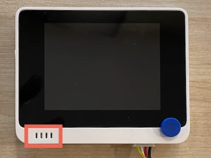

ដើម្បីបន្ថែមរមាស្តាប់ អ្នកអាចប្រើ [ReSpeaker 2-Mics Pi Hat](https://www.seeedstudio.com/ReSpeaker-2-Mics-Pi-HAT.html)។ នេះគឺជាបន្ទះខាងក្រៅមួយដែលមានម៉ៃក្រូហ្វូន MEMS 2 ตัว រួមទាំងច្រកភ្ជាប់រមាស្តាប់ និងច្រកតស្ពុតតាស់។

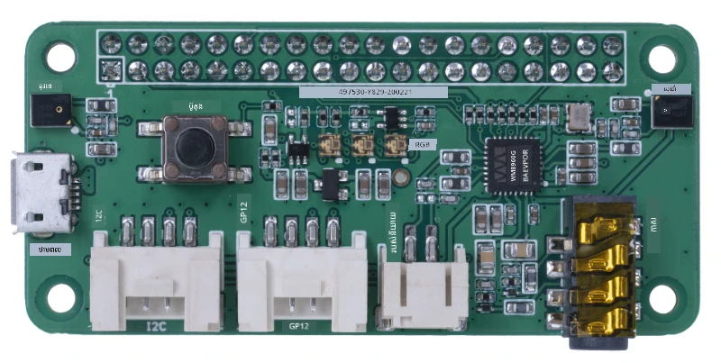

អ្នកត្រូវការបន្ថែមកាសស្តាប់ កន្សោមសម្លេងដែលមានកាស 3.5mm ឬរមាស្តាប់ដែលមានការតភ្ជាប់ JST ដូចជា [Mono Enclosed Speaker - 2W 6 Ohm](https://www.seeedstudio.com/Mono-Enclosed-Speaker-2W-6-Ohm-p-2832.html)។

ដើម្បីភ្ជាប់ ReSpeaker 2-Mics Pi Hat អ្នកត្រូវការតួខ្សែ jumper 40 pin-to-pin (ដែលហៅថា male-to-male)។

> 💁 ប្រសិនបើអ្នកមានសមត្ថភាពក្នុងការស្កេត អ្នកអាចប្រើ [40 Pin Raspberry Pi Hat Adapter Board For Wio Terminal](https://www.seeedstudio.com/40-Pin-Raspberry-Pi-Hat-Adapter-Board-For-Wio-Terminal-p-4730.html) ដើម្បីភ្ជាប់ ReSpeaker បាន។

អ្នកក៏ត្រូវការកាត SD មួយសម្រាប់ទាញយក និងបញ្ចេញសំឡេង។ Wio Terminal គ្រាន់តែគាំទ្រកាត SD ដល់ទំហំ 16GB ហើយត្រូវតែធ្វើទ្រង់ទ្រាយជា FAT32 ឬ exFAT។

### មុខងារ - ភ្ជាប់ ReSpeaker Pi Hat

1. ពីពេលដែល Wio Terminal បានផ្អាក ដាក់ ReSpeaker 2-Mics Pi Hat ទៅលើ Wio Terminal ដោយប្រើខ្សែ jumper និងច្រក GPIO នៅពីក្រោយ Wio Terminal៖

    ពិនិន័យជួរប៊ិចត្រូវភ្ជាប់ថែមខាងក្រោម៖

    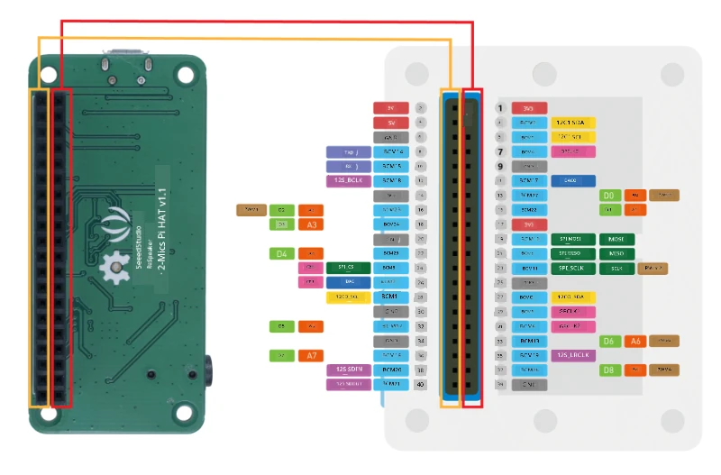

1. ដាក់ ReSpeaker និង Wio Terminal ដោយឲ្យច្រក GPIO ទៅកំពស់ខាងលើ និងនៅខាងឆ្វេង។

1. ចាប់ផ្តើមពីច្រកខាងលើឆ្វេងនៃច្រក GPIO នៅលើ ReSpeaker។ ភ្ជាប់ខ្សែ jumper pin-to-pin ពីច្រកខាងលើឆ្វេងនៃ ReSpeaker ទៅច្រកខាងលើឆ្វេងនៃ Wio Terminal។

1. សំណូមពរចូលច្រក GPIO ខាងឆ្វេងទាំងអស់។ ត្រូវប្រាកដថាប៊ិចភ្ជាប់រឹងមាំ។

    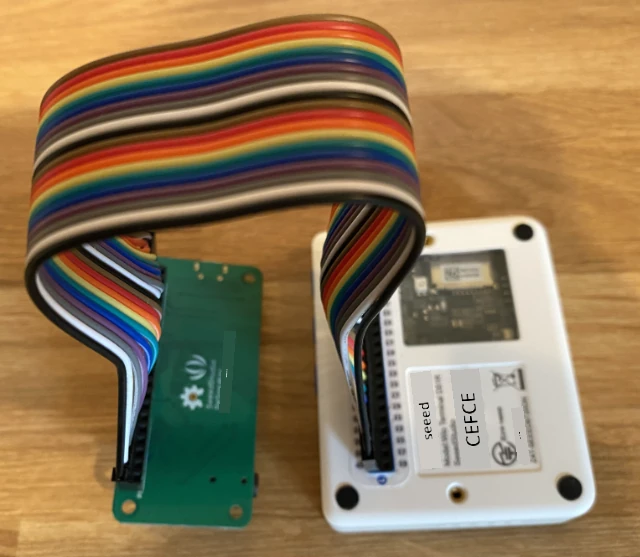

    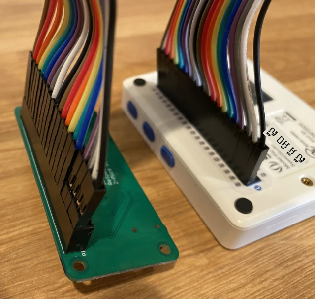

    > 💁 ប្រសិនបើខ្សែ jumper របស់អ្នកភ្ជាប់ជារបរផ្ទេរ ចូររក្សាទុកគ្រប់ខ្សែជាក្រុមមួយ - វាធ្វើឲ្យកាន់តែងាយស្រួលក្នុងការត្រួតពិនិត្យខ្សែទាំងអស់។

1. បន្តដំណើរការនេះដោយប្រើច្រក GPIO ខាងស្តាំនៃ ReSpeaker និង Wio Terminal។ ខ្សែទាំងនេះត្រូវជុំជុំខ្សែដែលបានភ្ជាប់រួចហើយ។

    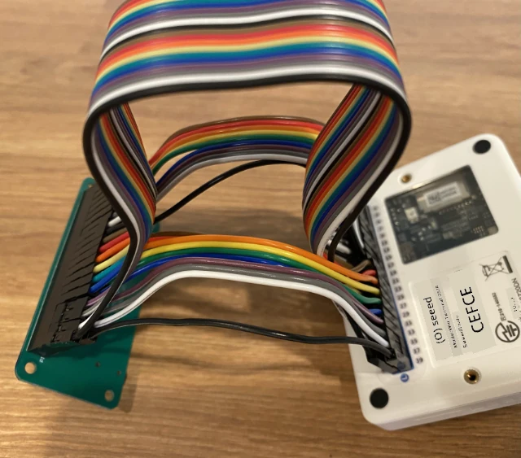

    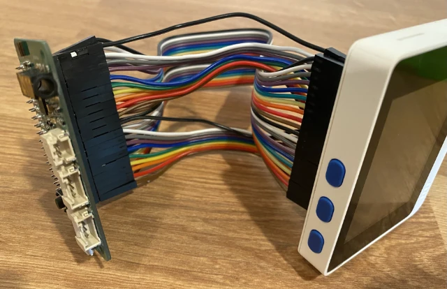

    > 💁 ប្រសិនបើខ្សែ jumper របស់អ្នកភ្ជាប់ជារបរផ្ទេរ សូមបំបែកវាទៅជាការបែងចែកពីរបៀប។ បញ្ជូនខ្សែមួយតាមជំហានម្នាក់នៃខ្សែដែលមានរួច។

    > 💁 អ្នកអាចប្រើសន្លឹកតិចស៊ីដឹកតួប៊ិចទៅជាក្រុមដើម្បីជួយឲ្យប៊ិចមិនចេញក្នុងពេលភ្ជាប់។
    >
    > 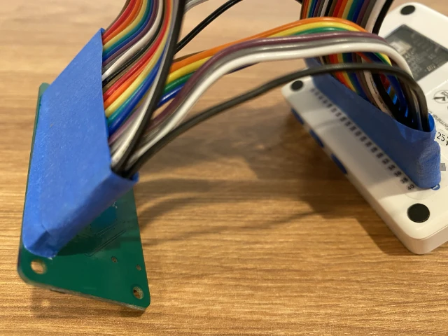

1. អ្នកត្រូវតែបន្ថែមរមាស្តាប់មួយ។

    * ប្រសិនបើអ្នកប្រើរមាស្តាប់ដែលមានខ្សែ JST សូមភ្ជាប់វាទៅច្រក JST នៅលើ ReSpeaker។

      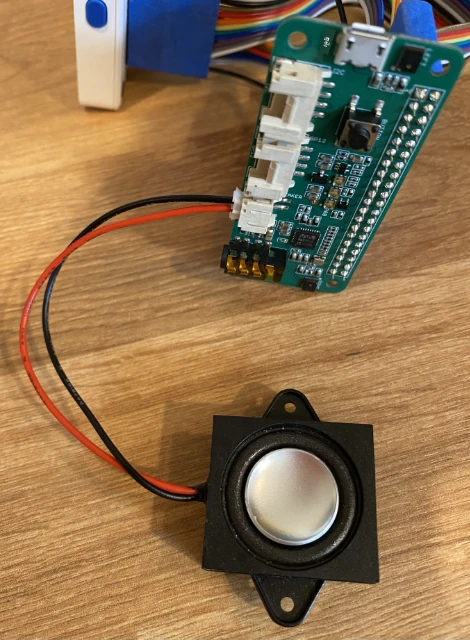

    * ប្រសិនបើអ្នកប្រើរមាស្តាប់ដែលមានច្រក 3.5mm ឬកាសស្តាប់ សូមដាក់វាទៅក្នុងច្រក 3.5mm។

      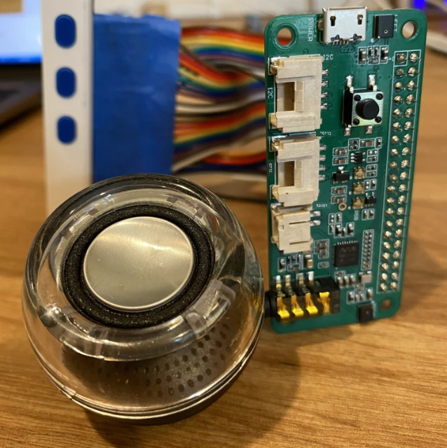

### មុខងារ - កំណត់ការតំឡើងកាត SD

1. ភ្ជាប់កាត SD ទៅកុំព្យូទ័ររបស់អ្នក ដោយប្រើឧបករណ៍អានខាងក្រៅប្រសិនបើអ្នកមិនមានច្រកកាត SD។

1. ធ្វើទ្រង់ទ្រាយកាត SD ដោយប្រើឧបករណ៍សមរម្យលើកុំព្យូទ័ររបស់អ្នក ប្រាកដថាប្រើប្រព័ន្ធឯកសារ FAT32 ឬ exFAT។

1. ដាក់កាត SD ទៅក្នុងច្រកកាត SD នៅខាងឆ្វេងនៃ Wio Terminal ក្រោមប៊ូតុងថាមពល។ ប្រាកដថាកាតគឺដេញចូលរួច និងមានសំឡេងចុច - អ្នកប្រហែលជាចាំបាច់ប្រើឧបករណ៍តូចមួយឬកាត SD ផ្សេងទៀតដើម្បីជួយដេញវាចូលខាងក្នុង។

    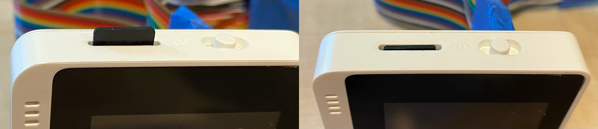

    > 💁 ដើម្បីដេញកាត SD ចេញ អ្នកត្រូវតែដេញវាបន្តិច ហើយវានឹងដេញចេញ។ អ្នកត្រូវការឧបករណ៍តូចដូចជាគ្រាប់ព្រួញឬកាត SD ផ្សេងទៀតដើម្បីធ្វើបែបនេះ។

---

<!-- CO-OP TRANSLATOR DISCLAIMER START -->
**ការបដិសេធ**៖  
ឯកសារនេះត្រូវបានបកប្រែដោយប្រើសេវាកម្មបកប្រែ AI [Co-op Translator](https://github.com/Azure/co-op-translator)។ ខណៈពេលដែលយើងខំប្រឹងផ្តល់ជូននូវភាពត្រឹមត្រូវ សូមយល់ដឹងថាការបកប្រែដោយស្វ័យប្រវត្តិអាចមានកំហុសឬភាពមិនត្រឹមត្រូវបាន។ ឯកសារដើមជាភាសាម្ចាស់ផ្ទាល់គួរត្រូវបានគេយកជាដើមឯកសារដែលមានសិទ្ធិក្នុងការបញ្ជាក់។ សម្រាប់ព័ត៌មានសំខាន់ៗ សូមផ្ដល់អាទិភាពការបកប្រែដោយអ្នកជំនាញមនុស្ស។ យើងមិនទទួលខុសត្រូវចំពោះការយល់ច្រឡំ ឬការបកប្រែខុសប្លែកណាមួយដែលកើតឡើងដោយសារការប្រើប្រាស់ការបកប្រែនេះទេ។
<!-- CO-OP TRANSLATOR DISCLAIMER END -->