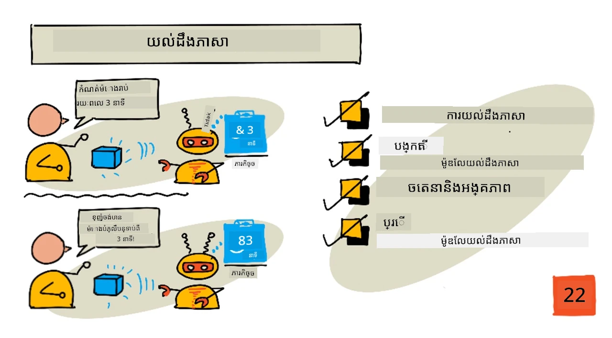
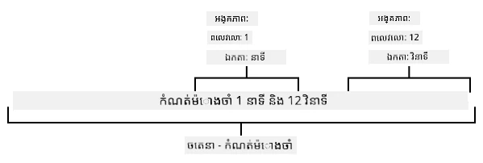
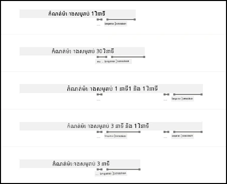

# យល់ពីភាសា



> Sketchnote by [Nitya Narasimhan](https://github.com/nitya). ចុចរូបភាពដើម្បីមើលជាថាតម្លៃធំជាងនេះ។

## ពិនិត្យមុនម៉ោងរៀន

[ពិនិត្យមុនម៉ោងរៀន](https://black-meadow-040d15503.1.azurestaticapps.net/quiz/43)

## ការណែនាំ

នៅមេរៀនចុងក្រោយអ្នកបានបម្លែងសំឡេងទៅជាអត្ថបទ។ ដើម្បីឱ្យវាបានប្រើប្រាស់ក្នុងការបង្កើតម៉ោងកំណត់លំដាប់ឆ្លាតវៃ កូដរបស់អ្នកត្រូវតែមានការយល់ដឹងអំពីអ្វីដែលបាននិយាយ។ អ្នកអាចសន្មតថាអ្នកប្រើប្រាស់នឹងនិយាយឃ្លាមួយដែលបានកំណត់ដូចជា "កំណត់ម៉ោង 3 នាទី" ហើយបំលែងពាក្យនោះដើម្បីទទួលបានរយៈពេលម៉ោងដែលត្រូវការ ប៉ុន្តែវាមិនងាយស្រួលសម្រាប់អ្នកប្រើប្រាស់ទេ។ ប្រសិនបើអ្នកប្រើប្រាស់និយាយថា "គ្រប់គ្រងម៉ោងសម្រាប់ 3 នាទី" អ្នកឬខ្ញុំនឹងយល់អ្វីដែលពួកគេមានន័យ ប៉ុន្តែកូដរបស់អ្នកមិននឹងយល់ទេ ព្រោះវានឹងរំពឹងថាឃ្លាមួយដែលបានកំណត់ប៉ុណ្ណោះ។

នេះជាកន្លែងដែលការយល់ភាសាចូលមក មានការប្រើប្រាស់ម៉ូដែល AI ក្នុងការបកស្រាយអត្ថបទ និងត្រឡប់មកវិញនូវព័ត៌មានលម្អិតដែលត្រូវការ ឧទាហរណ៍ អាចទទួលបាន "កំណត់ម៉ោង 3 នាទី" និង "កំណត់ម៉ោងសម្រាប់ 3 នាទី" ស្របព្រម ហើយយល់ថាត្រូវការម៉ោងសម្រាប់រយៈពេល 3 នាទី។

នៅមេរៀននេះ អ្នកនឹងរៀនអំពីម៉ូដែលការយល់ភាសា របៀបបង្កើតវា របៀបបណ្តុះវា និងបង្កើតប្រើប្រាស់វាដែលបានតាមកូដរបស់អ្នក។

នៅក្នុងមេរៀននេះ យើងនឹងមានប្រធានបទ៖

* [ការយល់ភាសា](#ការយល់ភាសា)
* [បង្កើតម៉ូដែលការយល់ភាសា](#បង្កើតម៉ូដែលការយល់ភាសា)
* [ចេតនា និងអង្គធាតុ](#ចេតនា-និងអង្គធាតុ)
* [ប្រើម៉ូដែលការយល់ភាសា](#ប្រើ​ម៉ូឌែល​អស់​ក្នុងការ​យល់​ភាសា)

## ការយល់ភាសា

មនុស្សបានប្រើភាសាដើម្បីទំនាក់ទំនងរយៈពេលរាប់រយពាន់ឆ្នាំ។ យើងទំនាក់ទំនងដោយមួលសញ្ញាល្អ ពាក្យ សំឡេង ឬសកម្មភាព ហើយយល់អ្វីដែលបាននិយាយ ដោយទាំងមានន័យនៃពាក្យ សំឡេងឬសកម្មភាព និងបរិបទរបស់វា។ យើងយល់ពីស្នេហាក្តី និងការសរសើរ ឱ្យពាក្យដូចគ្នាមានន័យខុសគ្នា នឹងអាស្រ័យលើសម្លេងសំឡេងរបស់យើង។

✅ សូមគិតអំពីសំណួរខ្លះដែលអ្នកបានមានចុងពេលថ្មីៗនេះ។ មានប៉ុន្មាននៃការសន្ទនាដែលពិបាកសម្រាប់កុំព្យូទ័រយល់ ដោយសារត្រូវការបរិបទ?

ការយល់ភាសា ដែលត្រូវបានគេហៅថាយល់ភាសាធម្មជាតិ គឺជាសមាសភាពក្នុងវិស័យបញ្ញាសិប្បនិម្មិតដែលហៅថាប្រព័ន្ធដំណើរការភាសាធម្មជាតិ (NLP) ហើយវាគ្របដណ្តប់ពីការយល់អត្ថន័យ អ្នកព្យាយាមយល់លម្អិតពីពាក្យឬវេយ្យាករណ៏។ ប្រសិនបើអ្នកប្រើជំនួយសំឡេងដូចជា Alexa ឬ Siri អ្នកបានប្រើសេវាកម្មការយល់ភាសា។ វាជាសេវាកម្ម AI ផ្ទាំងក្រោយដែលបម្លែង "Alexa, លេងអាល់ប៊ុមថ្មីចុងក្រោយដោយ Taylor Swift" ទៅកូនស្រីរបស់ខ្ញុំកំពុងរុញរាំក្នុងបន្ទប់នៅតាមចំកំពូលតន្រ្តីចំណូលចិត្តរបស់នាង។

> 💁 កុំព្យូទ័រមិនថាពួកវាបានឈានទៅឆ្ងាយប៉ុនណាក៏ដោយ វានៅតែត្រូវមានចម្ងាយវែងមិនទាន់យល់អត្ថបទពេញលេញទេ។ នៅពេលដែលយើងនិយាយអំពីការយល់ភាសាជាមួយកុំព្យូទ័រ យើងមិនមានន័យថាវាជាការទំនាក់ទំនងដូចមនុស្សមែនទេ តែយើងមានន័យថាប្រមួលយកពាក្យខ្លះៗហើយដកស្រង់ព័ត៌មានសំខាន់ៗដែលត្រូវការ។

ជាមនុស្ស យើងយល់ភាសាបានដោយគ្មានការគិតក្នុងចិត្តប្រាកដណាស់។ ប្រសិនបើខ្ញុំសួរមនុស្សម្នាក់ម្នាក់ផ្សេងទៀតថា "លេងអាល់ប៊ុមថ្មីចុងក្រោយដោយ Taylor Swift" ពួកគេនឹងយល់ភ្លាមៗថាខ្ញុំមានន័យអ្វី។ តែសម្រាប់កុំព្យូទ័រពិបាកជាងនេះ វាត្រូវតែយកពាក្យដែលបានបម្លែងពីសំឡេងទៅអត្ថបទ ហើយបញ្ចេញព័ត៌មានដូចខាងក្រោម៖

* ត្រូវតែចាក់តន្រ្តី
* តន្រ្តីត្រូវតែជារបស់តារាចម្រៀង Taylor Swift
* តន្រ្តីជាអាល់ប៊ុមមួយដែលមានច្រៀងជាច្រើនតាមលំដាប់
* Taylor Swift មានអាល់ប៊ុមជាច្រើន ដូច្នេះវាត្រូវតែតម្រៀបតាមលំដាប់ពេលវេលា ហើយកំណត់អាល់ប៊ុមថ្មីចុងក្រោយជាគោលដៅ

✅ សូមគិតអំពីវាក្យបញ្ជាទៀតដែលអ្នកបាននិយាយពេលធ្វើសំណើអ្នកផ្នែកទំនាក់ទំនង រួមទាំងការបញ្ជាទិញកាហ្វេ ឬសូមគ្រួសារដើម្បីផ្តល់អ្វីមួយ។ ព្យាយាមបំបែកវាចេញជាធាតុព័ត៌មានដែលកុំព្យូទ័រត្រូវគឺមកដកស្រង់ដោយដើម្បីយល់វេយ្យាករណ៍។

ម៉ូដែលការយល់ភាសា គឺជាម៉ូដែល AI ដែលបានបណ្តុះបណ្តាលដើម្បីដកព័ត៌មានសំខាន់ៗពីភាសា ហើយបន្ទាប់មកបានបណ្តុះបណ្តាលសម្រាប់បេសកកម្មជាក់លាក់ ដោយប្រើបច្ចេកទេសបង្វឹកប្តូរ (transfer learning) ដូចដែលអ្នកបានបណ្តុះម៉ូដែល Custom Vision ដោយប្រើតំបន់រូបភាពតិចតួច។ អ្នកអាចយកម៉ូដែលមួយ បន្ទាប់មកបណ្តុះបណ្តាលវាជាមួយអត្ថបទដែលអ្នកចង់ឱ្យវាយល់។

## បង្កើតម៉ូដែលការយល់ភាសា


អ្នកអាចបង្កើតម៉ូដែលការយល់ភាសាដោយប្រើ LUIS ដែលជាសេវាកម្មការយល់ភាសាមួយពីមីក្រូសូហ្វ ដែលជាផ្នែកមួយនៃសេវាកម្មជំនាញស្គាល់។

### បេសកកម្ម - បង្កើតធនធានអ្នកនិពន្ធ

ដើម្បីប្រើ LUIS អ្នកត្រូវបង្កើតធនធានអ្នកនិពន្ធមួយ។

1. ប្រើពាក្យបញ្ជាខាងក្រោមដើម្បីបង្កើតធនធានអ្នកនិពន្ធក្នុងក្រុមធនធាន `smart-timer` របស់អ្នក៖

    ```python
    az cognitiveservices account create --name smart-timer-luis-authoring \
                                        --resource-group smart-timer \
                                        --kind LUIS.Authoring \
                                        --sku F0 \
                                        --yes \
                                        --location <location>
    ```

    ជំនួស `<location>` ជាមួយទីតាំងដែលអ្នកបានប្រើនៅពេលបង្កើតក្រុមធនធាន។

    > ⚠️ LUIS មិនមាននៅក្នុងតំបន់ទាំងអស់ទេ ដូច្នេះប្រសិនបើអ្នកទទួលបានកំហុសដូចខាងក្រោម៖
    >
    > ```output
    > InvalidApiSetId: The account type 'LUIS.Authoring' is either invalid or unavailable in given region.
    > ```
    >
    > ជ្រើសរើសតំបន់ផ្សេងទៀត។

    នេះនឹងបង្កើតធនធាន LUIS អ្នកនិពន្ធជាឥតគិតថ្លៃ។

### បេសកកម្ម - បង្កើតកម្មវិធីការយល់ភាសា

1. បើកផ្ទាំងគេហទំព័រ LUIS នៅ [luis.ai](https://luis.ai?WT.mc_id=academic-17441-jabenn) ក្នុងកម្មវិធីរុករករបស់អ្នក ភ្ជាប់ចូលដោយគណនីដែលអ្នកកំពុងប្រើសម្រាប់ Azure។

1. អនុវត្តតាមការណែនាំនៅលើប្រអប់ដើម្បីជ្រើសរើសការជាវ Azure របស់អ្នក បន្ទាប់មកជ្រើសរើសធនធាន `smart-timer-luis-authoring` ដែលអ្នកទើបបង្កើត។

1. ពីបញ្ជី *កម្មវិធីសន្ទនា* ជ្រើសយកប៊ូតុង **កម្មវិធីថ្មី** ដើម្បីបង្កើតកម្មវិធីថ្មី។ ឈ្មោះកម្មវិធីថ្មីហៅថា `smart-timer` ហើយកំណត់ *វប្បធម៌* ជាភាសារបស់អ្នក។

    > 💁 មានវាលសម្រាប់ធនធានព្យាករណ៍។ អ្នកអាចបង្កើតធនធានទីពីរមួយសម្រាប់ព្យាករណ៍ ប៉ុន្តែធនធានអ្នកនិពន្ធឥតគិតថ្លៃអនុញ្ញាតឱ្យធ្វើព្យាករណ៍ 1,000 ដងក្នុងមួយខែ ដែលគួរតែគ្រប់គ្រាន់សម្រាប់ការអភិវឌ្ឍ ដូច្នេះអ្នកអាចទុកវាបោស។

1. អានតាមមគ្គុទេសក៍ដែលបង្ហាញបន្ទាប់ពីបង្កើតកម្មវិធី ដើម្បីយល់ពីជំហានដែលអ្នកត្រូវធ្វើដើម្បីបណ្តុះម៉ូដែលការយល់ភាសា។ បិទមគ្គុទេសក៍នេះពេលអ្នកបានធ្វើរួច។

## ចេតនា និងអង្គធាតុ

ការយល់ភាសាត្រូវបានគោលគ្រប់គ្រងដោយ *ចេតនា* និង *អង្គធាតុ*។ ចេតនាគឺជាទិសដៅនៃពាក្យ ដូចជា លេងតន្រ្តី កំណត់ម៉ោង ឬបញ្ជាទិញម្ហូប។ អង្គធាតូមានន័យថាចេតនាអំពីអ្វី ដូចជា អាល់ប៊ុម រយៈពេលម៉ោង ឬប្រភេទម្ហូប។ ឃ្លាមួយដែលម៉ូដែលវាយល់ គួរតែមានចេតនាយ៉ាងហោចណាស់មួយ ហើយអាចមានអង្គធាតុមួយចំនួន ឬច្រើន។

ឧទាហរណ៍ខ្លះ៖

| ឃ្លា                                             | ចេតនា          | អង្គធាតុ                                  |
| --------------------------------------------------- | ---------------- | ------------------------------------------ |
| "លេងអាល់ប៊ុមថ្មីចុងក្រោយដោយ Taylor Swift"          | *លេងតន្រ្តី*     | *អាល់ប៊ុមថ្មីចុងក្រោយដោយ Taylor Swift*   |
| "កំណត់ម៉ោង 3 នាទី"                               | *កំណត់ម៉ោង*    | *3 នាទី*                                   |
| "បោះបង់ម៉ោងរបស់ខ្ញុំ"                             | *បោះបង់ម៉ោង*  | គ្មាន                                       |
| "បញ្ជាទិញភីហ្សាជំរាប៣និងសាឡាដ Caesar មួយចាន"    | *បញ្ជាទិញម្ហូប* | *ភីហ្សាជំរាប៣*, *សាឡាដ Caesar*            |

✅ ជាមួយឃ្លាដែលអ្នកបានគិតមុននេះ អ្វីទៅជាចេតនា និងអង្គធាតុ ក្នុងឃ្លានោះ?

ដើម្បីបណ្តុះ LUIS ជាមួយវា អ្នកត្រូវដំបូងកំណត់អង្គធាតុ។ អង្គធាតុទាំងនេះអាចជាបញ្ជីមួយដែលកំណត់រួច ឬរៀនពីអត្ថបទ។ ឧទាហរណ៍ អ្នកអាចផ្តល់បញ្ជីម្ហូបដែលអាចរកបានពី​ម៉ឺនុយ​របស់អ្នក រួមជាមួយបម្លែងវា (ឬពាក្យស្រដៀង) នៃពាក្យនីមួយៗ ដូចជា *egg plant* និង *aubergine* ជាបម្លែងនៃ *aubergine*។ លUIS មានអង្គធាតុកំណត់រួចដែលអាចប្រើបានដូចជា លេខ និងទីតាំង។

សម្រាប់កំណត់ម៉ោង អ្នកអាចមានអង្គធាតុមួយសម្រាប់ឯកតារយៈពេល (នាទី ឬវិនាទី) និងមួយសម្រាប់លេខនៃនាទី ឬវិនាទី។ ក្នុងមួយឯកតានីមួយៗ អាចមានបម្លែងជាច្រើនដើម្បីគ្របដណ្តប់ទាំងមុខនិយាយរួម និងពហុប្រាប់ ដូចជា minute និង minutes។

បន្ទាប់ពីកំណត់អង្គធាតុរួច អ្នកបង្កើតចេតនា។ វាត្រូវបានរៀនដោយម៉ូដែលដោយផ្អែកលើឧទាហរណ៍ឃ្លាដែលអ្នកផ្តល់ (ហៅថា utterances)។ ឧទាហរណ៍ សម្រាប់ចេតនាកំណត់ម៉ោង *set timer* អ្នកអាចផ្តល់ឃ្លាដូចខាងក្រោម៖

* `set a 1 second timer`
* `set a timer for 1 minute and 12 seconds`
* `set a timer for 3 minutes`
* `set a 9 minute 30 second timer`

បន្ទាប់មកអ្នកប្រាប់ LUIS ថាផ្នែកណានៃឃ្លាទាំងនេះដែលបញ្ជូនទៅអង្គធាតុ៖



ឃ្លា `set a timer for 1 minute and 12 seconds` មានចេតនា `set timer`។ វាក៏មាន 2 អង្គធាតុដែលមាន 2 តម្លៃមួយៗ៖

|            | រយៈពេល | ឯកតា   |
| ---------- | ---: | ------ |
| 1 minute   | 1    | minute |
| 12 seconds | 12   | second |

ដើម្បីបណ្តុះម៉ូដែលល្អ អ្នកត្រូវការឧទាហរណ៍ឃ្លាជាច្រើន ដើម្បីគ្របដណ្តប់វិធីសាស្ត្រផ្សេងៗនៃការស្នើសុំនូវអ្វីមួយដូចៗគ្នា។

> 💁 ដូចជាមួយម៉ូដែល AI ប៉ុន្មានទិន្នន័យនិងទិន្នន័យត្រឹមត្រូវប៉ុណ្ណា ដែលអ្នកប្រើសម្រាប់បណ្តុះបណ្តាល ម៉ូដែលនឹងមានគុណភាពល្អប៉ុណ្ណា។

✅ សូមគិតអំពីវិធីផ្សេងៗដែលអ្នកអាចស្នើអំពីអ្វីមួយ និងរំពឹងថាមនុស្សម្នាក់នឹងយល់។

### បេសកកម្ម - បន្ថែមអង្គធាតុទៅម៉ូដែលការយល់ភាសា

សម្រាប់ម៉ោង អ្នកត្រូវបន្ថែមអង្គធាតុ 2 គឺមួយសម្រាប់ឯកតារយៈពេល (នាទី ឬវិនាទី) និងមួយសម្រាប់លេខនៃនាទី ឬវិនាទី។

អ្នកអាចរកការណែនាំដើម្បីប្រើផ្ទាំងគេហទំព័រ LUIS ក្នុងឯកសារ [Quickstart: Build your app in LUIS portal documentation on Microsoft docs](https://docs.microsoft.com/azure/cognitive-services/luis/luis-get-started-create-app?WT.mc_id=academic-17441-jabenn)។

1. ពីផ្ទាំងគេហទំព័រ LUIS ជ្រើស *Entities* ហើយបន្ថែមអង្គធាតុ *number* ដែលបានកំណត់រួច ដោយចុចប៊ូតុង **Add prebuilt entity** ហើយជ្រើស *number* ពីបញ្ជី។

1. បង្កើតអង្គធាតុថ្មីសម្រាប់ឯកតាពេលវេលា ដោយប្រើប៊ូតុង **Create**។ ឈ្មោះអង្គធាតុ `time unit` ហើយកំណត់ប្រភេទជា *List*។ បន្ថែមតម្លៃ `minute` និង `second` ទៅក្នុងបញ្ជី *Normalized values* ហើយបន្ថែមមុខនិយាយទាំងឯកតា និងពហុត្រូវទៅក្នុងបញ្ជី *synonyms*។ ចុច `return` បន្ទាប់ពីបន្ថែមមុខនិយាយនីមួយៗដើម្បីបន្ថែមវាចូលក្នុងបញ្ជី។

    | តម្លៃធម្មតា  | មុខនិយាយ         |
    | ------------ | ----------------- |
    | minute       | minute, minutes   |
    | second       | second, seconds   |

### បេសកកម្ម - បន្ថែមចេតនាទៅម៉ូដែលការយល់ភាសា

1. ពីផ្ទាំង *Intents* ចុចប៊ូតុង **Create** ដើម្បីបង្កើតចេតនាថ្មី។ ឈ្មោះចេតនា `set timer`។

1. ក្នុងឧទាហរណ៍ សូមបញ្ចូលវិធីផ្សេងៗដើម្បីកំណត់ម៉ោងប្រើរយៈពេលនាទី វិនាទី និងរួមបញ្ចូលគ្នា។ ឧទាហរណ៍អាចមាន៖

    * `set a 1 second timer`
    * `set a 4 minute timer`
    * `set a four minute six second timer`
    * `set a 9 minute 30 second timer`
    * `set a timer for 1 minute and 12 seconds`
    * `set a timer for 3 minutes`
    * `set a timer for 3 minutes and 1 second`
    * `set a timer for three minutes and one second`
    * `set a timer for 1 minute and 1 second`
    * `set a timer for 30 seconds`
    * `set a timer for 1 second`

    ផ្សំចំនួនជាអក្សរនិងលេខគណនាដើម្បីឱ្យម៉ូដែលរៀនទទួលបានទាំងពីរ។

1. នៅពេលអ្នកបញ្ចូលឧទាហរណ៍នីមួយៗ LUIS នឹងចាប់ផ្តើមរកឃើញអង្គធាតុ ហើយនឹងគូរសំគាល់ហើយដាក់ស្លាកអំពីអង្គធាតុដែលបានស្គាល់។

    

### បេសកកម្ម - បណ្តុះ និងសាកល្បងម៉ូដែល

1. បន្ទាប់ពីកំណត់អង្គធាតុនិងចេតនា អ្នកអាចបណ្តុះម៉ូដែលដោយប្រើប៊ូតុង **Train** នៅម៉ឺនុយខាងលើ។ ជ្រើសប៊ូតុងនេះ ហើយម៉ូដែលនឹងបណ្តុះក្នុងរយៈពេលប៉ុន្មានវិនាទី។ ប៊ូតុងនឹងជារឺសពណ៌ប្រផេះពេលបណ្តុះ ហើយអាចប្រើបានវិញនៅពេលបញ្ចប់។

1. ជ្រើសប៊ូតុង **Test** ពីម៉ឺនុយខាងលើ ដើម្បីសាកល្បងម៉ូដែលការយល់ភាសា។ បញ្ចូលអត្ថបទដូចជា `set a timer for 5 minutes and 4 seconds` ហើយចុច return។ ឃ្លានឹងបង្ហាញនៅក្នុងប្រអប់ក្រោមប្រអប់អត្ថបទដែលអ្នកបានវាយបញ្ចូល ហើយក្រោមនោះគឺជាចេតនាដែលទទួលបានពិន្ទុខ្ពស់បំផុត (top intent) ដែលគួរតែជាចេតនា `set timer`។ ឈ្មោះចេតនានឹងតាមដានដោយភាគរយនៃលទ្ធផលល្អ។

1. ជ្រើសជម្រើស **Inspect** ដើម្បីមើលបំបែកលទ្ធផល។ អ្នកនឹងឃើញចេតនាដែលបានទទួលពិន្ទុខ្ពស់ជាមួយភាគរយបំផុត ជាមួយនឹងបញ្ជីអង្គធាតុដែលបានស្គាល់។

1. បិទផ្ទាំង *Test* ពេលអ្នកបានសាកល្បងរួច។

### បេសកកម្ម - បោះពុម្ពផ្សាយម៉ូដែល

ដើម្បីប្រើម៉ូដែលនេះពីក្នុងកូដ អ្នកត្រូវបោះពុម្ពផ្សាយវា។ នៅពេលបោះពុម្ពផ្សាយពី LUIS អ្នកអាចបោះពុម្ពផ្សាយទៅបរិយាកាស staging សម្រាប់ការសាកល្បង ឬបរិយាកាសផលិតសម្រាប់ចេញផ្សាយពេញលេញ។ នៅក្នុងមេរៀននេះ បរិយាកាស staging គឺគ្រប់គ្រាន់។
1. ពី​បណ្តាញ LUIS portal ជ្រើសរើស​ប៊ូតុង **Publish** ពី​ម៉ឺនុយ​ខាងលើ។

1. ធ្វើ​ឱ្យ​ប្រាកដ​ថា បាន​ជ្រើសរើស *Staging slot* រួច​ជ្រើសរើស **Done**។ អ្នក​នឹង​មើលឃើញ​ការ​ជូនដំណឹង​ពេល‌ដែលកម្មវិធី​ត្រូវ​បាន​ផ្សាយ។

1. អ្នកអាច​សាកល្បង​ចំណែកនេះ​ផ្អែកលើ curl។ ដើម្បី​បង្កើត​ពាក្យបញ្ជា curl អ្នកត្រូវ​ការ​តម្លៃបីគឺ - ចំណុចបញ្ចប់ (endpoint), លេខសម្គាល់កម្មវិធី (App ID) និង​កូនសោ API។ តម្លៃ​ទាំងនេះ​អាចចូល​ដំណើរការ​បាន​ពី​ហៅ​ថ្មី **MANAGE** ដែល​អាច​ជ្រើសរាបពី​ម៉ឺនុយ​ខាងលើ។

    1. ពីផ្នែក *Settings* ចំលង App ID

    1. ពីផ្នែក *Azure Resources* ជ្រើស *Authoring Resource*, ហើយ​ចំលង *Primary Key* និង *Endpoint URL*

1. សូមដំណើរការ​ពាក្យបញ្ជា curl ខាងក្រោម​ក្នុង​ពាក្យបញ្ជា Command Prompt ឬ Terminal របស់​អ្នក៖

    ```sh
    curl "<endpoint url>/luis/prediction/v3.0/apps/<app id>/slots/staging/predict" \
          --request GET \
          --get \
          --data "subscription-key=<primary key>" \
          --data "verbose=false" \
          --data "show-all-intents=true" \
          --data-urlencode "query=<sentence>"
    ```

    ជំនួស `<endpoint url>` ជាមួយ URL ចំណុចបញ្ចប់​ពី​ព័ត៌មាន *Azure Resources*។

    ជំនួស `<app id>` ជាមួយ App ID ពីផ្នែក *Settings*។

    ជំនួស `<primary key>` ជាមួយ Primary Key ពីផ្នែក *Azure Resources*។

    ជំនួស `<sentence>` ជាមួយ​វចនាធិប្បាយ​ដែល​អ្នក​ចង់​សាកល្បង។

1. លទ្ធផលនៃ​ការ​ហៅ​នេះ​នឹង​ជា​ឯកសារ JSON ដែល​ពិពណ៌នា​ពី​សំណួរ, ចេតនា​កំពូល, និង​បញ្ជីអង្គភាព​ត្រូវបាន​បំបែក​តាម​ប្រភេទ។

    ```JSON
    {
        "query": "set a timer for 45 minutes and 12 seconds",
        "prediction": {
            "topIntent": "set timer",
            "intents": {
                "set timer": {
                    "score": 0.97031575
                },
                "None": {
                    "score": 0.02205793
                }
            },
            "entities": {
                "number": [
                    45,
                    12
                ],
                "time-unit": [
                    [
                        "minute"
                    ],
                    [
                        "second"
                    ]
                ]
            }
        }
    }
    ```

    JSON ខាងលើ​មក​ពី​ការ​សំណួរ​ជាមួយ `set a timer for 45 minutes and 12 seconds`៖

    * `set timer` គឺ​ជា​ចេតនា​កំពូល​ដោយ​មានប្រភេទតម្លៃ 97%។
    * មាន​ប្រុងចំនួនពីរដែលត្រូវបានស្គាល់, `45` និង `12`។
    * មាន​ប្រុង​តម្លៃម៉ោងពីរដែល​ត្រូវបាន​ស្គាល់, `minute` និង `second`។


## ប្រើ​ម៉ូឌែល​អស់​ក្នុងការ​យល់​ភាសា

ពេលដែល​ត្រូវ​បាន​ផ្សាយហើយ ម៉ូឌែល LUIS អាច​ត្រូវ​បានហៅ​ពី​កូដ។ ក្នុងមេរៀន​មុន អ្នក​បាន​ប្រើ IoT Hub ដើម្បី​គ្រប់គ្រង​ការប្រាស្រ័យទាក់ទង​ជាមួយ​សេវាកម្ម cloud ដោយ​ជញ្ជូន​ទិន្នន័យ telemetry និង​ស្តាប់​ការបញ្ជា។ ពីនេះ​ជា asynchronous ល្អណាស់ - ពេលដែល​បាន​ផ្ញើ telemetry កូដ​របស់​អ្នក​មិន​ចាំ​រង់​ចាំ​ការ​ផ្លាស់ប្តូរ ក៏បើ​សេវាកម្ម cloud បានផ្អាក អ្នក​នឹង​មិន​ដឹង។

សម្រាប់​ដៃម៉ាញលឿន (smart timer) យើង​ចង់​ស្នើ​ឆ្លើយ​តប​បន្ទាន់ ដូច្នេះ​អ្នក​អាចប្រាប់អ្នកប្រើថា ដៃម៉ាញបានដាក់ហើយ ឬ​ព្រមានថា​សេវាកម្ម cloud មិនអាចប្រើបាន។ ដើម្បីធ្វើបែបនេះ ឧបករណ៍ IoT របស់យើង​នឹង​ហៅ​វេបសាយ​ចំណុចបញ្ចប់​ដោយផ្ទាល់ ជំនួស​ការ ទុកចិត្ត​លើ IoT Hub។

ជំនួស​ហៅ LUIS ពីឧបករណ៍ IoT អ្នកអាច​ប្រើ​កូដ serverless ជាមួយប្រភេទ trigger ផ្សេងៗមួយគឺជា HTTP trigger។ វា​អនុញ្ញាត​ឲ្យ​កម្មវិធី​អនុគមន៍​របស់​អ្នក​ស្តាប់​សំណើ REST ហើយ​ឆ្លើយតប​ជាមួយវា។ អនុគមន៍​នេះ​នឹងជា​ចំណុចបញ្ចប់ REST ដែលឧបករណ៍​អ្នកអាចហៅ។

> 💁 បើទោះបី​អ្នក​អាចហៅ LUIS ដោយផ្ទាល់​ពី​ឧបករណ៍ IoT អ្នកកាន់តែ​ល្អប្រើ​កូដ​បែប serverless។ ដូច្នេះ​នៅពេល​មានបំណង​ផ្លាស់ប្ដូរ​កម្មវិធី LUIS ដែលអ្នកហៅ ដូចជា​ពេល​ដែល​អ្នកបណ្ដុះម៉ូឌែល​ល្អជាងមុន ឬបណ្ដុះម៉ូឌែលភាសាផ្សេង អ្នកគ្រាន់តែ​ត្រូវ​បន្ទាន់សម័យ​កូដ cloud តែប៉ុណ្ណោះ មិន​ចាំ​បាច់​ដាក់​កូដ​ឡើង​វិញ​ក្នុង​ឧបករណ៍ IoT ច្រើនរាប់ពាន់ឬលាន​គ្រឿងឡើយ។

### ប៉ះប៉ង - បង្កើតកម្មវិធី serverless functions

1. បង្កើតកម្មវិធី Azure Functions ដែលមានឈ្មោះ `smart-timer-trigger` ហើយបើកវា​នៅក្នុង VS Code

1. បន្ថែម HTTP trigger ទៅកម្មវិធីនេះឈ្មោះ `speech-trigger` ដោយប្រើពាក្យបញ្ជាខាងក្រោមពី terminal ក្នុង VS Code៖

    ```sh
    func new --name text-to-timer --template "HTTP trigger"
    ```

    នេះ​នឹងបង្កើត HTTP trigger មានឈ្មោះ `text-to-timer`។

1. សាកល្បង HTTP trigger ដោយ​រត់កម្មវិធី functions app។ ពេលវា​រត់ អ្នក​នឹង​ឃើញ​ចំណុចបញ្ចប់​បង្ហាញ​នៅ​លើលទ្ធផល៖

    ```output
    Functions:
    
            text-to-timer: [GET,POST] http://localhost:7071/api/text-to-timer
    ```

    សាកល្បង​នេះ​ដោយ​ផ្ទុក URL [http://localhost:7071/api/text-to-timer](http://localhost:7071/api/text-to-timer) នៅ​ក្នុង​កម្មវិធី រុករកគេហទំព័រ។

    ```output
    This HTTP triggered function executed successfully. Pass a name in the query string or in the request body for a personalized response.
    ```

### ប៉ះប៉ង - ប្រើម៉ូឌែល​អស់​ក្នុងការ​យល់​ភាសា

1. SDK សម្រាប់ LUIS មាន​នៅតាម ប៉ែគ Pip។ បន្ថែមបន្ទាត់ខាងក្រោម​ចូលទៅ ឯកសារ `requirements.txt` ដើម្បី​បន្ថែម​ការពឹងពាក់លើ​ប៉ែគ​នេះ៖

    ```sh
    azure-cognitiveservices-language-luis
    ```

1. ធ្វើ​ឱ្យ VS Code terminal មាន virtual environment នៅ​ក្នុង​សកម្មភាព ហើយ​រត់​ពាក្យបញ្ជា​ខាងក្រោម​ដើម្បី​ដំឡើង​ប៉ែគ Pip៖

    ```sh
    pip install -r requirements.txt
    ```

    > 💁 បើ​ទទួល​បាន​កំហុស អ្នកប្រហែល​ជាត្រូវ​ឡើងកម្រិត pip ដោយ​ប្រើ​ពាក្យ​បញ្ជា​ខាងក្រោម៖
    >
    > ```sh
    > pip install --upgrade pip
    > ```

1. បន្ថែម​បញ្ចី​ថ្មី​ឲ្យ​ឯកសារ `local.settings.json` សម្រាប់ API Key, Endpoint URL និង App ID របស់ LUIS ពី​ប៊ូតុង **MANAGE** នៅក្នុង portal LUIS:

    ```JSON
    "LUIS_KEY": "<primary key>",
    "LUIS_ENDPOINT_URL": "<endpoint url>",
    "LUIS_APP_ID": "<app id>"
    ```

    ជំនួស `<endpoint url>` ជាមួយ URL ចំណុចបញ្ចប់​ពីផ្នែក *Azure Resources* នៃ​ប៊ូតុង **MANAGE**។ វានឹងមាន​រូបរាង `https://<location>.api.cognitive.microsoft.com/`។

    ជំនួស `<app id>` ជាមួយ App ID ពី​ផ្នែក *Settings* នៃ​ប៊ូតុង **MANAGE**។

    ជំនួស `<primary key>` ជាមួយ Primary Key ពីផ្នែក *Azure Resources* នៃ​ប៊ូតុង **MANAGE**។

1. បន្ថែម​កូដទីមួយ​ដោយបញ្ចូល​សេចក្ដីដូចខាងក្រោម​ក្នុង​ឯកសារ `__init__.py`៖

    ```python
    import json
    import os
    from azure.cognitiveservices.language.luis.runtime import LUISRuntimeClient
    from msrest.authentication import CognitiveServicesCredentials
    ```

    កូដ​នេះ​នាំចូលបណ្ណាល័យប្រព័ន្ធមួយចំនួន និង​បណ្ណាល័យសម្រាប់​ទំនាក់ទំនង​ជាមួយ LUIS។

1. លុប​អត្ថបទ​នៅក្នុង​មុខងារ `main` ហើយ​បន្ថែម​កូដខាងក្រោម៖

    ```python
    luis_key = os.environ['LUIS_KEY']
    endpoint_url = os.environ['LUIS_ENDPOINT_URL']
    app_id = os.environ['LUIS_APP_ID']
    
    credentials = CognitiveServicesCredentials(luis_key)
    client = LUISRuntimeClient(endpoint=endpoint_url, credentials=credentials)
    ```

    កូដ​នេះ​ផ្ទុក​តម្លៃ​ដែល​អ្នក​បានបន្ថែម​ក្នុង​ឯកសារ `local.settings.json` របស់កម្មវិធី LUIS របស់​អ្នក បង្កើត​វត្ថុ credentials ជាមួយ API key របស់អ្នក ហើយ​បង្កើត client LUIS ដើម្បី​ទំនាក់ទំនង​ជាមួយកម្មវិធី LUIS របស់អ្នក។

1. HTTP trigger នេះ​នឹង​ត្រូវហៅ​ដោយ​ផ្ញើ​អត្ថបទ​សម្រាប់​យល់​ជា JSON ដែល​អត្ថបទ​ទាំងនោះ​នៅក្នុង​គុណលក្ខណៈ​ហៅ `text`។ កូដ​ខាងក្រោម​នាំចេញ​តម្លៃ​ពី​រូបរាងនៃ​សំណើ HTTP ហើយ​កត់ត្រា​ទៅកុងសូល។ សូមបន្ថែម​កូដនេះ​ក្នុង​មុខងារ `main`៖

    ```python
    req_body = req.get_json()
    text = req_body['text']
    logging.info(f'Request - {text}')
    ```

1. សំណើ​ព្យាករ​ត្រូវបាន​ទាមទារ​ពី LUIS ដោយ​បញ្ជូន​សំណើ​ព្យាករ​ជា​ឯកសារ JSON ដែល​មាន​អត្ថបទ​ត្រូវ​ព្យាករ។ បង្កើត​វា​ដោយ​កូដ​ខាងក្រោម៖

    ```python
    prediction_request = { 'query' : text }
    ```

1. បន្ទាប់មក​អាច​ដាក់សំណើ​នេះ​ទៅ LUIS ដោយ​ប្រើ staging slot ដែល​កម្មវិធី​របស់​អ្នក​ត្រូវ​បាន​ផ្សាយទៅ៖

    ```python
    prediction_response = client.prediction.get_slot_prediction(app_id, 'Staging', prediction_request)
    ```

1. សំណើប៉ាន់ប្រមាណ​បង្ហាញ​ចេតនា​កំពូល (top intent) គឺ​ជា​ចេតនា​ដែល​មានពិន្ទុ​ព្យាករណ៍​ខ្ពស់បំផុត ជាមួយគ្នានឹង​ខ្សែអង្គភាព។ ប្រសិនបើ​ចេតនា​កំពូល​គឺជា `set timer`, អ្នកអាច​អាន​អង្គភាព​ដើម្បី​ទាញយក​ពេលវេលាសម្រាប់​ដៃម៉ាញ៖

    ```python
    if prediction_response.prediction.top_intent == 'set timer':
        numbers = prediction_response.prediction.entities['number']
        time_units = prediction_response.prediction.entities['time unit']
        total_seconds = 0
    ```

    អង្គភាព `number` នឹងជា​អារេនៃ​លេខ។ ឧទាហរណ៍ បើអ្នកថា *"Set a four minute 17 second timer."*, អារេ `number` នឹង​មាន​ពេញត្រឹមពីរ​ចំនួន​គឺ ៤ និង ១៧។

    អង្គភាព `time unit` នឹង​ជា​អារេនៃ​អារេនៃ​ស្នូល​អក្សរ ដែល​ភាគី​នីមួយៗ​ជា​អារេស្នូល​អក្សរនៅក្នុង​អារេ។ ឧទាហរណ៍ បើអ្នកថា *"Set a four minute 17 second timer."*, អារេ `time unit` នឹង​មាន ២​អារេ ដែលមាន​តម្លៃ​តែមួយ​នៅក្នុងនីមួយៗ​គឺ `['minute']` និង `['second']`។

    JSON នៃ​អង្គភាពទាំងនេះ​សម្រាប់ *"Set a four minute 17 second timer."* គឺជា៖

    ```json
    {
        "number": [4, 17],
        "time unit": [
            ["minute"],
            ["second"]
        ]
    }
    ```

    កូដ​នេះ​ក៏​កំណត់​តម្លៃ​គិត​សរុប​នៃ​ពេលវេលា​ដៃម៉ាញ​ជា​វិនាទី។ តម្លៃ​នេះ​នឹង​គិតបញ្ចូល​តាម​តម្លៃ​ពីអង្គភាពនេះ។

1. អង្គភាព​មិន​ត្រូវ​បាន​ភ្ជាប់ ដែលទើបអាច​យក​អត្រា​ពីពួកវា។ វា​នឹង​ធ្វើជា​តំបន់​ទិស​ដែល​បាន​និយាយ ដូច្នេះ​ទីតាំង​ក្នុង​អារេ​អាច​ប្រើ​ដើម្បី​កំណត់​នូវ​លេខណាមួយ​ត្រូវ​ត្‍វី​ជាមួយ​នឹង​តុក​លក្ខណៈ​ពេលវេលា។ ឧទាហរណ៍៖

    * *"Set a 30 second timer"* - នេះ​មិន​មាន​លេខ​តែមួយ​គឺ `30` និង​មួយ​តុក `second` ដូច្នេះ​លេខតែមួយ​នឹង​ត្រូវគ្នា​ជាមួយ​តុកតែមួយ។
    * *"Set a 2 minute and 30 second timer"* - នេះ​មាន​ពីរ​លេខ គឺ `2` និង `30` និង​ពីរ​តុក គឺ `minute` និង `second` ដូច្នេះ​លេខទីមួយ​នឹងសម្រាប់​តុក​ទីមួយ (2 នាទី) និង​លេខ​ទីពីរ​សម្រាប់​តុក​ទីពីរ (30 វិនាទី)។

    កូដ​ខាងក្រោម​នេះ​ទាញកំណត់​ចំនួនធាតុ​នៅក្នុង​អង្គភាព​លេខ ហើយ​ប្រើ​វា​ដើម្បី​យក​ធាតុ​ទីមួយ​ពីគ្រប់​អារេ ហើយ​បន្ទាប់​មកធាតុ​ទីពីរ និងអញ្ចឹងតទៅ។ បន្ថែម​វានៅ​ក្នុង `if` block។

    ```python
    for i in range(0, len(numbers)):
        number = numbers[i]
        time_unit = time_units[i][0]
    ```

    សម្រាប់ *"Set a four minute 17 second timer."* វានឹង​ចាប់ផ្តើម​ដោយម្តងពីរ ដោយ​ផ្ដល់​តម្លៃ​ខាងក្រោម៖

    | ចំនួន​ជុំវិញ | `number` | `time_unit` |
    | --------------: | -------: | ----------- |
    | 0               | 4        | minute      |
    | 1               | 17       | second      |

1. ក្នុងជុំវិញ​នេះ សូម​ប្រើ​លេខ និង​តុក​ពេលវេលា​ដើម្បី​គណនាពេលវេលាសរុប​សម្រាប់ដៃម៉ាញ ដោយ​បន្ថែម 60 វិនាទី​សម្រាប់​ម каждую минуту និង​លេខ​វិនាទី​សម្រាប់​វិញ​ទេ។

    ```python
    if time_unit == 'minute':
        total_seconds += number * 60
    else:
        total_seconds += number
    ```

1. ក្រៅជុំវិញ​នេះ តាម​អង្គភាព សូម​កត់ត្រាពេលវេលាសរុប​សម្រាប់​ដៃម៉ាញ:

    ```python
    logging.info(f'Timer required for {total_seconds} seconds')
    ```

1. ចំនួន​វិនាទី​ទាំងអស់ ត្រូវ​ត្រឡប់​ពី​មុខងារ​ជា​លទ្ធផល HTTP។ នៅ​ចុងប្លុក `if`, បន្ថែម​កូដ​ខាងក្រោម៖

    ```python
    payload = {
        'seconds': total_seconds
    }
    return func.HttpResponse(json.dumps(payload), status_code=200)
    ```

    កូដ​នេះ​បង្កើត​ទម្រង់​អត្ថបទ​ផ្ទុក​ចំនួន​វិនាទី​សរុប​សម្រាប់ដៃម៉ាញ បំលែងវា​ទៅជា​សួត JSON ហើយ​បញ្ចូន​វា​ជា​លទ្ធផល HTTP ជាមួយ​កូដ​ស្ថានភាព ២០០ ដែលមាន​ន័យថា​ ការហៅ​បាន​ជោគជ័យ។

1. ចុងបញ្ចប់ ក្រៅ `if` block ដោះស្រាយ​ករណីដែល​ចេតនា​មិន​ត្រូវ​បាន​ស្គាល់​ដោយ​ត្រឡប់​កូដ​កំហុស៖

    ```python
    return func.HttpResponse(status_code=404)
    ```

    404 ជា​កូដ​ស្ថានភាព​សម្រាប់ *not found*។

1. រត់កម្មវិធី functions app ហើយ​សាកល្បង​វា​ដោយប្រើ curl។

    ```sh
    curl --request POST 'http://localhost:7071/api/text-to-timer' \
         --header 'Content-Type: application/json' \
         --include \
         --data '{"text":"<text>"}'
    ```

    ជំនួស `<text>` ជាមួយ​អត្ថបទ​នៃ​សំណើ​របស់​អ្នក, ឧទាហរណ៍ `set a 2 minutes 27 second timer`។

    អ្នក​នឹង​ឃើញ​ចេញលទ្ធផល​ខាងក្រោម​ពី​កម្មវិធី functions app៖

    ```output
    Functions:

            text-to-timer: [GET,POST] http://localhost:7071/api/text-to-timer
    
    For detailed output, run func with --verbose flag.
    [2021-06-26T19:45:14.502Z] Worker process started and initialized.
    [2021-06-26T19:45:19.338Z] Host lock lease acquired by instance ID '000000000000000000000000951CAE4E'.
    [2021-06-26T19:45:52.059Z] Executing 'Functions.text-to-timer' (Reason='This function was programmatically called via the host APIs.', Id=f68bfb90-30e4-47a5-99da-126b66218e81)
    [2021-06-26T19:45:53.577Z] Timer required for 147 seconds
    [2021-06-26T19:45:53.746Z] Executed 'Functions.text-to-timer' (Succeeded, Id=f68bfb90-30e4-47a5-99da-126b66218e81, Duration=1750ms)
    ```

    ការហៅ​ចូល curl នឹង​តប​តាម​ខាងក្រោម៖

    ```output
    HTTP/1.1 200 OK
    Date: Tue, 29 Jun 2021 01:14:11 GMT
    Content-Type: text/plain; charset=utf-8
    Server: Kestrel
    Transfer-Encoding: chunked
    
    {"seconds": 147}
    ```

    ចំនួន​វិនាទី​សម្រាប់ដៃម៉ាញ​នេះ​មាន​នៅក្នុង​តម្លៃ `"seconds"`។

> 💁 អ្នក​អាច​រក​កូដ​នេះ​ក្នុង​ថត [code/functions](../../../../../6-consumer/lessons/2-language-understanding/code/functions)។

### ប៉ះប៉ង - ធ្វើ​ឱ្យ​មុខងារ​របស់​អ្នក​មានស្រាប់​ដល់ឧបករណ៍ IoT របស់​អ្នក

1. ដើម្បី​ឲ្យ​ឧបករណ៍ IoT របស់​អ្នក​ហៅ​ចំណុចបញ្ចប់ REST នេះ វា​ត្រូវ​បាន​ដឹង URL។ ពេល​អ្នក​ធ្វើ​ការ​ចូល​មុន សូម​ប្រើ `localhost` ដែល​ជា​ជំហាន​ពង្រីក​សម្រាប់​ចូល​ចំណុចបញ្ចប់ REST នៅ​លើ​គ្រឿងបរិក្ខារ​ដូច​ខ្លួន។ ដើម្បី​ឲ្យ​ឧបករណ៍ IoT របស់​អ្នក​អាច​ចូលដំណើរការ ទាមទារ​អ្នក​ផ្សព្វផ្សាយ​ទៅ cloud ឬ​ទទួល IP address របស់​អ្នក​សម្រាប់​ចូល​ដំណើរការ​នៅ​ក្នុង​ស្រុក។

    > ⚠️ បើ​អ្នក​កំពុង​ប្រើ Wio Terminal វា​ងាយស្រួលដំណើរការ functions app នៅក្នុង​តំបន់ស្រុក ដោយ​សារតែ​មាន​ការពឹងផ្អែកលើ​បណ្ណាល័យ​ដែល​បង្ខំ​ឱ្យ​អ្នកមិន​អាច​ដាក់​ផ្ទុក functions app ដូច​ពេលមុន​ទៀតទេ។ ដំណើរការ functions app នៅក្នុង​តំបន់ស្រុក ហើយ​ចូល​ដំណើរការ​តាម IP address កុំព្យូទ័រ​របស់​អ្នក។ បើ​អ្នក​ចង់​ដាក់​ផ្ទុក​ទៅ cloud ខ្សែព័ត៌មាន​នឹង​ត្រូវ​បាន​ផ្ដល់​នៅក្នុង​មេរៀន​បន្តបន្ទាប់។

    * ផ្សាយកម្មវិធី Functions app - អនុវត្ត​តាម​នីតិវិធី​នៅក្នុង​មេរៀន​ខាងមុន​ដើម្បី​ផ្សាយ functions app ទៅ cloud។ បន្ទាប់ពី​ផ្សាយ​កម្រិត URL នឹង​មាន​រូបរាង `https://<APP_NAME>.azurewebsites.net/api/text-to-timer` ដែល `<APP_NAME>` ជា​ឈ្មោះ functions app របស់​អ្នក។ សូម​ធ្វើឲ្យ​ផ្សាយ​តម្រូវការកំណត់​ក្នុង​តំបន់ស្រុករបស់​អ្នក​ដែរ។

      នៅ​ពេល​ធ្វើការ​ជាមួយ HTTP triggers វា​ត្រូវ​បាន​រក្សាសិទ្ធិ​ដោយ​មូលដ្ឋានជាមួយ​សោ​មុខងារ។ ដើម្បី​ទទួលបាន​សោនេះ អ្នកត្រូវ​រត់ពាក្យ​បញ្ជា​ខាងក្រោម៖

      ```sh
      az functionapp keys list --resource-group smart-timer \
                               --name <APP_NAME>                               
      ```

      ចម្លង​តម្លៃ​ចេញ​ពី​បញ្ចូល `default` ក្នុង​ផ្នែក `functionKeys` ។

      ```output
      {
        "functionKeys": {
          "default": "sQO1LQaeK9N1qYD6SXeb/TctCmwQEkToLJU6Dw8TthNeUH8VA45hlA=="
        },
        "masterKey": "RSKOAIlyvvQEQt9dfpabJT018scaLpQu9p1poHIMCxx5LYrIQZyQ/g==",
        "systemKeys": {}
      }
      ```

      សោ​នេះត្រូវ​បញ្ចូល​ជាពួរ តាម​លំនាំ​​URL ដូច្នេះ URL ចុងបញ្ចប់​នឹងជា `https://<APP_NAME>.azurewebsites.net/api/text-to-timer?code=<FUNCTION_KEY>` ដែល `<APP_NAME>` ជា​ឈ្មោះ functions app របស់​អ្នក ហើយ `<FUNCTION_KEY>` ជា​សោ​មុខងារ​មូលដ្ឋាន​របស់​អ្នក។

      > 💁 អ្នក​អាច​ផ្លាស់ប្ដូរ​ប្រភេទ​អនុភាពនៃ HTTP trigger ដោយប្រើ​ការ​កំណត់ `authlevel` នៅក្នុងឯកសារ `function.json`។ អ្នក​អាច​អាន​បន្ថែម​អំពី​រឿងនេះ​នៅ [ផ្នែក​កំណត់រចនាសម្ព័ន្ធ​របស់ Azure Functions HTTP trigger នៅ Microsoft docs](https://docs.microsoft.com/azure/azure-functions/functions-bindings-http-webhook-trigger?WT.mc_id=academic-17441-jabenn&tabs=python#configuration)។

    * រត់ functions app នៅក្នុង​តំបន់ស្រុក ហើយ​ចូល​ប្រើ​តាម IP address - អ្នក​អាច​ទទួល IP address​របស់​កុំព្យូទ័រ នៅលើ​បណ្តាញ​ស្រុក ហើយ​ប្រើ​វា​ដើម្បី​បង្កើត URL។

      ស្វែងរក IP address របស់​អ្នក៖

      * លើ Windows 10 សូម​អនុវត្ត​តាម [មេរៀន​រក IP address របស់​អ្នក](https://support.microsoft.com/windows/find-your-ip-address-f21a9bbc-c582-55cd-35e0-73431160a1b9?WT.mc_id=academic-17441-jabenn)
      * លើ macOS សូម​អនុវត្ត​តាម [របៀប​រក IP address លើ Mac](https://www.hellotech.com/guide/for/how-to-find-ip-address-on-mac)
      * លើ Linux សូម​អនុវត្ត​តាម​ផ្នែក​រក IP address ឯកជន​នៅក្នុង [របៀប​រក IP address នៅ Linux](https://opensource.com/article/18/5/how-find-ip-address-linux)

      បន្ទាប់ពី​មាន IP address អ្នក​អាច​ចូល​ដំណើរការ function នៅ `http://<IP_ADDRESS>:7071/api/text-to-timer` ដែល `<IP_ADDRESS>` ជា IP address របស់​អ្នក, ឧទាហរណ៍ `http://192.168.1.10:7071/api/text-to-timer`។
      > 💁 មិនមែនថានេះប្រើច្រក ៧០៧១ ទេ ដូច្នេះបន្ទាប់ពីអាសយដ្ឋាន IP អ្នកនឹងត្រូវមាន `:7071`។

      > 💁 នេះនឹងដំណើរការតែបើឧបករណ៍ IoT របស់អ្នកមាននៅលើបណ្ដាញដូចគ្នាជាមួយកុំព្យូទ័ររបស់អ្នក។

1. សាកល្បងចុងបញ្ចប់ដោយចូលប្រើវាតាមរយៈ curl។

---

## 🚀 챌린지

មានវិធីជាច្រើនក្នុងការស្នើសុំអ្វីមួយដូចជា ការកំណត់ម៉ោងសម្រាប់ធ្វើការងារ។ គិតពីវិធីផ្សេងៗដើម្បីធ្វើរឿងនេះ ហើយប្រើពួកវាជាគំរូនៅក្នុងកម្មវិធី LUIS របស់អ្នក។ សាកល្បងពួកវា ដើម្បីមើលថា ម៉ូឌែលរបស់អ្នកអាចធ្វើការប្រយុទ្ធបានយ៉ាងម៉េចជាមួយនឹងវិធីស្នើសុំម៉ោងជាច្រើន។

## ការប្រឡងបន្ទាប់ពីមេរៀន

[ការប្រឡងបន្ទាប់ពីមេរៀន](https://black-meadow-040d15503.1.azurestaticapps.net/quiz/44)

## ពិនិត្យឡើងវិញ និង សិក្សាឯកោ

* អានបន្ថែមអំពី LUIS និងសមត្ថភាពរបស់វានៅលើ [ទំព័រឯកសារយល់ដឹងភាសា (LUIS) នៅលើឯកសាររបស់ Microsoft](https://docs.microsoft.com/azure/cognitive-services/luis/?WT.mc_id=academic-17441-jabenn)
* អានបន្ថែមអំពីការយល់ដឹងភាសានៅលើ [ទំព័រយល់ដឹងភាសាធម្មជាតិនៅលើវិគីភីឌា](https://wikipedia.org/wiki/Natural-language_understanding)
* អានបន្ថែមអំពីកម្មវិធី HTTP triggers នៅក្នុង [ឯកសារកម្មវិធី Azure Functions HTTP trigger លើឯកសាររបស់ Microsoft](https://docs.microsoft.com/azure/azure-functions/functions-bindings-http-webhook-trigger?WT.mc_id=academic-17441-jabenn&tabs=python)

## កិច្ចការផ្ទះ

[បោះបង់ម៉ោង](assignment.md)

---

<!-- CO-OP TRANSLATOR DISCLAIMER START -->
**ការបដិសេធ**៖  
ឯកសារនេះត្រូវបានបកប្រែដោយប្រើសេវាកម្មបកប្រែ AI [Co-op Translator](https://github.com/Azure/co-op-translator)។ ខណៈពេលដែលយើងខិតខំសំរាប់ការត្រឹមត្រូវ សូមយកចិត្តទុកដាក់ថាការបកប្រែដោយស្វ័យប្រវត្តិអាចមានកំហុស ឬការមិនត្រឹមត្រូវ។ ឯកសារដើមក្នុងភាសាម្ចាស់ដំបូងគួរត្រូវបានគេយោងជាដើមប្រភពដែលមានអំណាច។ សម្រាប់ព័ត៌មានសំខាន់ៗ គួរតែប្រើការបកប្រែដោយមនុស្សជំនៀងជាងនេះ។ យើងមិនមានជំនួសចំពោះការយល់ច្រឡំនា ឬការបកប្រែខុសចេញពីការប្រើប្រាស់ការបកប្រែនេះឡើយ។
<!-- CO-OP TRANSLATOR DISCLAIMER END -->