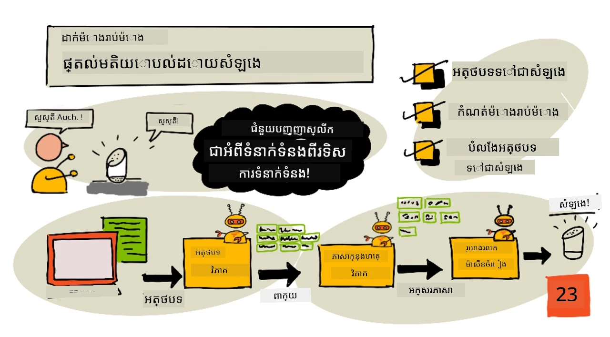
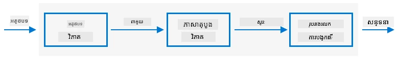

# កំណត់ម៉ោងហើយផ្តល់មតិយោបល់ជាសំឡេង



> រូបមន្តដោយ [Nitya Narasimhan](https://github.com/nitya). ចុចលើរូបភាពសម្រាប់ទំហំធំជាងនេះ។

## សំណួរពីមុនមេរៀន

[សំណួរពីមុនមេរៀន](https://black-meadow-040d15503.1.azurestaticapps.net/quiz/45)

## ការណែនាំ

ជំនួយការឆ្លាតវៃមិនមែនជាឧបករណ៍ផ្ទេរការប្រាស្រ័យទាក់ទងមួយផ្លូវទេ។ អ្នកនិយាយជាមួយពួកវា ហើយពួកវាចម្លើយថា៖

"Alexa, កំណត់ម៉ោង 3 នាទី"

"បានហើយ ម៉ោងរបស់អ្នកបានកំណត់ 3 នាទី"

ក្នុងមេរៀនចុងក្រោយពីរបានរៀនពីរបៀបយកសំឡេងនិងបម្លែងជាអត្ថបទ បន្ទាប់មកបំបែកសំណើកំណត់ម៉ោងពីអត្ថបទនោះ។ ក្នុងមេរៀននេះ អ្នកនឹងរៀនពីរបៀបកំណត់ម៉ោងលើឧបករណ៍ IoT ពីសំណើរបស់អ្នកប្រើប្រាស់ ព្រមទាំងឆ្លើយតបដោយពាក្យបញ្ចេញជាសំឡេងបញ្ជាក់ម៉ោងរបស់ពួកគេ និងមិនឱ្យពួកគេស្គាល់ពេលម៉ោងបញ្ចប់។

ក្នុងមេរៀននេះយើងនឹងគ្របដណ្តប់៖

* [អត្ថបទទៅសំឡេង](#អត្ថបទទៅសំឡេង)
* [កំណត់ម៉ោង](#កំណត់ម៉ោង)
* [បម្លែងអត្ថបទទៅសំឡេង](#បម្លែងអត្ថបទទៅសំឡេង)

## អត្ថបទទៅសំឡេង

អត្ថបទទៅសំឡេង ដូចឈ្មោះថា គឺជាប្រភេទនៃដំណើរការបម្លែងអត្ថបទទៅជារូបសំឡេងដែលមានពាក្យជាសំឡេង។ គោលការណ៍មូលដ្ឋានគឺដាក់ពាក្យក្នុងអត្ថបទទៅជាសូណ៍របស់ពួកវា (ហៅថា phonemes) ហើយភ្ជាប់សំឡេងនោះជាមួយគ្នា ប្រើសំឡេងដែលបានថតរួចឬប្រើសំឡេងដែលបានបង្កើតដោយម៉ូដែល AI។



ប្រព័ន្ធអត្ថបទទៅសំឡេងជាទូទៅមានដំណាក់កាល 3៖

* វិភាគអត្ថបទ
* វិភាគភាសា
* ការបង្កើតរាងរលកសំឡេង

### វិភាគអត្ថបទ

វិភាគអត្ថបទពាក់ព័ន្ធនឹងការយកអត្ថបទដែលផ្តល់ឲ្យ ហើយបម្លែងជាពាក្យដែលអាចប្រើបង្កើតសំឡេងបាន។ ឧទាហរណ៍ បើអ្នកបម្លែង "Hello world" គ្មានការវិភាគអត្ថបទចាំបាច់ទេ ពីព្រោះពីរពាក្យអាចបម្លែងទៅសំឡេងបាន។ បើមាន "1234" ថែមទៀត អាចត្រូវបម្លែងជាពាក្យ "One thousand, two hundred thirty four" ឬ "One, two, three, four" ពិនិត្យតាមបរិបទ។ សម្រាប់ "I have 1234 apples" នឹងជាពាក្យ "One thousand, two hundred thirty four" តែសម្រាប់ "The child counted 1234" នឹងជាពាក្យ "One, two, three, four"។

ពាក្យដែលបង្កើតមានភាពខុសគ្នាមិនត្រឹមតែភាសាទេ ប៉ុន្តែឃ្លានៅក្នុងតំបន់នៃភាសានោះផងដែរ។ ឧទាហរណ៍ ក្នុងភាសាអង់គ្លេសអាមេរិក 120 គឺ "One hundred twenty" ដោយខុសពីភាសាអង់គ្លេសប្រ៊ិតស  ដែលជា "One hundred and twenty" ដែលប្រើពាក្យ "and" បន្ទាប់ពីរយ។

✅ ឧទាហរណ៍ផ្សេងទៀតដែលត្រូវការវិភាគអត្ថបទរួមមាន "in" ជារូបមន្តសង្ខេបនៃ inch និង "st" ជារូបមន្តសង្ខេបនៃ saint និង street។ តើអ្នកអាចគិតឧទាហរណ៍ផ្សេងទៀតក្នុងភាសារបស់អ្នកនៃពាក្យដែលមិនច្បាស់លាស់ពុំមានបរិបទទេបានទេ។

ពេលដែលពាក្យត្រូវបានកំណត់រួច វាត្រូវបានផ្ញើសម្រាប់វិភាគភាសា។

### វិភាគភាសា

វិភាគភាសាជាការបំបែកពាក្យទៅជាសូណ៌ phonemes។ phonemes មិននៅលើតែអក្សរដែលប្រើទេ តែផ្អែកលើអក្សរផ្សេងទៀតក្នុងពាក្យផងដែរ។ ឧទាហរណ៍ លើភាសាអង់គ្លេស សម្លេង 'a' ក្នុង 'car' និង 'care' ខុសគ្នា។ ភាសាអង់គ្លេសមាន phonemes ៤៤ សម្រាប់អក្សរចំនួន ២៦ ដែលមានខ្លះស្រដៀងគ្នា ដូចជា phoneme ដដែលដែលប្រើក្នុងចាប់ផ្តើមពាក្យ 'circle' និង 'serpent'។

✅ សូមស្រាវជ្រាវ៖ តើ phonemes មានរបៀបបែបណាដែលសម្រាប់ភាសារបស់អ្នក?

បន្ទាប់ពីពាក្យត្រូវបានបម្លែងជាពាក្យ phonemes ត្រូវការព័ត៌មានបន្ថែមដើម្បីគាំទ្រសំឡេង intonation ការកែតម្រូវសំឡេង ឬរយៈពេលដោយផ្អែកលើបរិបទ។ ឧទាហរណ៍ នៅក្នុងភាសាអង់គ្លេស ការដុះសំឡេងអាចប្រើប្រាស់ដើម្បីបម្លែងប្រយោគទៅជាសំណួរ តាមរយៈការកើនឡើងសំឡេងនៅលើពាក្យចុងក្រោយ។

ឧទាហរណ៍ - ប្រយោគ "You have an apple" ជាការបញ្ជាក់ថាអ្នកមានផ្លែប៉ោម។ បើសំឡេងនៅចុងក្រោយកើនឡើង ឡើងក្នុងពាក្យ apple វានឹងក្លាយជាសំណួរ "You have an apple?" សួរថាតើអ្នកមានផ្លែប៉ោមឬទេ។ ការវិភាគភាសាត្រូវការប្រើសញ្ញាសំណួរនៅចុងដើម្បីសម្រាច់កំណត់សំឡេងឡើង។

បន្ទាប់ពីរូបសូណ៍ phonemes បានបង្កើត វាអាចផ្ញើទៅការបង្កើតរាងរលកសំឡេងសម្រាប់ផលិតសំឡេង output។

### ការបង្កើតរាងរលកសំឡេង

ប្រព័ន្ធអត្ថបទទៅសំឡេងអេឡិចត្រូនិចដំបូងបង្អស់គឺប្រើសំឡេងថតតែមួយសម្រាប់ phoneme មួយៗ ដែលធ្វើឲ្យសម្លេងមានលក្ខណៈម៉ូណូតូន និងសំឡេងរ៉ូបូត។ ការវិភាគភាសានឹងបង្កើត phonemes ហើយ phonemes ទាំងនេះត្រូវបានទាញពីមូលដ្ឋានទិន្នន័យសំឡេង ហើយភ្ជាប់ជាមួយគ្នា។

✅ សូមស្រាវជ្រាវ៖ រកសំឡេងថតពីប្រព័ន្ធបញ្ចេញសំឡេងដំបូងៗ។ប្រៀបធៀបទៅការបញ្ចេញសំឡេងសម័យថ្មី ដូចជាចែកចាយក្នុងជំនួយការឆ្លាតវៃ។

ការបង្កើតរាងរលកសំឡេងសម័យថ្មីប្រើម៉ូដែល ML ដែលបានបង្កើតតាមវិធីសាស្ត្រ deep learning (បណ្តាញប្រព័ន្ធប្រសាទធំៗដូចជានឺរុនទេនក្នុងខួរក្បាល) ដើម្បីបង្កើតសម្លេងធម្មជាតិតែមួយ ដែលមិនអាចបែងចែកពីសម្លេងមនុស្ស។

> 💁 ម៉ូដែល ML ខ្លះអាចបណ្ដុះបណ្ដាលឡើងវិញដោយ transfer learning ដើម្បីសម្លេងដូចជាមនុស្សពិត។ នេះមានន័យថាការប្រើសំឡេងជា​ប្រព័ន្ធសុវត្ថិភាព ដែលធនាគារត្រូវព្យាយាមធ្វើ អត់ត្រូវជាការគិតល្អទៀត ព្រោះនរណាម្នាក់ដែលមានសំឡេងថតរយៈពេលប៉ុន្មាននាទីអាចបម្រើប្រាស់សំឡេងអ្នកបាន។

ម៉ូដែល ML ដ៏ធំនេះកំពុងត្រូវបានបណ្ដុះបណ្ដាលដើម្បីបញ្ចូលដំណាក់កាលទាំងបីទៅជា speech synthesizers ឲ្យបានជារួម។

## កំណត់ម៉ោង

ដើម្បីកំណត់ម៉ោង ឧបករណ៍ IoT របស់អ្នកត្រូវហៅ REST endpoint ដែលអ្នកបានបង្កើតដោយកូដ serverless ហើយប្រើប្រាស់លេខវិនាទីដែលទទួលបានដើម្បីកំណត់ម៉ោង។

### កិច្ចការ - ហៅ function serverless ដើម្បីទទួលម៉ោងកំណត់

អនុវត្តតាមមគ្គុទេសក៍សមរម្យដើម្បីហៅ REST endpoint ពីឧបករណ៍ IoT របស់អ្នក ហើយកំណត់ម៉ោងតាមពេលដែលបានចាំបាច់៖

* [Arduino - Wio Terminal](wio-terminal-set-timer.md)
* [Single-board computer - Raspberry Pi/Virtual IoT device](single-board-computer-set-timer.md)

## បម្លែងអត្ថបទទៅសំឡេង

សេវាសំឡេងដូចគ្នា ដែលអ្នកប្រើប្រាស់សម្រាប់បម្លែងសំឡេងទៅអត្ថបទ អាចប្រើប្រាស់សម្រាប់បម្លែងអត្ថបទវិញទៅជាសំឡេង និងអាចលេងតាមម៉ាស៊ីនកាន់សំឡេងទៅលើឧបករណ៍ IoT របស់អ្នក។ អត្ថបទដែលត្រូវបម្លែងនឹងត្រូវផ្ញើទៅសេវាសំឡេង ជាមួយប្រភេទសំឡេង (ដូចជា sample rate) ហើយទិន្នន័យប៊ីណារីអាចត្រូវបានត្រឡប់មកវិញ។

ពេលអ្នកផ្ញើសំណើនេះ អ្នកផ្ញើដោយប្រើ *Speech Synthesis Markup Language* (SSML) ដែលជាភាសា XML មួយសម្រាប់កម្មវិធីបញ្ចេញសំឡេង។ វាកំណត់មិនត្រឹមតែអត្ថបទត្រូវបម្លែងទេ តែភាសា សំឡេងដែលត្រូវប្រើ ហើយអាចកំណត់ល្បឿន សំឡេង និង pitch សម្រាប់ពាក្យខ្លះ ឬទាំងអស់។

ឧទាហរណ៍ SSML នេះកំណត់ស្នើសុំបម្លែងអត្ថបទ "Your 3 minute 5 second time has been set" ទៅជាសំឡេងដោយប្រើសំឡេង British English ដែលមានឈ្មោះ `en-GB-MiaNeural`

```xml
<speak version='1.0' xml:lang='en-GB'>
    <voice xml:lang='en-GB' name='en-GB-MiaNeural'>
        Your 3 minute 5 second time has been set
    </voice>
</speak>
```

> 💁 ប្រព័ន្ធអត្ថបទទៅសំឡេងភាគច្រើនមានសំឡេងច្រើនបំផុតសម្រាប់ភាសាផ្សេងៗ ដែលមានអក្សរទាំងប្រ៊ិតស និងអង់គ្លេសនូវហ្ស៊ីឡង់ ដែលមានឡើងវិញតំបន់ភាសាផ្សេងៗ។

### កិច្ចការ - បម្លែងអត្ថបទទៅសំឡេង

អនុវត្តតាមមគ្គុទេសក៍ដែលសមរម្យដើម្បីបម្លែងអត្ថបទទៅសំឡេងតាមឧបករណ៍ IoT របស់អ្នក៖

* [Arduino - Wio Terminal](wio-terminal-text-to-speech.md)
* [Single-board computer - Raspberry Pi](pi-text-to-speech.md)
* [Single-board computer - Virtual device](virtual-device-text-to-speech.md)

---

## 🚀 ហ៊ានប្រកួត

SSML មានវិធីសាស្រ្តផ្លាស់ប្ដូរប្លង់នៃការនិយាយពាក្យ ម្តងទៀត ដូចជាការបន្ថែមការលើកទម្ងន់លើពាក្យណាមួយ ការបន្ថែមការឈប់ ឬការផ្លាស់ប្ដូរសំឡេង pitch។ សូមសាកល្បងកាលពីនេះ ដោយផ្ញើ SSML ផ្សេងៗពីឧបករណ៍ IoT របស់អ្នក ហើយប្រៀបធៀបផលបញ្ចេញអោយបាន។ អ្នកអាចអានបន្ថែមអំពី SSML រួមទាំងវិធីផ្លាស់ប្ដូររបៀបនិយាយពាក្យក្នុង [Speech Synthesis Markup Language (SSML) Version 1.1 specification ពីអង្គការពិភពលោកវែប (World Wide Web consortium)](https://www.w3.org/TR/speech-synthesis11/)។

## សំណួរផុសមេរៀន

[សំណួរផុសមេរៀន](https://black-meadow-040d15503.1.azurestaticapps.net/quiz/46)

## ពិនិត្យឡើងវិញ និងរៀនដោយខ្លួនឯង

* អានបន្ថែមអំពី speech synthesis នៅលើ [ទំព័រសម្រាប់ speech synthesis នៅវិគីភីឌា](https://wikipedia.org/wiki/Speech_synthesis)
* អានបន្ថែមអំពីវិធីដែលឥណបញ្ញត្តិប្រើ speech synthesis ដើម្បីលួចលុយ នៅលើ [រឿងប្លែកសំឡេងគួរឲ្យជឿប៉ុន្មាន 'help cyber crooks steal cash' នៅទំព័រព័ត៌មាន BBC](https://www.bbc.com/news/technology-48908736)
* រៀនបន្ថែមអំពីហានិភ័យទៅបំរើលោកជំនាញសំឡេងពីបំលែងសំឡេងដោយ AI នៅក្នុង [អត្ថបទស្តីពីការតុលាការតិកតុកដែលបង្ហាញពីការជ្រុះជ្រើសរបស់ AI លើសំឡេងបំរើលោកនៅលើ Vice](https://www.vice.com/en/article/z3xqwj/this-tiktok-lawsuit-is-highlighting-how-ai-is-screwing-over-voice-actors)

## កិច្ចការ

[បោះបង់ម៉ោងកំណត់](assignment.md)

---

<!-- CO-OP TRANSLATOR DISCLAIMER START -->
**ប DISCLAIMER**:
ឯកសារនេះត្រូវបានបកប្រែដោយប្រើសេវាបកប្រែ AI [Co-op Translator](https://github.com/Azure/co-op-translator)। ខណៈពេលយើងព្យាយាមឲ្យបានត្រឹមត្រូវ សូមដឹងថាការបកប្រែដោយស្វ័យប្រវត្តិអាចមានកំហុស ឬភាពមិនត្រឹមត្រូវ។ ឯកសារដើមនៅក្នុងភាសាដើមគួរត្រូវបានគេទទួលស្គាល់ជាលំនាំដើមដែលមានអំណាចខ្ពស់។ សម្រាប់ព័ត៌មានសំខាន់ៗ ប្រើការបកប្រែដោយមនុស្សដែលមានវិជ្ជាជីវៈគួរត្រូវបានផ្ដល់អនុសាសន៍។ យើងមិនទទួលខុសត្រូវចំពោះការយល់ច្រឡំ ឬការបកស្រាយខុសពីការប្រើប្រាស់ការបកប្រែនេះទេ។
<!-- CO-OP TRANSLATOR DISCLAIMER END -->