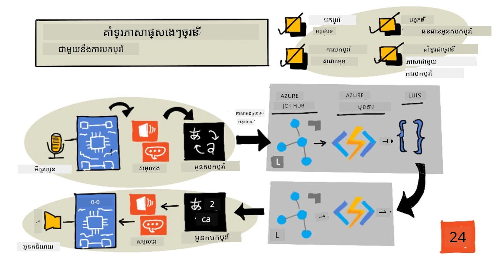
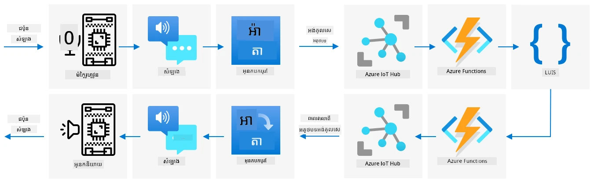

# គាំទ្រភាសាច្រើន



> Sketchnote by [Nitya Narasimhan](https://github.com/nitya). សូមចុចលើរូបភាពសម្រាប់មើលរូបភាពដែលធំជាងនេះ។

វីដេអូនេះបានផ្តល់ការណែនាំសម្រាប់សេវាកម្មសម្លេង Azure ដែលគ្របដណ្តប់ពីសម្លេងទៅអត្ថបទ និងអត្ថបទទៅសម្លេង ពីមេរៀនមុនៗ ព្រមទាំងការបកប្រែសម្លេង ក៏ដូចជាបទពិសោធន៍ដែលបានគ្របដណ្តប់ក្នុងមេរៀននេះ៖

[](https://www.youtube.com/watch?v=h6xbpMPSGEA)

> 🎥 សូមចុចលើរូបភាពខាងលើដើម្បីមើលវីដេអូ

## ប្រលងមុនមេរៀន

[ប្រលងមុនមេរៀន](https://black-meadow-040d15503.1.azurestaticapps.net/quiz/47)

## ការណែនាំ

 ក្នុង ៣ មេរៀនចុងក្រោយ អ្នកបានរៀនពីការបម្លែងសម្លេងទៅអត្ថបទ ការយល់ដឹងភាសា និងការបម្លែងអត្ថបទទៅសម្លេង ដែលទាំងអស់នេះគឺគាំទ្រដោយ AI។ ផ្នែកមួយទៀតនៃការទំនាក់ទំនងរវាងមនុស្សដែល AI អាចជួយបាន គឺការបកប្រែភាសា - បម្លែងពីភាសាមួយទៅភាសាផ្សេងទៀត ដូចជាពីភាសាអង់គ្លេសទៅភាសាបារាំង។

ក្នុងមេរៀននេះ អ្នកនឹងរៀនពីការប្រើ AI ដើម្បីបកប្រែអត្ថបទ អនុញ្ញាតឱ្យម៉ោងចាប់អារម្មណ៍ឆ្លាតវៃរបស់អ្នកអាចអន្តរកម្មជាមួយអ្នកប្រើជាភាសាច្រើន។

ក្នុងមេរៀននេះ យើងនឹងគ្របដណ្តប់៖

* [បកប្រែអត្ថបទ](#បកប្រែអត្ថបទ)
* [សេវាកម្មបកប្រែ](#សេវាកម្មបកប្រែ)
* [បង្កើតធនធានតំណាងបកប្រែ](#បង្កើតធនធានតំណាងបកប្រែ)
* [គាំទ្រភាសាច្រើននៅក្នុងកម្មវិធីជាមួយការបកប្រែ](#គាំទ្រភាសាច្រើននៅក្នុងកម្មវិធីជាមួយការបកប្រែ)
* [បកប្រែអត្ថបទដោយប្រើសេវាកម្ម AI](#បកប្រែអត្ថបទដោយប្រើសេវាកម្ម-ai)

> 🗑 នេះជាមេរៀនចុងក្រោយក្នុងគម្រោងនេះ ដូច្នេះបន្ទាប់ពីបញ្ចប់មេរៀននេះ និងភារកិច្ច សូមកុំភ្លេចសំអាតសេវាកម្មពពករបស់អ្នក។ អ្នកនឹងត្រូវការសេវាកម្មទាំងនេះដើម្បីបញ្ចប់ភារកិច្ច ដូច្នេះសូមប្រាកដថាបញ្ចប់វាមុនមុនគេ។
>
> សូមយោងទៅ [មគ្គុទេសក៍សំអាតគម្រោងរបស់អ្នក](../../../clean-up.md) ប្រសិនបើត្រូវការជំនួយសម្រាប់វិធីសាស្រ្តធ្វើការនេះ។

## បកប្រែអត្ថបទ

បកប្រែអត្ថបទគឺជាបញ្ហាស្វ័យប្រវត្តិគណិតវិទ្យាដែលបានស្រាវជ្រាវជាង ៧០ ឆ្នាំ មិនទាន់បានដោះស្រាយពេញលេញទេ ហើយឥឡូវនេះដោយសារវិច្ចាសាស្រ្ត AI និងថាមពលកុំព្យូទ័រដែលបានឆ្ពោះទៅមុខ គឺកំពុងជិតដោះស្រាយបានស្រួលដូចជាជនបកប្រែមនុស្សម្នាក់។

> 💁 ប្រភពដើមអាចតាមដានទៅត្រឡប់ក្រោយបន្ថែមទៀត ទៅកាន់ [Al-Kindi](https://wikipedia.org/wiki/Al-Kindi) ជាតិគ្រិក ៩ មួយដែលជាគ្រូបកប្រែអារ៉ាប់ដែលបានអភិវឌ្ឍបច្ចេកទេសសម្រាប់បកប្រែភាសា

### បកប្រែដោយម៉ាស៊ីន

ការ​បកប្រែអត្ថបទបានចាប់ផ្តើមជាបច្ចេកវិទ្យាមួយដែលហៅថាបកប្រែដោយម៉ាស៊ីន (Machine Translation - MT) ដែលអាចបកប្រែក្នុងរវាងគូភាសាផ្សេងៗ។ MT ប្រារព្ធការងារដោយប្ដូរពាក្យនៅក្នុងភាសាមួយជាមួយភាសាផ្សេង មួយផ្សំជាមួយបច្ចេកទេសសម្រាប់ជ្រើសរើសរបៀបបកប្រែត្រឹមត្រូវសម្រាប់វាក្យសព្ទ ឬផ្នែកនៃប្រយោគនៅពេលដែលការបកប្រែតាមពាក្យគ្រប់តែម្តងមិនមានន័យ។

> 🎓 នៅពេលអ្នកបកប្រែគាំទ្រការបកប្រែរវាងភាសាមួយទៅភាសាផ្សេង សូមហៅមួយក្រុមនៃភាសាទាំងនេះថា *គូភាសា*។ ឧបករណ៍ផ្សេងៗគ្នាគាំទ្រគូភាសាផ្សេងៗគ្នា ហើយគួរតែចាប់ផ្តើមមិនជាប់ពេញលេញទេ។ ឧទាហរណ៍ មួយកម្មវិធីបកប្រែអាចគាំទ្រឧទាហរណ៍ពីភាសាអង់គ្លេសទៅប៉ិនអេស្ប៉ាញ និងពីប៉ិនអេស្ប៉ាញទៅអ៊ីតាលីប៉ុន្តែមិនគាំទ្រពីអង់គ្លេសទៅអ៊ីតាលីឡើយ។

ឧទាហរណ៍ បកប្រែ “Hello world” ពីភាសាអង់គ្លេសទៅភាសាបារាំង អាចធ្វើបានដោយការប្ដូរពាក្យ “Bonjour” ជំនួស “Hello”, និង “le monde” ជំនួស “world”, ដូច្នេះនាំឱ្យបានការបកប្រែត្រឹមត្រូវគឺ "Bonjour le monde"។

ការប្ដូរពាក្យមិនដំណើរការពេលភាសាផ្សេងៗប្រើរបៀបផ្សេងៗគ្នា ក្នុងការបង្ហាញន័យដូចគ្នា។ ឧទាហរណ៍ ប្រយោគអង់គ្លេស “My name is Jim” បកប្រែជាភាសាបារាំងអាចមើលថាជា “Je m'appelle Jim”—ពាក្យ "Je" មានន័យថា "ខ្ញុំ", "m'" គឺជាការតភ្ជាប់ជាមួយកិរិយាស័ព្ទ "appelle" មានន័យថា "ហៅ" ហើយ "Jim" គឺជាឈ្មោះមិនត្រូវបានបកប្រែ។ លំដាប់ពាក្យក៏មានបញ្ហា ផ្ទុយពីអង់គ្លេស ដែលមានលំដាប់ពាក្យផ្សេងៗ។

> 💁 ពាក្យខ្លះមិនដែលត្រូវបានបកប្រែទេ - ឈ្មោះរបស់ខ្ញុំគឺជំ Jim មិនថាប្រើភាសាអ្វីទេ សម្រាប់ភាសាដែលប្រើអក្សរផ្សេង ឬអក្សរផ្សេង សម្រាប់សំនាញសំឡេងផ្សេង គឺអាចធ្វើ *ការប្រែអក្សរ* ដែលជាបច្ចេកទេសជ្រើសរើសអក្សរឬតួអក្សរដែលផ្តល់សំឡេងស្រដៀងនឹងពាក្យដែលបានផ្តល់។

លិខិតសម្ភាសន៍ ក៏ជាបញ្ហារបស់ការបកប្រែ។ សំណុំប្រយោគសម្ភាសន៍មានន័យស្រដៀង តែទំនោរ និង ការបម្រាមពាក្យបន្តិច។ ឧទាហរណ៍ ក្នុងភាសាអង់គ្លេស ប្រយោគសម្ភាស "I've got ants in my pants" មិនមានន័យលិតដូចជា “មានមនោគមិន ដែលក្នុងខោ” ប៉ុន្តែជាសញ្ញាត្រាថាអ្នកមានអារម្មណ៍អតិផរណា។ បើបកប្រែទៅភាសាអាល្លឺម៉ង់ វានឹងធ្វើឲ្យអ្នកស្តាប់ច្រឡំ ក្រោយពីវាមានន័យថា “ខ្ញុំមានផ្កាឈូកនៅខាងក្រោម”។

> 💁 តំបន់ផ្សេងៗផ្តល់ន័យខុសៗគ្នា។ មានអា‌្រោប​ប​ណ្តោះ​អាសន្ន​ចំពោះ​ប្រយោគ​សម្ភាស "ants in your pants", ក្នុងភាសាអង់គ្លេសអាមេរិក "pants" មានន័យជាគ្រឿងអាវក្រៅខោ ប៉ុន្តិនៅភាសាអង់គ្លេសបរទេស "pants" មានន័យជាខោក្នុង។

✅ ប្រសិនបើអ្នកនិយាយភាសាដាច់ចំនួន ចូរគិតពីប្រយោគមួយចំនួនដែលមិនអាចបកប្រែដោយផ្ទាល់បាន។

ប្រព័ន្ធបកប្រែដោយម៉ាស៊ីនពឹងផ្អែកលើមូលដ្ឋានទិន្នន័យធំទូលាយនៃច្បាប់កំណត់វិធីបកប្រែមួយចំនួន និងវិធីសាស្រ្តស្ថិតិដើម្បីជ្រើសរើសការបកប្រែត្រឹមត្រូវពីជម្រើសដែលមាន។ វិធីសាស្រ្តស្ថិតិទាំងនេះប្រើទិន្នន័យធំដែលបានបកប្រែក្នុងភាសាច្រើនដោយមនុស្ស ដើម្បីជ្រើសរើសបកប្រែដែលមានសក្ដានុពលខ្ពស់បំផុត ដែលហៅថា *ស្ថិតិសាស្ត្របកប្រែដោយម៉ាស៊ីន*។ ជាច្រើននៃប្រព័ន្ធទាំងនេះប្រើតំណាងកណ្តាលភាសា បើគេបកប្រែពីភាសាមួយទៅតំណាងកណ្តាល បន្ទាប់មកពីតំណាងកណ្តាលទៅភាសាផ្សេងទៀត។ ដូច្នេះ ការបន្ថែមភាសាបន្ថែម ចាំបាច់តែបកប្រែទៅ និងពីរវាងភាសា និងតំណាងកណ្តាល ប៉ុន្តែមិនចាំបាច់បកប្រែទៅ និងពីគោលភាសាផ្សេងទៀតទាំងអស់ទេ។

### បកប្រែដោយបណ្តាញសរសៃប្រសាទ

បកប្រែដោយបណ្តាញសរសៃប្រសាទប្រើថាមពល AI ដើម្បីបកប្រែ ជាទូទៅបកប្រែប្រយោគទាំងមូលដោយប្រើម៉ូដែលមួយ។ ម៉ូដែលទាំងនេះត្រូវបានហ្វឹកហាត់លើកន្លែងទិន្នន័យធំនៅក្រោមការបកប្រែក្នុងសួនដូចជា បណ្ដាញអ៊ីនធឺណិត សៀវភៅ និងឯកសារសហប្រជាជាតិសមាគម។

ម៉ូដែលបកប្រែដោយបណ្តាញសរសៃប្រសាទសូម្បីតែល្មមជាងម៉ូដែលបកប្រែដោយម៉ាស៊ីន ដោយមិនត្រូវការ មូលដ្ឋានទិន្នន័យធំនៃវាក្យសព្ទ និងលិខិតសម្ភាសន៍។ សេវាកម្ម AI សម័យថ្មីដែលផ្តល់ការបកប្រែ ជាញឹកញាប់លាយបញ្ចូលបច្ចេកទេសច្រើន ដូចជាការបកប្រែដោយម៉ាស៊ីនយោងទៅស្ថិតិ និងការបកប្រែដោយបណ្តាញសរសៃប្រសាទ។

មិនមានការបកប្រែ ១៖១ សម្រាប់គូភាសាណាមួយទេ។ ម៉ូដែលបកប្រែផ្សេងៗគ្នានឹងបង្ហាញលទ្ធផលខុសគ្នាបន្តិចបន្តួច ដោយផ្អែកលើទិន្នន័យដែលបានហ្វឹកហាត់ម៉ូដែល។ ការបកប្រែមិនតែងតែលំដាប់ជាគន្លងស្មើគ្នាទេ - នោះគឺ បើអ្នកបកប្រែប្រយោគពីភាសាមួយទៅផ្សេងទៀត ហើយបន្ទាប់មកបកប្រែវាចូលវិញទៅភាសដើម អ្នកអាចមើលឃើញប្រយោគខុសបន្តិចជាលទ្ធផល។

✅ សាកល្បងអ្នកបកប្រែអនឡាញផ្សេងៗ ដូចជា [Bing Translate](https://www.bing.com/translator), [Google Translate](https://translate.google.com), ឬកម្មវិធីបកប្រែរបស់ Apple។ ប្រៀបធៀបការបកប្រែភាសារបស់ប្រយោគខ្លះៗ។ ក៏សាកល្បងបកប្រែក្នុងភាសាមួយ បន្ទាប់មកបកប្រែវិញក្នុងភាសាផ្សេង។

## សេវាកម្មបកប្រែ

មានសេវាកម្ម AI ច្រើនដែលអាចប្រើបានពីកម្មវិធីរបស់អ្នកសម្រាប់បកប្រែសម្លេង និងអត្ថបទ។

### សេវាកម្មសម្លេង Cognitive services Speech service


សេវាកម្មសម្លេងដែលអ្នកបានប្រើចាប់ពីមេរៀនកន្លងមក មានសមត្ថភាពបកប្រែសម្រាប់ការទទួលសម្លេង។ ពេលអ្នកស្គាល់សម្លេង អ្នកអាចស្នើរសុំទទួលអត្ថបទសម្លេងក្នុងភាសាដដែលបាន ប៉ុន្តែស្របនឹងមានភាសាផ្សេងទៀត។

> 💁 អ្នកអាចប្រើតែពី SDK សម្លេងប៉ុណ្ណោះ ខណៈដែល REST API មិនមានការបកប្រែបញ្ចូលក្នុង។

### សេវាកម្មបកប្រែ Cognitive services Translator service


សេវាកម្ម Translator គឺជាសេវាកម្មពិសេសសម្រាប់ការបកប្រែ ដែលអាចបកប្រែអត្ថបទពីភាសាមួយទៅភាសាជាច្រើន។ មិនត្រឹមតែបកប្រែទេ វាក៏គាំទ្រមុខងារបន្ថែមជាច្រើន រួមមានការលាក់ពាក្យមិនសមរម្យ។ វាព្រមទាំងអនុញ្ញាតឲ្យអ្នកផ្តល់ការបកប្រែភាសាពិសេសសម្រាប់ពាក្យ ឬប្រយោគជាក់លាក់ ដើម្បីប្រើជាមួយពាក្យដែលអ្នកមិនចង់បកប្រែ ឬមានការបកប្រែមួយដែលស្គាល់ថាថ្មី។

ឧទាហរណ៍ ពេលបកប្រែប្រយោគ "I have a Raspberry Pi", ដែលចង់បង្ហាញពីកុំព្យូទ័រផ្ទាល់ខ្លួនមួយ ចូលទៅភាសាបារាំង អ្នកអាចរក្សា "Raspberry Pi" ដូចដើម និងមិនបកប្រែវានេះទៅជា "pi aux framboises" ក្ដៅជាទីបំផុត។

## បង្កើតធនធានតំណាងបកប្រែ

សម្រាប់មេរៀននេះ អ្នកនឹងត្រូវការ Translator resource។ អ្នកនឹងប្រើ REST API សម្រាប់បកប្រែអត្ថបទ។

### ភារកិច្ច - បង្កើតធនធាន Translator

1. ពី Terminal ឬ Command prompt របស់អ្នក អនុវត្តបន្ទាត់ពាក្យបញ្ជាខាងក្រោមសម្រាប់បង្កើត Translator resource ក្នុងក្រុមធនធាន `smart-timer` របស់អ្នក។

    ```sh
    az cognitiveservices account create --name smart-timer-translator \
                                        --resource-group smart-timer \
                                        --kind TextTranslation \
                                        --sku F0 \
                                        --yes \
                                        --location <location>
    ```

    ប្តូរ `<location>` ជាមួយទីតាំងដែលអ្នកប្រើនៅពេលបង្កើត Resource Group។

1. ទទួលសោសម្រាប់សេវាកម្ម Translator៖

    ```sh
    az cognitiveservices account keys list --name smart-timer-translator \
                                           --resource-group smart-timer \
                                           --output table
    ```

    ចម្លងមួយក្នុងចំណោមសោ។

## គាំទ្រភាសាច្រើននៅក្នុងកម្មវិធីជាមួយការបកប្រែ

ក្នុងពិភពអតិបរមា កម្មវិធីរបស់អ្នកគឺគួរតែយល់ភាសាថ្មីៗជាច្រើន ប្រហែលពីការស្តាប់សម្លេង ដល់ការយល់ដឹងភាសា រហូតដល់ការឆ្លើយតបជាសម្លេង។ វាជាកិច្ចការច្រើន ហើយដូច្នេះសេវាកម្មបកប្រែអាចជួយឱ្យពេលវេលាចេញផ្សាយកម្មវិធីរបស់អ្នករហ័សឡើង។



សូមកន្សោមថាអ្នកកំពុងបង្កើតម៉ោងចាប់អារម្មណ៍ឆ្លាតវៃមួយប្រើភាសាអង់គ្លេសទាំងមូល ពីការយល់សម្លេងទៅអត្ថបទ រត់ដំណើរការយល់ដឹងភាសា និងបង្កើតការឆ្លើយតបជាភាសាអង់គ្លេស ហើយឆ្លើយតបទៅដោយសម្លេងភាសាអង់គ្លេស។ ប្រសិនបើអ្នកចង់គាំទ្ររហូតទៅភាសាជប៉ុន អ្នកអាចចាប់ផ្តើមពីការបកប្រែសម្លេងជប៉ុនទៅអត្ថបទអង់គ្លេស រួចរក្សាជំហានស្នូលនៅក្នុងកម្មវិធីដូចគ្នា ហើយបកប្រែអត្ថបទការឆ្លើយតបទៅជាជប៉ុនមុននិយាយការឆ្លើយ។ វានឹងអនុញ្ញាតឲ្យអ្នកបន្ថែមគាំទ្រភាសាជប៉ុនបានយ៉ាងមានប្រសិទ្ធភាព ហើយអ្នកអាចពង្រីកមុខងារពេញលេញជាភាសាជប៉ុននៅពេលក្រោយ។

> 💁 ខុសគ្នានៃការគ្រប់គ្រងលើការពឹងផ្អែកលើការបកប្រែដោយម៉ាស៊ីន គឺភាសា និងវប្បធម៌ផ្សេងៗមានរបៀបនិយាយមិនដូចគ្នា ដូច្នេះការបកប្រែអាចមិនផ្គូផ្គងនឹងអារម្មណ៍ដែលអ្នករង់ចាំ។

បកប្រែដោយម៉ាស៊ីន ក៏បើកឱកាសសម្រាប់កម្មវិធី និងឧបករណ៍ដែលអាចបកប្រែមាតិកាដែលអ្នកប្រើបង្កើតក៏ដូចជាពេលវាលើក។ សាច់រឿងវិទ្យាសាស្ត្រដ៏ប្រចាំជាលក្ខខណ្ឌ បង្ហាញពីឧបករណ៍បកប្រែសកល ដែលអាចបកប្រែពីភាសាផ្សេងដែលមិនមែនមនុស្សទៅភាសាអង់គ្លេសជាធម្មតា។ ឧបករណ៍ទាំងនេះគឺនៅកន្លែងពិតជាងហើយ ប្រសិនបើហាមឃាត់ផ្នែកមិនមែនមនុស្ស។ មានកម្មវិធី និងឧបករណ៍ដែលផ្តល់ការបកប្រែដាច់ខាតជាពេលវេលាពិតជាក់ស្ដែងសម្រាប់សម្លេង និងអត្ថបទ ដែលប្រើការលាយបញ្ចូលនៃសេវាកម្មសម្លេង និងបកប្រែ។

ឧទាហរណ៍មួយ គឺកម្មវិធីទូរស័ព្ទចល័ត [Microsoft Translator](https://www.microsoft.com/translator/apps/?WT.mc_id=academic-17441-jabenn) ដែលបង្ហាញក្នុងវីដេអូនេះ៖

[](https://www.youtube.com/watch?v=16yAGeP2FuM)

> 🎥 សូមចុចលើរូបភាពខាងលើដើម្បីមើលវីដេអូ

សូមនឹកឃើញថាមានឧបករណ៍ដូចនេះដែលអ្នកអាចប្រើបាន ជាពិសេសពេលធ្វើដំណើរយ៉ាងហោចណាស់ ជាមួយមនុស្សដែលភាសារបស់ពួកគេលោកអ្នកមិនស្គាល់ផង។ ការមានឧបករណ៍បកប្រែដាច់ខាតនៅអាកាសយានដ្ឋាន ឬមន្ទីរពេទ្យ នឹងផ្តល់នូវការកែលម្អការចូលដំណើរការចាំបាច់យ៉ាងខ្លាំង។

✅ ស្រាវជ្រាវមួយចំនួន៖ តើមានឧបករណ៍ IoT សម្រាប់បកប្រែដែលមានលក់ពាណិជ្ជកម្មទេ? តើមានមុខងារបកប្រែដែលអាចបញ្ជូលក្នុងឧបករណ៍ឆ្លាតទេ?

> 👽 ទោះបីជាមានឧបករណ៍បកប្រែសកលមួយដែលអាចអោយយើងនិយាយជាមួយបរទេសបានក៏ដោយ ក្តី [Microsoft translator គាំទ្រភាសា Klingon](https://www.microsoft.com/translator/blog/2013/05/14/announcing-klingon-for-bing-translator/?WT.mc_id=academic-17441-jabenn)។ Qapla’!

## បកប្រែអត្ថបទដោយប្រើសេវាកម្ម AI

អ្នកអាចប្រើសេវាកម្ម AI ដើម្បីបន្ថែមសមត្ថភាពបកប្រែនេះទៅម៉ោងចាប់អារម្មណ៍ឆ្លាតវៃរបស់អ្នក។

### ភារកិច្ច - បកប្រែអត្ថបទដោយប្រើសេវាកម្ម AI

ធ្វើតាមមគ្គុទេសក៍ដែលពាក់ព័ន្ធ ដើម្បីបម្លែងអត្ថបទនៅលើឧបករណ៍ IoT របស់អ្នក៖

* [Arduino - Wio Terminal](wio-terminal-translate-speech.md)
* [Single-board computer - Raspberry Pi](pi-translate-speech.md)
* [Single-board computer - Virtual device](virtual-device-translate-speech.md)

---

## 🚀 បញ្ហាដែលត្រូវធ្វើ

តើយ៉ាងដូចម្តេចការបកប្រែដោយម៉ាស៊ីនអាចផ្តល់អត្ថប្រយោជន៍ដល់កម្មវិធី IoT ផ្សេងទៀតក្រៅពីឧបករណ៍ឆ្លាត? ចូរគិតពីវិធីផ្សេងៗដែលការបកប្រែអាចជួយបាន មិនត្រឹមតែពាក្យនិយាយ និងអត្ថបទផងដែរ។

## ប្រលងបន្ទាប់មេរៀន

[ប្រលងបន្ទាប់មេរៀន](https://black-meadow-040d15503.1.azurestaticapps.net/quiz/48)

## ពិនិត្យឡើងវិញ និងសិក្សាឯករាជ្យ

* អានបន្ថែមអំពីបកប្រែម៉ាស៊ីន នៅលើ​ទំព័របកប្រែម៉ាស៊ីនក្នុង [វិគីភីឌា](https://wikipedia.org/wiki/Machine_translation)
* អានបន្ថែមអំពីបកប្រែម៉ាស៊ីនសរសៃប្រសាទ នៅលើ​ទំព័របកប្រែម៉ាស៊ីនសរសៃប្រសាទក្នុង [វិគីភីឌា](https://wikipedia.org/wiki/Neural_machine_translation)
* ពិនិត្យមើលបញ្ជីភាសាគាំទ្រសម្រាប់សេវាកម្មសម្លេង Microsoft នៅក្នុង [ឯកសារគាំទ្រភាសា និងសម្លេងសម្រាប់សេវាកម្មសម្លេងលើ Microsoft Docs](https://docs.microsoft.com/azure/cognitive-services/speech-service/language-support?WT.mc_id=academic-17441-jabenn)

## ភារកិច្ច

[បង្កើតកម្មវិធីបកប្រែសកល](assignment.md)

---

<!-- CO-OP TRANSLATOR DISCLAIMER START -->
**ការបដិសេធ**៖  
ឯកសារនេះត្រូវបានបកប្រែដោយប្រើសេវាបកប្រែ AI [Co-op Translator](https://github.com/Azure/co-op-translator) ។ ខណៈពេលដែលយើងខំប្រឹងប្រែងចំពោះភាពត្រឹមត្រូវ សូមយល់ថាការបកប្រែដោយស្វ័យប្រវត្តិ​អាចមានកំហុសឬភាពមិនត្រឹមត្រូវ។ ឯកសារដើមនៅក្នុងភាសាទើបមានគុណតម្លៃជាឯកសារយោងដ៍សំខាន់។ សម្រាប់ព័ត៌មានសំខាន់ ការបកប្រែដោយមនុស្សជំនាញគួរតែត្រូវបានប្រើ។ យើងមិនទទួលខុសត្រូវចំពោះការយល់ច្រឡំ ឬការបកប្រែវាយប្រហារណាមួយដែលកើតឡើងពីការប្រើប្រាស់ការបកប្រែនេះឡើយ។
<!-- CO-OP TRANSLATOR DISCLAIMER END -->