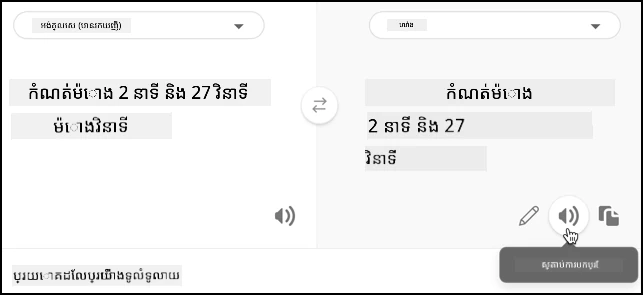

# បកប្រែសុន្ទរកថា - Raspberry Pi

នៅផ្នែកនេះនៃមេរៀន អ្នកនឹងសរសេរកូដដើម្បីបកប្រែអត្ថបទដោយប្រើសេវាកម្ម translator។

## បម្លែងអត្ថបទទៅសុន្ទរកថា ដោយប្រើសេវាកម្ម translator

សេវាកម្មសុន្ទរកថា REST API មិនគាំទ្រការបកប្រែផ្ទាល់ទេ ជំនួសវិញ អ្នកអាចប្រើសេវាកម្ម Translator ដើម្បីបកប្រែអត្ថបទដែលផលិតដោយសេវាកម្ម speech to text និងអត្ថបទនៃការឆ្លើយតបជាសុន្ទរកថា។ សេវាកម្មនេះមាន REST API ដែលអ្នកអាចប្រើដើម្បីបកប្រែអត្ថបទ។

### ការងារ - ប្រើធនធាន translator ដើម្បីបកប្រែអត្ថបទ

1. ម៉ាស៊ីនថ្មម៉ាតរបស់អ្នកនឹងបានកំណត់ភាសា 2 ភាសា - ភាសារបស់ម៉ាស៊ីនបម្រើដែលបានប្រើសម្រាប់បណ្តុះបណ្តាល LUIS (ភាសាដូចគ្នាក៏ត្រូវបានប្រើសម្រាប់បង្កើតសារ ដើម្បីនិយាយជាមួយអ្នកប្រើ), និងភាសាដែលអ្នកប្រើនិយាយ។ បច្ចុប្បន្នភាពអថេរ `language` ឲ្យជា ភាសាដែលនឹងត្រូវនិយាយដោយអ្នកប្រើ ហើយបន្ថែមអថេរថ្មីមួយឈ្មោះ `server_language` សម្រាប់ភាសាដែលបានប្រើបណ្តុះបណ្តាល LUIS៖

    ```python
    language = '<user language>'
    server_language = '<server language>'
    ```
  
    ផ្លាស់ប្តូរ `<user language>` ជាមួយឈ្មោះតំបន់សម្រាប់ភាសាដែលអ្នកនឹងនិយាយ ប្រដាប់ដូចជា `fr-FR` សម្រាប់ភាសាបារាំង ឬ `zn-HK` សម្រាប់ភាសាកង់តូនីស៍។

    ផ្លាស់ប្តូរ `<server language>` ជាមួយឈ្មោះតំបន់សម្រាប់ភាសាដែលបានប្រើបណ្តុះបណ្តាល LUIS។

    អ្នកអាចស្វែងរកបញ្ជីភាសាដែលគាំទ្រ និងឈ្មោះតំបន់របស់ពួកវា នៅក្នុង [Language and voice support documentation on Microsoft docs](https://docs.microsoft.com/azure/cognitive-services/speech-service/language-support?WT.mc_id=academic-17441-jabenn#speech-to-text)។

    > 💁 ប្រសិនបើអ្នកមិននិយាយភាសាច្រើន អ្នកអាចប្រើសេវាកម្មដូចជា [Bing Translate](https://www.bing.com/translator) ឬ [Google Translate](https://translate.google.com) ដើម្បីបកប្រែពីភាសារបស់អ្នកទៅភាសាដែលអ្នកចូលចិត្ត។ សេវាកម្មទាំងនេះអាចចាក់សម្លេងនៃអត្ថបទដែលបានបកប្រែផងដែរ។  
    >  
    > ឧទាហរណ៍ ប្រសិនបើអ្នកបណ្តុះបណ្តាល LUIS ជាភាសាអង់គ្លេស ប៉ុន្តាចង់ប្រើភាសាបារាំងជាភាសាអ្នកប្រើ អ្នកអាចបកប្រែប្រយោគ "set a 2 minute and 27 second timer" ពីភាសាអង់គ្លេស ទៅភាសាបារាំងដោយប្រើ Bing Translate ហើយបន្ទាប់មកប្រើប៊ូតុង **Listen translation** ដើម្បីនិយាយការបកប្រែទៅកាន់ម្ជុលម៉ាស៊ីនភ្លើងរបស់អ្នក។  
    >  
    > 

1. បន្ថែមកូនសោ API របស់ translator ខាងក្រោម `speech_api_key`៖

    ```python
    translator_api_key = '<key>'
    ```
  
    ផ្លាស់ប្តូរ `<key>` ជាមួយកូនសោ API សម្រាប់ធនធានសេវាកម្ម translator របស់អ្នក។

1. មុខមាត់នៃ `say` function កំណត់មុខងារ `translate_text` ដែលនឹងបកប្រែអត្ថបទពីភាសាម៉ាស៊ីនបម្រើទៅភាសាអ្នកប្រើ៖

    ```python
    def translate_text(text, from_language, to_language):
    ```
  
    ភាសា from និង to ត្រូវបានផ្ដល់ទៅមុខងារនេះ - កម្មវិធីរបស់អ្នកត្រូវបម្លែងពីភាសាអ្នកប្រើទៅភាសាម៉ាស៊ីនបម្រើពេលស្គាល់សុន្ទរកថា ហើយពីភាសាម៉ាស៊ីនបម្រើទៅភាសាអ្នកប្រើពេលផ្តល់មតិយោបល់ជាសុន្ទរកថា។

1. ក្នុងមុខងារនេះ កំណត់ URL និង headers សម្រាប់ការហៅ REST API៖

    ```python
    url = f'https://api.cognitive.microsofttranslator.com/translate?api-version=3.0'

    headers = {
        'Ocp-Apim-Subscription-Key': translator_api_key,
        'Ocp-Apim-Subscription-Region': location,
        'Content-type': 'application/json'
    }
    ```
  
    URL សម្រាប់ API នេះមិនផ្ដោតតំបន់ជាក់លាក់ ទេ តាមពិតតំបន់ត្រូវផ្ដល់ជា header។ កូនសោ API ត្រូវបានប្រើដោយផ្ទាល់ ដូច្នេះខុសពីសេវាកម្មសុន្ទរកថា គ្មានការទាមទារបាន access token ពី token issuer API ទេ។

1. ខាងក្រោមនេះ កំណត់សំណុំបែបបទនិងខ្លឹមសារសម្រាប់ការហៅ៖

    ```python
    params = {
        'from': from_language,
        'to': to_language
    }

    body = [{
        'text' : text
    }]
    ```
  
    `params` កំណត់ប៉ារ៉ាម៉ែត្រដែលផ្ដល់ទៅការហៅ API ពីភាសា from ទៅភាសា to។ ការហៅនេះនឹងបកប្រែអត្ថបទនៅភាសា `from` ទៅភាសា `to`។

    `body` មានអត្ថបទដែលត្រូវបកប្រែ។ នេះជាអារ៉េ មូលហេតុជាច្រើននៃអត្ថបទអាចត្រូវបានបកប្រែក្នុងការហៅដូចគ្នា។

1. រៀបចំការហៅ REST API ហើយទទួលការឆ្លើយតប៖

    ```python
    response = requests.post(url, headers=headers, params=params, json=body)
    ```
  
    ការឆ្លើយតបដែលត្រូវបានត្រឡប់មកវិញគឺជាអារ៉េ JSON មានធាតុមួយដែលមានការបកប្រែ។ ធាតុនេះមានអារ៉េសម្រាប់ការបកប្រែនៃធាតុទាំងអស់ដែលបានផ្ដល់នៅក្នុង body ។

    ```json
    [
        {
            "translations": [
                {
                    "text": "Set a 2 minute 27 second timer.",
                    "to": "en"
                }
            ]
        }
    ]
    ```
  
1. ត្រឡប់តម្លៃ `test` ពីការបកប្រែដំបូងពីធាតុដំបូងនៅក្នុងអារ៉េ៖

    ```python
    return response.json()[0]['translations'][0]['text']
    ```
  
1. បច្ចុប្បន្នភាពលំនាំ `while True` ដើម្បីបកប្រែអត្ថបទពីការហៅ `convert_speech_to_text` ពីភាសាអ្នកប្រើទៅភាសាម៉ាស៊ីនបម្រើ៖

    ```python
    if len(text) > 0:
        print('Original:', text)
        text = translate_text(text, language, server_language)
        print('Translated:', text)

        message = Message(json.dumps({ 'speech': text }))
        device_client.send_message(message)
    ```
  
    កូដនេះក៏បង្ហាញអត្ថបទដើម និងអត្ថបទបានបកប្រែទៅកាន់ console ផងដែរ។

1. បច្ចុប្បន្នភាពមុខងារ `say` ដើម្បីបកប្រែអត្ថបទដែលនឹងនិយាយ ពីភាសាម៉ាស៊ីនបម្រើទៅភាសាអ្នកប្រើ៖

    ```python
    def say(text):
        print('Original:', text)
        text = translate_text(text, server_language, language)
        print('Translated:', text)
        speech = get_speech(text)
        play_speech(speech)
    ```
  
    កូដនេះក៏បង្ហាញអត្ថបទដើម និងអត្ថបទបានបកប្រែទៅកាន់ console ផងដែរ។

1. ប្រតិបត្តិការកូដរបស់អ្នក។ ប្រាកដថាកម្មវិធី function app របស់អ្នកកំពុងដំណើរការ ហើយស្នើសុំម៉ោងថ្មក្នុងភាសាអ្នកប្រើ ដោយនិយាយភាសានោះដោយខ្លួនឯង ឬប្រើកម្មវិធីបកប្រែ។

    ```output
    pi@raspberrypi:~/smart-timer $ python3 app.py
    Connecting
    Connected
    Using voice fr-FR-DeniseNeural
    Original: Définir une minuterie de 2 minutes et 27 secondes.
    Translated: Set a timer of 2 minutes and 27 seconds.
    Original: 2 minute 27 second timer started.
    Translated: 2 minute 27 seconde minute a commencé.
    Original: Times up on your 2 minute 27 second timer.
    Translated: Chronométrant votre minuterie de 2 minutes 27 secondes.
    ```
  
    > 💁 ដោយសារប្លែកៗនៃរបៀបនិយាយក្នុងភាសាផ្សេងៗ អ្នកអាចទទួលបានការបកប្រែដែលខុសពីឧទាហរណ៍ដែលអ្នកផ្តល់ទៅ LUIS។ ប្រសិនបើមានករណីនេះ សូមបន្ថែមឧទាហរណ៍បន្ថែមទៅ LUIS បណ្ដុះបណ្ដាលឡើងវិញ ហើយបោះពុម្ពផ្សាយម៉ូដែលឡើងវិញ។

> 💁 អ្នកអាចរកឃើញកូដនេះនៅក្នុងថត [code/pi](../../../../../6-consumer/lessons/4-multiple-language-support/code/pi)។

😀 កម្មវិធីម៉ោងថ្មភាសាច្រើនរបស់អ្នកបានជោគជ័យ!

---

<!-- CO-OP TRANSLATOR DISCLAIMER START -->
**ការបដិសេធ**:  
ឯកសារនេះត្រូវបានបកប្រែដោយប្រើសេវាកម្មបកប្រែ AI [Co-op Translator](https://github.com/Azure/co-op-translator)។ ទោះយើងខិតខំប្រឹងប្រែងឱ្យមានភាពត្រឹមត្រូវ ប៉ុន្តែសូមយល់ព្រមថាការបកប្រែម៉ាស៊ីនអាចមានកំហុស ឬភាពមិនត្រឹមត្រូវ។ ឯកសារដើមនៅក្នុងភាសាទូទៅគួរត្រូវបានគិតថា ជាវិទ្យាស្ថានឯកសារដែលត្រឹមត្រូវ។ សម្រាប់ព័ត៌មានសំខាន់ៗ ការបកប្រែដោយអ្នកជំនាញមនុស្សត្រូវបានផ្ដល់អនុសាសន៍។ យើងមិនទទួលខុសត្រូវចំពោះការយល់ច្រឡំ ឬការបកស្រាយខុសចេញពីការប្រើប្រាស់ការបកប្រែនេះឡើយ។
<!-- CO-OP TRANSLATOR DISCLAIMER END -->