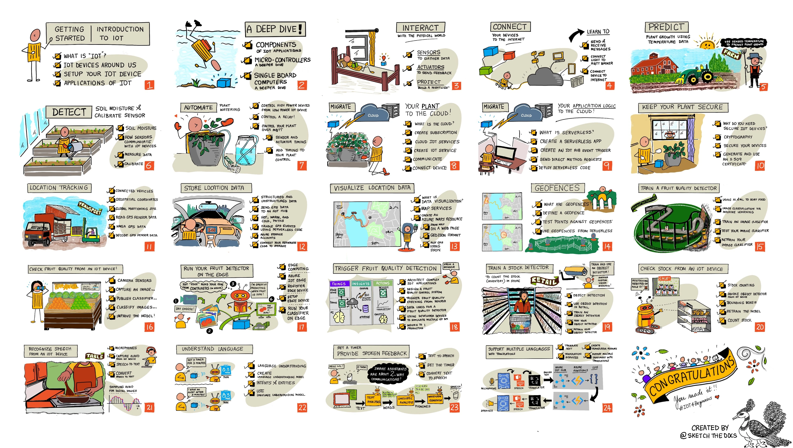

[](https://github.com/microsoft/IoT-For-Beginners/blob/master/LICENSE)
[](https://GitHub.com/microsoft/IoT-For-Beginners/graphs/contributors/)
[](https://GitHub.com/microsoft/IoT-For-Beginners/issues/)
[](https://GitHub.com/microsoft/IoT-For-Beginners/pulls/)
[](http://makeapullrequest.com)

[](https://GitHub.com/microsoft/IoT-For-Beginners/watchers/)
[](https://GitHub.com/microsoft/IoT-For-Beginners/network/)
[](https://GitHub.com/microsoft/IoT-For-Beginners/stargazers/)

### ចូលរួមសហគមន៍ Azure AI Foundry

បើអ្នកមានបញ្ហា ឬសំណួរណាមួយអំពីការបង្កើតកម្មវិធី AI។ ចូលរួមជាមួយអ្នករៀន និងអ្នកអភិវឌ្ឍមានបទពិសោធន៍ ក្នុងការពិភាក្សាអំពី MCP។ វាជាសហគមន៍ដ៏គាំទ្រដែលសំណួរត្រូវបានស្វាគមន៍ ហើយចំណេះដឹងត្រូវបានចែករំលែកដោយសេរី។

[](https://discord.gg/nTYy5BXMWG)

បើអ្នកមានមតិផ្ទាល់។ ឬកំហុសពេលកំពុងបង្កើត សូមចូលទៅកាន់៖

[](https://aka.ms/foundry/forum)

អនុវត្តជំហានទាំងនេះដើម្បីចាប់ផ្តើមប្រើធនធានទាំងនេះ៖  
1. **រុះរៀប Repository**៖ ចុច [](https://GitHub.com/microsoft/IoT-For-Beginners/fork)  
2. **ចម្លង Repository**៖   `git clone https://github.com/microsoft/IoT-For-Beginners.git`  
3. [**ចូលរួម Microsot Foundry Discord ហើយជួបអ្នកជំនាញ និងអ្នកអភិវឌ្ឍទាំងអស់**](https://discord.com/invite/ByRwuEEgH4)


### 🌐 ការគាំទ្រជាភាសាច្រើន

#### គាំទ្រដោយ GitHub Action (ស្វ័យប្រវត្តិ & លើសទៀងទាត់)

<!-- CO-OP TRANSLATOR LANGUAGES TABLE START -->
[អារ៉ាប់](../ar/README.md) | [បង់្គោលី](../bn/README.md) | [ប៊ុលហ្គារី](../bg/README.md) | [ភាសាប៊ឺម៉ា (មียนម៉ា)](../my/README.md) | [ចិន (សាមញ្ញ)](../zh-CN/README.md) | [ចិន (បែបប្រពៃណីហុងកុង)](../zh-HK/README.md) | [ចិន (បែបប្រពៃណីម៉ាកាវ)](../zh-MO/README.md) | [ចិន (បែបប្រពៃណីតៃវ៉ាន់)](../zh-TW/README.md) | [ខ្រូអាត](../hr/README.md) | [ឆែក](../cs/README.md) | [ដាណីស](../da/README.md) | [ហុល្លង់](../nl/README.md) | [អេស្ទូនីយ៉ា](../et/README.md) | [ហ្វាំងឡង់](../fi/README.md) | [បារាំង](../fr/README.md) | [អាល្លឺម៉ង់](../de/README.md) | [ក្រិច](../el/README.md) | [ហីប្រ៊ូ](../he/README.md) | [ឥណ្ឌា](../hi/README.md) | [ហ៊ុនហ្គារី](../hu/README.md) | [ឥណ្ឌូណេស៊ី](../id/README.md) | [អ៊ីតាលី](../it/README.md) | [ជប៉ុន](../ja/README.md) | [កណាដា](../kn/README.md) | [ខ្មែរ](./README.md) | [កូរ៉េ](../ko/README.md) | [លីថុយអានី](../lt/README.md) | [ម៉ាឡេ](../ms/README.md) | [ម៉ាឡាលៃឡាំ](../ml/README.md) | [ម៉ារ៉ាធ៊ី](../mr/README.md) | [នេប៉ាល់](../ne/README.md) | [ភីជាំង នៃនីហ្សេរីយ៉ា](../pcm/README.md) | [ណ័រវេ](../no/README.md) | [ភាសាផែរ(ហ្វាស៊ី)](../fa/README.md) | [ប៉ូឡូញ](../pl/README.md) | [ព័រទុយហ្គាល់ (ប្រេស៊ីល)](../pt-BR/README.md) | [ព័រទុយហ្គាល់ (ប៉ះតុហ្គាល់)](../pt-PT/README.md) | [ភាសាផ៊ុនជាប (កូម៊ូហ្គី)](../pa/README.md) | [រ៉ូម៉ានី](../ro/README.md) | [រុស្ស៊ី](../ru/README.md) | [ស៊ែប៊ី (ស៊ីរីលីក)](../sr/README.md) | [ស្ពៃក](../sk/README.md) | [ស្ពឺឡូវេនី](../sl/README.md) | [ស្ប៉ាញ](../es/README.md) | [ស្វាហ៊ីលី](../sw/README.md) | [ស៊ុយអែត](../sv/README.md) | [តាហ្គាឡុក (ហិលីពីន)](../tl/README.md) | [តាមីល](../ta/README.md) | [ទេលារូគូ](../te/README.md) | [ថៃ](../th/README.md) | [តួគី](../tr/README.md) | [អ៊ុយក្រែន](../uk/README.md) | [ឥណ្ឌូរ](../ur/README.md) | [វៀតណាម](../vi/README.md)

> **ចូលចិត្តចម្លងក្នុងតំបន់បណ្ដាញមែនទេ?**
>
> កម្មវិធីនេះមានការប្រែច្រើនជាភាសា 50+ ដែលបង្កើនទំហំទាញយកយ៉ាងមានសារៈសំខាន់។ ដើម្បីចម្លងដោយគ្មានការប្រែភាសា អ្នកអាចប្រើ sparse checkout:
>
> **Bash / macOS / Linux:**
> ```bash
> git clone --filter=blob:none --sparse https://github.com/microsoft/IoT-For-Beginners.git
> cd IoT-For-Beginners
> git sparse-checkout set --no-cone '/*' '!translations' '!translated_images'
> ```
>
> **CMD (Windows):**
> ```cmd
> git clone --filter=blob:none --sparse https://github.com/microsoft/IoT-For-Beginners.git
> cd IoT-For-Beginners
> git sparse-checkout set --no-cone "/*" "!translations" "!translated_images"
> ```
>
> វានឹងផ្តល់អ្វីគ្រប់យ៉ាងដែលអ្នកត្រូវការដើម្បីបញ្ចប់វគ្គសិក្សាដោយមានការទាញយកយ៉ាងលឿនជាងមុន។
<!-- CO-OP TRANSLATOR LANGUAGES TABLE END -->

# IoT សម្រាប់អ្នកចាប់ផ្តើម - មុខវិជ្ជា

អ្នកគាំទ្របង្ហោះពពក Azure នៅ Microsoft មានកិត្តិយសផ្តល់មុខវិជ្ជា 12 សប្ដាហ៍ 24 មេរៀន ដែលជាអំពីមូលដ្ឋាន IoT ។ មេរៀននីមួយៗមានសំណួរប្រឡងមុននិងក្រោយមេរៀន សេចក្ដីណែនាំដោយសរសេរដើម្បីបញ្ចប់មេរៀន ដំណោះស្រាយ កិច្ចការនិងច្រើនទៀត។ វិធីសាស្រ្តសិក្សាធ្វើតាមគម្រោងរបស់យើងអនុញ្ញាតឱ្យអ្នករៀនពេលកំពុងបង្កើត មុខងារដែលបានបញ្ជាក់ជាប្រសិទ្ធភាពសម្រាប់ជំនាញថ្មីៗ "នៅជាប់"។

គម្រោងទាំងនេះគ្របដណ្តប់ដំណើរការនៃអាហារពីស្រែទៅតុ។ វារួមបញ្ចូលស្រែ ការដឹកជញ្ជូន ផលិតរោងចក្រ រាយឡើងលក់ និងអ្នកប្រើប្រាស់ - ទាំងអស់នេះជាពហុឧស្សាហកម្មដែលពេញនិយមសម្រាប់ឧបករណ៍ IoT។



> រូបរាងដោយ [Nitya Narasimhan](https://github.com/nitya)។ ចុចរូបភាពដើម្បីមើលទំហំធំជាង។

**សូមអរគុណយ៉ាងប្រាកដចិត្តទៅកាន់អ្នកនិពន្ធរបស់យើង [Jen Fox](https://github.com/jenfoxbot), [Jen Looper](https://github.com/jlooper), [Jim Bennett](https://github.com/jimbobbennett) និងសិល្បករូបរាង [Nitya Narasimhan](https://github.com/nitya)។**

**សូមអរគុណដល់ក្រុមអ្នករៀន [Microsoft Learn Student Ambassadors](https://studentambassadors.microsoft.com?WT.mc_id=academic-17441-jabenn) ដែលបានពិនិត្យ និងបកប្រែមុខវិជ្ជានេះ - [Aditya Garg](https://github.com/AdityaGarg00), [Anurag Sharma](https://github.com/Anurag-0-1-A), [Arpita Das](https://github.com/Arpiiitaaa), [Aryan Jain](https://www.linkedin.com/in/aryan-jain-47a4a1145/), [Bhavesh Suneja](https://github.com/EliteWarrior315), [Faith Hunja](https://faithhunja.github.io/), [Lateefah Bello](https://www.linkedin.com/in/lateefah-bello/), [Manvi Jha](https://github.com/Severus-Matthew), [Mireille Tan](https://www.linkedin.com/in/mireille-tan-a4834819a/), [Mohammad Iftekher (Iftu) Ebne Jalal](https://github.com/Iftu119), [Mohammad Zulfikar](https://github.com/mohzulfikar), [Priyanshu Srivastav](https://www.linkedin.com/in/priyanshu-srivastav-b067241ba), [Thanmai Gowducheruvu](https://github.com/innovation-platform), និង [Zina Kamel](https://www.linkedin.com/in/zina-kamel/))។**

ជួបក្រុមការងាររបស់យើង!

[](https://youtu.be/-wippUJRi5k)

**Gif ដោយ** [Mohit Jaisal](https://linkedin.com/in/mohitjaisal)

> 🎥 ចុចរូបភាពខាងលើដើម្បីមើលវីដេអូអំពីគម្រោង!

> **គ្រូបង្គោល** យើងបាន [រួមបញ្ចូលការផ្តល់អនុសាសន៍](for-teachers.md) អំពីវិធីប្រើប្រាស់មុខវិជ្ជានេះ។ បើអ្នកចង់បង្កើតមេរៀនផ្ទាល់ខ្លួន យើងក៏បានរួមបញ្ចូល​ [ទម្រង់មេរៀន](lesson-template/README.md) ផងដែរ។

> **[សិស្ស](https://aka.ms/student-page)** ដើម្បីប្រើប្រាស់មុខវិជ្ជានេះដោយខ្លួនឯង សូមរុះរៀបឃ្លាំងទាំងមូល ហើយបញ្ចប់លំហាត់ដោយខ្លួនឯង ចាប់ផ្តើមការប្រឡងមុនវគ្គសិក្សា បន្ទាប់មកអានវគ្គសិក្សា និងបញ្ចប់សកម្មភាពផ្សេងទៀត។ ព្យាយាមបង្កើតគម្រោងដោយយល់ដឹងពីមេរៀន ជាងការចម្លងកូដដំណោះស្រាយ ទោះបីជាកូដនោះមាននៅក្នុងថត /solutions ក្នុងមេរៀនផ្អែកលើគម្រោងនីមួយៗ។ គំនិតមួយផ្សេងទៀត គឺបង្កើតក្រុមសិក្សាជាមួយមិត្តភក្តិ ហើយរៀនជាក្រុម។ សម្រាប់ការសិក្សាបន្ថែម យើងផ្តល់អនុសាសន៍ [Microsoft Learn](https://docs.microsoft.com/users/jimbobbennett/collections/ke2ehd351jopwr?WT.mc_id=academic-17441-jabenn)។

សម្រាប់មើលវីដេអូសង្ខេបពីវគ្គសិក្សានេះ សូមពិនិត្យមើលវីដេអូនេះ៖

[](https://youtube.com/watch?v=bccEMm8gRuc "វីដេអូផ្សព្វផ្សាយ")

> 🎥 ចុចរូបភាពខាងលើដើម្បីមើលវីដេអូអំពីគម្រោង!

## វិធីសាស្រ្តសិក្សា

យើងបានជ្រើសរើសគោលការណ៍ពីរនៅពេលបង្កើតមុខវិជ្ជានេះ៖ ដោយធានាថាវាប្រកបដោយគម្រោង និងរួមបញ្ចូលការប្រឡងជាញឹកញាប់។ នៅចុងបញ្ចប់នៃស៊េរីនេះ សិស្សនឹងបានបង្កើតប្រព័ន្ធត្រួតពិនិត្យរុក្ខជាតិ និងទឹក រថយន្តតាមដាន រោងចក្រច្នៃប្រឌិតដើម្បីតាមដាន និងពិនិត្យអាហារ និងម៉ាស៊ីនវាស់ពេលចម្អិនដោយកំណត់សំឡេងបាន ហើយបានរៀនមូលដ្ឋានអំពីអ៊ីនធឺណិតនៃវត្ថុ រួមមានវិធីសរសេរកូដឧបករណ៍ ភ្ជាប់ទៅពពក វិភាគទិន្នន័យ និងរត់ AI នៅលើមុំ។

ដោយធានាថាតម្រូវការបង្ហាញពីគម្រោង វិធីសាស្រ្តនេះធ្វើឲ្យមានការចូលរួមសម្រាប់សិស្ស និងការចងចាំគំនិតនឹងកាន់តែប្រសើរ។

បន្ថែមពីនេះ ការប្រឡងមិនធ្ងន់ធ្ងរមុនថ្នាក់ជួយបង្កើតការចាក់បញ្ចូលចិត្តច្បាស់លាស់សម្រាប់សិស្សក្នុងការរៀនមុខវិជ្ជា មួយទៀតការប្រឡងបន្ទាប់ពីថ្នាក់ធានាថានឹងមានការចងចាំបន្ថែម។ មុខវិជ្ជានេះត្រូវបានរចនាឡើងសម្រាប់ភាពបត់បែន និងភាពរីករាយ ហើយអាចអនុវត្តបានទាំងមូលឬផ្នែកតែមួយ។ គម្រោងចាប់ផ្តើមតូចហើយកាន់តែស្មុគស្មាញចុងបញ្ចប់រយៈពេល 12 សប្ដាហ៍។

គម្រោងនីមួយៗផ្អែកលើឧបករណ៍ពិភពលោកពិតដែលមានស្រាប់សម្រាប់សិស្ស និងអ្នកចំណូលចិត្ត។ គម្រោងនីមួយៗមើលទៅថ្នាក់គម្រោងជាក់លាក់ ផ្តល់ចំណេះដឹងមូលដ្ឋានពាក់ព័ន្ធ។ ដើម្បីជាអ្នកអភិវឌ្ឍជោគជ័យ វាជួយឲ្យយល់ដឹងអំពីវិស័យដែលអ្នកកំពុងដោះស្រាយបញ្ហា ការផ្តល់ចំណេះដឹងមូលដ្ឋាននេះអនុញ្ញាតឲ្យសិស្សគិតអំពីដំណោះស្រាយ IoT និងការរៀនរបស់ពួកគេក្នុងបរិបទនៃបញ្ហាពិភពរូបប្រាំដែលពួកគេអាចត្រូវបានស្នើឲ្យដោះស្រាយជាអ្នកអភិវឌ្ឍ IoT។ សិស្សរៀនពី "ហេតុអ្វី" នៃការដោះស្រាយដែលពួកគេចង់បង្កើត និងទទួលបានការយល់ដឹងអំពីអ្នកប្រើប្រាស់ចុងក្រោយ។

## គ្រឿងចក្រ
យើងមានជម្រើសសម្ភារៈ IoT ពីរ សម្រាប់ប្រើប្រាស់ក្នុងគម្រោង ដោយអាស្រ័យលើចំណូលចិត្តផ្ទាល់ខ្លួន, ចំណេះដឹងភាសាកម្មវិធី ឬចំណូលចិត្ត, គោលដៅរៀន និងភាពអាចប្រើបាន។ យើងក៏បានផ្តល់ជូនកំណែ 'សម្ភារៈវីរុស' សម្រាប់អ្នកដែលមិនអាចប្រើសម្ភារៈបាន ឬចង់រៀនបន្ថែមមុនពេលបញ្ចប់កិច្ចស្នើសុំទិញ។ អ្នកអាចអានបន្ថែម និងស្វែងរក 'បញ្ជីទៅហាង' នៅលើ[ទំព័រសម្ភារៈ](./hardware.md) រួមមានតំណភ្ជាប់ទិញឈុតបញ្ចប់ពីមិត្តភក្តិរបស់យើងនៅ Seeed Studio។

> 💁 សូមស្វែងរក[កូដអាកប្បកិរិយា](CODE_OF_CONDUCT.md), [ការចូលរួម](CONTRIBUTING.md), និង[ការបកប្រែ](TRANSLATIONS.md)ណែនាំ។ យើងសូមស្វាគមន៍មតិយោបល់ដ៏សាងសង់របស់អ្នក!
>
> 🔧 មានបញ្ហា? សូមពិនិត្យមើល[មគ្គុទេសក៍ដោះស្រាយ](TROUBLESHOOTING.md) សម្រាប់ដំណោះស្រាយបញ្ហាទូទៅ។

## មេរៀននីមួយៗរួមមាន៖

- សេចក្ដីសង្ខេបគំនូរ
- វីដេអូបន្ថែមតាមចំណង់
- កម្រងសំនួរកម្រិតកំសាន្តមុនមេរៀន
- មេរៀនសរសេរ
- សម្រាប់មេរៀនផ្អែកលើគម្រោង, សៀវភៅណែនាំជំហ៊ានៗសម្រាប់កែលម្អគម្រោង
- ភាសារពិនិត្យចំណេះដឹង
- បញ្ហាប្រឈម
- អានបន្ថែម
- ការចាត់តាំង
- [សំណួរបន្ទាប់មេរៀន](https://ff-quizzes.netlify.app/en/)

> **កំណត់ចំណាំអំពីសំណួរ**: សំណួរទាំងអស់ត្រូវបានរៀបចំក្នុងថត quiz-app សម្រាប់សំណួរចំនួន ៤៨ នៃម្នាក់នីមួយៗមានបីសំណួរ។ វាត្រូវបានភ្ជាប់ពីក្នុងមេរៀន ប៉ុន្តែកម្មវិធីសំណួរអាចដំណើរការជ្រុងឬផ្ដល់ទៅ Azure; អនុវត្តតាមការណែនាំនៅក្នុងថត `quiz-app`។ វាកំពុងត្រូវបានបកប្រែទៅភាសាផ្សេងៗយ៉ាងលាបស្តើង។

## មេរៀន

|       |              ឈ្មោះគម្រោង               |                       គំនិតបានបង្រៀន                       | គោលបំណងសិក្សា                                                                                                                                                     |                                                         មេរៀនភ្ជាប់                                                          |
| :---: | :------------------------------------: | :---------------------------------------------------------: | ------------------------------------------------------------------------------------------------------------------------------------------------------------------- | :--------------------------------------------------------------------------------------------------------------------------: |
|  01   | [ការចាប់ផ្តើម](./1-getting-started/README.md)  |                     ការណែនាំអំពី IoT                      | រៀនពីគ្រឹះនៃ IoT និងប្លុកសំណុំគ្រឹះក្នុងដំណោះស្រាយ IoT ដូចជាសង្គ្រោះ និងសេវាកម្មពពក ខណៈដែលអ្នកកំពុងដាក់ឧបករណ៍ IoT ដំបូងរបស់អ្នក |                      [ការណែនាំអំពី IoT](./1-getting-started/lessons/1-introduction-to-iot/README.md)                      |
|  02   | [ការចាប់ផ្តើម](./1-getting-started/README.md)  |                  ជំរុញជ្រៅចូលទៅក្នុង IoT                 | រៀនបន្ថែមអំពីគ្រឿងផ្សំក្នុងប្រព័ន្ធ IoT, ព្រមទាំងកុងត្រូលកររួម និងកុំព្យូទ័រចុចតែមួយ                                                      |                        [ជំរុញជ្រៅចូលក្នុង IoT](./1-getting-started/lessons/2-deeper-dive/README.md)                         |
|  03   | [ការចាប់ផ្តើម](./1-getting-started/README.md)  | អន្តរកម្មជាមួយពិភពផ្លូវការជាមួយសាំងសឺរ និងព្រួញកម្មវិធី | រៀនអំពីសង្កេតករដើម្បីប្រមូលទិន្នន័យពីពិភពផ្លូវការនិងកម្មវិធីដើម្បីផ្ញើមតិយោបល់ ខណៈដែលអ្នកកំពុងបង្កើតភ្លើងផ្ទះ                                                                                                           | [អន្តរកម្មពិភពផ្លូវការជាមួយសាំងសឺរ និងកម្មវិធី](./1-getting-started/lessons/3-sensors-and-actuators/README.md)         |
|  04   | [ការចាប់ផ្តើម](./1-getting-started/README.md)  |             ភ្ជាប់ឧបករណ៍របស់អ្នកទៅអ៊ីនធឺណិត             | រៀនអំពីការភ្ជាប់ឧបករណ៍ IoT ទៅអ៊ីនធឺណិតសម្រាប់ផ្ញើនិងទទួលសារដោយភ្ជាប់ភ្លើងផ្ទះរបស់អ្នកទៅ MQTT broker                                                     |               [ភ្ជាប់ឧបករណ៍របស់អ្នកទៅអ៊ីនធឺណិត](./1-getting-started/lessons/4-connect-internet/README.md)                |
|  05   |            [កសិកម្ម](./2-farm/README.md)             |                    កំណត់ការលូតលាស់រុក្ខជាតិ                    | រៀនរបៀបប៉ាន់ស្មានការលូតលាស់រុក្ខជាតិតាមទិន្នន័យសីតុណ្ហភាពដែលបានចាប់យកដោយឧបករណ៍ IoT                                                                                   |                          [កំណត់ការលូតលាស់រុក្ខជាតិ](./2-farm/lessons/1-predict-plant-growth/README.md)                           |
|  06   |            [កសិកម្ម](./2-farm/README.md)             |                    រកឃើញសំណើមដី                    | រៀនរបៀបរកឃើញសំណើមដី និងកំណត់តុល្យមាត្រការសំណើមដី                                                                                              |                          [រកឃើញសំណើមដី](./2-farm/lessons/2-detect-soil-moisture/README.md)                           |
|  07   |            [កសិកម្ម](./2-farm/README.md)             |                  សំរបសំរួលការដែល tubig ត្រូវដាំរុក្ខជាតិ                   | រៀនរបៀបស្វ័យប្រវត្តិកម្ម និងកំណត់ពេលវេលាដោយប្រើ relay និង MQTT                                                                                                      |                      [ស្វ័យប្រវត្តិកម្មការដាំរុក្ខជាតិ](./2-farm/lessons/3-automated-plant-watering/README.md)                       |
|  08   |            [កសិកម្ម](./2-farm/README.md)             |               ផ្ទេររុក្ខជាតិរបស់អ្នកទៅពពក               | រៀនអំពីពពក និងសេវាកម្ម IoT ដែលមាននៅលើពពក និងរបៀបភ្ជាប់រុក្ខជាតិរបស់អ្នកទៅសេវាកម្មទាំងនេះ ផ្ទុយពីប្រើ MQTT broker សាធារណៈ  |               [ផ្ទេររុក្ខជាតិរបស់អ្នកទៅពពក](./2-farm/lessons/4-migrate-your-plant-to-the-cloud/README.md)                |
|  09   |            [កសិកម្ម](./2-farm/README.md)             |         ផ្ទេរតុល្យភាពកម្មវិធីរបស់អ្នកទៅពពក         | រៀនអំពីរបៀបសរសេរតុល្យភាពកម្មវិធីនៅពពក ដែលឆ្លើយតបទៅនឹងសារជាច្រើនរបស់ IoT                                                                        |         [ផ្ទេរតុល្យភាពកម្មវិធីទៅពពក](./2-farm/lessons/5-migrate-application-to-the-cloud/README.md)         |
|  10   |            [កសិកម្ម](./2-farm/README.md)             |                   ការការពាររុក្ខជាតិរបស់អ្នក                    | រៀនអំពីសុវត្ថិភាពជាមួយ IoT និងរបៀបបញ្ជាក់ពីសុវត្ថិភាពរបស់រុក្ខជាតិរបស់អ្នកដោយប្រើកូនសោ និងវិញ្ញាបនបត្រ                                                                    |                        [ការការពាររុក្ខជាតិរបស់អ្នក](./2-farm/lessons/6-keep-your-plant-secure/README.md)                         |
|  11   |       [ការដឹកជញ្ជូន](./3-transport/README.md)       |                      តាមដានទីតាំង                      | រៀនអំពីការតាមដានទីតាំង GPS សម្រាប់ឧបករណ៍ IoT                                                                                                                   |                           [តាមដានទីតាំង](./3-transport/lessons/1-location-tracking/README.md)                           |
|  12   |       [ការដឹកជញ្ជូន](./3-transport/README.md)       |                     រក្សាទុកទិន្នន័យទីតាំង                     | រៀនវិធីរក្សាទុកទិន្នន័យ IoT សម្រាប់មើលឃើញឬវិភាគគួរសម                                                                                                      |                         [រក្សាទុកទិន្នន័យទីតាំង](./3-transport/lessons/2-store-location-data/README.md)                         |
|  13   |       [ការដឹកជញ្ជូន](./3-transport/README.md)       |                   តំណាងទិន្នន័យទីតាំង                   | រៀនអំពីការតំណាងទិន្នន័យទីតាំងលើផែនទី និងរបៀបដែលផែនទីបង្ហាញពិភព 3D จริง នៅលើ ២វិមាត្រ                                                              |                     [តំណាងទិន្នន័យទីតាំង](./3-transport/lessons/3-visualize-location-data/README.md)                     |
|  14   |       [ការដឹកជញ្ជូន](./3-transport/README.md)       |                          បដិសណ្ឋារក្ស                         | រៀនអំពីបដិសណ្ឋារក្ស និងរបៀបប្រើវាសម្រាប់ដាក់សញ្ញាពេលយានយន្តនៅខ្សែផ្គត់ផ្គង់មកកាន់គោលដៅរបស់វា                                           |                                   [បដិសណ្ឋារក្ស](./3-transport/lessons/4-geofences/README.md)                                   |
|  15   |   [ការផលិត](./4-manufacturing/README.md)   |               បណ្តុះបណ្តាលឧបករណ៍រកគុណភាពផ្លែឈើ                | រៀនអំពីការបណ្តុះបណ្តាលម៉ាស៊ីនចំណាត់ថ្នាក់រូបភាពនៅពពក ដើម្បីរកគុណភាពផ្លែឈើ                                                                                       |                 [បណ្តុះបណ្តាលឧបករណ៍រកគុណភាពផ្លែឈើ](./4-manufacturing/lessons/1-train-fruit-detector/README.md)                 |
|  16   |   [ការផលិត](./4-manufacturing/README.md)   |           ពិនិត្យគុណភាពផ្លែឈើពីឧបករណ៍ IoT            | រៀនអំពីការប្រើឧបករណ៍រកគុណភាពផ្លែឈើរបស់អ្នកពីឧបករណ៍ IoT                                                                                                    |           [ពិនិត្យគុណភាពផ្លែឈើពីឧបករណ៍ IoT](./4-manufacturing/lessons/2-check-fruit-from-device/README.md)            |
|  17   |   [ការផលិត](./4-manufacturing/README.md)   |             ប្រតិបត្ដិការឧបករណ៍រកគុណភាពផ្លែឈើនៅចុងក្រោយ             | រៀនអំពីការប្រតិបត្ដិការឧបករណ៍រកគុណភាពផ្លែឈើនៅចុង IoT device                                                                                              |             [ប្រតិបត្ដិការឧបករណ៍រកគុណភាពផ្លែឈើនៅចុងក្រោយ](./4-manufacturing/lessons/3-run-fruit-detector-edge/README.md)             |
|  18   |   [ការផលិត](./4-manufacturing/README.md)   |        ចាប់ផ្តើមរកគុណភាពផ្លែឈើពីសង់ស័រមួយ        | រៀនអំពីការចាប់ផ្តើមរកគុណភាពផ្លែឈើពីសង់ស័រ                                                                                                        |        [ចាប់ផ្តើមរកគុណភាពផ្លែឈើពីសង់ស័រ](./4-manufacturing/lessons/4-trigger-fruit-detector/README.md)         |
|  19   |          [លក់រាយ](./5-retail/README.md)          |                   បណ្តុះបណ្តាលឧបករណ៍រកស្តុក                    | រៀនរបៀបប្រើកម្រិតវត្ថុ ដើម្បីបណ្តុះឧបករណ៍រកស្តុកសម្រាប់រាប់ស្តុកនៅហាង                                                                                |                        [បណ្តុះបណ្តាលឧបករណ៍រកស្តុក](./5-retail/lessons/1-train-stock-detector/README.md)                         |
|  20   |          [លក់រាយ](./5-retail/README.md)          |               ពិនិត្យស្តុកពីឧបករណ៍ IoT                | រៀនរបៀបពិនិត្យស្តុកពីឧបករណ៍ IoT ដោយប្រើម៉ូដែលកំណត់វត្ថុ                                                                                         |                     [ពិនិត្យស្តុកពីឧបករណ៍ IoT](./5-retail/lessons/2-check-stock-device/README.md)                      |
|  21   |        [ប្រើប្រាស់](./6-consumer/README.md)        |             ការទទួលស្គាល់សំលេងជាមួយឧបករណ៍ IoT             | រៀនរបៀបទទួលស្គាល់សំលេងពីឧបករណ៍ IoT ដើម្បីបង្កើតម៉ោងវេលាឆ្លាត                                                                               |                  [ទទួលស្គាល់សំលេងជាមួយឧបករណ៍ IoT](./6-consumer/lessons/1-speech-recognition/README.md)                  |
|  22   |        [ប្រើប្រាស់](./6-consumer/README.md)        |                     យល់ដឹងភាសា                     | រៀនអំពីរបៀបយល់ដឹងប្រយោគដែលបាននិយាយទៅឧបករណ៍ IoT                                                                                                           |                        [យល់ដឹងភាសា](./6-consumer/lessons/2-language-understanding/README.md)                        |
|  23   |        [ប្រើប្រាស់](./6-consumer/README.md)        |           កំណត់ម៉ោងហើយផ្តល់មតិថ្លែងមាត់           | រៀនរបៀបកំណត់ម៉ោងនៅលើឧបករណ៍ IoT និងផ្តល់មតិយោបល់ថ្លែងមាត់ពេលម៉ោងបានកំណត់ និងពេលម៉ោងបញ្ចប់                                                    |                 [កំណត់ម៉ោងហើយផ្តល់មតិថ្លែងមាត់](./6-consumer/lessons/3-spoken-feedback/README.md)                  |
|  24   |        [ប្រើប្រាស់](./6-consumer/README.md)        |                 គាំទ្រភាសាច្រើន                  | រៀនរបៀបគាំទ្រភាសាជាច្រើន អាំងរួមទាំងភាសាដែលនិយាយទំព័ក និងការឆ្លើយតបទៅពីម៉ោងវេលាឆ្លាត                                                               |                   [គាំទ្រភាសាច្រើន](./6-consumer/lessons/4-multiple-language-support/README.md)                   |

## ការចូលដំណើរការដោយមិនចាំបាច់ភ្ជាប់អ៊ិនធឺណិត

អ្នកអាចដំណើរការឯកសារនេះដោយមិនចាំបាច់ភ្ជាប់អ៊ិនធឺណិត ដោយប្រើ [Docsify](https://docsify.js.org/#/). ចម្លងផ្ទុកចេញ repo នេះ, [ដំឡើង Docsify](https://docsify.js.org/#/quickstart) លើម៉ាស៊ីនផ្ទាល់ខ្លួន រួចចូលទៅក្នុងថតគ្រឹះនៃ repo នេះ ហើយវាយ `docsify serve`។ វែបសាយនឹងត្រូវបម្រើលើច្រក 3000 នៅលើ localhost របស់អ្នក: `localhost:3000`។

## ការស្នើសុំបញ្ចប់សំណួរ

សូមអរគុណសហគមន៍ដែលបានផ្ដល់ជាសំណួរផ្ទាល់ខ្លួនដែលតេស្តចំណេះដឹងរបស់អ្នកលើមេរៀននីមួយៗ។ អ្នកអាចសាកល្បងចំណេះដឹងនៅ[ទីនេះ](https://ff-quizzes.netlify.app/en/) 

### PDF

អ្នកអាចបង្កើតឯកសារ PDF នៃខ្លឹមសារនេះសម្រាប់ការចូលដំណើរការដោយមិនចាំបាច់ភ្ជាប់អ៊ិនធឺណិត ប្រសិនបើត្រូវការ។ ដើម្បីធ្វើបែបនេះ សូមប្រាកដថាអ្នកមាន [npm ដំឡើងរួច](https://docs.npmjs.com/downloading-and-installing-node-js-and-npm) ហើយរត់ពាក្យបញ្ជាកូដខាងក្រោមនៅក្នុងថតគ្រឹះនៃ repo នេះ៖

```sh
npm i
npm run convert
```

### ឯកសារស្លាយ

មានឯកសារស្លាយសម្រាប់មេរៀនខ្លះៗនៅក្នុងថត [slides](../../slides)។

## មេរៀនផ្សេងទៀត

ក្រុមរបស់យើងបង្កើតមេរៀនផ្សេងទៀតផង! សូមពិនិត្យមើល៖

<!-- CO-OP TRANSLATOR OTHER COURSES START -->
### LangChain
[](https://aka.ms/langchain4j-for-beginners)
[](https://aka.ms/langchainjs-for-beginners?WT.mc_id=m365-94501-dwahlin)
[](https://github.com/microsoft/langchain-for-beginners?WT.mc_id=m365-94501-dwahlin)
---

### Azure / Edge / MCP / Agents
[](https://github.com/microsoft/AZD-for-beginners?WT.mc_id=academic-105485-koreyst)
[](https://github.com/microsoft/edgeai-for-beginners?WT.mc_id=academic-105485-koreyst)
[](https://github.com/microsoft/mcp-for-beginners?WT.mc_id=academic-105485-koreyst)
[](https://github.com/microsoft/ai-agents-for-beginners?WT.mc_id=academic-105485-koreyst)

---
 
### សំណួរ Generative AI
[](https://github.com/microsoft/generative-ai-for-beginners?WT.mc_id=academic-105485-koreyst)
[-9333EA?style=for-the-badge&labelColor=E5E7EB&color=9333EA)](https://github.com/microsoft/Generative-AI-for-beginners-dotnet?WT.mc_id=academic-105485-koreyst)
[-C084FC?style=for-the-badge&labelColor=E5E7EB&color=C084FC)](https://github.com/microsoft/generative-ai-for-beginners-java?WT.mc_id=academic-105485-koreyst)
[-E879F9?style=for-the-badge&labelColor=E5E7EB&color=E879F9)](https://github.com/microsoft/generative-ai-with-javascript?WT.mc_id=academic-105485-koreyst)

---
 
### ការសិក្សាគ្រឹះ
[](https://aka.ms/ml-beginners?WT.mc_id=academic-105485-koreyst)
[](https://aka.ms/datascience-beginners?WT.mc_id=academic-105485-koreyst)
[](https://aka.ms/ai-beginners?WT.mc_id=academic-105485-koreyst)
[](https://github.com/microsoft/Security-101?WT.mc_id=academic-96948-sayoung)
[](https://aka.ms/webdev-beginners?WT.mc_id=academic-105485-koreyst)
[](https://aka.ms/iot-beginners?WT.mc_id=academic-105485-koreyst)
[](https://github.com/microsoft/xr-development-for-beginners?WT.mc_id=academic-105485-koreyst)

---
 
### សំណួរ Copilot
[](https://aka.ms/GitHubCopilotAI?WT.mc_id=academic-105485-koreyst)
[](https://github.com/microsoft/mastering-github-copilot-for-dotnet-csharp-developers?WT.mc_id=academic-105485-koreyst)
[](https://github.com/microsoft/CopilotAdventures?WT.mc_id=academic-105485-koreyst)
<!-- CO-OP TRANSLATOR OTHER COURSES END -->

## ការបរិច្ឆេទរូបភាព

អ្នកអាចរកឃើញការបរិច្ឆេទទាំងអស់សម្រាប់រូបភាពដែលបានប្រើនៅក្នុងមេរៀននេះនៅកន្លែងដាក់ក្នុង [Attributions](./attributions.md)។

---

<!-- CO-OP TRANSLATOR DISCLAIMER START -->
**ការព្រមាន**៖  
ឯកសារនេះបានបកប្រែដោយប្រើសេវាកម្មបកប្រែ AI [Co-op Translator](https://github.com/Azure/co-op-translator)។ ទោះបីយើងខំប្រឹងសំរាប់ភាពត្រឹមត្រូវ ក៏ជូនដំណឹងថាការបកប្រែដោយស្វ័យប្រវត្តិក្នុងខ្លះអាចមានកំហុស ឬភាពមិនត្រឹមត្រូវបាន។ ឯកសារដើមនៅក្នុងភាសាទទួលបានគួរត្រូវបានគេស្គាល់ថាជាមូលដ្ឋានមានសារៈសំខាន់បំផុត។ សម្រាប់ព័ត៌មានសំខាន់ៗវិញ ការបកប្រែដោយអ្នកជំនាញមនុស្សគឺជាការផ្ដល់អនុសាសន៍។ យើងមិនទទួលខុសត្រូវចំពោះការយល់ច្រឡំ ឬការបកស្រាយខុសដែលកើតឡើងពីការប្រើប្រាស់ការបកប្រែនេះនោះទេ។
<!-- CO-OP TRANSLATOR DISCLAIMER END -->