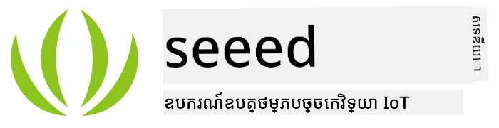
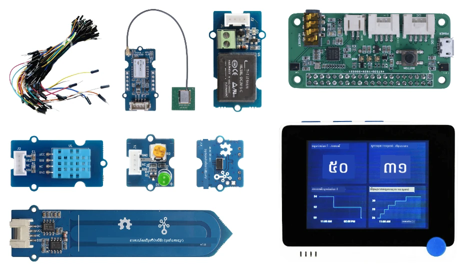
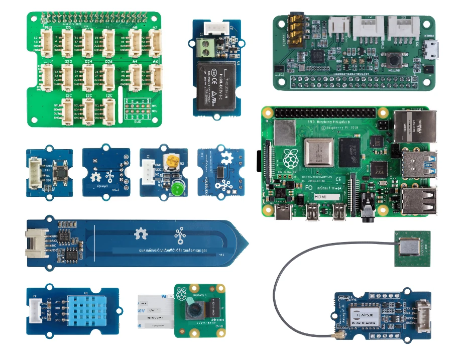

# Hardware

**T** ក្នុង IoT មានន័យថា **របស់** ហើយយោងទៅលើឧបករណ៍ដែលមានការប្រាស្រ័យជាមួយពិភពលោកជុំវិញយើង។ គម្រោងនីមួយៗស្ថិតលើឧបករណ៍ពិតដែលមានស្រាប់សម្រាប់សិស្សនិងអ្នកចំណង់ចំណូលចិត្ត។ យើងមានជម្រើសពីរនៃឧបករណ៍ IoT ដើម្បីប្រើផ្អែកលើចំណង់ចំណូលចិត្តផ្ទាល់ខ្លួន, ចំណេះដឹងភាសាកម្មវិធី ឬចំណង់ចំណូលចិត្ត, គោលដៅការសិក្សា និងការ​មានស្រាប់។ យើងក៏បានផ្តល់ជូននូវជម្រើស 'ឧបករណ៍វីរុចវ៉ាល់' សម្រាប់អ្នកដែលមិនមានឧបករណ៍ ឬចង់រៀនបន្ថែមមុនពេលធ្វើការជាវផងដែរ។

> 💁 អ្នកមិនចាំបាច់ទិញឧបករណ៍ IoT ដោយខ្លួនឯងដើម្បីបញ្ចប់ការងារគោលបំណងទេ។ អ្នកអាចធ្វើការទាំងអស់ដោយប្រើឧបករណ៍ IoT វីរុចវ៉ាល់។

ជម្រើសឧបករណ៍រូបប៉ះមាន Arduino ឬ Raspberry Pi។ វេទិកាទាំងពីរមានអត្ថប្រយោជន៍និងគុណវិបត្តិផ្ទាល់ខ្លួនរបស់ខ្លួន ហើយទាំងអស់ត្រូវបានគ្របដណ្តប់ក្នុងមេរៀនដំបូងមួយ។ បើអ្នកមិនទាន់សម្រេចចិត្តលើវេទិកាឧបករណ៍ណាមួយទេ អ្នកអាចពិនិត្យមើល [មេរៀនទីពីររបស់គម្រោងដំបូង](./1-getting-started/lessons/2-deeper-dive/README.md) ដើម្បីសម្រេចចិត្តថាវិបត្តិករឧបករណ៍ណាដែលអ្នកចាប់អារម្មណ៍ក្នុងការរៀន។

ឧបករណ៍ជាក់លាក់ត្រូវបានជ្រើសរើសដើម្បីកាត់បន្ថយភាពស្មុគស្មាញនៃមេរៀននិងការងារគោលបំណង។ ទោះបីឧបករណ៍ផ្សេងទៀតអាចប្រើបាន ក៏យើងមិនអាចធានាបានថាការងារគោលបំណងទាំងអស់នឹងគាំទ្រជាលើឧបករណ៍របស់អ្នកដោយគ្មានឧបករណ៍បន្ថែមទេ។ ឧទាហរណ៍ ឧបករណ៍ Arduino ច្រើនមិនមាន WiFi ដែលចាំបាច់សម្រាប់ភ្ជាប់ទៅកាន់ពពក - Wio terminal ត្រូវបានជ្រើសរើសដោយសារវាមាន WiFi ក្នងខ្លួន។

អ្នកនឹងត្រូវការផងដែរ ឧបករណ៍មិនជាក់លាក់បច្ចេកទេសមួយចំនួន ដូចជាដី ឬរុក្ខជាតិក្នុងចានផងដែរ ផ្លែឈើ ឬបន្លែរ។

## ទិញកញ្ចប់ឧបករណ៍

Seeed Studios បានយកចិត្តទុកដាក់ផ្តល់ឧបករណ៍ទាំងអស់ជាកញ្ចប់ដែលងាយស្រួលទិញ៖

### Arduino - Wio Terminal

**[IoT សម្រាប់អ្នកចាប់ផ្តើមជាមួយ Seeed និង Microsoft - កញ្ចប់ចាប់ផ្តើម Wio Terminal](https://www.seeedstudio.com/IoT-for-beginners-with-Seeed-and-Microsoft-Wio-Terminal-Starter-Kit-p-5006.html)**

### Raspberry Pi

**[IoT សម្រាប់អ្នកចាប់ផ្តើមជាមួយ Seeed និង Microsoft - កញ្ចប់ចាប់ផ្តើម Raspberry Pi 4](https://www.seeedstudio.com/IoT-for-beginners-with-Seeed-and-Microsoft-Raspberry-Pi-Starter-Kit-p-5004.html)**

## Arduino

កូដឧបករណ៍សម្រាប់ Arduino គឺនៅក្នុង C++។ ដើម្បីបញ្ចប់ការងារទាំងអស់ អ្នកនឹងត្រូវការធាតុដូចខាងក្រោម៖

### ឧបករណ៍ Arduino

* [Wio Terminal](https://www.seeedstudio.com/Wio-Terminal-p-4509.html)
* *ជម្រើស* - ខ្សែ USB-C ឬអ្នកបម្រើ USB-A ទៅ USB-C។ Wio terminal មានច្រក USB-C ហើយមានខ្សែ USB-C ទៅ USB-A។ ប្រសិនបើកុំព្យូទ័រឬ Mac របស់អ្នកមានតែមួយច្រក USB-C អ្នកនឹងត្រូវការខ្សែ USB-C ឬអ្នកបម្រើ USB-A ទៅ USB-C។

### ឧបករណ៍សំខាន់ៗសម្រាប់ Arduino

ទាំងនេះជាសម្រាប់ប្រើជាមួយឧបករណ៍ Arduino Wio terminal ហើយគ្មានទាក់ទងជាមួយ Raspberry Pi។

* [ArduCam Mini 2MP Plus - OV2640](https://www.arducam.com/product/arducam-2mp-spi-camera-b0067-arduino/)
* [ReSpeaker 2-Mics Pi HAT](https://www.seeedstudio.com/ReSpeaker-2-Mics-Pi-HAT.html)
* [ខ្សែ​ជុំ ត់​ជុំ Breadboard](https://www.seeedstudio.com/Breadboard-Jumper-Wire-Pack-241mm-200mm-160mm-117m-p-234.html)
* កាសស្តាប់ត្រចៀក ឬឧបករណ៍ផ្សេងដែលមានប្រភពសំឡេង 3.5 មម ច្រក ឬនិយាមកាស JST ដូចជា:
  * [រូបមួយ ហៅខាងលើជា Mono Enclosed Speaker - 2W 6 Ohm](https://www.seeedstudio.com/Mono-Enclosed-Speaker-2W-6-Ohm-p-2832.html)
* កាត microSD ទំហំ 16GB ឬតិចជាងនេះ ជាមួយឧបករណ៍ភ្ជាប់សម្រាប់ប្រើកាត SD ជាមួយកុំព្យូទ័រ ប្រសិនបើអ្នកមិនមានកាតក្នុងកុំព្យូទ័ររួចហើយ។ **សម្គាល់** - Wio Terminal គាំទ្រកាត SD ដល់ 16GB តែក៏មិនគាំទ្រច្រើនជាងនេះទេ។

## Raspberry Pi

កូដឧបករណ៍សម្រាប់ Raspberry Pi គឺនៅក្នុង Python។ ដើម្បីបញ្ចប់ការងារទាំងអស់ អ្នកនឹងត្រូវការធាតុដូចខាងក្រោម៖

### ឧបករណ៍ Raspberry Pi

* [Raspberry Pi](https://www.raspberrypi.org/products/raspberry-pi-4-model-b/)
  > 💁 កំណែពី Pi 2B ក្រោមនេះឡើងគួរត្រូវបានគាំទ្រក្នុងការងារបង្រៀនទាំងនេះ។ ប្រសិនបើអ្នកចង់ដំណើរការ VS Code យោងត្រង់លើ Pi នោះ ត្រូវការម៉ាស៊ីន Pi 4 មាន RAM 2GB ឬច្រើនជាងនេះ។ ប្រសិនបើអ្នកចូលប្រើ Pi ពីចម្ងាយ Pi 2B ឬលើកលែងទៀតគឺគ្រប់គ្រាន់។
* កាត microSD (អ្នកអាចទិញកញ្ចប់ Raspberry Pi ដែលមានកាត microSD រួមជាមួយ) ជាមួយឧបករណ៍ភ្ជាប់ដើម្បីប្រើកាត SD ជាមួយកុំព្យូទ័ររបស់អ្នក បើអ្នកមិនមានកាតក្នុងនោះរួច។
* ផ្គត់ផ្គង់ថាមពល USB (អ្នកអាចទិញកញ្ចប់ Raspberry Pi 4 ដែលមានផ្គត់ផ្គង់ថាមពលរួម)។ ប្រសិនបើអ្នកប្រើ Raspberry Pi 4 អ្នកត្រូវការផ្គត់ផ្គង់ថាមពល USB-C តាមបែបឧបករណ៍ពុម្ពមុនត្រូវការផ្គត់ផ្គង់ថាមពល micro-USB។

### ឧបករណ៍សំខាន់ៗសម្រាប់ Raspberry Pi

ទាំងនេះជាសម្រាប់ប្រើជាមួយ Raspberry Pi ហើយមិនមានទាក់ទងជាមួយ Arduino ឧបករណ៍ទេ។

* [Grove Pi base hat](https://www.seeedstudio.com/Grove-Base-Hat-for-Raspberry-Pi.html)
* [Raspberry Pi កាមេរ៉ាម៉ូឌុល](https://www.raspberrypi.org/products/camera-module-v2/)
* មីក្រូហ្វូន និងរ៉ឺម៉ក:

  ប្រើមួយក្នុងខាងក្រោម (ឬសមصلاحដូចគ្នា):
  * មីក្រូហ្វូន USB គ្រប់ប្រភេទជាមួយរ៉ឺម៉ក USB ណាមួយ ឬរ៉ឺម៉ក់ជាមួយខ្សែច្រក 3.5 មម ឬប្រើហ៊ុមដាយអូឌីយ៉ូ HDMI ប្រសិនបើ Raspberry Pi របស់អ្នកភ្ជាប់ទៅកាន់ម៉ូនីទ័រឬទូរទស្សន៍មានរ៉ឺម៉ក
  * កាស USB គ្រប់ប្រភេទដែលមានមីក្រូហ្វូនក្នុងខ្លួន
  * [ReSpeaker 2-Mics Pi HAT](https://www.seeedstudio.com/ReSpeaker-2-Mics-Pi-HAT.html) ជាមួយ
    * កាសស្តាប់ត្រចៀក ឬរ៉ឺម៉កផ្សេងដែលមានច្រក 3.5 មម ឬរ៉ឺម៉ក JST ដូចជា:
    * [រូបមួយធ្វើឱ្យကျរួចមើល - Mono Enclosed Speaker - 2W 6 Ohm](https://www.seeedstudio.com/Mono-Enclosed-Speaker-2W-6-Ohm-p-2832.html)
  * [USB Speakerphone](https://www.amazon.com/USB-Speakerphone-Conference-Business-Microphones/dp/B07Q3D7F8S/ref=sr_1_1?dchild=1&keywords=m0&qid=1614647389&sr=8-1)
* [Grove សំរាប់សំរាប់ពន្លឺ](https://www.seeedstudio.com/Grove-Light-Sensor-v1-2-LS06-S-phototransistor.html)
* [Grove ប៊ូតុង](https://www.seeedstudio.com/Grove-Button.html)

## ស៊ិនស័រនិងអាគុយឌៀត័រ

ភាគច្រើននៃស៊ិនស័រ និងអាគុយឌៀត័រដែលត្រូវការត្រូវបានប្រើទាំងពីរប្រភេទ Arduino និង Raspberry Pi ក្នុងផ្លូវសិក្សា៖

* [Grove LED](https://www.seeedstudio.com/Grove-LED-Pack-p-4364.html) x 2
* [Grove ស៊ិនស័រអាកាសធាតុ និងសំណើម](https://www.seeedstudio.com/Grove-Temperature-Humidity-Sensor-DHT11.html)
* [Grove ស៊ិនស័រឈីជីដីប្រភេទ capacitive](https://www.seeedstudio.com/Grove-Capacitive-Moisture-Sensor-Corrosion-Resistant.html)
* [Grove relay](https://www.seeedstudio.com/Grove-Relay.html)
* [Grove GPS (Air530)](https://www.seeedstudio.com/Grove-GPS-Air530-p-4584.html)
* [Grove ស៊ិនស័រប្រវែងខណៈពេលបញ្ជូនទម្ងន់](https://www.seeedstudio.com/Grove-Time-of-Flight-Distance-Sensor-VL53L0X.html)

## ឧបករណ៍ជម្រើសបន្ថែម

មេរៀនដែលទាក់ទងការស្រោចទឹកដោយស្វ័យប្រវត្តិប្រើ relay។ ជាជម្រើស អ្នកអាចភ្ជាប់ relay នេះទៅបូមទឹកដែលផ្គត់ផ្គង់ថាមពលដោយ USB ដោយប្រើឧបករណ៍បញ្ជីខាងក្រោម។

* [បូមទឹក 6V](https://www.seeedstudio.com/6V-Mini-Water-Pump-p-1945.html)
* [USB terminal](https://www.adafruit.com/product/3628)
* ថង់ស៊ីលីកូន
* ខ្សែពណ៌ក្រហម និងខ្មៅ
* ឧបករណ៍បង្កើតសោត្រង់ក្បាលតូចៗ

## ឧបករណ៍វីរុចវ៉ាល់

មុខងារនេះផ្តល់សម្ទកម្មសម្រាប់ស៊ិនស័រ និងអាគុយឌៀត័រដែលបានអនុវត្តក្នុង Python។ ផ្អែកលើភាពមានស្រាប់នៃឧបករណ៍របស់អ្នក អ្នកអាចដំណើរការនេះលើឧបករណ៍អភិវឌ្ឍន៍ធម្មតា របស់អ្នកដូចជា Mac, PC , ឬដំណើរការពី Raspberry Pi ហើយវាយកអ្នកអាចសម្តែងតែមួយហេតុថាឧបករណ៍ដែលអ្នកគ្មាន។ ឧទាហរណ៍ បើអ្នកមានកាមេរ៉ារ Raspberry Pi ប៉ុន្តែមិនមាន Grove ស៊ិនស័រ អ្នកនឹងអាចរត់កូដឧបករណ៍វីរុចវ៉ាល់នៅលើ Pi របស់អ្នក និងសម្តែង Grove ស៊ិនស័រ ប៉ុន្តែប្រើកាមេរ៉ារូបប៉ះ។

ឧបករណ៍វីរុចវ៉ាល់នេះប្រើប្រាស់គម្រោង [CounterFit](https://github.com/CounterFit-IoT/CounterFit)។

ដើម្បីបញ្ចប់មេរៀនទាំងនេះ អ្នកត្រូវតែមានមុខងារគ្មានស្រីសរីមួយ ធុងសំឡេង និងប្រភពសំឡេងដូចជា រ៉ឺម៉ក ឬកាសស្តាប់ត្រចៀក។ សំឡេងទាំងនេះអាចមានក្នុងឧបករណ៍ឬពីរបនា និងត្រូវតែបានកំណត់ឲ្យដំណើរការជាមួយប្រព័ន្ធប្រតិបត្តិការ​របស់អ្នក និងអាចប្រើបានពីកម្មវិធីទាំងអស់។

---

<!-- CO-OP TRANSLATOR DISCLAIMER START -->
**ការ​បដិសេធ**៖  
ឯកសារ​នេះ​ត្រូវ​បាន​បកប្រែ​ដោយប្រើ​សេវាកម្ម​បកប្រែ AI [Co-op Translator](https://github.com/Azure/co-op-translator)។ ខណៈពេល​ដែល​យើង​ព្យាយាម​រក​សុវត្ថិភាព​នៃ​ការ​បកប្រែ សូម​យល់​ព្រម​ថា​ការ​បកប្រែ​ដោយ​ស្វ័យកែទម្រង់​អាច​មាន​កំហុស ឬ​ការខ្វះខាត​លំបាកក្នុងការបកប្រែ។ ឯកសារដើម​ជា​ភាសាទីមូល​គួរឱ្យ​ត្រូវបាន​គេ​កត់សំគាល់​ជា​មូលដ្ឋានដ៍​សម្បូរ​គុណភាព។ សម្រាប់​ព័ត៌មាន​សំខាន់ៗ សូម​ពិចារណា​ការ​បកប្រែ​ដោយ​មនុស្ស​វិជ្ជាជីវៈ។ យើង​មិន​ត្រូវ​បាន​ទទួល​ខុសត្រូវចំពោះ​ការ​យល់​ខុស ឬ​ការបកប្រែ​មិន​ត្រឹមត្រូវ​ដែល​មាន​នឹង​មកពី​ការ​ប្រើប្រាស់​ការ​បកប្រែ​នេះ​នោះទេ។
<!-- CO-OP TRANSLATOR DISCLAIMER END -->