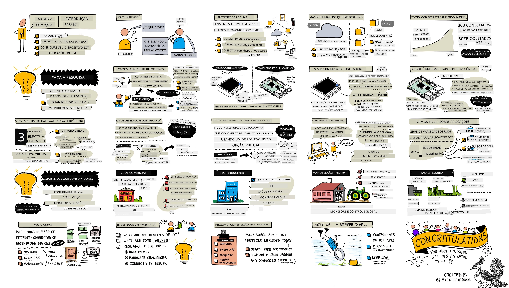
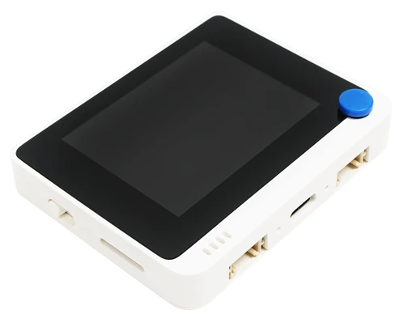

# Introdução ao IoT

> Resumo visual por [Nitya Narasimhan](https://github.com/nitya). Clique na imagem para uma versão maior.

Esta lição foi apresentada como parte da série [Hello IoT](https://youtube.com/playlist?list=PLmsFUfdnGr3xRts0TIwyaHyQuHaNQcb6-) do [Microsoft Reactor](https://developer.microsoft.com/reactor/?WT.mc_id=academic-17441-jabenn). A lição foi dividida em dois vídeos: uma aula de 1 hora e uma sessão de perguntas e respostas de 1 hora, explorando mais a fundo os tópicos e respondendo dúvidas.

> 🎥 Clique nas imagens acima para assistir aos vídeos

## Questionário pré-aula

[Questionário pré-aula](https://black-meadow-040d15503.1.azurestaticapps.net/quiz/1)

## Introdução

Esta lição aborda alguns tópicos introdutórios sobre a Internet das Coisas (IoT) e ajuda você a configurar seu hardware.

Nesta lição, abordaremos:

* [O que é a 'Internet das Coisas'?](../../../../../1-getting-started/lessons/1-introduction-to-iot)
* [Dispositivos IoT](../../../../../1-getting-started/lessons/1-introduction-to-iot)
* [Configurar seu dispositivo](../../../../../1-getting-started/lessons/1-introduction-to-iot)
* [Aplicações do IoT](../../../../../1-getting-started/lessons/1-introduction-to-iot)
* [Exemplos de dispositivos IoT ao seu redor](../../../../../1-getting-started/lessons/1-introduction-to-iot)

## O que é a 'Internet das Coisas'?

O termo 'Internet das Coisas' foi cunhado por [Kevin Ashton](https://wikipedia.org/wiki/Kevin_Ashton) em 1999, para se referir à conexão da Internet com o mundo físico por meio de sensores. Desde então, o termo tem sido usado para descrever qualquer dispositivo que interaja com o mundo físico ao seu redor, seja coletando dados de sensores ou fornecendo interações no mundo real por meio de atuadores (dispositivos que realizam ações, como ligar um interruptor ou acender um LED), geralmente conectados a outros dispositivos ou à Internet.

> **Sensores** coletam informações do mundo, como medir velocidade, temperatura ou localização.
>
> **Atuadores** convertem sinais elétricos em interações no mundo real, como acionar um interruptor, ligar luzes, emitir sons ou enviar sinais de controle para outros hardwares, por exemplo, para ligar uma tomada.

IoT, como área tecnológica, vai além dos dispositivos - inclui serviços baseados em nuvem que podem processar os dados dos sensores ou enviar comandos para atuadores conectados a dispositivos IoT. Também inclui dispositivos que não possuem ou não precisam de conectividade com a Internet, frequentemente chamados de dispositivos de borda. Esses dispositivos podem processar e responder aos dados dos sensores por conta própria, geralmente usando modelos de IA treinados na nuvem.

IoT é um campo tecnológico em rápido crescimento. Estima-se que, até o final de 2020, 30 bilhões de dispositivos IoT estavam implantados e conectados à Internet. Olhando para o futuro, estima-se que, até 2025, os dispositivos IoT estarão coletando quase 80 zettabytes de dados, ou 80 trilhões de gigabytes. Isso é muito dado!

✅ Faça uma pequena pesquisa: Quanto dos dados gerados por dispositivos IoT é realmente utilizado e quanto é desperdiçado? Por que tantos dados são ignorados?

Esses dados são a chave para o sucesso do IoT. Para ser um desenvolvedor de IoT bem-sucedido, você precisa entender quais dados coletar, como coletá-los, como tomar decisões com base neles e como usar essas decisões para interagir com o mundo físico, se necessário.

## Dispositivos IoT

O **T** em IoT significa **Things** (Coisas) - dispositivos que interagem com o mundo físico ao seu redor, seja coletando dados de sensores ou fornecendo interações no mundo real por meio de atuadores.

Dispositivos para uso comercial ou de produção, como rastreadores de fitness para consumidores ou controladores de máquinas industriais, geralmente são feitos sob medida. Eles utilizam placas de circuito personalizadas, talvez até processadores personalizados, projetados para atender às necessidades de uma tarefa específica, seja ser pequeno o suficiente para caber em um pulso ou robusto o suficiente para operar em ambientes de alta temperatura, estresse ou vibração.

Como desenvolvedor aprendendo sobre IoT ou criando um protótipo de dispositivo, você precisará começar com um kit de desenvolvimento. Esses são dispositivos IoT de uso geral projetados para desenvolvedores, frequentemente com recursos que não estariam presentes em um dispositivo de produção, como pinos externos para conectar sensores ou atuadores, hardware para suporte a depuração ou recursos adicionais que aumentariam o custo desnecessariamente em uma produção em larga escala.

Esses kits de desenvolvimento geralmente se dividem em duas categorias - microcontroladores e computadores de placa única. Eles serão apresentados aqui, e entraremos em mais detalhes na próxima lição.

> 💁 Seu telefone também pode ser considerado um dispositivo IoT de uso geral, com sensores e atuadores integrados, usados de diferentes maneiras por diferentes aplicativos com diferentes serviços na nuvem. Você pode até encontrar tutoriais de IoT que utilizam um aplicativo de telefone como dispositivo IoT.

### Microcontroladores

Um microcontrolador (também chamado de MCU, abreviação de microcontroller unit) é um pequeno computador composto por:

🧠 Um ou mais processadores centrais (CPUs) - o 'cérebro' do microcontrolador que executa seu programa

💾 Memória (RAM e memória de programa) - onde seu programa, dados e variáveis são armazenados

🔌 Conexões de entrada/saída (I/O) programáveis - para comunicação com periféricos externos (dispositivos conectados), como sensores e atuadores

Microcontroladores são dispositivos de computação de baixo custo, com preços médios para aqueles usados em hardware personalizado caindo para cerca de US$0,50, e alguns dispositivos custando apenas US$0,03. Kits de desenvolvimento podem começar a partir de US$4, com custos aumentando conforme mais recursos são adicionados. O [Wio Terminal](https://www.seeedstudio.com/Wio-Terminal-p-4509.html), um kit de desenvolvimento de microcontrolador da [Seeed Studios](https://www.seeedstudio.com) que possui sensores, atuadores, WiFi e uma tela, custa cerca de US$30.

> 💁 Ao pesquisar microcontroladores na Internet, tenha cuidado ao procurar pelo termo **MCU**, pois isso pode trazer muitos resultados relacionados ao Universo Cinematográfico da Marvel, e não a microcontroladores.

Microcontroladores são projetados para executar um número limitado de tarefas muito específicas, em vez de serem computadores de uso geral como PCs ou Macs. Exceto em cenários muito específicos, você não pode conectar um monitor, teclado e mouse e usá-los para tarefas gerais.

Kits de desenvolvimento de microcontroladores geralmente vêm com sensores e atuadores adicionais integrados. A maioria das placas terá um ou mais LEDs programáveis, além de outros dispositivos, como conectores padrão para adicionar mais sensores ou atuadores usando ecossistemas de vários fabricantes ou sensores integrados (geralmente os mais populares, como sensores de temperatura). Alguns microcontroladores possuem conectividade sem fio integrada, como Bluetooth ou WiFi, ou possuem microcontroladores adicionais na placa para adicionar essa conectividade.

> 💁 Microcontroladores geralmente são programados em C/C++.

### Computadores de placa única

Um computador de placa única é um pequeno dispositivo de computação que contém todos os elementos de um computador completo em uma única placa pequena. Esses dispositivos possuem especificações próximas às de um PC ou Mac, executam um sistema operacional completo, mas são menores, consomem menos energia e são substancialmente mais baratos.

O Raspberry Pi é um dos computadores de placa única mais populares.

Assim como um microcontrolador, computadores de placa única possuem CPU, memória e pinos de entrada/saída, mas têm recursos adicionais, como um chip gráfico para permitir a conexão de monitores, saídas de áudio e portas USB para conectar teclados, mouses e outros dispositivos USB padrão, como webcams ou armazenamento externo. Programas são armazenados em cartões SD ou discos rígidos, junto com um sistema operacional, em vez de um chip de memória integrado à placa.

> 🎓 Você pode pensar em um computador de placa única como uma versão menor e mais barata do PC ou Mac que você está usando, com a adição de pinos GPIO (entrada/saída de uso geral) para interagir com sensores e atuadores.

Computadores de placa única são computadores completos, então podem ser programados em qualquer linguagem. Dispositivos IoT geralmente são programados em Python.

### Escolha de hardware para as próximas lições

Todas as lições subsequentes incluem tarefas usando um dispositivo IoT para interagir com o mundo físico e se comunicar com a nuvem. Cada lição suporta 3 opções de dispositivos - Arduino (usando um Seeed Studios Wio Terminal) ou um computador de placa única, seja um dispositivo físico (um Raspberry Pi 4) ou um computador de placa única virtual rodando no seu PC ou Mac.

Você pode ler sobre o hardware necessário para completar todas as tarefas no [guia de hardware](../../../hardware.md).

> 💁 Você não precisa comprar nenhum hardware IoT para completar as tarefas, é possível fazer tudo usando um computador de placa única virtual.

A escolha do hardware depende de você - depende do que você tem disponível em casa ou na escola, e da linguagem de programação que você conhece ou planeja aprender. Ambas as variantes de hardware usarão o mesmo ecossistema de sensores, então, se você começar com uma, poderá mudar para a outra sem precisar substituir a maior parte do kit. O computador de placa única virtual será equivalente a aprender em um Raspberry Pi, com a maior parte do código sendo transferível para o Pi, caso você eventualmente adquira um dispositivo e sensores.

### Kit de desenvolvimento Arduino

Se você estiver interessado em aprender desenvolvimento de microcontroladores, pode completar as tarefas usando um dispositivo Arduino. Você precisará de um entendimento básico de programação em C/C++, pois as lições ensinarão apenas o código relevante para o framework Arduino, os sensores e atuadores utilizados e as bibliotecas que interagem com a nuvem.

As tarefas usarão o [Visual Studio Code](https://code.visualstudio.com/?WT.mc_id=academic-17441-jabenn) com a [extensão PlatformIO para desenvolvimento de microcontroladores](https://platformio.org). Você também pode usar o Arduino IDE se já estiver familiarizado com essa ferramenta, mas as instruções não serão fornecidas.

### Kit de desenvolvimento de computador de placa única

Se você estiver interessado em aprender desenvolvimento IoT usando computadores de placa única, pode completar as tarefas usando um Raspberry Pi ou um dispositivo virtual rodando no seu PC ou Mac.

Você precisará de um entendimento básico de programação em Python, pois as lições ensinarão apenas o código relevante para os sensores e atuadores utilizados e as bibliotecas que interagem com a nuvem.

> 💁 Se você quiser aprender a programar em Python, confira as seguintes séries de vídeos:
>
> * [Python para iniciantes](https://channel9.msdn.com/Series/Intro-to-Python-Development?WT.mc_id=academic-17441-jabenn)
> * [Mais Python para iniciantes](https://channel9.msdn.com/Series/More-Python-for-Beginners?WT.mc_id=academic-7372-jabenn)

As tarefas usarão o [Visual Studio Code](https://code.visualstudio.com/?WT.mc_id=academic-17441-jabenn).

Se você estiver usando um Raspberry Pi, pode rodar seu Pi com a versão desktop completa do Raspberry Pi OS e fazer toda a codificação diretamente no Pi usando [a versão do VS Code para Raspberry Pi OS](https://code.visualstudio.com/docs/setup/raspberry-pi?WT.mc_id=academic-17441-jabenn), ou rodar seu Pi como um dispositivo sem cabeça e codificar a partir do seu PC ou Mac usando o VS Code com a [extensão Remote SSH](https://code.visualstudio.com/docs/remote/ssh?WT.mc_id=academic-17441-jabenn), que permite conectar-se ao seu Pi e editar, depurar e executar código como se estivesse codificando diretamente nele.

Se você optar pela opção de dispositivo virtual, codificará diretamente no seu computador. Em vez de acessar sensores e atuadores, você usará uma ferramenta para simular esse hardware, fornecendo valores de sensores que você pode definir e exibindo os resultados dos atuadores na tela.

## Configurar seu dispositivo

Antes de começar a programar seu dispositivo IoT, será necessário realizar uma pequena configuração. Siga as instruções relevantes abaixo, dependendo do dispositivo que você usará.
💁 Se você ainda não tem um dispositivo, consulte o [guia de hardware](../../../hardware.md) para ajudar a decidir qual dispositivo você vai usar e quais componentes adicionais você precisa comprar. Não é necessário comprar hardware, pois todos os projetos podem ser executados em hardware virtual.
Essas instruções incluem links para sites de terceiros dos criadores do hardware ou ferramentas que você usará. Isso é para garantir que você sempre tenha as instruções mais atualizadas para as diversas ferramentas e hardwares.

Siga o guia relevante para configurar seu dispositivo e concluir um projeto 'Hello World'. Este será o primeiro passo para criar uma luminária noturna IoT ao longo das 4 lições desta parte introdutória.

* [Arduino - Wio Terminal](wio-terminal.md)  
* [Computador de placa única - Raspberry Pi](pi.md)  
* [Computador de placa única - Dispositivo virtual](virtual-device.md)  

✅ Você usará o VS Code tanto para Arduino quanto para computadores de placa única. Se você nunca usou antes, leia mais sobre ele no [site do VS Code](https://code.visualstudio.com?WT.mc_id=academic-17441-jabenn).

## Aplicações de IoT

IoT abrange uma ampla gama de casos de uso, divididos em alguns grandes grupos:

* IoT para Consumidores  
* IoT Comercial  
* IoT Industrial  
* IoT para Infraestrutura  

✅ Faça uma pequena pesquisa: Para cada uma das áreas descritas abaixo, encontre um exemplo concreto que não esteja mencionado no texto.

### IoT para Consumidores

IoT para consumidores refere-se a dispositivos IoT que os consumidores compram e usam em casa. Alguns desses dispositivos são incrivelmente úteis, como alto-falantes inteligentes, sistemas de aquecimento inteligentes e aspiradores robóticos. Outros têm sua utilidade questionável, como torneiras controladas por voz que não podem ser desligadas porque o controle de voz não consegue ouvi-lo sobre o som da água corrente.

Dispositivos IoT para consumidores estão capacitando as pessoas a fazer mais em seus ambientes, especialmente o 1 bilhão de pessoas com deficiência. Aspiradores robóticos podem manter os pisos limpos para pessoas com problemas de mobilidade que não conseguem aspirar sozinhas, fornos controlados por voz permitem que pessoas com visão limitada ou dificuldades motoras aqueçam seus fornos apenas com a voz, e monitores de saúde permitem que pacientes acompanhem condições crônicas com atualizações mais regulares e detalhadas. Esses dispositivos estão se tornando tão comuns que até crianças pequenas os utilizam no dia a dia, como estudantes em ensino remoto durante a pandemia de COVID configurando temporizadores em dispositivos inteligentes para acompanhar suas tarefas escolares ou alarmes para lembrar de reuniões de aula.

✅ Quais dispositivos IoT para consumidores você tem consigo ou em sua casa?

### IoT Comercial

IoT comercial abrange o uso de IoT no ambiente de trabalho. Em escritórios, pode haver sensores de ocupação e detectores de movimento para gerenciar iluminação e aquecimento, mantendo as luzes e o aquecimento desligados quando não são necessários, reduzindo custos e emissões de carbono. Em fábricas, dispositivos IoT podem monitorar riscos de segurança, como trabalhadores sem capacetes ou níveis de ruído perigosos. No varejo, dispositivos IoT podem medir a temperatura de câmaras frias, alertando o proprietário da loja se uma geladeira ou freezer estiver fora da faixa de temperatura necessária, ou monitorar itens nas prateleiras para direcionar os funcionários a reabastecer produtos vendidos. A indústria de transporte está cada vez mais dependente de IoT para monitorar a localização de veículos, rastrear quilometragem para cobrança de uso de estradas, acompanhar horas de trabalho dos motoristas e conformidade com pausas, ou notificar a equipe quando um veículo está se aproximando de um depósito para preparar o carregamento ou descarregamento.

✅ Quais dispositivos IoT comerciais você tem em sua escola ou local de trabalho?

### IoT Industrial (IIoT)

IoT Industrial, ou IIoT, é o uso de dispositivos IoT para controlar e gerenciar máquinas em larga escala. Isso abrange uma ampla gama de casos de uso, desde fábricas até agricultura digital.

Fábricas usam dispositivos IoT de várias maneiras. Máquinas podem ser monitoradas com múltiplos sensores para rastrear coisas como temperatura, vibração e velocidade de rotação. Esses dados podem ser monitorados para permitir que a máquina seja desligada se sair de certas tolerâncias - por exemplo, se estiver muito quente. Esses dados também podem ser coletados e analisados ao longo do tempo para realizar manutenção preditiva, onde modelos de IA analisam os dados que antecedem uma falha e os utilizam para prever outras falhas antes que ocorram.

A agricultura digital é essencial para alimentar a crescente população mundial, especialmente para os 2 bilhões de pessoas em 500 milhões de lares que dependem da [agricultura de subsistência](https://wikipedia.org/wiki/Subsistence_agriculture). A agricultura digital pode variar de sensores simples e baratos a grandes instalações comerciais. Um agricultor pode começar monitorando temperaturas e usando [graus-dia de crescimento](https://wikipedia.org/wiki/Growing_degree-day) para prever quando uma colheita estará pronta para a colheita. Eles podem conectar o monitoramento de umidade do solo a sistemas de irrigação automatizados para fornecer às plantas a quantidade exata de água necessária, sem desperdício. Alguns agricultores vão além, utilizando drones, dados de satélite e IA para monitorar o crescimento das culturas, doenças e qualidade do solo em grandes áreas de terra.

✅ Que outros dispositivos IoT poderiam ajudar os agricultores?

### IoT para Infraestrutura

IoT para infraestrutura monitora e controla a infraestrutura local e global que as pessoas usam diariamente.

[Cidades Inteligentes](https://wikipedia.org/wiki/Smart_city) são áreas urbanas que utilizam dispositivos IoT para coletar dados sobre a cidade e usá-los para melhorar seu funcionamento. Essas cidades geralmente são geridas por colaborações entre governos locais, academia e empresas locais, monitorando e gerenciando desde transporte até estacionamento e poluição. Por exemplo, em Copenhague, Dinamarca, a poluição do ar é uma preocupação importante para os moradores, então ela é medida e os dados são usados para fornecer informações sobre as rotas mais limpas para ciclismo e corrida.

[Redes elétricas inteligentes](https://wikipedia.org/wiki/Smart_grid) permitem melhores análises da demanda de energia ao coletar dados de uso no nível de residências individuais. Esses dados podem orientar decisões em nível nacional, como onde construir novas usinas, e em nível pessoal, fornecendo aos usuários insights sobre o consumo de energia, horários de maior uso e até sugestões para reduzir custos, como carregar carros elétricos à noite.

✅ Se você pudesse adicionar dispositivos IoT para medir algo onde você mora, o que seria?

## Exemplos de dispositivos IoT que você pode ter ao seu redor

Você ficaria surpreso com a quantidade de dispositivos IoT que tem ao seu redor. Estou escrevendo isso de casa e tenho os seguintes dispositivos conectados à Internet com recursos inteligentes, como controle por aplicativo, controle por voz ou a capacidade de enviar dados para mim via celular:

* Vários alto-falantes inteligentes  
* Geladeira, lava-louças, forno e micro-ondas  
* Monitor de eletricidade para painéis solares  
* Tomadas inteligentes  
* Campainha com vídeo e câmeras de segurança  
* Termostato inteligente com vários sensores inteligentes de ambiente  
* Abridor de porta de garagem  
* Sistemas de entretenimento doméstico e TVs controladas por voz  
* Lâmpadas  
* Rastreadores de saúde e fitness  

Todos esses tipos de dispositivos possuem sensores e/ou atuadores e se conectam à Internet. Posso verificar pelo celular se a porta da minha garagem está aberta e pedir ao meu alto-falante inteligente para fechá-la. Posso até configurá-la para fechar automaticamente à noite, caso ainda esteja aberta. Quando minha campainha toca, posso ver pelo celular quem está lá, onde quer que eu esteja no mundo, e falar com a pessoa por meio de um alto-falante e microfone embutidos na campainha. Posso monitorar minha glicose no sangue, frequência cardíaca e padrões de sono, procurando padrões nos dados para melhorar minha saúde. Posso controlar minhas luzes pela nuvem e ficar no escuro quando minha conexão com a Internet cai.

---

## 🚀 Desafio

Liste quantos dispositivos IoT você puder que estão em sua casa, escola ou local de trabalho - pode haver mais do que você imagina!

## Questionário pós-aula

[Questionário pós-aula](https://black-meadow-040d15503.1.azurestaticapps.net/quiz/2)

## Revisão e Autoestudo

Leia sobre os benefícios e falhas de projetos de IoT para consumidores. Confira sites de notícias para artigos sobre quando algo deu errado, como problemas de privacidade, falhas de hardware ou problemas causados pela falta de conectividade.

Alguns exemplos:

* Confira a conta do Twitter **[Internet of Sh*t](https://twitter.com/internetofshit)** *(aviso de linguagem imprópria)* para bons exemplos de falhas em IoT para consumidores.  
* [c|net - Meu Apple Watch salvou minha vida: 5 pessoas compartilham suas histórias](https://www.cnet.com/news/apple-watch-lifesaving-health-features-read-5-peoples-stories/)  
* [c|net - Técnico da ADT se declara culpado de espionar feeds de câmeras de clientes por anos](https://www.cnet.com/news/adt-home-security-technician-pleads-guilty-to-spying-on-customer-camera-feeds-for-years/) *(aviso de gatilho - voyeurismo não consensual)*  

## Tarefa

[Investigue um projeto de IoT](assignment.md)  

---

**Aviso Legal**:  
Este documento foi traduzido utilizando o serviço de tradução por IA [Co-op Translator](https://github.com/Azure/co-op-translator). Embora nos esforcemos para garantir a precisão, esteja ciente de que traduções automatizadas podem conter erros ou imprecisões. O documento original em seu idioma nativo deve ser considerado a fonte autoritativa. Para informações críticas, recomenda-se a tradução profissional realizada por humanos. Não nos responsabilizamos por quaisquer mal-entendidos ou interpretações equivocadas decorrentes do uso desta tradução.