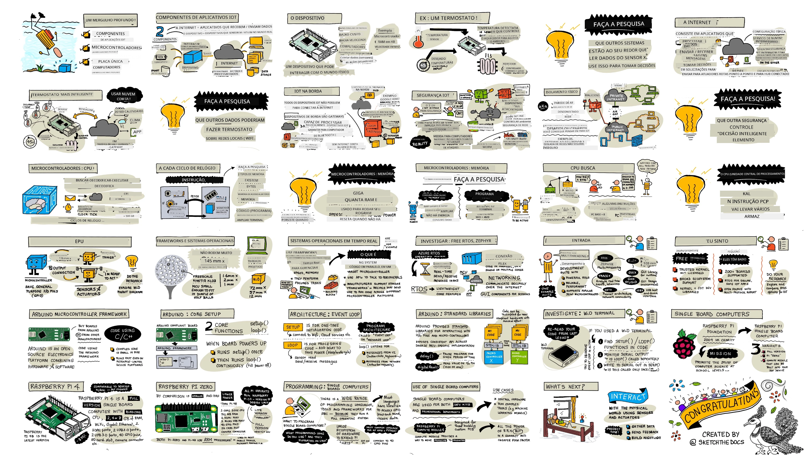
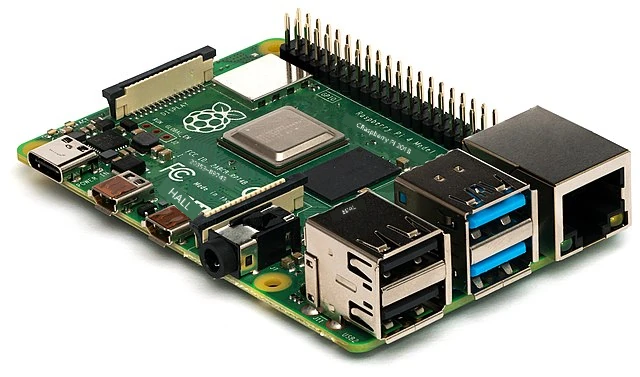
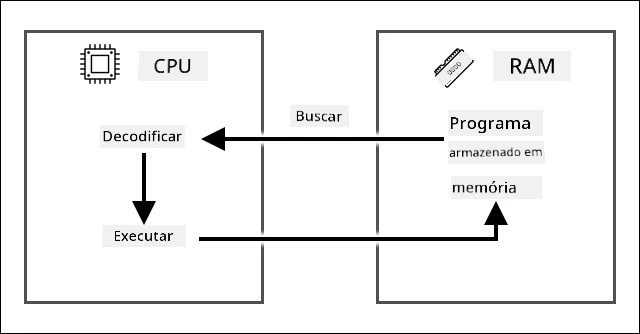
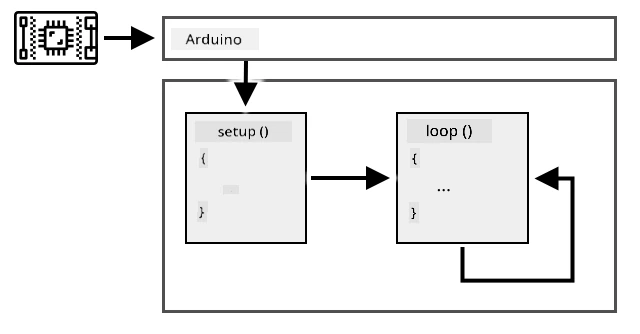
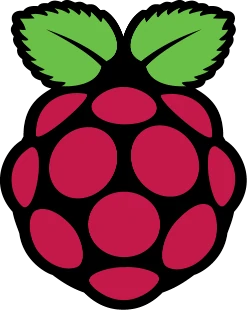
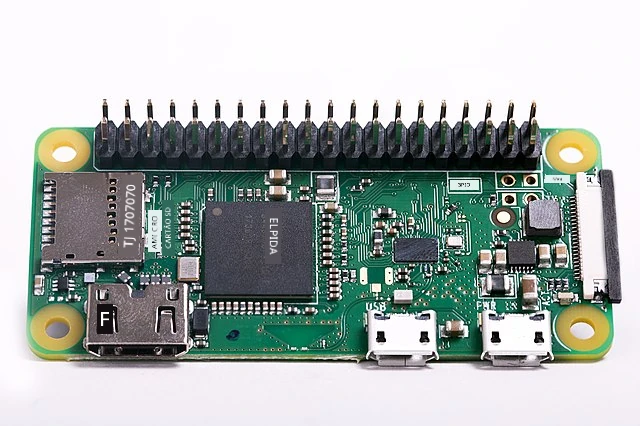

# Um mergulho mais profundo no IoT

> Ilustração por [Nitya Narasimhan](https://github.com/nitya). Clique na imagem para uma versão maior.

Esta lição foi apresentada como parte da série [Hello IoT](https://youtube.com/playlist?list=PLmsFUfdnGr3xRts0TIwyaHyQuHaNQcb6-) do [Microsoft Reactor](https://developer.microsoft.com/reactor/?WT.mc_id=academic-17441-jabenn). A lição foi dividida em dois vídeos - uma aula de 1 hora e uma sessão de perguntas e respostas de 1 hora, explorando mais a fundo os tópicos abordados e respondendo a dúvidas.

> 🎥 Clique nas imagens acima para assistir aos vídeos

## Questionário pré-aula

[Questionário pré-aula](https://black-meadow-040d15503.1.azurestaticapps.net/quiz/3)

## Introdução

Nesta lição, vamos nos aprofundar em alguns dos conceitos abordados na lição anterior.

Nesta lição, veremos:

* [Componentes de uma aplicação IoT](../../../../../1-getting-started/lessons/2-deeper-dive)
* [Explorando mais a fundo os microcontroladores](../../../../../1-getting-started/lessons/2-deeper-dive)
* [Explorando mais a fundo os computadores de placa única](../../../../../1-getting-started/lessons/2-deeper-dive)

## Componentes de uma aplicação IoT

Os dois componentes principais de uma aplicação IoT são a *Internet* e o *dispositivo*. Vamos analisar esses dois componentes com mais detalhes.

### O Dispositivo

A parte do **Dispositivo** no IoT refere-se a um equipamento que pode interagir com o mundo físico. Esses dispositivos geralmente são pequenos, de baixo custo, com computadores que operam em baixa velocidade e consomem pouca energia - por exemplo, microcontroladores simples com apenas alguns kilobytes de RAM (em comparação com gigabytes em um PC), funcionando a algumas centenas de megahertz (em comparação com gigahertz em um PC), mas consumindo tão pouca energia que podem operar por semanas, meses ou até anos com baterias.

Esses dispositivos interagem com o mundo físico, seja usando sensores para coletar dados do ambiente ou controlando saídas ou atuadores para realizar mudanças físicas. Um exemplo típico é um termostato inteligente - um dispositivo que possui um sensor de temperatura, um meio de definir a temperatura desejada, como um botão ou tela sensível ao toque, e uma conexão com um sistema de aquecimento ou resfriamento que pode ser ativado quando a temperatura detectada estiver fora da faixa desejada. O sensor de temperatura detecta que o ambiente está muito frio e um atuador liga o aquecimento.

Há uma enorme variedade de dispositivos que podem atuar como dispositivos IoT, desde hardware dedicado que detecta uma única coisa até dispositivos de uso geral, como seu smartphone! Um smartphone pode usar sensores para detectar o ambiente ao seu redor e atuadores para interagir com o mundo - por exemplo, usando um sensor GPS para detectar sua localização e um alto-falante para fornecer instruções de navegação até um destino.

✅ Pense em outros sistemas ao seu redor que leem dados de um sensor e os utilizam para tomar decisões. Um exemplo seria o termostato de um forno. Consegue encontrar mais exemplos?

### A Internet

A parte da **Internet** em uma aplicação IoT consiste em aplicativos aos quais o dispositivo IoT pode se conectar para enviar e receber dados, bem como outros aplicativos que podem processar os dados do dispositivo IoT e ajudar a tomar decisões sobre quais solicitações enviar aos atuadores do dispositivo IoT.

Uma configuração típica seria ter algum tipo de serviço em nuvem ao qual o dispositivo IoT se conecta. Esse serviço em nuvem lida com questões como segurança, além de receber mensagens do dispositivo IoT e enviar mensagens de volta ao dispositivo. Esse serviço em nuvem, por sua vez, conecta-se a outros aplicativos que podem processar ou armazenar dados de sensores, ou usar esses dados em conjunto com informações de outros sistemas para tomar decisões.

Os dispositivos nem sempre se conectam diretamente à Internet via Wi-Fi ou conexões com fio. Alguns dispositivos usam redes mesh para se comunicarem entre si por meio de tecnologias como Bluetooth, conectando-se a um dispositivo hub que possui uma conexão com a Internet.

No exemplo de um termostato inteligente, o termostato se conectaria à rede Wi-Fi doméstica e a um serviço em nuvem. Ele enviaria os dados de temperatura para esse serviço em nuvem, que os armazenaria em um banco de dados, permitindo que o proprietário verificasse as temperaturas atuais e passadas por meio de um aplicativo no celular. Outro serviço na nuvem saberia qual temperatura o proprietário deseja e enviaria mensagens de volta ao dispositivo IoT, por meio do serviço em nuvem, para informar ao sistema de aquecimento quando ligar ou desligar.

Uma versão ainda mais inteligente poderia usar IA na nuvem com dados de outros sensores conectados a outros dispositivos IoT, como sensores de ocupação que detectam quais cômodos estão em uso, além de dados como condições climáticas e até mesmo seu calendário, para tomar decisões sobre como ajustar a temperatura de forma inteligente. Por exemplo, poderia desligar o aquecimento se ler no seu calendário que você está de férias, ou ajustar o aquecimento de acordo com os cômodos que você utiliza, aprendendo com os dados para ser cada vez mais preciso ao longo do tempo.

✅ Que outros dados poderiam ajudar a tornar um termostato conectado à Internet mais inteligente?

### IoT na Borda

Embora o "I" em IoT signifique Internet, esses dispositivos não precisam necessariamente se conectar à Internet. Em alguns casos, os dispositivos podem se conectar a dispositivos de borda - dispositivos de gateway que operam na sua rede local, permitindo que você processe dados sem precisar fazer chamadas pela Internet. Isso pode ser mais rápido quando há muitos dados ou uma conexão de Internet lenta, permite que você opere offline onde a conectividade com a Internet não é possível, como em um navio ou em uma área de desastre durante uma resposta humanitária, e permite que você mantenha os dados privados. Alguns dispositivos contêm códigos de processamento criados com ferramentas em nuvem e executam esses códigos localmente para coletar e responder a dados sem usar uma conexão com a Internet para tomar decisões.

Um exemplo disso é um dispositivo doméstico inteligente, como um Apple HomePod, Amazon Alexa ou Google Home, que escuta sua voz usando modelos de IA treinados na nuvem, mas que são executados localmente no dispositivo. Esses dispositivos "acordam" quando uma palavra ou frase específica é dita e só então enviam sua fala pela Internet para processamento. O dispositivo para de enviar sua fala em um momento apropriado, como quando detecta uma pausa na sua fala. Tudo o que você diz antes de ativar o dispositivo com a palavra de ativação e tudo o que você diz depois que o dispositivo para de ouvir não será enviado pela Internet ao provedor do dispositivo, garantindo sua privacidade.

✅ Pense em outros cenários onde a privacidade é importante, de modo que o processamento de dados seria melhor realizado na borda em vez de na nuvem. Como dica - pense em dispositivos IoT com câmeras ou outros dispositivos de imagem.

### Segurança no IoT

Com qualquer conexão à Internet, a segurança é uma consideração importante. Existe uma piada antiga que diz que "o S em IoT significa Segurança" - não há "S" em IoT, implicando que não é seguro.

Dispositivos IoT se conectam a um serviço em nuvem e, portanto, são tão seguros quanto esse serviço em nuvem - se o serviço permitir que qualquer dispositivo se conecte, dados maliciosos podem ser enviados ou ataques de vírus podem ocorrer. Isso pode ter consequências muito reais, já que dispositivos IoT interagem e controlam outros dispositivos. Por exemplo, o [worm Stuxnet](https://wikipedia.org/wiki/Stuxnet) manipulou válvulas em centrífugas para danificá-las. Hackers também aproveitaram [falhas de segurança para acessar babás eletrônicas](https://www.npr.org/sections/thetwo-way/2018/06/05/617196788/s-c-mom-says-baby-monitor-was-hacked-experts-say-many-devices-are-vulnerable) e outros dispositivos de vigilância doméstica.

> 💁 Às vezes, dispositivos IoT e dispositivos de borda operam em uma rede completamente isolada da Internet para manter os dados privados e seguros. Isso é conhecido como [air-gapping](https://wikipedia.org/wiki/Air_gap_(networking)).

## Explorando mais a fundo os microcontroladores

Na lição anterior, apresentamos os microcontroladores. Agora, vamos analisá-los mais detalhadamente.

### CPU

A CPU é o "cérebro" do microcontrolador. É o processador que executa seu código e pode enviar e receber dados de dispositivos conectados. CPUs podem conter um ou mais núcleos - essencialmente, um ou mais processadores que podem trabalhar juntos para executar seu código.

As CPUs dependem de um relógio que "tique" milhões ou bilhões de vezes por segundo. Cada tique, ou ciclo, sincroniza as ações que a CPU pode realizar. A cada tique, a CPU pode executar uma instrução de um programa, como recuperar dados de um dispositivo externo ou realizar um cálculo matemático. Esse ciclo regular permite que todas as ações sejam concluídas antes que a próxima instrução seja processada.

Quanto mais rápido o ciclo do relógio, mais instruções podem ser processadas por segundo e, portanto, mais rápida é a CPU. As velocidades das CPUs são medidas em [Hertz (Hz)](https://wikipedia.org/wiki/Hertz), uma unidade padrão onde 1 Hz significa um ciclo ou tique do relógio por segundo.

> 🎓 As velocidades das CPUs geralmente são dadas em MHz ou GHz. 1MHz é 1 milhão de Hz, 1GHz é 1 bilhão de Hz.

> 💁 As CPUs executam programas usando o [ciclo buscar-decodificar-executar](https://wikipedia.org/wiki/Instruction_cycle). A cada tique do relógio, a CPU buscará a próxima instrução na memória, decodificará e a executará, como usar uma unidade lógica aritmética (ALU) para somar dois números. Algumas execuções podem levar vários tiques para serem concluídas, então o próximo ciclo será executado no próximo tique após a conclusão da instrução.

Microcontroladores têm velocidades de relógio muito mais baixas do que computadores desktop ou laptops, ou mesmo a maioria dos smartphones. O Wio Terminal, por exemplo, possui uma CPU que opera a 120MHz ou 120.000.000 ciclos por segundo.

✅ Um PC ou Mac médio possui uma CPU com múltiplos núcleos operando a vários GigaHertz, o que significa que o relógio "tique" bilhões de vezes por segundo. Pesquise a velocidade do relógio do seu computador e compare quantas vezes ele é mais rápido que o Wio Terminal.

Cada ciclo do relógio consome energia e gera calor. Quanto mais rápidos os tiques, mais energia é consumida e mais calor é gerado. PCs possuem dissipadores de calor e ventiladores para remover o calor, sem os quais eles superaqueceriam e desligariam em segundos. Microcontroladores geralmente não possuem esses recursos, pois operam em temperaturas muito mais baixas e, portanto, em velocidades muito mais lentas. PCs funcionam com energia elétrica ou baterias grandes por algumas horas, enquanto microcontroladores podem operar por dias, meses ou até anos com pequenas baterias. Microcontroladores também podem ter núcleos que operam em diferentes velocidades, alternando para núcleos mais lentos e de baixo consumo de energia quando a demanda na CPU é baixa, para reduzir o consumo de energia.

> 💁 Alguns PCs e Macs estão adotando a mesma combinação de núcleos rápidos de alto desempenho e núcleos mais lentos e eficientes, alternando para economizar bateria. Por exemplo, o chip M1 nos últimos laptops da Apple pode alternar entre 4 núcleos de desempenho e 4 núcleos de eficiência para otimizar a vida útil da bateria ou a velocidade, dependendo da tarefa em execução.

✅ Faça uma pequena pesquisa: Leia sobre CPUs no [artigo da Wikipedia sobre CPU](https://wikipedia.org/wiki/Central_processing_unit)

#### Tarefa

Investigue o Wio Terminal.

Se você estiver usando um Wio Terminal para essas lições, tente encontrar a CPU. Encontre a seção *Hardware Overview* na [página do produto Wio Terminal](https://www.seeedstudio.com/Wio-Terminal-p-4509.html) para uma imagem dos componentes internos e tente localizar a CPU através da janela de plástico transparente na parte de trás.

### Memória

Microcontroladores geralmente possuem dois tipos de memória - memória de programa e memória de acesso aleatório (RAM).

A memória de programa é não volátil, o que significa que o que é gravado nela permanece mesmo quando não há energia no dispositivo. Essa é a memória que armazena o código do seu programa.

A RAM é a memória usada pelo programa em execução, contendo variáveis alocadas pelo seu programa e dados coletados de periféricos. A RAM é volátil, ou seja, quando a energia é desligada, o conteúdo é perdido, efetivamente reiniciando seu programa.
🎓 A memória de programa armazena seu código e permanece mesmo quando não há energia.
🎓 A RAM é usada para executar seu programa e é reiniciada quando não há energia

Assim como no caso da CPU, a memória de um microcontrolador é muitas ordens de magnitude menor do que a de um PC ou Mac. Um PC típico pode ter 8 Gigabytes (GB) de RAM, ou 8.000.000.000 bytes, sendo que cada byte tem espaço suficiente para armazenar uma única letra ou um número de 0 a 255. Um microcontrolador, por outro lado, geralmente possui apenas Kilobytes (KB) de RAM, sendo que um kilobyte equivale a 1.000 bytes. O terminal Wio mencionado acima possui 192KB de RAM, ou 192.000 bytes - mais de 40.000 vezes menos do que um PC médio!

O diagrama abaixo mostra a diferença de tamanho relativa entre 192KB e 8GB - o pequeno ponto no centro representa 192KB.

O armazenamento de programas também é menor do que em um PC. Um PC típico pode ter um disco rígido de 500GB para armazenamento de programas, enquanto um microcontrolador pode ter apenas kilobytes ou, talvez, alguns megabytes (MB) de armazenamento (1MB equivale a 1.000KB, ou 1.000.000 bytes). O terminal Wio possui 4MB de armazenamento para programas.

✅ Faça uma pequena pesquisa: Quanto de RAM e armazenamento tem o computador que você está usando para ler isso? Como isso se compara a um microcontrolador?

### Entrada/Saída

Microcontroladores precisam de conexões de entrada e saída (I/O) para ler dados de sensores e enviar sinais de controle para atuadores. Eles geralmente possuem vários pinos de entrada/saída de uso geral (GPIO). Esses pinos podem ser configurados via software como entrada (ou seja, recebem um sinal) ou saída (enviam um sinal).

🧠⬅️ Pinos de entrada são usados para ler valores de sensores

🧠➡️ Pinos de saída enviam instruções para atuadores

✅ Você aprenderá mais sobre isso em uma lição futura.

#### Tarefa

Investigue o terminal Wio.

Se você estiver usando um terminal Wio para estas lições, localize os pinos GPIO. Encontre a seção *Pinout diagram* na [página do produto Wio Terminal](https://www.seeedstudio.com/Wio-Terminal-p-4509.html) para aprender quais pinos são quais. O terminal Wio vem com um adesivo que você pode colar na parte de trás com os números dos pinos, então adicione isso agora, se ainda não o fez.

### Tamanho físico

Microcontroladores geralmente são pequenos em tamanho, sendo que o menor, um [Freescale Kinetis KL03 MCU, é pequeno o suficiente para caber na cavidade de uma bola de golfe](https://www.edn.com/tiny-arm-cortex-m0-based-mcu-shrinks-package/). Apenas a CPU de um PC pode medir 40mm x 40mm, sem incluir os dissipadores de calor e ventiladores necessários para garantir que a CPU funcione por mais de alguns segundos sem superaquecer, o que é substancialmente maior do que um microcontrolador completo. O kit de desenvolvimento do terminal Wio, com um microcontrolador, caixa, tela e uma variedade de conexões e componentes, não é muito maior do que uma CPU Intel i9 nua, e é substancialmente menor do que a CPU com um dissipador de calor e ventilador!

| Dispositivo                     | Tamanho               |
| ------------------------------- | --------------------- |
| Freescale Kinetis KL03          | 1,6mm x 2mm x 1mm     |
| Terminal Wio                    | 72mm x 57mm x 12mm    |
| CPU Intel i9, dissipador e vent. | 136mm x 145mm x 103mm |

### Frameworks e sistemas operacionais

Devido à sua baixa velocidade e tamanho de memória, microcontroladores não executam um sistema operacional (SO) no sentido tradicional, como em desktops. O sistema operacional que faz seu computador funcionar (Windows, Linux ou macOS) precisa de muita memória e poder de processamento para executar tarefas que são completamente desnecessárias para um microcontrolador. Lembre-se de que microcontroladores geralmente são programados para realizar uma ou mais tarefas muito específicas, ao contrário de um computador de propósito geral como um PC ou Mac, que precisa suportar uma interface de usuário, reproduzir músicas ou filmes, fornecer ferramentas para escrever documentos ou códigos, jogar ou navegar na Internet.

Para programar um microcontrolador sem um SO, você precisa de algumas ferramentas que permitam construir seu código de forma que o microcontrolador possa executá-lo, usando APIs que possam se comunicar com quaisquer periféricos. Cada microcontrolador é diferente, então os fabricantes normalmente suportam frameworks padrão que permitem seguir uma 'receita' padrão para construir seu código e fazê-lo rodar em qualquer microcontrolador que suporte aquele framework.

Você pode programar microcontroladores usando um SO - frequentemente chamado de sistema operacional em tempo real (RTOS), pois são projetados para lidar com o envio de dados para e de periféricos em tempo real. Esses sistemas operacionais são muito leves e fornecem recursos como:

* Multithreading, permitindo que seu código execute mais de um bloco de código ao mesmo tempo, seja em múltiplos núcleos ou alternando em um único núcleo
* Rede para permitir comunicação segura pela Internet
* Componentes de interface gráfica (GUI) para construir interfaces de usuário (UI) em dispositivos com telas.

✅ Leia sobre alguns RTOS diferentes: [Azure RTOS](https://azure.microsoft.com/services/rtos/?WT.mc_id=academic-17441-jabenn), [FreeRTOS](https://www.freertos.org), [Zephyr](https://www.zephyrproject.org)

#### Arduino

[Arduino](https://www.arduino.cc) é provavelmente o framework de microcontroladores mais popular, especialmente entre estudantes, entusiastas e makers. Arduino é uma plataforma de eletrônica de código aberto que combina software e hardware. Você pode comprar placas compatíveis com Arduino da própria Arduino ou de outros fabricantes, e então programá-las usando o framework Arduino.

As placas Arduino são programadas em C ou C++. Usar C/C++ permite que seu código seja compilado de forma muito compacta e execute rapidamente, algo necessário em um dispositivo com recursos limitados, como um microcontrolador. O núcleo de uma aplicação Arduino é chamado de sketch e é um código em C/C++ com 2 funções - `setup` e `loop`. Quando a placa é ligada, o código do framework Arduino executa a função `setup` uma vez, e então executa a função `loop` repetidamente, continuamente, até que a energia seja desligada.

Você escreveria seu código de configuração na função `setup`, como conectar-se ao WiFi e serviços na nuvem ou inicializar pinos para entrada e saída. Seu código de processamento ficaria na função `loop`, como ler de um sensor e enviar o valor para a nuvem. Normalmente, você incluiria um atraso em cada loop; por exemplo, se quiser que os dados do sensor sejam enviados a cada 10 segundos, adicionaria um atraso de 10 segundos no final do loop para que o microcontrolador possa dormir, economizando energia, e então executar o loop novamente quando necessário, 10 segundos depois.

✅ Essa arquitetura de programa é conhecida como *event loop* ou *message loop*. Muitas aplicações usam isso nos bastidores e é o padrão para a maioria das aplicações desktop que rodam em SOs como Windows, macOS ou Linux. O `loop` escuta mensagens de componentes da interface do usuário, como botões, ou dispositivos como o teclado, e responde a elas. Você pode ler mais neste [artigo sobre event loop](https://wikipedia.org/wiki/Event_loop).

O Arduino fornece bibliotecas padrão para interagir com microcontroladores e os pinos de I/O, com diferentes implementações internas para rodar em diferentes microcontroladores. Por exemplo, a função [`delay`](https://www.arduino.cc/reference/en/language/functions/time/delay/) pausa o programa por um período de tempo especificado, e a função [`digitalRead`](https://www.arduino.cc/reference/en/language/functions/digital-io/digitalread/) lê um valor `HIGH` ou `LOW` do pino especificado, independentemente da placa em que o código está sendo executado. Essas bibliotecas padrão significam que o código Arduino escrito para uma placa pode ser recompilado para qualquer outra placa Arduino e funcionará, assumindo que os pinos sejam os mesmos e as placas suportem os mesmos recursos.

Existe um grande ecossistema de bibliotecas Arduino de terceiros que permitem adicionar recursos extras aos seus projetos Arduino, como usar sensores e atuadores ou conectar-se a serviços de IoT na nuvem.

##### Tarefa

Investigue o terminal Wio.

Se você estiver usando um terminal Wio para estas lições, releia o código que escreveu na última lição. Encontre as funções `setup` e `loop`. Monitore a saída serial para verificar que a função `loop` está sendo chamada repetidamente. Tente adicionar código à função `setup` para escrever na porta serial e observe que esse código é chamado apenas uma vez a cada vez que você reinicia o dispositivo. Tente reiniciar seu dispositivo com o interruptor de energia na lateral para mostrar que isso é chamado toda vez que o dispositivo é reiniciado.

## Explorando mais a fundo os computadores de placa única

Na última lição, introduzimos os computadores de placa única. Agora vamos explorá-los mais a fundo.

### Raspberry Pi

A [Raspberry Pi Foundation](https://www.raspberrypi.org) é uma organização de caridade do Reino Unido fundada em 2009 para promover o estudo de ciência da computação, especialmente no nível escolar. Como parte dessa missão, eles desenvolveram um computador de placa única chamado Raspberry Pi. Atualmente, os Raspberry Pis estão disponíveis em 3 variantes - uma versão de tamanho completo, o menor Pi Zero, e um módulo de computação que pode ser integrado ao seu dispositivo IoT final.

A última iteração do Raspberry Pi de tamanho completo é o Raspberry Pi 4B. Ele possui uma CPU quad-core (4 núcleos) rodando a 1,5GHz, 2, 4 ou 8GB de RAM, ethernet gigabit, WiFi, 2 portas HDMI que suportam telas 4k, uma saída de áudio e vídeo composto, portas USB (2 USB 2.0, 2 USB 3.0), 40 pinos GPIO, um conector de câmera para um módulo de câmera Raspberry Pi e um slot para cartão SD. Tudo isso em uma placa de 88mm x 58mm x 19,5mm, alimentada por uma fonte USB-C de 3A. Esses modelos começam em US$35, muito mais baratos do que um PC ou Mac.

> 💁 Há também um Pi400, um computador tudo-em-um com um Pi4 embutido em um teclado.

O Pi Zero é muito menor e consome menos energia. Ele possui uma CPU de núcleo único de 1GHz, 512MB de RAM, WiFi (no modelo Zero W), uma única porta HDMI, uma porta micro-USB, 40 pinos GPIO, um conector de câmera para um módulo de câmera Raspberry Pi e um slot para cartão SD. Ele mede 65mm x 30mm x 5mm e consome muito pouca energia. O Zero custa US$5, enquanto a versão W com WiFi custa US$10.

> 🎓 As CPUs de ambos os modelos são processadores ARM, ao contrário dos processadores Intel/AMD x86 ou x64 encontrados na maioria dos PCs e Macs. Esses processadores são semelhantes aos encontrados em alguns microcontroladores, bem como na maioria dos celulares, no Microsoft Surface X e nos novos Macs baseados no Apple Silicon.

Todas as variantes do Raspberry Pi executam uma versão do Debian Linux chamada Raspberry Pi OS. Esta está disponível em uma versão lite, sem desktop, perfeita para projetos 'headless' onde você não precisa de uma tela, ou uma versão completa com um ambiente desktop completo, incluindo navegador, aplicativos de escritório, ferramentas de programação e jogos. Como o sistema operacional é uma versão do Debian Linux, você pode instalar qualquer aplicação ou ferramenta que rode no Debian e seja construída para o processador ARM dentro do Pi.

#### Tarefa

Investigue o Raspberry Pi.

Se você estiver usando um Raspberry Pi para estas lições, leia sobre os diferentes componentes de hardware na placa.

* Você pode encontrar detalhes sobre os processadores usados na [página de documentação de hardware do Raspberry Pi](https://www.raspberrypi.org/documentation/hardware/raspberrypi/). Leia sobre o processador usado no Pi que você está utilizando.
* Localize os pinos GPIO. Leia mais sobre eles na [documentação GPIO do Raspberry Pi](https://www.raspberrypi.org/documentation/hardware/raspberrypi/gpio/README.md). Use o [guia de uso dos pinos GPIO](https://www.raspberrypi.org/documentation/usage/gpio/README.md) para identificar os diferentes pinos no seu Pi.

### Programando computadores de placa única

Computadores de placa única são computadores completos, executando um sistema operacional completo. Isso significa que há uma ampla gama de linguagens de programação, frameworks e ferramentas que você pode usar para programá-los, ao contrário dos microcontroladores, que dependem do suporte da placa em frameworks como o Arduino. A maioria das linguagens de programação possui bibliotecas que podem acessar os pinos GPIO para enviar e receber dados de sensores e atuadores.

✅ Quais linguagens de programação você conhece? Elas são suportadas no Linux?

A linguagem de programação mais comum para construir aplicações IoT em um Raspberry Pi é Python. Existe um enorme ecossistema de hardware projetado para o Pi, e quase todos incluem o código relevante necessário para usá-los como bibliotecas Python. Alguns desses ecossistemas são baseados em 'hats' - assim chamados porque se encaixam no topo do Pi como um chapéu e se conectam a um grande soquete nos 40 pinos GPIO. Esses hats fornecem capacidades adicionais, como telas, sensores, carros controlados remotamente ou adaptadores para conectar sensores com cabos padronizados.
### Uso de computadores de placa única em implantações profissionais de IoT

Computadores de placa única são usados em implantações profissionais de IoT, não apenas como kits de desenvolvimento. Eles podem ser uma maneira poderosa de controlar hardware e executar tarefas complexas, como rodar modelos de aprendizado de máquina. Por exemplo, existe o [módulo de computação Raspberry Pi 4](https://www.raspberrypi.org/blog/raspberry-pi-compute-module-4/) que oferece toda a potência de um Raspberry Pi 4, mas em um formato compacto e mais barato, sem a maioria das portas, projetado para ser instalado em hardware personalizado.

---

## 🚀 Desafio

O desafio da última aula foi listar o maior número possível de dispositivos IoT que você tem em casa, na escola ou no local de trabalho. Para cada dispositivo dessa lista, você acha que eles são baseados em microcontroladores, computadores de placa única ou até mesmo uma mistura de ambos?

## Questionário pós-aula

[Questionário pós-aula](https://black-meadow-040d15503.1.azurestaticapps.net/quiz/4)

## Revisão e Autoestudo

* Leia o [guia de introdução ao Arduino](https://www.arduino.cc/en/Guide/Introduction) para entender mais sobre a plataforma Arduino.
* Leia a [introdução ao Raspberry Pi 4](https://www.raspberrypi.org/products/raspberry-pi-4-model-b/) para aprender mais sobre os Raspberry Pis.
* Aprenda mais sobre alguns dos conceitos e siglas no [artigo "O que são CPUs, MPUs, MCUs e GPUs" no Electrical Engineering Journal](https://www.eejournal.com/article/what-the-faq-are-cpus-mpus-mcus-and-gpus/).

✅ Use esses guias, junto com os custos mostrados seguindo os links no [guia de hardware](../../../hardware.md), para decidir qual plataforma de hardware você deseja usar ou se prefere usar um dispositivo virtual.

## Tarefa

[Compare e contraste microcontroladores e computadores de placa única](assignment.md)

---

**Aviso Legal**:  
Este documento foi traduzido utilizando o serviço de tradução por IA [Co-op Translator](https://github.com/Azure/co-op-translator). Embora nos esforcemos para garantir a precisão, esteja ciente de que traduções automatizadas podem conter erros ou imprecisões. O documento original em seu idioma nativo deve ser considerado a fonte autoritativa. Para informações críticas, recomenda-se a tradução profissional realizada por humanos. Não nos responsabilizamos por quaisquer mal-entendidos ou interpretações equivocadas decorrentes do uso desta tradução.