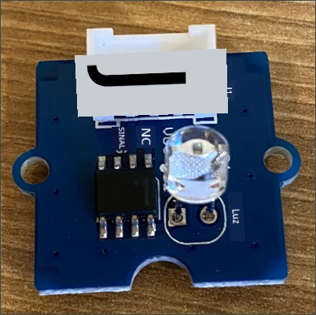
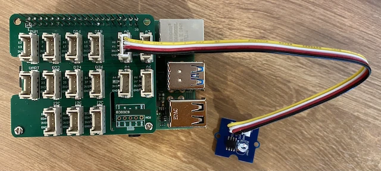

# Construa uma luz noturna - Raspberry Pi

Nesta parte da lição, você adicionará um sensor de luz ao seu Raspberry Pi.

## Hardware

O sensor para esta lição é um **sensor de luz** que utiliza um [fotodiodo](https://wikipedia.org/wiki/Photodiode) para converter luz em um sinal elétrico. Este é um sensor analógico que envia um valor inteiro de 0 a 1.000 indicando uma quantidade relativa de luz que não corresponde a nenhuma unidade de medida padrão, como [lux](https://wikipedia.org/wiki/Lux).

O sensor de luz é um sensor Grove externo e precisa ser conectado ao Grove Base Hat no Raspberry Pi.

### Conecte o sensor de luz

O sensor de luz Grove, usado para detectar os níveis de luz, precisa ser conectado ao Raspberry Pi.

#### Tarefa - conectar o sensor de luz

Conecte o sensor de luz.



1. Insira uma extremidade de um cabo Grove no conector do módulo do sensor de luz. Ele só encaixará de uma maneira.

1. Com o Raspberry Pi desligado, conecte a outra extremidade do cabo Grove ao conector analógico marcado como **A0** no Grove Base Hat conectado ao Pi. Este conector é o segundo da direita, na fileira de conectores ao lado dos pinos GPIO.



## Programe o sensor de luz

O dispositivo agora pode ser programado usando o sensor de luz Grove.

### Tarefa - programar o sensor de luz

Programe o dispositivo.

1. Ligue o Raspberry Pi e aguarde o boot.

1. Abra o projeto de luz noturna no VS Code que você criou na parte anterior desta tarefa, seja executando diretamente no Pi ou conectado usando a extensão Remote SSH.

1. Abra o arquivo `app.py` e remova todo o código existente.

1. Adicione o seguinte código ao arquivo `app.py` para importar algumas bibliotecas necessárias:

    ```python
    import time
    from grove.grove_light_sensor_v1_2 import GroveLightSensor
    ```

    A instrução `import time` importa o módulo `time`, que será usado mais tarde nesta tarefa.

    A instrução `from grove.grove_light_sensor_v1_2 import GroveLightSensor` importa o `GroveLightSensor` das bibliotecas Python Grove. Esta biblioteca contém o código para interagir com um sensor de luz Grove e foi instalada globalmente durante a configuração do Pi.

1. Adicione o seguinte código após o código acima para criar uma instância da classe que gerencia o sensor de luz:

    ```python
    light_sensor = GroveLightSensor(0)
    ```

    A linha `light_sensor = GroveLightSensor(0)` cria uma instância da classe `GroveLightSensor` conectando ao pino **A0** - o pino analógico Grove ao qual o sensor de luz está conectado.

1. Adicione um loop infinito após o código acima para consultar o valor do sensor de luz e imprimi-lo no console:

    ```python
    while True:
        light = light_sensor.light
        print('Light level:', light)
    ```

    Isso lerá o nível atual de luz em uma escala de 0-1.023 usando a propriedade `light` da classe `GroveLightSensor`. Esta propriedade lê o valor analógico do pino. Este valor é então impresso no console.

1. Adicione uma pequena pausa de um segundo no final do `loop`, já que os níveis de luz não precisam ser verificados continuamente. Uma pausa reduz o consumo de energia do dispositivo.

    ```python
    time.sleep(1)
    ```

1. No Terminal do VS Code, execute o seguinte comando para rodar seu aplicativo Python:

    ```sh
    python3 app.py
    ```

    Os valores de luz serão exibidos no console. Cubra e descubra o sensor de luz, e os valores irão mudar:

    ```output
    pi@raspberrypi:~/nightlight $ python3 app.py 
    Light level: 634
    Light level: 634
    Light level: 634
    Light level: 230
    Light level: 104
    Light level: 290
    ```

> 💁 Você pode encontrar este código na pasta [code-sensor/pi](../../../../../1-getting-started/lessons/3-sensors-and-actuators/code-sensor/pi).

😀 Adicionar um sensor ao seu programa de luz noturna foi um sucesso!

---

**Aviso Legal**:  
Este documento foi traduzido utilizando o serviço de tradução por IA [Co-op Translator](https://github.com/Azure/co-op-translator). Embora nos esforcemos para garantir a precisão, esteja ciente de que traduções automatizadas podem conter erros ou imprecisões. O documento original em seu idioma nativo deve ser considerado a fonte autoritativa. Para informações críticas, recomenda-se a tradução profissional realizada por humanos. Não nos responsabilizamos por quaisquer mal-entendidos ou interpretações equivocadas decorrentes do uso desta tradução.