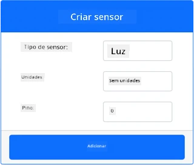
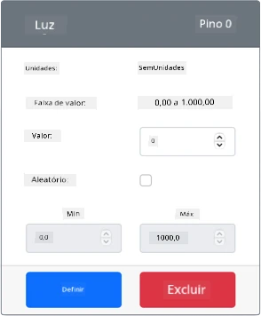

# Construa uma luz noturna - Hardware IoT Virtual

Nesta parte da lição, você adicionará um sensor de luz ao seu dispositivo IoT virtual.

## Hardware Virtual

A luz noturna precisa de um sensor, criado no aplicativo CounterFit.

O sensor é um **sensor de luz**. Em um dispositivo IoT físico, seria um [fotodiodo](https://wikipedia.org/wiki/Photodiodo) que converte luz em um sinal elétrico. Sensores de luz são sensores analógicos que enviam um valor inteiro indicando uma quantidade relativa de luz, que não corresponde a nenhuma unidade de medida padrão, como [lux](https://wikipedia.org/wiki/Lux).

### Adicionar os sensores ao CounterFit

Para usar um sensor de luz virtual, você precisa adicioná-lo ao aplicativo CounterFit.

#### Tarefa - adicionar os sensores ao CounterFit

Adicione o sensor de luz ao aplicativo CounterFit.

1. Certifique-se de que o aplicativo web CounterFit está em execução a partir da parte anterior desta tarefa. Caso contrário, inicie-o.

1. Crie um sensor de luz:

    1. Na caixa *Create sensor* no painel *Sensors*, abra o menu suspenso *Sensor type* e selecione *Light*.

    1. Deixe a opção *Units* configurada como *NoUnits*.

    1. Certifique-se de que o *Pin* está configurado como *0*.

    1. Selecione o botão **Add** para criar o sensor de luz no pino 0.

    

    O sensor de luz será criado e aparecerá na lista de sensores.

    

## Programar o sensor de luz

Agora o dispositivo pode ser programado para usar o sensor de luz integrado.

### Tarefa - programar o sensor de luz

Programe o dispositivo.

1. Abra o projeto da luz noturna no VS Code que você criou na parte anterior desta tarefa. Finalize e recrie o terminal para garantir que ele esteja sendo executado usando o ambiente virtual, se necessário.

1. Abra o arquivo `app.py`.

1. Adicione o seguinte código no início do arquivo `app.py`, junto com as outras declarações de `import`, para importar algumas bibliotecas necessárias:

    ```python
    import time
    from counterfit_shims_grove.grove_light_sensor_v1_2 import GroveLightSensor
    ```

    A declaração `import time` importa o módulo `time` do Python, que será usado mais tarde nesta tarefa.

    A declaração `from counterfit_shims_grove.grove_light_sensor_v1_2 import GroveLightSensor` importa o `GroveLightSensor` das bibliotecas shim do CounterFit Grove para Python. Essa biblioteca contém o código para interagir com um sensor de luz criado no aplicativo CounterFit.

1. Adicione o seguinte código ao final do arquivo para criar instâncias de classes que gerenciam o sensor de luz:

    ```python
    light_sensor = GroveLightSensor(0)
    ```

    A linha `light_sensor = GroveLightSensor(0)` cria uma instância da classe `GroveLightSensor` conectando-se ao pino **0** - o pino do CounterFit Grove ao qual o sensor de luz está conectado.

1. Adicione um loop infinito após o código acima para consultar o valor do sensor de luz e imprimi-lo no console:

    ```python
    while True:
        light = light_sensor.light
        print('Light level:', light)
    ```

    Isso lerá o nível atual de luz usando a propriedade `light` da classe `GroveLightSensor`. Essa propriedade lê o valor analógico do pino. Esse valor é então impresso no console.

1. Adicione uma pequena pausa de um segundo no final do loop `while`, já que os níveis de luz não precisam ser verificados continuamente. Uma pausa reduz o consumo de energia do dispositivo.

    ```python
    time.sleep(1)
    ```

1. No Terminal do VS Code, execute o seguinte comando para rodar seu aplicativo Python:

    ```sh
    python3 app.py
    ```

    Os valores de luz serão exibidos no console. Inicialmente, esse valor será 0.

1. No aplicativo CounterFit, altere o valor do sensor de luz que será lido pelo aplicativo. Você pode fazer isso de duas maneiras:

    * Insira um número na caixa *Value* do sensor de luz e, em seguida, selecione o botão **Set**. O número que você inserir será o valor retornado pelo sensor.

    * Marque a caixa *Random* e insira um valor *Min* e *Max*, depois selecione o botão **Set**. Toda vez que o sensor ler um valor, ele lerá um número aleatório entre *Min* e *Max*.

    Os valores que você definir serão exibidos no console. Altere o *Value* ou as configurações de *Random* para fazer o valor mudar.

    ```output
    (.venv) ➜  GroveTest python3 app.py 
    Light level: 143
    Light level: 244
    Light level: 246
    Light level: 253
    ```

> 💁 Você pode encontrar este código na pasta [code-sensor/virtual-device](../../../../../1-getting-started/lessons/3-sensors-and-actuators/code-sensor/virtual-device).

😀 Seu programa de luz noturna foi um sucesso!

---

**Aviso Legal**:  
Este documento foi traduzido utilizando o serviço de tradução por IA [Co-op Translator](https://github.com/Azure/co-op-translator). Embora nos esforcemos para garantir a precisão, esteja ciente de que traduções automatizadas podem conter erros ou imprecisões. O documento original em seu idioma nativo deve ser considerado a fonte autoritativa. Para informações críticas, recomenda-se a tradução profissional realizada por humanos. Não nos responsabilizamos por quaisquer mal-entendidos ou interpretações equivocadas decorrentes do uso desta tradução.