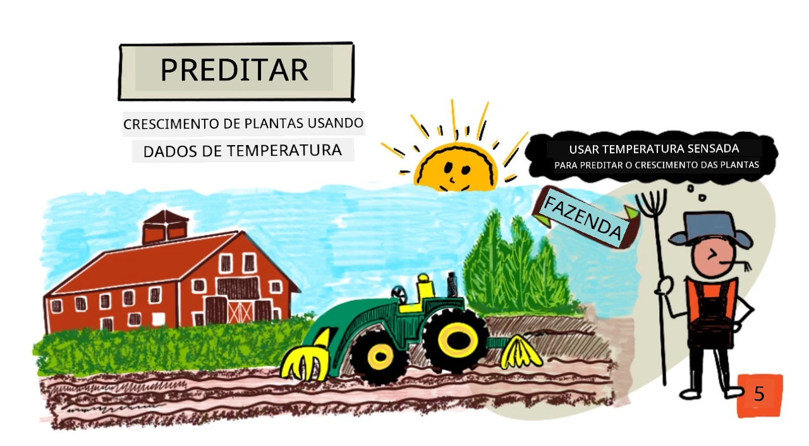
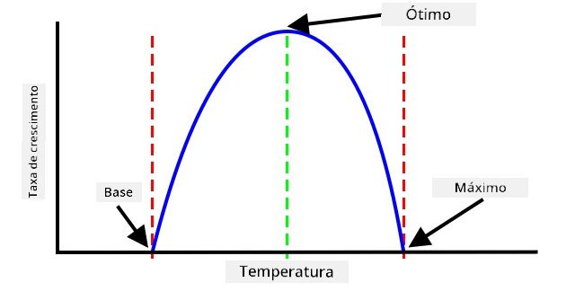
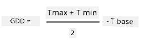
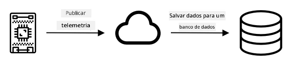
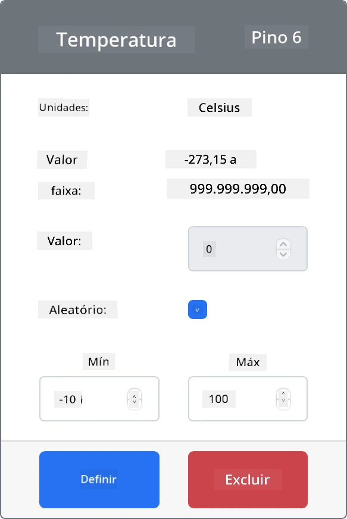

# Prever o crescimento de plantas com IoT



> Ilustração por [Nitya Narasimhan](https://github.com/nitya). Clique na imagem para uma versão maior.

## Questionário pré-aula

[Questionário pré-aula](https://black-meadow-040d15503.1.azurestaticapps.net/quiz/9)

## Introdução

As plantas precisam de certos elementos para crescer - água, dióxido de carbono, nutrientes, luz e calor. Nesta lição, você aprenderá como calcular as taxas de crescimento e maturidade das plantas medindo a temperatura do ar.

Nesta lição, abordaremos:

* [Agricultura digital](../../../../../2-farm/lessons/1-predict-plant-growth)
* [Por que a temperatura é importante na agricultura?](../../../../../2-farm/lessons/1-predict-plant-growth)
* [Medir a temperatura ambiente](../../../../../2-farm/lessons/1-predict-plant-growth)
* [Graus-dia de crescimento (GDD)](../../../../../2-farm/lessons/1-predict-plant-growth)
* [Calcular GDD usando dados de sensores de temperatura](../../../../../2-farm/lessons/1-predict-plant-growth)

## Agricultura digital

A Agricultura Digital está transformando a forma como cultivamos, utilizando ferramentas para coletar, armazenar e analisar dados da agricultura. Estamos atualmente em um período descrito como a 'Quarta Revolução Industrial' pelo Fórum Econômico Mundial, e o surgimento da agricultura digital tem sido chamado de 'Quarta Revolução Agrícola' ou 'Agricultura 4.0'.

> 🎓 O termo Agricultura Digital também inclui toda a 'cadeia de valor agrícola', ou seja, toda a jornada do campo até a mesa. Isso inclui o rastreamento da qualidade dos produtos enquanto os alimentos são transportados e processados, sistemas de armazéns e e-commerce, até mesmo aplicativos de aluguel de tratores!

Essas mudanças permitem que os agricultores aumentem a produtividade, usem menos fertilizantes e pesticidas e otimizem o uso da água. Embora seja usada principalmente em países mais ricos, sensores e outros dispositivos estão gradualmente se tornando mais acessíveis em países em desenvolvimento devido à redução de custos.

Algumas técnicas possibilitadas pela agricultura digital incluem:

* Medição de temperatura - medir a temperatura permite que os agricultores prevejam o crescimento e a maturidade das plantas.
* Irrigação automatizada - medir a umidade do solo e ativar sistemas de irrigação quando o solo estiver muito seco, em vez de usar irrigação programada. A irrigação programada pode levar a sub-irrigação durante períodos quentes e secos ou a irrigação excessiva durante chuvas. Ao regar apenas quando o solo precisa, os agricultores podem otimizar o uso da água.
* Controle de pragas - os agricultores podem usar câmeras em robôs automatizados ou drones para verificar a presença de pragas e aplicar pesticidas apenas onde necessário, reduzindo a quantidade de pesticidas usados e minimizando o escoamento de pesticidas para os suprimentos de água locais.

✅ Faça uma pesquisa. Quais outras técnicas são usadas para melhorar os rendimentos agrícolas?

> 🎓 O termo 'Agricultura de Precisão' é usado para definir a observação, medição e resposta às necessidades das culturas em uma base por campo ou até mesmo por partes de um campo. Isso inclui medir níveis de água, nutrientes e pragas e responder de forma precisa, como irrigar apenas uma pequena parte de um campo.

## Por que a temperatura é importante na agricultura?

Ao aprender sobre plantas, a maioria dos estudantes é ensinada sobre a necessidade de água, luz, dióxido de carbono e nutrientes. As plantas também precisam de calor para crescer - é por isso que as plantas florescem na primavera, quando a temperatura aumenta, por que flores como campânulas ou narcisos podem brotar cedo devido a um curto período de calor, e por que estufas são tão eficazes para o crescimento das plantas.

> 🎓 Estufas e casas de vegetação têm funções semelhantes, mas com uma diferença importante. As casas de vegetação são aquecidas artificialmente e permitem que os agricultores controlem as temperaturas com mais precisão, enquanto as estufas dependem do sol para aquecimento e geralmente têm apenas janelas ou outras aberturas para liberar o calor.

As plantas têm uma temperatura base ou mínima, uma temperatura ótima e uma temperatura máxima, todas baseadas nas temperaturas médias diárias.

* Temperatura base - é a temperatura média diária mínima necessária para que uma planta cresça.
* Temperatura ótima - é a melhor temperatura média diária para obter o maior crescimento.
* Temperatura máxima - é a temperatura máxima que uma planta pode suportar. Acima disso, a planta interrompe seu crescimento para tentar conservar água e sobreviver.

> 💁 Essas são temperaturas médias, calculadas a partir das temperaturas diurnas e noturnas. As plantas também precisam de diferentes temperaturas durante o dia e a noite para realizar a fotossíntese de forma mais eficiente e economizar energia à noite.

Cada espécie de planta tem valores diferentes para sua temperatura base, ótima e máxima. É por isso que algumas plantas prosperam em países quentes e outras em países mais frios.

✅ Faça uma pesquisa. Para qualquer planta que você tenha em seu jardim, escola ou parque local, veja se consegue encontrar a temperatura base.



O gráfico acima mostra um exemplo de taxa de crescimento em relação à temperatura. Até a temperatura base, não há crescimento. A taxa de crescimento aumenta até a temperatura ótima e depois cai após atingir esse pico. Na temperatura máxima, o crescimento para.

O formato desse gráfico varia de espécie para espécie. Algumas têm quedas mais acentuadas acima da temperatura ótima, enquanto outras apresentam aumentos mais lentos da base até a ótima.

> 💁 Para que um agricultor obtenha o melhor crescimento, ele precisará conhecer os três valores de temperatura e entender o formato dos gráficos para as plantas que está cultivando.

Se um agricultor tem controle da temperatura, por exemplo, em uma casa de vegetação comercial, ele pode otimizar para suas plantas. Uma casa de vegetação comercial que cultiva tomates, por exemplo, terá a temperatura ajustada para cerca de 25°C durante o dia e 20°C à noite para obter o crescimento mais rápido.

> 🍅 Combinando essas temperaturas com luzes artificiais, fertilizantes e níveis controlados de CO2, os produtores comerciais podem cultivar e colher durante todo o ano.

## Medir a temperatura ambiente

Sensores de temperatura podem ser usados com dispositivos IoT para medir a temperatura ambiente.

### Tarefa - medir a temperatura

Siga o guia relevante para monitorar temperaturas usando seu dispositivo IoT:

* [Arduino - Wio Terminal](wio-terminal-temp.md)
* [Computador de placa única - Raspberry Pi](pi-temp.md)
* [Computador de placa única - Dispositivo virtual](virtual-device-temp.md)

## Graus-dia de crescimento

Graus-dia de crescimento (também conhecidos como unidades de graus-dia) são uma forma de medir o crescimento das plantas com base na temperatura. Supondo que uma planta tenha água, nutrientes e CO2 suficientes, a temperatura determina a taxa de crescimento.

Os graus-dia de crescimento, ou GDD, são calculados por dia como a temperatura média em Celsius de um dia acima da temperatura base da planta. Cada planta precisa de um certo número de GDD para crescer, florescer ou produzir e amadurecer uma colheita. Quanto mais GDD por dia, mais rápido a planta crescerá.

> 🇺🇸 Para os americanos, os graus-dia de crescimento também podem ser calculados usando Fahrenheit. 5 GDD em Celsius equivalem a 9 GDD em Fahrenheit.

A fórmula completa para GDD é um pouco complicada, mas existe uma equação simplificada que é frequentemente usada como uma boa aproximação:



* **GDD** - este é o número de graus-dia de crescimento
* **T max** - esta é a temperatura máxima diária em graus Celsius
* **T min** - esta é a temperatura mínima diária em graus Celsius
* **T base** - esta é a temperatura base da planta em graus Celsius

> 💁 Existem variações que lidam com T max acima de 30°C ou T min abaixo de T base, mas vamos ignorar essas por enquanto.

### Exemplo - Milho 🌽

Dependendo da variedade, o milho precisa de entre 800 e 2.700 GDD para amadurecer, com uma temperatura base de 10°C.

No primeiro dia acima da temperatura base, as seguintes temperaturas foram medidas:

| Medição    | Temp °C |
| :--------- | :-----: |
| Máxima     | 16      |
| Mínima     | 12      |

Substituindo esses números na nossa fórmula:

* T max = 16
* T min = 12
* T base = 10

Isso resulta no cálculo:


O milho recebeu 4 GDD nesse dia. Supondo uma variedade de milho que precisa de 800 GDD para amadurecer, ainda serão necessários mais 796 GDD para atingir a maturidade.

✅ Faça uma pesquisa. Para qualquer planta que você tenha em seu jardim, escola ou parque local, veja se consegue encontrar o número de GDD necessário para atingir a maturidade ou produzir colheitas.

## Calcular GDD usando dados de sensores de temperatura

As plantas não crescem em datas fixas - por exemplo, você não pode plantar uma semente e saber que a planta dará frutos exatamente 100 dias depois. Em vez disso, como agricultor, você pode ter uma ideia aproximada de quanto tempo uma planta leva para crescer e, então, verificar diariamente para ver quando as colheitas estão prontas.

Isso tem um grande impacto no trabalho em uma grande fazenda e corre o risco de o agricultor perder colheitas que estão prontas inesperadamente cedo. Medindo as temperaturas, o agricultor pode calcular os GDD que uma planta recebeu, permitindo que ele verifique apenas quando estiver próximo da maturidade esperada.

Ao coletar dados de temperatura usando um dispositivo IoT, um agricultor pode ser notificado automaticamente quando as plantas estiverem próximas da maturidade. Uma arquitetura típica para isso é ter os dispositivos IoT medindo a temperatura e publicando esses dados de telemetria pela Internet usando algo como MQTT. O código do servidor então escuta esses dados e os salva em algum lugar, como em um banco de dados. Isso significa que os dados podem ser analisados posteriormente, como em uma tarefa noturna para calcular os GDD do dia, somar os GDD totais para cada cultura até o momento e alertar se uma planta estiver próxima da maturidade.



O código do servidor também pode complementar os dados adicionando informações extras. Por exemplo, o dispositivo IoT pode publicar um identificador para indicar qual dispositivo está enviando os dados, e o código do servidor pode usar isso para buscar a localização do dispositivo e quais culturas ele está monitorando. Ele também pode adicionar dados básicos, como a hora atual, já que alguns dispositivos IoT não possuem o hardware necessário para manter um horário preciso ou exigem código adicional para ler a hora atual pela Internet.

✅ Por que você acha que diferentes campos podem ter temperaturas diferentes?

### Tarefa - publicar informações de temperatura

Siga o guia relevante para publicar dados de temperatura via MQTT usando seu dispositivo IoT para que possam ser analisados posteriormente:

* [Arduino - Wio Terminal](wio-terminal-temp-publish.md)
* [Computador de placa única - Raspberry Pi/Dispositivo IoT virtual](single-board-computer-temp-publish.md)

### Tarefa - capturar e armazenar as informações de temperatura

Depois que o dispositivo IoT estiver publicando telemetria, o código do servidor pode ser escrito para assinar esses dados e armazená-los. Em vez de salvar em um banco de dados, o código do servidor salvará em um arquivo de valores separados por vírgulas (CSV). Arquivos CSV armazenam dados como linhas de valores em texto, com cada valor separado por uma vírgula e cada registro em uma nova linha. Eles são uma maneira conveniente, legível e bem suportada de salvar dados como arquivo.

O arquivo CSV terá duas colunas - *data* e *temperatura*. A coluna *data* será definida como a data e hora atuais em que a mensagem foi recebida pelo servidor, e a *temperatura* virá da mensagem de telemetria.

1. Repita os passos da lição 4 para criar o código do servidor para assinar a telemetria. Não é necessário adicionar código para publicar comandos.

    Os passos para isso são:

    * Configurar e ativar um Ambiente Virtual Python

    * Instalar o pacote paho-mqtt com pip

    * Escrever o código para escutar mensagens MQTT publicadas no tópico de telemetria

      > ⚠️ Você pode consultar [as instruções na lição 4 para criar um aplicativo Python para receber telemetria, se necessário](../../../1-getting-started/lessons/4-connect-internet/README.md#receive-telemetry-from-the-mqtt-broker).

    Nomeie a pasta deste projeto como `temperature-sensor-server`.

1. Certifique-se de que o `client_name` reflete este projeto:

    ```cpp
    client_name = id + 'temperature_sensor_server'
    ```

1. Adicione os seguintes imports ao topo do arquivo, abaixo dos imports existentes:

    ```python
    from os import path
    import csv
    from datetime import datetime
    ```

    Isso importa uma biblioteca para leitura de arquivos, uma biblioteca para interagir com arquivos CSV e uma biblioteca para ajudar com datas e horários.

1. Adicione o seguinte código antes da função `handle_telemetry`:

    ```python
    temperature_file_name = 'temperature.csv'
    fieldnames = ['date', 'temperature']
    
    if not path.exists(temperature_file_name):
        with open(temperature_file_name, mode='w') as csv_file:
            writer = csv.DictWriter(csv_file, fieldnames=fieldnames)
            writer.writeheader()
    ```

    Este código declara algumas constantes para o nome do arquivo a ser escrito e os nomes dos cabeçalhos das colunas do arquivo CSV. A primeira linha de um arquivo CSV tradicionalmente contém cabeçalhos de coluna separados por vírgulas.

    O código então verifica se o arquivo CSV já existe. Se não existir, ele é criado com os cabeçalhos das colunas na primeira linha.

1. Adicione o seguinte código ao final da função `handle_telemetry`:

    ```python
    with open(temperature_file_name, mode='a') as temperature_file:        
        temperature_writer = csv.DictWriter(temperature_file, fieldnames=fieldnames)
        temperature_writer.writerow({'date' : datetime.now().astimezone().replace(microsecond=0).isoformat(), 'temperature' : payload['temperature']})
    ```
Este código abre o arquivo CSV e adiciona uma nova linha no final. A linha contém a data e hora atual formatadas em um formato legível para humanos, seguidas pela temperatura recebida do dispositivo IoT. Os dados são armazenados no [formato ISO 8601](https://wikipedia.org/wiki/ISO_8601) com o fuso horário, mas sem os microssegundos.

1. Execute este código da mesma forma que antes, certificando-se de que seu dispositivo IoT está enviando dados. Um arquivo CSV chamado `temperature.csv` será criado na mesma pasta. Se você visualizá-lo, verá datas/horários e medições de temperatura:

    ```output
    date,temperature
    2021-04-19T17:21:36-07:00,25
    2021-04-19T17:31:36-07:00,24
    2021-04-19T17:41:36-07:00,25
    ```

1. Execute este código por um tempo para capturar dados. Idealmente, você deve executá-lo por um dia inteiro para reunir dados suficientes para os cálculos de GDD.

    
> 💁 Se você estiver usando um Dispositivo IoT Virtual, selecione a caixa de seleção aleatória e defina um intervalo para evitar obter a mesma temperatura toda vez que o valor de temperatura for retornado.
     

    > 💁 Se você quiser executar isso por um dia inteiro, então você precisa garantir que o computador onde seu código de servidor está rodando não entre em modo de suspensão, seja alterando as configurações de energia ou executando algo como [este script Python para manter o sistema ativo](https://github.com/jaqsparow/keep-system-active).
    
> 💁 Você pode encontrar este código na pasta [code-server/temperature-sensor-server](../../../../../2-farm/lessons/1-predict-plant-growth/code-server/temperature-sensor-server).

### Tarefa - calcular GDD usando os dados armazenados

Depois que o servidor capturar os dados de temperatura, o GDD para uma planta pode ser calculado.

Os passos para fazer isso manualmente são:

1. Encontre a temperatura base para a planta. Por exemplo, para morangos a temperatura base é 10°C.

1. No arquivo `temperature.csv`, encontre as temperaturas mais altas e mais baixas do dia.

1. Use o cálculo de GDD dado anteriormente para calcular o GDD.

Por exemplo, se a temperatura mais alta do dia for 25°C e a mais baixa for 12°C:


* 25 + 12 = 37
* 37 / 2 = 18.5
* 18.5 - 10 = 8.5

Portanto, os morangos receberam **8.5** GDD. Morangos precisam de cerca de 250 GDD para dar frutos, então ainda falta um pouco.

---

## 🚀 Desafio

As plantas precisam de mais do que calor para crescer. Quais outras coisas são necessárias?

Para essas, descubra se há sensores que podem medi-las. E quanto aos atuadores para controlar esses níveis? Como você montaria um ou mais dispositivos IoT para otimizar o crescimento das plantas?

## Quiz pós-aula

[Quiz pós-aula](https://black-meadow-040d15503.1.azurestaticapps.net/quiz/10)

## Revisão e Autoestudo

* Leia mais sobre agricultura digital na [página da Wikipedia sobre Agricultura Digital](https://wikipedia.org/wiki/Digital_agriculture). Leia também sobre agricultura de precisão na [página da Wikipedia sobre Agricultura de Precisão](https://wikipedia.org/wiki/Precision_agriculture).
* O cálculo completo de graus-dia de crescimento é mais complicado do que o simplificado apresentado aqui. Leia mais sobre a equação mais complexa e como lidar com temperaturas abaixo do limite na [página da Wikipedia sobre Graus-Dia de Crescimento](https://wikipedia.org/wiki/Growing_degree-day).
* A comida pode ser escassa no futuro se continuarmos usando os mesmos métodos de agricultura. Saiba mais sobre técnicas de agricultura de alta tecnologia neste [vídeo sobre Fazendas Hi-Tech do Futuro no YouTube](https://www.youtube.com/watch?v=KIEOuKD9KX8).

## Tarefa

[Visualize os dados de GDD usando um Jupyter Notebook](assignment.md)

---

**Aviso Legal**:  
Este documento foi traduzido utilizando o serviço de tradução por IA [Co-op Translator](https://github.com/Azure/co-op-translator). Embora nos esforcemos para garantir a precisão, esteja ciente de que traduções automatizadas podem conter erros ou imprecisões. O documento original em seu idioma nativo deve ser considerado a fonte autoritativa. Para informações críticas, recomenda-se a tradução profissional realizada por humanos. Não nos responsabilizamos por quaisquer mal-entendidos ou interpretações equivocadas decorrentes do uso desta tradução.