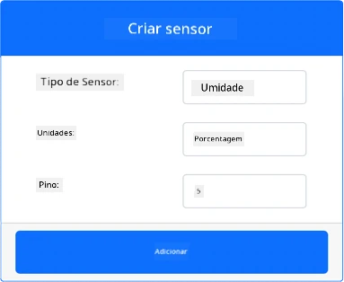
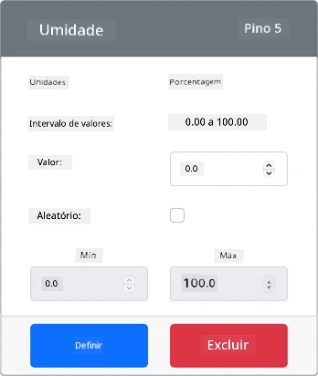
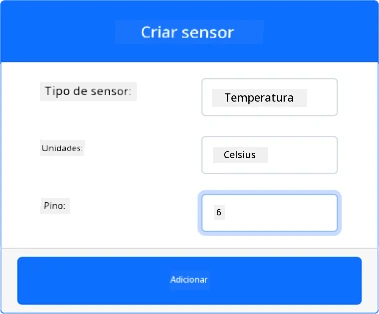
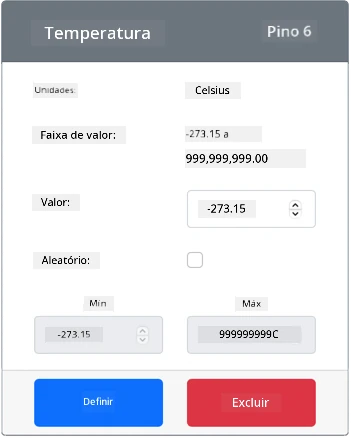

# Medir temperatura - Hardware Virtual para IoT

Nesta parte da lição, você adicionará um sensor de temperatura ao seu dispositivo IoT virtual.

## Hardware Virtual

O dispositivo IoT virtual usará um sensor simulado de Umidade e Temperatura Digital Grove. Isso mantém este laboratório semelhante ao uso de um Raspberry Pi com um sensor físico Grove DHT11.

O sensor combina um **sensor de temperatura** com um **sensor de umidade**, mas neste laboratório você estará interessado apenas no componente do sensor de temperatura. Em um dispositivo IoT físico, o sensor de temperatura seria um [termistor](https://wikipedia.org/wiki/Thermistor) que mede a temperatura detectando uma mudança na resistência conforme a temperatura varia. Sensores de temperatura geralmente são sensores digitais que internamente convertem a resistência medida em uma temperatura em graus Celsius (ou Kelvin, ou Fahrenheit).

### Adicionar os sensores ao CounterFit

Para usar um sensor virtual de umidade e temperatura, você precisa adicionar os dois sensores ao aplicativo CounterFit.

#### Tarefa - adicionar os sensores ao CounterFit

Adicione os sensores de umidade e temperatura ao aplicativo CounterFit.

1. Crie um novo aplicativo Python no seu computador em uma pasta chamada `temperature-sensor` com um único arquivo chamado `app.py` e um ambiente virtual Python, e adicione os pacotes pip do CounterFit.

    > ⚠️ Você pode consultar [as instruções para criar e configurar um projeto Python do CounterFit na lição 1, se necessário](../../../1-getting-started/lessons/1-introduction-to-iot/virtual-device.md).

1. Instale um pacote adicional do Pip para instalar um shim do CounterFit para o sensor DHT11. Certifique-se de instalar isso a partir de um terminal com o ambiente virtual ativado.

    ```sh
    pip install counterfit-shims-seeed-python-dht
    ```

1. Certifique-se de que o aplicativo web CounterFit esteja em execução.

1. Crie um sensor de umidade:

    1. Na caixa *Create sensor* no painel *Sensors*, abra o menu suspenso *Sensor type* e selecione *Humidity*.

    1. Deixe a opção *Units* configurada como *Percentage*.

    1. Certifique-se de que o *Pin* esteja configurado como *5*.

    1. Selecione o botão **Add** para criar o sensor de umidade no pino 5.

    

    O sensor de umidade será criado e aparecerá na lista de sensores.

    

1. Crie um sensor de temperatura:

    1. Na caixa *Create sensor* no painel *Sensors*, abra o menu suspenso *Sensor type* e selecione *Temperature*.

    1. Deixe a opção *Units* configurada como *Celsius*.

    1. Certifique-se de que o *Pin* esteja configurado como *6*.

    1. Selecione o botão **Add** para criar o sensor de temperatura no pino 6.

    

    O sensor de temperatura será criado e aparecerá na lista de sensores.

    

## Programar o aplicativo do sensor de temperatura

Agora o aplicativo do sensor de temperatura pode ser programado usando os sensores do CounterFit.

### Tarefa - programar o aplicativo do sensor de temperatura

Programe o aplicativo do sensor de temperatura.

1. Certifique-se de que o aplicativo `temperature-sensor` esteja aberto no VS Code.

1. Abra o arquivo `app.py`.

1. Adicione o seguinte código ao topo do arquivo `app.py` para conectar o aplicativo ao CounterFit:

    ```python
    from counterfit_connection import CounterFitConnection
    CounterFitConnection.init('127.0.0.1', 5000)
    ```

1. Adicione o seguinte código ao arquivo `app.py` para importar as bibliotecas necessárias:

    ```python
    import time
    from counterfit_shims_seeed_python_dht import DHT
    ```

    A instrução `from seeed_dht import DHT` importa a classe `DHT` para interagir com um sensor virtual de temperatura Grove usando um shim do módulo `counterfit_shims_seeed_python_dht`.

1. Adicione o seguinte código após o código acima para criar uma instância da classe que gerencia o sensor virtual de umidade e temperatura:

    ```python
    sensor = DHT("11", 5)
    ```

    Isso declara uma instância da classe `DHT` que gerencia o sensor virtual de **U**midade e **T**emperatura **D**igital. O primeiro parâmetro informa ao código que o sensor usado é um sensor virtual *DHT11*. O segundo parâmetro informa ao código que o sensor está conectado à porta `5`.

    > 💁 O CounterFit simula este sensor combinado de umidade e temperatura conectando-se a 2 sensores: um sensor de umidade no pino fornecido quando a classe `DHT` é criada, e um sensor de temperatura que opera no próximo pino. Se o sensor de umidade estiver no pino 5, o shim espera que o sensor de temperatura esteja no pino 6.

1. Adicione um loop infinito após o código acima para consultar o valor do sensor de temperatura e imprimi-lo no console:

    ```python
    while True:
        _, temp = sensor.read()
        print(f'Temperature {temp}°C')
    ```

    A chamada para `sensor.read()` retorna uma tupla de umidade e temperatura. Você só precisa do valor da temperatura, então a umidade é ignorada. O valor da temperatura é então impresso no console.

1. Adicione uma pequena pausa de dez segundos no final do `loop`, já que os níveis de temperatura não precisam ser verificados continuamente. Uma pausa reduz o consumo de energia do dispositivo.

    ```python
    time.sleep(10)
    ```

1. No terminal do VS Code com o ambiente virtual ativado, execute o seguinte comando para rodar seu aplicativo Python:

    ```sh
    python app.py
    ```

1. No aplicativo CounterFit, altere o valor do sensor de temperatura que será lido pelo aplicativo. Você pode fazer isso de duas maneiras:

    * Insira um número na caixa *Value* do sensor de temperatura e selecione o botão **Set**. O número inserido será o valor retornado pelo sensor.

    * Marque a caixa *Random* e insira um valor *Min* e *Max*, depois selecione o botão **Set**. Toda vez que o sensor ler um valor, ele lerá um número aleatório entre *Min* e *Max*.

    Você deve ver os valores que configurou aparecendo no console. Altere o *Value* ou as configurações de *Random* para ver o valor mudar.

    ```output
    (.venv) ➜  temperature-sensor python app.py
    Temperature 28.25°C
    Temperature 30.71°C
    Temperature 25.17°C
    ```

> 💁 Você pode encontrar este código na pasta [code-temperature/virtual-device](../../../../../2-farm/lessons/1-predict-plant-growth/code-temperature/virtual-device).

😀 Seu programa do sensor de temperatura foi um sucesso!

---

**Aviso Legal**:  
Este documento foi traduzido utilizando o serviço de tradução por IA [Co-op Translator](https://github.com/Azure/co-op-translator). Embora nos esforcemos para garantir a precisão, esteja ciente de que traduções automatizadas podem conter erros ou imprecisões. O documento original em seu idioma nativo deve ser considerado a fonte autoritativa. Para informações críticas, recomenda-se a tradução profissional realizada por humanos. Não nos responsabilizamos por quaisquer mal-entendidos ou interpretações equivocadas decorrentes do uso desta tradução.