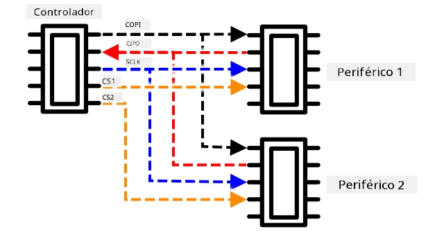
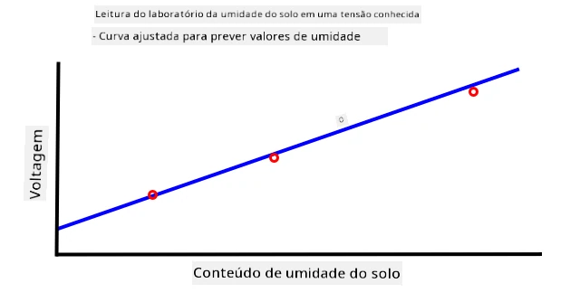
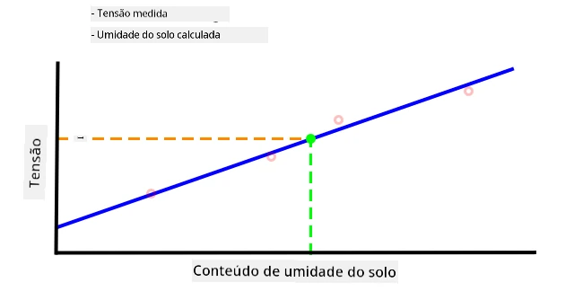

C, pronunciado *I-quadrado-C*, é um protocolo multi-controlador e multi-periférico, onde qualquer dispositivo conectado pode atuar como controlador ou periférico, comunicando-se através do barramento I²C (o nome para um sistema de comunicação que transfere dados). Os dados são enviados como pacotes endereçados, com cada pacote contendo o endereço do dispositivo conectado ao qual se destina.

> 💁 Este modelo costumava ser referido como mestre/escravo, mas essa terminologia está sendo abandonada devido à sua associação com a escravidão. A [Open Source Hardware Association adotou controlador/periférico](https://www.oshwa.org/a-resolution-to-redefine-spi-signal-names/), mas você ainda pode encontrar referências à terminologia antiga.

Os dispositivos possuem um endereço que é usado quando se conectam ao barramento I²C, geralmente codificado no próprio dispositivo. Por exemplo, cada tipo de sensor Grove da Seeed tem o mesmo endereço, então todos os sensores de luz têm o mesmo endereço, todos os botões têm o mesmo endereço, que é diferente do endereço do sensor de luz. Alguns dispositivos possuem maneiras de alterar o endereço, mudando configurações de jumpers ou soldando pinos juntos.

O I²C possui um barramento composto por 2 fios principais, além de 2 fios de alimentação:

| Fio | Nome | Descrição |
| ---- | --------- | ----------- |
| SDA | Dados Seriais | Este fio é usado para enviar dados entre dispositivos. |
| SCL | Clock Serial | Este fio envia um sinal de clock em uma taxa definida pelo controlador. |
| VCC | Coletor Comum de Voltagem | A fonte de alimentação para os dispositivos. Este fio está conectado aos fios SDA e SCL para fornecer energia por meio de um resistor pull-up que desliga o sinal quando nenhum dispositivo é o controlador. |
| GND | Terra | Fornece um terra comum para o circuito elétrico. |

Para enviar dados, um dispositivo emitirá uma condição de início para indicar que está pronto para enviar dados. Ele então se tornará o controlador. O controlador envia o endereço do dispositivo com o qual deseja se comunicar, juntamente com a informação se deseja ler ou escrever dados. Após a transmissão dos dados, o controlador envia uma condição de parada para indicar que terminou. Depois disso, outro dispositivo pode se tornar o controlador e enviar ou receber dados.

2C tem limites de velocidade, com 3 modos diferentes operando em velocidades fixas. O mais rápido é o modo de Alta Velocidade, com uma velocidade máxima de 3,4 Mbps (megabits por segundo), embora poucos dispositivos suportem essa velocidade. O Raspberry Pi, por exemplo, é limitado ao modo rápido a 400 Kbps (kilobits por segundo). O modo padrão opera a 100 Kbps.

> 💁 Se você estiver usando um Raspberry Pi com um Grove Base Hat como seu hardware IoT, poderá ver vários soquetes I2C na placa que podem ser usados para se comunicar com sensores I2C. Sensores analógicos Grove também utilizam I2C com um ADC para enviar valores analógicos como dados digitais, então o sensor de luz que você usou simulou um pino analógico, com o valor enviado via I2C, já que o Raspberry Pi suporta apenas pinos digitais.

### Receptor-transmissor assíncrono universal (UART)

UART envolve circuitos físicos que permitem a comunicação entre dois dispositivos. Cada dispositivo possui 2 pinos de comunicação - transmissão (Tx) e recepção (Rx), com o pino Tx do primeiro dispositivo conectado ao pino Rx do segundo, e o pino Tx do segundo dispositivo conectado ao pino Rx do primeiro. Isso permite o envio de dados em ambas as direções.

* O Dispositivo 1 transmite dados do seu pino Tx, que são recebidos pelo Dispositivo 2 no seu pino Rx.
* O Dispositivo 1 recebe dados no seu pino Rx que são transmitidos pelo Dispositivo 2 a partir do seu pino Tx.

> 🎓 Os dados são enviados um bit por vez, e isso é conhecido como comunicação *serial*. A maioria dos sistemas operacionais e microcontroladores possuem *portas seriais*, ou seja, conexões que podem enviar e receber dados seriais disponíveis para o seu código.

Dispositivos UART possuem uma [taxa de transmissão](https://wikipedia.org/wiki/Symbol_rate) (também conhecida como taxa de símbolos), que é a velocidade com que os dados serão enviados e recebidos em bits por segundo. Uma taxa de transmissão comum é 9.600, o que significa que 9.600 bits (0s e 1s) de dados são enviados a cada segundo.

UART utiliza bits de início e parada - ou seja, envia um bit de início para indicar que está prestes a enviar um byte (8 bits) de dados, e um bit de parada após enviar os 8 bits.

A velocidade do UART depende do hardware, mas mesmo as implementações mais rápidas não excedem 6,5 Mbps (megabits por segundo, ou milhões de bits, 0 ou 1, enviados por segundo).

Você pode usar UART sobre pinos GPIO - é possível configurar um pino como Tx e outro como Rx, e então conectá-los a outro dispositivo.

> 💁 Se você estiver usando um Raspberry Pi com um Grove Base Hat como seu hardware IoT, poderá ver um soquete UART na placa que pode ser usado para se comunicar com sensores que utilizam o protocolo UART.

### Interface Periférica Serial (SPI)

SPI é projetada para comunicação em curtas distâncias, como em um microcontrolador para se comunicar com um dispositivo de armazenamento, como memória flash. Ela é baseada em um modelo controlador/periférico, com um único controlador (geralmente o processador do dispositivo IoT) interagindo com múltiplos periféricos. O controlador gerencia tudo, selecionando um periférico e enviando ou solicitando dados.

> 💁 Assim como no I2C, os termos controlador e periférico são mudanças recentes, então você pode encontrar os termos antigos ainda sendo usados.

Controladores SPI utilizam 3 fios, junto com 1 fio extra por periférico. Periféricos utilizam 4 fios. Esses fios são:

| Fio | Nome | Descrição |
| ---- | --------- | ----------- |
| COPI | Saída do Controlador, Entrada do Periférico | Este fio é usado para enviar dados do controlador para o periférico. |
| CIPO | Entrada do Controlador, Saída do Periférico | Este fio é usado para enviar dados do periférico para o controlador. |
| SCLK | Relógio Serial | Este fio envia um sinal de relógio em uma taxa definida pelo controlador. |
| CS   | Seleção de Chip | O controlador possui múltiplos fios, um por periférico, e cada fio conecta ao fio CS no periférico correspondente. |

O fio CS é usado para ativar um periférico por vez, comunicando-se pelos fios COPI e CIPO. Quando o controlador precisa mudar de periférico, ele desativa o fio CS conectado ao periférico ativo e ativa o fio conectado ao periférico com o qual deseja se comunicar.

SPI é *full-duplex*, o que significa que o controlador pode enviar e receber dados ao mesmo tempo do mesmo periférico usando os fios COPI e CIPO. SPI utiliza um sinal de relógio no fio SCLK para manter os dispositivos sincronizados, então, ao contrário do envio direto via UART, não precisa de bits de início e parada.

Não há limites de velocidade definidos para SPI, com implementações frequentemente capazes de transmitir múltiplos megabytes de dados por segundo.

Kits de desenvolvimento IoT frequentemente suportam SPI em alguns dos pinos GPIO. Por exemplo, em um Raspberry Pi, você pode usar os pinos GPIO 19, 21, 23, 24 e 26 para SPI.

### Sem fio

Alguns sensores podem se comunicar por protocolos sem fio padrão, como Bluetooth (principalmente Bluetooth Low Energy, ou BLE), LoRaWAN (um protocolo de rede de baixa potência de **Lo**nga **Ra**nge) ou WiFi. Isso permite sensores remotos que não estão fisicamente conectados a um dispositivo IoT.

Um exemplo disso são sensores comerciais de umidade do solo. Eles medem a umidade do solo em um campo e enviam os dados via LoRaWAN para um dispositivo central, que processa os dados ou os envia pela Internet. Isso permite que o sensor esteja distante do dispositivo IoT que gerencia os dados, reduzindo o consumo de energia e a necessidade de grandes redes WiFi ou cabos longos.

BLE é popular para sensores avançados, como rastreadores de fitness usados no pulso. Esses dispositivos combinam múltiplos sensores e enviam os dados para um dispositivo IoT, como seu telefone, via BLE.

✅ Você tem algum sensor Bluetooth com você, em sua casa ou na sua escola? Eles podem incluir sensores de temperatura, sensores de ocupação, rastreadores de dispositivos e dispositivos de fitness.

Uma maneira popular para dispositivos comerciais se conectarem é o Zigbee. O Zigbee utiliza WiFi para formar redes mesh entre dispositivos, onde cada dispositivo se conecta ao maior número possível de dispositivos próximos, formando uma grande quantidade de conexões, como uma teia de aranha. Quando um dispositivo deseja enviar uma mensagem para a Internet, ele pode enviá-la para os dispositivos mais próximos, que então a encaminham para outros dispositivos próximos e assim por diante, até alcançar um coordenador e ser enviada para a Internet.

> 🐝 O nome Zigbee refere-se à dança de abanar das abelhas após retornarem à colmeia.

## Medir os níveis de umidade do solo

Você pode medir o nível de umidade do solo usando um sensor de umidade do solo, um dispositivo IoT e uma planta doméstica ou um pedaço de solo próximo.

### Tarefa - medir a umidade do solo

Siga o guia relevante para medir a umidade do solo usando seu dispositivo IoT:

* [Arduino - Wio Terminal](wio-terminal-soil-moisture.md)
* [Computador de placa única - Raspberry Pi](pi-soil-moisture.md)
* [Computador de placa única - Dispositivo virtual](virtual-device-soil-moisture.md)

## Calibração de sensores

Sensores dependem da medição de propriedades elétricas, como resistência ou capacitância.

> 🎓 Resistência, medida em ohms (Ω), é a oposição à corrente elétrica que flui através de algo. Quando uma tensão é aplicada a um material, a quantidade de corrente que passa por ele depende da resistência do material. Você pode ler mais na [página de resistência elétrica na Wikipedia](https://wikipedia.org/wiki/Electrical_resistance_and_conductance).

> 🎓 Capacitância, medida em farads (F), é a capacidade de um componente ou circuito de coletar e armazenar energia elétrica. Você pode ler mais sobre capacitância na [página de capacitância na Wikipedia](https://wikipedia.org/wiki/Capacitance).

Essas medições nem sempre são úteis - imagine um sensor de temperatura que fornecesse uma medição de 22,5 kΩ! Em vez disso, o valor medido precisa ser convertido em uma unidade útil por meio da calibração - ou seja, associar os valores medidos à quantidade medida para permitir que novas medições sejam convertidas para a unidade correta.

Alguns sensores vêm pré-calibrados. Por exemplo, o sensor de temperatura que você usou na última lição já estava calibrado para retornar uma medição de temperatura em °C. Na fábrica, o primeiro sensor criado seria exposto a uma faixa de temperaturas conhecidas e a resistência medida. Isso seria então usado para construir um cálculo que pode converter do valor medido em Ω (a unidade de resistência) para °C.

> 💁 A fórmula para calcular a resistência a partir da temperatura é chamada de [equação de Steinhart–Hart](https://wikipedia.org/wiki/Steinhart–Hart_equation).

### Calibração do sensor de umidade do solo

A umidade do solo é medida usando o conteúdo de água gravimétrico ou volumétrico.

* Gravimétrico é o peso da água em uma unidade de peso do solo, medido como o número de quilogramas de água por quilograma de solo seco.
* Volumétrico é o volume de água em uma unidade de volume do solo, medido como o número de metros cúbicos de água por metro cúbico de solo seco.

> 🇺🇸 Para os americanos, devido à consistência das unidades, essas medições podem ser feitas em libras em vez de quilogramas ou pés cúbicos em vez de metros cúbicos.

Sensores de umidade do solo medem resistência elétrica ou capacitância - isso não apenas varia com a umidade do solo, mas também com o tipo de solo, já que os componentes do solo podem alterar suas características elétricas. Idealmente, os sensores devem ser calibrados - ou seja, realizar leituras do sensor e compará-las com medições obtidas por um método mais científico. Por exemplo, um laboratório pode calcular a umidade gravimétrica do solo usando amostras de um campo específico algumas vezes por ano, e esses números podem ser usados para calibrar o sensor, associando a leitura do sensor à umidade gravimétrica do solo.

O gráfico acima mostra como calibrar um sensor. A tensão é capturada para uma amostra de solo que é então medida em um laboratório, comparando o peso úmido ao peso seco (medindo o peso úmido, depois secando no forno e medindo o peso seco). Após algumas leituras, os dados podem ser plotados em um gráfico e uma linha ajustada aos pontos. Essa linha pode então ser usada para converter leituras do sensor de umidade do solo feitas por um dispositivo IoT em medições reais de umidade do solo.

💁 Para sensores resistivos de umidade do solo, a tensão aumenta à medida que a umidade do solo aumenta. Para sensores capacitivos de umidade do solo, a tensão diminui à medida que a umidade do solo aumenta, então os gráficos para esses sensores teriam uma inclinação descendente, não ascendente.

O gráfico acima mostra uma leitura de tensão de um sensor de umidade do solo e, ao seguir essa leitura até a linha no gráfico, a umidade real do solo pode ser calculada.

Essa abordagem significa que o agricultor só precisa obter algumas medições laboratoriais para um campo, e então pode usar dispositivos IoT para medir a umidade do solo - acelerando drasticamente o tempo necessário para obter medições.

---

## 🚀 Desafio

Sensores resistivos e capacitivos de umidade do solo possuem várias diferenças. Quais são essas diferenças, e qual tipo (se houver) é o melhor para um agricultor usar? Essa resposta muda entre países em desenvolvimento e desenvolvidos?

## Questionário pós-aula

[Questionário pós-aula](https://black-meadow-040d15503.1.azurestaticapps.net/quiz/12)

## Revisão e Autoestudo

Leia sobre o hardware e os protocolos usados por sensores e atuadores:

* [Página da Wikipedia sobre GPIO](https://wikipedia.org/wiki/General-purpose_input/output)
* [Página da Wikipedia sobre UART](https://wikipedia.org/wiki/Universal_asynchronous_receiver-transmitter)
* [Página da Wikipedia sobre SPI](https://wikipedia.org/wiki/Serial_Peripheral_Interface)
* [Página da Wikipedia sobre I2C](https://wikipedia.org/wiki/I²C)
* [Página da Wikipedia sobre Zigbee](https://wikipedia.org/wiki/Zigbee)

## Tarefa

[Calibre seu sensor](assignment.md)

---

**Aviso Legal**:  
Este documento foi traduzido utilizando o serviço de tradução por IA [Co-op Translator](https://github.com/Azure/co-op-translator). Embora nos esforcemos para garantir a precisão, esteja ciente de que traduções automatizadas podem conter erros ou imprecisões. O documento original em seu idioma nativo deve ser considerado a fonte autoritativa. Para informações críticas, recomenda-se a tradução profissional realizada por humanos. Não nos responsabilizamos por quaisquer mal-entendidos ou interpretações equivocadas decorrentes do uso desta tradução.