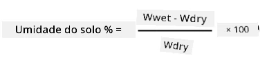
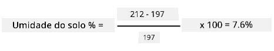

# Calibre seu sensor

## Instruções

Nesta lição, você coletou leituras do sensor de umidade do solo, medidas como valores de 0 a 1023. Para converter esses valores em leituras reais de umidade do solo, é necessário calibrar o sensor. Você pode fazer isso coletando amostras de solo, medindo a umidade gravimétrica do solo a partir dessas amostras.

Será necessário repetir esses passos várias vezes para obter as leituras necessárias, com diferentes níveis de umidade do solo a cada vez.

1. Faça uma leitura de umidade do solo usando o sensor de umidade do solo. Anote essa leitura.

1. Pegue uma amostra do solo e pese-a. Anote esse peso.

1. Seque o solo - um forno aquecido a 110°C (230°F) por algumas horas é a melhor opção. Você também pode secá-lo ao sol ou colocá-lo em um local quente e seco até que o solo esteja completamente seco. Ele deve ficar pulverulento e solto.

    > 💁 Em um laboratório, para obter resultados mais precisos, você deve secar o solo em um forno por 48-72 horas. Se sua escola tiver fornos de secagem, veja se é possível utilizá-los para secar por mais tempo. Quanto mais tempo, mais seco estará o solo e mais precisos serão os resultados.

1. Pese o solo novamente.

    > 🔥 Se você secou o solo em um forno, certifique-se de que ele esfriou antes de pesá-lo!

A umidade gravimétrica do solo é calculada como:

* W  
- o peso do solo úmido  
* W  
- o peso do solo seco  

Por exemplo, suponha que você tenha uma amostra de solo que pesa 212g úmida e 197g seca.

* W = 212g  
* W = 197g  
* 212 - 197 = 15  
* 15 / 197 = 0,076  
* 0,076 * 100 = 7,6%  

Neste exemplo, o solo tem uma umidade gravimétrica de 7,6%.

Depois de obter as leituras de pelo menos 3 amostras, trace um gráfico da porcentagem de umidade do solo em relação à leitura do sensor de umidade do solo e adicione uma linha que melhor se ajuste aos pontos. Você pode então usar esse gráfico para calcular a umidade gravimétrica do solo para uma leitura específica do sensor, lendo o valor na linha.

## Rubrica

| Critério | Exemplar | Adequado | Precisa de Melhorias |
| -------- | --------- | -------- | -------------------- |
| Coletar dados de calibração | Captura pelo menos 3 amostras de calibração | Captura pelo menos 2 amostras de calibração | Captura pelo menos 1 amostra de calibração |
| Fazer uma leitura calibrada | Consegue traçar o gráfico de calibração e fazer uma leitura do sensor, convertendo-a em umidade gravimétrica do solo | Consegue traçar o gráfico de calibração | Não consegue traçar o gráfico |

---

**Aviso Legal**:  
Este documento foi traduzido utilizando o serviço de tradução por IA [Co-op Translator](https://github.com/Azure/co-op-translator). Embora nos esforcemos para garantir a precisão, esteja ciente de que traduções automáticas podem conter erros ou imprecisões. O documento original em seu idioma nativo deve ser considerado a fonte oficial. Para informações críticas, recomenda-se a tradução profissional realizada por humanos. Não nos responsabilizamos por quaisquer mal-entendidos ou interpretações equivocadas decorrentes do uso desta tradução.