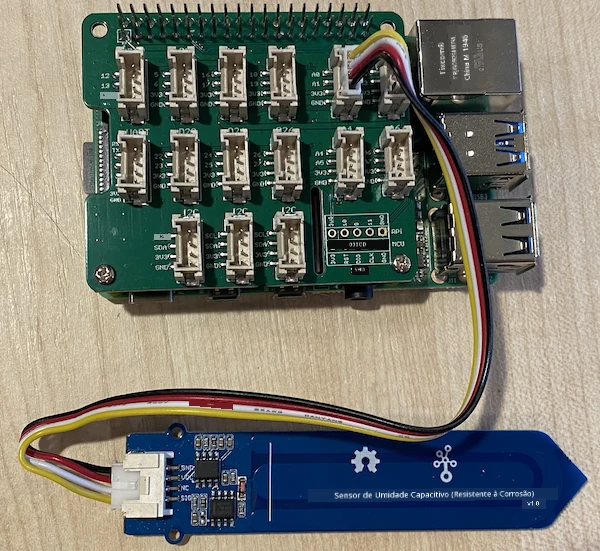

# Medir a umidade do solo - Raspberry Pi

Nesta parte da lição, você adicionará um sensor capacitivo de umidade do solo ao seu Raspberry Pi e lerá os valores dele.

## Hardware

O Raspberry Pi precisa de um sensor capacitivo de umidade do solo.

O sensor que você usará é um [Sensor Capacitivo de Umidade do Solo](https://www.seeedstudio.com/Grove-Capacitive-Moisture-Sensor-Corrosion-Resistant.html), que mede a umidade do solo detectando a capacitância do solo, uma propriedade que muda conforme a umidade do solo varia. À medida que a umidade do solo aumenta, a voltagem diminui.

Este é um sensor analógico, então ele usa um pino analógico e o conversor ADC de 10 bits no Grove Base Hat do Raspberry Pi para converter a voltagem em um sinal digital de 1 a 1.023. Este sinal é então enviado via I²C pelos pinos GPIO do Raspberry Pi.

### Conectar o sensor de umidade do solo

O sensor de umidade do solo Grove pode ser conectado ao Raspberry Pi.

#### Tarefa - conectar o sensor de umidade do solo

Conecte o sensor de umidade do solo.


1. Insira uma extremidade de um cabo Grove no conector do sensor de umidade do solo. Ele só encaixará de uma maneira.

1. Com o Raspberry Pi desligado, conecte a outra extremidade do cabo Grove ao conector analógico marcado como **A0** no Grove Base Hat conectado ao Raspberry Pi. Este conector é o segundo da direita, na fileira de conectores ao lado dos pinos GPIO.



1. Insira o sensor de umidade do solo no solo. Ele possui uma "linha de posição máxima" - uma linha branca atravessando o sensor. Insira o sensor até essa linha, mas não ultrapasse.


## Programar o sensor de umidade do solo

Agora o Raspberry Pi pode ser programado para usar o sensor de umidade do solo conectado.

### Tarefa - programar o sensor de umidade do solo

Programe o dispositivo.

1. Ligue o Raspberry Pi e aguarde a inicialização.

1. Abra o VS Code, seja diretamente no Raspberry Pi ou conectando via a extensão Remote SSH.

    > ⚠️ Você pode consultar [as instruções para configurar e abrir o VS Code no nightlight - lição 1, se necessário](../../../1-getting-started/lessons/1-introduction-to-iot/pi.md).

1. No terminal, crie uma nova pasta no diretório home do usuário `pi` chamada `soil-moisture-sensor`. Crie um arquivo nesta pasta chamado `app.py`.

1. Abra esta pasta no VS Code.

1. Adicione o seguinte código ao arquivo `app.py` para importar algumas bibliotecas necessárias:

    ```python
    import time
    from grove.adc import ADC
    ```

    A instrução `import time` importa o módulo `time`, que será usado mais tarde nesta tarefa.

    A instrução `from grove.adc import ADC` importa o `ADC` das bibliotecas Python do Grove. Esta biblioteca contém código para interagir com o conversor analógico-digital no Grove Base Hat e ler voltagens de sensores analógicos.

1. Adicione o seguinte código abaixo para criar uma instância da classe `ADC`:

    ```python
    adc = ADC()
    ```

1. Adicione um loop infinito que leia o ADC no pino A0 e escreva o resultado no console. Este loop pode então aguardar 10 segundos entre as leituras.

    ```python
    while True:
        soil_moisture = adc.read(0)
        print("Soil moisture:", soil_moisture)

        time.sleep(10)
    ```

1. Execute o aplicativo Python. Você verá as medições de umidade do solo sendo exibidas no console. Adicione um pouco de água ao solo ou remova o sensor do solo e veja o valor mudar.

    ```output
    pi@raspberrypi:~/soil-moisture-sensor $ python3 app.py 
    Soil moisture: 615
    Soil moisture: 612
    Soil moisture: 498
    Soil moisture: 493
    Soil moisture: 490
    Soil Moisture: 388
    ```

    No exemplo de saída acima, você pode ver a voltagem cair à medida que a água é adicionada.

> 💁 Você pode encontrar este código na pasta [code/pi](../../../../../2-farm/lessons/2-detect-soil-moisture/code/pi).

😀 Seu programa para o sensor de umidade do solo foi um sucesso!

---

**Aviso Legal**:  
Este documento foi traduzido utilizando o serviço de tradução por IA [Co-op Translator](https://github.com/Azure/co-op-translator). Embora nos esforcemos para garantir a precisão, esteja ciente de que traduções automáticas podem conter erros ou imprecisões. O documento original em seu idioma nativo deve ser considerado a fonte oficial. Para informações críticas, recomenda-se a tradução profissional feita por humanos. Não nos responsabilizamos por quaisquer mal-entendidos ou interpretações equivocadas decorrentes do uso desta tradução.