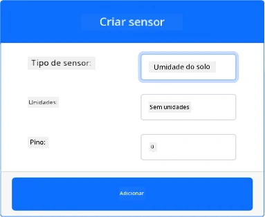
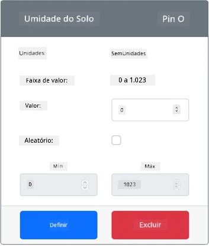

# Medir a umidade do solo - Hardware IoT Virtual

Nesta parte da lição, você adicionará um sensor capacitivo de umidade do solo ao seu dispositivo IoT virtual e lerá os valores dele.

## Hardware Virtual

O dispositivo IoT virtual usará um sensor capacitivo de umidade do solo simulado da Grove. Isso mantém este laboratório semelhante ao uso de um Raspberry Pi com um sensor físico capacitivo de umidade do solo da Grove.

Em um dispositivo IoT físico, o sensor de umidade do solo seria um sensor capacitivo que mede a umidade do solo detectando a capacitância do solo, uma propriedade que muda conforme a umidade do solo varia. À medida que a umidade do solo aumenta, a voltagem diminui.

Este é um sensor analógico, então utiliza um ADC simulado de 10 bits para reportar um valor de 1 a 1.023.

### Adicionar o sensor de umidade do solo ao CounterFit

Para usar um sensor virtual de umidade do solo, você precisa adicioná-lo ao aplicativo CounterFit.

#### Tarefa - Adicionar o sensor de umidade do solo ao CounterFit

Adicione o sensor de umidade do solo ao aplicativo CounterFit.

1. Crie um novo aplicativo Python no seu computador em uma pasta chamada `soil-moisture-sensor` com um único arquivo chamado `app.py`, um ambiente virtual Python, e adicione os pacotes pip do CounterFit.

    > ⚠️ Você pode consultar [as instruções para criar e configurar um projeto Python no CounterFit na lição 1, se necessário](../../../1-getting-started/lessons/1-introduction-to-iot/virtual-device.md).

1. Certifique-se de que o aplicativo web do CounterFit esteja em execução.

1. Crie um sensor de umidade do solo:

    1. Na caixa *Create sensor* no painel *Sensors*, abra o menu suspenso *Sensor type* e selecione *Soil Moisture*.

    1. Deixe a opção *Units* configurada como *NoUnits*.

    1. Certifique-se de que o *Pin* esteja configurado como *0*.

    1. Selecione o botão **Add** para criar o sensor *Soil Moisture* no Pin 0.

    

    O sensor de umidade do solo será criado e aparecerá na lista de sensores.

    

## Programar o aplicativo do sensor de umidade do solo

Agora o aplicativo do sensor de umidade do solo pode ser programado usando os sensores do CounterFit.

### Tarefa - Programar o aplicativo do sensor de umidade do solo

Programe o aplicativo do sensor de umidade do solo.

1. Certifique-se de que o aplicativo `soil-moisture-sensor` esteja aberto no VS Code.

1. Abra o arquivo `app.py`.

1. Adicione o seguinte código ao início do `app.py` para conectar o aplicativo ao CounterFit:

    ```python
    from counterfit_connection import CounterFitConnection
    CounterFitConnection.init('127.0.0.1', 5000)
    ```

1. Adicione o seguinte código ao arquivo `app.py` para importar algumas bibliotecas necessárias:

    ```python
    import time
    from counterfit_shims_grove.adc import ADC
    ```

    A instrução `import time` importa o módulo `time`, que será usado mais tarde nesta tarefa.

    A instrução `from counterfit_shims_grove.adc import ADC` importa a classe `ADC` para interagir com um conversor analógico-digital virtual que pode se conectar a um sensor do CounterFit.

1. Adicione o seguinte código abaixo para criar uma instância da classe `ADC`:

    ```python
    adc = ADC()
    ```

1. Adicione um loop infinito que leia o ADC no pino 0 e escreva o resultado no console. Esse loop pode então aguardar 10 segundos entre as leituras.

    ```python
    while True:
        soil_moisture = adc.read(0)
        print("Soil moisture:", soil_moisture)
    
        time.sleep(10)
    ```

1. No aplicativo CounterFit, altere o valor do sensor de umidade do solo que será lido pelo aplicativo. Você pode fazer isso de duas maneiras:

    * Insira um número na caixa *Value* do sensor de umidade do solo e selecione o botão **Set**. O número inserido será o valor retornado pelo sensor.

    * Marque a caixa *Random* e insira um valor *Min* e *Max*, depois selecione o botão **Set**. Toda vez que o sensor for lido, ele retornará um número aleatório entre *Min* e *Max*.

1. Execute o aplicativo Python. Você verá as medições de umidade do solo sendo exibidas no console. Altere o *Value* ou as configurações de *Random* para observar a mudança nos valores.

    ```output
    (.venv) ➜ soil-moisture-sensor $ python app.py 
    Soil moisture: 615
    Soil moisture: 612
    Soil moisture: 498
    Soil moisture: 493
    Soil moisture: 490
    Soil Moisture: 388
    ```

> 💁 Você pode encontrar este código na pasta [code/virtual-device](../../../../../2-farm/lessons/2-detect-soil-moisture/code/virtual-device).

😀 Seu programa do sensor de umidade do solo foi um sucesso!

---

**Aviso Legal**:  
Este documento foi traduzido utilizando o serviço de tradução por IA [Co-op Translator](https://github.com/Azure/co-op-translator). Embora nos esforcemos para garantir a precisão, esteja ciente de que traduções automatizadas podem conter erros ou imprecisões. O documento original em seu idioma nativo deve ser considerado a fonte autoritativa. Para informações críticas, recomenda-se a tradução profissional realizada por humanos. Não nos responsabilizamos por quaisquer mal-entendidos ou interpretações equivocadas decorrentes do uso desta tradução.