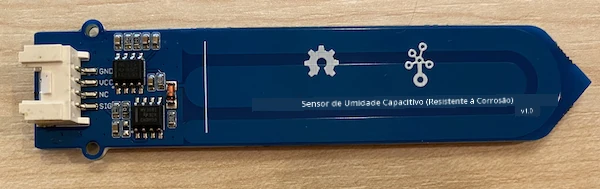
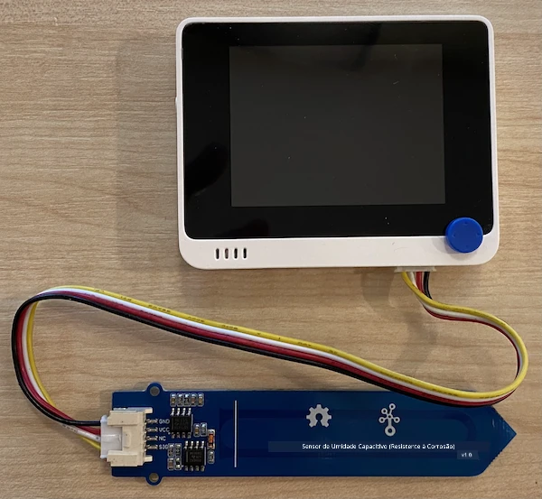

# Medir a umidade do solo - Wio Terminal

Nesta parte da lição, você adicionará um sensor capacitivo de umidade do solo ao seu Wio Terminal e lerá os valores dele.

## Hardware

O Wio Terminal precisa de um sensor capacitivo de umidade do solo.

O sensor que você usará é um [Sensor Capacitivo de Umidade do Solo](https://www.seeedstudio.com/Grove-Capacitive-Moisture-Sensor-Corrosion-Resistant.html), que mede a umidade do solo detectando a capacitância do solo, uma propriedade que muda conforme a umidade do solo varia. À medida que a umidade do solo aumenta, a voltagem diminui.

Este é um sensor analógico, então ele se conecta aos pinos analógicos do Wio Terminal, usando um ADC integrado para criar um valor de 0 a 1.023.

### Conectar o sensor de umidade do solo

O sensor de umidade do solo Grove pode ser conectado à porta analógica/digital configurável do Wio Terminal.

#### Tarefa - conectar o sensor de umidade do solo

Conecte o sensor de umidade do solo.



1. Insira uma extremidade de um cabo Grove no conector do sensor de umidade do solo. Ele só encaixará de uma maneira.

1. Com o Wio Terminal desconectado do seu computador ou de outra fonte de energia, conecte a outra extremidade do cabo Grove ao conector Grove do lado direito do Wio Terminal, olhando para a tela. Este é o conector mais distante do botão de energia.



1. Insira o sensor de umidade do solo no solo. Ele possui uma 'linha de posição máxima' - uma linha branca atravessando o sensor. Insira o sensor até essa linha, mas não ultrapasse.


1. Agora você pode conectar o Wio Terminal ao seu computador.

## Programar o sensor de umidade do solo

Agora o Wio Terminal pode ser programado para usar o sensor de umidade do solo conectado.

### Tarefa - programar o sensor de umidade do solo

Programe o dispositivo.

1. Crie um novo projeto para o Wio Terminal usando o PlatformIO. Chame este projeto de `soil-moisture-sensor`. Adicione código na função `setup` para configurar a porta serial.

    > ⚠️ Você pode consultar [as instruções para criar um projeto PlatformIO no projeto 1, lição 1, se necessário](../../../1-getting-started/lessons/1-introduction-to-iot/wio-terminal.md#create-a-platformio-project).

1. Não há uma biblioteca para este sensor, mas você pode ler o pino analógico usando a função [`analogRead`](https://www.arduino.cc/reference/en/language/functions/analog-io/analogread/) integrada do Arduino. Comece configurando o pino analógico como entrada para que os valores possam ser lidos dele, adicionando o seguinte à função `setup`.

    ```cpp
    pinMode(A0, INPUT);
    ```

    Isso configura o pino `A0`, o pino combinado analógico/digital, como um pino de entrada do qual a voltagem pode ser lida.

1. Adicione o seguinte à função `loop` para ler a voltagem deste pino:

    ```cpp
    int soil_moisture = analogRead(A0);
    ```

1. Abaixo deste código, adicione o seguinte código para imprimir o valor na porta serial:

    ```cpp
    Serial.print("Soil Moisture: ");
    Serial.println(soil_moisture);
    ```

1. Por fim, adicione um atraso de 10 segundos no final:

    ```cpp
    delay(10000);
    ```

1. Compile e envie o código para o Wio Terminal.

    > ⚠️ Você pode consultar [as instruções para criar um projeto PlatformIO no projeto 1, lição 1, se necessário](../../../1-getting-started/lessons/1-introduction-to-iot/wio-terminal.md#write-the-hello-world-app).

1. Depois de enviado, você pode monitorar a umidade do solo usando o monitor serial. Adicione um pouco de água ao solo ou remova o sensor do solo e veja o valor mudar.

    ```output
    > Executing task: platformio device monitor <
    
    --- Available filters and text transformations: colorize, debug, default, direct, hexlify, log2file, nocontrol, printable, send_on_enter, time
    --- More details at http://bit.ly/pio-monitor-filters
    --- Miniterm on /dev/cu.usbmodem1201  9600,8,N,1 ---
    --- Quit: Ctrl+C | Menu: Ctrl+T | Help: Ctrl+T followed by Ctrl+H ---
    Soil Moisture: 526
    Soil Moisture: 529
    Soil Moisture: 521
    Soil Moisture: 494
    Soil Moisture: 454
    Soil Moisture: 456
    Soil Moisture: 395
    Soil Moisture: 388
    Soil Moisture: 394
    Soil Moisture: 391
    ```

    No exemplo de saída acima, você pode ver a voltagem cair à medida que a água é adicionada.

> 💁 Você pode encontrar este código na pasta [code/wio-terminal](../../../../../2-farm/lessons/2-detect-soil-moisture/code/wio-terminal).

😀 Seu programa para o sensor de umidade do solo foi um sucesso!

---

**Aviso Legal**:  
Este documento foi traduzido utilizando o serviço de tradução por IA [Co-op Translator](https://github.com/Azure/co-op-translator). Embora nos esforcemos para garantir a precisão, esteja ciente de que traduções automatizadas podem conter erros ou imprecisões. O documento original em seu idioma nativo deve ser considerado a fonte autoritativa. Para informações críticas, recomenda-se a tradução profissional realizada por humanos. Não nos responsabilizamos por quaisquer mal-entendidos ou interpretações equivocadas decorrentes do uso desta tradução.