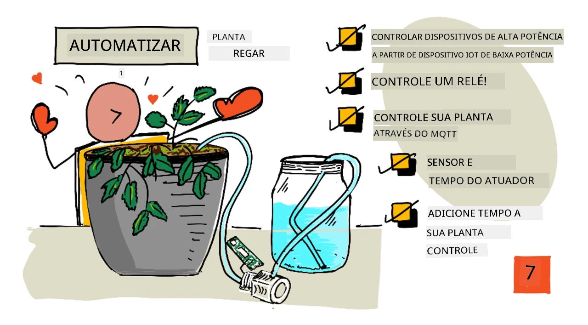
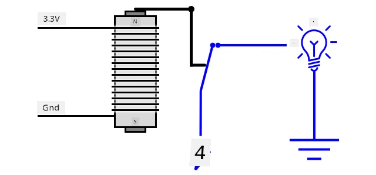
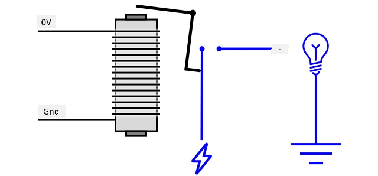
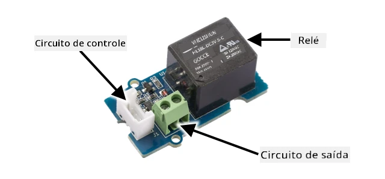
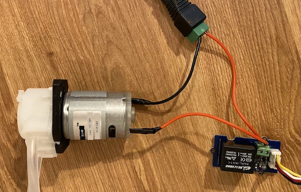
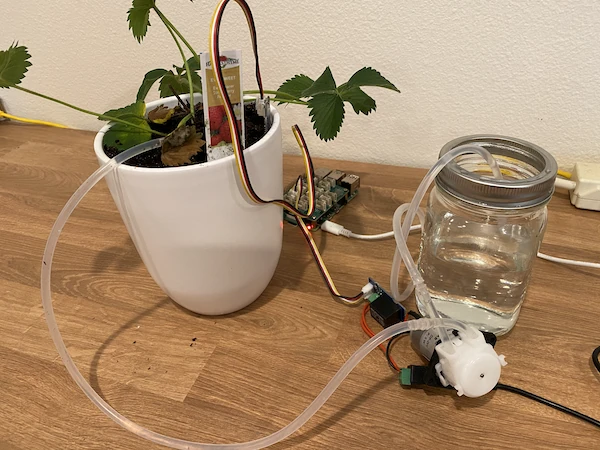
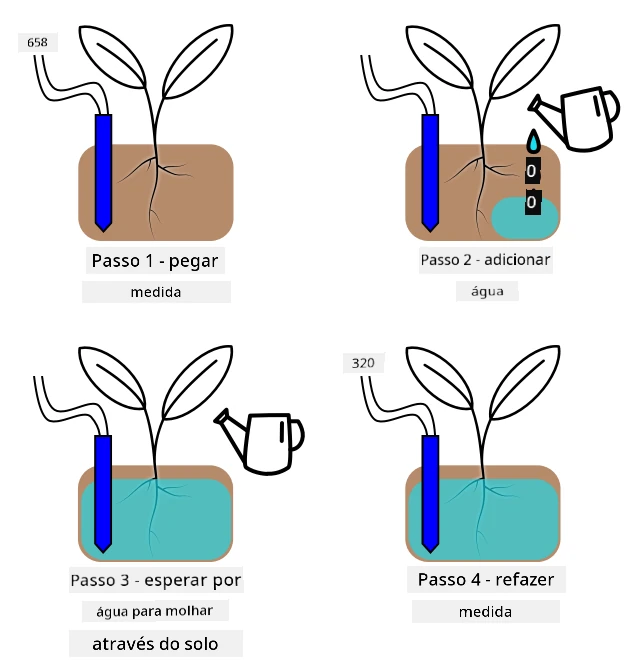

# Irrigação automatizada de plantas



> Ilustração por [Nitya Narasimhan](https://github.com/nitya). Clique na imagem para uma versão maior.

Esta lição foi ensinada como parte da série [IoT para Iniciantes - Agricultura Digital](https://youtube.com/playlist?list=PLmsFUfdnGr3yCutmcVg6eAUEfsGiFXgcx) do [Microsoft Reactor](https://developer.microsoft.com/reactor/?WT.mc_id=academic-17441-jabenn).

[](https://youtu.be/g9FfZwv9R58)

## Quiz pré-aula

[Quiz pré-aula](https://black-meadow-040d15503.1.azurestaticapps.net/quiz/13)

## Introdução

Na última lição, você aprendeu como monitorar a umidade do solo. Nesta lição, você aprenderá a construir os componentes principais de um sistema de irrigação automatizado que responde à umidade do solo. Também aprenderá sobre temporização - como sensores podem demorar para responder a mudanças e como atuadores podem levar tempo para alterar as propriedades medidas pelos sensores.

Nesta lição, abordaremos:

* [Controlar dispositivos de alta potência com um dispositivo IoT de baixa potência](../../../../../2-farm/lessons/3-automated-plant-watering)
* [Controlar um relé](../../../../../2-farm/lessons/3-automated-plant-watering)
* [Controlar sua planta via MQTT](../../../../../2-farm/lessons/3-automated-plant-watering)
* [Temporização de sensores e atuadores](../../../../../2-farm/lessons/3-automated-plant-watering)
* [Adicionar temporização ao servidor de controle da planta](../../../../../2-farm/lessons/3-automated-plant-watering)

## Controlar dispositivos de alta potência com um dispositivo IoT de baixa potência

Dispositivos IoT utilizam baixa voltagem. Embora isso seja suficiente para sensores e atuadores de baixa potência, como LEDs, é insuficiente para controlar equipamentos maiores, como uma bomba de água usada para irrigação. Mesmo bombas pequenas, que poderiam ser usadas para plantas domésticas, consomem muita corrente para um kit de desenvolvimento IoT e poderiam danificar a placa.

> 🎓 Corrente, medida em Amperes (A), é a quantidade de eletricidade que passa por um circuito. A voltagem fornece o impulso, enquanto a corrente é a quantidade que é empurrada. Você pode ler mais sobre corrente na [página sobre corrente elétrica na Wikipedia](https://wikipedia.org/wiki/Electric_current).

A solução para isso é conectar a bomba a uma fonte de energia externa e usar um atuador para ligar a bomba, semelhante a como você ligaria uma luz. É necessário apenas uma pequena quantidade de energia (na forma de energia do seu corpo) para seu dedo acionar um interruptor, conectando a luz à eletricidade da rede elétrica de 110v/240v.


> 🎓 [Eletricidade da rede](https://wikipedia.org/wiki/Mains_electricity) refere-se à eletricidade fornecida a residências e empresas por meio de infraestrutura nacional em muitas partes do mundo.

✅ Dispositivos IoT geralmente fornecem 3.3V ou 5V, com menos de 1 ampere (1A) de corrente. Compare isso com a eletricidade da rede, que geralmente é de 230V (120V na América do Norte e 100V no Japão) e pode fornecer energia para dispositivos que consomem até 30A.

Existem vários atuadores que podem fazer isso, incluindo dispositivos mecânicos que você pode anexar a interruptores existentes para imitar um dedo ligando-os. O mais popular é o relé.

### Relés

Um relé é um interruptor eletromecânico que converte um sinal elétrico em um movimento mecânico que liga um interruptor. O núcleo de um relé é um eletroímã.

> 🎓 [Eletroímãs](https://wikipedia.org/wiki/Electromagnet) são ímãs criados ao passar eletricidade por uma bobina de fio. Quando a eletricidade é ligada, a bobina se torna magnetizada. Quando a eletricidade é desligada, a bobina perde seu magnetismo.



Em um relé, um circuito de controle alimenta o eletroímã. Quando o eletroímã está ligado, ele puxa uma alavanca que move um interruptor, fechando um par de contatos e completando um circuito de saída.



Quando o circuito de controle está desligado, o eletroímã desliga, liberando a alavanca e abrindo os contatos, desligando o circuito de saída. Relés são atuadores digitais - um sinal alto para o relé o liga, um sinal baixo o desliga.

O circuito de saída pode ser usado para alimentar hardware adicional, como um sistema de irrigação. O dispositivo IoT pode ligar o relé, completando o circuito de saída que alimenta o sistema de irrigação, e as plantas são regadas. O dispositivo IoT pode então desligar o relé, cortando a energia do sistema de irrigação e interrompendo a água.


No vídeo acima, um relé é ligado. Um LED no relé acende para indicar que está ligado (algumas placas de relé possuem LEDs para indicar se o relé está ligado ou desligado), e a energia é enviada para a bomba, ligando-a e bombeando água para uma planta.

> 💁 Relés também podem ser usados para alternar entre dois circuitos de saída, em vez de ligar ou desligar um. À medida que a alavanca se move, ela alterna um interruptor de completar um circuito de saída para completar outro circuito de saída, geralmente compartilhando uma conexão de energia comum ou conexão de terra comum.

✅ Faça uma pesquisa: Existem vários tipos de relés, com diferenças como se o circuito de controle liga ou desliga o relé quando a energia é aplicada, ou múltiplos circuitos de saída. Descubra mais sobre esses diferentes tipos.

Quando a alavanca se move, geralmente é possível ouvir o contato com o eletroímã com um clique bem definido.

> 💁 Um relé pode ser conectado de forma que fazer a conexão realmente interrompa a energia para o relé, desligando-o, o que então envia energia para o relé, ligando-o novamente, e assim por diante. Isso significa que o relé clicará incrivelmente rápido, fazendo um ruído de zumbido. Foi assim que alguns dos primeiros campainhas elétricas funcionavam.

### Alimentação do relé

O eletroímã não precisa de muita energia para ativar e puxar a alavanca, podendo ser controlado usando a saída de 3.3V ou 5V de um kit de desenvolvimento IoT. O circuito de saída pode transportar muito mais energia, dependendo do relé, incluindo voltagem da rede elétrica ou até níveis de potência mais altos para uso industrial. Dessa forma, um kit de desenvolvimento IoT pode controlar um sistema de irrigação, desde uma pequena bomba para uma única planta até um sistema industrial massivo para uma fazenda comercial inteira.



A imagem acima mostra um relé Grove. O circuito de controle conecta-se a um dispositivo IoT e liga ou desliga o relé usando 3.3V ou 5V. O circuito de saída possui dois terminais, qualquer um pode ser energia ou terra. O circuito de saída pode lidar com até 250V a 10A, suficiente para uma variedade de dispositivos alimentados pela rede elétrica. Você pode encontrar relés que suportam níveis de potência ainda mais altos.



Na imagem acima, a energia é fornecida a uma bomba via relé. Há um fio vermelho conectando o terminal +5V de uma fonte de alimentação USB a um terminal do circuito de saída do relé, e outro fio vermelho conectando o outro terminal do circuito de saída à bomba. Um fio preto conecta a bomba ao terra na fonte de alimentação USB. Quando o relé é ligado, ele completa o circuito, enviando 5V para a bomba, ligando-a.

## Controlar um relé

Você pode controlar um relé a partir do seu kit de desenvolvimento IoT.

### Tarefa - controlar um relé

Siga o guia relevante para controlar um relé usando seu dispositivo IoT:

* [Arduino - Wio Terminal](wio-terminal-relay.md)
* [Computador de placa única - Raspberry Pi](pi-relay.md)
* [Computador de placa única - Dispositivo virtual](virtual-device-relay.md)

## Controlar sua planta via MQTT

Até agora, seu relé é controlado diretamente pelo dispositivo IoT com base em uma única leitura de umidade do solo. Em um sistema de irrigação comercial, a lógica de controle será centralizada, permitindo tomar decisões sobre irrigação usando dados de vários sensores e permitindo que qualquer configuração seja alterada em um único lugar. Para simular isso, você pode controlar o relé via MQTT.

### Tarefa - controlar o relé via MQTT

1. Adicione as bibliotecas/pacotes pip MQTT relevantes e o código ao seu projeto `soil-moisture-sensor` para conectar ao MQTT. Nomeie o ID do cliente como `soilmoisturesensor_client` prefixado pelo seu ID.

    > ⚠️ Você pode consultar [as instruções para conectar ao MQTT no projeto 1, lição 4, se necessário](../../../1-getting-started/lessons/4-connect-internet/README.md#connect-your-iot-device-to-mqtt).

1. Adicione o código relevante do dispositivo para enviar telemetria com as configurações de umidade do solo. Para a mensagem de telemetria, nomeie a propriedade como `soil_moisture`.

    > ⚠️ Você pode consultar [as instruções para enviar telemetria ao MQTT no projeto 1, lição 4, se necessário](../../../1-getting-started/lessons/4-connect-internet/README.md#send-telemetry-from-your-iot-device).

1. Crie algum código de servidor local para assinar a telemetria e enviar um comando para controlar o relé em uma pasta chamada `soil-moisture-sensor-server`. Nomeie a propriedade na mensagem de comando como `relay_on` e defina o ID do cliente como `soilmoisturesensor_server` prefixado pelo seu ID. Mantenha a mesma estrutura do código do servidor que você escreveu para o projeto 1, lição 4, pois você adicionará a este código mais tarde nesta lição.

    > ⚠️ Você pode consultar [as instruções para enviar telemetria ao MQTT](../../../1-getting-started/lessons/4-connect-internet/README.md#write-the-server-code) e [enviar comandos via MQTT](../../../1-getting-started/lessons/4-connect-internet/README.md#send-commands-to-the-mqtt-broker) no projeto 1, lição 4, se necessário.

1. Adicione o código relevante do dispositivo para controlar o relé a partir dos comandos recebidos, usando a propriedade `relay_on` da mensagem. Envie `true` para `relay_on` se o `soil_moisture` for maior que 450, caso contrário, envie `false`, o mesmo que a lógica que você adicionou para o dispositivo IoT anteriormente.

    > ⚠️ Você pode consultar [as instruções para responder a comandos do MQTT no projeto 1, lição 4, se necessário](../../../1-getting-started/lessons/4-connect-internet/README.md#handle-commands-on-the-iot-device).

> 💁 Você pode encontrar este código na pasta [code-mqtt](../../../../../2-farm/lessons/3-automated-plant-watering/code-mqtt).

Certifique-se de que o código está rodando no seu dispositivo e servidor local, e teste alterando os níveis de umidade do solo, seja alterando os valores enviados pelo sensor virtual ou alterando os níveis de umidade do solo adicionando água ou removendo o sensor do solo.

## Temporização de sensores e atuadores

Na lição 3, você construiu uma luz noturna - um LED que acende assim que um nível baixo de luz é detectado por um sensor de luz. O sensor de luz detectou uma mudança nos níveis de luz instantaneamente, e o dispositivo foi capaz de responder rapidamente, limitado apenas pelo comprimento do atraso na função `loop` ou no loop `while True:`. Como desenvolvedor de IoT, você nem sempre pode contar com um ciclo de feedback tão rápido.

### Temporização para umidade do solo

Se você fez a última lição sobre umidade do solo usando um sensor físico, deve ter notado que levou alguns segundos para a leitura de umidade do solo cair após você regar sua planta. Isso não ocorre porque o sensor é lento, mas porque leva tempo para a água se infiltrar no solo.
💁 Se você regou muito perto do sensor, pode ter notado que a leitura caiu rapidamente e depois voltou a subir - isso acontece porque a água próxima ao sensor se espalha pelo restante do solo, reduzindo a umidade do solo ao redor do sensor.


No diagrama acima, uma leitura de umidade do solo mostra 658. A planta é irrigada, mas essa leitura não muda imediatamente, pois a água ainda não alcançou o sensor. A irrigação pode até terminar antes que a água chegue ao sensor e o valor caia para refletir o novo nível de umidade.

Se você estivesse escrevendo um código para controlar um sistema de irrigação via um relé baseado nos níveis de umidade do solo, seria necessário levar esse atraso em consideração e implementar um controle de tempo mais inteligente no seu dispositivo IoT.

✅ Reserve um momento para pensar em como você poderia fazer isso.

### Controle de tempo do sensor e do atuador

Imagine que você recebeu a tarefa de construir um sistema de irrigação para uma fazenda. Com base no tipo de solo, o nível ideal de umidade para as plantas cultivadas foi identificado como correspondendo a uma leitura de tensão analógica de 400-450.

Você poderia programar o dispositivo da mesma forma que uma luz noturna - sempre que o sensor ler acima de 450, ativar um relé para ligar uma bomba. O problema é que a água leva um tempo para ir da bomba, passar pelo solo e chegar ao sensor. O sensor interromperá a água quando detectar um nível de 450, mas o nível de água continuará caindo enquanto a água bombeada continua penetrando no solo. O resultado final é desperdício de água e o risco de danos às raízes.

✅ Lembre-se - muita água pode ser tão ruim para as plantas quanto pouca água, além de desperdiçar um recurso precioso.

A melhor solução é entender que há um atraso entre o atuador ser ativado e a propriedade que o sensor lê mudar. Isso significa que não apenas o sensor deve esperar um tempo antes de medir o valor novamente, mas o atuador precisa ser desligado por um tempo antes da próxima medição do sensor.

Quanto tempo o relé deve ficar ligado a cada vez? É melhor errar por excesso de cautela e ligar o relé por um curto período, depois esperar que a água penetre no solo e então verificar novamente os níveis de umidade. Afinal, você sempre pode ligar novamente para adicionar mais água, mas não pode remover água do solo.

> 💁 Esse tipo de controle de tempo é muito específico para o dispositivo IoT que você está construindo, a propriedade que está medindo e os sensores e atuadores utilizados.



Por exemplo, eu tenho uma planta de morango com um sensor de umidade do solo e uma bomba controlada por um relé. Observei que, quando adiciono água, leva cerca de 20 segundos para a leitura de umidade do solo se estabilizar. Isso significa que preciso desligar o relé e esperar 20 segundos antes de verificar os níveis de umidade. Prefiro ter pouca água do que muita - sempre posso ligar a bomba novamente, mas não posso retirar água da planta.



Isso significa que o melhor processo seria um ciclo de irrigação semelhante a:

* Ligar a bomba por 5 segundos
* Esperar 20 segundos
* Verificar a umidade do solo
* Se o nível ainda estiver acima do necessário, repetir os passos acima

5 segundos podem ser muito tempo para a bomba, especialmente se os níveis de umidade estiverem apenas ligeiramente acima do nível necessário. A melhor maneira de saber qual tempo usar é testá-lo e ajustá-lo quando você tiver dados do sensor, com um ciclo constante de feedback. Isso pode até levar a um controle de tempo mais granular, como ligar a bomba por 1 segundo para cada 100 acima do nível de umidade necessário, em vez de um tempo fixo de 5 segundos.

✅ Faça uma pesquisa: Existem outras considerações de tempo? A planta pode ser irrigada a qualquer momento em que a umidade do solo estiver muito baixa ou existem horários específicos do dia que são bons ou ruins para irrigar as plantas?

> 💁 Previsões meteorológicas também podem ser levadas em consideração ao controlar sistemas de irrigação automatizados para cultivo ao ar livre. Se houver previsão de chuva, a irrigação pode ser suspensa até que a chuva termine. Nesse ponto, o solo pode estar úmido o suficiente para não precisar de irrigação, muito mais eficiente do que desperdiçar água irrigando pouco antes da chuva.

## Adicione controle de tempo ao servidor de controle da planta

O código do servidor pode ser modificado para adicionar controle ao ciclo de irrigação e esperar que os níveis de umidade do solo mudem. A lógica do servidor para controlar o tempo do relé é:

1. Mensagem de telemetria recebida
1. Verificar o nível de umidade do solo
1. Se estiver ok, não fazer nada. Se a leitura estiver muito alta (significando que a umidade do solo está muito baixa), então:
    1. Enviar um comando para ligar o relé
    1. Esperar 5 segundos
    1. Enviar um comando para desligar o relé
    1. Esperar 20 segundos para que os níveis de umidade do solo se estabilizem

O ciclo de irrigação, o processo desde o recebimento da mensagem de telemetria até estar pronto para processar os níveis de umidade do solo novamente, leva cerca de 25 segundos. Estamos enviando os níveis de umidade do solo a cada 10 segundos, então há uma sobreposição onde uma mensagem é recebida enquanto o servidor está esperando que os níveis de umidade do solo se estabilizem, o que poderia iniciar outro ciclo de irrigação.

Existem duas opções para contornar isso:

* Alterar o código do dispositivo IoT para enviar telemetria apenas a cada minuto, dessa forma o ciclo de irrigação será concluído antes que a próxima mensagem seja enviada
* Cancelar a assinatura da telemetria durante o ciclo de irrigação

A primeira opção nem sempre é uma boa solução para grandes fazendas. O agricultor pode querer capturar os níveis de umidade do solo enquanto o solo está sendo irrigado para análise posterior, por exemplo, para estar ciente do fluxo de água em diferentes áreas da fazenda e orientar uma irrigação mais direcionada. A segunda opção é melhor - o código apenas ignora a telemetria quando não pode usá-la, mas a telemetria ainda está disponível para outros serviços que possam assiná-la.

> 💁 Dados de IoT não são enviados de apenas um dispositivo para apenas um serviço, em vez disso, muitos dispositivos podem enviar dados para um broker, e muitos serviços podem ouvir os dados do broker. Por exemplo, um serviço pode ouvir dados de umidade do solo e armazená-los em um banco de dados para análise posterior. Outro serviço também pode ouvir a mesma telemetria para controlar um sistema de irrigação.

### Tarefa - adicione controle de tempo ao servidor de controle da planta

Atualize o código do servidor para executar o relé por 5 segundos e depois esperar 20 segundos.

1. Abra a pasta `soil-moisture-sensor-server` no VS Code, se ainda não estiver aberta. Certifique-se de que o ambiente virtual está ativado.

1. Abra o arquivo `app.py`

1. Adicione o seguinte código ao arquivo `app.py` abaixo das importações existentes:

    ```python
    import threading
    ```

    Esta instrução importa `threading` das bibliotecas do Python. O threading permite que o Python execute outro código enquanto espera.

1. Adicione o seguinte código antes da função `handle_telemetry` que lida com mensagens de telemetria recebidas pelo código do servidor:

    ```python
    water_time = 5
    wait_time = 20
    ```

    Isso define quanto tempo o relé deve funcionar (`water_time`) e quanto tempo esperar depois para verificar a umidade do solo (`wait_time`).

1. Abaixo desse código, adicione o seguinte:

    ```python
    def send_relay_command(client, state):
        command = { 'relay_on' : state }
        print("Sending message:", command)
        client.publish(server_command_topic, json.dumps(command))
    ```

    Este código define uma função chamada `send_relay_command` que envia um comando via MQTT para controlar o relé. A telemetria é criada como um dicionário e depois convertida em uma string JSON. O valor passado em `state` determina se o relé deve estar ligado ou desligado.

1. Após a função `send_relay_code`, adicione o seguinte código:

    ```python
    def control_relay(client):
        print("Unsubscribing from telemetry")
        mqtt_client.unsubscribe(client_telemetry_topic)
    
        send_relay_command(client, True)
        time.sleep(water_time)
        send_relay_command(client, False)
    
        time.sleep(wait_time)
    
        print("Subscribing to telemetry")
        mqtt_client.subscribe(client_telemetry_topic)
    ```

    Isso define uma função para controlar o relé com base no tempo necessário. Começa cancelando a assinatura da telemetria para que as mensagens de umidade do solo não sejam processadas enquanto a irrigação está acontecendo. Em seguida, envia um comando para ligar o relé. Depois, espera pelo `water_time` antes de enviar um comando para desligar o relé. Finalmente, espera que os níveis de umidade do solo se estabilizem por `wait_time` segundos. Depois, reativa a assinatura da telemetria.

1. Altere a função `handle_telemetry` para o seguinte:

    ```python
    def handle_telemetry(client, userdata, message):
        payload = json.loads(message.payload.decode())
        print("Message received:", payload)
    
        if payload['soil_moisture'] > 450:
            threading.Thread(target=control_relay, args=(client,)).start()
    ```

    Este código verifica o nível de umidade do solo. Se for maior que 450, o solo precisa de irrigação, então chama a função `control_relay`. Essa função é executada em uma thread separada, rodando em segundo plano.

1. Certifique-se de que seu dispositivo IoT está funcionando, então execute este código. Altere os níveis de umidade do solo e observe o que acontece com o relé - ele deve ligar por 5 segundos e depois permanecer desligado por pelo menos 20 segundos, ligando novamente apenas se os níveis de umidade do solo não forem suficientes.

    ```output
    (.venv) ➜  soil-moisture-sensor-server ✗ python app.py
    Message received: {'soil_moisture': 457}
    Unsubscribing from telemetry
    Sending message: {'relay_on': True}
    Sending message: {'relay_on': False}
    Subscribing to telemetry
    Message received: {'soil_moisture': 302}
    ```

    Uma boa maneira de testar isso em um sistema de irrigação simulado é usar solo seco e depois adicionar água manualmente enquanto o relé está ligado, parando de adicionar água quando o relé desligar.

> 💁 Você pode encontrar este código na pasta [code-timing](../../../../../2-farm/lessons/3-automated-plant-watering/code-timing).

> 💁 Se você quiser usar uma bomba para construir um sistema de irrigação real, pode usar uma [bomba de água de 6V](https://www.seeedstudio.com/6V-Mini-Water-Pump-p-1945.html) com uma [fonte de alimentação USB](https://www.adafruit.com/product/3628). Certifique-se de que a energia para ou da bomba esteja conectada via relé.

---

## 🚀 Desafio

Você consegue pensar em outros dispositivos IoT ou elétricos que tenham um problema semelhante, onde leva um tempo para os resultados do atuador alcançarem o sensor? Provavelmente você tem alguns em sua casa ou escola.

* Quais propriedades eles medem?
* Quanto tempo leva para a propriedade mudar após o uso de um atuador?
* É aceitável que a propriedade mude além do valor necessário?
* Como ela pode ser retornada ao valor necessário, se necessário?

## Questionário pós-aula

[Questionário pós-aula](https://black-meadow-040d15503.1.azurestaticapps.net/quiz/14)

## Revisão e Autoestudo

* Leia mais sobre relés, incluindo seu uso histórico em centrais telefônicas, na [página do Wikipedia sobre relés](https://wikipedia.org/wiki/Relay).

## Tarefa

[Construa um ciclo de irrigação mais eficiente](assignment.md)

---

**Aviso Legal**:  
Este documento foi traduzido utilizando o serviço de tradução por IA [Co-op Translator](https://github.com/Azure/co-op-translator). Embora nos esforcemos para garantir a precisão, esteja ciente de que traduções automatizadas podem conter erros ou imprecisões. O documento original em seu idioma nativo deve ser considerado a fonte autoritativa. Para informações críticas, recomenda-se a tradução profissional realizada por humanos. Não nos responsabilizamos por quaisquer mal-entendidos ou interpretações equivocadas decorrentes do uso desta tradução.