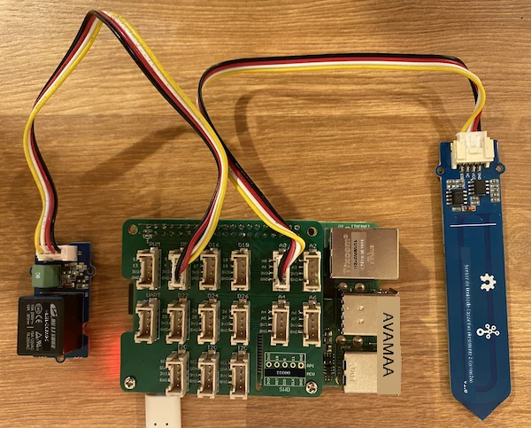

# Controle um relé - Raspberry Pi

Nesta parte da lição, você adicionará um relé ao seu Raspberry Pi, além do sensor de umidade do solo, e o controlará com base no nível de umidade do solo.

## Hardware

O Raspberry Pi precisa de um relé.

O relé que você usará é um [Grove relay](https://www.seeedstudio.com/Grove-Relay.html), um relé normalmente aberto (o que significa que o circuito de saída está aberto ou desconectado quando nenhum sinal é enviado ao relé) que pode lidar com circuitos de saída de até 250V e 10A.

Este é um atuador digital, então ele se conecta a um pino digital no Grove Base Hat.

### Conecte o relé

O relé Grove pode ser conectado ao Raspberry Pi.

#### Tarefa

Conecte o relé.


1. Insira uma extremidade de um cabo Grove no soquete do relé. Ele só encaixará de uma maneira.

1. Com o Raspberry Pi desligado, conecte a outra extremidade do cabo Grove ao soquete digital marcado como **D5** no Grove Base Hat conectado ao Pi. Este soquete é o segundo da esquerda, na fileira de soquetes ao lado dos pinos GPIO. Deixe o sensor de umidade do solo conectado ao soquete **A0**.



1. Insira o sensor de umidade do solo na terra, caso ele ainda não esteja inserido da lição anterior.

## Programe o relé

Agora o Raspberry Pi pode ser programado para usar o relé conectado.

### Tarefa

Programe o dispositivo.

1. Ligue o Raspberry Pi e aguarde o boot.

1. Abra o projeto `soil-moisture-sensor` da última lição no VS Code, caso ele ainda não esteja aberto. Você irá adicionar a este projeto.

1. Adicione o seguinte código ao arquivo `app.py` abaixo dos imports existentes:

    ```python
    from grove.grove_relay import GroveRelay
    ```

    Esta instrução importa o `GroveRelay` das bibliotecas Python do Grove para interagir com o relé Grove.

1. Adicione o seguinte código abaixo da declaração da classe `ADC` para criar uma instância de `GroveRelay`:

    ```python
    relay = GroveRelay(5)
    ```

    Isso cria um relé usando o pino **D5**, o pino digital ao qual você conectou o relé.

1. Para testar se o relé está funcionando, adicione o seguinte ao loop `while True:`:

    ```python
    relay.on()
    time.sleep(.5)
    relay.off()
    ```

    O código liga o relé, espera 0,5 segundos e depois desliga o relé.

1. Execute o aplicativo Python. O relé será ligado e desligado a cada 10 segundos, com um atraso de meio segundo entre ligar e desligar. Você ouvirá o relé clicar ao ligar e ao desligar. Um LED na placa Grove acenderá quando o relé estiver ligado e apagará quando estiver desligado.

    

## Controle o relé com base na umidade do solo

Agora que o relé está funcionando, ele pode ser controlado em resposta às leituras de umidade do solo.

### Tarefa

Controle o relé.

1. Exclua as 3 linhas de código que você adicionou para testar o relé. Substitua-as pelo seguinte código:

    ```python
    if soil_moisture > 450:
        print("Soil Moisture is too low, turning relay on.")
        relay.on()
    else:
        print("Soil Moisture is ok, turning relay off.")
        relay.off()
    ```

    Este código verifica o nível de umidade do solo a partir do sensor de umidade do solo. Se estiver acima de 450, ele liga o relé e o desliga quando estiver abaixo de 450.

    > 💁 Lembre-se de que o sensor capacitivo de umidade do solo lê: quanto menor o nível de umidade do solo, maior a quantidade de umidade na terra, e vice-versa.

1. Execute o aplicativo Python. Você verá o relé ligar ou desligar dependendo do nível de umidade do solo. Teste em solo seco e depois adicione água.

    ```output
    Soil Moisture: 638
    Soil Moisture is too low, turning relay on.
    Soil Moisture: 452
    Soil Moisture is too low, turning relay on.
    Soil Moisture: 347
    Soil Moisture is ok, turning relay off.
    ```

> 💁 Você pode encontrar este código na pasta [code-relay/pi](../../../../../2-farm/lessons/3-automated-plant-watering/code-relay/pi).

😀 Seu programa de controle de relé com sensor de umidade do solo foi um sucesso!

---

**Aviso Legal**:  
Este documento foi traduzido utilizando o serviço de tradução por IA [Co-op Translator](https://github.com/Azure/co-op-translator). Embora nos esforcemos para garantir a precisão, esteja ciente de que traduções automatizadas podem conter erros ou imprecisões. O documento original em seu idioma nativo deve ser considerado a fonte autoritativa. Para informações críticas, recomenda-se a tradução profissional realizada por humanos. Não nos responsabilizamos por quaisquer mal-entendidos ou interpretações equivocadas decorrentes do uso desta tradução.