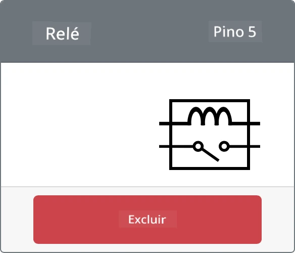

# Controle um relé - Hardware IoT Virtual

Nesta parte da lição, você adicionará um relé ao seu dispositivo IoT virtual, além do sensor de umidade do solo, e o controlará com base no nível de umidade do solo.

## Hardware Virtual

O dispositivo IoT virtual usará um relé simulado Grove. Isso mantém este laboratório semelhante ao uso de um Raspberry Pi com um relé físico Grove.

Em um dispositivo IoT físico, o relé seria um relé normalmente aberto (ou seja, o circuito de saída está aberto ou desconectado quando nenhum sinal é enviado ao relé). Um relé como este pode lidar com circuitos de saída de até 250V e 10A.

### Adicionar o relé ao CounterFit

Para usar um relé virtual, você precisa adicioná-lo ao aplicativo CounterFit.

#### Tarefa

Adicione o relé ao aplicativo CounterFit.

1. Abra o projeto `soil-moisture-sensor` da última lição no VS Code, caso ainda não esteja aberto. Você adicionará a este projeto.

1. Certifique-se de que o aplicativo web CounterFit esteja em execução.

1. Crie um relé:

    1. Na caixa *Create actuator* no painel *Actuators*, abra o menu suspenso *Actuator type* e selecione *Relay*.

    1. Defina o *Pin* como *5*.

    1. Selecione o botão **Add** para criar o relé no pino 5.

    

    O relé será criado e aparecerá na lista de atuadores.

    

## Programar o relé

O aplicativo do sensor de umidade do solo agora pode ser programado para usar o relé virtual.

### Tarefa

Programe o dispositivo virtual.

1. Abra o projeto `soil-moisture-sensor` da última lição no VS Code, caso ainda não esteja aberto. Você adicionará a este projeto.

1. Adicione o seguinte código ao arquivo `app.py` abaixo das importações existentes:

    ```python
    from counterfit_shims_grove.grove_relay import GroveRelay
    ```

    Esta instrução importa o `GroveRelay` das bibliotecas Grove Python shim para interagir com o relé virtual Grove.

1. Adicione o seguinte código abaixo da declaração da classe `ADC` para criar uma instância de `GroveRelay`:

    ```python
    relay = GroveRelay(5)
    ```

    Isso cria um relé usando o pino **5**, o pino ao qual você conectou o relé.

1. Para testar se o relé está funcionando, adicione o seguinte ao loop `while True:`:

    ```python
    relay.on()
    time.sleep(.5)
    relay.off()
    ```

    O código liga o relé, espera 0,5 segundos e depois desliga o relé.

1. Execute o aplicativo Python. O relé será ligado e desligado a cada 10 segundos, com um atraso de meio segundo entre ligar e desligar. Você verá o relé virtual no aplicativo CounterFit fechar e abrir conforme o relé é ligado e desligado.

    

## Controlar o relé com base na umidade do solo

Agora que o relé está funcionando, ele pode ser controlado em resposta às leituras de umidade do solo.

### Tarefa

Controle o relé.

1. Exclua as 3 linhas de código que você adicionou para testar o relé. Substitua-as pelo seguinte código no mesmo lugar:

    ```python
    if soil_moisture > 450:
        print("Soil Moisture is too low, turning relay on.")
        relay.on()
    else:
        print("Soil Moisture is ok, turning relay off.")
        relay.off()
    ```

    Este código verifica o nível de umidade do solo a partir do sensor de umidade do solo. Se estiver acima de 450, ele liga o relé, desligando-o se estiver abaixo de 450.

    > 💁 Lembre-se de que o sensor capacitivo de umidade do solo lê que, quanto menor o nível de umidade do solo, maior é a umidade no solo, e vice-versa.

1. Execute o aplicativo Python. Você verá o relé ligar ou desligar dependendo dos níveis de umidade do solo. Altere as configurações de *Value* ou *Random* para o sensor de umidade do solo para ver o valor mudar.

    ```output
    Soil Moisture: 638
    Soil Moisture is too low, turning relay on.
    Soil Moisture: 452
    Soil Moisture is too low, turning relay on.
    Soil Moisture: 347
    Soil Moisture is ok, turning relay off.
    ```

> 💁 Você pode encontrar este código na pasta [code-relay/virtual-device](../../../../../2-farm/lessons/3-automated-plant-watering/code-relay/virtual-device).

😀 Seu programa de sensor de umidade do solo virtual controlando um relé foi um sucesso!

---

**Aviso Legal**:  
Este documento foi traduzido utilizando o serviço de tradução por IA [Co-op Translator](https://github.com/Azure/co-op-translator). Embora nos esforcemos para garantir a precisão, esteja ciente de que traduções automatizadas podem conter erros ou imprecisões. O documento original em seu idioma nativo deve ser considerado a fonte autoritativa. Para informações críticas, recomenda-se a tradução profissional realizada por humanos. Não nos responsabilizamos por quaisquer mal-entendidos ou interpretações equivocadas decorrentes do uso desta tradução.