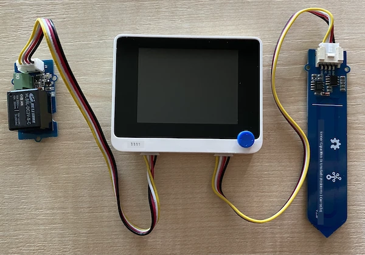

# Controlar um relé - Wio Terminal

Nesta parte da lição, você adicionará um relé ao seu Wio Terminal, além do sensor de umidade do solo, e o controlará com base no nível de umidade do solo.

## Hardware

O Wio Terminal precisa de um relé.

O relé que você usará é um [relé Grove](https://www.seeedstudio.com/Grove-Relay.html), um relé normalmente aberto (o que significa que o circuito de saída está aberto ou desconectado quando nenhum sinal é enviado ao relé) que pode lidar com circuitos de saída de até 250V e 10A.

Este é um atuador digital, então ele se conecta aos pinos digitais do Wio Terminal. A porta combinada analógica/digital já está em uso com o sensor de umidade do solo, então este será conectado à outra porta, que é uma porta combinada I2C e digital.

### Conectar o relé

O relé Grove pode ser conectado à porta digital do Wio Terminal.

#### Tarefa

Conecte o relé.


1. Insira uma extremidade de um cabo Grove no soquete do relé. Ele só encaixará de uma maneira.

1. Com o Wio Terminal desconectado do computador ou de outra fonte de energia, conecte a outra extremidade do cabo Grove ao soquete Grove do lado esquerdo do Wio Terminal, olhando para a tela. Deixe o sensor de umidade do solo conectado ao soquete do lado direito.



1. Insira o sensor de umidade do solo no solo, caso ele ainda não esteja inserido da lição anterior.

## Programar o relé

Agora o Wio Terminal pode ser programado para usar o relé conectado.

### Tarefa

Programe o dispositivo.

1. Abra o projeto `soil-moisture-sensor` da última lição no VS Code, caso ainda não esteja aberto. Você adicionará código a este projeto.

2. Não há uma biblioteca para este atuador - é um atuador digital controlado por um sinal alto ou baixo. Para ligá-lo, você envia um sinal alto para o pino (3.3V); para desligá-lo, você envia um sinal baixo (0V). Você pode fazer isso usando a função [`digitalWrite`](https://www.arduino.cc/reference/en/language/functions/digital-io/digitalwrite/) integrada do Arduino. Comece adicionando o seguinte ao final da função `setup` para configurar a porta combinada I2C/digital como um pino de saída para enviar uma tensão ao relé:

    ```cpp
    pinMode(PIN_WIRE_SCL, OUTPUT);
    ```

    `PIN_WIRE_SCL` é o número da porta para a porta combinada I2C/digital.

1. Para testar se o relé está funcionando, adicione o seguinte à função `loop`, abaixo do último `delay`:

    ```cpp
    digitalWrite(PIN_WIRE_SCL, HIGH);
    delay(500);
    digitalWrite(PIN_WIRE_SCL, LOW);
    ```

    O código envia um sinal alto ao pino ao qual o relé está conectado para ligá-lo, espera 500ms (meio segundo) e, em seguida, envia um sinal baixo para desligar o relé.

1. Compile e carregue o código no Wio Terminal.

1. Após o upload, o relé será ligado e desligado a cada 10 segundos, com um atraso de meio segundo entre ligar e desligar. Você ouvirá o relé clicar ao ligar e ao desligar. Um LED na placa Grove acenderá quando o relé estiver ligado e apagará quando estiver desligado.

    

## Controlar o relé com base na umidade do solo

Agora que o relé está funcionando, ele pode ser controlado em resposta às leituras de umidade do solo.

### Tarefa

Controle o relé.

1. Exclua as 3 linhas de código que você adicionou para testar o relé. Substitua-as pelo seguinte código:

    ```cpp
    if (soil_moisture > 450)
    {
        Serial.println("Soil Moisture is too low, turning relay on.");
        digitalWrite(PIN_WIRE_SCL, HIGH);
    }
    else
    {
        Serial.println("Soil Moisture is ok, turning relay off.");
        digitalWrite(PIN_WIRE_SCL, LOW);
    }
    ```

    Este código verifica o nível de umidade do solo a partir do sensor de umidade do solo. Se estiver acima de 450, ele liga o relé e o desliga quando estiver abaixo de 450.

    > 💁 Lembre-se de que o sensor capacitivo de umidade do solo lê: quanto menor o nível de umidade do solo, maior a quantidade de umidade no solo, e vice-versa.

1. Compile e carregue o código no Wio Terminal.

1. Monitore o dispositivo através do monitor serial. Você verá o relé ligar ou desligar dependendo do nível de umidade do solo. Teste em solo seco e, em seguida, adicione água.

    ```output
    Soil Moisture: 638
    Soil Moisture is too low, turning relay on.
    Soil Moisture: 452
    Soil Moisture is too low, turning relay on.
    Soil Moisture: 347
    Soil Moisture is ok, turning relay off.
    ```

> 💁 Você pode encontrar este código na pasta [code-relay/wio-terminal](../../../../../2-farm/lessons/3-automated-plant-watering/code-relay/wio-terminal).

😀 Seu programa de controle de relé com sensor de umidade do solo foi um sucesso!

---

**Aviso Legal**:  
Este documento foi traduzido utilizando o serviço de tradução por IA [Co-op Translator](https://github.com/Azure/co-op-translator). Embora nos esforcemos para garantir a precisão, esteja ciente de que traduções automatizadas podem conter erros ou imprecisões. O documento original em seu idioma nativo deve ser considerado a fonte autoritativa. Para informações críticas, recomenda-se a tradução profissional realizada por humanos. Não nos responsabilizamos por quaisquer mal-entendidos ou interpretações equivocadas decorrentes do uso desta tradução.