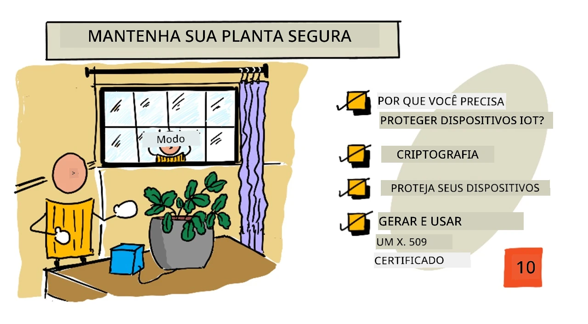
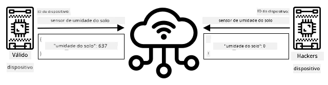
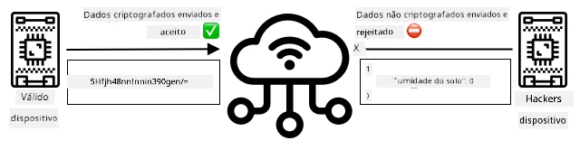
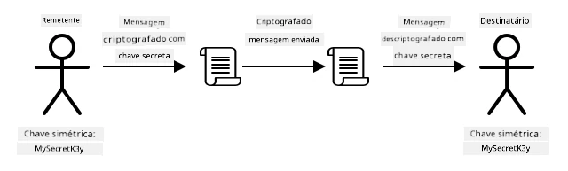
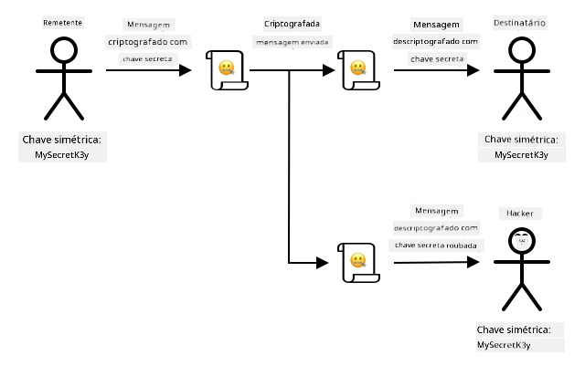
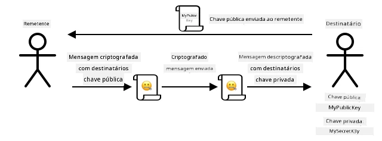
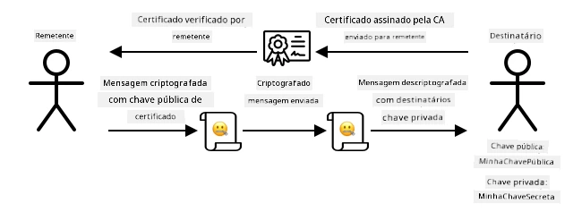

# Mantenha sua planta segura



> Ilustração por [Nitya Narasimhan](https://github.com/nitya). Clique na imagem para uma versão maior.

## Questionário pré-aula

[Questionário pré-aula](https://black-meadow-040d15503.1.azurestaticapps.net/quiz/19)

## Introdução

Nas últimas lições, você criou um dispositivo IoT para monitoramento do solo e o conectou à nuvem. Mas e se hackers trabalhando para um fazendeiro rival conseguissem assumir o controle dos seus dispositivos IoT? E se eles enviassem leituras falsas de alta umidade do solo para que suas plantas nunca fossem irrigadas, ou ligassem o sistema de irrigação continuamente, matando suas plantas por excesso de água e gerando um custo enorme com desperdício?

Nesta lição, você aprenderá sobre como proteger dispositivos IoT. Como esta é a última lição deste projeto, você também aprenderá a limpar seus recursos na nuvem, reduzindo quaisquer custos potenciais.

Nesta lição, abordaremos:

* [Por que você precisa proteger dispositivos IoT?](../../../../../2-farm/lessons/6-keep-your-plant-secure)
* [Criptografia](../../../../../2-farm/lessons/6-keep-your-plant-secure)
* [Proteja seus dispositivos IoT](../../../../../2-farm/lessons/6-keep-your-plant-secure)
* [Gerar e usar um certificado X.509](../../../../../2-farm/lessons/6-keep-your-plant-secure)

> 🗑 Esta é a última lição deste projeto, então, após concluir esta lição e o exercício, não se esqueça de limpar seus serviços na nuvem. Você precisará dos serviços para concluir o exercício, então certifique-se de finalizá-lo primeiro.
>
> Consulte [o guia de limpeza do projeto](../../../clean-up.md) se necessário para obter instruções sobre como fazer isso.

## Por que você precisa proteger dispositivos IoT?

A segurança em IoT envolve garantir que apenas dispositivos esperados possam se conectar ao seu serviço IoT na nuvem e enviar telemetria, e que apenas seu serviço na nuvem possa enviar comandos aos seus dispositivos. Os dados de IoT também podem ser pessoais, incluindo informações médicas ou íntimas, então toda a sua aplicação precisa considerar a segurança para evitar vazamentos desses dados.

Se sua aplicação IoT não for segura, há vários riscos:

* Um dispositivo falso pode enviar dados incorretos, fazendo com que sua aplicação responda de forma inadequada. Por exemplo, eles poderiam enviar leituras constantes de alta umidade do solo, fazendo com que seu sistema de irrigação nunca ligue e suas plantas morram por falta de água.
* Usuários não autorizados poderiam acessar dados dos dispositivos IoT, incluindo informações pessoais ou críticas para o negócio.
* Hackers poderiam enviar comandos para controlar um dispositivo de forma que cause danos ao dispositivo ou ao hardware conectado.
* Ao se conectar a um dispositivo IoT, hackers poderiam usar isso para acessar redes adicionais e obter acesso a sistemas privados.
* Usuários mal-intencionados poderiam acessar dados pessoais e usá-los para chantagem.

Esses são cenários do mundo real e acontecem o tempo todo. Alguns exemplos foram apresentados em lições anteriores, mas aqui estão mais alguns:

* Em 2018, hackers usaram um ponto de acesso Wi-Fi aberto em um termostato de aquário para acessar a rede de um cassino e roubar dados. [The Hacker News - Casino Gets Hacked Through Its Internet-Connected Fish Tank Thermometer](https://thehackernews.com/2018/04/iot-hacking-thermometer.html)
* Em 2016, o Botnet Mirai lançou um ataque de negação de serviço contra a Dyn, um provedor de serviços de Internet, derrubando grandes partes da Internet. Esse botnet usou malware para se conectar a dispositivos IoT, como DVRs e câmeras, que utilizavam nomes de usuário e senhas padrão, e a partir daí lançou o ataque. [The Guardian - DDoS attack that disrupted internet was largest of its kind in history, experts say](https://www.theguardian.com/technology/2016/oct/26/ddos-attack-dyn-mirai-botnet)
* A Spiral Toys tinha um banco de dados de usuários de seus brinquedos conectados CloudPets disponível publicamente na Internet. [Troy Hunt - Data from connected CloudPets teddy bears leaked and ransomed, exposing kids' voice messages](https://www.troyhunt.com/data-from-connected-cloudpets-teddy-bears-leaked-and-ransomed-exposing-kids-voice-messages/).
* O Strava marcava corredores que você passava e mostrava suas rotas, permitindo que estranhos vissem onde você mora. [Kim Komndo - Fitness app could lead a stranger right to your home — change this setting](https://www.komando.com/security-privacy/strava-fitness-app-privacy/755349/).

✅ Faça uma pesquisa: Procure mais exemplos de ataques e violações de dados em IoT, especialmente com itens pessoais, como escovas de dente ou balanças conectadas à Internet. Pense no impacto que esses ataques podem ter sobre as vítimas ou clientes.

> 💁 Segurança é um tópico enorme, e esta lição abordará apenas alguns dos conceitos básicos sobre a conexão do seu dispositivo à nuvem. Outros tópicos que não serão abordados incluem monitoramento de alterações de dados em trânsito, invasão direta de dispositivos ou alterações nas configurações dos dispositivos. A ameaça de invasões em IoT é tão grande que ferramentas como [Azure Defender for IoT](https://azure.microsoft.com/services/azure-defender-for-iot/?WT.mc_id=academic-17441-jabenn) foram desenvolvidas. Essas ferramentas são semelhantes aos antivírus e ferramentas de segurança que você pode ter no seu computador, mas projetadas para dispositivos IoT pequenos e de baixo consumo de energia.

## Criptografia

Quando um dispositivo se conecta a um serviço IoT, ele usa um ID para se identificar. O problema é que esse ID pode ser clonado - um hacker poderia configurar um dispositivo malicioso que usa o mesmo ID de um dispositivo real, mas envia dados falsos.



A solução para isso é converter os dados enviados em um formato embaralhado, usando algum valor conhecido apenas pelo dispositivo e pela nuvem. Esse processo é chamado de *criptografia*, e o valor usado para criptografar os dados é chamado de *chave de criptografia*.



O serviço na nuvem pode então converter os dados de volta para um formato legível, usando um processo chamado *descriptografia*, utilizando a mesma chave de criptografia ou uma *chave de descriptografia*. Se a mensagem criptografada não puder ser descriptografada pela chave, o dispositivo foi comprometido e a mensagem é rejeitada.

A técnica para realizar a criptografia e a descriptografia é chamada de *criptografia*.

### Criptografia antiga

Os primeiros tipos de criptografia eram cifras de substituição, datando de 3.500 anos atrás. As cifras de substituição envolvem substituir uma letra por outra. Por exemplo, a [cifra de César](https://wikipedia.org/wiki/Caesar_cipher) envolve deslocar o alfabeto por uma quantidade definida, com apenas o remetente da mensagem criptografada e o destinatário sabendo quantas letras deslocar.

A [cifra de Vigenère](https://wikipedia.org/wiki/Vigenère_cipher) levou isso adiante, usando palavras para criptografar o texto, de modo que cada letra no texto original fosse deslocada por uma quantidade diferente, em vez de sempre deslocar pelo mesmo número de letras.

A criptografia foi usada para uma ampla gama de propósitos, como proteger receitas de esmaltes de cerâmica na antiga Mesopotâmia, escrever bilhetes de amor secretos na Índia ou manter feitiços mágicos egípcios em segredo.

### Criptografia moderna

A criptografia moderna é muito mais avançada, tornando-a mais difícil de ser quebrada do que os métodos antigos. A criptografia moderna usa matemática complexa para criptografar dados com um número tão grande de chaves possíveis que ataques de força bruta se tornam inviáveis.

A criptografia é usada de várias maneiras para comunicações seguras. Se você está lendo esta página no GitHub, pode notar que o endereço do site começa com *HTTPS*, o que significa que a comunicação entre seu navegador e os servidores do GitHub está criptografada. Se alguém conseguisse ler o tráfego da Internet entre seu navegador e o GitHub, não seria capaz de entender os dados, pois estão criptografados. Seu computador pode até criptografar todos os dados no disco rígido, para que, se alguém o roubar, não consiga ler seus dados sem sua senha.

> 🎓 HTTPS significa HyperText Transfer Protocol **Secure**

Infelizmente, nem tudo é seguro. Alguns dispositivos não têm segurança, outros são protegidos com chaves fáceis de quebrar, ou às vezes todos os dispositivos do mesmo tipo usam a mesma chave. Há relatos de dispositivos IoT muito pessoais que têm a mesma senha para conexão via Wi-Fi ou Bluetooth. Se você pode se conectar ao seu próprio dispositivo, pode se conectar ao de outra pessoa. Uma vez conectado, você poderia acessar dados muito privados ou controlar o dispositivo de outra pessoa.

> 💁 Apesar das complexidades da criptografia moderna e das alegações de que quebrar a criptografia pode levar bilhões de anos, o avanço da computação quântica trouxe a possibilidade de quebrar toda a criptografia conhecida em um período muito curto de tempo!

### Chaves simétricas e assimétricas

A criptografia pode ser de dois tipos - simétrica e assimétrica.

A criptografia **simétrica** usa a mesma chave para criptografar e descriptografar os dados. Tanto o remetente quanto o destinatário precisam conhecer a mesma chave. Este é o tipo menos seguro, pois a chave precisa ser compartilhada de alguma forma. Para que um remetente envie uma mensagem criptografada a um destinatário, o remetente pode precisar enviar a chave ao destinatário primeiro.



Se a chave for roubada durante o envio, ou se o remetente ou destinatário forem hackeados e a chave for descoberta, a criptografia pode ser comprometida.



A criptografia **assimétrica** usa 2 chaves - uma chave para criptografar e outra para descriptografar, conhecidas como par de chaves pública/privada. A chave pública é usada para criptografar a mensagem, mas não pode ser usada para descriptografá-la; a chave privada é usada para descriptografar a mensagem, mas não pode ser usada para criptografá-la.



O destinatário compartilha sua chave pública, e o remetente a utiliza para criptografar a mensagem. Após o envio, o destinatário descriptografa a mensagem com sua chave privada. A criptografia assimétrica é mais segura, pois a chave privada é mantida em segredo pelo destinatário e nunca é compartilhada. Qualquer pessoa pode ter a chave pública, já que ela só pode ser usada para criptografar mensagens.

A criptografia simétrica é mais rápida do que a assimétrica, enquanto a assimétrica é mais segura. Alguns sistemas utilizam ambas - usando a criptografia assimétrica para criptografar e compartilhar a chave simétrica, e depois usando a chave simétrica para criptografar todos os dados. Isso torna o compartilhamento da chave simétrica mais seguro entre remetente e destinatário, e mais rápido ao criptografar e descriptografar os dados.

## Proteja seus dispositivos IoT

Os dispositivos IoT podem ser protegidos usando criptografia simétrica ou assimétrica. A simétrica é mais fácil, mas menos segura.

### Chaves simétricas

Quando você configurou seu dispositivo IoT para interagir com o IoT Hub, utilizou uma string de conexão. Um exemplo de string de conexão é:

```output
HostName=soil-moisture-sensor.azure-devices.net;DeviceId=soil-moisture-sensor;SharedAccessKey=Bhry+ind7kKEIDxubK61RiEHHRTrPl7HUow8cEm/mU0=
```

Essa string de conexão é composta por três partes separadas por ponto e vírgula, com cada parte sendo uma chave e um valor:

| Chave | Valor | Descrição |
| --- | ----- | ----------- |
| HostName | `soil-moisture-sensor.azure-devices.net` | A URL do IoT Hub |
| DeviceId | `soil-moisture-sensor` | O ID único do dispositivo |
| SharedAccessKey | `Bhry+ind7kKEIDxubK61RiEHHRTrPl7HUow8cEm/mU0=` | Uma chave simétrica conhecida pelo dispositivo e pelo IoT Hub |

A última parte dessa string de conexão, o `SharedAccessKey`, é a chave simétrica conhecida tanto pelo dispositivo quanto pelo IoT Hub. Essa chave nunca é enviada do dispositivo para a nuvem, nem da nuvem para o dispositivo. Em vez disso, ela é usada para criptografar os dados enviados ou recebidos.

✅ Faça um experimento. O que você acha que acontecerá se você alterar a parte `SharedAccessKey` da string de conexão ao conectar seu dispositivo IoT? Experimente.

Quando o dispositivo tenta se conectar pela primeira vez, ele envia um token de assinatura de acesso compartilhado (SAS) que consiste na URL do IoT Hub, um timestamp indicando quando a assinatura de acesso expirará (geralmente 1 dia a partir do momento atual) e uma assinatura. Essa assinatura consiste na URL e no tempo de expiração criptografados com a chave de acesso compartilhado da string de conexão.

O IoT Hub descriptografa essa assinatura com a chave de acesso compartilhado e, se o valor descriptografado corresponder à URL e ao tempo de expiração, o dispositivo é autorizado a se conectar. Ele também verifica se o horário atual é anterior ao tempo de expiração, para impedir que um dispositivo malicioso capture o token SAS de um dispositivo real e o utilize.

Essa é uma maneira elegante de verificar se o remetente é o dispositivo correto. Ao enviar alguns dados conhecidos em uma forma descriptografada e criptografada, o servidor pode verificar o dispositivo garantindo que, ao descriptografar os dados criptografados, o resultado corresponda à versão descriptografada enviada. Se corresponder, então tanto o remetente quanto o destinatário possuem a mesma chave de criptografia simétrica.
💁 Devido ao tempo de expiração, seu dispositivo IoT precisa saber a hora exata, geralmente obtida de um servidor [NTP](https://wikipedia.org/wiki/Network_Time_Protocol). Se a hora não estiver correta, a conexão falhará.
Após a conexão, todos os dados enviados para o IoT Hub a partir do dispositivo, ou para o dispositivo a partir do IoT Hub, serão criptografados com a chave de acesso compartilhada.

✅ O que você acha que acontecerá se vários dispositivos compartilharem a mesma string de conexão?

> 💁 Não é uma boa prática de segurança armazenar essa chave no código. Se um hacker obtiver seu código-fonte, ele poderá acessar sua chave. Além disso, isso dificulta o lançamento de código, pois seria necessário recompilar com uma chave atualizada para cada dispositivo. É melhor carregar essa chave a partir de um módulo de segurança de hardware - um chip no dispositivo IoT que armazena valores criptografados que podem ser lidos pelo seu código.
>
> Ao aprender sobre IoT, muitas vezes é mais fácil colocar a chave no código, como você fez em uma lição anterior, mas é essencial garantir que essa chave não seja incluída em um controle de código-fonte público.

Os dispositivos possuem 2 chaves e 2 strings de conexão correspondentes. Isso permite que você faça a rotação das chaves - ou seja, alterne de uma chave para outra caso a primeira seja comprometida, e gere novamente a primeira chave.

### Certificados X.509

Quando você utiliza criptografia assimétrica com um par de chaves pública/privada, é necessário fornecer sua chave pública para qualquer pessoa que queira enviar dados para você. O problema é: como o destinatário da sua chave pode ter certeza de que é realmente sua chave pública e não de alguém se passando por você? Em vez de fornecer apenas a chave, você pode incluí-la em um certificado que foi verificado por uma terceira parte confiável, chamado de certificado X.509.

Os certificados X.509 são documentos digitais que contêm a parte pública do par de chaves pública/privada. Eles geralmente são emitidos por uma das várias organizações confiáveis chamadas [Autoridades Certificadoras](https://wikipedia.org/wiki/Certificate_authority) (CAs) e são assinados digitalmente pela CA para indicar que a chave é válida e vem de você. Você confia no certificado e na chave pública porque confia na CA, de forma semelhante a como confiaria em um passaporte ou carteira de motorista porque confia no país que os emitiu. Certificados têm um custo, mas você também pode "autoassinar", ou seja, criar um certificado você mesmo e assiná-lo para fins de teste.

> 💁 Você nunca deve usar um certificado autoassinado em um ambiente de produção.

Esses certificados possuem vários campos, incluindo quem é o proprietário da chave pública, os detalhes da CA que o emitiu, o período de validade e a própria chave pública. Antes de usar um certificado, é uma boa prática verificá-lo, confirmando que foi assinado pela CA original.

✅ Você pode ler uma lista completa dos campos de um certificado no [tutorial da Microsoft sobre Certificados de Chave Pública X.509](https://docs.microsoft.com/azure/iot-hub/tutorial-x509-certificates?WT.mc_id=academic-17441-jabenn#certificate-fields).

Ao usar certificados X.509, tanto o remetente quanto o destinatário terão suas próprias chaves públicas e privadas, além de certificados X.509 contendo suas respectivas chaves públicas. Eles então trocam os certificados X.509 de alguma forma, utilizando as chaves públicas um do outro para criptografar os dados enviados e suas próprias chaves privadas para descriptografar os dados recebidos.



Uma grande vantagem de usar certificados X.509 é que eles podem ser compartilhados entre dispositivos. Você pode criar um certificado, carregá-lo no IoT Hub e usá-lo para todos os seus dispositivos. Cada dispositivo só precisa conhecer a chave privada para descriptografar as mensagens recebidas do IoT Hub.

O certificado usado pelo seu dispositivo para criptografar mensagens enviadas ao IoT Hub é publicado pela Microsoft. É o mesmo certificado usado por muitos serviços do Azure e, às vezes, já está integrado nos SDKs.

> 💁 Lembre-se, uma chave pública é exatamente isso - pública. A chave pública do Azure só pode ser usada para criptografar dados enviados ao Azure, não para descriptografá-los, então ela pode ser compartilhada amplamente, inclusive no código-fonte. Por exemplo, você pode vê-la no [código-fonte do Azure IoT C SDK](https://github.com/Azure/azure-iot-sdk-c/blob/master/certs/certs.c).

✅ Há muitos termos técnicos relacionados a certificados X.509. Você pode ler as definições de alguns desses termos no [Guia simplificado sobre o jargão de certificados X.509](https://techcommunity.microsoft.com/t5/internet-of-things/the-layman-s-guide-to-x-509-certificate-jargon/ba-p/2203540?WT.mc_id=academic-17441-jabenn).

## Gerar e usar um certificado X.509

Os passos para gerar um certificado X.509 são:

1. Criar um par de chaves pública/privada. Um dos algoritmos mais amplamente utilizados para gerar um par de chaves pública/privada é o [Rivest–Shamir–Adleman](https://wikipedia.org/wiki/RSA_(cryptosystem)) (RSA).

1. Submeter a chave pública com os dados associados para assinatura, seja por uma CA ou por autoassinatura.

A CLI do Azure possui comandos para criar uma nova identidade de dispositivo no IoT Hub, gerar automaticamente o par de chaves pública/privada e criar um certificado autoassinado.

> 💁 Se você quiser ver os passos detalhados, em vez de usar a CLI do Azure, pode encontrá-los no [tutorial sobre como usar o OpenSSL para criar certificados autoassinados na documentação do Microsoft IoT Hub](https://docs.microsoft.com/azure/iot-hub/tutorial-x509-self-sign?WT.mc_id=academic-17441-jabenn).

### Tarefa - criar uma identidade de dispositivo usando um certificado X.509

1. Execute o seguinte comando para registrar a nova identidade de dispositivo, gerando automaticamente as chaves e os certificados:

    ```sh
    az iot hub device-identity create --device-id soil-moisture-sensor-x509 \
                                      --am x509_thumbprint \
                                      --output-dir . \
                                      --hub-name <hub_name>
    ```

    Substitua `<hub_name>` pelo nome que você usou para o IoT Hub.

    Isso criará um dispositivo com o ID `soil-moisture-sensor-x509` para diferenciá-lo da identidade de dispositivo criada na última lição. Este comando também criará 2 arquivos no diretório atual:

    * `soil-moisture-sensor-x509-key.pem` - este arquivo contém a chave privada do dispositivo.
    * `soil-moisture-sensor-x509-cert.pem` - este é o arquivo de certificado X.509 do dispositivo.

    Mantenha esses arquivos seguros! O arquivo da chave privada não deve ser incluído em um controle de código-fonte público.

### Tarefa - usar o certificado X.509 no código do seu dispositivo

Siga o guia relevante para conectar seu dispositivo IoT à nuvem usando o certificado X.509:

* [Arduino - Wio Terminal](wio-terminal-x509.md)
* [Computador de placa única - Raspberry Pi/Dispositivo IoT Virtual](single-board-computer-x509.md)

---

## 🚀 Desafio

Existem várias maneiras de criar, gerenciar e excluir serviços do Azure, como Grupos de Recursos e IoT Hubs. Uma delas é o [Portal do Azure](https://portal.azure.com?WT.mc_id=academic-17441-jabenn) - uma interface baseada na web que oferece uma GUI para gerenciar seus serviços do Azure.

Acesse [portal.azure.com](https://portal.azure.com?WT.mc_id=academic-17441-jabenn) e explore o portal. Veja se você consegue criar um IoT Hub usando o portal e, em seguida, excluí-lo.

**Dica** - ao criar serviços pelo portal, não é necessário criar um Grupo de Recursos antecipadamente; um pode ser criado durante a criação do serviço. Certifique-se de excluí-lo quando terminar!

Você pode encontrar muita documentação, tutoriais e guias sobre o Portal do Azure na [documentação do portal do Azure](https://docs.microsoft.com/azure/azure-portal/?WT.mc_id=academic-17441-jabenn).

## Questionário pós-aula

[Questionário pós-aula](https://black-meadow-040d15503.1.azurestaticapps.net/quiz/20)

## Revisão e Autoestudo

* Leia sobre a história da criptografia na [página História da criptografia na Wikipedia](https://wikipedia.org/wiki/History_of_cryptography).
* Leia sobre certificados X.509 na [página X.509 na Wikipedia](https://wikipedia.org/wiki/X.509).

## Tarefa

[Crie um novo dispositivo IoT](assignment.md)

---

**Aviso Legal**:  
Este documento foi traduzido utilizando o serviço de tradução por IA [Co-op Translator](https://github.com/Azure/co-op-translator). Embora nos esforcemos para garantir a precisão, esteja ciente de que traduções automatizadas podem conter erros ou imprecisões. O documento original em seu idioma nativo deve ser considerado a fonte autoritativa. Para informações críticas, recomenda-se a tradução profissional realizada por humanos. Não nos responsabilizamos por quaisquer mal-entendidos ou interpretações equivocadas decorrentes do uso desta tradução.