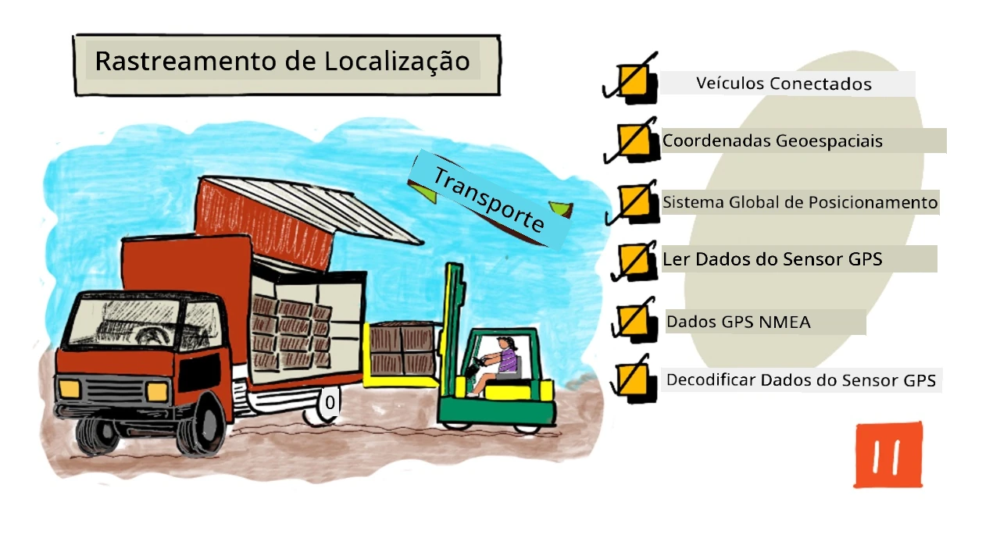
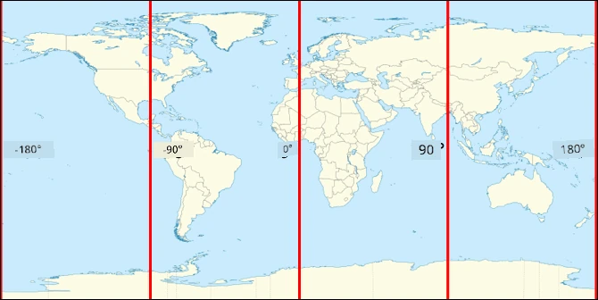
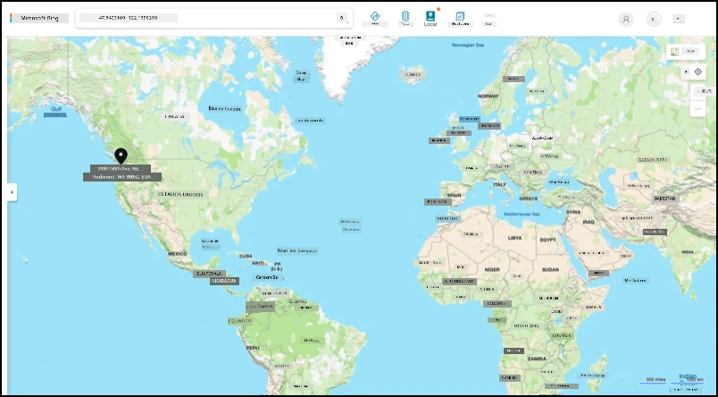

# Rastreamento de localização

> Ilustração por [Nitya Narasimhan](https://github.com/nitya). Clique na imagem para uma versão maior.

## Questionário pré-aula

[Questionário pré-aula](https://black-meadow-040d15503.1.azurestaticapps.net/quiz/21)

## Introdução

O processo principal para levar alimentos de um agricultor até o consumidor envolve carregar caixas de produtos em caminhões, navios, aviões ou outros veículos de transporte comercial e entregar os alimentos em algum lugar - seja diretamente ao cliente ou a um centro ou armazém para processamento. Todo o processo de ponta a ponta, do campo ao consumidor, faz parte de um processo chamado *cadeia de suprimentos*. O vídeo abaixo da Escola de Negócios W. P. Carey da Universidade Estadual do Arizona explica o conceito de cadeia de suprimentos e como ela é gerenciada em mais detalhes.

> 🎥 Clique na imagem acima para assistir ao vídeo

Adicionar dispositivos IoT pode melhorar drasticamente sua cadeia de suprimentos, permitindo gerenciar onde os itens estão, planejar melhor o transporte e o manuseio de mercadorias, e responder mais rapidamente a problemas.

Ao gerenciar uma frota de veículos, como caminhões, é útil saber onde cada veículo está em um determinado momento. Os veículos podem ser equipados com sensores GPS que enviam sua localização para sistemas IoT, permitindo que os proprietários identifiquem sua localização, vejam a rota que percorreram e saibam quando chegarão ao destino. A maioria dos veículos opera fora da cobertura Wi-Fi, então eles usam redes celulares para enviar esse tipo de dado. Às vezes, o sensor GPS está integrado a dispositivos IoT mais complexos, como diários eletrônicos de bordo. Esses dispositivos rastreiam quanto tempo um caminhão esteve em trânsito para garantir que os motoristas estejam em conformidade com as leis locais sobre horas de trabalho.

Nesta lição, você aprenderá como rastrear a localização de um veículo usando um sensor de Sistema de Posicionamento Global (GPS).

Nesta lição, abordaremos:

* [Veículos conectados](../../../../../3-transport/lessons/1-location-tracking)
* [Coordenadas geoespaciais](../../../../../3-transport/lessons/1-location-tracking)
* [Sistemas de Posicionamento Global (GPS)](../../../../../3-transport/lessons/1-location-tracking)
* [Ler dados de sensores GPS](../../../../../3-transport/lessons/1-location-tracking)
* [Dados GPS NMEA](../../../../../3-transport/lessons/1-location-tracking)
* [Decodificar dados de sensores GPS](../../../../../3-transport/lessons/1-location-tracking)

## Veículos conectados

IoT está transformando a maneira como mercadorias são transportadas ao criar frotas de *veículos conectados*. Esses veículos estão conectados a sistemas de TI centrais, relatando informações sobre sua localização e outros dados de sensores. Ter uma frota de veículos conectados oferece uma ampla gama de benefícios:

* Rastreamento de localização - você pode identificar onde um veículo está a qualquer momento, permitindo:

  * Receber alertas quando um veículo estiver prestes a chegar ao destino para preparar a equipe para descarregar
  * Localizar veículos roubados
  * Combinar dados de localização e rota com problemas de trânsito para permitir redirecionar veículos durante a jornada
  * Cumprir obrigações fiscais. Alguns países cobram impostos dos veículos com base na quilometragem percorrida em vias públicas (como o [RUC da Nova Zelândia](https://www.nzta.govt.nz/vehicles/licensing-rego/road-user-charges/)), então saber quando um veículo está em vias públicas versus privadas facilita o cálculo do imposto devido.
  * Saber onde enviar equipes de manutenção em caso de avaria

* Telemetria do motorista - garantir que os motoristas estejam respeitando os limites de velocidade, fazendo curvas em velocidades apropriadas, freando de forma eficiente e dirigindo com segurança. Veículos conectados também podem ter câmeras para registrar incidentes. Isso pode ser vinculado ao seguro, oferecendo taxas reduzidas para bons motoristas.

* Conformidade com horas de trabalho - garantir que os motoristas dirijam apenas dentro das horas legalmente permitidas, com base nos horários em que ligam e desligam o motor.

Esses benefícios podem ser combinados - por exemplo, combinando conformidade com horas de trabalho e rastreamento de localização para redirecionar motoristas caso não consigam chegar ao destino dentro das horas permitidas. Isso também pode ser combinado com outras telemetrias específicas do veículo, como dados de temperatura de caminhões refrigerados, permitindo redirecionar veículos caso a rota atual comprometa a manutenção da temperatura das mercadorias.

> 🎓 Logística é o processo de transportar mercadorias de um lugar para outro, como de uma fazenda para um supermercado via um ou mais armazéns. Um agricultor embala caixas de tomates que são carregadas em um caminhão, entregues a um armazém central e colocadas em um segundo caminhão que pode conter uma mistura de diferentes tipos de produtos, que são então entregues a um supermercado.

O componente principal do rastreamento de veículos é o GPS - sensores que podem identificar sua localização em qualquer lugar da Terra. Nesta lição, você aprenderá como usar um sensor GPS, começando com como definir uma localização na Terra.

## Coordenadas geoespaciais

Coordenadas geoespaciais são usadas para definir pontos na superfície da Terra, semelhante a como coordenadas podem ser usadas para desenhar um pixel em uma tela de computador ou posicionar pontos em bordados. Para um único ponto, você tem um par de coordenadas. Por exemplo, o Campus da Microsoft em Redmond, Washington, EUA está localizado em 47.6423109, -122.1390293.

### Latitude e longitude

A Terra é uma esfera - um círculo tridimensional. Por causa disso, os pontos são definidos dividindo-a em 360 graus, o mesmo que a geometria dos círculos. Latitude mede o número de graus de norte a sul, longitude mede o número de graus de leste a oeste.

> 💁 Ninguém sabe ao certo o motivo original de os círculos serem divididos em 360 graus. A [página sobre grau (ângulo) na Wikipedia](https://wikipedia.org/wiki/Degree_(angle)) aborda algumas das possíveis razões.

Latitude é medida usando linhas que circundam a Terra e correm paralelas ao equador, dividindo os hemisférios Norte e Sul em 90° cada. O equador está em 0°, o Polo Norte em 90°, também conhecido como 90° Norte, e o Polo Sul em -90°, ou 90° Sul.

Longitude é medida como o número de graus de leste a oeste. A origem de 0° da longitude é chamada de *Meridiano de Greenwich*, definida em 1884 como uma linha do Polo Norte ao Polo Sul que passa pelo [Observatório Real Britânico em Greenwich, Inglaterra](https://wikipedia.org/wiki/Royal_Observatory,_Greenwich).

> 🎓 Um meridiano é uma linha imaginária reta que vai do Polo Norte ao Polo Sul, formando um semicírculo.

Para medir a longitude de um ponto, você mede o número de graus ao longo do equador do Meridiano de Greenwich até um meridiano que passa por esse ponto. Longitude vai de -180°, ou 180° Oeste, passando por 0° no Meridiano de Greenwich, até 180°, ou 180° Leste. 180° e -180° referem-se ao mesmo ponto, o antimeridiano ou 180º meridiano. Este é um meridiano no lado oposto da Terra em relação ao Meridiano de Greenwich.

> 💁 O antimeridiano não deve ser confundido com a Linha Internacional de Data, que está aproximadamente na mesma posição, mas não é uma linha reta e varia para se ajustar às fronteiras geopolíticas.

✅ Faça uma pesquisa: Tente encontrar a latitude e longitude de sua localização atual.

### Graus, minutos e segundos vs graus decimais

Tradicionalmente, as medições de graus de latitude e longitude eram feitas usando numeração sexagesimal, ou base-60, um sistema numérico usado pelos antigos babilônios que fizeram as primeiras medições e registros de tempo e distância. Você provavelmente usa sexagesimal todos os dias sem perceber - dividindo horas em 60 minutos e minutos em 60 segundos.

Longitude e latitude são medidas em graus, minutos e segundos, com um minuto sendo 1/60 de um grau, e 1 segundo sendo 1/60 de um minuto.

Por exemplo, no equador:

* 1° de latitude é **111,3 quilômetros**
* 1 minuto de latitude é 111,3/60 = **1,855 quilômetros**
* 1 segundo de latitude é 1,855/60 = **0,031 quilômetros**

O símbolo para um minuto é uma aspa simples, para um segundo é uma aspa dupla. 2 graus, 17 minutos e 43 segundos, por exemplo, seriam escritos como 2°17'43". Partes de segundos são dadas como decimais, por exemplo, meio segundo é 0°0'0,5".

Computadores não trabalham em base-60, então essas coordenadas são dadas como graus decimais ao usar dados GPS na maioria dos sistemas computacionais. Por exemplo, 2°17'43" é 2,295277. O símbolo de grau geralmente é omitido.

As coordenadas de um ponto são sempre dadas como `latitude, longitude`, então o exemplo anterior do Campus da Microsoft em 47.6423109,-122.117198 tem:

* Uma latitude de 47.6423109 (47.6423109 graus ao norte do equador)
* Uma longitude de -122.1390293 (122.1390293 graus a oeste do Meridiano de Greenwich).

## Sistemas de Posicionamento Global (GPS)

Sistemas GPS usam múltiplos satélites orbitando a Terra para localizar sua posição. Você provavelmente já usou sistemas GPS sem nem perceber - para encontrar sua localização em um aplicativo de mapas no seu celular, como Apple Maps ou Google Maps, ou para ver onde está seu transporte em um aplicativo de carona, como Uber ou Lyft, ou ao usar navegação por satélite (sat-nav) no seu carro.

> 🎓 Os satélites na 'navegação por satélite' são satélites GPS!

Sistemas GPS funcionam ao ter vários satélites que enviam um sinal com a posição atual de cada satélite e um carimbo de tempo preciso. Esses sinais são enviados por ondas de rádio e detectados por uma antena no sensor GPS. Um sensor GPS detecta esses sinais e, usando o horário atual, mede quanto tempo levou para o sinal chegar ao sensor a partir do satélite. Como a velocidade das ondas de rádio é constante, o sensor GPS pode usar o carimbo de tempo enviado para calcular a distância entre o sensor e o satélite. Combinando os dados de pelo menos 3 satélites com as posições enviadas, o sensor GPS consegue identificar sua localização na Terra.

> 💁 Sensores GPS precisam de antenas para detectar ondas de rádio. As antenas embutidas em caminhões e carros com GPS integrado são posicionadas para obter um bom sinal, geralmente no para-brisa ou no teto. Se você estiver usando um sistema GPS separado, como um smartphone ou um dispositivo IoT, então precisa garantir que a antena embutida no sistema GPS ou telefone tenha uma visão clara do céu, como sendo montada no para-brisa.

Satélites GPS estão circulando a Terra, não em um ponto fixo acima do sensor, então os dados de localização incluem altitude acima do nível do mar, além de latitude e longitude.

O GPS costumava ter limitações de precisão impostas pelo exército dos EUA, limitando a precisão a cerca de 5 metros. Essa limitação foi removida em 2000, permitindo uma precisão de 30 centímetros. Obter essa precisão nem sempre é possível devido à interferência nos sinais.

✅ Se você tiver um smartphone, abra o aplicativo de mapas e veja quão precisa é sua localização. Pode levar um curto período de tempo para seu telefone detectar múltiplos satélites e obter uma localização mais precisa.
💁 Os satélites possuem relógios atômicos extremamente precisos, mas eles sofrem um desvio de 38 microssegundos (0,0000038 segundos) por dia em comparação com os relógios atômicos na Terra, devido à desaceleração do tempo conforme a velocidade aumenta, como previsto pelas teorias da relatividade especial e geral de Einstein - os satélites viajam mais rápido do que a rotação da Terra. Esse desvio foi utilizado para comprovar as previsões da relatividade especial e geral e precisa ser ajustado no design dos sistemas de GPS. Literalmente, o tempo passa mais devagar em um satélite de GPS.
Sistemas de GPS foram desenvolvidos e implantados por diversos países e uniões políticas, incluindo os EUA, Rússia, Japão, Índia, UE e China. Sensores modernos de GPS podem se conectar à maioria desses sistemas para obter localizações mais rápidas e precisas.

> 🎓 Os grupos de satélites em cada implantação são chamados de constelações.

## Ler dados de sensores GPS

A maioria dos sensores GPS envia dados via UART.

> ⚠️ UART foi abordado em [projeto 2, lição 2](../../../2-farm/lessons/2-detect-soil-moisture/README.md#universal-asynchronous-receiver-transmitter-uart). Consulte essa lição novamente, se necessário.

Você pode usar um sensor GPS no seu dispositivo IoT para obter dados de GPS.

### Tarefa - conectar um sensor GPS e ler dados de GPS

Siga o guia relevante para ler dados de GPS usando seu dispositivo IoT:

* [Arduino - Wio Terminal](wio-terminal-gps-sensor.md)
* [Computador de placa única - Raspberry Pi](pi-gps-sensor.md)
* [Computador de placa única - Dispositivo virtual](virtual-device-gps-sensor.md)

## Dados GPS NMEA

Quando você executou seu código, pode ter visto algo que parece ser um monte de caracteres sem sentido na saída. Na verdade, isso é um padrão de dados GPS, e tudo tem um significado.

Sensores GPS enviam dados usando mensagens NMEA, seguindo o padrão NMEA 0183. NMEA é um acrônimo para a [National Marine Electronics Association](https://www.nmea.org), uma organização comercial dos EUA que define padrões de comunicação entre eletrônicos marítimos.

> 💁 Este padrão é proprietário e custa pelo menos US$2.000, mas informações suficientes sobre ele estão em domínio público, permitindo que a maior parte do padrão seja reversamente engenheirada e usada em código open source e outros projetos não comerciais.

Essas mensagens são baseadas em texto. Cada mensagem consiste em uma *sentença* que começa com o caractere `$`, seguido por 2 caracteres que indicam a origem da mensagem (por exemplo, GP para o sistema GPS dos EUA, GN para GLONASS, o sistema GPS da Rússia) e 3 caracteres que indicam o tipo de mensagem. O restante da mensagem é composto por campos separados por vírgulas, terminando com um caractere de nova linha.

Alguns dos tipos de mensagens que podem ser recebidas são:

| Tipo | Descrição |
| ---- | --------- |
| GGA | Dados de localização GPS, incluindo latitude, longitude e altitude do sensor GPS, junto com o número de satélites em vista para calcular essa localização. |
| ZDA | A data e hora atuais, incluindo o fuso horário local. |
| GSV | Detalhes dos satélites em vista - definidos como os satélites dos quais o sensor GPS pode detectar sinais. |

> 💁 Dados GPS incluem carimbos de tempo, então seu dispositivo IoT pode obter a hora, se necessário, de um sensor GPS, em vez de depender de um servidor NTP ou de um relógio interno em tempo real.

A mensagem GGA inclui a localização atual usando o formato `(dd)dmm.mmmm`, junto com um único caractere para indicar a direção. O `d` no formato representa graus, o `m` representa minutos, com segundos como decimais de minutos. Por exemplo, 2°17'43" seria 217.716666667 - 2 graus, 17.716666667 minutos.

O caractere de direção pode ser `N` ou `S` para latitude, indicando norte ou sul, e `E` ou `W` para longitude, indicando leste ou oeste. Por exemplo, uma latitude de 2°17'43" teria um caractere de direção `N`, enquanto -2°17'43" teria um caractere de direção `S`.

Por exemplo - a sentença NMEA `$GNGGA,020604.001,4738.538654,N,12208.341758,W,1,3,,164.7,M,-17.1,M,,*67`

* A parte da latitude é `4738.538654,N`, que se converte para 47.6423109 em graus decimais. `4738.538654` é 47.6423109, e a direção é `N` (norte), então é uma latitude positiva.

* A parte da longitude é `12208.341758,W`, que se converte para -122.1390293 em graus decimais. `12208.341758` é 122.1390293°, e a direção é `W` (oeste), então é uma longitude negativa.

## Decodificar dados de sensores GPS

Em vez de usar os dados brutos NMEA, é melhor decodificá-los em um formato mais útil. Existem várias bibliotecas open source que você pode usar para ajudar a extrair dados úteis das mensagens NMEA brutas.

### Tarefa - decodificar dados de sensores GPS

Siga o guia relevante para decodificar dados de sensores GPS usando seu dispositivo IoT:

* [Arduino - Wio Terminal](wio-terminal-gps-decode.md)
* [Computador de placa única - Raspberry Pi/Dispositivo IoT virtual](single-board-computer-gps-decode.md)

---

## 🚀 Desafio

Escreva seu próprio decodificador NMEA! Em vez de depender de bibliotecas de terceiros para decodificar sentenças NMEA, você consegue escrever seu próprio decodificador para extrair latitude e longitude de sentenças NMEA?

## Quiz pós-aula

[Quiz pós-aula](https://black-meadow-040d15503.1.azurestaticapps.net/quiz/22)

## Revisão e Autoestudo

* Leia mais sobre Coordenadas Geoespaciais na [página do sistema de coordenadas geográficas na Wikipedia](https://wikipedia.org/wiki/Geographic_coordinate_system).
* Leia sobre os Meridianos Principais em outros corpos celestes além da Terra na [página do Meridiano Principal na Wikipedia](https://wikipedia.org/wiki/Prime_meridian#Prime_meridian_on_other_planetary_bodies).
* Pesquise os diferentes sistemas GPS de diversos governos mundiais e uniões políticas, como a UE, Japão, Rússia, Índia e EUA.

## Tarefa

[Investigar outros dados de GPS](assignment.md)

---

**Aviso Legal**:  
Este documento foi traduzido utilizando o serviço de tradução por IA [Co-op Translator](https://github.com/Azure/co-op-translator). Embora nos esforcemos para garantir a precisão, esteja ciente de que traduções automatizadas podem conter erros ou imprecisões. O documento original em seu idioma nativo deve ser considerado a fonte autoritativa. Para informações críticas, recomenda-se a tradução profissional realizada por humanos. Não nos responsabilizamos por quaisquer mal-entendidos ou interpretações equivocadas decorrentes do uso desta tradução.