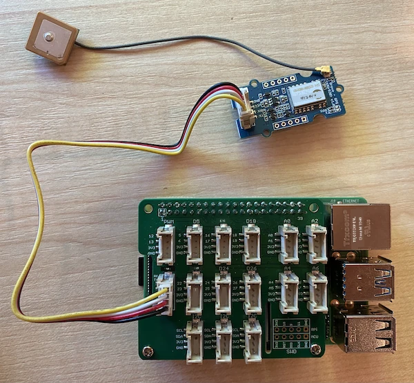

# Ler dados de GPS - Raspberry Pi

Nesta parte da lição, você adicionará um sensor GPS ao seu Raspberry Pi e lerá os valores dele.

## Hardware

O Raspberry Pi precisa de um sensor GPS.

O sensor que você usará é o [sensor Grove GPS Air530](https://www.seeedstudio.com/Grove-GPS-Air530-p-4584.html). Este sensor pode se conectar a vários sistemas GPS para obter uma localização rápida e precisa. O sensor é composto por duas partes: os componentes eletrônicos principais e uma antena externa conectada por um fio fino para captar as ondas de rádio dos satélites.

Este é um sensor UART, então ele envia dados GPS via UART.

## Conectar o sensor GPS

O sensor Grove GPS pode ser conectado ao Raspberry Pi.

### Tarefa - conectar o sensor GPS

Conecte o sensor GPS.


1. Insira uma extremidade do cabo Grove no conector do sensor GPS. Ele só encaixará de uma maneira.

1. Com o Raspberry Pi desligado, conecte a outra extremidade do cabo Grove ao conector UART marcado como **UART** no Grove Base Hat conectado ao Pi. Este conector está na fileira do meio, no lado mais próximo ao slot do cartão SD, oposto às portas USB e ao conector Ethernet.

    

1. Posicione o sensor GPS de forma que a antena conectada tenha visibilidade para o céu - idealmente próximo a uma janela aberta ou ao ar livre. É mais fácil obter um sinal claro sem obstruções na frente da antena.

## Programar o sensor GPS

Agora o Raspberry Pi pode ser programado para usar o sensor GPS conectado.

### Tarefa - programar o sensor GPS

Programe o dispositivo.

1. Ligue o Pi e aguarde o boot.

1. O sensor GPS possui 2 LEDs - um LED azul que pisca quando os dados são transmitidos e um LED verde que pisca a cada segundo ao receber dados dos satélites. Certifique-se de que o LED azul esteja piscando ao ligar o Pi. Após alguns minutos, o LED verde começará a piscar - se isso não acontecer, pode ser necessário reposicionar a antena.

1. Abra o VS Code, diretamente no Pi ou conecte-se via a extensão Remote SSH.

    > ⚠️ Você pode consultar [as instruções para configurar e abrir o VS Code na lição 1, se necessário](../../../1-getting-started/lessons/1-introduction-to-iot/pi.md).

1. Com versões mais recentes do Raspberry Pi que suportam Bluetooth, há um conflito entre a porta serial usada para Bluetooth e a usada pelo conector Grove UART. Para corrigir isso, faça o seguinte:

    1. No terminal do VS Code, edite o arquivo `/boot/config.txt` usando `nano`, um editor de texto integrado ao terminal, com o seguinte comando:

        ```sh
        sudo nano /boot/config.txt
        ```

        > Este arquivo não pode ser editado pelo VS Code, pois você precisa de permissões elevadas (`sudo`). O VS Code não executa com essas permissões.

    1. Use as teclas de navegação para ir até o final do arquivo e copie o código abaixo, colando-o no final do arquivo:

        ```ini
        dtoverlay=pi3-miniuart-bt
        dtoverlay=pi3-disable-bt
        enable_uart=1
        ```

        Você pode colar usando os atalhos normais do teclado para o seu dispositivo (`Ctrl+v` no Windows, Linux ou Raspberry Pi OS, `Cmd+v` no macOS).

    1. Salve o arquivo e saia do nano pressionando `Ctrl+x`. Pressione `y` quando perguntado se deseja salvar o buffer modificado e, em seguida, pressione `enter` para confirmar que deseja sobrescrever `/boot/config.txt`.

        > Se cometer um erro, você pode sair sem salvar e repetir os passos.

    1. Edite o arquivo `/boot/cmdline.txt` no nano com o seguinte comando:

        ```sh
        sudo nano /boot/cmdline.txt
        ```

    1. Este arquivo contém vários pares de chave/valor separados por espaços. Remova quaisquer pares de chave/valor para a chave `console`. Eles provavelmente serão semelhantes a isto:

        ```output
        console=serial0,115200 console=tty1 
        ```

        Você pode navegar até essas entradas usando as teclas de navegação e excluí-las usando as teclas `del` ou `backspace`.

        Por exemplo, se o arquivo original for assim:

        ```output
        console=serial0,115200 console=tty1 root=PARTUUID=058e2867-02 rootfstype=ext4 elevator=deadline fsck.repair=yes rootwait
        ```

        A nova versão será:

        ```output
        root=PARTUUID=058e2867-02 rootfstype=ext4 elevator=deadline fsck.repair=yes rootwait
        ```

    1. Siga os passos acima para salvar este arquivo e sair do nano.

    1. Reinicie o Pi e reconecte-se ao VS Code após o reinício.

1. No terminal, crie uma nova pasta no diretório home do usuário `pi` chamada `gps-sensor`. Crie um arquivo nesta pasta chamado `app.py`.

1. Abra esta pasta no VS Code.

1. O módulo GPS envia dados UART por uma porta serial. Instale o pacote Pip `pyserial` para se comunicar com a porta serial no seu código Python:

    ```sh
    pip3 install pyserial
    ```

1. Adicione o seguinte código ao seu arquivo `app.py`:

    ```python
    import time
    import serial
    
    serial = serial.Serial('/dev/ttyAMA0', 9600, timeout=1)
    serial.reset_input_buffer()
    serial.flush()
    
    def print_gps_data(line):
        print(line.rstrip())
    
    while True:
        line = serial.readline().decode('utf-8')
    
        while len(line) > 0:
            print_gps_data(line)
            line = serial.readline().decode('utf-8')
    
        time.sleep(1)
    ```

    Este código importa o módulo `serial` do pacote Pip `pyserial`. Em seguida, conecta-se à porta serial `/dev/ttyAMA0` - este é o endereço da porta serial que o Grove Pi Base Hat usa para sua porta UART. Ele então limpa quaisquer dados existentes dessa conexão serial.

    Em seguida, uma função chamada `print_gps_data` é definida para imprimir no console a linha passada para ela.

    Depois, o código entra em um loop infinito, lendo o máximo de linhas de texto possível da porta serial em cada iteração. Ele chama a função `print_gps_data` para cada linha.

    Após ler todos os dados, o loop aguarda 1 segundo e tenta novamente.

1. Execute este código. Você verá a saída bruta do sensor GPS, algo como o seguinte:

    ```output
    $GNGGA,020604.001,4738.538654,N,12208.341758,W,1,3,,164.7,M,-17.1,M,,*67
    $GPGSA,A,1,,,,,,,,,,,,,,,*1E
    $BDGSA,A,1,,,,,,,,,,,,,,,*0F
    $GPGSV,1,1,00*79
    $BDGSV,1,1,00*68
    ```

    > Se você receber um dos seguintes erros ao parar e reiniciar o código, adicione um bloco `try - except` ao seu loop while.

      ```output
      UnicodeDecodeError: 'utf-8' codec can't decode byte 0x93 in position 0: invalid start byte
      UnicodeDecodeError: 'utf-8' codec can't decode byte 0xf1 in position 0: invalid continuation byte
      ```

    ```python
    while True:
        try:
            line = serial.readline().decode('utf-8')
              
            while len(line) > 0:
                print_gps_data()
                line = serial.readline().decode('utf-8')
      
        # There's a random chance the first byte being read is part way through a character.
        # Read another full line and continue.

        except UnicodeDecodeError:
            line = serial.readline().decode('utf-8')

    time.sleep(1)
    ```

> 💁 Você pode encontrar este código na pasta [code-gps/pi](../../../../../3-transport/lessons/1-location-tracking/code-gps/pi).

😀 Seu programa para o sensor GPS foi um sucesso!

---

**Aviso Legal**:  
Este documento foi traduzido utilizando o serviço de tradução por IA [Co-op Translator](https://github.com/Azure/co-op-translator). Embora nos esforcemos para garantir a precisão, esteja ciente de que traduções automatizadas podem conter erros ou imprecisões. O documento original em seu idioma nativo deve ser considerado a fonte autoritativa. Para informações críticas, recomenda-se a tradução profissional realizada por humanos. Não nos responsabilizamos por quaisquer mal-entendidos ou interpretações equivocadas decorrentes do uso desta tradução.