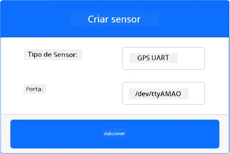
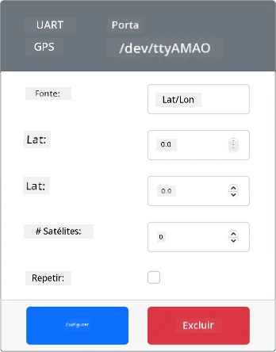
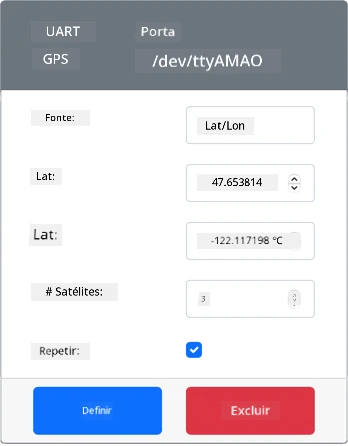
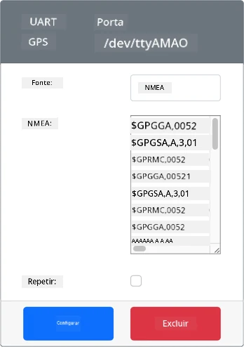
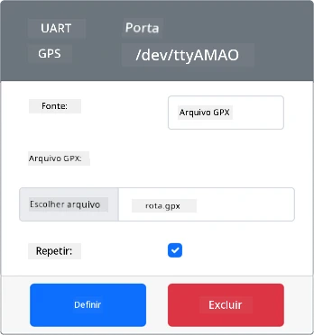

# Ler dados de GPS - Hardware Virtual IoT

Nesta parte da lição, você adicionará um sensor GPS ao seu dispositivo IoT virtual e lerá valores dele.

## Hardware Virtual

O dispositivo IoT virtual usará um sensor GPS simulado que é acessível via UART por meio de uma porta serial.

Um sensor GPS físico terá uma antena para captar ondas de rádio dos satélites GPS e converter os sinais GPS em dados GPS. A versão virtual simula isso permitindo que você defina uma latitude e longitude, envie sentenças NMEA brutas ou carregue um arquivo GPX com múltiplas localizações que podem ser retornadas sequencialmente.

> 🎓 Sentenças NMEA serão abordadas mais tarde nesta lição.

### Adicionar o sensor ao CounterFit

Para usar um sensor GPS virtual, você precisa adicionar um ao aplicativo CounterFit.

#### Tarefa - adicionar o sensor ao CounterFit

Adicione o sensor GPS ao aplicativo CounterFit.

1. Crie um novo aplicativo Python no seu computador em uma pasta chamada `gps-sensor` com um único arquivo chamado `app.py` e um ambiente virtual Python, e adicione os pacotes pip do CounterFit.

    > ⚠️ Você pode consultar [as instruções para criar e configurar um projeto Python do CounterFit na lição 1, se necessário](../../../1-getting-started/lessons/1-introduction-to-iot/virtual-device.md).

1. Instale um pacote Pip adicional para instalar um shim do CounterFit que pode se comunicar com sensores baseados em UART por meio de uma conexão serial. Certifique-se de instalar isso a partir de um terminal com o ambiente virtual ativado.

    ```sh
    pip install counterfit-shims-serial
    ```

1. Certifique-se de que o aplicativo web do CounterFit esteja em execução.

1. Crie um sensor GPS:

    1. Na caixa *Create sensor* no painel *Sensors*, abra o menu suspenso *Sensor type* e selecione *UART GPS*.

    1. Deixe o *Port* configurado como */dev/ttyAMA0*.

    1. Selecione o botão **Add** para criar o sensor GPS na porta `/dev/ttyAMA0`.

    

    O sensor GPS será criado e aparecerá na lista de sensores.

    

## Programar o sensor GPS

O dispositivo IoT virtual agora pode ser programado para usar o sensor GPS virtual.

### Tarefa - programar o sensor GPS

Programe o aplicativo do sensor GPS.

1. Certifique-se de que o aplicativo `gps-sensor` esteja aberto no VS Code.

1. Abra o arquivo `app.py`.

1. Adicione o seguinte código no início de `app.py` para conectar o aplicativo ao CounterFit:

    ```python
    from counterfit_connection import CounterFitConnection
    CounterFitConnection.init('127.0.0.1', 5000)
    ```

1. Adicione o seguinte código abaixo disso para importar algumas bibliotecas necessárias, incluindo a biblioteca para a porta serial do CounterFit:

    ```python
    import time
    import counterfit_shims_serial
    
    serial = counterfit_shims_serial.Serial('/dev/ttyAMA0')
    ```

    Este código importa o módulo `serial` do pacote Pip `counterfit_shims_serial`. Em seguida, conecta-se à porta serial `/dev/ttyAMA0` - este é o endereço da porta serial que o sensor GPS virtual usa para sua porta UART.

1. Adicione o seguinte código abaixo disso para ler da porta serial e imprimir os valores no console:

    ```python
    def print_gps_data(line):
        print(line.rstrip())
    
    while True:
        line = serial.readline().decode('utf-8')
    
        while len(line) > 0:
            print_gps_data(line)
            line = serial.readline().decode('utf-8')
    
        time.sleep(1)
    ```

    Uma função chamada `print_gps_data` é definida para imprimir no console a linha passada para ela.

    Em seguida, o código entra em um loop infinito, lendo o máximo de linhas de texto possível da porta serial em cada iteração. Ele chama a função `print_gps_data` para cada linha.

    Depois que todos os dados forem lidos, o loop dorme por 1 segundo e tenta novamente.

1. Execute este código, garantindo que você esteja usando um terminal diferente daquele em que o aplicativo CounterFit está sendo executado, para que o aplicativo CounterFit permaneça em execução.

1. No aplicativo CounterFit, altere o valor do sensor GPS. Você pode fazer isso de uma das seguintes maneiras:

    * Defina a **Source** como `Lat/Lon` e configure uma latitude, longitude e número de satélites usados para obter a localização GPS. Este valor será enviado apenas uma vez, então marque a caixa **Repeat** para que os dados sejam repetidos a cada segundo.

      

    * Defina a **Source** como `NMEA` e adicione algumas sentenças NMEA na caixa de texto. Todos esses valores serão enviados, com um atraso de 1 segundo antes de cada nova sentença GGA (fixação de posição) ser lida.

      

      Você pode usar uma ferramenta como [nmeagen.org](https://www.nmeagen.org) para gerar essas sentenças desenhando em um mapa. Esses valores serão enviados apenas uma vez, então marque a caixa **Repeat** para que os dados sejam repetidos um segundo após todos terem sido enviados.

    * Defina a **Source** como arquivo GPX e carregue um arquivo GPX com localizações de trilhas. Você pode baixar arquivos GPX de vários sites populares de mapas e trilhas, como [AllTrails](https://www.alltrails.com/). Esses arquivos contêm múltiplas localizações GPS como uma trilha, e o sensor GPS retornará cada nova localização em intervalos de 1 segundo.

      

      Esses valores serão enviados apenas uma vez, então marque a caixa **Repeat** para que os dados sejam repetidos um segundo após todos terem sido enviados.

    Depois de configurar as configurações do GPS, selecione o botão **Set** para confirmar esses valores no sensor.

1. Você verá a saída bruta do sensor GPS, algo como o seguinte:

    ```output
    $GNGGA,020604.001,4738.538654,N,12208.341758,W,1,3,,164.7,M,-17.1,M,,*67
    $GNGGA,020604.001,4738.538654,N,12208.341758,W,1,3,,164.7,M,-17.1,M,,*67
    ```

> 💁 Você pode encontrar este código na pasta [code-gps/virtual-device](../../../../../3-transport/lessons/1-location-tracking/code-gps/virtual-device).

😀 Seu programa do sensor GPS foi um sucesso!

---

**Aviso Legal**:  
Este documento foi traduzido utilizando o serviço de tradução por IA [Co-op Translator](https://github.com/Azure/co-op-translator). Embora nos esforcemos para garantir a precisão, esteja ciente de que traduções automatizadas podem conter erros ou imprecisões. O documento original em seu idioma nativo deve ser considerado a fonte autoritativa. Para informações críticas, recomenda-se a tradução profissional realizada por humanos. Não nos responsabilizamos por quaisquer mal-entendidos ou interpretações equivocadas decorrentes do uso desta tradução.