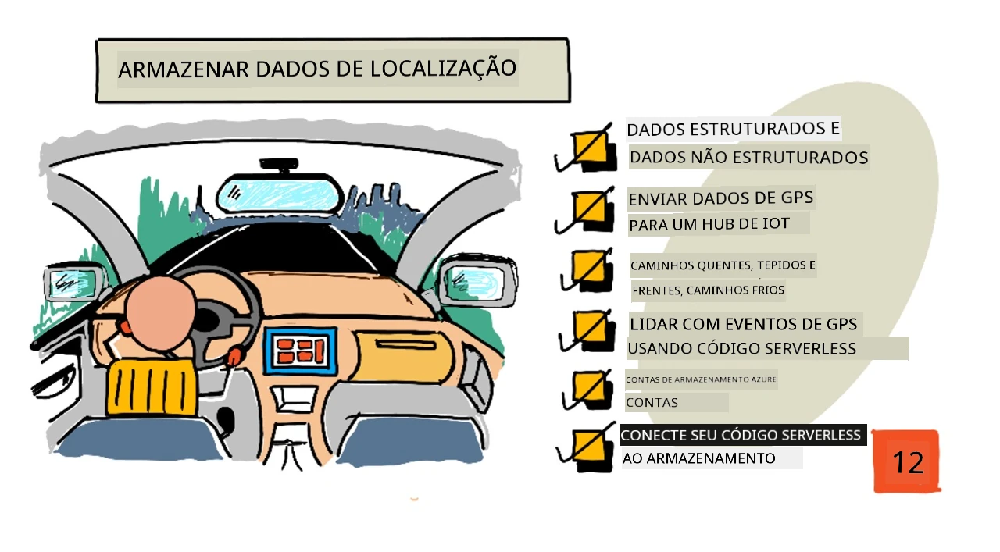
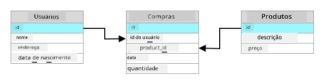
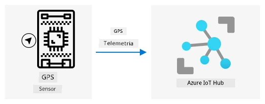
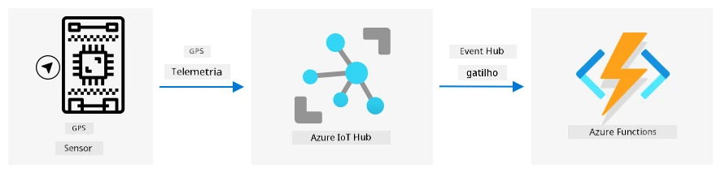
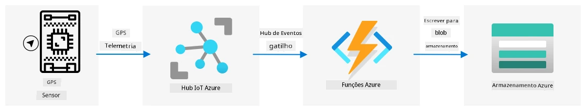

# Dados de localização da loja



> Ilustração por [Nitya Narasimhan](https://github.com/nitya). Clique na imagem para uma versão maior.

## Quiz pré-aula

[Quiz pré-aula](https://black-meadow-040d15503.1.azurestaticapps.net/quiz/23)

## Introdução

Na última lição, você aprendeu como usar um sensor GPS para capturar dados de localização. Para usar esses dados e visualizar a localização de um caminhão carregado de alimentos e sua jornada, é necessário enviá-los para um serviço de IoT na nuvem e armazená-los em algum lugar.

Nesta lição, você aprenderá sobre as diferentes formas de armazenar dados de IoT e como armazenar dados do seu serviço de IoT usando código serverless.

Nesta lição, abordaremos:

* [Dados estruturados e não estruturados](../../../../../3-transport/lessons/2-store-location-data)
* [Enviar dados de GPS para um IoT Hub](../../../../../3-transport/lessons/2-store-location-data)
* [Caminhos quente, morno e frio](../../../../../3-transport/lessons/2-store-location-data)
* [Lidar com eventos de GPS usando código serverless](../../../../../3-transport/lessons/2-store-location-data)
* [Contas de armazenamento do Azure](../../../../../3-transport/lessons/2-store-location-data)
* [Conectar seu código serverless ao armazenamento](../../../../../3-transport/lessons/2-store-location-data)

## Dados estruturados e não estruturados

Sistemas computacionais lidam com dados, e esses dados vêm em diferentes formas e tamanhos. Eles podem variar de números únicos a grandes quantidades de texto, vídeos, imagens e dados de IoT. Os dados geralmente podem ser divididos em duas categorias: *dados estruturados* e *dados não estruturados*.

* **Dados estruturados** são dados com uma estrutura bem definida e rígida que não muda, geralmente mapeados para tabelas de dados com relacionamentos. Um exemplo é os detalhes de uma pessoa, incluindo seu nome, data de nascimento e endereço.

* **Dados não estruturados** são dados sem uma estrutura bem definida e rígida, incluindo dados que podem mudar de estrutura frequentemente. Um exemplo são documentos como textos escritos ou planilhas.

✅ Faça uma pesquisa: Você consegue pensar em outros exemplos de dados estruturados e não estruturados?

> 💁 Também existem dados semi-estruturados que possuem estrutura, mas não se encaixam em tabelas fixas de dados.

Dados de IoT geralmente são considerados dados não estruturados.

Imagine que você está adicionando dispositivos IoT a uma frota de veículos de uma grande fazenda comercial. Você pode querer usar dispositivos diferentes para diferentes tipos de veículos. Por exemplo:

* Para veículos agrícolas como tratores, você quer dados de GPS para garantir que eles estão trabalhando nos campos corretos.
* Para caminhões de entrega transportando alimentos para armazéns, você quer dados de GPS, bem como dados de velocidade e aceleração para garantir que o motorista está dirigindo com segurança, além de identidade do motorista e dados de início/parada para garantir conformidade com as leis locais sobre horas de trabalho.
* Para caminhões refrigerados, você também quer dados de temperatura para garantir que os alimentos não fiquem muito quentes ou frios e estraguem durante o transporte.

Esses dados podem mudar constantemente. Por exemplo, se o dispositivo IoT estiver na cabine de um caminhão, os dados enviados podem mudar conforme o trailer muda, enviando dados de temperatura apenas quando um trailer refrigerado estiver sendo usado.

✅ Que outros dados de IoT poderiam ser capturados? Pense nos tipos de cargas que os caminhões podem transportar, bem como dados de manutenção.

Esses dados variam de veículo para veículo, mas todos são enviados para o mesmo serviço de IoT para processamento. O serviço de IoT precisa ser capaz de processar esses dados não estruturados, armazenando-os de uma forma que permita que sejam pesquisados ou analisados, mas que funcione com diferentes estruturas desses dados.

### Armazenamento SQL vs NoSQL

Bancos de dados são serviços que permitem armazenar e consultar dados. Eles vêm em dois tipos: SQL e NoSQL.

#### Bancos de dados SQL

Os primeiros bancos de dados eram Sistemas de Gerenciamento de Banco de Dados Relacional (RDBMS), ou banco de dados relacional. Eles também são conhecidos como bancos de dados SQL devido à Linguagem de Consulta Estruturada (SQL) usada para interagir com eles para adicionar, remover, atualizar ou consultar dados. Esses bancos de dados consistem em um esquema - um conjunto bem definido de tabelas de dados, semelhante a uma planilha. Cada tabela tem várias colunas nomeadas. Quando você insere dados, adiciona uma linha à tabela, colocando valores em cada uma das colunas. Isso mantém os dados em uma estrutura muito rígida - embora você possa deixar colunas vazias, se quiser adicionar uma nova coluna, terá que fazer isso no banco de dados, populando valores para as linhas existentes. Esses bancos de dados são relacionais - ou seja, uma tabela pode ter um relacionamento com outra.



Por exemplo, se você armazenar os detalhes pessoais de um usuário em uma tabela, terá algum tipo de ID único interno por usuário que é usado em uma linha em uma tabela que contém o nome e endereço do usuário. Se você quiser armazenar outros detalhes sobre esse usuário, como suas compras, em outra tabela, terá uma coluna na nova tabela para o ID desse usuário. Quando você procura um usuário, pode usar seu ID para obter seus detalhes pessoais de uma tabela e suas compras de outra.

Bancos de dados SQL são ideais para armazenar dados estruturados e para quando você quer garantir que os dados correspondam ao seu esquema.

✅ Se você nunca usou SQL antes, reserve um momento para ler sobre ele na [página de SQL na Wikipedia](https://wikipedia.org/wiki/SQL).

Alguns bancos de dados SQL conhecidos são Microsoft SQL Server, MySQL e PostgreSQL.

✅ Faça uma pesquisa: Leia sobre alguns desses bancos de dados SQL e suas capacidades.

#### Bancos de dados NoSQL

Bancos de dados NoSQL são chamados assim porque não possuem a mesma estrutura rígida dos bancos de dados SQL. Eles também são conhecidos como bancos de dados de documentos, pois podem armazenar dados não estruturados, como documentos.

> 💁 Apesar do nome, alguns bancos de dados NoSQL permitem usar SQL para consultar os dados.


Bancos de dados NoSQL não possuem um esquema pré-definido que limite como os dados são armazenados; em vez disso, você pode inserir qualquer dado não estruturado, geralmente usando documentos JSON. Esses documentos podem ser organizados em pastas, semelhante a arquivos no seu computador. Cada documento pode ter campos diferentes de outros documentos - por exemplo, se você estivesse armazenando dados de IoT de seus veículos agrícolas, alguns poderiam ter campos para dados de acelerômetro e velocidade, enquanto outros poderiam ter campos para a temperatura no trailer. Se você adicionasse um novo tipo de caminhão, como um com balanças integradas para rastrear o peso dos produtos transportados, então seu dispositivo IoT poderia adicionar esse novo campo e ele poderia ser armazenado sem alterações no banco de dados.

Alguns bancos de dados NoSQL conhecidos incluem Azure CosmosDB, MongoDB e CouchDB.

✅ Faça uma pesquisa: Leia sobre alguns desses bancos de dados NoSQL e suas capacidades.

Nesta lição, você usará armazenamento NoSQL para armazenar dados de IoT.

## Enviar dados de GPS para um IoT Hub

Na última lição, você capturou dados de GPS de um sensor GPS conectado ao seu dispositivo IoT. Para armazenar esses dados de IoT na nuvem, você precisa enviá-los para um serviço de IoT. Mais uma vez, você usará o Azure IoT Hub, o mesmo serviço de IoT na nuvem que utilizou no projeto anterior.



### Tarefa - enviar dados de GPS para um IoT Hub

1. Crie um novo IoT Hub usando o plano gratuito.

    > ⚠️ Você pode consultar as [instruções para criar um IoT Hub do projeto 2, lição 4](../../../2-farm/lessons/4-migrate-your-plant-to-the-cloud/README.md#create-an-iot-service-in-the-cloud) se necessário.

    Lembre-se de criar um novo Grupo de Recursos. Nomeie o novo Grupo de Recursos como `gps-sensor` e o novo IoT Hub com um nome único baseado em `gps-sensor`, como `gps-sensor-<seu nome>`.

    > 💁 Se você ainda tiver seu IoT Hub do projeto anterior, pode reutilizá-lo. Lembre-se de usar o nome desse IoT Hub e o Grupo de Recursos em que ele está ao criar outros serviços.

1. Adicione um novo dispositivo ao IoT Hub. Chame este dispositivo de `gps-sensor`. Pegue a string de conexão do dispositivo.

1. Atualize o código do seu dispositivo para enviar os dados de GPS para o novo IoT Hub usando a string de conexão do dispositivo obtida na etapa anterior.

    > ⚠️ Você pode consultar as [instruções para conectar seu dispositivo ao IoT do projeto 2, lição 4](../../../2-farm/lessons/4-migrate-your-plant-to-the-cloud/README.md#connect-your-device-to-the-iot-service) se necessário.

1. Ao enviar os dados de GPS, faça isso em formato JSON no seguinte formato:

    ```json
    {
        "gps" :
        {
            "lat" : <latitude>,
            "lon" : <longitude>
        }
    }
    ```

1. Envie dados de GPS a cada minuto para não ultrapassar sua cota diária de mensagens.

Se você estiver usando o Wio Terminal, lembre-se de adicionar todas as bibliotecas necessárias e configurar o horário usando um servidor NTP. Seu código também precisará garantir que leu todos os dados da porta serial antes de enviar a localização GPS, usando o código existente da última lição. Use o seguinte código para construir o documento JSON:

```cpp
DynamicJsonDocument doc(1024);
doc["gps"]["lat"] = gps.location.lat();
doc["gps"]["lon"] = gps.location.lng();
```

Se você estiver usando um dispositivo IoT virtual, lembre-se de instalar todas as bibliotecas necessárias usando um ambiente virtual.

Para o Raspberry Pi e o dispositivo IoT virtual, use o código existente da última lição para obter os valores de latitude e longitude e envie-os no formato JSON correto com o seguinte código:

```python
message_json = { "gps" : { "lat":lat, "lon":lon } }
print("Sending telemetry", message_json)
message = Message(json.dumps(message_json))
```

> 💁 Você pode encontrar este código nas pastas [code/wio-terminal](../../../../../3-transport/lessons/2-store-location-data/code/wio-terminal), [code/pi](../../../../../3-transport/lessons/2-store-location-data/code/pi) ou [code/virtual-device](../../../../../3-transport/lessons/2-store-location-data/code/virtual-device).

Execute o código do seu dispositivo e certifique-se de que as mensagens estão fluindo para o IoT Hub usando o comando CLI `az iot hub monitor-events`.

## Caminhos quente, morno e frio

Os dados que fluem de um dispositivo IoT para a nuvem nem sempre são processados em tempo real. Alguns dados precisam de processamento em tempo real, outros podem ser processados um pouco depois, e outros podem ser processados muito mais tarde. O fluxo de dados para diferentes serviços que processam os dados em diferentes momentos é referido como caminhos quente, morno e frio.

### Caminho quente

O caminho quente refere-se aos dados que precisam ser processados em tempo real ou quase em tempo real. Você usaria dados do caminho quente para alertas, como receber notificações de que um veículo está se aproximando de um depósito ou que a temperatura em um caminhão refrigerado está muito alta.

Para usar dados do caminho quente, seu código responderia a eventos assim que fossem recebidos pelos serviços na nuvem.

### Caminho morno

O caminho morno refere-se aos dados que podem ser processados pouco tempo depois de serem recebidos, por exemplo, para relatórios ou análises de curto prazo. Você usaria dados do caminho morno para relatórios diários sobre a quilometragem dos veículos, usando dados coletados no dia anterior.

Os dados do caminho morno são armazenados assim que são recebidos pelo serviço na nuvem em algum tipo de armazenamento que pode ser acessado rapidamente.

### Caminho frio

O caminho frio refere-se aos dados históricos, armazenando dados a longo prazo para serem processados sempre que necessário. Por exemplo, você poderia usar o caminho frio para obter relatórios anuais de quilometragem dos veículos ou executar análises de rotas para encontrar a rota mais eficiente para reduzir custos de combustível.

Os dados do caminho frio são armazenados em data warehouses - bancos de dados projetados para armazenar grandes quantidades de dados que nunca mudam e podem ser consultados de forma rápida e fácil. Normalmente, você teria um trabalho regular em sua aplicação na nuvem que seria executado em um horário regular a cada dia, semana ou mês para mover dados do armazenamento do caminho morno para o data warehouse.

✅ Pense nos dados que você capturou até agora nessas lições. Eles são dados de caminho quente, morno ou frio?

## Lidar com eventos de GPS usando código serverless

Uma vez que os dados estão fluindo para o seu IoT Hub, você pode escrever algum código serverless para escutar eventos publicados no endpoint compatível com Event-Hub. Este é o caminho morno - esses dados serão armazenados e usados na próxima lição para relatórios sobre a jornada.



### Tarefa - lidar com eventos de GPS usando código serverless

1. Crie um aplicativo Azure Functions usando o CLI do Azure Functions. Use o runtime Python e crie-o em uma pasta chamada `gps-trigger`, usando o mesmo nome para o projeto do aplicativo Functions. Certifique-se de criar um ambiente virtual para isso.
> ⚠️ Você pode consultar as [instruções para criar um Projeto de Funções do Azure do projeto 2, lição 5](../../../2-farm/lessons/5-migrate-application-to-the-cloud/README.md#create-a-serverless-application) se necessário.
1. Adicione um gatilho de evento do IoT Hub que utilize o endpoint compatível com Event Hub do IoT Hub.

    > ⚠️ Você pode consultar as [instruções para criar um gatilho de evento do IoT Hub no projeto 2, lição 5](../../../2-farm/lessons/5-migrate-application-to-the-cloud/README.md#create-an-iot-hub-event-trigger) se necessário.

1. Configure a string de conexão do endpoint compatível com Event Hub no arquivo `local.settings.json` e use a chave dessa entrada no arquivo `function.json`.

1. Use o aplicativo Azurite como um emulador de armazenamento local.

1. Execute seu aplicativo de funções para garantir que ele está recebendo eventos do seu dispositivo GPS. Certifique-se de que seu dispositivo IoT também está funcionando e enviando dados de GPS.

    ```output
    Python EventHub trigger processed an event: {"gps": {"lat": 47.73481, "lon": -122.25701}}
    ```

## Contas de Armazenamento do Azure


As Contas de Armazenamento do Azure são um serviço de armazenamento de propósito geral que pode armazenar dados de várias formas diferentes. Você pode armazenar dados como blobs, em filas, em tabelas ou como arquivos, tudo ao mesmo tempo.

### Armazenamento de Blobs

A palavra *Blob* significa objetos binários grandes, mas tornou-se o termo para qualquer dado não estruturado. Você pode armazenar qualquer dado no armazenamento de blobs, desde documentos JSON contendo dados de IoT até arquivos de imagem e vídeo. O armazenamento de blobs possui o conceito de *containers*, que são "baldes" nomeados onde você pode armazenar dados, semelhante a tabelas em um banco de dados relacional. Esses containers podem ter uma ou mais pastas para armazenar blobs, e cada pasta pode conter outras pastas, semelhante à forma como arquivos são armazenados no disco rígido do seu computador.

Você usará o armazenamento de blobs nesta lição para armazenar dados de IoT.

✅ Faça uma pesquisa: Leia sobre o [Armazenamento de Blobs do Azure](https://docs.microsoft.com/azure/storage/blobs/storage-blobs-overview?WT.mc_id=academic-17441-jabenn)

### Armazenamento de Tabelas

O armazenamento de tabelas permite armazenar dados semi-estruturados. O armazenamento de tabelas é, na verdade, um banco de dados NoSQL, então não requer um conjunto definido de tabelas previamente, mas é projetado para armazenar dados em uma ou mais tabelas, com chaves únicas para definir cada linha.

✅ Faça uma pesquisa: Leia sobre o [Armazenamento de Tabelas do Azure](https://docs.microsoft.com/azure/storage/tables/table-storage-overview?WT.mc_id=academic-17441-jabenn)

### Armazenamento de Filas

O armazenamento de filas permite armazenar mensagens de até 64KB em uma fila. Você pode adicionar mensagens ao final da fila e lê-las do início. As filas armazenam mensagens indefinidamente enquanto houver espaço de armazenamento disponível, permitindo que as mensagens sejam armazenadas a longo prazo e lidas quando necessário. Por exemplo, se você quiser executar um trabalho mensal para processar dados de GPS, poderia adicionar mensagens à fila diariamente durante um mês e, no final do mês, processar todas as mensagens da fila.

✅ Faça uma pesquisa: Leia sobre o [Armazenamento de Filas do Azure](https://docs.microsoft.com/azure/storage/queues/storage-queues-introduction?WT.mc_id=academic-17441-jabenn)

### Armazenamento de Arquivos

O armazenamento de arquivos é o armazenamento de arquivos na nuvem, e qualquer aplicativo ou dispositivo pode se conectar usando protocolos padrão da indústria. Você pode gravar arquivos no armazenamento de arquivos e montá-lo como uma unidade no seu PC ou Mac.

✅ Faça uma pesquisa: Leia sobre o [Armazenamento de Arquivos do Azure](https://docs.microsoft.com/azure/storage/files/storage-files-introduction?WT.mc_id=academic-17441-jabenn)

## Conecte seu código serverless ao armazenamento

Seu aplicativo de funções agora precisa se conectar ao armazenamento de blobs para armazenar as mensagens do IoT Hub. Há duas maneiras de fazer isso:

* Dentro do código da função, conecte-se ao armazenamento de blobs usando o SDK de armazenamento do Azure para Python e grave os dados como blobs.
* Use um binding de saída da função para vincular o valor de retorno da função ao armazenamento de blobs e salvar o blob automaticamente.

Nesta lição, você usará o SDK do Python para ver como interagir com o armazenamento de blobs.



Os dados serão salvos como um blob JSON com o seguinte formato:

```json
{
    "device_id": <device_id>,
    "timestamp" : <time>,
    "gps" :
    {
        "lat" : <latitude>,
        "lon" : <longitude>
    }
}
```

### Tarefa - conectar seu código serverless ao armazenamento

1. Crie uma conta de armazenamento do Azure. Nomeie-a algo como `gps<seu_nome>`.

    > ⚠️ Você pode consultar as [instruções para criar uma conta de armazenamento no projeto 2, lição 5](../../../2-farm/lessons/5-migrate-application-to-the-cloud/README.md#task---create-the-cloud-resources) se necessário.

    Se você ainda tiver uma conta de armazenamento do projeto anterior, pode reutilizá-la.

    > 💁 Você poderá usar a mesma conta de armazenamento para implantar seu aplicativo Azure Functions mais tarde nesta lição.

1. Execute o seguinte comando para obter a string de conexão da conta de armazenamento:

    ```sh
    az storage account show-connection-string --output table \
                                              --name <storage_name>
    ```

    Substitua `<storage_name>` pelo nome da conta de armazenamento que você criou na etapa anterior.

1. Adicione uma nova entrada ao arquivo `local.settings.json` para a string de conexão da conta de armazenamento, usando o valor da etapa anterior. Nomeie-a como `STORAGE_CONNECTION_STRING`.

1. Adicione o seguinte ao arquivo `requirements.txt` para instalar os pacotes Pip de armazenamento do Azure:

    ```sh
    azure-storage-blob
    ```

    Instale os pacotes deste arquivo no seu ambiente virtual.

    > Se você receber um erro, atualize sua versão do Pip no ambiente virtual para a versão mais recente com o seguinte comando e tente novamente:
    >
    > ```sh
    > pip install --upgrade pip
    > ```

1. No arquivo `__init__.py` para o `iot-hub-trigger`, adicione as seguintes declarações de importação:

    ```python
    import json
    import os
    import uuid
    from azure.storage.blob import BlobServiceClient, PublicAccess
    ```

    O módulo do sistema `json` será usado para ler e gravar JSON, o módulo do sistema `os` será usado para ler a string de conexão, e o módulo do sistema `uuid` será usado para gerar um ID único para a leitura do GPS.

    O pacote `azure.storage.blob` contém o SDK do Python para trabalhar com armazenamento de blobs.

1. Antes do método `main`, adicione a seguinte função auxiliar:

    ```python
    def get_or_create_container(name):
        connection_str = os.environ['STORAGE_CONNECTION_STRING']
        blob_service_client = BlobServiceClient.from_connection_string(connection_str)
    
        for container in blob_service_client.list_containers():
            if container.name == name:
                return blob_service_client.get_container_client(container.name)
        
        return blob_service_client.create_container(name, public_access=PublicAccess.Container)
    ```

    O SDK de blobs do Python não possui um método auxiliar para criar um container caso ele não exista. Este código carregará a string de conexão do arquivo `local.settings.json` (ou das Configurações do Aplicativo, uma vez implantado na nuvem), e criará uma classe `BlobServiceClient` a partir disso para interagir com a conta de armazenamento de blobs. Ele então percorre todos os containers da conta de armazenamento de blobs, procurando por um com o nome fornecido - se encontrar, retornará uma classe `ContainerClient` que pode interagir com o container para criar blobs. Se não encontrar, o container será criado e o cliente para o novo container será retornado.

    Quando o novo container é criado, o acesso público é concedido para consultar os blobs no container. Isso será usado na próxima lição para visualizar os dados de GPS em um mapa.

1. Diferentemente do sensor de umidade do solo, com este código queremos armazenar todos os eventos, então adicione o seguinte código dentro do loop `for event in events:` na função `main`, abaixo da declaração `logging`:

    ```python
    device_id = event.iothub_metadata['connection-device-id']
    blob_name = f'{device_id}/{str(uuid.uuid1())}.json'
    ```

    Este código obtém o ID do dispositivo a partir dos metadados do evento e o utiliza para criar um nome de blob. Os blobs podem ser armazenados em pastas, e o ID do dispositivo será usado como o nome da pasta, para que cada dispositivo tenha todos os seus eventos de GPS em uma pasta. O nome do blob é essa pasta, seguido por um nome de documento, separados por barras, semelhante a caminhos no Linux e macOS (semelhante ao Windows também, mas o Windows usa barras invertidas). O nome do documento é um ID único gerado usando o módulo `uuid` do Python, com o tipo de arquivo `json`.

    Por exemplo, para o ID do dispositivo `gps-sensor`, o nome do blob pode ser `gps-sensor/a9487ac2-b9cf-11eb-b5cd-1e00621e3648.json`.

1. Adicione o seguinte código abaixo disso:

    ```python
    container_client = get_or_create_container('gps-data')
    blob = container_client.get_blob_client(blob_name)
    ```

    Este código obtém o cliente do container usando a classe auxiliar `get_or_create_container`, e então obtém um objeto cliente de blob usando o nome do blob. Esses clientes de blob podem se referir a blobs existentes ou, como neste caso, a novos blobs.

1. Adicione o seguinte código depois disso:

    ```python
    event_body = json.loads(event.get_body().decode('utf-8'))
    blob_body = {
        'device_id' : device_id,
        'timestamp' : event.iothub_metadata['enqueuedtime'],
        'gps': event_body['gps']
    }
    ```

    Isso constrói o corpo do blob que será gravado no armazenamento de blobs. É um documento JSON contendo o ID do dispositivo, o horário em que a telemetria foi enviada ao IoT Hub e as coordenadas GPS da telemetria.

    > 💁 É importante usar o horário de enfileiramento da mensagem em vez do horário atual para obter o momento em que a mensagem foi enviada. Ela pode estar no hub por um tempo antes de ser capturada, caso o aplicativo Functions não esteja em execução.

1. Adicione o seguinte abaixo deste código:

    ```python
    logging.info(f'Writing blob to {blob_name} - {blob_body}')
    blob.upload_blob(json.dumps(blob_body).encode('utf-8'))
    ```

    Este código registra que um blob está prestes a ser gravado com seus detalhes e, em seguida, faz o upload do corpo do blob como o conteúdo do novo blob.

1. Execute o aplicativo Functions. Você verá blobs sendo gravados para todos os eventos de GPS na saída:

    ```output
    [2021-05-21T01:31:14.325Z] Python EventHub trigger processed an event: {"gps": {"lat": 47.73092, "lon": -122.26206}}
    ...
    [2021-05-21T01:31:14.351Z] Writing blob to gps-sensor/4b6089fe-ba8d-11eb-bc7b-1e00621e3648.json - {'device_id': 'gps-sensor', 'timestamp': '2021-05-21T00:57:53.878Z', 'gps': {'lat': 47.73092, 'lon': -122.26206}}
    ```

    > 💁 Certifique-se de que você não está executando o monitor de eventos do IoT Hub ao mesmo tempo.

> 💁 Você pode encontrar este código na pasta [code/functions](../../../../../3-transport/lessons/2-store-location-data/code/functions).

### Tarefa - verificar os blobs enviados

1. Para visualizar os blobs criados, você pode usar o [Azure Storage Explorer](https://azure.microsoft.com/features/storage-explorer/?WT.mc_id=academic-17441-jabenn), uma ferramenta gratuita que permite visualizar e gerenciar suas contas de armazenamento, ou usar o CLI.

    1. Para usar o CLI, primeiro você precisará de uma chave da conta. Execute o seguinte comando para obter essa chave:

        ```sh
        az storage account keys list --output table \
                                     --account-name <storage_name>
        ```

        Substitua `<storage_name>` pelo nome da conta de armazenamento.

        Copie o valor de `key1`.

    1. Execute o seguinte comando para listar os blobs no container:

        ```sh
        az storage blob list --container-name gps-data \
                             --output table \
                             --account-name <storage_name> \
                             --account-key <key1>
        ```

        Substitua `<storage_name>` pelo nome da conta de armazenamento e `<key1>` pelo valor de `key1` que você copiou na etapa anterior.

        Isso listará todos os blobs no container:

        ```output
        Name                                                  Blob Type    Blob Tier    Length    Content Type              Last Modified              Snapshot
        ----------------------------------------------------  -----------  -----------  --------  ------------------------  -------------------------  ----------
        gps-sensor/1810d55e-b9cf-11eb-9f5b-1e00621e3648.json  BlockBlob    Hot          45        application/octet-stream  2021-05-21T00:54:27+00:00
        gps-sensor/18293e46-b9cf-11eb-9f5b-1e00621e3648.json  BlockBlob    Hot          45        application/octet-stream  2021-05-21T00:54:28+00:00
        gps-sensor/1844549c-b9cf-11eb-9f5b-1e00621e3648.json  BlockBlob    Hot          45        application/octet-stream  2021-05-21T00:54:28+00:00
        gps-sensor/1894d714-b9cf-11eb-9f5b-1e00621e3648.json  BlockBlob    Hot          45        application/octet-stream  2021-05-21T00:54:28+00:00
        ```

    1. Baixe um dos blobs usando o seguinte comando:

        ```sh
        az storage blob download --container-name gps-data \
                                 --account-name <storage_name> \
                                 --account-key <key1> \
                                 --name <blob_name> \
                                 --file <file_name>
        ```

        Substitua `<storage_name>` pelo nome da conta de armazenamento e `<key1>` pelo valor de `key1` que você copiou na etapa anterior.

        Substitua `<blob_name>` pelo nome completo da coluna `Name` da saída da etapa anterior, incluindo o nome da pasta. Substitua `<file_name>` pelo nome de um arquivo local para salvar o blob.

    Depois de baixado, você pode abrir o arquivo JSON no VS Code e verá o blob contendo os detalhes da localização GPS:

    ```json
    {"device_id": "gps-sensor", "timestamp": "2021-05-21T00:57:53.878Z", "gps": {"lat": 47.73092, "lon": -122.26206}}
    ```

### Tarefa - implantar seu aplicativo Functions na nuvem

Agora que seu aplicativo Functions está funcionando, você pode implantá-lo na nuvem.

1. Crie um novo aplicativo Azure Functions, usando a conta de armazenamento que você criou anteriormente. Nomeie-o como algo como `gps-sensor-` e adicione um identificador único no final, como algumas palavras aleatórias ou seu nome.

    > ⚠️ Você pode consultar as [instruções para criar um aplicativo Functions no projeto 2, lição 5](../../../2-farm/lessons/5-migrate-application-to-the-cloud/README.md#task---create-the-cloud-resources) se necessário.

1. Faça o upload dos valores `IOT_HUB_CONNECTION_STRING` e `STORAGE_CONNECTION_STRING` para as Configurações do Aplicativo.

    > ⚠️ Você pode consultar as [instruções para fazer o upload das Configurações do Aplicativo no projeto 2, lição 5](../../../2-farm/lessons/5-migrate-application-to-the-cloud/README.md#task---upload-your-application-settings) se necessário.

1. Implemente seu aplicativo Functions local na nuvem.
⚠️ Você pode consultar as [instruções para implantar seu aplicativo de Functions do projeto 2, lição 5](../../../2-farm/lessons/5-migrate-application-to-the-cloud/README.md#task---deploy-your-functions-app-to-the-cloud) se necessário.
---

## 🚀 Desafio

Os dados de GPS não são perfeitamente precisos, e as localizações detectadas podem estar deslocadas por alguns metros, ou até mais, especialmente em túneis e áreas com prédios altos.

Pense em como a navegação por satélite poderia superar isso. Quais dados o seu sistema de navegação possui que poderiam permitir melhores previsões sobre sua localização?

## Questionário pós-aula

[Questionário pós-aula](https://black-meadow-040d15503.1.azurestaticapps.net/quiz/24)

## Revisão e Autoestudo

* Leia sobre dados estruturados na [página de Modelo de Dados na Wikipedia](https://wikipedia.org/wiki/Data_model)
* Leia sobre dados semiestruturados na [página de Dados Semiestruturados na Wikipedia](https://wikipedia.org/wiki/Semi-structured_data)
* Leia sobre dados não estruturados na [página de Dados Não Estruturados na Wikipedia](https://wikipedia.org/wiki/Unstructured_data)
* Leia mais sobre o Azure Storage e os diferentes tipos de armazenamento na [documentação do Azure Storage](https://docs.microsoft.com/azure/storage/?WT.mc_id=academic-17441-jabenn)

## Tarefa

[Investigue os bindings de função](assignment.md)

---

**Aviso Legal**:  
Este documento foi traduzido utilizando o serviço de tradução por IA [Co-op Translator](https://github.com/Azure/co-op-translator). Embora nos esforcemos para garantir a precisão, esteja ciente de que traduções automatizadas podem conter erros ou imprecisões. O documento original em seu idioma nativo deve ser considerado a fonte autoritativa. Para informações críticas, recomenda-se a tradução profissional realizada por humanos. Não nos responsabilizamos por quaisquer mal-entendidos ou interpretações equivocadas decorrentes do uso desta tradução.