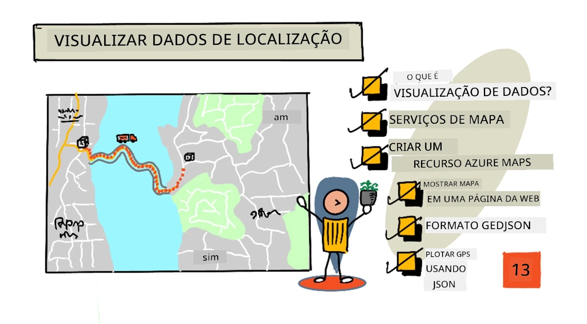
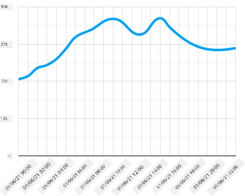
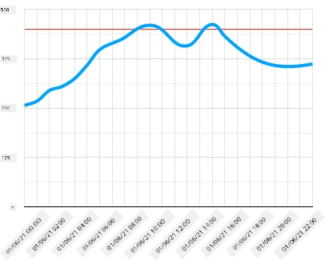
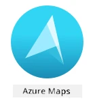
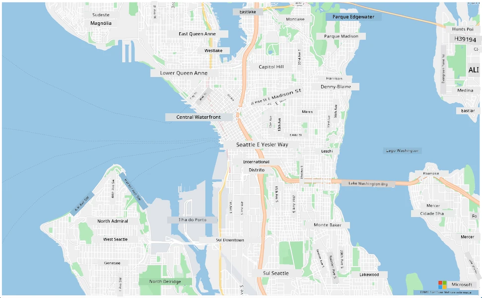
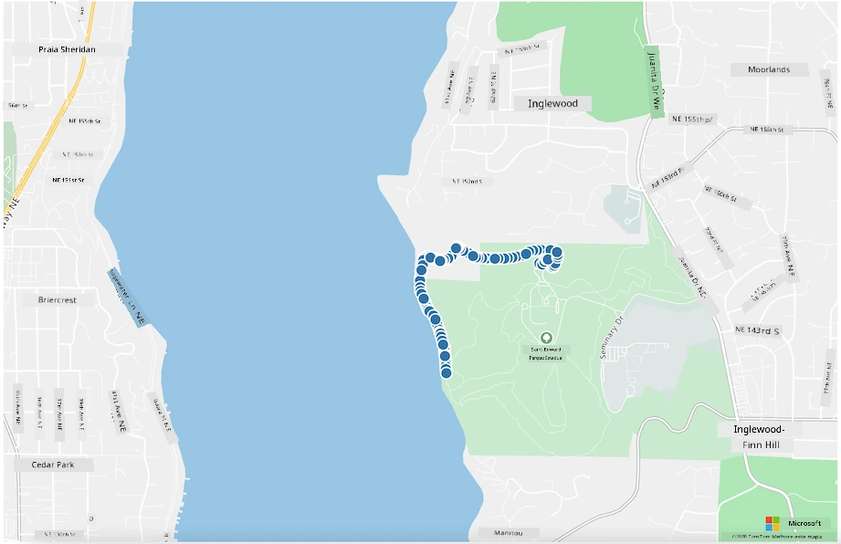

# Visualizar dados de localização



> Ilustração por [Nitya Narasimhan](https://github.com/nitya). Clique na imagem para uma versão maior.

Este vídeo oferece uma visão geral do Azure Maps com IoT, um serviço que será abordado nesta lição.

[](https://www.youtube.com/watch?v=P5i2GFTtb2s)

> 🎥 Clique na imagem acima para assistir ao vídeo

## Quiz pré-aula

[Quiz pré-aula](https://black-meadow-040d15503.1.azurestaticapps.net/quiz/25)

## Introdução

Na última lição, você aprendeu como obter dados de GPS dos seus sensores e salvá-los na nuvem em um contêiner de armazenamento usando código sem servidor. Agora você descobrirá como visualizar esses pontos em um mapa do Azure. Você aprenderá como criar um mapa em uma página da web, conhecerá o formato de dados GeoJSON e como usá-lo para plotar todos os pontos de GPS capturados no seu mapa.

Nesta lição, abordaremos:

* [O que é visualização de dados](../../../../../3-transport/lessons/3-visualize-location-data)
* [Serviços de mapas](../../../../../3-transport/lessons/3-visualize-location-data)
* [Criar um recurso do Azure Maps](../../../../../3-transport/lessons/3-visualize-location-data)
* [Exibir um mapa em uma página da web](../../../../../3-transport/lessons/3-visualize-location-data)
* [O formato GeoJSON](../../../../../3-transport/lessons/3-visualize-location-data)
* [Plotar dados de GPS em um mapa usando GeoJSON](../../../../../3-transport/lessons/3-visualize-location-data)

> 💁 Esta lição envolverá uma pequena quantidade de HTML e JavaScript. Se você quiser aprender mais sobre desenvolvimento web usando HTML e JavaScript, confira [Desenvolvimento Web para Iniciantes](https://github.com/microsoft/Web-Dev-For-Beginners).

## O que é visualização de dados

Visualização de dados, como o nome sugere, trata de representar dados de maneiras que os tornem mais fáceis de entender para os humanos. Geralmente está associada a gráficos e tabelas, mas é qualquer forma de representar dados visualmente para ajudar os humanos a não apenas entenderem melhor os dados, mas também tomarem decisões.

Tomando um exemplo simples - no projeto da fazenda, você capturou leituras de umidade do solo. Uma tabela de dados de umidade do solo capturados a cada hora no dia 1º de junho de 2021 pode ser algo como o seguinte:

| Data             | Leitura |
| ---------------- | ------: |
| 01/06/2021 00:00 |     257 |
| 01/06/2021 01:00 |     268 |
| 01/06/2021 02:00 |     295 |
| 01/06/2021 03:00 |     305 |
| 01/06/2021 04:00 |     325 |
| 01/06/2021 05:00 |     359 |
| 01/06/2021 06:00 |     398 |
| 01/06/2021 07:00 |     410 |
| 01/06/2021 08:00 |     429 |
| 01/06/2021 09:00 |     451 |
| 01/06/2021 10:00 |     460 |
| 01/06/2021 11:00 |     452 |
| 01/06/2021 12:00 |     420 |
| 01/06/2021 13:00 |     408 |
| 01/06/2021 14:00 |     431 |
| 01/06/2021 15:00 |     462 |
| 01/06/2021 16:00 |     432 |
| 01/06/2021 17:00 |     402 |
| 01/06/2021 18:00 |     387 |
| 01/06/2021 19:00 |     360 |
| 01/06/2021 20:00 |     358 |
| 01/06/2021 21:00 |     354 |
| 01/06/2021 22:00 |     356 |
| 01/06/2021 23:00 |     362 |

Para um humano, entender esses dados pode ser difícil. É uma parede de números sem significado. Como primeiro passo para visualizar esses dados, eles podem ser plotados em um gráfico de linha:



Isso pode ser ainda mais aprimorado adicionando uma linha para indicar quando o sistema de irrigação automatizado foi ativado em uma leitura de umidade do solo de 450:



Este gráfico mostra rapidamente não apenas quais eram os níveis de umidade do solo, mas os pontos onde o sistema de irrigação foi ativado.

Gráficos não são a única ferramenta para visualizar dados. Dispositivos IoT que monitoram o clima podem ter aplicativos web ou móveis que visualizam as condições climáticas usando símbolos, como um símbolo de nuvem para dias nublados, uma nuvem de chuva para dias chuvosos e assim por diante. Existem inúmeras maneiras de visualizar dados, algumas sérias, outras divertidas.

✅ Pense em maneiras que você já viu dados visualizados. Quais métodos foram os mais claros e permitiram que você tomasse decisões mais rapidamente?

As melhores visualizações permitem que os humanos tomem decisões rapidamente. Por exemplo, ter uma parede de medidores mostrando todos os tipos de leituras de máquinas industriais é difícil de processar, mas uma luz vermelha piscando quando algo dá errado permite que um humano tome uma decisão. Às vezes, a melhor visualização é uma luz piscando!

Ao trabalhar com dados de GPS, a visualização mais clara pode ser plotar os dados em um mapa. Um mapa mostrando caminhões de entrega, por exemplo, pode ajudar os trabalhadores de uma planta de processamento a ver quando os caminhões chegarão. Se este mapa mostrar mais do que apenas imagens de caminhões em suas localizações atuais, mas também fornecer uma ideia do conteúdo de um caminhão, então os trabalhadores da planta podem se planejar adequadamente - se eles virem um caminhão refrigerado próximo, saberão que precisam preparar espaço em um refrigerador.

## Serviços de mapas

Trabalhar com mapas é um exercício interessante, e há muitos para escolher, como Bing Maps, Leaflet, Open Street Maps e Google Maps. Nesta lição, você aprenderá sobre [Azure Maps](https://azure.microsoft.com/services/azure-maps/?WT.mc_id=academic-17441-jabenn) e como eles podem exibir seus dados de GPS.



Azure Maps é "uma coleção de serviços geoespaciais e SDKs que utilizam dados de mapeamento atualizados para fornecer contexto geográfico a aplicativos web e móveis." Os desenvolvedores recebem ferramentas para criar mapas bonitos e interativos que podem fazer coisas como fornecer rotas de tráfego recomendadas, dar informações sobre incidentes de tráfego, navegação interna, capacidades de busca, informações de elevação, serviços meteorológicos e muito mais.

✅ Experimente alguns [exemplos de código de mapeamento](https://docs.microsoft.com/samples/browse?WT.mc_id=academic-17441-jabenn&products=azure-maps)

Você pode exibir os mapas como uma tela em branco, imagens de satélite, imagens de satélite com estradas sobrepostas, vários tipos de mapas em escala de cinza, mapas com relevo sombreado para mostrar elevação, mapas de visão noturna e um mapa de alto contraste. Você pode obter atualizações em tempo real nos seus mapas integrando-os com [Azure Event Grid](https://azure.microsoft.com/services/event-grid/?WT.mc_id=academic-17441-jabenn). Você pode controlar o comportamento e a aparência dos seus mapas habilitando vários controles para permitir que o mapa reaja a eventos como pinça, arraste e clique. Para controlar a aparência do seu mapa, você pode adicionar camadas que incluem bolhas, linhas, polígonos, mapas de calor e mais. Qual estilo de mapa você implementa depende da sua escolha de SDK.

Você pode acessar as APIs do Azure Maps aproveitando sua [API REST](https://docs.microsoft.com/javascript/api/azure-maps-rest/?WT.mc_id=academic-17441-jabenn&view=azure-maps-typescript-latest), seu [Web SDK](https://docs.microsoft.com/azure/azure-maps/how-to-use-map-control?WT.mc_id=academic-17441-jabenn), ou, se estiver criando um aplicativo móvel, seu [SDK para Android](https://docs.microsoft.com/azure/azure-maps/how-to-use-android-map-control-library?WT.mc_id=academic-17441-jabenn&pivots=programming-language-java-android).

Nesta lição, você usará o Web SDK para desenhar um mapa e exibir o caminho da localização GPS do seu sensor.

## Criar um recurso do Azure Maps

O primeiro passo é criar uma conta do Azure Maps.

### Tarefa - criar um recurso do Azure Maps

1. Execute o seguinte comando no seu Terminal ou Prompt de Comando para criar um recurso do Azure Maps no seu grupo de recursos `gps-sensor`:

    ```sh
    az maps account create --name gps-sensor \
                           --resource-group gps-sensor \
                           --accept-tos \
                           --sku S1
    ```

    Isso criará um recurso do Azure Maps chamado `gps-sensor`. O nível utilizado é `S1`, que é um nível pago que inclui uma gama de recursos, mas com uma quantidade generosa de chamadas gratuitas.

    > 💁 Para ver o custo de usar o Azure Maps, confira a [página de preços do Azure Maps](https://azure.microsoft.com/pricing/details/azure-maps/?WT.mc_id=academic-17441-jabenn).

1. Você precisará de uma chave de API para o recurso de mapas. Use o seguinte comando para obter essa chave:

    ```sh
    az maps account keys list --name gps-sensor \
                              --resource-group gps-sensor \
                              --output table
    ```

    Copie o valor de `PrimaryKey`.

## Exibir um mapa em uma página da web

Agora você pode dar o próximo passo, que é exibir seu mapa em uma página da web. Usaremos apenas um arquivo `html` para seu pequeno aplicativo web; lembre-se de que, em um ambiente de produção ou equipe, seu aplicativo web provavelmente terá mais partes móveis!

### Tarefa - exibir um mapa em uma página da web

1. Crie um arquivo chamado index.html em uma pasta no seu computador local. Adicione a marcação HTML para conter um mapa:

    ```html
    <html>
    <head>
        <style>
            #myMap {
                width:100%;
                height:100%;
            }
        </style>
    </head>
    
    <body onload="init()">
        <div id="myMap"></div>
    </body>
    </html>
    ```

    O mapa será carregado no `div` chamado `myMap`. Alguns estilos permitem que ele ocupe a largura e altura da página.

    > 🎓 Um `div` é uma seção de uma página da web que pode ser nomeada e estilizada.

1. Sob a tag de abertura `<head>`, adicione uma folha de estilo externa para controlar a exibição do mapa e um script externo do Web SDK para gerenciar seu comportamento:

    ```html
    <link rel="stylesheet" href="https://atlas.microsoft.com/sdk/javascript/mapcontrol/2/atlas.min.css" type="text/css" />
    <script src="https://atlas.microsoft.com/sdk/javascript/mapcontrol/2/atlas.min.js"></script>
    ```

    Esta folha de estilo contém as configurações de como o mapa será exibido, e o arquivo de script contém o código para carregar o mapa. Adicionar este código é semelhante a incluir arquivos de cabeçalho em C++ ou importar módulos em Python.

1. Sob esse script, adicione um bloco de script para iniciar o mapa.

    ```javascript
    <script type='text/javascript'>
        function init() {
            var map = new atlas.Map('myMap', {
                center: [-122.26473, 47.73444],
                zoom: 12,
                authOptions: {
                    authType: "subscriptionKey",
                    subscriptionKey: "<subscription_key>",

                }
            });
        }
    </script>
    ```

    Substitua `<subscription_key>` pela chave de API da sua conta do Azure Maps.

    Se você abrir sua página `index.html` em um navegador web, deverá ver um mapa carregado, focado na área de Seattle.

    

    ✅ Experimente os parâmetros de zoom e centro para alterar a exibição do mapa. Você pode adicionar diferentes coordenadas correspondentes à latitude e longitude dos seus dados para re-centralizar o mapa.

> 💁 Uma maneira melhor de trabalhar com aplicativos web localmente é instalar [http-server](https://www.npmjs.com/package/http-server). Você precisará ter [node.js](https://nodejs.org/) e [npm](https://www.npmjs.com/) instalados antes de usar esta ferramenta. Depois que essas ferramentas estiverem instaladas, você pode navegar até a localização do seu arquivo `index.html` e digitar `http-server`. O aplicativo web será aberto em um servidor web local [http://127.0.0.1:8080/](http://127.0.0.1:8080/).

## O formato GeoJSON

Agora que você tem seu aplicativo web configurado com o mapa exibido, você precisa extrair os dados de GPS da sua conta de armazenamento e exibi-los em uma camada de marcadores sobre o mapa. Antes de fazermos isso, vamos olhar para o formato [GeoJSON](https://wikipedia.org/wiki/GeoJSON) que é necessário pelo Azure Maps.

[GeoJSON](https://geojson.org/) é um padrão aberto de especificação JSON com formatação especial projetada para lidar com dados geográficos específicos. Você pode aprender sobre ele testando dados de exemplo usando [geojson.io](https://geojson.io), que também é uma ferramenta útil para depurar arquivos GeoJSON.

Dados de exemplo em GeoJSON se parecem com isto:

```json
{
  "type": "FeatureCollection",
  "features": [
    {
      "type": "Feature",
      "geometry": {
        "type": "Point",
        "coordinates": [
          -2.10237979888916,
          57.164918677004714
        ]
      }
    }
  ]
}
```

O que é particularmente interessante é a forma como os dados estão aninhados como um `Feature` dentro de um `FeatureCollection`. Dentro desse objeto, pode-se encontrar `geometry` com as `coordinates` indicando latitude e longitude.

✅ Ao construir seu GeoJSON, preste atenção à ordem de `latitude` e `longitude` no objeto, ou seus pontos não aparecerão onde deveriam! O GeoJSON espera dados na ordem `lon,lat` para pontos, e não `lat,lon`.

`Geometry` pode ter diferentes tipos, como um único ponto ou um polígono. Neste exemplo, é um ponto com duas coordenadas especificadas, a longitude e a latitude.
✅ O Azure Maps suporta GeoJSON padrão, além de alguns [recursos aprimorados](https://docs.microsoft.com/azure/azure-maps/extend-geojson?WT.mc_id=academic-17441-jabenn), incluindo a capacidade de desenhar círculos e outras geometrias.

## Plotar dados de GPS em um mapa usando GeoJSON

Agora você está pronto para consumir os dados do armazenamento que você criou na lição anterior. Como lembrete, os dados estão armazenados como vários arquivos no armazenamento de blobs, então você precisará recuperar os arquivos e analisá-los para que o Azure Maps possa utilizá-los.

### Tarefa - configurar o armazenamento para ser acessado de uma página web

Se você fizer uma chamada ao seu armazenamento para buscar os dados, pode se surpreender ao ver erros ocorrendo no console do navegador. Isso acontece porque você precisa configurar permissões para o [CORS](https://developer.mozilla.org/docs/Web/HTTP/CORS) nesse armazenamento, permitindo que aplicativos web externos leiam seus dados.

> 🎓 CORS significa "Compartilhamento de Recursos entre Origens Diferentes" e geralmente precisa ser configurado explicitamente no Azure por razões de segurança. Ele impede que sites inesperados acessem seus dados.

1. Execute o seguinte comando para habilitar o CORS:

    ```sh
    az storage cors add --methods GET \
                        --origins "*" \
                        --services b \
                        --account-name <storage_name> \
                        --account-key <key1>
    ```

    Substitua `<storage_name>` pelo nome da sua conta de armazenamento. Substitua `<key1>` pela chave da conta do seu armazenamento.

    Este comando permite que qualquer site (o caractere curinga `*` significa qualquer) faça uma solicitação *GET*, ou seja, obtenha dados da sua conta de armazenamento. O parâmetro `--services b` significa que essa configuração será aplicada apenas para blobs.

### Tarefa - carregar os dados de GPS do armazenamento

1. Substitua todo o conteúdo da função `init` pelo seguinte código:

    ```javascript
    fetch("https://<storage_name>.blob.core.windows.net/gps-data/?restype=container&comp=list")
        .then(response => response.text())
        .then(str => new window.DOMParser().parseFromString(str, "text/xml"))
        .then(xml => {
            let blobList = Array.from(xml.querySelectorAll("Url"));
                blobList.forEach(async blobUrl => {
                    loadJSON(blobUrl.innerHTML)                
        });
    })
    .then( response => {
        map = new atlas.Map('myMap', {
            center: [-122.26473, 47.73444],
            zoom: 14,
            authOptions: {
                authType: "subscriptionKey",
                subscriptionKey: "<subscription_key>",
    
            }
        });
        map.events.add('ready', function () {
            var source = new atlas.source.DataSource();
            map.sources.add(source);
            map.layers.add(new atlas.layer.BubbleLayer(source));
            source.add(features);
        })
    })
    ```

    Substitua `<storage_name>` pelo nome da sua conta de armazenamento. Substitua `<subscription_key>` pela chave da API da sua conta do Azure Maps.

    Há várias coisas acontecendo aqui. Primeiro, o código busca seus dados de GPS do contêiner de blobs usando um endpoint de URL construído com o nome da sua conta de armazenamento. Este URL recupera dados de `gps-data`, indicando que o tipo de recurso é um contêiner (`restype=container`), e lista informações sobre todos os blobs. Essa lista não retorna os blobs em si, mas fornece um URL para cada blob que pode ser usado para carregar os dados do blob.

    > 💁 Você pode inserir este URL no seu navegador para ver os detalhes de todos os blobs no seu contêiner. Cada item terá uma propriedade `Url` que você também pode carregar no navegador para visualizar o conteúdo do blob.

    Este código então carrega cada blob, chamando uma função `loadJSON`, que será criada a seguir. Ele então cria o controle do mapa e adiciona código ao evento `ready`. Este evento é chamado quando o mapa é exibido na página web.

    O evento `ready` cria uma fonte de dados do Azure Maps - um contêiner que contém dados GeoJSON que serão populados posteriormente. Esta fonte de dados é então usada para criar uma camada de bolhas - ou seja, um conjunto de círculos no mapa centralizados em cada ponto do GeoJSON.

1. Adicione a função `loadJSON` ao seu bloco de script, abaixo da função `init`:

    ```javascript
    var map, features;

    function loadJSON(file) {
        var xhr = new XMLHttpRequest();
        features = [];
        xhr.onreadystatechange = function () {
            if (xhr.readyState === XMLHttpRequest.DONE) {
                if (xhr.status === 200) {
                    gps = JSON.parse(xhr.responseText)
                    features.push(
                        new atlas.data.Feature(new atlas.data.Point([parseFloat(gps.gps.lon), parseFloat(gps.gps.lat)]))
                    )
                }
            }
        };
        xhr.open("GET", file, true);
        xhr.send();
    }    
    ```

    Esta função é chamada pela rotina de busca para analisar os dados JSON e convertê-los para serem lidos como coordenadas de longitude e latitude no formato GeoJSON. 
    Uma vez analisados, os dados são configurados como parte de uma `Feature` GeoJSON. O mapa será inicializado e pequenos círculos aparecerão ao longo do caminho que seus dados estão traçando:

1. Carregue a página HTML no seu navegador. Ela carregará o mapa, depois carregará todos os dados de GPS do armazenamento e os exibirá no mapa.

    

> 💁 Você pode encontrar este código na [pasta de código](../../../../../3-transport/lessons/3-visualize-location-data/code).

---

## 🚀 Desafio

É interessante poder exibir dados estáticos em um mapa como marcadores. Você consegue aprimorar este aplicativo web para adicionar animação e mostrar o caminho dos marcadores ao longo do tempo, usando os arquivos JSON com carimbo de data/hora? Aqui estão [alguns exemplos](https://azuremapscodesamples.azurewebsites.net/) de como usar animação em mapas.

## Questionário pós-aula

[Questionário pós-aula](https://black-meadow-040d15503.1.azurestaticapps.net/quiz/26)

## Revisão e Autoestudo

O Azure Maps é particularmente útil para trabalhar com dispositivos IoT.

* Pesquise alguns dos usos na [documentação do Azure Maps no site da Microsoft](https://docs.microsoft.com/azure/azure-maps/tutorial-iot-hub-maps?WT.mc_id=academic-17441-jabenn).
* Aprofunde seu conhecimento sobre criação de mapas e pontos de passagem com o [módulo de aprendizado autoguiado "crie seu primeiro aplicativo de rotas com o Azure Maps" no Microsoft Learn](https://docs.microsoft.com/learn/modules/create-your-first-app-with-azure-maps/?WT.mc_id=academic-17441-jabenn).

## Tarefa

[Implante seu aplicativo](assignment.md)

---

**Aviso Legal**:  
Este documento foi traduzido utilizando o serviço de tradução por IA [Co-op Translator](https://github.com/Azure/co-op-translator). Embora nos esforcemos para garantir a precisão, esteja ciente de que traduções automatizadas podem conter erros ou imprecisões. O documento original em seu idioma nativo deve ser considerado a fonte autoritativa. Para informações críticas, recomenda-se a tradução profissional realizada por humanos. Não nos responsabilizamos por quaisquer mal-entendidos ou interpretações equivocadas decorrentes do uso desta tradução.