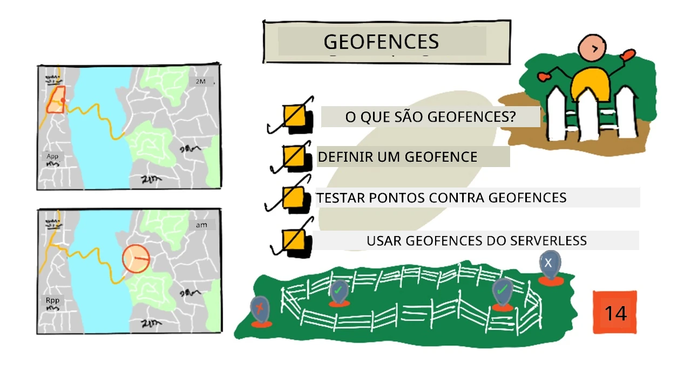
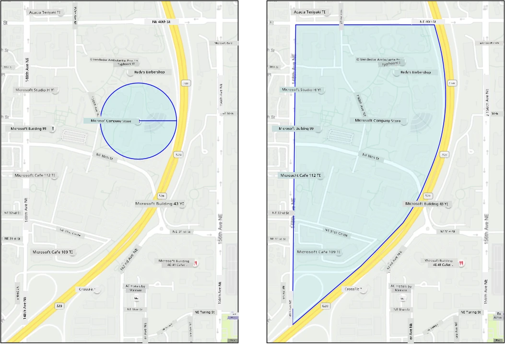
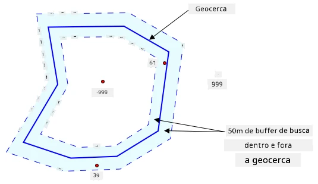
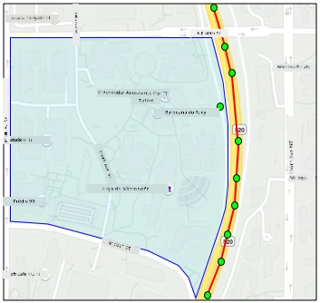
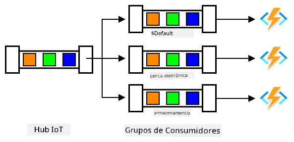

# Geofences



> Ilustração por [Nitya Narasimhan](https://github.com/nitya). Clique na imagem para uma versão maior.

Este vídeo oferece uma visão geral sobre geofences e como utilizá-las no Azure Maps, tópicos que serão abordados nesta lição:

[](https://www.youtube.com/watch?v=nsrgYhaYNVY)

> 🎥 Clique na imagem acima para assistir ao vídeo

## Quiz pré-aula

[Quiz pré-aula](https://black-meadow-040d15503.1.azurestaticapps.net/quiz/27)

## Introdução

Nas últimas 3 lições, você utilizou IoT para localizar os caminhões que transportam seus produtos da fazenda até o centro de processamento. Você capturou dados de GPS, enviou-os para a nuvem para armazenamento e os visualizou em um mapa. O próximo passo para aumentar a eficiência da sua cadeia de suprimentos é receber um alerta quando um caminhão estiver prestes a chegar ao centro de processamento, para que a equipe necessária para descarregar esteja pronta com empilhadeiras e outros equipamentos assim que o veículo chegar. Dessa forma, o descarregamento pode ser feito rapidamente, e você não estará pagando por um caminhão e motorista esperando.

Nesta lição, você aprenderá sobre geofences - regiões geoespaciais definidas, como uma área dentro de um raio de 2 km de um centro de processamento - e como testar se coordenadas de GPS estão dentro ou fora de uma geofence, permitindo verificar se o sensor GPS chegou ou saiu de uma área.

Nesta lição, abordaremos:

* [O que são geofences](../../../../../3-transport/lessons/4-geofences)
* [Definir uma geofence](../../../../../3-transport/lessons/4-geofences)
* [Testar pontos contra uma geofence](../../../../../3-transport/lessons/4-geofences)
* [Usar geofences em código serverless](../../../../../3-transport/lessons/4-geofences)

> 🗑 Esta é a última lição deste projeto, então, após concluir esta lição e a tarefa, não se esqueça de limpar seus serviços na nuvem. Você precisará dos serviços para concluir a tarefa, então certifique-se de completá-la primeiro.
>
> Consulte [o guia de limpeza do projeto](../../../clean-up.md) se necessário para instruções sobre como fazer isso.

## O que são Geofences

Uma geofence é um perímetro virtual para uma região geográfica do mundo real. Geofences podem ser círculos definidos como um ponto e um raio (por exemplo, um círculo de 100m ao redor de um edifício) ou um polígono cobrindo uma área, como uma zona escolar, limites de uma cidade ou campus de uma universidade ou escritório.



> 💁 Você pode já ter usado geofences sem saber. Se você configurou um lembrete usando o aplicativo de lembretes do iOS ou o Google Keep baseado em uma localização, você utilizou uma geofence. Esses aplicativos configuram uma geofence com base na localização fornecida e alertam você quando seu telefone entra na geofence.

Existem muitos motivos pelos quais você pode querer saber se um veículo está dentro ou fora de uma geofence:

* Preparação para descarregamento - receber uma notificação de que um veículo chegou ao local permite que a equipe esteja preparada para descarregar o veículo, reduzindo o tempo de espera. Isso pode permitir que o motorista faça mais entregas em um dia com menos tempo de espera.
* Conformidade tributária - alguns países, como a Nova Zelândia, cobram impostos sobre estradas para veículos a diesel com base no peso do veículo ao dirigir apenas em vias públicas. Usar geofences permite rastrear a quilometragem percorrida em vias públicas em oposição a vias privadas em locais como fazendas ou áreas de extração de madeira.
* Monitoramento de roubo - se um veículo deve permanecer em uma determinada área, como em uma fazenda, e sair da geofence, ele pode ter sido roubado.
* Conformidade de localização - algumas partes de um local de trabalho, fazenda ou fábrica podem ser proibidas para certos veículos, como manter veículos que transportam fertilizantes artificiais e pesticidas longe de campos que cultivam produtos orgânicos. Se uma geofence for violada, o veículo está fora de conformidade e o motorista pode ser notificado.

✅ Você consegue pensar em outros usos para geofences?

O Azure Maps, o serviço que você utilizou na última lição para visualizar dados de GPS, permite definir geofences e testar se um ponto está dentro ou fora da geofence.

## Definir uma geofence

Geofences são definidas usando GeoJSON, o mesmo formato dos pontos que foram adicionados ao mapa na lição anterior. Neste caso, em vez de ser uma `FeatureCollection` de valores `Point`, é uma `FeatureCollection` contendo um `Polygon`.

```json
{
   "type": "FeatureCollection",
   "features": [
     {
       "type": "Feature",
       "geometry": {
         "type": "Polygon",
         "coordinates": [
           [
             [
               -122.13393688201903,
               47.63829579223815
             ],
             [
               -122.13389128446579,
               47.63782047131512
             ],
             [
               -122.13240802288054,
               47.63783312249837
             ],
             [
               -122.13238388299942,
               47.63829037035086
             ],
             [
               -122.13393688201903,
               47.63829579223815
             ]
           ]
         ]
       },
       "properties": {
         "geometryId": "1"
       }
     }
   ]
}
```

Cada ponto no polígono é definido como um par de longitude e latitude em um array, e esses pontos estão em um array que é definido como `coordinates`. Em um `Point` na lição anterior, o `coordinates` era um array contendo 2 valores, latitude e longitude. Para um `Polygon`, é um array de arrays contendo 2 valores, longitude e latitude.

> 💁 Lembre-se, GeoJSON usa `longitude, latitude` para pontos, não `latitude, longitude`.

O array de coordenadas do polígono sempre tem 1 entrada a mais do que o número de pontos no polígono, com a última entrada sendo igual à primeira, fechando o polígono. Por exemplo, para um retângulo, haveria 5 pontos.


Na imagem acima, há um retângulo. As coordenadas do polígono começam no canto superior esquerdo em 47,-122, depois vão para a direita em 47,-121, depois para baixo em 46,-121, depois para a esquerda em 46,-122, e finalmente voltam ao ponto inicial em 47,-122. Isso dá ao polígono 5 pontos - canto superior esquerdo, canto superior direito, canto inferior direito, canto inferior esquerdo e, por fim, canto superior esquerdo para fechá-lo.

✅ Experimente criar um polígono GeoJSON ao redor da sua casa ou escola. Use uma ferramenta como [GeoJSON.io](https://geojson.io/).

### Tarefa - definir uma geofence

Para usar uma geofence no Azure Maps, primeiro ela precisa ser carregada na sua conta do Azure Maps. Uma vez carregada, você receberá um ID único que poderá usar para testar um ponto contra a geofence. Para carregar geofences no Azure Maps, você precisa usar a API web do Azure Maps. Você pode chamar a API web do Azure Maps usando uma ferramenta chamada [curl](https://curl.se).

> 🎓 Curl é uma ferramenta de linha de comando para fazer requisições contra endpoints web.

1. Se você estiver usando Linux, macOS ou uma versão recente do Windows 10, provavelmente já tem o curl instalado. Execute o seguinte comando no terminal ou prompt de comando para verificar:

    ```sh
    curl --version
    ```

    Se você não vir informações de versão do curl, será necessário instalá-lo na [página de downloads do curl](https://curl.se/download.html).

    > 💁 Se você tem experiência com Postman, pode usá-lo como alternativa, se preferir.

1. Crie um arquivo GeoJSON contendo um polígono. Você testará isso usando seu sensor GPS, então crie um polígono ao redor da sua localização atual. Você pode criar manualmente editando o exemplo de GeoJSON fornecido acima ou usar uma ferramenta como [GeoJSON.io](https://geojson.io/).

    O GeoJSON precisará conter uma `FeatureCollection`, contendo uma `Feature` com uma `geometry` do tipo `Polygon`.

    Você **DEVE** também adicionar um elemento `properties` no mesmo nível do elemento `geometry`, e este deve conter um `geometryId`:

    ```json
    "properties": {
        "geometryId": "1"
    }
    ```

    Se você usar [GeoJSON.io](https://geojson.io/), precisará adicionar manualmente este item ao elemento `properties` vazio, seja após baixar o arquivo JSON ou no editor JSON do aplicativo.

    Este `geometryId` deve ser único neste arquivo. Você pode carregar várias geofences como múltiplas `Features` na `FeatureCollection` no mesmo arquivo GeoJSON, desde que cada uma tenha um `geometryId` diferente. Polígonos podem ter o mesmo `geometryId` se forem carregados de um arquivo diferente em um momento diferente.

1. Salve este arquivo como `geofence.json` e navegue até onde ele está salvo no terminal ou console.

1. Execute o seguinte comando curl para criar a GeoFence:

    ```sh
    curl --request POST 'https://atlas.microsoft.com/mapData/upload?api-version=1.0&dataFormat=geojson&subscription-key=<subscription_key>' \
         --header 'Content-Type: application/json' \
         --include \
         --data @geofence.json
    ```

    Substitua `<subscription_key>` na URL pela chave de API da sua conta do Azure Maps.

    A URL é usada para carregar dados de mapa via a API `https://atlas.microsoft.com/mapData/upload`. A chamada inclui um parâmetro `api-version` para especificar qual API do Azure Maps usar, permitindo que a API evolua ao longo do tempo mantendo compatibilidade retroativa. O formato de dados carregado é definido como `geojson`.

    Isso executará a requisição POST para a API de upload e retornará uma lista de cabeçalhos de resposta que inclui um cabeçalho chamado `location`.

    ```output
    content-type: application/json
    location: https://us.atlas.microsoft.com/mapData/operations/1560ced6-3a80-46f2-84b2-5b1531820eab?api-version=1.0
    x-ms-azuremaps-region: West US 2
    x-content-type-options: nosniff
    strict-transport-security: max-age=31536000; includeSubDomains
    x-cache: CONFIG_NOCACHE
    date: Sat, 22 May 2021 21:34:57 GMT
    content-length: 0
    ```

    > 🎓 Ao chamar um endpoint web, você pode passar parâmetros para a chamada adicionando um `?` seguido por pares de chave-valor como `key=value`, separando os pares de chave-valor por um `&`.

1. O Azure Maps não processa isso imediatamente, então você precisará verificar se a solicitação de upload foi concluída usando a URL fornecida no cabeçalho `location`. Faça uma requisição GET para este local para verificar o status. Você precisará adicionar sua chave de assinatura ao final da URL `location` adicionando `&subscription-key=<subscription_key>` ao final, substituindo `<subscription_key>` pela chave de API da sua conta do Azure Maps. Execute o seguinte comando:

    ```sh
    curl --request GET '<location>&subscription-key=<subscription_key>'
    ```

    Substitua `<location>` pelo valor do cabeçalho `location` e `<subscription_key>` pela chave de API da sua conta do Azure Maps.

1. Verifique o valor de `status` na resposta. Se não for `Succeeded`, aguarde um minuto e tente novamente.

1. Quando o status retornar como `Succeeded`, observe o `resourceLocation` na resposta. Isso contém detalhes sobre o ID único (conhecido como UDID) para o objeto GeoJSON. O UDID é o valor após `metadata/`, sem incluir o `api-version`. Por exemplo, se o `resourceLocation` fosse:

    ```json
    {
      "resourceLocation": "https://us.atlas.microsoft.com/mapData/metadata/7c3776eb-da87-4c52-ae83-caadf980323a?api-version=1.0"
    }
    ```

    Então o UDID seria `7c3776eb-da87-4c52-ae83-caadf980323a`.

    Guarde uma cópia deste UDID, pois você precisará dele para testar a geofence.

## Testar pontos contra uma geofence

Depois que o polígono for carregado no Azure Maps, você pode testar um ponto para verificar se ele está dentro ou fora da geofence. Isso é feito fazendo uma requisição à API web, passando o UDID da geofence e a latitude e longitude do ponto a ser testado.

Ao fazer essa requisição, você também pode passar um valor chamado `searchBuffer`. Isso informa à API do Maps o nível de precisão ao retornar os resultados. O motivo disso é que o GPS não é perfeitamente preciso e, às vezes, as localizações podem estar erradas por metros ou mais. O padrão para o search buffer é 50m, mas você pode definir valores de 0m a 500m.

Quando os resultados são retornados da chamada da API, uma das partes do resultado é uma `distance` medida até o ponto mais próximo na borda da geofence, com um valor positivo se o ponto estiver fora da geofence e negativo se estiver dentro. Se essa distância for menor que o search buffer, a distância real é retornada em metros; caso contrário, o valor será 999 ou -999. 999 significa que o ponto está fora da geofence por mais do que o search buffer, -999 significa que está dentro da geofence por mais do que o search buffer.



Na imagem acima, a geofence tem um search buffer de 50m.

* Um ponto no centro da geofence, bem dentro do search buffer, tem uma distância de **-999**.
* Um ponto bem fora do search buffer tem uma distância de **999**.
* Um ponto dentro da geofence e dentro do search buffer, a 6m da geofence, tem uma distância de **6m**.
* Um ponto fora da geofence e dentro do search buffer, a 39m da geofence, tem uma distância de **39m**.

É importante conhecer a distância até a borda da geofence e combinar isso com outras informações, como outras leituras de GPS, velocidade e dados de estrada, ao tomar decisões baseadas na localização de um veículo.

Por exemplo, imagine leituras de GPS mostrando que um veículo estava dirigindo ao longo de uma estrada que passa ao lado de uma geofence. Se um único valor de GPS for impreciso e colocar o veículo dentro da geofence, apesar de não haver acesso veicular, ele pode ser ignorado.


Na imagem acima, há uma geofence sobre parte do campus da Microsoft. A linha vermelha mostra um caminhão dirigindo ao longo da 520, com círculos indicando as leituras de GPS. A maioria dessas leituras é precisa e está ao longo da 520, com uma leitura imprecisa dentro da geofence. Não há como essa leitura estar correta - não existem estradas para o caminhão desviar repentinamente da 520 para o campus e depois voltar para a 520. O código que verifica essa geofence precisará considerar as leituras anteriores antes de agir com base nos resultados do teste da geofence.

✅ Quais dados adicionais você precisaria verificar para determinar se uma leitura de GPS pode ser considerada correta?

### Tarefa - testar pontos contra uma geofence

1. Comece construindo a URL para a consulta da API web. O formato é:

    ```output
    https://atlas.microsoft.com/spatial/geofence/json?api-version=1.0&deviceId=gps-sensor&subscription-key=<subscription-key>&udid=<UDID>&lat=<lat>&lon=<lon>
    ```

    Substitua `<subscription_key>` pela chave da API da sua conta do Azure Maps.

    Substitua `<UDID>` pelo UDID da geofence da tarefa anterior.

    Substitua `<lat>` e `<lon>` pela latitude e longitude que você deseja testar.

    Essa URL utiliza a API `https://atlas.microsoft.com/spatial/geofence/json` para consultar uma geofence definida usando GeoJSON. Ela direciona para a versão da API `1.0`. O parâmetro `deviceId` é obrigatório e deve ser o nome do dispositivo de onde vêm a latitude e longitude.

    O buffer de busca padrão é de 50m, e você pode alterá-lo passando um parâmetro adicional `searchBuffer=<distance>`, configurando `<distance>` para a distância do buffer de busca em metros, de 0 a 500.

1. Use o curl para fazer uma solicitação GET para essa URL:

    ```sh
    curl --request GET '<URL>'
    ```

    > 💁 Se você receber um código de resposta `BadRequest`, com um erro de:
    >
    > ```output
    > Invalid GeoJSON: All feature properties should contain a geometryId, which is used for identifying the geofence.
    > ```
    >
    > então seu GeoJSON está faltando a seção `properties` com o `geometryId`. Você precisará corrigir seu GeoJSON e repetir os passos acima para fazer o upload novamente e obter um novo UDID.

1. A resposta conterá uma lista de `geometries`, uma para cada polígono definido no GeoJSON usado para criar a geofence. Cada geometria tem 3 campos de interesse: `distance`, `nearestLat` e `nearestLon`.

    ```output
    {
        "geometries": [
            {
                "deviceId": "gps-sensor",
                "udId": "7c3776eb-da87-4c52-ae83-caadf980323a",
                "geometryId": "1",
                "distance": 999.0,
                "nearestLat": 47.645875,
                "nearestLon": -122.142713
            }
        ],
        "expiredGeofenceGeometryId": [],
        "invalidPeriodGeofenceGeometryId": []
    }
    ```

    * `nearestLat` e `nearestLon` são a latitude e longitude de um ponto na borda da geofence mais próximo da localização sendo testada.

    * `distance` é a distância da localização sendo testada até o ponto mais próximo na borda da geofence. Números negativos significam dentro da geofence, positivos fora. Esse valor será menor que 50 (o buffer de busca padrão) ou 999.

1. Repita isso várias vezes com localizações dentro e fora da geofence.

## Usar geofences em código serverless

Agora você pode adicionar um novo gatilho ao seu aplicativo Functions para testar os dados de eventos de GPS do IoT Hub contra a geofence.

### Grupos de consumidores

Como você deve se lembrar de lições anteriores, o IoT Hub permite que você reproduza eventos que foram recebidos pelo hub, mas não processados. Mas o que aconteceria se múltiplos gatilhos se conectassem? Como ele saberá qual deles processou quais eventos?

A resposta é que ele não sabe! Em vez disso, você pode definir múltiplas conexões separadas para ler eventos, e cada uma pode gerenciar a reprodução de mensagens não lidas. Esses são chamados de *grupos de consumidores*. Quando você se conecta ao endpoint, pode especificar qual grupo de consumidores deseja conectar. Cada componente do seu aplicativo se conectará a um grupo de consumidores diferente.



Em teoria, até 5 aplicativos podem se conectar a cada grupo de consumidores, e todos receberão mensagens quando elas chegarem. É uma boa prática ter apenas um aplicativo acessando cada grupo de consumidores para evitar o processamento duplicado de mensagens e garantir que, ao reiniciar, todas as mensagens enfileiradas sejam processadas corretamente. Por exemplo, se você lançar seu aplicativo Functions localmente, além de executá-lo na nuvem, ambos processariam mensagens, levando ao armazenamento duplicado de blobs na conta de armazenamento.

Se você revisar o arquivo `function.json` para o gatilho do IoT Hub que criou em uma lição anterior, verá o grupo de consumidores na seção de vinculação do gatilho do Event Hub:

```json
"consumerGroup": "$Default"
```

Quando você cria um IoT Hub, o grupo de consumidores `$Default` é criado por padrão. Se você quiser adicionar um gatilho adicional, pode fazer isso usando um novo grupo de consumidores.

> 💁 Nesta lição, você usará uma função diferente para testar a geofence daquela usada para armazenar os dados de GPS. Isso é para mostrar como usar grupos de consumidores e separar o código para torná-lo mais fácil de ler e entender. Em um aplicativo de produção, há muitas maneiras de arquitetar isso - colocando ambos em uma função, usando um gatilho na conta de armazenamento para executar uma função para verificar a geofence ou usando múltiplas funções. Não há uma "maneira certa", depende do restante do seu aplicativo e das suas necessidades.

### Tarefa - criar um novo grupo de consumidores

1. Execute o seguinte comando para criar um novo grupo de consumidores chamado `geofence` para seu IoT Hub:

    ```sh
    az iot hub consumer-group create --name geofence \
                                     --hub-name <hub_name>
    ```

    Substitua `<hub_name>` pelo nome que você usou para seu IoT Hub.

1. Se quiser ver todos os grupos de consumidores de um IoT Hub, execute o seguinte comando:

    ```sh
    az iot hub consumer-group list --output table \
                                   --hub-name <hub_name>
    ```

    Substitua `<hub_name>` pelo nome que você usou para seu IoT Hub. Isso listará todos os grupos de consumidores.

    ```output
    Name      ResourceGroup
    --------  ---------------
    $Default  gps-sensor
    geofence  gps-sensor
    ```

> 💁 Quando você executou o monitor de eventos do IoT Hub em uma lição anterior, ele se conectou ao grupo de consumidores `$Default`. Foi por isso que você não pode executar o monitor de eventos e um gatilho de eventos ao mesmo tempo. Se quiser executar ambos, pode usar outros grupos de consumidores para todos os seus aplicativos Functions e manter `$Default` para o monitor de eventos.

### Tarefa - criar um novo gatilho do IoT Hub

1. Adicione um novo gatilho de evento do IoT Hub ao seu aplicativo de função `gps-trigger` que você criou em uma lição anterior. Chame essa função de `geofence-trigger`.

    > ⚠️ Você pode consultar [as instruções para criar um gatilho de evento do IoT Hub no projeto 2, lição 5, se necessário](../../../2-farm/lessons/5-migrate-application-to-the-cloud/README.md#create-an-iot-hub-event-trigger).

1. Configure a string de conexão do IoT Hub no arquivo `function.json`. O `local.settings.json` é compartilhado entre todos os gatilhos no aplicativo Functions.

1. Atualize o valor de `consumerGroup` no arquivo `function.json` para referenciar o novo grupo de consumidores `geofence`:

    ```json
    "consumerGroup": "geofence"
    ```

1. Você precisará usar a chave de assinatura da sua conta do Azure Maps nesse gatilho, então adicione uma nova entrada ao arquivo `local.settings.json` chamada `MAPS_KEY`.

1. Execute o aplicativo Functions para garantir que ele está se conectando e processando mensagens. O `iot-hub-trigger` da lição anterior também será executado e fará upload de blobs para o armazenamento.

    > Para evitar leituras duplicadas de GPS no armazenamento de blobs, você pode parar o aplicativo Functions que está executando na nuvem. Para fazer isso, use o seguinte comando:
    >
    > ```sh
    > az functionapp stop --resource-group gps-sensor \
    >                     --name <functions_app_name>
    > ```
    >
    > Substitua `<functions_app_name>` pelo nome que você usou para seu aplicativo Functions.
    >
    > Você pode reiniciá-lo mais tarde com o seguinte comando:
    >
    > ```sh
    > az functionapp start --resource-group gps-sensor \
    >                     --name <functions_app_name>
    > ```
    >
    > Substitua `<functions_app_name>` pelo nome que você usou para seu aplicativo Functions.

### Tarefa - testar a geofence a partir do gatilho

Anteriormente nesta lição, você usou o curl para consultar uma geofence e verificar se um ponto estava localizado dentro ou fora dela. Você pode fazer uma solicitação web semelhante de dentro do seu gatilho.

1. Para consultar a geofence, você precisa do seu UDID. Adicione uma nova entrada ao arquivo `local.settings.json` chamada `GEOFENCE_UDID` com esse valor.

1. Abra o arquivo `__init__.py` do novo gatilho `geofence-trigger`.

1. Adicione a seguinte importação ao topo do arquivo:

    ```python
    import json
    import os
    import requests
    ```

    O pacote `requests` permite que você faça chamadas de API web. O Azure Maps não possui um SDK para Python, então você precisa fazer chamadas de API web para usá-lo no código Python.

1. Adicione as seguintes 2 linhas ao início do método `main` para obter a chave de assinatura do Maps:

    ```python
    maps_key = os.environ['MAPS_KEY']
    geofence_udid = os.environ['GEOFENCE_UDID']    
    ```

1. Dentro do loop `for event in events`, adicione o seguinte para obter a latitude e longitude de cada evento:

    ```python
    event_body = json.loads(event.get_body().decode('utf-8'))
    lat = event_body['gps']['lat']
    lon = event_body['gps']['lon']
    ```

    Esse código converte o JSON do corpo do evento em um dicionário e, em seguida, extrai `lat` e `lon` do campo `gps`.

1. Ao usar `requests`, em vez de construir uma URL longa como você fez com o curl, você pode usar apenas a parte da URL e passar os parâmetros como um dicionário. Adicione o seguinte código para definir a URL a ser chamada e configurar os parâmetros:

    ```python
    url = 'https://atlas.microsoft.com/spatial/geofence/json'

    params = {
        'api-version': 1.0,
        'deviceId': 'gps-sensor',
        'subscription-key': maps_key,
        'udid' : geofence_udid,
        'lat' : lat,
        'lon' : lon
    }
    ```

    Os itens no dicionário `params` corresponderão aos pares de chave e valor que você usou ao chamar a API web via curl.

1. Adicione as seguintes linhas de código para chamar a API web:

    ```python
    response = requests.get(url, params=params)
    response_body = json.loads(response.text)
    ```

    Isso chama a URL com os parâmetros e retorna um objeto de resposta.

1. Adicione o seguinte código abaixo disso:

    ```python
    distance = response_body['geometries'][0]['distance']

    if distance == 999:
        logging.info('Point is outside geofence')
    elif distance > 0:
        logging.info(f'Point is just outside geofence by a distance of {distance}m')
    elif distance == -999:
        logging.info(f'Point is inside geofence')
    else:
        logging.info(f'Point is just inside geofence by a distance of {distance}m')
    ```

    Esse código assume 1 geometria e extrai a distância dessa única geometria. Em seguida, registra diferentes mensagens com base na distância.

1. Execute esse código. Você verá na saída de log se as coordenadas de GPS estão dentro ou fora da geofence, com uma distância se o ponto estiver dentro de 50m. Teste esse código com diferentes geofences com base na localização do seu sensor de GPS, tente mover o sensor (por exemplo, conectado ao WiFi de um celular ou com diferentes coordenadas no dispositivo IoT virtual) para ver essa mudança.

1. Quando estiver pronto, implante esse código no seu aplicativo Functions na nuvem. Não se esqueça de implantar as novas Configurações de Aplicativo.

    > ⚠️ Você pode consultar [as instruções para fazer upload das Configurações de Aplicativo no projeto 2, lição 5, se necessário](../../../2-farm/lessons/5-migrate-application-to-the-cloud/README.md#task---upload-your-application-settings).

    > ⚠️ Você pode consultar [as instruções para implantar seu aplicativo Functions no projeto 2, lição 5, se necessário](../../../2-farm/lessons/5-migrate-application-to-the-cloud/README.md#task---deploy-your-functions-app-to-the-cloud).

> 💁 Você pode encontrar esse código na pasta [code/functions](../../../../../3-transport/lessons/4-geofences/code/functions).

---

## 🚀 Desafio

Nesta lição, você adicionou uma geofence usando um arquivo GeoJSON com um único polígono. Você pode fazer upload de múltiplos polígonos ao mesmo tempo, desde que tenham valores diferentes de `geometryId` na seção `properties`.

Tente fazer upload de um arquivo GeoJSON com múltiplos polígonos e ajuste seu código para encontrar qual polígono as coordenadas de GPS estão mais próximas ou dentro.

## Quiz pós-aula

[Quiz pós-aula](https://black-meadow-040d15503.1.azurestaticapps.net/quiz/28)

## Revisão e Autoestudo

* Leia mais sobre geofences e alguns de seus casos de uso na [página de Geofencing na Wikipedia](https://en.wikipedia.org/wiki/Geo-fence).
* Leia mais sobre a API de geofencing do Azure Maps na [documentação Microsoft Azure Maps Spatial - Get Geofence](https://docs.microsoft.com/rest/api/maps/spatial/getgeofence?WT.mc_id=academic-17441-jabenn).
* Leia mais sobre grupos de consumidores na [documentação de consumidores de eventos no Microsoft Docs](https://docs.microsoft.com/azure/event-hubs/event-hubs-features?WT.mc_id=academic-17441-jabenn#event-consumers).

## Tarefa

[Enviar notificações usando Twilio](assignment.md)

---

**Aviso Legal**:  
Este documento foi traduzido utilizando o serviço de tradução por IA [Co-op Translator](https://github.com/Azure/co-op-translator). Embora nos esforcemos para garantir a precisão, esteja ciente de que traduções automatizadas podem conter erros ou imprecisões. O documento original em seu idioma nativo deve ser considerado a fonte autoritativa. Para informações críticas, recomenda-se a tradução profissional realizada por humanos. Não nos responsabilizamos por quaisquer mal-entendidos ou interpretações equivocadas decorrentes do uso desta tradução.