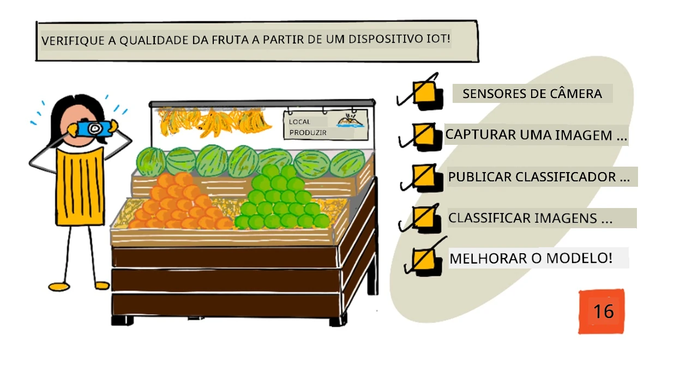
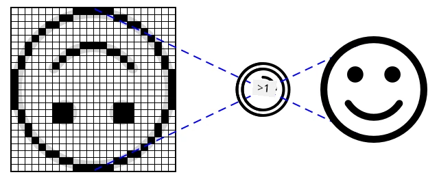
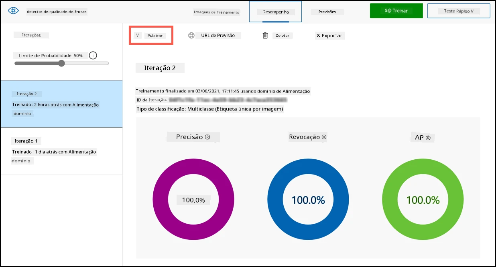
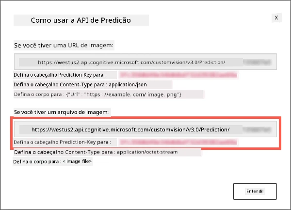

# Verifique a qualidade das frutas com um dispositivo IoT



> Ilustração por [Nitya Narasimhan](https://github.com/nitya). Clique na imagem para uma versão maior.

## Quiz pré-aula

[Quiz pré-aula](https://black-meadow-040d15503.1.azurestaticapps.net/quiz/31)

## Introdução

Na última lição, você aprendeu sobre classificadores de imagens e como treiná-los para detectar frutas boas e ruins. Para usar esse classificador de imagens em uma aplicação IoT, você precisa ser capaz de capturar uma imagem usando algum tipo de câmera e enviar essa imagem para a nuvem para ser classificada.

Nesta lição, você aprenderá sobre sensores de câmera e como usá-los com um dispositivo IoT para capturar uma imagem. Também aprenderá como chamar o classificador de imagens a partir do seu dispositivo IoT.

Nesta lição, abordaremos:

* [Sensores de câmera](../../../../../4-manufacturing/lessons/2-check-fruit-from-device)
* [Capturar uma imagem usando um dispositivo IoT](../../../../../4-manufacturing/lessons/2-check-fruit-from-device)
* [Publicar seu classificador de imagens](../../../../../4-manufacturing/lessons/2-check-fruit-from-device)
* [Classificar imagens a partir do seu dispositivo IoT](../../../../../4-manufacturing/lessons/2-check-fruit-from-device)
* [Melhorar o modelo](../../../../../4-manufacturing/lessons/2-check-fruit-from-device)

## Sensores de câmera

Sensores de câmera, como o nome sugere, são câmeras que você pode conectar ao seu dispositivo IoT. Eles podem tirar fotos ou capturar vídeos em streaming. Alguns retornam dados de imagem brutos, enquanto outros comprimem os dados em arquivos de imagem, como JPEG ou PNG. Geralmente, as câmeras que funcionam com dispositivos IoT são muito menores e têm resolução mais baixa do que aquelas que você pode estar acostumado, mas é possível obter câmeras de alta resolução que rivalizam com os melhores smartphones. Você pode encontrar lentes intercambiáveis, configurações com múltiplas câmeras, câmeras térmicas infravermelhas ou câmeras UV.



A maioria dos sensores de câmera usa sensores de imagem onde cada pixel é um fotodiodo. Uma lente foca a imagem no sensor de imagem, e milhares ou milhões de fotodiodos detectam a luz que incide sobre cada um, registrando isso como dados de pixel.

> 💁 Lentes invertem imagens, e o sensor da câmera então as vira para o lado correto. Isso também acontece nos seus olhos - o que você vê é detectado de cabeça para baixo na parte de trás do seu olho, e seu cérebro corrige isso.

> 🎓 O sensor de imagem é conhecido como Sensor de Pixel Ativo (APS), e o tipo mais popular de APS é um sensor de semicondutor de óxido metálico complementar, ou CMOS. Você pode ter ouvido o termo sensor CMOS usado para sensores de câmera.

Sensores de câmera são sensores digitais, enviando dados de imagem como dados digitais, geralmente com a ajuda de uma biblioteca que fornece a comunicação. As câmeras se conectam usando protocolos como SPI para permitir o envio de grandes quantidades de dados - imagens são substancialmente maiores do que números únicos de sensores, como um sensor de temperatura.

✅ Quais são as limitações em relação ao tamanho da imagem em dispositivos IoT? Pense nas restrições, especialmente no hardware de microcontroladores.

## Capturar uma imagem usando um dispositivo IoT

Você pode usar seu dispositivo IoT para capturar uma imagem que será classificada.

### Tarefa - capturar uma imagem usando um dispositivo IoT

Siga o guia relevante para capturar uma imagem usando seu dispositivo IoT:

* [Arduino - Wio Terminal](wio-terminal-camera.md)
* [Computador de placa única - Raspberry Pi](pi-camera.md)
* [Computador de placa única - Dispositivo virtual](virtual-device-camera.md)

## Publicar seu classificador de imagens

Você treinou seu classificador de imagens na última lição. Antes de usá-lo a partir do seu dispositivo IoT, você precisa publicar o modelo.

### Iterações do modelo

Quando seu modelo estava sendo treinado na última lição, você pode ter notado que a aba **Performance** mostra as iterações ao lado. Quando você treinou o modelo pela primeira vez, viu *Iteration 1* em treinamento. Quando melhorou o modelo usando as imagens de previsão, viu *Iteration 2* em treinamento.

Cada vez que você treina o modelo, obtém uma nova iteração. Isso é uma forma de acompanhar as diferentes versões do seu modelo treinadas em diferentes conjuntos de dados. Quando você faz um **Quick Test**, há um menu suspenso que pode ser usado para selecionar a iteração, permitindo comparar os resultados entre várias iterações.

Quando estiver satisfeito com uma iteração, você pode publicá-la para torná-la disponível para uso em aplicativos externos. Dessa forma, você pode ter uma versão publicada que é usada pelos seus dispositivos, enquanto trabalha em uma nova versão ao longo de várias iterações, publicando-a quando estiver satisfeito com ela.

### Tarefa - publicar uma iteração

As iterações são publicadas no portal Custom Vision.

1. Acesse o portal Custom Vision em [CustomVision.ai](https://customvision.ai) e faça login, caso ainda não tenha feito isso. Em seguida, abra seu projeto `fruit-quality-detector`.

1. Selecione a aba **Performance** nas opções no topo.

1. Escolha a última iteração na lista *Iterations* ao lado.

1. Clique no botão **Publish** para a iteração.

    

1. No diálogo *Publish Model*, defina o *Prediction resource* como o recurso `fruit-quality-detector-prediction` que você criou na última lição. Mantenha o nome como `Iteration2` e clique no botão **Publish**.

1. Após publicar, clique no botão **Prediction URL**. Isso mostrará os detalhes da API de previsão, que você precisará para chamar o modelo a partir do seu dispositivo IoT. A seção inferior está rotulada como *If you have an image file*, e esses são os detalhes que você deseja. Copie o URL mostrado, que será algo como:

    ```output
    https://<location>.api.cognitive.microsoft.com/customvision/v3.0/Prediction/<id>/classify/iterations/Iteration2/image
    ```

    Onde `<location>` será o local usado ao criar seu recurso de visão personalizada, e `<id>` será um longo ID composto por letras e números.

    Também copie o valor de *Prediction-Key*. Esta é uma chave segura que você deve passar ao chamar o modelo. Apenas aplicativos que fornecem essa chave podem usar o modelo; qualquer outro aplicativo será rejeitado.

    

✅ Quando uma nova iteração é publicada, ela terá um nome diferente. Como você acha que poderia alterar a iteração que um dispositivo IoT está usando?

## Classificar imagens a partir do seu dispositivo IoT

Agora você pode usar esses detalhes de conexão para chamar o classificador de imagens a partir do seu dispositivo IoT.

### Tarefa - classificar imagens a partir do seu dispositivo IoT

Siga o guia relevante para classificar imagens usando seu dispositivo IoT:

* [Arduino - Wio Terminal](wio-terminal-classify-image.md)
* [Computador de placa única - Raspberry Pi/Dispositivo IoT virtual](single-board-computer-classify-image.md)

## Melhorar o modelo

Você pode perceber que os resultados obtidos ao usar a câmera conectada ao seu dispositivo IoT não correspondem ao que você esperava. As previsões nem sempre são tão precisas quanto ao usar imagens enviadas do seu computador. Isso ocorre porque o modelo foi treinado com dados diferentes dos usados para previsões.

Para obter os melhores resultados de um classificador de imagens, você deve treinar o modelo com imagens o mais semelhantes possível às usadas para previsões. Por exemplo, se você usou a câmera do seu celular para capturar imagens para treinamento, a qualidade, nitidez e cor da imagem serão diferentes de uma câmera conectada a um dispositivo IoT.


Na imagem acima, a foto da banana à esquerda foi tirada usando uma câmera Raspberry Pi, enquanto a da direita foi tirada da mesma banana no mesmo local usando um iPhone. Há uma diferença notável na qualidade - a foto do iPhone é mais nítida, com cores mais vibrantes e maior contraste.

✅ O que mais pode causar previsões incorretas nas imagens capturadas pelo seu dispositivo IoT? Pense no ambiente em que um dispositivo IoT pode ser usado e nos fatores que podem afetar a imagem capturada.

Para melhorar o modelo, você pode treiná-lo novamente usando as imagens capturadas pelo dispositivo IoT.

### Tarefa - melhorar o modelo

1. Classifique várias imagens de frutas maduras e não maduras usando seu dispositivo IoT.

1. No portal Custom Vision, treine novamente o modelo usando as imagens na aba *Predictions*.

    > ⚠️ Você pode consultar [as instruções para treinar novamente seu classificador na lição 1, se necessário](../1-train-fruit-detector/README.md#retrain-your-image-classifier).

1. Se suas imagens forem muito diferentes das originais usadas para treinamento, você pode excluir todas as imagens originais selecionando-as na aba *Training Images* e clicando no botão **Delete**. Para selecionar uma imagem, mova o cursor sobre ela e aparecerá um ícone de seleção; clique nesse ícone para selecionar ou desmarcar a imagem.

1. Treine uma nova iteração do modelo e publique-a usando os passos acima.

1. Atualize o URL do endpoint no seu código e execute o aplicativo novamente.

1. Repita esses passos até estar satisfeito com os resultados das previsões.

---

## 🚀 Desafio

Quanto a resolução da imagem ou a iluminação afetam a previsão?

Tente alterar a resolução das imagens no código do seu dispositivo e veja se isso faz diferença na qualidade das imagens. Também experimente mudar a iluminação.

Se você fosse criar um dispositivo de produção para vender a fazendas ou fábricas, como garantiria resultados consistentes o tempo todo?

## Quiz pós-aula

[Quiz pós-aula](https://black-meadow-040d15503.1.azurestaticapps.net/quiz/32)

## Revisão e Autoestudo

Você treinou seu modelo de visão personalizada usando o portal. Isso depende de ter imagens disponíveis - e no mundo real, pode não ser possível obter dados de treinamento que correspondam ao que a câmera do seu dispositivo captura. Você pode contornar isso treinando diretamente do seu dispositivo usando a API de treinamento, para treinar um modelo com imagens capturadas pelo seu dispositivo IoT.

* Leia sobre a API de treinamento no [guia de início rápido do SDK Custom Vision](https://docs.microsoft.com/azure/cognitive-services/custom-vision-service/quickstarts/image-classification?WT.mc_id=academic-17441-jabenn&tabs=visual-studio&pivots=programming-language-python)

## Tarefa

[Responder aos resultados da classificação](assignment.md)

---

**Aviso Legal**:  
Este documento foi traduzido utilizando o serviço de tradução por IA [Co-op Translator](https://github.com/Azure/co-op-translator). Embora nos esforcemos para garantir a precisão, esteja ciente de que traduções automatizadas podem conter erros ou imprecisões. O documento original em seu idioma nativo deve ser considerado a fonte autoritativa. Para informações críticas, recomenda-se a tradução profissional realizada por humanos. Não nos responsabilizamos por quaisquer mal-entendidos ou interpretações equivocadas decorrentes do uso desta tradução.