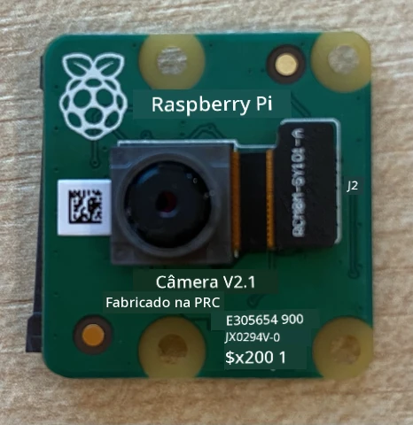
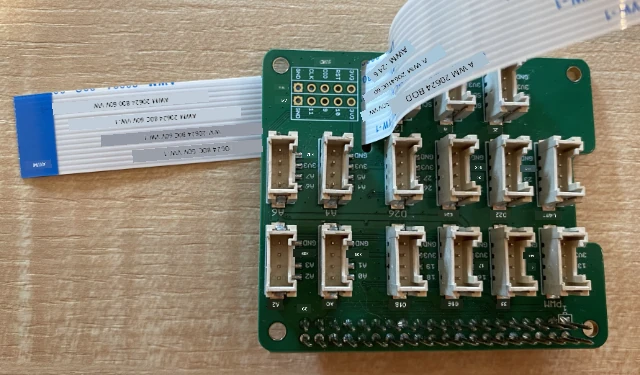
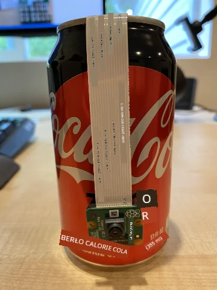

# Capturar uma imagem - Raspberry Pi

Nesta parte da lição, você adicionará um sensor de câmera ao seu Raspberry Pi e lerá imagens dele.

## Hardware

O Raspberry Pi precisa de uma câmera.

A câmera que você usará é o [Módulo de Câmera Raspberry Pi](https://www.raspberrypi.org/products/camera-module-v2/). Esta câmera foi projetada para funcionar com o Raspberry Pi e se conecta por meio de um conector dedicado no Pi.

> 💁 Esta câmera utiliza o [Camera Serial Interface, um protocolo da Mobile Industry Processor Interface Alliance](https://wikipedia.org/wiki/Camera_Serial_Interface), conhecido como MIPI-CSI. Este é um protocolo dedicado para envio de imagens.

## Conectar a câmera

A câmera pode ser conectada ao Raspberry Pi usando um cabo flat.

### Tarefa - conectar a câmera



1. Desligue o Raspberry Pi.

1. Conecte o cabo flat que vem com a câmera à própria câmera. Para fazer isso, puxe suavemente o clipe de plástico preto no suporte para que ele saia um pouco, depois deslize o cabo no conector, com o lado azul voltado para longe da lente e os pinos metálicos voltados para a lente. Depois que o cabo estiver completamente inserido, empurre o clipe de plástico preto de volta ao lugar.

    Você pode encontrar uma animação mostrando como abrir o clipe e inserir o cabo na [documentação de introdução ao módulo de câmera do Raspberry Pi](https://projects.raspberrypi.org/en/projects/getting-started-with-picamera/2).

    

1. Remova o Grove Base Hat do Raspberry Pi.

1. Passe o cabo flat pelo slot da câmera no Grove Base Hat. Certifique-se de que o lado azul do cabo esteja voltado para as portas analógicas rotuladas como **A0**, **A1**, etc.

    

1. Insira o cabo flat no conector da câmera no Raspberry Pi. Novamente, puxe o clipe de plástico preto para cima, insira o cabo e empurre o clipe de volta ao lugar. O lado azul do cabo deve estar voltado para as portas USB e Ethernet.

    

1. Recoloque o Grove Base Hat.

## Programar a câmera

Agora o Raspberry Pi pode ser programado para usar a câmera utilizando a biblioteca Python [PiCamera](https://pypi.org/project/picamera/).

### Tarefa - habilitar o modo de câmera legado

Infelizmente, com o lançamento do Raspberry Pi OS Bullseye, o software de câmera que vinha com o sistema operacional foi alterado, o que significa que, por padrão, o PiCamera não funciona mais. Há um substituto em desenvolvimento, chamado PiCamera2, mas ele ainda não está pronto para uso.

Por enquanto, você pode configurar seu Raspberry Pi no modo de câmera legado para permitir que o PiCamera funcione. O conector da câmera também está desativado por padrão, mas ativar o software de câmera legado habilita automaticamente o conector.

1. Ligue o Raspberry Pi e aguarde a inicialização.

1. Abra o VS Code, diretamente no Raspberry Pi ou conecte-se via a extensão Remote SSH.

1. Execute os seguintes comandos no terminal:

    ```sh
    sudo raspi-config nonint do_legacy 0
    sudo reboot
    ```

    Isso ativará uma configuração para habilitar o software de câmera legado e reiniciará o Raspberry Pi para que a configuração entre em vigor.

1. Aguarde o Raspberry Pi reiniciar e reabra o VS Code.

### Tarefa - programar a câmera

Programe o dispositivo.

1. No terminal, crie uma nova pasta no diretório home do usuário `pi` chamada `fruit-quality-detector`. Crie um arquivo nesta pasta chamado `app.py`.

1. Abra esta pasta no VS Code.

1. Para interagir com a câmera, você pode usar a biblioteca Python PiCamera. Instale o pacote Pip com o seguinte comando:

    ```sh
    pip3 install picamera
    ```

1. Adicione o seguinte código ao arquivo `app.py`:

    ```python
    import io
    import time
    from picamera import PiCamera
    ```

    Este código importa algumas bibliotecas necessárias, incluindo a biblioteca `PiCamera`.

1. Adicione o seguinte código abaixo para inicializar a câmera:

    ```python
    camera = PiCamera()
    camera.resolution = (640, 480)
    camera.rotation = 0
    
    time.sleep(2)
    ```

    Este código cria um objeto PiCamera e define a resolução para 640x480. Embora resoluções mais altas sejam suportadas (até 3280x2464), o classificador de imagens funciona com imagens muito menores (227x227), então não há necessidade de capturar e enviar imagens maiores.

    A linha `camera.rotation = 0` define a rotação da imagem. O cabo flat entra na parte inferior da câmera, mas se sua câmera estiver girada para facilitar o apontamento para o item que você deseja classificar, você pode alterar esta linha para o número de graus de rotação.

    

    Por exemplo, se você suspender o cabo flat sobre algo para que ele fique na parte superior da câmera, defina a rotação como 180:

    ```python
    camera.rotation = 180
    ```

    A câmera leva alguns segundos para iniciar, por isso a linha `time.sleep(2)`.

1. Adicione o seguinte código abaixo para capturar a imagem como dados binários:

    ```python
    image = io.BytesIO()
    camera.capture(image, 'jpeg')
    image.seek(0)
    ```

    Este código cria um objeto `BytesIO` para armazenar dados binários. A imagem é lida da câmera como um arquivo JPEG e armazenada neste objeto. Este objeto possui um indicador de posição para saber onde está nos dados, permitindo que mais dados sejam escritos no final, se necessário. A linha `image.seek(0)` move esta posição de volta ao início para que todos os dados possam ser lidos posteriormente.

1. Abaixo disso, adicione o seguinte código para salvar a imagem em um arquivo:

    ```python
    with open('image.jpg', 'wb') as image_file:
        image_file.write(image.read())
    ```

    Este código abre um arquivo chamado `image.jpg` para escrita, lê todos os dados do objeto `BytesIO` e os escreve no arquivo.

    > 💁 Você pode capturar a imagem diretamente em um arquivo em vez de um objeto `BytesIO` passando o nome do arquivo para a chamada `camera.capture`. O motivo para usar o objeto `BytesIO` é que, mais tarde nesta lição, você poderá enviar a imagem para seu classificador de imagens.

1. Aponte a câmera para algo e execute este código.

1. Uma imagem será capturada e salva como `image.jpg` na pasta atual. Você verá este arquivo no explorador do VS Code. Selecione o arquivo para visualizar a imagem. Se precisar de rotação, atualize a linha `camera.rotation = 0` conforme necessário e tire outra foto.

> 💁 Você pode encontrar este código na pasta [code-camera/pi](../../../../../4-manufacturing/lessons/2-check-fruit-from-device/code-camera/pi).

😀 Seu programa de câmera foi um sucesso!

---

**Aviso Legal**:  
Este documento foi traduzido utilizando o serviço de tradução por IA [Co-op Translator](https://github.com/Azure/co-op-translator). Embora nos esforcemos para garantir a precisão, esteja ciente de que traduções automatizadas podem conter erros ou imprecisões. O documento original em seu idioma nativo deve ser considerado a fonte autoritativa. Para informações críticas, recomenda-se a tradução profissional realizada por humanos. Não nos responsabilizamos por quaisquer mal-entendidos ou interpretações equivocadas decorrentes do uso desta tradução.