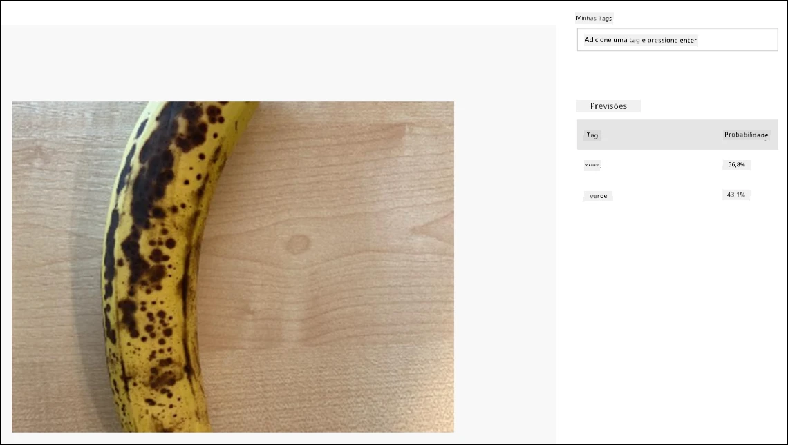

# Classificar uma imagem - Hardware Virtual de IoT e Raspberry Pi

Nesta parte da lição, você enviará a imagem capturada pela câmera para o serviço Custom Vision para classificá-la.

## Enviar imagens para o Custom Vision

O serviço Custom Vision possui um SDK para Python que você pode usar para classificar imagens.

### Tarefa - enviar imagens para o Custom Vision

1. Abra a pasta `fruit-quality-detector` no VS Code. Se estiver usando um dispositivo IoT virtual, certifique-se de que o ambiente virtual esteja em execução no terminal.

1. O SDK do Python para enviar imagens ao Custom Vision está disponível como um pacote Pip. Instale-o com o seguinte comando:

    ```sh
    pip3 install azure-cognitiveservices-vision-customvision
    ```

1. Adicione as seguintes declarações de importação no topo do arquivo `app.py`:

    ```python
    from msrest.authentication import ApiKeyCredentials
    from azure.cognitiveservices.vision.customvision.prediction import CustomVisionPredictionClient
    ```

    Isso traz alguns módulos das bibliotecas do Custom Vision, um para autenticar com a chave de previsão e outro para fornecer uma classe cliente de previsão que pode chamar o Custom Vision.

1. Adicione o seguinte código ao final do arquivo:

    ```python
    prediction_url = '<prediction_url>'
    prediction_key = '<prediction key>'
    ```

    Substitua `<prediction_url>` pela URL que você copiou do diálogo *Prediction URL* anteriormente nesta lição. Substitua `<prediction key>` pela chave de previsão que você copiou do mesmo diálogo.

1. A URL de previsão fornecida pelo diálogo *Prediction URL* foi projetada para ser usada ao chamar diretamente o endpoint REST. O SDK do Python usa partes dessa URL em diferentes lugares. Adicione o seguinte código para dividir essa URL nas partes necessárias:

    ```python
    parts = prediction_url.split('/')
    endpoint = 'https://' + parts[2]
    project_id = parts[6]
    iteration_name = parts[9]
    ```

    Isso divide a URL, extraindo o endpoint `https://<location>.api.cognitive.microsoft.com`, o ID do projeto e o nome da iteração publicada.

1. Crie um objeto de predição para realizar a previsão com o seguinte código:

    ```python
    prediction_credentials = ApiKeyCredentials(in_headers={"Prediction-key": prediction_key})
    predictor = CustomVisionPredictionClient(endpoint, prediction_credentials)
    ```

    As `prediction_credentials` encapsulam a chave de previsão. Elas são então usadas para criar um objeto cliente de previsão apontando para o endpoint.

1. Envie a imagem para o Custom Vision usando o seguinte código:

    ```python
    image.seek(0)
    results = predictor.classify_image(project_id, iteration_name, image)
    ```

    Isso rebobina a imagem para o início e a envia para o cliente de previsão.

1. Por fim, exiba os resultados com o seguinte código:

    ```python
    for prediction in results.predictions:
        print(f'{prediction.tag_name}:\t{prediction.probability * 100:.2f}%')
    ```

    Isso fará um loop por todas as previsões que foram retornadas e as exibirá no terminal. As probabilidades retornadas são números de ponto flutuante de 0 a 1, sendo 0 uma chance de 0% de corresponder à tag e 1 uma chance de 100%.

    > 💁 Classificadores de imagem retornarão as porcentagens para todas as tags que foram usadas. Cada tag terá uma probabilidade de que a imagem corresponda àquela tag.

1. Execute seu código, com sua câmera apontada para alguma fruta, ou um conjunto de imagens apropriado, ou frutas visíveis na sua webcam se estiver usando hardware virtual de IoT. Você verá a saída no console:

    ```output
    (.venv) ➜  fruit-quality-detector python app.py
    ripe:   56.84%
    unripe: 43.16%
    ```

    Você poderá ver a imagem que foi capturada e esses valores na aba **Predictions** no Custom Vision.

    

> 💁 Você pode encontrar este código na pasta [code-classify/pi](../../../../../4-manufacturing/lessons/2-check-fruit-from-device/code-classify/pi) ou [code-classify/virtual-iot-device](../../../../../4-manufacturing/lessons/2-check-fruit-from-device/code-classify/virtual-iot-device).

😀 Seu programa de classificação de qualidade de frutas foi um sucesso!

---

**Aviso Legal**:  
Este documento foi traduzido utilizando o serviço de tradução por IA [Co-op Translator](https://github.com/Azure/co-op-translator). Embora nos esforcemos para garantir a precisão, esteja ciente de que traduções automatizadas podem conter erros ou imprecisões. O documento original em seu idioma nativo deve ser considerado a fonte autoritativa. Para informações críticas, recomenda-se a tradução profissional realizada por humanos. Não nos responsabilizamos por quaisquer mal-entendidos ou interpretações equivocadas decorrentes do uso desta tradução.