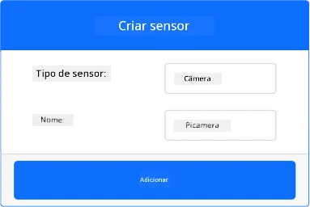
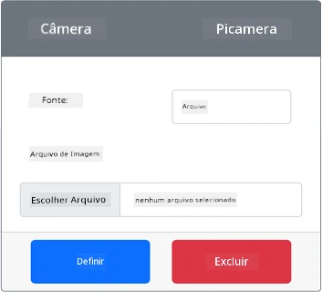
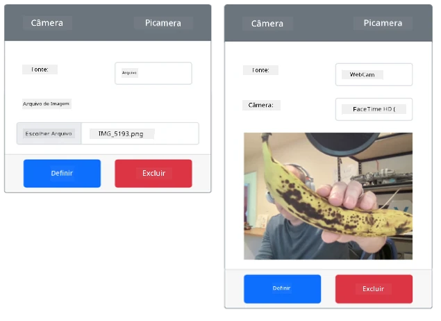

# Capturar uma imagem - Hardware Virtual IoT

Nesta parte da lição, você adicionará um sensor de câmera ao seu dispositivo IoT virtual e lerá imagens dele.

## Hardware

O dispositivo IoT virtual usará uma câmera simulada que envia imagens de arquivos ou da sua webcam.

### Adicionar a câmera ao CounterFit

Para usar uma câmera virtual, você precisa adicionar uma ao aplicativo CounterFit.

#### Tarefa - adicionar a câmera ao CounterFit

Adicione a câmera ao aplicativo CounterFit.

1. Crie um novo aplicativo Python no seu computador em uma pasta chamada `fruit-quality-detector` com um único arquivo chamado `app.py` e um ambiente virtual Python, e adicione os pacotes pip do CounterFit.

    > ⚠️ Você pode consultar [as instruções para criar e configurar um projeto Python do CounterFit na lição 1, se necessário](../../../1-getting-started/lessons/1-introduction-to-iot/virtual-device.md).

1. Instale um pacote adicional do Pip para adicionar um shim do CounterFit que pode se comunicar com sensores de câmera simulando parte do pacote [Picamera Pip](https://pypi.org/project/picamera/). Certifique-se de instalar isso a partir de um terminal com o ambiente virtual ativado.

    ```sh
    pip install counterfit-shims-picamera
    ```

1. Certifique-se de que o aplicativo web CounterFit esteja em execução.

1. Crie uma câmera:

    1. Na caixa *Create sensor* no painel *Sensors*, abra o menu suspenso *Sensor type* e selecione *Camera*.

    1. Defina o *Name* como `Picamera`.

    1. Selecione o botão **Add** para criar a câmera.

    

    A câmera será criada e aparecerá na lista de sensores.

    

## Programar a câmera

O dispositivo IoT virtual agora pode ser programado para usar a câmera virtual.

### Tarefa - programar a câmera

Programe o dispositivo.

1. Certifique-se de que o aplicativo `fruit-quality-detector` esteja aberto no VS Code.

1. Abra o arquivo `app.py`.

1. Adicione o seguinte código ao início do `app.py` para conectar o aplicativo ao CounterFit:

    ```python
    from counterfit_connection import CounterFitConnection
    CounterFitConnection.init('127.0.0.1', 5000)
    ```

1. Adicione o seguinte código ao seu arquivo `app.py`:

    ```python
    import io
    from counterfit_shims_picamera import PiCamera
    ```

    Este código importa algumas bibliotecas necessárias, incluindo a classe `PiCamera` da biblioteca counterfit_shims_picamera.

1. Adicione o seguinte código abaixo disso para inicializar a câmera:

    ```python
    camera = PiCamera()
    camera.resolution = (640, 480)
    camera.rotation = 0
    ```

    Este código cria um objeto PiCamera, define a resolução para 640x480. Embora resoluções mais altas sejam suportadas, o classificador de imagens funciona com imagens muito menores (227x227), então não há necessidade de capturar e enviar imagens maiores.

    A linha `camera.rotation = 0` define a rotação da imagem em graus. Se você precisar girar a imagem da webcam ou do arquivo, ajuste conforme necessário. Por exemplo, se você quiser alterar a imagem de uma banana em uma webcam no modo paisagem para o modo retrato, defina `camera.rotation = 90`.

1. Adicione o seguinte código abaixo disso para capturar a imagem como dados binários:

    ```python
    image = io.BytesIO()
    camera.capture(image, 'jpeg')
    image.seek(0)
    ```

    Este código cria um objeto `BytesIO` para armazenar dados binários. A imagem é lida da câmera como um arquivo JPEG e armazenada neste objeto. Este objeto possui um indicador de posição para saber onde está nos dados, permitindo que mais dados sejam escritos no final, se necessário. Assim, a linha `image.seek(0)` move esta posição de volta ao início para que todos os dados possam ser lidos posteriormente.

1. Abaixo disso, adicione o seguinte para salvar a imagem em um arquivo:

    ```python
    with open('image.jpg', 'wb') as image_file:
        image_file.write(image.read())
    ```

    Este código abre um arquivo chamado `image.jpg` para escrita, depois lê todos os dados do objeto `BytesIO` e os escreve no arquivo.

    > 💁 Você pode capturar a imagem diretamente em um arquivo em vez de um objeto `BytesIO` passando o nome do arquivo para a chamada `camera.capture`. O motivo para usar o objeto `BytesIO` é que, mais tarde nesta lição, você poderá enviar a imagem para o seu classificador de imagens.

1. Configure a imagem que a câmera no CounterFit capturará. Você pode definir a *Source* como *File* e fazer upload de um arquivo de imagem, ou definir a *Source* como *WebCam*, e as imagens serão capturadas da sua webcam. Certifique-se de selecionar o botão **Set** após selecionar uma imagem ou sua webcam.

    

1. Uma imagem será capturada e salva como `image.jpg` na pasta atual. Você verá este arquivo no explorador do VS Code. Selecione o arquivo para visualizar a imagem. Se precisar de rotação, atualize a linha `camera.rotation = 0` conforme necessário e tire outra foto.

> 💁 Você pode encontrar este código na pasta [code-camera/virtual-iot-device](../../../../../4-manufacturing/lessons/2-check-fruit-from-device/code-camera/virtual-iot-device).

😀 Seu programa de câmera foi um sucesso!

---

**Aviso Legal**:  
Este documento foi traduzido utilizando o serviço de tradução por IA [Co-op Translator](https://github.com/Azure/co-op-translator). Embora nos esforcemos para garantir a precisão, esteja ciente de que traduções automatizadas podem conter erros ou imprecisões. O documento original em seu idioma nativo deve ser considerado a fonte autoritativa. Para informações críticas, recomenda-se a tradução profissional realizada por humanos. Não nos responsabilizamos por quaisquer mal-entendidos ou interpretações equivocadas decorrentes do uso desta tradução.