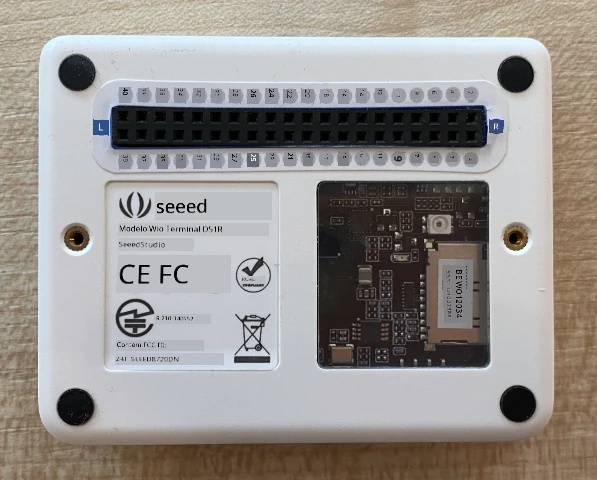

# Capturar uma imagem - Wio Terminal

Nesta parte da lição, você adicionará uma câmera ao seu Wio Terminal e capturará imagens com ela.

## Hardware

O Wio Terminal precisa de uma câmera.

A câmera que você usará é uma [ArduCam Mini 2MP Plus](https://www.arducam.com/product/arducam-2mp-spi-camera-b0067-arduino/). Esta é uma câmera de 2 megapixels baseada no sensor de imagem OV2640. Ela se comunica através de uma interface SPI para capturar imagens e usa I2C para configurar o sensor.

## Conectar a câmera

A ArduCam não possui um conector Grove; em vez disso, ela se conecta aos barramentos SPI e I2C através dos pinos GPIO no Wio Terminal.

### Tarefa - conectar a câmera

Conecte a câmera.


1. Os pinos na base da ArduCam precisam ser conectados aos pinos GPIO no Wio Terminal. Para facilitar a identificação dos pinos corretos, coloque o adesivo de pinos GPIO que vem com o Wio Terminal ao redor dos pinos:

    

1. Usando fios jumper, faça as seguintes conexões:

    | Pino ArduCAM | Pino Wio Terminal | Descrição                               |
    | ------------ | ----------------- | --------------------------------------- |
    | CS           | 24 (SPI_CS)       | Seleção de Chip SPI                     |
    | MOSI         | 19 (SPI_MOSI)     | Saída do Controlador SPI, Entrada do Periférico |
    | MISO         | 21 (SPI_MISO)     | Entrada do Controlador SPI, Saída do Periférico |
    | SCK          | 23 (SPI_SCLK)     | Clock Serial SPI                        |
    | GND          | 6 (GND)           | Terra - 0V                              |
    | VCC          | 4 (5V)            | Fonte de alimentação de 5V              |
    | SDA          | 3 (I2C1_SDA)      | Dados Seriais I2C                       |
    | SCL          | 5 (I2C1_SCL)      | Clock Serial I2C                        |

    

    As conexões GND e VCC fornecem uma fonte de alimentação de 5V para a ArduCam. Ela funciona com 5V, diferente dos sensores Grove que funcionam com 3V. Essa energia vem diretamente da conexão USB-C que alimenta o dispositivo.

    > 💁 Para a conexão SPI, os rótulos dos pinos na ArduCam e os nomes dos pinos do Wio Terminal usados no código ainda utilizam a convenção de nomenclatura antiga. As instruções nesta lição usarão a nova convenção de nomenclatura, exceto quando os nomes dos pinos forem usados no código.

1. Agora você pode conectar o Wio Terminal ao seu computador.

## Programar o dispositivo para conectar à câmera

O Wio Terminal agora pode ser programado para usar a câmera ArduCAM conectada.

### Tarefa - programar o dispositivo para conectar à câmera

1. Crie um novo projeto para o Wio Terminal usando o PlatformIO. Chame este projeto de `fruit-quality-detector`. Adicione código na função `setup` para configurar a porta serial.

1. Adicione código para conectar ao WiFi, com suas credenciais de WiFi em um arquivo chamado `config.h`. Não se esqueça de adicionar as bibliotecas necessárias ao arquivo `platformio.ini`.

1. A biblioteca ArduCam não está disponível como uma biblioteca Arduino que pode ser instalada a partir do arquivo `platformio.ini`. Em vez disso, ela precisará ser instalada a partir do código-fonte na página GitHub deles. Você pode obter isso de duas maneiras:

    * Clonando o repositório de [https://github.com/ArduCAM/Arduino.git](https://github.com/ArduCAM/Arduino.git)
    * Acessando o repositório no GitHub em [github.com/ArduCAM/Arduino](https://github.com/ArduCAM/Arduino) e baixando o código como um arquivo zip no botão **Code**

1. Você só precisa da pasta `ArduCAM` deste código. Copie a pasta inteira para a pasta `lib` no seu projeto.

    > ⚠️ A pasta inteira deve ser copiada, para que o código esteja em `lib/ArduCam`. Não copie apenas o conteúdo da pasta `ArduCam` para a pasta `lib`, copie a pasta inteira.

1. O código da biblioteca ArduCam funciona para vários tipos de câmera. O tipo de câmera que você deseja usar é configurado usando flags do compilador - isso mantém a biblioteca construída o menor possível, removendo o código para câmeras que você não está usando. Para configurar a biblioteca para a câmera OV2640, adicione o seguinte ao final do arquivo `platformio.ini`:

    ```ini
    build_flags =
        -DARDUCAM_SHIELD_V2
        -DOV2640_CAM
    ```

    Isso define 2 flags do compilador:

      * `ARDUCAM_SHIELD_V2` para informar à biblioteca que a câmera está em uma placa Arduino, conhecida como shield.
      * `OV2640_CAM` para informar à biblioteca para incluir apenas o código para a câmera OV2640.

1. Adicione um arquivo de cabeçalho na pasta `src` chamado `camera.h`. Este arquivo conterá o código para se comunicar com a câmera. Adicione o seguinte código a este arquivo:

    ```cpp
    #pragma once
    
    #include <ArduCAM.h>
    #include <Wire.h>
    
    class Camera
    {
    public:
        Camera(int format, int image_size) : _arducam(OV2640, PIN_SPI_SS)
        {
            _format = format;
            _image_size = image_size;
        }
    
        bool init()
        {
            // Reset the CPLD
            _arducam.write_reg(0x07, 0x80);
            delay(100);
    
            _arducam.write_reg(0x07, 0x00);
            delay(100);
    
            // Check if the ArduCAM SPI bus is OK
            _arducam.write_reg(ARDUCHIP_TEST1, 0x55);
            if (_arducam.read_reg(ARDUCHIP_TEST1) != 0x55)
            {
                return false;
            }
                
            // Change MCU mode
            _arducam.set_mode(MCU2LCD_MODE);
    
            uint8_t vid, pid;
    
            // Check if the camera module type is OV2640
            _arducam.wrSensorReg8_8(0xff, 0x01);
            _arducam.rdSensorReg8_8(OV2640_CHIPID_HIGH, &vid);
            _arducam.rdSensorReg8_8(OV2640_CHIPID_LOW, &pid);
            if ((vid != 0x26) && ((pid != 0x41) || (pid != 0x42)))
            {
                return false;
            }
            
            _arducam.set_format(_format);
            _arducam.InitCAM();
            _arducam.OV2640_set_JPEG_size(_image_size);
            _arducam.OV2640_set_Light_Mode(Auto);
            _arducam.OV2640_set_Special_effects(Normal);
            delay(1000);
    
            return true;
        }
    
        void startCapture()
        {
            _arducam.flush_fifo();
            _arducam.clear_fifo_flag();
            _arducam.start_capture();
        }
    
        bool captureReady()
        {
            return _arducam.get_bit(ARDUCHIP_TRIG, CAP_DONE_MASK);
        }
    
        bool readImageToBuffer(byte **buffer, uint32_t &buffer_length)
        {
            if (!captureReady()) return false;
    
            // Get the image file length
            uint32_t length = _arducam.read_fifo_length();
            buffer_length = length;
    
            if (length >= MAX_FIFO_SIZE)
            {
                return false;
            }
            if (length == 0)
            {
                return false;
            }
    
            // create the buffer
            byte *buf = new byte[length];
    
            uint8_t temp = 0, temp_last = 0;
            int i = 0;
            uint32_t buffer_pos = 0;
            bool is_header = false;
    
            _arducam.CS_LOW();
            _arducam.set_fifo_burst();
            
            while (length--)
            {
                temp_last = temp;
                temp = SPI.transfer(0x00);
                //Read JPEG data from FIFO
                if ((temp == 0xD9) && (temp_last == 0xFF)) //If find the end ,break while,
                {
                    buf[buffer_pos] = temp;
    
                    buffer_pos++;
                    i++;
                    
                    _arducam.CS_HIGH();
                }
                if (is_header == true)
                {
                    //Write image data to buffer if not full
                    if (i < 256)
                    {
                        buf[buffer_pos] = temp;
                        buffer_pos++;
                        i++;
                    }
                    else
                    {
                        _arducam.CS_HIGH();
    
                        i = 0;
                        buf[buffer_pos] = temp;
    
                        buffer_pos++;
                        i++;
    
                        _arducam.CS_LOW();
                        _arducam.set_fifo_burst();
                    }
                }
                else if ((temp == 0xD8) & (temp_last == 0xFF))
                {
                    is_header = true;
    
                    buf[buffer_pos] = temp_last;
                    buffer_pos++;
                    i++;
    
                    buf[buffer_pos] = temp;
                    buffer_pos++;
                    i++;
                }
            }
            
            _arducam.clear_fifo_flag();
    
            _arducam.set_format(_format);
            _arducam.InitCAM();
            _arducam.OV2640_set_JPEG_size(_image_size);
    
            // return the buffer
            *buffer = buf;
        }
    
    private:
        ArduCAM _arducam;
        int _format;
        int _image_size;
    };
    ```

    Este é um código de baixo nível que configura a câmera usando as bibliotecas ArduCam e extrai as imagens quando necessário usando o barramento SPI. Este código é muito específico para a ArduCam, então você não precisa se preocupar com como ele funciona neste momento.

1. No arquivo `main.cpp`, adicione o seguinte código abaixo das outras declarações `include` para incluir este novo arquivo e criar uma instância da classe da câmera:

    ```cpp
    #include "camera.h"

    Camera camera = Camera(JPEG, OV2640_640x480);
    ```

    Isso cria uma `Camera` que salva as imagens como JPEGs em uma resolução de 640 por 480. Embora resoluções mais altas sejam suportadas (até 3280x2464), o classificador de imagens funciona com imagens muito menores (227x227), então não há necessidade de capturar e enviar imagens maiores.

1. Adicione o seguinte código abaixo disso para definir uma função para configurar a câmera:

    ```cpp
    void setupCamera()
    {
        pinMode(PIN_SPI_SS, OUTPUT);
        digitalWrite(PIN_SPI_SS, HIGH);
    
        Wire.begin();
        SPI.begin();
    
        if (!camera.init())
        {
            Serial.println("Error setting up the camera!");
        }
    }
    ```

    Esta função `setupCamera` começa configurando o pino de seleção de chip SPI (`PIN_SPI_SS`) como alto, tornando o Wio Terminal o controlador SPI. Em seguida, inicia os barramentos I2C e SPI. Finalmente, inicializa a classe da câmera, que configura as configurações do sensor da câmera e garante que tudo esteja conectado corretamente.

1. Chame esta função no final da função `setup`:

    ```cpp
    setupCamera();
    ```

1. Compile e carregue este código e verifique a saída no monitor serial. Se você vir `Error setting up the camera!`, verifique a fiação para garantir que todos os cabos estejam conectando os pinos corretos na ArduCam aos pinos GPIO corretos no Wio Terminal e que todos os cabos jumper estejam bem encaixados.

## Capturar uma imagem

O Wio Terminal agora pode ser programado para capturar uma imagem quando um botão for pressionado.

### Tarefa - capturar uma imagem

1. Microcontroladores executam seu código continuamente, então não é fácil acionar algo como tirar uma foto sem reagir a um sensor. O Wio Terminal possui botões, então a câmera pode ser configurada para ser acionada por um dos botões. Adicione o seguinte código ao final da função `setup` para configurar o botão C (um dos três botões na parte superior, o mais próximo do interruptor de energia).

    

    ```cpp
    pinMode(WIO_KEY_C, INPUT_PULLUP);
    ```

    O modo `INPUT_PULLUP` essencialmente inverte uma entrada. Por exemplo, normalmente um botão enviaria um sinal baixo quando não pressionado e um sinal alto quando pressionado. Quando configurado como `INPUT_PULLUP`, ele envia um sinal alto quando não pressionado e um sinal baixo quando pressionado.

1. Adicione uma função vazia para responder à pressão do botão antes da função `loop`:

    ```cpp
    void buttonPressed()
    {
        
    }
    ```

1. Chame esta função no método `loop` quando o botão for pressionado:

    ```cpp
    void loop()
    {
        if (digitalRead(WIO_KEY_C) == LOW)
        {
            buttonPressed();
            delay(2000);
        }
    
        delay(200);
    }
    ```

    Este código verifica se o botão foi pressionado. Se for pressionado, a função `buttonPressed` é chamada e o loop é atrasado por 2 segundos. Isso é para permitir tempo para o botão ser liberado, para que uma pressão longa não seja registrada duas vezes.

    > 💁 O botão no Wio Terminal está configurado como `INPUT_PULLUP`, então envia um sinal alto quando não pressionado e um sinal baixo quando pressionado.

1. Adicione o seguinte código à função `buttonPressed`:

    ```cpp
    camera.startCapture();
 
    while (!camera.captureReady())
        delay(100);

    Serial.println("Image captured");

    byte *buffer;
    uint32_t length;

    if (camera.readImageToBuffer(&buffer, length))
    {
        Serial.print("Image read to buffer with length ");
        Serial.println(length);

        delete(buffer);
    }
    ```

    Este código inicia a captura da câmera chamando `startCapture`. O hardware da câmera não funciona retornando os dados quando você os solicita; em vez disso, você envia uma instrução para iniciar a captura, e a câmera trabalhará em segundo plano para capturar a imagem, convertê-la em um JPEG e armazená-la em um buffer local na própria câmera. A chamada `captureReady` então verifica se a captura da imagem foi concluída.

    Uma vez que a captura foi concluída, os dados da imagem são copiados do buffer na câmera para um buffer local (array de bytes) com a chamada `readImageToBuffer`. O comprimento do buffer é então enviado ao monitor serial.

1. Compile e carregue este código e verifique a saída no monitor serial. Toda vez que você pressionar o botão C, uma imagem será capturada e você verá o tamanho da imagem enviado ao monitor serial.

    ```output
    Connecting to WiFi..
    Connected!
    Image captured
    Image read to buffer with length 9224
    Image captured
    Image read to buffer with length 11272
    ```

    Imagens diferentes terão tamanhos diferentes. Elas são comprimidas como JPEGs e o tamanho de um arquivo JPEG para uma determinada resolução depende do que está na imagem.

> 💁 Você pode encontrar este código na pasta [code-camera/wio-terminal](../../../../../4-manufacturing/lessons/2-check-fruit-from-device/code-camera/wio-terminal).

😀 Você capturou imagens com sucesso usando seu Wio Terminal.

## Opcional - verificar as imagens da câmera usando um cartão SD

A maneira mais fácil de ver as imagens capturadas pela câmera é gravá-las em um cartão SD no Wio Terminal e visualizá-las no seu computador. Faça esta etapa se você tiver um cartão microSD de sobra e um leitor de cartão microSD no seu computador ou um adaptador.

O Wio Terminal suporta apenas cartões microSD de até 16GB. Se você tiver um cartão SD maior, ele não funcionará.

### Tarefa - verificar as imagens da câmera usando um cartão SD

1. Formate um cartão microSD como FAT32 ou exFAT usando os aplicativos relevantes no seu computador (Utilitário de Disco no macOS, Explorador de Arquivos no Windows ou usando ferramentas de linha de comando no Linux).

1. Insira o cartão microSD no slot logo abaixo do interruptor de energia. Certifique-se de que ele está completamente inserido até clicar e permanecer no lugar; você pode precisar empurrá-lo usando uma unha ou uma ferramenta fina.

1. Adicione as seguintes declarações de inclusão no topo do arquivo `main.cpp`:

    ```cpp
    #include "SD/Seeed_SD.h"
    #include <Seeed_FS.h>
    ```

1. Adicione a seguinte função antes da função `setup`:

    ```cpp
    void setupSDCard()
    {
        while (!SD.begin(SDCARD_SS_PIN, SDCARD_SPI))
        {
            Serial.println("SD Card Error");
        }
    }
    ```

    Isso configura o cartão SD usando o barramento SPI.

1. Chame isso na função `setup`:

    ```cpp
    setupSDCard();
    ```

1. Adicione o seguinte código acima da função `buttonPressed`:

    ```cpp
    int fileNum = 1;

    void saveToSDCard(byte *buffer, uint32_t length)
    {
        char buff[16];
        sprintf(buff, "%d.jpg", fileNum);
        fileNum++;
    
        File outFile = SD.open(buff, FILE_WRITE );
        outFile.write(buffer, length);
        outFile.close();

        Serial.print("Image written to file ");
        Serial.println(buff);
    }
    ```

    Isso define uma variável global para uma contagem de arquivos. Ela é usada para os nomes dos arquivos de imagem, para que várias imagens possam ser capturadas com nomes de arquivos incrementais - `1.jpg`, `2.jpg` e assim por diante.

    Em seguida, define a função `saveToSDCard`, que recebe um buffer de dados em bytes e o comprimento do buffer. Um nome de arquivo é criado usando a contagem de arquivos, e a contagem de arquivos é incrementada para o próximo arquivo. Os dados binários do buffer são então gravados no arquivo.

1. Chame a função `saveToSDCard` na função `buttonPressed`. A chamada deve ser **antes** do buffer ser excluído:

    ```cpp
    Serial.print("Image read to buffer with length ");
    Serial.println(length);

    saveToSDCard(buffer, length);
    
    delete(buffer);
    ```

1. Compile e carregue este código e verifique a saída no monitor serial. Toda vez que você pressionar o botão C, uma imagem será capturada e salva no cartão SD.

    ```output
    Connecting to WiFi..
    Connected!
    Image captured
    Image read to buffer with length 16392
    Image written to file 1.jpg
    Image captured
    Image read to buffer with length 14344
    Image written to file 2.jpg
    ```

1. Desligue o microSD e ejete-o pressionando-o levemente e soltando, e ele sairá. Você pode precisar usar uma ferramenta fina para fazer isso. Conecte o cartão microSD ao seu computador para visualizar as imagens.

    
💁 Pode levar algumas imagens para que o balanço de branco da câmera se ajuste. Você notará isso com base na cor das imagens capturadas, as primeiras podem parecer com cores alteradas. Você sempre pode contornar isso alterando o código para capturar algumas imagens que são ignoradas na função `setup`.


---

**Aviso Legal**:  
Este documento foi traduzido utilizando o serviço de tradução por IA [Co-op Translator](https://github.com/Azure/co-op-translator). Embora nos esforcemos para garantir a precisão, esteja ciente de que traduções automatizadas podem conter erros ou imprecisões. O documento original em seu idioma nativo deve ser considerado a fonte autoritativa. Para informações críticas, recomenda-se a tradução profissional realizada por humanos. Não nos responsabilizamos por quaisquer mal-entendidos ou interpretações equivocadas decorrentes do uso desta tradução.