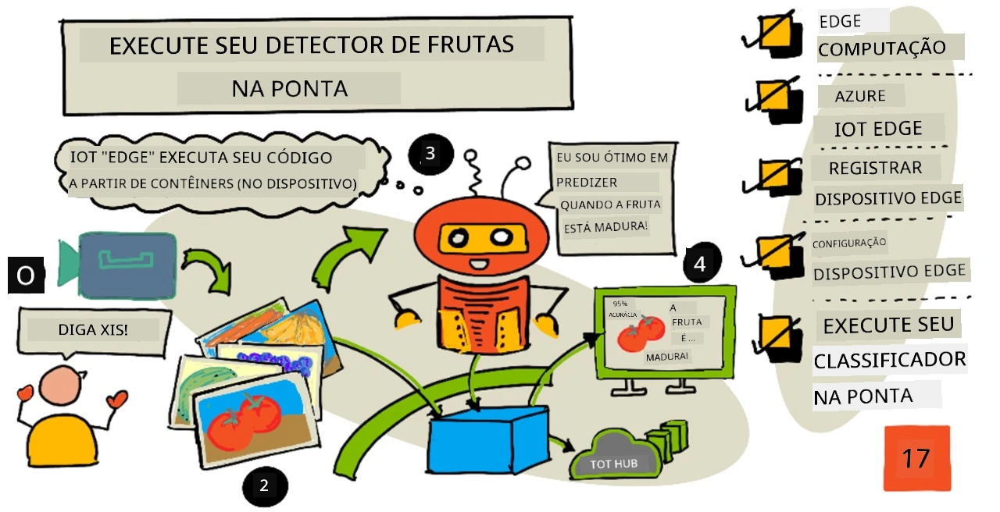
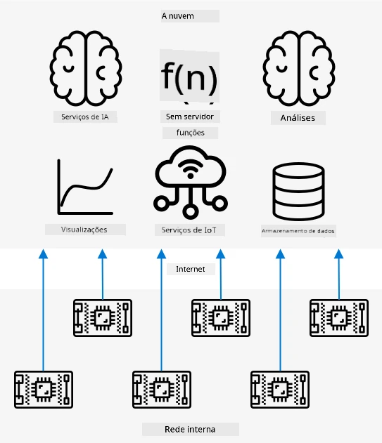
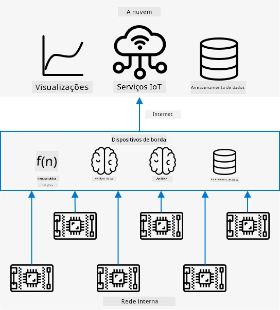
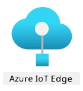
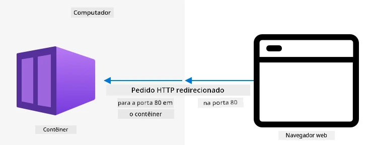
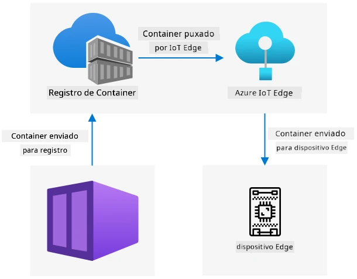
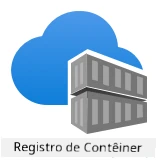

# Execute seu detector de frutas na borda



> Ilustração por [Nitya Narasimhan](https://github.com/nitya). Clique na imagem para uma versão maior.

Este vídeo oferece uma visão geral sobre como executar classificadores de imagens em dispositivos IoT, o tema abordado nesta lição.

[](https://www.youtube.com/watch?v=_K5fqGLO8us)

## Questionário pré-aula

[Questionário pré-aula](https://black-meadow-040d15503.1.azurestaticapps.net/quiz/33)

## Introdução

Na última lição, você usou seu classificador de imagens para classificar frutas maduras e não maduras, enviando uma imagem capturada pela câmera do seu dispositivo IoT pela internet para um serviço na nuvem. Essas chamadas levam tempo, têm custo e, dependendo do tipo de dados de imagem que você está usando, podem ter implicações de privacidade.

Nesta lição, você aprenderá como executar modelos de aprendizado de máquina (ML) na borda - em dispositivos IoT que operam na sua própria rede, em vez de na nuvem. Você aprenderá os benefícios e desvantagens da computação na borda em comparação com a computação na nuvem, como implantar seu modelo de IA na borda e como acessá-lo a partir do seu dispositivo IoT.

Nesta lição, abordaremos:

* [Computação na borda](../../../../../4-manufacturing/lessons/3-run-fruit-detector-edge)
* [Azure IoT Edge](../../../../../4-manufacturing/lessons/3-run-fruit-detector-edge)
* [Registrar um dispositivo IoT Edge](../../../../../4-manufacturing/lessons/3-run-fruit-detector-edge)
* [Configurar um dispositivo IoT Edge](../../../../../4-manufacturing/lessons/3-run-fruit-detector-edge)
* [Exportar seu modelo](../../../../../4-manufacturing/lessons/3-run-fruit-detector-edge)
* [Preparar seu contêiner para implantação](../../../../../4-manufacturing/lessons/3-run-fruit-detector-edge)
* [Implantar seu contêiner](../../../../../4-manufacturing/lessons/3-run-fruit-detector-edge)
* [Usar seu dispositivo IoT Edge](../../../../../4-manufacturing/lessons/3-run-fruit-detector-edge)

## Computação na borda

Computação na borda envolve ter computadores que processam dados de IoT o mais próximo possível de onde os dados são gerados. Em vez de realizar esse processamento na nuvem, ele é movido para a borda da nuvem - sua rede interna.



Nas lições anteriores, você teve dispositivos coletando dados e enviando-os para a nuvem para serem analisados, executando funções sem servidor ou modelos de IA na nuvem.



Computação na borda envolve mover alguns dos serviços da nuvem para computadores que operam na mesma rede que os dispositivos IoT, comunicando-se com a nuvem apenas quando necessário. Por exemplo, você pode executar modelos de IA em dispositivos de borda para analisar a maturação de frutas e enviar apenas análises para a nuvem, como o número de frutas maduras versus não maduras.

✅ Pense nos aplicativos de IoT que você já desenvolveu. Quais partes deles poderiam ser movidas para a borda?

### Vantagens

As vantagens da computação na borda são:

1. **Velocidade** - computação na borda é ideal para dados sensíveis ao tempo, pois as ações são realizadas na mesma rede do dispositivo, em vez de fazer chamadas pela internet. Isso permite velocidades mais altas, já que redes internas podem operar substancialmente mais rápido do que conexões de internet, com os dados viajando distâncias muito menores.

    > 💁 Apesar de cabos ópticos serem usados para conexões de internet, permitindo que os dados viajem na velocidade da luz, os dados podem levar tempo para viajar ao redor do mundo até os provedores de nuvem. Por exemplo, se você estiver enviando dados da Europa para serviços na nuvem nos EUA, leva pelo menos 28ms para os dados cruzarem o Atlântico em um cabo óptico, sem contar o tempo necessário para levar os dados até o cabo transatlântico, converter de sinais elétricos para ópticos e vice-versa do outro lado, e então do cabo óptico para o provedor de nuvem.

    Computação na borda também requer menos tráfego de rede, reduzindo o risco de seus dados desacelerarem devido à congestão na largura de banda limitada disponível para uma conexão de internet.

1. **Acessibilidade remota** - computação na borda funciona quando você tem conectividade limitada ou inexistente, ou quando a conectividade é muito cara para ser usada continuamente. Por exemplo, ao trabalhar em áreas de desastre humanitário onde a infraestrutura é limitada, ou em países em desenvolvimento.

1. **Custos mais baixos** - realizar coleta de dados, armazenamento, análise e ações em dispositivos de borda reduz o uso de serviços na nuvem, o que pode diminuir o custo geral do seu aplicativo de IoT. Houve um aumento recente em dispositivos projetados para computação na borda, como placas aceleradoras de IA, como o [Jetson Nano da NVIDIA](https://developer.nvidia.com/embedded/jetson-nano-developer-kit), que podem executar cargas de trabalho de IA usando hardware baseado em GPU em dispositivos que custam menos de US$100.

1. **Privacidade e segurança** - com computação na borda, os dados permanecem na sua rede e não são enviados para a nuvem. Isso é frequentemente preferido para informações sensíveis e identificáveis pessoalmente, especialmente porque os dados não precisam ser armazenados após serem analisados, o que reduz significativamente o risco de vazamento de dados. Exemplos incluem dados médicos e imagens de câmeras de segurança.

1. **Gerenciamento de dispositivos inseguros** - se você tiver dispositivos com falhas de segurança conhecidas que não deseja conectar diretamente à sua rede ou à internet, pode conectá-los a uma rede separada com um dispositivo de borda IoT como gateway. Este dispositivo de borda pode então ter uma conexão com sua rede mais ampla ou com a internet, gerenciando os fluxos de dados entre eles.

1. **Suporte para dispositivos incompatíveis** - se você tiver dispositivos que não podem se conectar ao IoT Hub, como dispositivos que só podem se conectar usando conexões HTTP ou dispositivos que possuem apenas Bluetooth, pode usar um dispositivo de borda IoT como gateway para encaminhar mensagens ao IoT Hub.

✅ Faça uma pesquisa: Quais outras vantagens podem existir na computação na borda?

### Desvantagens

Existem desvantagens na computação na borda, onde a nuvem pode ser uma opção preferida:

1. **Escalabilidade e flexibilidade** - computação na nuvem pode ajustar as necessidades de rede e dados em tempo real, adicionando ou reduzindo servidores e outros recursos. Para adicionar mais computadores de borda, é necessário adicionar dispositivos manualmente.

1. **Confiabilidade e resiliência** - computação na nuvem oferece múltiplos servidores, frequentemente em várias localidades, para redundância e recuperação de desastres. Para ter o mesmo nível de redundância na borda, são necessários grandes investimentos e muito trabalho de configuração.

1. **Manutenção** - provedores de serviços na nuvem oferecem manutenção e atualizações de sistema.

✅ Faça uma pesquisa: Quais outras desvantagens podem existir na computação na borda?

As desvantagens são, na verdade, o oposto das vantagens de usar a nuvem - você precisa construir e gerenciar esses dispositivos por conta própria, em vez de contar com a expertise e escala dos provedores de nuvem.

Alguns dos riscos são mitigados pela própria natureza da computação na borda. Por exemplo, se você tiver um dispositivo de borda operando em uma fábrica coletando dados de máquinas, não precisa pensar em alguns cenários de recuperação de desastres. Se faltar energia na fábrica, você não precisa de um dispositivo de borda de backup, já que as máquinas que geram os dados que o dispositivo de borda processa também estarão sem energia.

Para sistemas de IoT, você frequentemente desejará uma combinação de computação na nuvem e na borda, aproveitando cada serviço com base nas necessidades do sistema, de seus clientes e de seus mantenedores.

## Azure IoT Edge



Azure IoT Edge é um serviço que pode ajudar você a mover cargas de trabalho da nuvem para a borda. Você configura um dispositivo como um dispositivo de borda e, a partir da nuvem, pode implantar código nesse dispositivo de borda. Isso permite misturar as capacidades da nuvem e da borda.

> 🎓 *Cargas de trabalho* é um termo para qualquer serviço que realiza algum tipo de trabalho, como modelos de IA, aplicativos ou funções sem servidor.

Por exemplo, você pode treinar um classificador de imagens na nuvem e, a partir da nuvem, implantá-lo em um dispositivo de borda. Seu dispositivo IoT então envia imagens para o dispositivo de borda para classificação, em vez de enviar as imagens pela internet. Se você precisar implantar uma nova versão do modelo, pode treiná-lo na nuvem e usar o IoT Edge para atualizar o modelo no dispositivo de borda para a nova versão.

> 🎓 Software implantado no IoT Edge é conhecido como *módulos*. Por padrão, o IoT Edge executa módulos que se comunicam com o IoT Hub, como os módulos `edgeAgent` e `edgeHub`. Quando você implanta um classificador de imagens, ele é implantado como um módulo adicional.

IoT Edge está integrado ao IoT Hub, então você pode gerenciar dispositivos de borda usando o mesmo serviço que usaria para gerenciar dispositivos IoT, com o mesmo nível de segurança.

IoT Edge executa código a partir de *contêineres* - aplicativos autônomos que são executados isoladamente do restante dos aplicativos no seu computador. Quando você executa um contêiner, ele age como um computador separado operando dentro do seu computador, com seu próprio software, serviços e aplicativos em execução. Na maioria das vezes, os contêineres não podem acessar nada no seu computador, a menos que você escolha compartilhar algo, como uma pasta, com o contêiner. O contêiner então expõe serviços por meio de uma porta aberta que você pode conectar ou expor à sua rede.



Por exemplo, você pode ter um contêiner com um site operando na porta 80, a porta padrão do HTTP, e pode expô-lo do seu computador também na porta 80.

✅ Faça uma pesquisa: Leia sobre contêineres e serviços como Docker ou Moby.

Você pode usar o Custom Vision para baixar classificadores de imagens e implantá-los como contêineres, seja diretamente em um dispositivo ou implantados via IoT Edge. Uma vez que eles estão operando em um contêiner, podem ser acessados usando a mesma API REST que a versão na nuvem, mas com o endpoint apontando para o dispositivo de borda executando o contêiner.

## Registrar um dispositivo IoT Edge

Para usar um dispositivo IoT Edge, ele precisa ser registrado no IoT Hub.

### Tarefa - registrar um dispositivo IoT Edge

1. Crie um IoT Hub no grupo de recursos `fruit-quality-detector`. Dê a ele um nome único baseado em `fruit-quality-detector`.

1. Registre um dispositivo IoT Edge chamado `fruit-quality-detector-edge` no seu IoT Hub. O comando para fazer isso é semelhante ao usado para registrar um dispositivo não-edge, exceto que você passa a flag `--edge-enabled`.

    ```sh
    az iot hub device-identity create --edge-enabled \
                                      --device-id fruit-quality-detector-edge \
                                      --hub-name <hub_name>
    ```

    Substitua `<hub_name>` pelo nome do seu IoT Hub.

1. Obtenha a string de conexão para seu dispositivo usando o seguinte comando:

    ```sh
    az iot hub device-identity connection-string show --device-id fruit-quality-detector-edge \
                                                      --output table \
                                                      --hub-name <hub_name>
    ```

    Substitua `<hub_name>` pelo nome do seu IoT Hub.

    Copie a string de conexão exibida no resultado.

## Configurar um dispositivo IoT Edge

Depois de criar o registro do dispositivo de borda no seu IoT Hub, você pode configurar o dispositivo de borda.

### Tarefa - Instalar e iniciar o Runtime do IoT Edge

**O runtime do IoT Edge só executa contêineres Linux.** Ele pode ser executado no Linux ou no Windows usando máquinas virtuais Linux.

* Se você estiver usando um Raspberry Pi como seu dispositivo IoT, ele executa uma versão suportada do Linux e pode hospedar o runtime do IoT Edge. Siga o [guia de instalação do Azure IoT Edge para Linux na documentação da Microsoft](https://docs.microsoft.com/azure/iot-edge/how-to-install-iot-edge?WT.mc_id=academic-17441-jabenn) para instalar o IoT Edge e configurar a string de conexão.

    > 💁 Lembre-se, Raspberry Pi OS é uma variante do Debian Linux.

* Se você não estiver usando um Raspberry Pi, mas tiver um computador Linux, pode executar o runtime do IoT Edge. Siga o [guia de instalação do Azure IoT Edge para Linux na documentação da Microsoft](https://docs.microsoft.com/azure/iot-edge/how-to-install-iot-edge?WT.mc_id=academic-17441-jabenn) para instalar o IoT Edge e configurar a string de conexão.

* Se você estiver usando Windows, pode instalar o runtime do IoT Edge em uma máquina virtual Linux seguindo a [seção de instalação e início do runtime do IoT Edge no guia rápido de implantação do primeiro módulo IoT Edge em um dispositivo Windows na documentação da Microsoft](https://docs.microsoft.com/azure/iot-edge/quickstart?WT.mc_id=academic-17441-jabenn#install-and-start-the-iot-edge-runtime). Você pode parar quando chegar à seção *Implantar um módulo*.

* Se você estiver usando macOS, pode criar uma máquina virtual (VM) na nuvem para usar como seu dispositivo IoT Edge. Essas são computadores que você pode criar na nuvem e acessar pela internet. Você pode criar uma VM Linux que tenha o IoT Edge instalado. Siga o [guia de criação de uma máquina virtual executando IoT Edge](vm-iotedge.md) para instruções sobre como fazer isso.

## Exportar seu modelo

Para executar o classificador na borda, ele precisa ser exportado do Custom Vision. O Custom Vision pode gerar dois tipos de modelos - modelos padrão e modelos compactos. Modelos compactos usam várias técnicas para reduzir o tamanho do modelo, tornando-o pequeno o suficiente para ser baixado e implantado em dispositivos IoT.

Quando você criou o classificador de imagens, usou o domínio *Food*, uma versão do modelo otimizada para treinamento em imagens de alimentos. No Custom Vision, você altera o domínio do seu projeto, usando seus dados de treinamento para treinar um novo modelo com o novo domínio. Todos os domínios suportados pelo Custom Vision estão disponíveis como padrão e compactos.

### Tarefa - treinar seu modelo usando o domínio Food (compacto)
1. Acesse o portal do Custom Vision em [CustomVision.ai](https://customvision.ai) e faça login, caso ainda não tenha feito. Em seguida, abra seu projeto `fruit-quality-detector`.

1. Selecione o botão **Configurações** (o ícone ⚙).

1. Na lista de *Domínios*, selecione *Food (compact)*.

1. Em *Export Capabilities*, certifique-se de que *Basic platforms (Tensorflow, CoreML, ONNX, ...)* esteja selecionado.

1. Na parte inferior da página de Configurações, selecione **Salvar Alterações**.

1. Reentreine o modelo com o botão **Treinar**, selecionando *Treinamento rápido*.

### Tarefa - exportar seu modelo

Depois que o modelo for treinado, ele precisa ser exportado como um contêiner.

1. Selecione a aba **Desempenho** e encontre sua iteração mais recente treinada usando o domínio compacto.

1. Clique no botão **Exportar** no topo.

1. Escolha **DockerFile** e selecione uma versão que corresponda ao seu dispositivo de borda:

    * Se você estiver executando o IoT Edge em um computador Linux, Windows ou Máquina Virtual, selecione a versão *Linux*.
    * Se você estiver executando o IoT Edge em um Raspberry Pi, selecione a versão *ARM (Raspberry Pi 3)*.

> 🎓 O Docker é uma das ferramentas mais populares para gerenciar contêineres, e um DockerFile é um conjunto de instruções sobre como configurar o contêiner.

1. Clique em **Exportar** para que o Custom Vision crie os arquivos relevantes e, em seguida, clique em **Baixar** para baixá-los em um arquivo zip.

1. Salve os arquivos no seu computador e descompacte a pasta.

## Preparar seu contêiner para implantação



Depois de baixar seu modelo, ele precisa ser transformado em um contêiner e enviado para um registro de contêiner - um local online onde você pode armazenar contêineres. O IoT Edge pode então baixar o contêiner do registro e enviá-lo para o seu dispositivo.



O registro de contêiner que você usará nesta lição é o Azure Container Registry. Este não é um serviço gratuito, então, para economizar dinheiro, certifique-se de [limpar seu projeto](../../../clean-up.md) quando terminar.

> 💁 Você pode ver os custos de usar um Azure Container Registry na [página de preços do Azure Container Registry](https://azure.microsoft.com/pricing/details/container-registry/?WT.mc_id=academic-17441-jabenn).

### Tarefa - instalar o Docker

Para construir e implantar o classificador, pode ser necessário instalar o [Docker](https://www.docker.com/).

Você só precisará fazer isso se planejar construir seu contêiner em um dispositivo diferente daquele em que instalou o IoT Edge - como parte da instalação do IoT Edge, o Docker já é instalado para você.

1. Se você estiver construindo o contêiner Docker em um dispositivo diferente do seu dispositivo IoT Edge, siga as instruções de instalação do Docker na [página de instalação do Docker](https://www.docker.com/products/docker-desktop) para instalar o Docker Desktop ou o Docker Engine. Certifique-se de que ele esteja em execução após a instalação.

### Tarefa - criar um recurso de registro de contêiner

1. Execute o seguinte comando no seu Terminal ou prompt de comando para criar um recurso Azure Container Registry:

    ```sh
    az acr create --resource-group fruit-quality-detector \
                  --sku Basic \
                  --name <Container registry name>
    ```

    Substitua `<Container registry name>` por um nome único para o seu registro de contêiner, usando apenas letras e números. Baseie-se em `fruitqualitydetector`. Este nome se tornará parte da URL para acessar o registro de contêiner, então precisa ser globalmente único.

1. Faça login no Azure Container Registry com o seguinte comando:

    ```sh
    az acr login --name <Container registry name>
    ```

    Substitua `<Container registry name>` pelo nome que você usou para o seu registro de contêiner.

1. Ative o modo administrador no registro de contêiner para gerar uma senha com o seguinte comando:

    ```sh
    az acr update --admin-enabled true \
                 --name <Container registry name>
    ```

    Substitua `<Container registry name>` pelo nome que você usou para o seu registro de contêiner.

1. Gere senhas para o seu registro de contêiner com o seguinte comando:

    ```sh
     az acr credential renew --password-name password \
                             --output table \
                             --name <Container registry name>
    ```

    Substitua `<Container registry name>` pelo nome que você usou para o seu registro de contêiner.

    Copie o valor de `PASSWORD`, pois você precisará dele mais tarde.

### Tarefa - construir seu contêiner

O que você baixou do Custom Vision foi um DockerFile contendo instruções sobre como o contêiner deve ser construído, junto com o código do aplicativo que será executado dentro do contêiner para hospedar seu modelo Custom Vision, além de uma API REST para chamá-lo. Você pode usar o Docker para construir um contêiner com uma tag a partir do DockerFile e, em seguida, enviá-lo para o seu registro de contêiner.

> 🎓 Os contêineres recebem uma tag que define um nome e uma versão para eles. Quando você precisa atualizar um contêiner, pode construí-lo com a mesma tag, mas com uma versão mais recente.

1. Abra seu terminal ou prompt de comando e navegue até o modelo descompactado que você baixou do Custom Vision.

1. Execute o seguinte comando para construir e marcar a imagem:

    ```sh
    docker build --platform <platform> -t <Container registry name>.azurecr.io/classifier:v1 .
    ```

    Substitua `<platform>` pela plataforma em que este contêiner será executado. Se você estiver executando o IoT Edge em um Raspberry Pi, defina como `linux/armhf`, caso contrário, defina como `linux/amd64`.

    > 💁 Se você estiver executando este comando no dispositivo em que está executando o IoT Edge, como no seu Raspberry Pi, pode omitir a parte `--platform <platform>`, pois ela será definida automaticamente para a plataforma atual.

    Substitua `<Container registry name>` pelo nome que você usou para o seu registro de contêiner.

    > 💁 Se você estiver usando Linux ou Raspberry Pi OS, pode ser necessário usar `sudo` para executar este comando.

    O Docker construirá a imagem, configurando todo o software necessário. A imagem será então marcada como `classifier:v1`.

    ```output
    ➜  d4ccc45da0bb478bad287128e1274c3c.DockerFile.Linux docker build --platform linux/amd64 -t  fruitqualitydetectorjimb.azurecr.io/classifier:v1 .
    [+] Building 102.4s (11/11) FINISHED
     => [internal] load build definition from Dockerfile
     => => transferring dockerfile: 131B
     => [internal] load .dockerignore
     => => transferring context: 2B
     => [internal] load metadata for docker.io/library/python:3.7-slim
     => [internal] load build context
     => => transferring context: 905B
     => [1/6] FROM docker.io/library/python:3.7-slim@sha256:b21b91c9618e951a8cbca5b696424fa5e820800a88b7e7afd66bba0441a764d6
     => => resolve docker.io/library/python:3.7-slim@sha256:b21b91c9618e951a8cbca5b696424fa5e820800a88b7e7afd66bba0441a764d6
     => => sha256:b4d181a07f8025e00e0cb28f1cc14613da2ce26450b80c54aea537fa93cf3bda 27.15MB / 27.15MB
     => => sha256:de8ecf497b753094723ccf9cea8a46076e7cb845f333df99a6f4f397c93c6ea9 2.77MB / 2.77MB
     => => sha256:707b80804672b7c5d8f21e37c8396f319151e1298d976186b4f3b76ead9f10c8 10.06MB / 10.06MB
     => => sha256:b21b91c9618e951a8cbca5b696424fa5e820800a88b7e7afd66bba0441a764d6 1.86kB / 1.86kB
     => => sha256:44073386687709c437586676b572ff45128ff1f1570153c2f727140d4a9accad 1.37kB / 1.37kB
     => => sha256:3d94f0f2ca798607808b771a7766f47ae62a26f820e871dd488baeccc69838d1 8.31kB / 8.31kB
     => => sha256:283715715396fd56d0e90355125fd4ec57b4f0773f306fcd5fa353b998beeb41 233B / 233B
     => => sha256:8353afd48f6b84c3603ea49d204bdcf2a1daada15f5d6cad9cc916e186610a9f 2.64MB / 2.64MB
     => => extracting sha256:b4d181a07f8025e00e0cb28f1cc14613da2ce26450b80c54aea537fa93cf3bda
     => => extracting sha256:de8ecf497b753094723ccf9cea8a46076e7cb845f333df99a6f4f397c93c6ea9
     => => extracting sha256:707b80804672b7c5d8f21e37c8396f319151e1298d976186b4f3b76ead9f10c8
     => => extracting sha256:283715715396fd56d0e90355125fd4ec57b4f0773f306fcd5fa353b998beeb41
     => => extracting sha256:8353afd48f6b84c3603ea49d204bdcf2a1daada15f5d6cad9cc916e186610a9f
     => [2/6] RUN pip install -U pip
     => [3/6] RUN pip install --no-cache-dir numpy~=1.17.5 tensorflow~=2.0.2 flask~=1.1.2 pillow~=7.2.0
     => [4/6] RUN pip install --no-cache-dir mscviplib==2.200731.16
     => [5/6] COPY app /app
     => [6/6] WORKDIR /app
     => exporting to image
     => => exporting layers
     => => writing image sha256:1846b6f134431f78507ba7c079358ed66d944c0e185ab53428276bd822400386
     => => naming to fruitqualitydetectorjimb.azurecr.io/classifier:v1
    ```

### Tarefa - enviar seu contêiner para o registro de contêiner

1. Use o seguinte comando para enviar seu contêiner para o registro de contêiner:

    ```sh
    docker push <Container registry name>.azurecr.io/classifier:v1
    ```

    Substitua `<Container registry name>` pelo nome que você usou para o seu registro de contêiner.

    > 💁 Se você estiver usando Linux, pode ser necessário usar `sudo` para executar este comando.

    O contêiner será enviado para o registro de contêiner.

    ```output
    ➜  d4ccc45da0bb478bad287128e1274c3c.DockerFile.Linux docker push fruitqualitydetectorjimb.azurecr.io/classifier:v1
    The push refers to repository [fruitqualitydetectorjimb.azurecr.io/classifier]
    5f70bf18a086: Pushed 
    8a1ba9294a22: Pushed 
    56cf27184a76: Pushed 
    b32154f3f5dd: Pushed 
    36103e9a3104: Pushed 
    e2abb3cacca0: Pushed 
    4213fd357bbe: Pushed 
    7ea163ba4dce: Pushed 
    537313a13d90: Pushed 
    764055ebc9a7: Pushed 
    v1: digest: sha256:ea7894652e610de83a5a9e429618e763b8904284253f4fa0c9f65f0df3a5ded8 size: 2423
    ```

1. Para verificar o envio, você pode listar os contêineres no seu registro com o seguinte comando:

    ```sh
    az acr repository list --output table \
                           --name <Container registry name> 
    ```

    Substitua `<Container registry name>` pelo nome que você usou para o seu registro de contêiner.

    ```output
    ➜  d4ccc45da0bb478bad287128e1274c3c.DockerFile.Linux az acr repository list --name fruitqualitydetectorjimb --output table
    Result
    ----------
    classifier
    ```

    Você verá seu classificador listado na saída.

## Implantar seu contêiner

Agora seu contêiner pode ser implantado no seu dispositivo IoT Edge. Para implantar, você precisa definir um manifesto de implantação - um documento JSON que lista os módulos que serão implantados no dispositivo de borda.

### Tarefa - criar o manifesto de implantação

1. Crie um novo arquivo chamado `deployment.json` em algum lugar no seu computador.

1. Adicione o seguinte a este arquivo:

    ```json
    {
        "content": {
            "modulesContent": {
                "$edgeAgent": {
                    "properties.desired": {
                        "schemaVersion": "1.1",
                        "runtime": {
                            "type": "docker",
                            "settings": {
                                "minDockerVersion": "v1.25",
                                "loggingOptions": "",
                                "registryCredentials": {
                                    "ClassifierRegistry": {
                                        "username": "<Container registry name>",
                                        "password": "<Container registry password>",
                                        "address": "<Container registry name>.azurecr.io"
                                      }
                                }
                            }
                        },
                        "systemModules": {
                            "edgeAgent": {
                                "type": "docker",
                                "settings": {
                                    "image": "mcr.microsoft.com/azureiotedge-agent:1.1",
                                    "createOptions": "{}"
                                }
                            },
                            "edgeHub": {
                                "type": "docker",
                                "status": "running",
                                "restartPolicy": "always",
                                "settings": {
                                    "image": "mcr.microsoft.com/azureiotedge-hub:1.1",
                                    "createOptions": "{\"HostConfig\":{\"PortBindings\":{\"5671/tcp\":[{\"HostPort\":\"5671\"}],\"8883/tcp\":[{\"HostPort\":\"8883\"}],\"443/tcp\":[{\"HostPort\":\"443\"}]}}}"
                                }
                            }
                        },
                        "modules": {
                            "ImageClassifier": {
                                "version": "1.0",
                                "type": "docker",
                                "status": "running",
                                "restartPolicy": "always",
                                "settings": {
                                    "image": "<Container registry name>.azurecr.io/classifier:v1",
                                    "createOptions": "{\"ExposedPorts\": {\"80/tcp\": {}},\"HostConfig\": {\"PortBindings\": {\"80/tcp\": [{\"HostPort\": \"80\"}]}}}"
                                }
                            }
                        }
                    }
                },
                "$edgeHub": {
                    "properties.desired": {
                        "schemaVersion": "1.1",
                        "routes": {
                            "upstream": "FROM /messages/* INTO $upstream"
                        },
                        "storeAndForwardConfiguration": {
                            "timeToLiveSecs": 7200
                        }
                    }
                }
            }
        }
    }
    ```

    > 💁 Você pode encontrar este arquivo na pasta [code-deployment/deployment](../../../../../4-manufacturing/lessons/3-run-fruit-detector-edge/code-deployment/deployment).

    Substitua as três instâncias de `<Container registry name>` pelo nome que você usou para o seu registro de contêiner. Uma está na seção do módulo `ImageClassifier`, as outras duas estão na seção `registryCredentials`.

    Substitua `<Container registry password>` na seção `registryCredentials` pela senha do seu registro de contêiner.

1. A partir da pasta que contém seu manifesto de implantação, execute o seguinte comando:

    ```sh
    az iot edge set-modules --device-id fruit-quality-detector-edge \
                            --content deployment.json \
                            --hub-name <hub_name>
    ```

    Substitua `<hub_name>` pelo nome do seu IoT Hub.

    O módulo do classificador de imagens será implantado no seu dispositivo de borda.

### Tarefa - verificar se o classificador está em execução

1. Conecte-se ao dispositivo IoT Edge:

    * Se você estiver usando um Raspberry Pi para executar o IoT Edge, conecte-se usando ssh a partir do seu terminal ou via uma sessão remota SSH no VS Code.
    * Se você estiver executando o IoT Edge em um contêiner Linux no Windows, siga as etapas no [guia de verificação de configuração bem-sucedida](https://docs.microsoft.com/azure/iot-edge/how-to-install-iot-edge-on-windows?WT.mc_id=academic-17441-jabenn&view=iotedge-2018-06&tabs=powershell#verify-successful-configuration) para se conectar ao dispositivo IoT Edge.
    * Se você estiver executando o IoT Edge em uma máquina virtual, pode fazer SSH na máquina usando o `adminUsername` e `password` que configurou ao criar a VM, e usando o endereço IP ou nome DNS:

        ```sh
        ssh <adminUsername>@<IP address>
        ```

        Ou:

        ```sh
        ssh <adminUsername>@<DNS Name>
        ```

        Insira sua senha quando solicitado.

1. Depois de conectado, execute o seguinte comando para obter a lista de módulos do IoT Edge:

    ```sh
    iotedge list
    ```

    > 💁 Pode ser necessário executar este comando com `sudo`.

    Você verá os módulos em execução:

    ```output
    jim@fruit-quality-detector-jimb:~$ iotedge list
    NAME             STATUS           DESCRIPTION      CONFIG
    ImageClassifier  running          Up 42 minutes    fruitqualitydetectorjimb.azurecr.io/classifier:v1
    edgeAgent        running          Up 42 minutes    mcr.microsoft.com/azureiotedge-agent:1.1
    edgeHub          running          Up 42 minutes    mcr.microsoft.com/azureiotedge-hub:1.1
    ```

1. Verifique os logs do módulo do classificador de imagens com o seguinte comando:

    ```sh
    iotedge logs ImageClassifier
    ```

    > 💁 Pode ser necessário executar este comando com `sudo`.

    ```output
    jim@fruit-quality-detector-jimb:~$ iotedge logs ImageClassifier
    2021-07-05 20:30:15.387144: I tensorflow/core/platform/cpu_feature_guard.cc:142] Your CPU supports instructions that this TensorFlow binary was not compiled to use: AVX2 FMA
    2021-07-05 20:30:15.392185: I tensorflow/core/platform/profile_utils/cpu_utils.cc:94] CPU Frequency: 2394450000 Hz
    2021-07-05 20:30:15.392712: I tensorflow/compiler/xla/service/service.cc:168] XLA service 0x55ed9ac83470 executing computations on platform Host. Devices:
    2021-07-05 20:30:15.392806: I tensorflow/compiler/xla/service/service.cc:175]   StreamExecutor device (0): Host, Default Version
    Loading model...Success!
    Loading labels...2 found. Success!
     * Serving Flask app "app" (lazy loading)
     * Environment: production
       WARNING: This is a development server. Do not use it in a production deployment.
       Use a production WSGI server instead.
     * Debug mode: off
     * Running on http://0.0.0.0:80/ (Press CTRL+C to quit)
    ```

### Tarefa - testar o classificador de imagens

1. Você pode usar o CURL para testar o classificador de imagens usando o endereço IP ou nome do host do computador que está executando o agente IoT Edge. Encontre o endereço IP:

    * Se você estiver no mesmo computador que está executando o IoT Edge, pode usar `localhost` como nome do host.
    * Se você estiver usando uma VM, pode usar o endereço IP ou o nome DNS da VM.
    * Caso contrário, você pode obter o endereço IP do computador que está executando o IoT Edge:
      * No Windows 10, siga o [guia para encontrar seu endereço IP](https://support.microsoft.com/windows/find-your-ip-address-f21a9bbc-c582-55cd-35e0-73431160a1b9?WT.mc_id=academic-17441-jabenn).
      * No macOS, siga o [guia para encontrar seu endereço IP em um Mac](https://www.hellotech.com/guide/for/how-to-find-ip-address-on-mac).
      * No Linux, siga a seção sobre como encontrar seu endereço IP privado no [guia para encontrar seu endereço IP no Linux](https://opensource.com/article/18/5/how-find-ip-address-linux).

1. Você pode testar o contêiner com um arquivo local executando o seguinte comando curl:

    ```sh
    curl --location \
         --request POST 'http://<IP address or name>/image' \
         --header 'Content-Type: image/png' \
         --data-binary '@<file_Name>' 
    ```

    Substitua `<IP address or name>` pelo endereço IP ou nome do host do computador que está executando o IoT Edge. Substitua `<file_Name>` pelo nome do arquivo a ser testado.

    Você verá os resultados da previsão na saída:

    ```output
    {
        "created": "2021-07-05T21:44:39.573181",
        "id": "",
        "iteration": "",
        "predictions": [
            {
                "boundingBox": null,
                "probability": 0.9995615482330322,
                "tagId": "",
                "tagName": "ripe"
            },
            {
                "boundingBox": null,
                "probability": 0.0004384400090202689,
                "tagId": "",
                "tagName": "unripe"
            }
        ],
        "project": ""
    }
    ```

    > 💁 Não é necessário fornecer uma chave de previsão aqui, pois isso não está usando um recurso do Azure. Em vez disso, a segurança seria configurada na rede interna com base nas necessidades de segurança internas, em vez de depender de um endpoint público e uma chave de API.

## Usar seu dispositivo IoT Edge

Agora que seu Classificador de Imagens foi implantado em um dispositivo IoT Edge, você pode usá-lo a partir do seu dispositivo IoT.

### Tarefa - usar seu dispositivo IoT Edge

Siga o guia relevante para classificar imagens usando o classificador IoT Edge:

* [Arduino - Wio Terminal](wio-terminal.md)
* [Computador de placa única - Raspberry Pi/Dispositivo IoT Virtual](single-board-computer.md)

### Reentreinamento do modelo

Uma das desvantagens de executar classificadores de imagens no IoT Edge é que eles não estão conectados ao seu projeto Custom Vision. Se você olhar na aba **Predictions** no Custom Vision, não verá as imagens que foram classificadas usando o classificador baseado em Edge.

Este é o comportamento esperado - as imagens não são enviadas para a nuvem para classificação, então não estarão disponíveis na nuvem. Uma das vantagens de usar o IoT Edge é a privacidade, garantindo que as imagens não saiam da sua rede. Outra vantagem é poder trabalhar offline, sem depender de upload de imagens quando o dispositivo não tem conexão com a internet. A desvantagem é melhorar seu modelo - você precisaria implementar outra forma de armazenar imagens que possam ser reclassificadas manualmente para melhorar e reentreinar o classificador de imagens.

✅ Pense em maneiras de fazer upload de imagens para reentreinar o classificador.

---

## 🚀 Desafio

Executar modelos de IA em dispositivos de borda pode ser mais rápido do que na nuvem - o salto de rede é menor. Eles também podem ser mais lentos, pois o hardware que executa o modelo pode não ser tão poderoso quanto o da nuvem.

Faça medições de tempo e compare se a chamada para o seu dispositivo de borda é mais rápida ou mais lenta do que a chamada para a nuvem. Pense em razões para explicar a diferença, ou a falta dela. Pesquise maneiras de executar modelos de IA mais rapidamente na borda usando hardware especializado.

## Questionário pós-aula

[Questionário pós-aula](https://black-meadow-040d15503.1.azurestaticapps.net/quiz/34)

## Revisão e Autoestudo

* Leia mais sobre contêineres na [página de virtualização em nível de sistema operacional na Wikipedia](https://wikipedia.org/wiki/OS-level_virtualization).
* Leia mais sobre computação de borda, com ênfase em como o 5G pode ajudar a expandir a computação de borda no [artigo "o que é computação de borda e por que ela é importante?" no NetworkWorld](https://www.networkworld.com/article/3224893/what-is-edge-computing-and-how-its-changing-the-network.html)
* Saiba mais sobre como executar serviços de IA no IoT Edge assistindo ao [episódio "aprenda a usar o Azure IoT Edge em um serviço de IA pré-construído na borda para realizar detecção de idioma" do Learn Live no Microsoft Channel9](https://channel9.msdn.com/Shows/Learn-Live/Sharpen-Your-AI-Edge-Skills-Episode-4-Learn-How-to-Use-Azure-IoT-Edge-on-a-Pre-Built-AI-Service-on-t?WT.mc_id=academic-17441-jabenn)

## Tarefa

[Execute outros serviços na borda](assignment.md)

---

**Aviso Legal**:  
Este documento foi traduzido utilizando o serviço de tradução por IA [Co-op Translator](https://github.com/Azure/co-op-translator). Embora nos esforcemos para garantir a precisão, esteja ciente de que traduções automatizadas podem conter erros ou imprecisões. O documento original em seu idioma nativo deve ser considerado a fonte autoritativa. Para informações críticas, recomenda-se a tradução profissional realizada por humanos. Não nos responsabilizamos por quaisquer mal-entendidos ou interpretações equivocadas decorrentes do uso desta tradução.