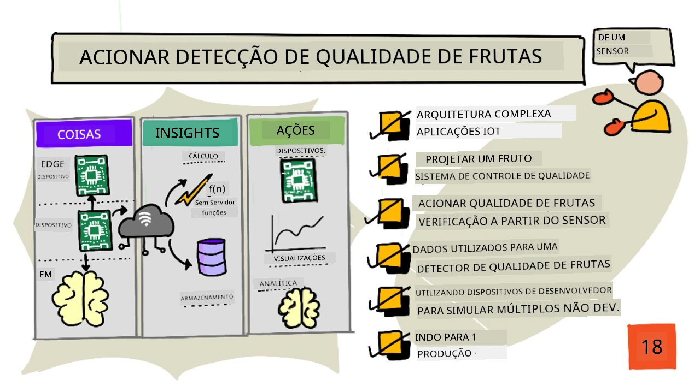
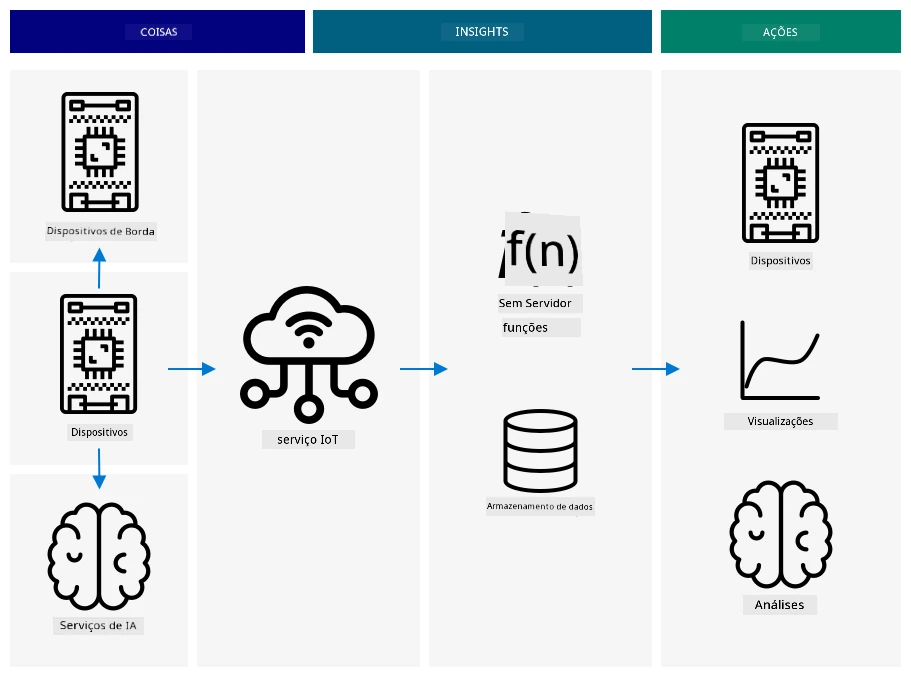
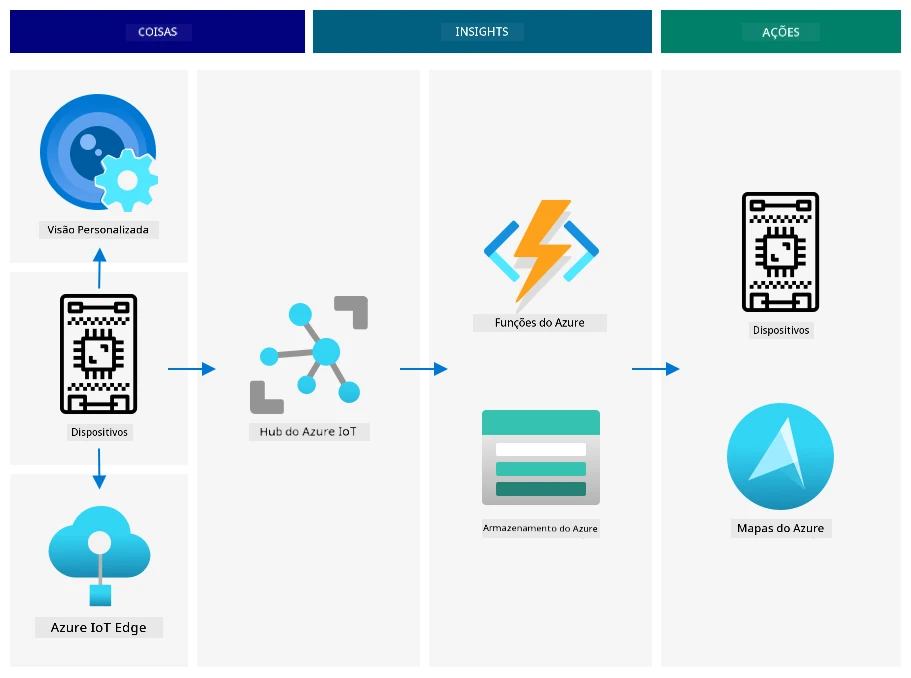
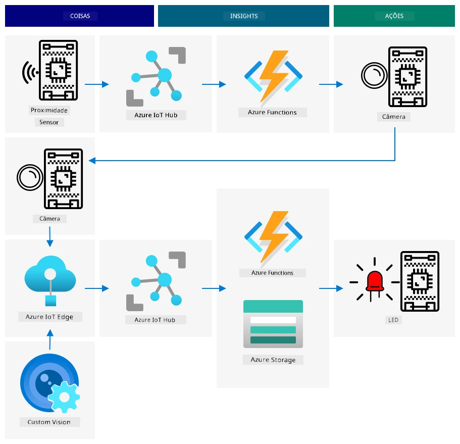
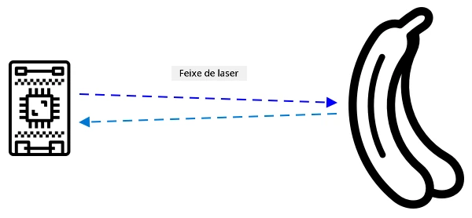
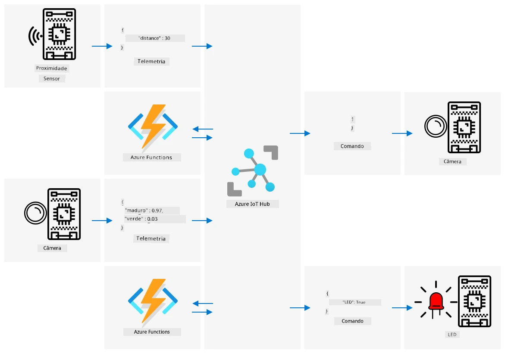

# Acionar a detecção de qualidade de frutas a partir de um sensor



> Ilustração por [Nitya Narasimhan](https://github.com/nitya). Clique na imagem para uma versão maior.

## Questionário pré-aula

[Questionário pré-aula](https://black-meadow-040d15503.1.azurestaticapps.net/quiz/35)

## Introdução

Uma aplicação de IoT não é apenas um único dispositivo capturando dados e enviando-os para a nuvem. Na maioria das vezes, envolve múltiplos dispositivos trabalhando juntos para capturar dados do mundo físico usando sensores, tomar decisões com base nesses dados e interagir de volta com o mundo físico por meio de atuadores ou visualizações.

Nesta lição, você aprenderá mais sobre como arquitetar aplicações complexas de IoT, incorporando múltiplos sensores, diversos serviços na nuvem para analisar e armazenar dados, e exibindo uma resposta por meio de um atuador. Você aprenderá a projetar um protótipo de sistema de controle de qualidade de frutas, incluindo o uso de sensores de proximidade para acionar a aplicação de IoT e como seria a arquitetura desse protótipo.

Nesta lição, abordaremos:

* [Arquitetar aplicações complexas de IoT](../../../../../4-manufacturing/lessons/4-trigger-fruit-detector)
* [Projetar um sistema de controle de qualidade de frutas](../../../../../4-manufacturing/lessons/4-trigger-fruit-detector)
* [Acionar a verificação de qualidade de frutas a partir de um sensor](../../../../../4-manufacturing/lessons/4-trigger-fruit-detector)
* [Dados usados para um detector de qualidade de frutas](../../../../../4-manufacturing/lessons/4-trigger-fruit-detector)
* [Usar dispositivos de desenvolvedor para simular múltiplos dispositivos IoT](../../../../../4-manufacturing/lessons/4-trigger-fruit-detector)
* [Migrar para produção](../../../../../4-manufacturing/lessons/4-trigger-fruit-detector)

> 🗑 Esta é a última lição deste projeto, então, após concluir esta lição e o exercício, não se esqueça de limpar seus serviços na nuvem. Você precisará dos serviços para concluir o exercício, então certifique-se de completá-lo primeiro.
>
> Consulte [o guia de limpeza do projeto](../../../clean-up.md) se necessário para obter instruções sobre como fazer isso.

## Arquitetar aplicações complexas de IoT

As aplicações de IoT são compostas por muitos componentes. Isso inclui uma variedade de dispositivos e serviços de internet.

As aplicações de IoT podem ser descritas como *coisas* (dispositivos) enviando dados que geram *insights*. Esses *insights* geram *ações* para melhorar um negócio ou processo. Um exemplo é um motor (a coisa) enviando dados de temperatura. Esses dados são usados para avaliar se o motor está funcionando como esperado (o insight). O insight é usado para priorizar proativamente o cronograma de manutenção do motor (a ação).

* Diferentes dispositivos coletam diferentes tipos de dados.
* Os serviços de IoT fornecem insights sobre esses dados, às vezes complementando-os com dados de fontes adicionais.
* Esses insights geram ações, incluindo o controle de atuadores em dispositivos ou a visualização de dados.

### Arquitetura de referência para IoT



O diagrama acima mostra uma arquitetura de referência para IoT.

> 🎓 Uma *arquitetura de referência* é um exemplo de arquitetura que você pode usar como referência ao projetar novos sistemas. Neste caso, se você estivesse construindo um novo sistema de IoT, poderia seguir a arquitetura de referência, substituindo seus próprios dispositivos e serviços conforme necessário.

* **Coisas** são dispositivos que coletam dados de sensores, talvez interagindo com serviços de borda para interpretar esses dados, como classificadores de imagem para interpretar dados de imagem. Os dados dos dispositivos são enviados para um serviço de IoT.
* **Insights** vêm de aplicações serverless ou de análises realizadas em dados armazenados.
* **Ações** podem ser comandos enviados para dispositivos ou visualizações de dados que permitem que humanos tomem decisões.



O diagrama acima mostra alguns dos componentes e serviços abordados até agora nestas lições e como eles se conectam em uma arquitetura de referência para IoT.

* **Coisas** - você escreveu código para dispositivos capturarem dados de sensores e analisarem imagens usando o Custom Vision, tanto na nuvem quanto em um dispositivo de borda. Esses dados foram enviados para o IoT Hub.
* **Insights** - você usou Azure Functions para responder a mensagens enviadas para um IoT Hub e armazenou dados para análise posterior no Azure Storage.
* **Ações** - você controlou atuadores com base em decisões tomadas na nuvem e comandos enviados para os dispositivos, e visualizou dados usando o Azure Maps.

✅ Pense em outros dispositivos IoT que você já utilizou, como eletrodomésticos inteligentes. Quais são as coisas, insights e ações envolvidos nesses dispositivos e seus softwares?

Esse padrão pode ser escalado para o tamanho necessário, adicionando mais dispositivos e mais serviços.

### Dados e segurança

Ao definir a arquitetura do seu sistema, é necessário considerar constantemente os dados e a segurança.

* Quais dados seu dispositivo envia e recebe?
* Como esses dados devem ser protegidos e mantidos seguros?
* Como o acesso ao dispositivo e ao serviço na nuvem deve ser controlado?

✅ Pense na segurança dos dados de qualquer dispositivo IoT que você possua. Quantos desses dados são pessoais e devem ser mantidos privados, tanto em trânsito quanto quando armazenados? Quais dados não devem ser armazenados?

## Projetar um sistema de controle de qualidade de frutas

Agora vamos aplicar a ideia de coisas, insights e ações ao nosso detector de qualidade de frutas para projetar uma aplicação maior de ponta a ponta.

Imagine que você recebeu a tarefa de construir um detector de qualidade de frutas para ser usado em uma planta de processamento. As frutas viajam em um sistema de esteira onde, atualmente, funcionários gastam tempo verificando as frutas manualmente e removendo qualquer fruta não madura à medida que chegam. Para reduzir custos, o proprietário da planta deseja um sistema automatizado.

✅ Uma das tendências com o aumento do uso de IoT (e da tecnologia em geral) é que trabalhos manuais estão sendo substituídos por máquinas. Faça uma pesquisa: Quantos empregos são estimados que serão perdidos devido ao IoT? Quantos novos empregos serão criados para construir dispositivos IoT?

Você precisa construir um sistema onde as frutas sejam detectadas à medida que chegam na esteira, sejam fotografadas e verificadas usando um modelo de IA rodando na borda. Os resultados são então enviados para a nuvem para serem armazenados, e, se a fruta estiver não madura, uma notificação é enviada para que a fruta seja removida.

|   |   |
| - | - |
| **Coisas** | Detector para frutas chegando na esteira<br>Câmera para fotografar e classificar as frutas<br>Dispositivo de borda rodando o classificador<br>Dispositivo para notificar sobre frutas não maduras |
| **Insights** | Decidir verificar a maturidade da fruta<br>Armazenar os resultados da classificação de maturidade<br>Determinar se há necessidade de alertar sobre frutas não maduras |
| **Ações** | Enviar um comando para um dispositivo fotografar a fruta e verificá-la com um classificador de imagem<br>Enviar um comando para um dispositivo alertar que a fruta está não madura |

### Prototipando sua aplicação



O diagrama acima mostra uma arquitetura de referência para esta aplicação protótipo.

* Um dispositivo IoT com um sensor de proximidade detecta a chegada da fruta. Isso envia uma mensagem para a nuvem informando que uma fruta foi detectada.
* Uma aplicação serverless na nuvem envia um comando para outro dispositivo tirar uma foto e classificá-la.
* Um dispositivo IoT com uma câmera tira uma foto e a envia para um classificador de imagem rodando na borda. Os resultados são então enviados para a nuvem.
* Uma aplicação serverless na nuvem armazena essas informações para serem analisadas posteriormente, a fim de verificar a porcentagem de frutas não maduras. Se a fruta estiver não madura, ela envia um comando para outro dispositivo IoT alertar os trabalhadores da fábrica sobre a fruta não madura por meio de um LED.

> 💁 Toda essa aplicação de IoT poderia ser implementada como um único dispositivo, com toda a lógica para iniciar a classificação de imagem e controlar o LED embutida. Poderia usar um IoT Hub apenas para rastrear o número de frutas não maduras detectadas e configurar o dispositivo. Nesta lição, ela é expandida para demonstrar os conceitos para aplicações de IoT em larga escala.

Para o protótipo, você implementará tudo isso em um único dispositivo. Se estiver usando um microcontrolador, você usará um dispositivo de borda separado para rodar o classificador de imagem. Você já aprendeu a maioria das coisas que precisará para construir isso.

## Acionar a verificação de qualidade de frutas a partir de um sensor

O dispositivo IoT precisa de algum tipo de gatilho para indicar quando a fruta está pronta para ser classificada. Um desses gatilhos seria medir quando a fruta está na posição correta na esteira, medindo a distância até um sensor.



Sensores de proximidade podem ser usados para medir a distância entre o sensor e um objeto. Eles geralmente transmitem um feixe de radiação eletromagnética, como um feixe de laser ou luz infravermelha, e detectam a radiação refletida por um objeto. O tempo entre o envio do feixe e o sinal refletido pode ser usado para calcular a distância até o sensor.

> 💁 Você provavelmente já usou sensores de proximidade sem nem perceber. A maioria dos smartphones desliga a tela quando você os aproxima do ouvido para evitar encerrar uma chamada acidentalmente com o lóbulo da orelha. Isso funciona com um sensor de proximidade, que detecta um objeto próximo à tela durante uma chamada e desativa as capacidades de toque até que o telefone esteja a uma certa distância.

### Tarefa - acionar a detecção de qualidade de frutas a partir de um sensor de distância

Siga o guia relevante para usar um sensor de proximidade para detectar um objeto usando seu dispositivo IoT:

* [Arduino - Wio Terminal](wio-terminal-proximity.md)
* [Computador de placa única - Raspberry Pi](pi-proximity.md)
* [Computador de placa única - Dispositivo virtual](virtual-device-proximity.md)

## Dados usados para um detector de qualidade de frutas

O protótipo do detector de frutas possui múltiplos componentes que se comunicam entre si.



* Um sensor de proximidade medindo a distância até uma fruta e enviando isso para o IoT Hub
* O comando para controlar a câmera vindo do IoT Hub para o dispositivo da câmera
* Os resultados da classificação de imagem sendo enviados para o IoT Hub
* O comando para controlar um LED para alertar quando a fruta está não madura sendo enviado do IoT Hub para o dispositivo com o LED

É uma boa prática definir a estrutura dessas mensagens desde o início, antes de construir a aplicação.

> 💁 Praticamente todo desenvolvedor experiente já passou horas, dias ou até semanas rastreando bugs causados por diferenças nos dados enviados em comparação com o que era esperado.

Por exemplo - se você está enviando informações de temperatura, como você definiria o JSON? Você poderia ter um campo chamado `temperature`, ou poderia usar a abreviação comum `temp`.

```json
{
    "temperature": 20.7
}
```

comparado a:

```json
{
    "temp": 20.7
}
```

Você também precisa considerar as unidades - a temperatura está em °C ou °F? Se você estiver medindo a temperatura usando um dispositivo de consumidor e ele mudar as unidades exibidas, é necessário garantir que as unidades enviadas para a nuvem permaneçam consistentes.

✅ Faça uma pesquisa: Como problemas com unidades causaram o acidente do Mars Climate Orbiter, que custou 125 milhões de dólares?

Pense nos dados sendo enviados para o detector de qualidade de frutas. Como você definiria cada mensagem? Onde você analisaria os dados e tomaria decisões sobre quais dados enviar?

Por exemplo - acionando a classificação de imagem usando o sensor de proximidade. O dispositivo IoT mede a distância, mas onde a decisão é tomada? O dispositivo decide que a fruta está próxima o suficiente e envia uma mensagem para informar o IoT Hub para acionar a classificação? Ou ele envia medições de proximidade e deixa o IoT Hub decidir?

A resposta para perguntas como essa é - depende. Cada caso de uso é diferente, por isso, como desenvolvedor de IoT, você precisa entender o sistema que está construindo, como ele é usado e os dados sendo detectados.

* Se a decisão for tomada pelo IoT Hub, você precisará enviar múltiplas medições de distância.
* Se você enviar muitas mensagens, isso aumenta o custo do IoT Hub e a quantidade de largura de banda necessária pelos seus dispositivos IoT (especialmente em uma fábrica com milhões de dispositivos). Também pode desacelerar seu dispositivo.
* Se você tomar a decisão no dispositivo, será necessário fornecer uma maneira de configurar o dispositivo para ajustar a máquina.

## Usar dispositivos de desenvolvedor para simular múltiplos dispositivos IoT

Para construir seu protótipo, você precisará que seu kit de desenvolvimento IoT atue como múltiplos dispositivos, enviando telemetria e respondendo a comandos.

### Simulando múltiplos dispositivos IoT em um Raspberry Pi ou hardware IoT virtual

Ao usar um computador de placa única como um Raspberry Pi, você pode executar múltiplas aplicações ao mesmo tempo. Isso significa que você pode simular múltiplos dispositivos IoT criando múltiplas aplicações, uma para cada 'dispositivo IoT'. Por exemplo, você pode implementar cada dispositivo como um arquivo Python separado e executá-los em diferentes sessões de terminal.
> 💁 Esteja ciente de que alguns hardwares não funcionarão quando acessados por múltiplos aplicativos sendo executados simultaneamente.
### Simulando múltiplos dispositivos em um microcontrolador

Microcontroladores são mais complicados para simular múltiplos dispositivos. Diferente de computadores de placa única, você não pode executar várias aplicações ao mesmo tempo; é necessário incluir toda a lógica para todos os dispositivos IoT separados em uma única aplicação.

Algumas sugestões para tornar esse processo mais fácil são:

* Crie uma ou mais classes para cada dispositivo IoT - por exemplo, classes chamadas `DistanceSensor`, `ClassifierCamera`, `LEDController`. Cada uma pode ter seus próprios métodos `setup` e `loop`, chamados pelas funções principais `setup` e `loop`.
* Gerencie os comandos em um único lugar e direcione-os para a classe do dispositivo relevante, conforme necessário.
* Na função principal `loop`, você precisará considerar o tempo de execução para cada dispositivo diferente. Por exemplo, se você tem uma classe de dispositivo que precisa ser processada a cada 10 segundos e outra que precisa ser processada a cada 1 segundo, então na sua função principal `loop` use um atraso de 1 segundo. Cada chamada de `loop` aciona o código relevante para o dispositivo que precisa ser processado a cada segundo, e use um contador para contar cada loop, processando o outro dispositivo quando o contador atingir 10 (reiniciando o contador depois disso).

## Passando para produção

O protótipo será a base de um sistema final de produção. Algumas das diferenças ao passar para produção seriam:

* Componentes robustos - usar hardware projetado para suportar ruídos, calor, vibração e estresse de uma fábrica.
* Uso de comunicações internas - alguns dos componentes se comunicariam diretamente, evitando o envio para a nuvem, enviando dados para a nuvem apenas para armazenamento. Como isso é feito depende da configuração da fábrica, seja por comunicações diretas ou executando parte do serviço IoT na borda usando um dispositivo gateway.
* Opções de configuração - cada fábrica e caso de uso é diferente, então o hardware precisaria ser configurável. Por exemplo, o sensor de proximidade pode precisar detectar diferentes frutas a diferentes distâncias. Em vez de codificar a distância para acionar a classificação, você gostaria que isso fosse configurável via nuvem, por exemplo, usando um device twin.
* Remoção automatizada de frutas - em vez de um LED para alertar que a fruta está verde, dispositivos automatizados fariam a remoção.

✅ Faça uma pesquisa: De que outras formas os dispositivos de produção diferem dos kits de desenvolvimento?

---

## 🚀 Desafio

Nesta lição, você aprendeu alguns dos conceitos necessários para arquitetar um sistema IoT. Pense nos projetos anteriores. Como eles se encaixam na arquitetura de referência mostrada acima?

Escolha um dos projetos feitos até agora e pense no design de uma solução mais complexa, reunindo múltiplas capacidades além do que foi abordado nos projetos. Desenhe a arquitetura e pense em todos os dispositivos e serviços que você precisaria.

Por exemplo - um dispositivo de rastreamento de veículos que combina GPS com sensores para monitorar coisas como temperaturas em um caminhão refrigerado, os tempos de ligar e desligar o motor e a identidade do motorista. Quais são os dispositivos envolvidos, os serviços envolvidos, os dados sendo transmitidos e as considerações de segurança e privacidade?

## Questionário pós-aula

[Questionário pós-aula](https://black-meadow-040d15503.1.azurestaticapps.net/quiz/36)

## Revisão e Autoestudo

* Leia mais sobre arquitetura IoT na [documentação de arquitetura de referência do Azure IoT nos Microsoft docs](https://docs.microsoft.com/azure/architecture/reference-architectures/iot?WT.mc_id=academic-17441-jabenn)
* Leia mais sobre device twins na [documentação sobre entender e usar device twins no IoT Hub nos Microsoft docs](https://docs.microsoft.com/azure/iot-hub/iot-hub-devguide-device-twins?WT.mc_id=academic-17441-jabenn)
* Leia sobre OPC-UA, um protocolo de comunicação máquina a máquina usado na automação industrial, na [página sobre OPC-UA na Wikipedia](https://wikipedia.org/wiki/OPC_Unified_Architecture)

## Tarefa

[Construa um detector de qualidade de frutas](assignment.md)

---

**Aviso Legal**:  
Este documento foi traduzido utilizando o serviço de tradução por IA [Co-op Translator](https://github.com/Azure/co-op-translator). Embora nos esforcemos para garantir a precisão, esteja ciente de que traduções automatizadas podem conter erros ou imprecisões. O documento original em seu idioma nativo deve ser considerado a fonte autoritativa. Para informações críticas, recomenda-se a tradução profissional realizada por humanos. Não nos responsabilizamos por quaisquer mal-entendidos ou interpretações equivocadas decorrentes do uso desta tradução.