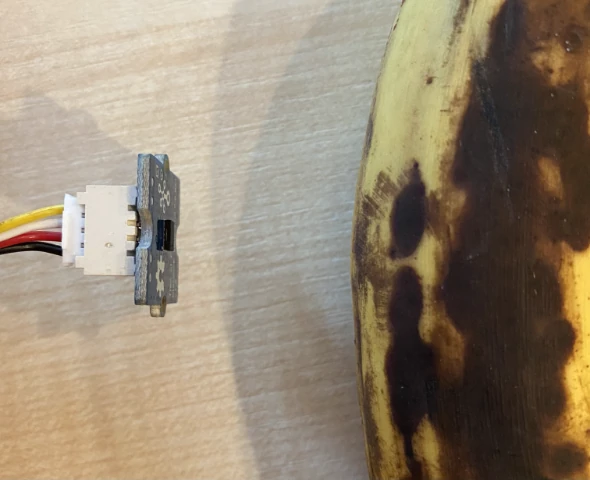

# Detectar proximidade - Raspberry Pi

Nesta parte da lição, você adicionará um sensor de proximidade ao seu Raspberry Pi e lerá a distância dele.

## Hardware

O Raspberry Pi precisa de um sensor de proximidade.

O sensor que você usará é um [sensor de distância Grove Time of Flight](https://www.seeedstudio.com/Grove-Time-of-Flight-Distance-Sensor-VL53L0X.html). Este sensor utiliza um módulo de medição a laser para detectar distância. Ele possui um alcance de 10mm a 2000mm (1cm - 2m) e reporta valores nesse intervalo com bastante precisão, sendo que distâncias acima de 1000mm são reportadas como 8109mm.

O medidor de distância a laser está na parte traseira do sensor, no lado oposto ao conector Grove.

Este é um sensor I²C.

### Conectar o sensor Time of Flight

O sensor Grove Time of Flight pode ser conectado ao Raspberry Pi.

#### Tarefa - conectar o sensor Time of Flight

Conecte o sensor Time of Flight.


1. Insira uma extremidade de um cabo Grove no conector do sensor Time of Flight. Ele só encaixará de uma maneira.

1. Com o Raspberry Pi desligado, conecte a outra extremidade do cabo Grove a um dos conectores I²C marcados como **I²C** no Grove Base Hat conectado ao Pi. Esses conectores estão na fileira inferior, no lado oposto aos pinos GPIO e próximos ao slot do cabo da câmera.


## Programar o sensor Time of Flight

Agora o Raspberry Pi pode ser programado para usar o sensor Time of Flight conectado.

### Tarefa - programar o sensor Time of Flight

Programe o dispositivo.

1. Ligue o Raspberry Pi e aguarde a inicialização.

1. Abra o código `fruit-quality-detector` no VS Code, diretamente no Pi ou conectando via a extensão Remote SSH.

1. Instale o pacote rpi-vl53l0x do Pip, um pacote Python que interage com o sensor de distância VL53L0X Time of Flight. Instale-o usando este comando pip:

    ```sh
    pip install rpi-vl53l0x
    ```

1. Crie um novo arquivo neste projeto chamado `distance-sensor.py`.

    > 💁 Uma maneira fácil de simular vários dispositivos IoT é criar cada um em um arquivo Python diferente e executá-los ao mesmo tempo.

1. Adicione o seguinte código a este arquivo:

    ```python
    import time
    
    from grove.i2c import Bus
    from rpi_vl53l0x.vl53l0x import VL53L0X
    ```

    Isso importa a biblioteca Grove I²C bus e uma biblioteca de sensor para o hardware principal integrado ao sensor Grove Time of Flight.

1. Abaixo disso, adicione o seguinte código para acessar o sensor:

    ```python
    distance_sensor = VL53L0X(bus = Bus().bus)
    distance_sensor.begin()    
    ```

    Este código declara um sensor de distância usando o barramento Grove I²C e, em seguida, inicia o sensor.

1. Por fim, adicione um loop infinito para ler as distâncias:

    ```python
    while True:
        distance_sensor.wait_ready()
        print(f'Distance = {distance_sensor.get_distance()} mm')
        time.sleep(1)
    ```

    Este código aguarda um valor estar pronto para ser lido do sensor e, em seguida, o imprime no console.

1. Execute este código.

    > 💁 Não se esqueça de que este arquivo se chama `distance-sensor.py`! Certifique-se de executá-lo via Python, não `app.py`.

1. Você verá as medições de distância aparecerem no console. Posicione objetos próximos ao sensor e verá a medição de distância:

    ```output
    pi@raspberrypi:~/fruit-quality-detector $ python3 distance_sensor.py 
    Distance = 29 mm
    Distance = 28 mm
    Distance = 30 mm
    Distance = 151 mm
    ```

    O medidor de distância está na parte traseira do sensor, então certifique-se de usar o lado correto ao medir a distância.

    

> 💁 Você pode encontrar este código na pasta [code-proximity/pi](../../../../../4-manufacturing/lessons/4-trigger-fruit-detector/code-proximity/pi).

😀 Seu programa de sensor de proximidade foi um sucesso!

---

**Aviso Legal**:  
Este documento foi traduzido utilizando o serviço de tradução por IA [Co-op Translator](https://github.com/Azure/co-op-translator). Embora nos esforcemos para garantir a precisão, esteja ciente de que traduções automatizadas podem conter erros ou imprecisões. O documento original em seu idioma nativo deve ser considerado a fonte autoritativa. Para informações críticas, recomenda-se a tradução profissional realizada por humanos. Não nos responsabilizamos por quaisquer mal-entendidos ou interpretações equivocadas decorrentes do uso desta tradução.