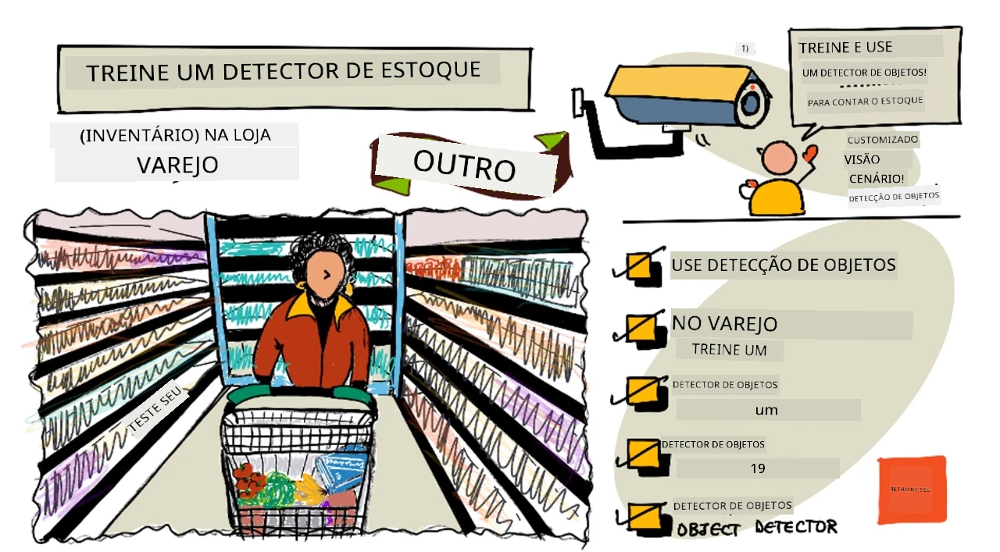
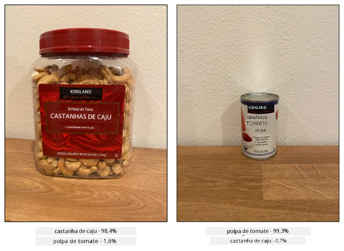
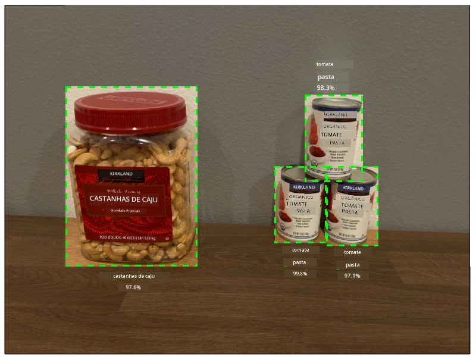
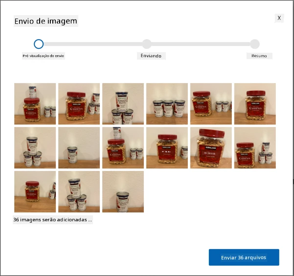
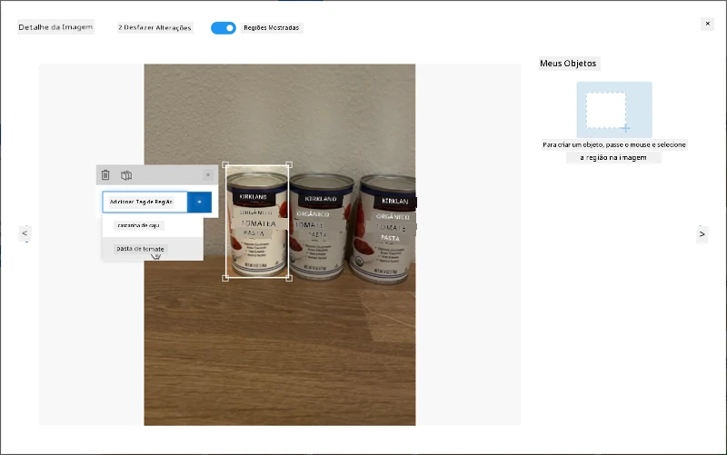
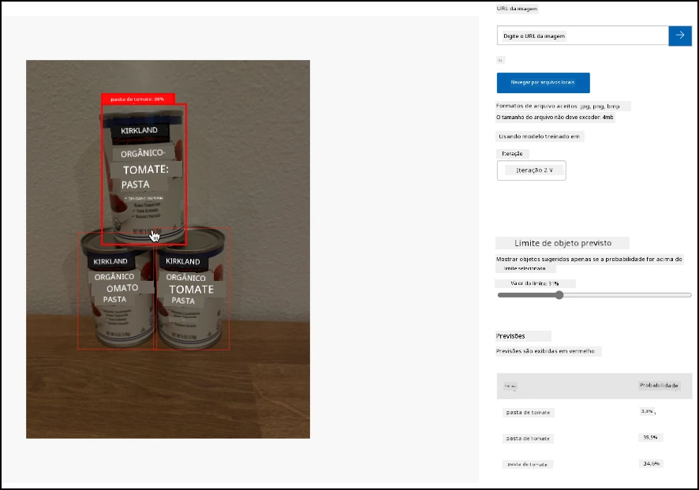

# Treine um detector de estoque

> Ilustração por [Nitya Narasimhan](https://github.com/nitya). Clique na imagem para uma versão maior.

Este vídeo oferece uma visão geral sobre Detecção de Objetos com o serviço Azure Custom Vision, um serviço que será abordado nesta lição.

> 🎥 Clique na imagem acima para assistir ao vídeo

## Questionário pré-aula

[Questionário pré-aula](https://black-meadow-040d15503.1.azurestaticapps.net/quiz/37)

## Introdução

No projeto anterior, você utilizou IA para treinar um classificador de imagens - um modelo que pode identificar se uma imagem contém algo, como frutas maduras ou não maduras. Outro tipo de modelo de IA que pode ser usado com imagens é a detecção de objetos. Esses modelos não classificam uma imagem por meio de tags; em vez disso, eles são treinados para reconhecer objetos e podem localizá-los em imagens, não apenas detectando que o objeto está presente, mas também onde ele está na imagem. Isso permite contar objetos em imagens.

Nesta lição, você aprenderá sobre detecção de objetos, incluindo como ela pode ser usada no varejo. Você também aprenderá a treinar um detector de objetos na nuvem.

Nesta lição, abordaremos:

* [Detecção de objetos](../../../../../5-retail/lessons/1-train-stock-detector)
* [Uso da detecção de objetos no varejo](../../../../../5-retail/lessons/1-train-stock-detector)
* [Treinamento de um detector de objetos](../../../../../5-retail/lessons/1-train-stock-detector)
* [Teste do seu detector de objetos](../../../../../5-retail/lessons/1-train-stock-detector)
* [Re-treinamento do seu detector de objetos](../../../../../5-retail/lessons/1-train-stock-detector)

## Detecção de objetos

A detecção de objetos envolve identificar objetos em imagens usando IA. Diferentemente do classificador de imagens que você treinou no último projeto, a detecção de objetos não se trata de prever a melhor tag para uma imagem como um todo, mas de encontrar um ou mais objetos em uma imagem.

### Detecção de objetos vs classificação de imagens

A classificação de imagens consiste em classificar uma imagem como um todo - quais são as probabilidades de que a imagem inteira corresponda a cada tag. Você recebe de volta as probabilidades para cada tag usada para treinar o modelo.

No exemplo acima, duas imagens são classificadas usando um modelo treinado para classificar potes de castanhas de caju ou latas de extrato de tomate. A primeira imagem é um pote de castanhas de caju e apresenta dois resultados do classificador de imagens:

| Tag            | Probabilidade |
| -------------- | ------------: |
| `castanhas de caju` | 98,4%       |
| `extrato de tomate` | 1,6%        |

A segunda imagem é uma lata de extrato de tomate, e os resultados são:

| Tag            | Probabilidade |
| -------------- | ------------: |
| `castanhas de caju` | 0,7%        |
| `extrato de tomate` | 99,3%       |

Você poderia usar esses valores com um limite de porcentagem para prever o que está na imagem. Mas e se uma imagem contivesse várias latas de extrato de tomate ou tanto castanhas de caju quanto extrato de tomate? Os resultados provavelmente não dariam o que você deseja. É aqui que entra a detecção de objetos.

A detecção de objetos envolve treinar um modelo para reconhecer objetos. Em vez de fornecer imagens contendo o objeto e dizer que cada imagem é uma tag ou outra, você destaca a seção de uma imagem que contém o objeto específico e a marca. Você pode marcar um único objeto em uma imagem ou vários. Dessa forma, o modelo aprende como o objeto em si se parece, e não apenas como são as imagens que contêm o objeto.

Quando você o utiliza para prever imagens, em vez de receber uma lista de tags e porcentagens, você recebe uma lista de objetos detectados, com suas caixas delimitadoras e a probabilidade de que o objeto corresponda à tag atribuída.

> 🎓 *Caixas delimitadoras* são as caixas ao redor de um objeto.

A imagem acima contém tanto um pote de castanhas de caju quanto três latas de extrato de tomate. O detector de objetos detectou as castanhas de caju, retornando a caixa delimitadora que contém as castanhas com a probabilidade de 97,6%. O detector de objetos também detectou três latas de extrato de tomate, fornecendo três caixas delimitadoras separadas, uma para cada lata detectada, e cada uma com uma probabilidade de que a caixa delimitadora contenha uma lata de extrato de tomate.

✅ Pense em alguns cenários diferentes nos quais você poderia usar modelos de IA baseados em imagens. Quais deles precisariam de classificação e quais precisariam de detecção de objetos?

### Como funciona a detecção de objetos

A detecção de objetos utiliza modelos de aprendizado de máquina complexos. Esses modelos funcionam dividindo a imagem em várias células e verificando se o centro da caixa delimitadora corresponde ao centro de uma imagem que combina com uma das imagens usadas para treinar o modelo. Você pode pensar nisso como uma espécie de execução de um classificador de imagens em diferentes partes da imagem para procurar correspondências.

> 💁 Esta é uma simplificação drástica. Existem muitas técnicas para detecção de objetos, e você pode ler mais sobre elas na [página de Detecção de Objetos na Wikipedia](https://wikipedia.org/wiki/Object_detection).

Existem vários modelos diferentes que podem realizar detecção de objetos. Um modelo particularmente famoso é o [YOLO (You Only Look Once)](https://pjreddie.com/darknet/yolo/), que é incrivelmente rápido e pode detectar 20 classes diferentes de objetos, como pessoas, cães, garrafas e carros.

✅ Leia mais sobre o modelo YOLO em [pjreddie.com/darknet/yolo/](https://pjreddie.com/darknet/yolo/)

Os modelos de detecção de objetos podem ser re-treinados usando aprendizado por transferência para detectar objetos personalizados.

## Uso da detecção de objetos no varejo

A detecção de objetos tem múltiplos usos no varejo. Alguns incluem:

* **Verificação e contagem de estoque** - reconhecer quando o estoque está baixo nas prateleiras. Se o estoque estiver muito baixo, notificações podem ser enviadas para funcionários ou robôs reabastecerem as prateleiras.
* **Detecção de máscaras** - em lojas com políticas de uso de máscaras durante eventos de saúde pública, a detecção de objetos pode reconhecer pessoas com e sem máscaras.
* **Cobrança automatizada** - detectar itens retirados das prateleiras em lojas automatizadas e cobrar os clientes de forma apropriada.
* **Detecção de perigos** - reconhecer itens quebrados no chão ou líquidos derramados, alertando equipes de limpeza.

✅ Faça uma pesquisa: Quais são outros casos de uso para detecção de objetos no varejo?

## Treinamento de um detector de objetos

Você pode treinar um detector de objetos usando o Custom Vision, de forma semelhante ao treinamento de um classificador de imagens.

### Tarefa - criar um detector de objetos

1. Crie um Grupo de Recursos para este projeto chamado `stock-detector`.

1. Crie um recurso gratuito de treinamento do Custom Vision e um recurso gratuito de previsão do Custom Vision no grupo de recursos `stock-detector`. Nomeie-os como `stock-detector-training` e `stock-detector-prediction`.

    > 💁 Você só pode ter um recurso gratuito de treinamento e previsão, então certifique-se de ter limpado seu projeto das lições anteriores.

    > ⚠️ Você pode consultar [as instruções para criar recursos de treinamento e previsão do projeto 4, lição 1, se necessário](../../../4-manufacturing/lessons/1-train-fruit-detector/README.md#task---create-a-cognitive-services-resource).

1. Acesse o portal do Custom Vision em [CustomVision.ai](https://customvision.ai) e faça login com a conta Microsoft usada para sua conta Azure.

1. Siga a [seção Criar um novo projeto do guia rápido de construção de um detector de objetos na documentação da Microsoft](https://docs.microsoft.com/azure/cognitive-services/custom-vision-service/get-started-build-detector?WT.mc_id=academic-17441-jabenn#create-a-new-project) para criar um novo projeto no Custom Vision. A interface pode mudar, e esses documentos são sempre a referência mais atualizada.

    Nomeie seu projeto como `stock-detector`.

    Ao criar seu projeto, certifique-se de usar o recurso `stock-detector-training` que você criou anteriormente. Use o tipo de projeto *Detecção de Objetos* e o domínio *Produtos em Prateleiras*.

    

    ✅ O domínio de produtos em prateleiras é especificamente direcionado para detectar estoque em prateleiras de lojas. Leia mais sobre os diferentes domínios na [documentação Selecionar um domínio na Microsoft Docs](https://docs.microsoft.com/azure/cognitive-services/custom-vision-service/select-domain?WT.mc_id=academic-17441-jabenn#object-detection).

✅ Reserve um tempo para explorar a interface do Custom Vision para o seu detector de objetos.

### Tarefa - treinar seu detector de objetos

Para treinar seu modelo, você precisará de um conjunto de imagens contendo os objetos que deseja detectar.

1. Reúna imagens que contenham o objeto a ser detectado. Você precisará de pelo menos 15 imagens contendo cada objeto a ser detectado, de uma variedade de ângulos diferentes e em diferentes condições de iluminação, mas quanto mais, melhor. Este detector de objetos usa o domínio *Produtos em prateleiras*, então tente organizar os objetos como se estivessem em uma prateleira de loja. Você também precisará de algumas imagens para testar o modelo. Se estiver detectando mais de um objeto, será necessário ter algumas imagens de teste que contenham todos os objetos.

    > 💁 Imagens com vários objetos diferentes contam para o mínimo de 15 imagens para todos os objetos na imagem.

    Suas imagens devem ser em formato png ou jpeg, com menos de 6MB. Se você as criar com um iPhone, por exemplo, elas podem ser imagens HEIC de alta resolução, então será necessário convertê-las e possivelmente reduzi-las. Quanto mais imagens, melhor, e você deve ter um número semelhante de objetos maduros e não maduros.

    O modelo é projetado para produtos em prateleiras, então tente tirar as fotos dos objetos em prateleiras.

    Você pode encontrar algumas imagens de exemplo que podem ser usadas na pasta [images](../../../../../5-retail/lessons/1-train-stock-detector/images) de castanhas de caju e extrato de tomate.

1. Siga a [seção Fazer upload e marcar imagens do guia rápido de construção de um detector de objetos na documentação da Microsoft](https://docs.microsoft.com/azure/cognitive-services/custom-vision-service/get-started-build-detector?WT.mc_id=academic-17441-jabenn#upload-and-tag-images) para fazer upload de suas imagens de treinamento. Crie tags relevantes dependendo dos tipos de objetos que deseja detectar.

    

    Ao desenhar caixas delimitadoras para os objetos, mantenha-as bem ajustadas ao redor do objeto. Pode levar algum tempo para marcar todas as imagens, mas a ferramenta detectará o que acredita serem as caixas delimitadoras, tornando o processo mais rápido.

    

    > 💁 Se você tiver mais de 15 imagens para cada objeto, pode treinar após 15 e usar o recurso **Tags sugeridas**. Isso usará o modelo treinado para detectar os objetos na imagem não marcada. Você pode então confirmar os objetos detectados ou rejeitar e redesenhar as caixas delimitadoras. Isso pode economizar *muito* tempo.

1. Siga a [seção Treinar o detector do guia rápido de construção de um detector de objetos na documentação da Microsoft](https://docs.microsoft.com/azure/cognitive-services/custom-vision-service/get-started-build-detector?WT.mc_id=academic-17441-jabenn#train-the-detector) para treinar o detector de objetos com suas imagens marcadas.

    Você terá a opção de escolher o tipo de treinamento. Selecione **Treinamento Rápido**.

O detector de objetos será treinado. O treinamento levará alguns minutos para ser concluído.

## Teste do seu detector de objetos

Depois que seu detector de objetos for treinado, você poderá testá-lo fornecendo novas imagens para detectar objetos.

### Tarefa - testar seu detector de objetos

1. Use o botão **Teste Rápido** para fazer upload de imagens de teste e verificar se os objetos são detectados. Use as imagens de teste que você criou anteriormente, não as imagens usadas para treinamento.

    

1. Teste todas as imagens de teste que você tiver e observe as probabilidades.

## Re-treinamento do seu detector de objetos

Quando você testa seu detector de objetos, ele pode não fornecer os resultados esperados, assim como os classificadores de imagens no projeto anterior. Você pode melhorar seu detector de objetos re-treinando-o com imagens que ele errou.

Sempre que você faz uma previsão usando a opção de teste rápido, a imagem e os resultados são armazenados. Você pode usar essas imagens para re-treinar seu modelo.

1. Use a aba **Previsões** para localizar as imagens que você usou para teste.

1. Confirme quaisquer detecções precisas, exclua as incorretas e adicione quaisquer objetos ausentes.

1. Re-treine e re-teste o modelo.

---

## 🚀 Desafio

O que aconteceria se você usasse o detector de objetos com itens de aparência semelhante, como latas da mesma marca de extrato de tomate e tomates picados?

Se você tiver itens de aparência semelhante, teste adicionando imagens deles ao seu detector de objetos.

## Questionário pós-aula
[Quiz pós-aula](https://black-meadow-040d15503.1.azurestaticapps.net/quiz/38)

## Revisão e Autoestudo

* Quando você treinou seu detector de objetos, deve ter visto valores como *Precisão*, *Recall* e *mAP* que avaliam o modelo criado. Leia sobre o que esses valores significam usando [a seção Avaliar o detector do guia rápido de Construir um detector de objetos nos documentos da Microsoft](https://docs.microsoft.com/azure/cognitive-services/custom-vision-service/get-started-build-detector?WT.mc_id=academic-17441-jabenn#evaluate-the-detector)
* Leia mais sobre detecção de objetos na [página de Detecção de objetos na Wikipedia](https://wikipedia.org/wiki/Object_detection)

## Tarefa

[Comparar domínios](assignment.md)

---

**Aviso Legal**:  
Este documento foi traduzido utilizando o serviço de tradução por IA [Co-op Translator](https://github.com/Azure/co-op-translator). Embora nos esforcemos para garantir a precisão, esteja ciente de que traduções automatizadas podem conter erros ou imprecisões. O documento original em seu idioma nativo deve ser considerado a fonte autoritativa. Para informações críticas, recomenda-se a tradução profissional realizada por humanos. Não nos responsabilizamos por quaisquer mal-entendidos ou interpretações equivocadas decorrentes do uso desta tradução.