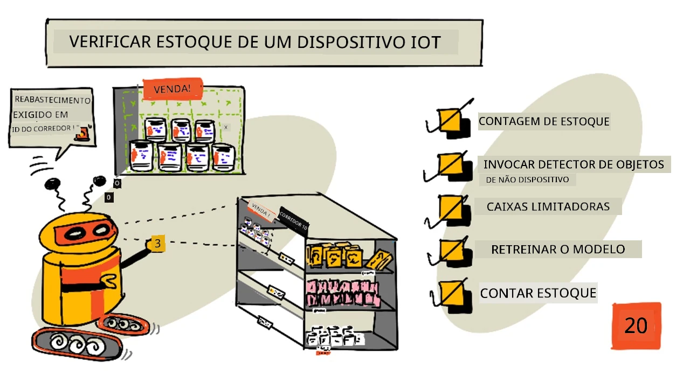
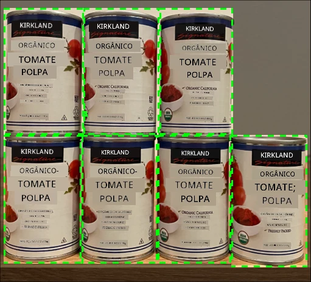
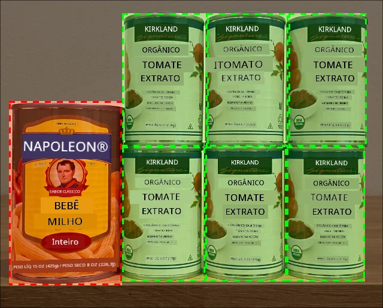
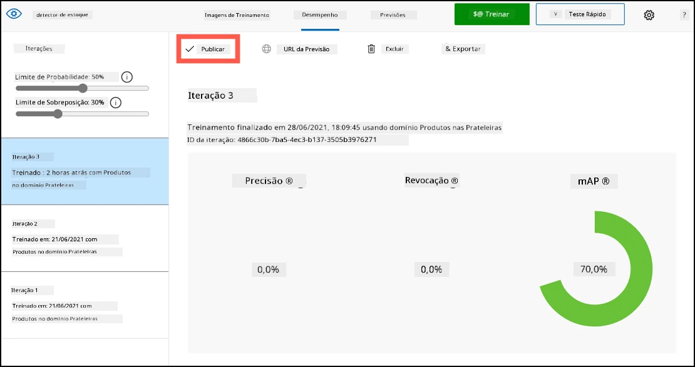
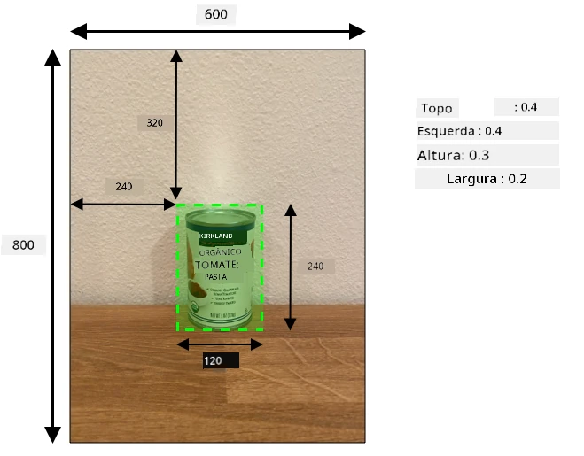
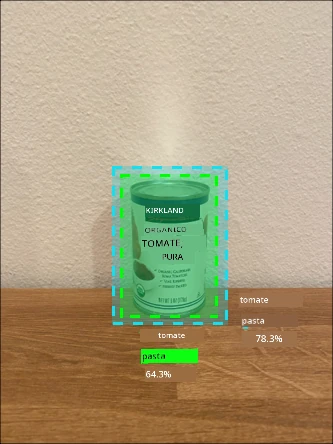

# Verificar estoque com um dispositivo IoT



> Ilustração por [Nitya Narasimhan](https://github.com/nitya). Clique na imagem para uma versão maior.

## Quiz pré-aula

[Quiz pré-aula](https://black-meadow-040d15503.1.azurestaticapps.net/quiz/39)

## Introdução

Na lição anterior, você aprendeu sobre os diferentes usos da detecção de objetos no varejo. Também aprendeu a treinar um detector de objetos para identificar estoque. Nesta lição, você aprenderá como usar seu detector de objetos a partir de um dispositivo IoT para contar estoque.

Nesta lição, abordaremos:

* [Contagem de estoque](../../../../../5-retail/lessons/2-check-stock-device)
* [Chamar seu detector de objetos a partir do seu dispositivo IoT](../../../../../5-retail/lessons/2-check-stock-device)
* [Caixas delimitadoras](../../../../../5-retail/lessons/2-check-stock-device)
* [Treinar novamente o modelo](../../../../../5-retail/lessons/2-check-stock-device)
* [Contar estoque](../../../../../5-retail/lessons/2-check-stock-device)

> 🗑 Esta é a última lição deste projeto, então, após concluir esta lição e a tarefa, não se esqueça de limpar seus serviços na nuvem. Você precisará dos serviços para concluir a tarefa, então certifique-se de fazer isso primeiro.
>
> Consulte [o guia de limpeza do projeto](../../../clean-up.md) se necessário para instruções sobre como fazer isso.

## Contagem de estoque

Detectores de objetos podem ser usados para verificar estoque, seja contando itens ou garantindo que eles estejam onde deveriam estar. Dispositivos IoT com câmeras podem ser implantados em toda a loja para monitorar o estoque, começando por áreas estratégicas onde é importante manter os itens reabastecidos, como locais onde há poucos itens de alto valor.

Por exemplo, se uma câmera estiver apontada para uma prateleira que pode conter 8 latas de extrato de tomate, e um detector de objetos identificar apenas 7 latas, então uma está faltando e precisa ser reabastecida.



Na imagem acima, um detector de objetos identificou 7 latas de extrato de tomate em uma prateleira que pode conter 8 latas. O dispositivo IoT não apenas pode enviar uma notificação sobre a necessidade de reabastecimento, mas também pode indicar a localização do item faltante, um dado importante se você estiver usando robôs para reabastecer prateleiras.

> 💁 Dependendo da loja e da popularidade do item, o reabastecimento provavelmente não aconteceria se apenas 1 lata estivesse faltando. Você precisaria construir um algoritmo que determine quando reabastecer com base no produto, nos clientes e em outros critérios.

✅ Em quais outros cenários você poderia combinar detecção de objetos e robôs?

Às vezes, o estoque errado pode estar nas prateleiras. Isso pode ocorrer devido a erro humano ao reabastecer ou clientes mudando de ideia sobre uma compra e colocando um item de volta no primeiro espaço disponível. Quando se trata de itens não perecíveis, como alimentos enlatados, isso é apenas um incômodo. Se for um item perecível, como produtos congelados ou refrigerados, isso pode significar que o produto não pode mais ser vendido, pois pode ser impossível determinar quanto tempo o item ficou fora do freezer.

A detecção de objetos pode ser usada para identificar itens inesperados, alertando um humano ou robô para devolver o item assim que for detectado.



Na imagem acima, uma lata de milho em conserva foi colocada na prateleira ao lado do extrato de tomate. O detector de objetos identificou isso, permitindo que o dispositivo IoT notificasse um humano ou robô para devolver a lata ao local correto.

## Chamar seu detector de objetos a partir do seu dispositivo IoT

O detector de objetos que você treinou na última lição pode ser chamado a partir do seu dispositivo IoT.

### Tarefa - publicar uma iteração do seu detector de objetos

As iterações são publicadas no portal Custom Vision.

1. Acesse o portal Custom Vision em [CustomVision.ai](https://customvision.ai) e faça login, caso ainda não tenha feito. Em seguida, abra seu projeto `stock-detector`.

1. Selecione a aba **Performance** nas opções do topo.

1. Escolha a última iteração na lista *Iterations* ao lado.

1. Clique no botão **Publish** para a iteração.

    

1. No diálogo *Publish Model*, configure o *Prediction resource* para o recurso `stock-detector-prediction` que você criou na última lição. Mantenha o nome como `Iteration2` e clique no botão **Publish**.

1. Após publicar, clique no botão **Prediction URL**. Isso mostrará os detalhes da API de previsão, que você precisará para chamar o modelo a partir do seu dispositivo IoT. A seção inferior está rotulada como *If you have an image file*, e esses são os detalhes que você quer. Copie o URL exibido, que será algo como:

    ```output
    https://<location>.api.cognitive.microsoft.com/customvision/v3.0/Prediction/<id>/detect/iterations/Iteration2/image
    ```

    Onde `<location>` será a localização usada ao criar seu recurso Custom Vision, e `<id>` será um longo ID composto por letras e números.

    Também copie o valor de *Prediction-Key*. Esta é uma chave segura que você deve passar ao chamar o modelo. Apenas aplicativos que fornecem essa chave podem usar o modelo; qualquer outro será rejeitado.

    

✅ Quando uma nova iteração é publicada, ela terá um nome diferente. Como você acha que poderia alterar a iteração que um dispositivo IoT está usando?

### Tarefa - chamar seu detector de objetos a partir do seu dispositivo IoT

Siga o guia relevante abaixo para usar o detector de objetos a partir do seu dispositivo IoT:

* [Arduino - Wio Terminal](wio-terminal-object-detector.md)
* [Computador de placa única - Raspberry Pi/Dispositivo virtual](single-board-computer-object-detector.md)

## Caixas delimitadoras

Ao usar o detector de objetos, você não apenas recebe os objetos detectados com suas tags e probabilidades, mas também as caixas delimitadoras dos objetos. Estas definem onde o detector identificou o objeto com a probabilidade dada.

> 💁 Uma caixa delimitadora é uma área que define os limites do objeto detectado.

Os resultados de uma previsão na aba **Predictions** do Custom Vision têm as caixas delimitadoras desenhadas na imagem enviada para previsão.


Na imagem acima, 4 latas de extrato de tomate foram detectadas. Nos resultados, um quadrado vermelho é sobreposto para cada objeto detectado na imagem, indicando a caixa delimitadora.

✅ Abra as previsões no Custom Vision e confira as caixas delimitadoras.

As caixas delimitadoras são definidas com 4 valores - topo, esquerda, altura e largura. Esses valores estão em uma escala de 0-1, representando as posições como uma porcentagem do tamanho da imagem. A origem (posição 0,0) é o canto superior esquerdo da imagem, então o valor de topo é a distância do topo, e o fundo da caixa delimitadora é o topo mais a altura.



A imagem acima tem 600 pixels de largura e 800 pixels de altura. A caixa delimitadora começa a 320 pixels abaixo, dando um valor de topo de 0.4 (800 x 0.4 = 320). Da esquerda, a caixa começa a 240 pixels, dando um valor de esquerda de 0.4 (600 x 0.4 = 240). A altura da caixa é de 240 pixels, dando um valor de altura de 0.3 (800 x 0.3 = 240). A largura da caixa é de 120 pixels, dando um valor de largura de 0.2 (600 x 0.2 = 120).

| Coordenada | Valor |
| ---------- | ----: |
| Topo       | 0.4   |
| Esquerda   | 0.4   |
| Altura     | 0.3   |
| Largura    | 0.2   |

Usar valores percentuais de 0-1 significa que, independentemente do tamanho da imagem, a caixa delimitadora começa 0.4 do caminho ao longo e abaixo, e tem 0.3 da altura e 0.2 da largura.

Você pode usar caixas delimitadoras combinadas com probabilidades para avaliar a precisão de uma detecção. Por exemplo, um detector de objetos pode identificar múltiplos objetos que se sobrepõem, como detectar uma lata dentro de outra. Seu código pode analisar as caixas delimitadoras, entender que isso é impossível e ignorar quaisquer objetos que tenham uma sobreposição significativa com outros.



No exemplo acima, uma caixa delimitadora indicou uma lata de extrato de tomate com 78.3% de probabilidade. Uma segunda caixa delimitadora é ligeiramente menor e está dentro da primeira, com uma probabilidade de 64.3%. Seu código pode verificar as caixas delimitadoras, ver que elas se sobrepõem completamente e ignorar a probabilidade menor, já que não há como uma lata estar dentro de outra.

✅ Você consegue pensar em uma situação onde seria válido detectar um objeto dentro de outro?

## Treinar novamente o modelo

Assim como no classificador de imagens, você pode treinar novamente seu modelo usando dados capturados pelo seu dispositivo IoT. Usar esses dados do mundo real garantirá que seu modelo funcione bem quando usado a partir do seu dispositivo IoT.

Diferentemente do classificador de imagens, você não pode apenas marcar uma imagem. Em vez disso, é necessário revisar cada caixa delimitadora detectada pelo modelo. Se a caixa estiver ao redor do objeto errado, ela precisa ser excluída; se estiver na localização errada, precisa ser ajustada.

### Tarefa - treinar novamente o modelo

1. Certifique-se de ter capturado uma variedade de imagens usando seu dispositivo IoT.

1. Na aba **Predictions**, selecione uma imagem. Você verá caixas vermelhas indicando as caixas delimitadoras dos objetos detectados.

1. Trabalhe em cada caixa delimitadora. Selecione-a primeiro e verá um pop-up mostrando a tag. Use os manipuladores nos cantos da caixa para ajustar o tamanho, se necessário. Se a tag estiver errada, remova-a com o botão **X** e adicione a tag correta. Se a caixa delimitadora não contiver um objeto, exclua-a com o botão de lixeira.

1. Feche o editor ao terminar, e a imagem será movida da aba **Predictions** para a aba **Training Images**. Repita o processo para todas as previsões.

1. Use o botão **Train** para treinar novamente seu modelo. Após o treinamento, publique a iteração e atualize seu dispositivo IoT para usar o URL da nova iteração.

1. Reimplante seu código e teste seu dispositivo IoT.

## Contar estoque

Usando uma combinação do número de objetos detectados e das caixas delimitadoras, você pode contar o estoque em uma prateleira.

### Tarefa - contar estoque

Siga o guia relevante abaixo para contar estoque usando os resultados do detector de objetos a partir do seu dispositivo IoT:

* [Arduino - Wio Terminal](wio-terminal-count-stock.md)
* [Computador de placa única - Raspberry Pi/Dispositivo virtual](single-board-computer-count-stock.md)

---

## 🚀 Desafio

Você consegue detectar estoque incorreto? Treine seu modelo com múltiplos objetos e atualize seu aplicativo para alertá-lo se o estoque errado for detectado.

Talvez até leve isso adiante e detecte itens lado a lado na mesma prateleira, verificando se algo foi colocado no lugar errado ao definir limites nas caixas delimitadoras.

## Quiz pós-aula

[Quiz pós-aula](https://black-meadow-040d15503.1.azurestaticapps.net/quiz/40)

## Revisão e Autoestudo

* Saiba mais sobre como arquitetar um sistema completo de detecção de estoque no guia [Out of stock detection at the edge pattern guide on Microsoft Docs](https://docs.microsoft.com/hybrid/app-solutions/pattern-out-of-stock-at-edge?WT.mc_id=academic-17441-jabenn)
* Descubra outras maneiras de construir soluções completas para o varejo combinando uma variedade de serviços IoT e na nuvem assistindo ao vídeo [Behind the scenes of a retail solution - Hands On! no YouTube](https://www.youtube.com/watch?v=m3Pc300x2Mw).

## Tarefa

[Use seu detector de objetos na borda](assignment.md)

---

**Aviso Legal**:  
Este documento foi traduzido utilizando o serviço de tradução por IA [Co-op Translator](https://github.com/Azure/co-op-translator). Embora nos esforcemos para garantir a precisão, esteja ciente de que traduções automatizadas podem conter erros ou imprecisões. O documento original em seu idioma nativo deve ser considerado a fonte autoritativa. Para informações críticas, recomenda-se a tradução profissional realizada por humanos. Não nos responsabilizamos por quaisquer mal-entendidos ou interpretações equivocadas decorrentes do uso desta tradução.