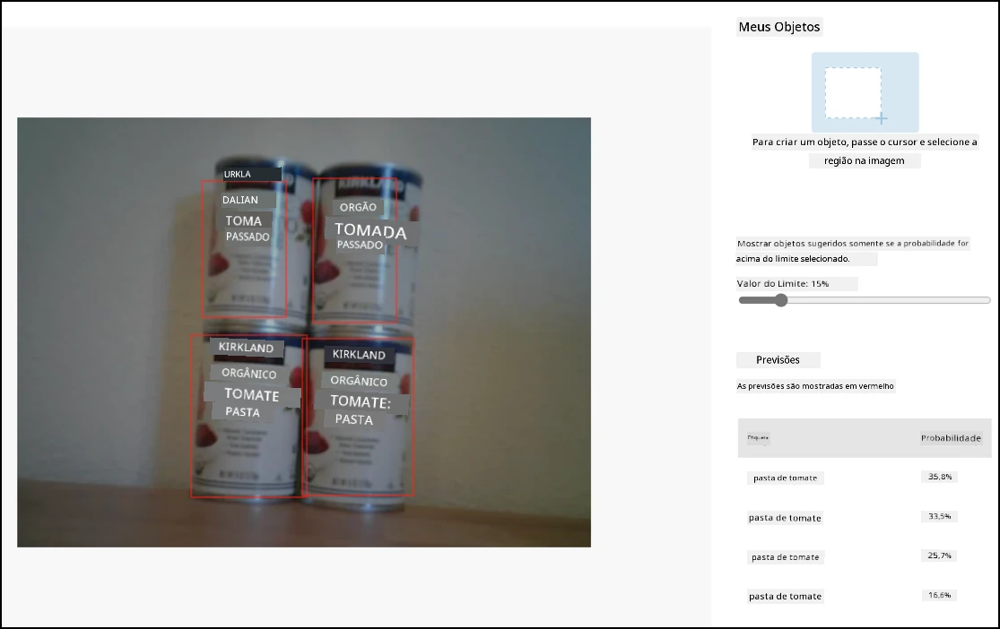

# Chame seu detector de objetos a partir do seu dispositivo IoT - Hardware Virtual de IoT e Raspberry Pi

Depois que seu detector de objetos for publicado, ele poderá ser usado a partir do seu dispositivo IoT.

## Copie o projeto do classificador de imagens

A maior parte do seu detector de estoque é semelhante ao classificador de imagens que você criou em uma lição anterior.

### Tarefa - copie o projeto do classificador de imagens

1. Crie uma pasta chamada `stock-counter` no seu computador, caso esteja usando um dispositivo IoT virtual, ou no seu Raspberry Pi. Se estiver usando um dispositivo IoT virtual, certifique-se de configurar um ambiente virtual.

1. Configure o hardware da câmera.

    * Se estiver usando um Raspberry Pi, será necessário instalar a PiCamera. Você também pode querer fixar a câmera em uma posição única, por exemplo, pendurando o cabo sobre uma caixa ou lata, ou fixando a câmera em uma caixa com fita dupla face.
    * Se estiver usando um dispositivo IoT virtual, será necessário instalar o CounterFit e o CounterFit PyCamera shim. Caso vá usar imagens estáticas, capture algumas imagens que seu detector de objetos ainda não tenha visto. Se for usar sua webcam, certifique-se de posicioná-la de forma que consiga ver o estoque que você está detectando.

1. Replique os passos da [lição 2 do projeto de manufatura](../../../4-manufacturing/lessons/2-check-fruit-from-device/README.md#task---capture-an-image-using-an-iot-device) para capturar imagens da câmera.

1. Replique os passos da [lição 2 do projeto de manufatura](../../../4-manufacturing/lessons/2-check-fruit-from-device/README.md#task---classify-images-from-your-iot-device) para chamar o classificador de imagens. A maior parte desse código será reutilizada para detectar objetos.

## Altere o código de um classificador para um detector de imagens

O código que você usou para classificar imagens é muito semelhante ao código para detectar objetos. A principal diferença está no método chamado no SDK do Custom Vision e nos resultados da chamada.

### Tarefa - altere o código de um classificador para um detector de imagens

1. Exclua as três linhas de código que classificam a imagem e processam as previsões:

    ```python
    results = predictor.classify_image(project_id, iteration_name, image)
    
    for prediction in results.predictions:
        print(f'{prediction.tag_name}:\t{prediction.probability * 100:.2f}%')
    ```

    Remova essas três linhas.

1. Adicione o seguinte código para detectar objetos na imagem:

    ```python
    results = predictor.detect_image(project_id, iteration_name, image)

    threshold = 0.3
    
    predictions = list(prediction for prediction in results.predictions if prediction.probability > threshold)
    
    for prediction in predictions:
        print(f'{prediction.tag_name}:\t{prediction.probability * 100:.2f}%')
    ```

    Este código chama o método `detect_image` no predictor para executar o detector de objetos. Em seguida, reúne todas as previsões com uma probabilidade acima de um limite, imprimindo-as no console.

    Diferentemente de um classificador de imagens que retorna apenas um resultado por tag, o detector de objetos retornará múltiplos resultados, então qualquer um com baixa probabilidade precisa ser filtrado.

1. Execute este código e ele capturará uma imagem, enviando-a para o detector de objetos, e imprimirá os objetos detectados. Se estiver usando um dispositivo IoT virtual, certifique-se de ter uma imagem apropriada configurada no CounterFit ou que sua webcam esteja selecionada. Se estiver usando um Raspberry Pi, certifique-se de que sua câmera esteja apontada para objetos em uma prateleira.

    ```output
    pi@raspberrypi:~/stock-counter $ python3 app.py 
    tomato paste:   34.13%
    tomato paste:   33.95%
    tomato paste:   35.05%
    tomato paste:   32.80%
    ```

    > 💁 Talvez seja necessário ajustar o `threshold` para um valor apropriado para suas imagens.

    Você poderá ver a imagem que foi capturada e esses valores na aba **Predictions** no Custom Vision.

    

> 💁 Você pode encontrar este código na pasta [code-detect/pi](../../../../../5-retail/lessons/2-check-stock-device/code-detect/pi) ou [code-detect/virtual-iot-device](../../../../../5-retail/lessons/2-check-stock-device/code-detect/virtual-iot-device).

😀 Seu programa de contador de estoque foi um sucesso!

---

**Aviso Legal**:  
Este documento foi traduzido utilizando o serviço de tradução por IA [Co-op Translator](https://github.com/Azure/co-op-translator). Embora nos esforcemos para garantir a precisão, esteja ciente de que traduções automatizadas podem conter erros ou imprecisões. O documento original em seu idioma nativo deve ser considerado a fonte autoritativa. Para informações críticas, recomenda-se a tradução profissional realizada por humanos. Não nos responsabilizamos por quaisquer mal-entendidos ou interpretações equivocadas decorrentes do uso desta tradução.