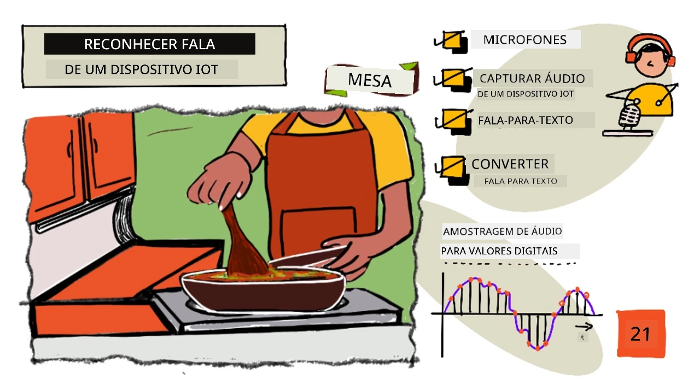
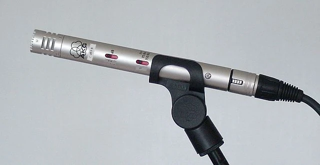
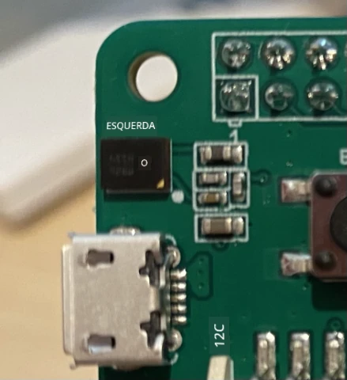
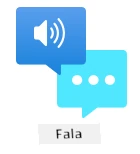

# Reconheça fala com um dispositivo IoT



> Ilustração por [Nitya Narasimhan](https://github.com/nitya). Clique na imagem para uma versão maior.

Este vídeo oferece uma visão geral do serviço de fala do Azure, um tópico que será abordado nesta lição:

[](https://www.youtube.com/watch?v=iW0Fw0l3mrA)

> 🎥 Clique na imagem acima para assistir ao vídeo

## Questionário pré-aula

[Questionário pré-aula](https://black-meadow-040d15503.1.azurestaticapps.net/quiz/41)

## Introdução

'Alexa, configure um cronômetro de 12 minutos'

'Alexa, qual o status do cronômetro?'

'Alexa, configure um cronômetro de 8 minutos chamado cozinhar brócolis no vapor'

Dispositivos inteligentes estão se tornando cada vez mais comuns. Não apenas como alto-falantes inteligentes, como HomePods, Echos e Google Homes, mas também integrados em nossos telefones, relógios e até mesmo em luminárias e termostatos.

> 💁 Eu tenho pelo menos 19 dispositivos na minha casa que possuem assistentes de voz, e isso é só o que eu sei!

O controle por voz aumenta a acessibilidade, permitindo que pessoas com mobilidade limitada interajam com dispositivos. Seja uma deficiência permanente, como nascer sem braços, uma deficiência temporária, como um braço quebrado, ou simplesmente ter as mãos ocupadas com compras ou crianças pequenas, poder controlar nossas casas com a voz em vez das mãos abre um mundo de possibilidades. Gritar 'Ei Siri, feche a porta da garagem' enquanto lida com uma troca de fralda e uma criança agitada pode ser uma pequena, mas significativa, melhoria na vida.

Um dos usos mais populares para assistentes de voz é configurar cronômetros, especialmente na cozinha. Poder configurar múltiplos cronômetros apenas com a voz é uma grande ajuda - não é necessário parar de sovar a massa, mexer a sopa ou limpar as mãos para usar um cronômetro físico.

Nesta lição, você aprenderá a incorporar reconhecimento de voz em dispositivos IoT. Você aprenderá sobre microfones como sensores, como capturar áudio de um microfone conectado a um dispositivo IoT e como usar IA para converter o que é ouvido em texto. Ao longo deste projeto, você construirá um cronômetro de cozinha inteligente, capaz de configurar cronômetros usando sua voz em vários idiomas.

Nesta lição, abordaremos:

* [Microfones](../../../../../6-consumer/lessons/1-speech-recognition)
* [Capturar áudio do seu dispositivo IoT](../../../../../6-consumer/lessons/1-speech-recognition)
* [Fala para texto](../../../../../6-consumer/lessons/1-speech-recognition)
* [Converter fala em texto](../../../../../6-consumer/lessons/1-speech-recognition)

## Microfones

Microfones são sensores analógicos que convertem ondas sonoras em sinais elétricos. Vibrações no ar fazem com que componentes no microfone se movam em pequenas quantidades, causando pequenas alterações nos sinais elétricos. Essas alterações são então amplificadas para gerar uma saída elétrica.

### Tipos de microfones

Microfones vêm em uma variedade de tipos:

* Dinâmico - Microfones dinâmicos possuem um ímã preso a um diafragma móvel que se move em uma bobina de fio, criando uma corrente elétrica. Isso é o oposto da maioria dos alto-falantes, que usam uma corrente elétrica para mover um ímã em uma bobina de fio, movendo um diafragma para criar som. Isso significa que alto-falantes podem ser usados como microfones dinâmicos, e microfones dinâmicos podem ser usados como alto-falantes. Em dispositivos como interfones, onde o usuário está ouvindo ou falando, mas não ambos ao mesmo tempo, um único dispositivo pode atuar como alto-falante e microfone.

    Microfones dinâmicos não precisam de energia para funcionar, o sinal elétrico é gerado inteiramente pelo microfone.

    

* Fita - Microfones de fita são semelhantes aos microfones dinâmicos, exceto que possuem uma fita de metal em vez de um diafragma. Essa fita se move em um campo magnético, gerando uma corrente elétrica. Assim como os microfones dinâmicos, os microfones de fita não precisam de energia para funcionar.

    

* Condensador - Microfones condensadores possuem um diafragma de metal fino e uma placa traseira de metal fixa. Eletricidade é aplicada a ambos, e à medida que o diafragma vibra, a carga estática entre as placas muda, gerando um sinal. Microfones condensadores precisam de energia para funcionar - chamada de *Phantom power*.

    

* MEMS - Microfones de sistemas microeletromecânicos, ou MEMS, são microfones em um chip. Eles possuem um diafragma sensível à pressão gravado em um chip de silício e funcionam de maneira semelhante a um microfone condensador. Esses microfones podem ser minúsculos e integrados em circuitos.

    

    Na imagem acima, o chip rotulado como **LEFT** é um microfone MEMS, com um diafragma minúsculo de menos de um milímetro de largura.

✅ Faça uma pesquisa: Quais microfones você tem ao seu redor - seja no seu computador, telefone, headset ou em outros dispositivos? Que tipo de microfones são eles?

### Áudio digital

O áudio é um sinal analógico que carrega informações muito detalhadas. Para converter esse sinal em digital, o áudio precisa ser amostrado milhares de vezes por segundo.

> 🎓 Amostragem é o processo de converter o sinal de áudio em um valor digital que representa o sinal naquele momento específico.


O áudio digital é amostrado usando Modulação por Código de Pulso, ou PCM. PCM envolve a leitura da voltagem do sinal e a seleção do valor discreto mais próximo dessa voltagem usando um tamanho definido.

> 💁 Você pode pensar no PCM como a versão sensorial da modulação por largura de pulso, ou PWM (PWM foi abordado na [lição 3 do projeto introdutório](../../../1-getting-started/lessons/3-sensors-and-actuators/README.md#pulse-width-modulation)). PCM envolve converter um sinal analógico em digital, enquanto PWM envolve converter um sinal digital em analógico.

Por exemplo, a maioria dos serviços de streaming de música oferece áudio de 16 bits ou 24 bits. Isso significa que eles convertem a voltagem em um valor que cabe em um número inteiro de 16 bits ou 24 bits. O áudio de 16 bits cabe em um número que varia de -32.768 a 32.767, enquanto o de 24 bits varia de -8.388.608 a 8.388.607. Quanto mais bits, mais próximo o som amostrado estará do que nossos ouvidos realmente ouvem.

> 💁 Você já deve ter ouvido falar de áudio de 8 bits, frequentemente chamado de LoFi. Este é o áudio amostrado usando apenas 8 bits, ou seja, de -128 a 127. O primeiro áudio de computador era limitado a 8 bits devido a restrições de hardware, por isso é frequentemente associado a jogos retrô.

Essas amostras são feitas milhares de vezes por segundo, usando taxas de amostragem bem definidas, medidas em KHz (milhares de leituras por segundo). Serviços de streaming de música usam 48KHz para a maioria dos áudios, mas alguns áudios 'sem perdas' usam até 96KHz ou mesmo 192KHz. Quanto maior a taxa de amostragem, mais próximo o áudio estará do original, até certo ponto. Há debates sobre se os humanos conseguem perceber a diferença acima de 48KHz.

✅ Faça uma pesquisa: Se você usa um serviço de streaming de música, qual é a taxa de amostragem e o tamanho que ele utiliza? Se você usa CDs, qual é a taxa de amostragem e o tamanho do áudio em CD?

Existem vários formatos diferentes para dados de áudio. Você provavelmente já ouviu falar de arquivos mp3 - dados de áudio comprimidos para torná-los menores sem perder qualidade. Áudio não comprimido geralmente é armazenado como um arquivo WAV - este é um arquivo com 44 bytes de informações de cabeçalho, seguido pelos dados de áudio brutos. O cabeçalho contém informações como a taxa de amostragem (por exemplo, 16000 para 16KHz), o tamanho da amostra (16 para 16 bits) e o número de canais. Após o cabeçalho, o arquivo WAV contém os dados de áudio brutos.

> 🎓 Canais referem-se a quantos fluxos de áudio diferentes compõem o áudio. Por exemplo, para áudio estéreo com canais esquerdo e direito, haveria 2 canais. Para som surround 7.1 em um sistema de home theater, seriam 8 canais.

### Tamanho dos dados de áudio

Os dados de áudio são relativamente grandes. Por exemplo, capturar áudio não comprimido de 16 bits a 16KHz (uma taxa boa o suficiente para uso com modelos de fala para texto) consome 32KB de dados para cada segundo de áudio:

* 16 bits significam 2 bytes por amostra (1 byte equivale a 8 bits).
* 16KHz são 16.000 amostras por segundo.
* 16.000 x 2 bytes = 32.000 bytes por segundo.

Isso pode parecer uma quantidade pequena de dados, mas se você estiver usando um microcontrolador com memória limitada, isso pode ser muito. Por exemplo, o Wio Terminal possui 192KB de memória, e essa memória precisa armazenar o código do programa e as variáveis. Mesmo que seu código seja pequeno, você não poderia capturar mais de 5 segundos de áudio.

Microcontroladores podem acessar armazenamento adicional, como cartões SD ou memória flash. Ao construir um dispositivo IoT que captura áudio, você precisará garantir não apenas que possui armazenamento adicional, mas que seu código grava o áudio capturado do microfone diretamente nesse armazenamento. Além disso, ao enviar o áudio para a nuvem, você deve transmitir diretamente do armazenamento para a solicitação web. Dessa forma, você evita esgotar a memória tentando armazenar todo o bloco de dados de áudio na memória de uma só vez.

## Capturar áudio do seu dispositivo IoT

Seu dispositivo IoT pode ser conectado a um microfone para capturar áudio, pronto para conversão em texto. Ele também pode ser conectado a alto-falantes para saída de áudio. Em lições posteriores, isso será usado para fornecer feedback de áudio, mas é útil configurar os alto-falantes agora para testar o microfone.

### Tarefa - configurar seu microfone e alto-falantes

Siga o guia relevante para configurar o microfone e os alto-falantes para o seu dispositivo IoT:

* [Arduino - Wio Terminal](wio-terminal-microphone.md)
* [Computador de placa única - Raspberry Pi](pi-microphone.md)
* [Computador de placa única - Dispositivo virtual](virtual-device-microphone.md)

### Tarefa - capturar áudio

Siga o guia relevante para capturar áudio no seu dispositivo IoT:

* [Arduino - Wio Terminal](wio-terminal-audio.md)
* [Computador de placa única - Raspberry Pi](pi-audio.md)
* [Computador de placa única - Dispositivo virtual](virtual-device-audio.md)

## Fala para texto

Fala para texto, ou reconhecimento de fala, envolve o uso de IA para converter palavras em um sinal de áudio em texto.

### Modelos de reconhecimento de fala

Para converter fala em texto, amostras do sinal de áudio são agrupadas e alimentadas em um modelo de aprendizado de máquina baseado em uma Rede Neural Recorrente (RNN). Este é um tipo de modelo de aprendizado de máquina que pode usar dados anteriores para tomar decisões sobre os dados recebidos. Por exemplo, a RNN pode detectar um bloco de amostras de áudio como o som 'Hel', e quando recebe outro que parece ser o som 'lo', ela pode combinar isso com o som anterior, descobrir que 'Hello' é uma palavra válida e selecionar isso como o resultado.

Modelos de aprendizado de máquina sempre aceitam dados do mesmo tamanho todas as vezes. O classificador de imagens que você construiu em uma lição anterior redimensiona imagens para um tamanho fixo antes de processá-las. O mesmo acontece com os modelos de fala, que precisam processar blocos de áudio de tamanho fixo. Os modelos de fala precisam ser capazes de combinar as saídas de várias previsões para obter a resposta, permitindo distinguir entre 'Oi' e 'Rodovia', ou 'rebanho' e 'floccinaucinihilipilificação'.

Os modelos de fala também são avançados o suficiente para entender o contexto e podem corrigir as palavras detectadas à medida que mais sons são processados. Por exemplo, se você disser "Fui às lojas para comprar duas bananas e uma maçã também", você usaria três palavras que soam iguais, mas são escritas de forma diferente - para, duas e também. Os modelos de fala são capazes de entender o contexto e usar a grafia apropriada para a palavra.
💁 Alguns serviços de fala permitem personalização para funcionar melhor em ambientes barulhentos, como fábricas, ou com palavras específicas de determinados setores, como nomes químicos. Essas personalizações são treinadas fornecendo áudio de exemplo e uma transcrição, e funcionam utilizando aprendizado por transferência, da mesma forma que você treinou um classificador de imagens usando apenas algumas imagens em uma lição anterior.
### Privacidade

Ao utilizar reconhecimento de fala em um dispositivo IoT de consumo, a privacidade é extremamente importante. Esses dispositivos escutam áudio continuamente, e como consumidor, você não quer que tudo o que você diz seja enviado para a nuvem e convertido em texto. Isso não apenas consome muita largura de banda da Internet, mas também tem grandes implicações para a privacidade, especialmente quando alguns fabricantes de dispositivos inteligentes selecionam aleatoriamente áudios para [humanos validarem em relação ao texto gerado para ajudar a melhorar seus modelos](https://www.theverge.com/2019/4/10/18305378/amazon-alexa-ai-voice-assistant-annotation-listen-private-recordings).

Você só quer que seu dispositivo inteligente envie áudio para a nuvem para processamento quando você estiver usando-o, e não quando ele ouvir sons em sua casa, que podem incluir reuniões privadas ou interações íntimas. A forma como a maioria dos dispositivos inteligentes funciona é com uma *palavra de ativação*, uma frase-chave como "Alexa", "Hey Siri" ou "OK Google", que faz com que o dispositivo 'acorde' e ouça o que você está dizendo até detectar uma pausa na sua fala, indicando que você terminou de falar com o dispositivo.

> 🎓 A detecção de palavras de ativação também é conhecida como *Keyword spotting* ou *Keyword recognition*.

Essas palavras de ativação são detectadas no próprio dispositivo, não na nuvem. Esses dispositivos inteligentes possuem pequenos modelos de IA que rodam no dispositivo e escutam a palavra de ativação. Quando ela é detectada, o dispositivo começa a transmitir o áudio para a nuvem para reconhecimento. Esses modelos são altamente especializados e só escutam a palavra de ativação.

> 💁 Algumas empresas de tecnologia estão adicionando mais privacidade aos seus dispositivos e realizando parte da conversão de fala para texto no próprio dispositivo. A Apple anunciou que, como parte das atualizações do iOS e macOS de 2021, suportará a conversão de fala para texto no dispositivo, sendo capaz de lidar com muitas solicitações sem precisar usar a nuvem. Isso é possível graças aos processadores poderosos em seus dispositivos, que podem executar modelos de ML.

✅ Quais você acha que são as implicações de privacidade e ética de armazenar o áudio enviado para a nuvem? Esse áudio deveria ser armazenado e, se sim, como? Você acha que o uso de gravações para aplicação da lei é uma boa troca pela perda de privacidade?

A detecção de palavras de ativação geralmente utiliza uma técnica conhecida como TinyML, que consiste em converter modelos de ML para que possam ser executados em microcontroladores. Esses modelos são pequenos em tamanho e consomem muito pouca energia para funcionar.

Para evitar a complexidade de treinar e usar um modelo de palavra de ativação, o cronômetro inteligente que você está construindo nesta lição usará um botão para ativar o reconhecimento de fala.

> 💁 Se você quiser tentar criar um modelo de detecção de palavras de ativação para rodar no Wio Terminal ou Raspberry Pi, confira este [tutorial de resposta à sua voz da Edge Impulse](https://docs.edgeimpulse.com/docs/responding-to-your-voice). Se quiser usar seu computador para isso, você pode experimentar o [guia rápido de introdução ao Custom Keyword na documentação da Microsoft](https://docs.microsoft.com/azure/cognitive-services/speech-service/keyword-recognition-overview?WT.mc_id=academic-17441-jabenn).

## Converter fala em texto



Assim como na classificação de imagens em um projeto anterior, existem serviços de IA pré-construídos que podem pegar fala como um arquivo de áudio e convertê-la em texto. Um desses serviços é o Speech Service, parte dos Cognitive Services, serviços de IA pré-construídos que você pode usar em seus aplicativos.

### Tarefa - configurar um recurso de IA de fala

1. Crie um Grupo de Recursos para este projeto chamado `smart-timer`.

1. Use o seguinte comando para criar um recurso de fala gratuito:

    ```sh
    az cognitiveservices account create --name smart-timer \
                                        --resource-group smart-timer \
                                        --kind SpeechServices \
                                        --sku F0 \
                                        --yes \
                                        --location <location>
    ```

    Substitua `<location>` pela localização usada ao criar o Grupo de Recursos.

1. Você precisará de uma chave de API para acessar o recurso de fala a partir do seu código. Execute o seguinte comando para obter a chave:

    ```sh
    az cognitiveservices account keys list --name smart-timer \
                                           --resource-group smart-timer \
                                           --output table
    ```

    Copie uma das chaves.

### Tarefa - converter fala em texto

Siga o guia relevante para converter fala em texto no seu dispositivo IoT:

* [Arduino - Wio Terminal](wio-terminal-speech-to-text.md)
* [Computador de placa única - Raspberry Pi](pi-speech-to-text.md)
* [Computador de placa única - Dispositivo virtual](virtual-device-speech-to-text.md)

---

## 🚀 Desafio

O reconhecimento de fala existe há muito tempo e está continuamente melhorando. Pesquise as capacidades atuais e compare como elas evoluíram ao longo do tempo, incluindo quão precisas são as transcrições feitas por máquinas em comparação com as feitas por humanos.

O que você acha que o futuro reserva para o reconhecimento de fala?

## Questionário pós-aula

[Questionário pós-aula](https://black-meadow-040d15503.1.azurestaticapps.net/quiz/42)

## Revisão e Autoestudo

* Leia sobre os diferentes tipos de microfones e como eles funcionam no [artigo sobre a diferença entre microfones dinâmicos e condensadores no Musician's HQ](https://musicianshq.com/whats-the-difference-between-dynamic-and-condenser-microphones/).
* Leia mais sobre o serviço de fala dos Cognitive Services na [documentação do serviço de fala na Microsoft Docs](https://docs.microsoft.com/azure/cognitive-services/speech-service/?WT.mc_id=academic-17441-jabenn).
* Leia sobre detecção de palavras-chave na [documentação de reconhecimento de palavras-chave na Microsoft Docs](https://docs.microsoft.com/azure/cognitive-services/speech-service/keyword-recognition-overview?WT.mc_id=academic-17441-jabenn).

## Tarefa

[](assignment.md)

---

**Aviso Legal**:  
Este documento foi traduzido utilizando o serviço de tradução por IA [Co-op Translator](https://github.com/Azure/co-op-translator). Embora nos esforcemos para garantir a precisão, esteja ciente de que traduções automatizadas podem conter erros ou imprecisões. O documento original em seu idioma nativo deve ser considerado a fonte autoritativa. Para informações críticas, recomenda-se a tradução profissional realizada por humanos. Não nos responsabilizamos por quaisquer mal-entendidos ou interpretações equivocadas decorrentes do uso desta tradução.