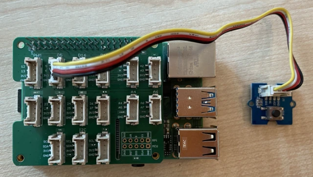

# Capturar áudio - Raspberry Pi

Nesta parte da lição, você escreverá um código para capturar áudio no seu Raspberry Pi. A captura de áudio será controlada por um botão.

## Hardware

O Raspberry Pi precisa de um botão para controlar a captura de áudio.

O botão que você usará é um botão Grove. Este é um sensor digital que liga ou desliga um sinal. Esses botões podem ser configurados para enviar um sinal alto quando o botão é pressionado e baixo quando não é, ou baixo quando pressionado e alto quando não está.

Se você estiver usando um ReSpeaker 2-Mics Pi HAT como microfone, não é necessário conectar um botão, pois este HAT já possui um embutido. Pule para a próxima seção.

### Conectar o botão

O botão pode ser conectado ao Grove Base Hat.

#### Tarefa - conectar o botão


1. Insira uma extremidade de um cabo Grove no soquete do módulo do botão. Ele só encaixará de uma maneira.

1. Com o Raspberry Pi desligado, conecte a outra extremidade do cabo Grove ao soquete digital marcado como **D5** no Grove Base Hat conectado ao Pi. Este soquete é o segundo da esquerda, na fileira de soquetes ao lado dos pinos GPIO.



## Capturar áudio

Você pode capturar áudio do microfone usando código em Python.

### Tarefa - capturar áudio

1. Ligue o Raspberry Pi e aguarde a inicialização.

1. Abra o VS Code, diretamente no Pi ou conecte-se via extensão Remote SSH.

1. O pacote PyAudio do Pip possui funções para gravar e reproduzir áudio. Este pacote depende de algumas bibliotecas de áudio que precisam ser instaladas primeiro. Execute os seguintes comandos no terminal para instalá-las:

    ```sh
    sudo apt update
    sudo apt install libportaudio0 libportaudio2 libportaudiocpp0 portaudio19-dev libasound2-plugins --yes 
    ```

1. Instale o pacote PyAudio do Pip.

    ```sh
    pip3 install pyaudio
    ```

1. Crie uma nova pasta chamada `smart-timer` e adicione um arquivo chamado `app.py` a esta pasta.

1. Adicione as seguintes importações no início deste arquivo:

    ```python
    import io
    import pyaudio
    import time
    import wave
    
    from grove.factory import Factory
    ```

    Isso importa o módulo `pyaudio`, alguns módulos padrão do Python para lidar com arquivos WAV e o módulo `grove.factory` para importar uma `Factory` e criar uma classe de botão.

1. Abaixo disso, adicione o código para criar um botão Grove.

    Se você estiver usando o ReSpeaker 2-Mics Pi HAT, use o seguinte código:

    ```python
    # The button on the ReSpeaker 2-Mics Pi HAT
    button = Factory.getButton("GPIO-LOW", 17)
    ```

    Isso cria um botão na porta **D17**, a porta à qual o botão do ReSpeaker 2-Mics Pi HAT está conectado. Este botão é configurado para enviar um sinal baixo quando pressionado.

    Se você não estiver usando o ReSpeaker 2-Mics Pi HAT e estiver usando um botão Grove conectado ao Base Hat, use este código:

    ```python
    button = Factory.getButton("GPIO-HIGH", 5)
    ```

    Isso cria um botão na porta **D5**, configurado para enviar um sinal alto quando pressionado.

1. Abaixo disso, crie uma instância da classe PyAudio para lidar com o áudio:

    ```python
    audio = pyaudio.PyAudio()
    ```

1. Declare o número da placa de hardware para o microfone e o alto-falante. Este será o número da placa que você encontrou ao executar `arecord -l` e `aplay -l` anteriormente nesta lição.

    ```python
    microphone_card_number = <microphone card number>
    speaker_card_number = <speaker card number>
    ```

    Substitua `<microphone card number>` pelo número da placa do seu microfone.

    Substitua `<speaker card number>` pelo número da placa do seu alto-falante, o mesmo número que você configurou no arquivo `alsa.conf`.

1. Abaixo disso, declare a taxa de amostragem a ser usada para a captura e reprodução de áudio. Você pode precisar alterar isso dependendo do hardware que está usando.

    ```python
    rate = 48000 #48KHz
    ```

    Se você receber erros de taxa de amostragem ao executar este código mais tarde, altere este valor para `44100` ou `16000`. Quanto maior o valor, melhor a qualidade do som.

1. Abaixo disso, crie uma nova função chamada `capture_audio`. Esta será chamada para capturar áudio do microfone:

    ```python
    def capture_audio():
    ```

1. Dentro desta função, adicione o seguinte para capturar o áudio:

    ```python
    stream = audio.open(format = pyaudio.paInt16,
                        rate = rate,
                        channels = 1, 
                        input_device_index = microphone_card_number,
                        input = True,
                        frames_per_buffer = 4096)

    frames = []

    while button.is_pressed():
        frames.append(stream.read(4096))

    stream.stop_stream()
    stream.close()
    ```

    Este código abre um fluxo de entrada de áudio usando o objeto PyAudio. Este fluxo capturará áudio do microfone a 16KHz, capturando-o em buffers de 4096 bytes de tamanho.

    O código então entra em um loop enquanto o botão Grove está pressionado, lendo esses buffers de 4096 bytes em um array a cada vez.

    > 💁 Você pode ler mais sobre as opções passadas para o método `open` na [documentação do PyAudio](https://people.csail.mit.edu/hubert/pyaudio/docs/).

    Assim que o botão for solto, o fluxo será parado e fechado.

1. Adicione o seguinte ao final desta função:

    ```python
    wav_buffer = io.BytesIO()
    with wave.open(wav_buffer, 'wb') as wavefile:
        wavefile.setnchannels(1)
        wavefile.setsampwidth(audio.get_sample_size(pyaudio.paInt16))
        wavefile.setframerate(rate)
        wavefile.writeframes(b''.join(frames))
        wav_buffer.seek(0)

    return wav_buffer
    ```

    Este código cria um buffer binário e grava todo o áudio capturado nele como um [arquivo WAV](https://wikipedia.org/wiki/WAV). Este é um formato padrão para gravar áudio não compactado em um arquivo. Este buffer é então retornado.

1. Adicione a seguinte função `play_audio` para reproduzir o buffer de áudio:

    ```python
    def play_audio(buffer):
        stream = audio.open(format = pyaudio.paInt16,
                            rate = rate,
                            channels = 1,
                            output_device_index = speaker_card_number,
                            output = True)
    
        with wave.open(buffer, 'rb') as wf:
            data = wf.readframes(4096)
    
            while len(data) > 0:
                stream.write(data)
                data = wf.readframes(4096)
    
            stream.close()
    ```

    Esta função abre outro fluxo de áudio, desta vez para saída - para reproduzir o áudio. Ela usa as mesmas configurações do fluxo de entrada. O buffer é então aberto como um arquivo WAV e gravado no fluxo de saída em blocos de 4096 bytes, reproduzindo o áudio. O fluxo é então fechado.

1. Adicione o seguinte código abaixo da função `capture_audio` para entrar em um loop até que o botão seja pressionado. Assim que o botão for pressionado, o áudio será capturado e reproduzido.

    ```python
    while True:
        while not button.is_pressed():
            time.sleep(.1)
        
        buffer = capture_audio()
        play_audio(buffer)
    ```

1. Execute o código. Pressione o botão e fale no microfone. Solte o botão quando terminar, e você ouvirá a gravação.

    Você pode receber alguns erros ALSA quando a instância do PyAudio for criada. Isso ocorre devido à configuração no Pi para dispositivos de áudio que você não possui. Você pode ignorar esses erros.

    ```output
    pi@raspberrypi:~/smart-timer $ python3 app.py 
    ALSA lib pcm.c:2565:(snd_pcm_open_noupdate) Unknown PCM cards.pcm.front
    ALSA lib pcm.c:2565:(snd_pcm_open_noupdate) Unknown PCM cards.pcm.rear
    ALSA lib pcm.c:2565:(snd_pcm_open_noupdate) Unknown PCM cards.pcm.center_lfe
    ALSA lib pcm.c:2565:(snd_pcm_open_noupdate) Unknown PCM cards.pcm.side
    ```

    Se você receber o seguinte erro:

    ```output
    OSError: [Errno -9997] Invalid sample rate
    ```

    então altere o `rate` para 44100 ou 16000.

> 💁 Você pode encontrar este código na pasta [code-record/pi](../../../../../6-consumer/lessons/1-speech-recognition/code-record/pi).

😀 Seu programa de gravação de áudio foi um sucesso!

---

**Aviso Legal**:  
Este documento foi traduzido utilizando o serviço de tradução por IA [Co-op Translator](https://github.com/Azure/co-op-translator). Embora nos esforcemos para garantir a precisão, esteja ciente de que traduções automatizadas podem conter erros ou imprecisões. O documento original em seu idioma nativo deve ser considerado a fonte autoritativa. Para informações críticas, recomenda-se a tradução profissional realizada por humanos. Não nos responsabilizamos por quaisquer mal-entendidos ou interpretações equivocadas decorrentes do uso desta tradução.