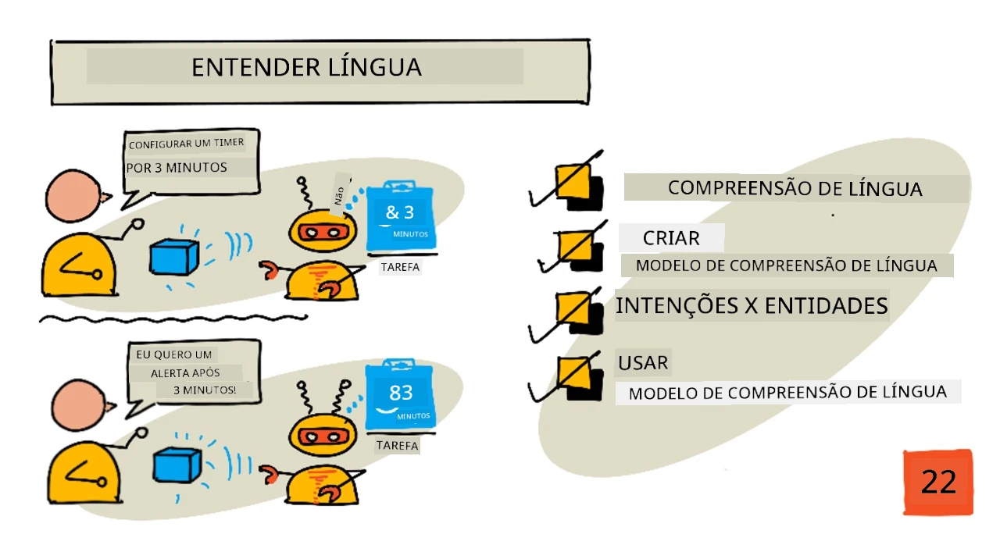
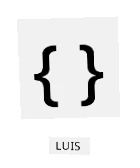
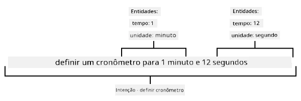
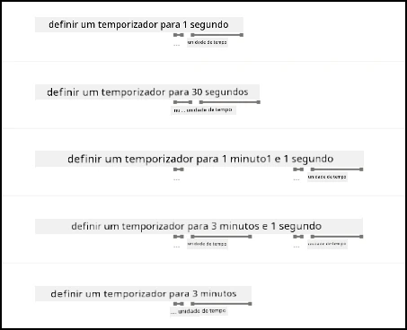

# Entenda a linguagem



> Ilustração por [Nitya Narasimhan](https://github.com/nitya). Clique na imagem para uma versão maior.

## Quiz pré-aula

[Quiz pré-aula](https://black-meadow-040d15503.1.azurestaticapps.net/quiz/43)

## Introdução

Na última lição, você converteu fala em texto. Para que isso seja usado para programar um cronômetro inteligente, seu código precisará entender o que foi dito. Você poderia assumir que o usuário dirá uma frase fixa, como "Defina um cronômetro de 3 minutos", e analisar essa expressão para determinar quanto tempo o cronômetro deve durar, mas isso não é muito amigável. Se um usuário disser "Defina um cronômetro para 3 minutos", você ou eu entenderíamos o que ele quer dizer, mas seu código não entenderia, pois estaria esperando uma frase fixa.

É aqui que entra o entendimento de linguagem, usando modelos de IA para interpretar texto e retornar os detalhes necessários, por exemplo, sendo capaz de entender tanto "Defina um cronômetro de 3 minutos" quanto "Defina um cronômetro para 3 minutos", e compreender que é necessário um cronômetro de 3 minutos.

Nesta lição, você aprenderá sobre modelos de entendimento de linguagem, como criá-los, treiná-los e usá-los em seu código.

Nesta lição, abordaremos:

* [Entendimento de linguagem](../../../../../6-consumer/lessons/2-language-understanding)
* [Criar um modelo de entendimento de linguagem](../../../../../6-consumer/lessons/2-language-understanding)
* [Intenções e entidades](../../../../../6-consumer/lessons/2-language-understanding)
* [Usar o modelo de entendimento de linguagem](../../../../../6-consumer/lessons/2-language-understanding)

## Entendimento de linguagem

Os humanos têm usado a linguagem para se comunicar por centenas de milhares de anos. Nós nos comunicamos com palavras, sons ou ações e entendemos o que é dito, tanto o significado das palavras, sons ou ações, quanto o contexto. Nós entendemos sinceridade e sarcasmo, permitindo que as mesmas palavras signifiquem coisas diferentes dependendo do tom de voz.

✅ Pense em algumas conversas que você teve recentemente. Quanto dessa conversa seria difícil para um computador entender porque precisa de contexto?

O entendimento de linguagem, também chamado de entendimento de linguagem natural, faz parte de um campo da inteligência artificial chamado processamento de linguagem natural (ou NLP), e lida com compreensão de leitura, tentando entender os detalhes das palavras ou frases. Se você usa um assistente de voz como Alexa ou Siri, você já utilizou serviços de entendimento de linguagem. Esses são os serviços de IA nos bastidores que convertem "Alexa, toque o último álbum da Taylor Swift" na minha filha dançando pela sala ao som de suas músicas favoritas.

> 💁 Computadores, apesar de todos os avanços, ainda têm um longo caminho a percorrer para realmente entender texto. Quando nos referimos ao entendimento de linguagem com computadores, não estamos falando de algo nem remotamente tão avançado quanto a comunicação humana, mas sim de pegar algumas palavras e extrair detalhes importantes.

Como humanos, entendemos a linguagem sem realmente pensar sobre isso. Se eu pedisse a outro humano para "tocar o último álbum da Taylor Swift", ele saberia instintivamente o que eu quis dizer. Para um computador, isso é mais difícil. Ele teria que pegar as palavras, convertidas de fala para texto, e determinar as seguintes informações:

* Música precisa ser tocada
* A música é da artista Taylor Swift
* A música específica é um álbum inteiro com várias faixas em ordem
* Taylor Swift tem muitos álbuns, então eles precisam ser ordenados cronologicamente e o mais recentemente publicado é o necessário

✅ Pense em outras frases que você já disse ao fazer pedidos, como pedir café ou pedir a um membro da família para passar algo. Tente dividi-las nas informações que um computador precisaria extrair para entender a frase.

Modelos de entendimento de linguagem são modelos de IA que são treinados para extrair certos detalhes da linguagem e, em seguida, são treinados para tarefas específicas usando aprendizado por transferência, da mesma forma que você treinou um modelo de Visão Personalizada usando um pequeno conjunto de imagens. Você pode pegar um modelo e treiná-lo usando o texto que deseja que ele entenda.

## Criar um modelo de entendimento de linguagem



Você pode criar modelos de entendimento de linguagem usando o LUIS, um serviço de entendimento de linguagem da Microsoft que faz parte dos Serviços Cognitivos.

### Tarefa - criar um recurso de autoria

Para usar o LUIS, você precisa criar um recurso de autoria.

1. Use o seguinte comando para criar um recurso de autoria no seu grupo de recursos `smart-timer`:

    ```python
    az cognitiveservices account create --name smart-timer-luis-authoring \
                                        --resource-group smart-timer \
                                        --kind LUIS.Authoring \
                                        --sku F0 \
                                        --yes \
                                        --location <location>
    ```

    Substitua `<location>` pela localização que você usou ao criar o Grupo de Recursos.

    > ⚠️ O LUIS não está disponível em todas as regiões, então se você receber o seguinte erro:
    >
    > ```output
    > InvalidApiSetId: The account type 'LUIS.Authoring' is either invalid or unavailable in given region.
    > ```
    >
    > escolha uma região diferente.

    Isso criará um recurso de autoria do LUIS no nível gratuito.

### Tarefa - criar um aplicativo de entendimento de linguagem

1. Abra o portal do LUIS em [luis.ai](https://luis.ai?WT.mc_id=academic-17441-jabenn) no seu navegador e faça login com a mesma conta que você tem usado para o Azure.

1. Siga as instruções no diálogo para selecionar sua assinatura do Azure e, em seguida, selecione o recurso `smart-timer-luis-authoring` que você acabou de criar.

1. Na lista *Aplicativos de Conversação*, selecione o botão **Novo aplicativo** para criar um novo aplicativo. Nomeie o novo aplicativo como `smart-timer` e defina a *Cultura* para sua linguagem.

    > 💁 Há um campo para um recurso de previsão. Você pode criar um segundo recurso apenas para previsão, mas o recurso de autoria gratuito permite 1.000 previsões por mês, o que deve ser suficiente para desenvolvimento, então você pode deixar este campo em branco.

1. Leia o guia que aparece ao criar o aplicativo para entender os passos necessários para treinar o modelo de entendimento de linguagem. Feche este guia quando terminar.

## Intenções e entidades

O entendimento de linguagem é baseado em *intenções* e *entidades*. Intenções são o objetivo das palavras, por exemplo, tocar música, configurar um cronômetro ou pedir comida. Entidades são o que a intenção está se referindo, como o álbum, a duração do cronômetro ou o tipo de comida. Cada frase que o modelo interpreta deve ter pelo menos uma intenção e, opcionalmente, uma ou mais entidades.

Alguns exemplos:

| Frase                                              | Intenção         | Entidades                                   |
| -------------------------------------------------- | ---------------- | ------------------------------------------ |
| "Toque o último álbum da Taylor Swift"             | *tocar música*   | *o último álbum da Taylor Swift*           |
| "Defina um cronômetro de 3 minutos"                | *definir cronômetro* | *3 minutos*                                |
| "Cancele meu cronômetro"                           | *cancelar cronômetro* | Nenhuma                                    |
| "Peça 3 pizzas grandes de abacaxi e uma salada caesar" | *pedir comida*  | *3 pizzas grandes de abacaxi*, *salada caesar* |

✅ Com as frases que você pensou anteriormente, qual seria a intenção e as entidades dessa frase?

Para treinar o LUIS, primeiro você define as entidades. Estas podem ser uma lista fixa de termos ou aprendidas a partir do texto. Por exemplo, você poderia fornecer uma lista fixa de alimentos disponíveis no seu menu, com variações (ou sinônimos) de cada palavra, como *berinjela* e *aubergine* como variações de *berinjela*. O LUIS também possui entidades pré-construídas que podem ser usadas, como números e localizações.

Para configurar um cronômetro, você poderia ter uma entidade usando as entidades numéricas pré-construídas para o tempo e outra para as unidades, como minutos e segundos. Cada unidade teria múltiplas variações para cobrir as formas singular e plural - como minuto e minutos.

Depois de definir as entidades, você cria intenções. Estas são aprendidas pelo modelo com base em frases de exemplo que você fornece (conhecidas como enunciados). Por exemplo, para uma intenção *definir cronômetro*, você poderia fornecer as seguintes frases:

* `defina um cronômetro de 1 segundo`
* `defina um cronômetro para 1 minuto e 12 segundos`
* `defina um cronômetro para 3 minutos`
* `defina um cronômetro de 9 minutos e 30 segundos`

Você então informa ao LUIS quais partes dessas frases correspondem às entidades:



A frase `defina um cronômetro para 1 minuto e 12 segundos` tem a intenção de `definir cronômetro`. Ela também possui 2 entidades com 2 valores cada:

|            | tempo | unidade   |
| ---------- | ---: | --------- |
| 1 minuto   | 1    | minuto    |
| 12 segundos | 12   | segundo   |

Para treinar um bom modelo, você precisa de uma variedade de frases de exemplo diferentes para cobrir as muitas formas que alguém pode usar para pedir a mesma coisa.

> 💁 Como em qualquer modelo de IA, quanto mais dados e mais precisos forem os dados usados para treinar, melhor será o modelo.

✅ Pense nas diferentes formas que você poderia pedir a mesma coisa e esperar que um humano entendesse.

### Tarefa - adicionar entidades aos modelos de entendimento de linguagem

Para o cronômetro, você precisa adicionar 2 entidades - uma para a unidade de tempo (minutos ou segundos) e outra para o número de minutos ou segundos.

Você pode encontrar instruções para usar o portal do LUIS na [Documentação de Introdução: Crie seu aplicativo no portal do LUIS no Microsoft Docs](https://docs.microsoft.com/azure/cognitive-services/luis/luis-get-started-create-app?WT.mc_id=academic-17441-jabenn).

1. No portal do LUIS, selecione a aba *Entidades* e adicione a entidade pré-construída *número* selecionando o botão **Adicionar entidade pré-construída** e, em seguida, selecionando *número* na lista.

1. Crie uma nova entidade para a unidade de tempo usando o botão **Criar**. Nomeie a entidade como `unidade de tempo` e defina o tipo como *Lista*. Adicione valores para `minuto` e `segundo` à lista de *Valores normalizados*, adicionando as formas singular e plural à lista de *sinônimos*. Pressione `enter` após adicionar cada sinônimo para adicioná-lo à lista.

    | Valor normalizado | Sinônimos        |
    | ----------------- | ---------------- |
    | minuto            | minuto, minutos  |
    | segundo           | segundo, segundos|

### Tarefa - adicionar intenções aos modelos de entendimento de linguagem

1. Na aba *Intenções*, selecione o botão **Criar** para criar uma nova intenção. Nomeie esta intenção como `definir cronômetro`.

1. Nos exemplos, insira diferentes formas de configurar um cronômetro usando minutos, segundos e combinações de minutos e segundos. Exemplos podem ser:

    * `defina um cronômetro de 1 segundo`
    * `defina um cronômetro de 4 minutos`
    * `defina um cronômetro de quatro minutos e seis segundos`
    * `defina um cronômetro de 9 minutos e 30 segundos`
    * `defina um cronômetro para 1 minuto e 12 segundos`
    * `defina um cronômetro para 3 minutos`
    * `defina um cronômetro para 3 minutos e 1 segundo`
    * `defina um cronômetro para três minutos e um segundo`
    * `defina um cronômetro para 1 minuto e 1 segundo`
    * `defina um cronômetro para 30 segundos`
    * `defina um cronômetro para 1 segundo`

    Misture números como palavras e números para que o modelo aprenda a lidar com ambos.

1. Conforme você insere cada exemplo, o LUIS começará a detectar entidades e sublinhará e rotulará qualquer uma que encontrar.

    

### Tarefa - treinar e testar o modelo

1. Depois que as entidades e intenções estiverem configuradas, você pode treinar o modelo usando o botão **Treinar** no menu superior. Selecione este botão, e o modelo deve ser treinado em alguns segundos. O botão ficará desativado enquanto o treinamento estiver em andamento e será reativado quando concluído.

1. Selecione o botão **Testar** no menu superior para testar o modelo de entendimento de linguagem. Insira um texto como `defina um cronômetro para 5 minutos e 4 segundos` e pressione enter. A frase aparecerá em uma caixa abaixo da caixa de texto onde você a digitou, e abaixo disso estará a *intenção principal*, ou a intenção detectada com maior probabilidade. Isso deve ser `definir cronômetro`. O nome da intenção será seguido pela probabilidade de que a intenção detectada seja a correta.

1. Selecione a opção **Inspecionar** para ver uma análise detalhada dos resultados. Você verá a intenção com maior pontuação e sua probabilidade percentual, juntamente com listas das entidades detectadas.

1. Feche o painel *Testar* quando terminar de testar.

### Tarefa - publicar o modelo

Para usar este modelo no código, você precisa publicá-lo. Ao publicar no LUIS, você pode publicar em um ambiente de teste ou em um ambiente de produção para um lançamento completo. Nesta lição, um ambiente de teste é suficiente.

1. No portal do LUIS, selecione o botão **Publicar** no menu superior.

1. Certifique-se de que o *Slot de teste* está selecionado e, em seguida, selecione **Concluído**. Você verá uma notificação quando o aplicativo for publicado.

1. Você pode testar isso usando o curl. Para construir o comando curl, você precisa de três valores - o endpoint, o ID do aplicativo (App ID) e uma chave de API. Esses valores podem ser acessados na aba **GERENCIAR**, que pode ser selecionada no menu superior.

    1. Na seção *Configurações*, copie o App ID
1. Na seção *Azure Resources*, selecione *Authoring Resource* e copie a *Primary Key* e a *Endpoint URL*.

1. Execute o seguinte comando curl no seu prompt de comando ou terminal:

    ```sh
    curl "<endpoint url>/luis/prediction/v3.0/apps/<app id>/slots/staging/predict" \
          --request GET \
          --get \
          --data "subscription-key=<primary key>" \
          --data "verbose=false" \
          --data "show-all-intents=true" \
          --data-urlencode "query=<sentence>"
    ```

    Substitua `<endpoint url>` pela Endpoint URL da seção *Azure Resources*.

    Substitua `<app id>` pelo App ID da seção *Settings*.

    Substitua `<primary key>` pela Primary Key da seção *Azure Resources*.

    Substitua `<sentence>` pela frase que você deseja testar.

1. A saída dessa chamada será um documento JSON que detalha a consulta, a intenção principal (*top intent*) e uma lista de entidades classificadas por tipo.

    ```JSON
    {
        "query": "set a timer for 45 minutes and 12 seconds",
        "prediction": {
            "topIntent": "set timer",
            "intents": {
                "set timer": {
                    "score": 0.97031575
                },
                "None": {
                    "score": 0.02205793
                }
            },
            "entities": {
                "number": [
                    45,
                    12
                ],
                "time-unit": [
                    [
                        "minute"
                    ],
                    [
                        "second"
                    ]
                ]
            }
        }
    }
    ```

    O JSON acima foi gerado ao consultar com `set a timer for 45 minutes and 12 seconds`:

    * `set timer` foi a intenção principal com uma probabilidade de 97%.
    * Duas entidades do tipo *number* foram detectadas: `45` e `12`.
    * Duas entidades do tipo *time-unit* foram detectadas: `minute` e `second`.

## Usar o modelo de compreensão de linguagem

Depois de publicado, o modelo LUIS pode ser chamado a partir do código. Em lições anteriores, você utilizou um IoT Hub para lidar com a comunicação com serviços na nuvem, enviando telemetria e ouvindo comandos. Esse processo é muito assíncrono - uma vez que a telemetria é enviada, seu código não espera por uma resposta, e se o serviço na nuvem estiver indisponível, você não saberá.

Para um cronômetro inteligente, queremos uma resposta imediata, para que possamos informar ao usuário que o cronômetro foi configurado ou alertá-lo de que os serviços na nuvem estão indisponíveis. Para isso, nosso dispositivo IoT chamará diretamente um endpoint web, em vez de depender de um IoT Hub.

Em vez de chamar o LUIS diretamente do dispositivo IoT, você pode usar código serverless com um tipo diferente de gatilho - um gatilho HTTP. Isso permite que seu aplicativo de função escute requisições REST e responda a elas. Essa função será um endpoint REST que seu dispositivo poderá chamar.

> 💁 Embora seja possível chamar o LUIS diretamente do seu dispositivo IoT, é melhor usar algo como código serverless. Dessa forma, quando você quiser alterar o aplicativo LUIS que está sendo chamado, por exemplo, ao treinar um modelo melhor ou em outro idioma, você só precisará atualizar o código na nuvem, sem precisar reimplantar o código em milhares ou milhões de dispositivos IoT.

### Tarefa - criar um aplicativo de funções serverless

1. Crie um aplicativo de funções do Azure chamado `smart-timer-trigger` e abra-o no VS Code.

1. Adicione um gatilho HTTP a este aplicativo chamado `speech-trigger` usando o seguinte comando no terminal do VS Code:

    ```sh
    func new --name text-to-timer --template "HTTP trigger"
    ```

    Isso criará um gatilho HTTP chamado `text-to-timer`.

1. Teste o gatilho HTTP executando o aplicativo de funções. Quando ele for executado, você verá o endpoint listado na saída:

    ```output
    Functions:
    
            text-to-timer: [GET,POST] http://localhost:7071/api/text-to-timer
    ```

    Teste isso carregando a URL [http://localhost:7071/api/text-to-timer](http://localhost:7071/api/text-to-timer) no seu navegador.

    ```output
    This HTTP triggered function executed successfully. Pass a name in the query string or in the request body for a personalized response.
    ```

### Tarefa - usar o modelo de compreensão de linguagem

1. O SDK para LUIS está disponível via um pacote Pip. Adicione a seguinte linha ao arquivo `requirements.txt` para incluir a dependência deste pacote:

    ```sh
    azure-cognitiveservices-language-luis
    ```

1. Certifique-se de que o terminal do VS Code tenha o ambiente virtual ativado e execute o seguinte comando para instalar os pacotes Pip:

    ```sh
    pip install -r requirements.txt
    ```

    > 💁 Se você encontrar erros, pode ser necessário atualizar o pip com o seguinte comando:
    >
    > ```sh
    > pip install --upgrade pip
    > ```

1. Adicione novas entradas ao arquivo `local.settings.json` para sua LUIS API Key, Endpoint URL e App ID da aba **MANAGE** do portal LUIS:

    ```JSON
    "LUIS_KEY": "<primary key>",
    "LUIS_ENDPOINT_URL": "<endpoint url>",
    "LUIS_APP_ID": "<app id>"
    ```

    Substitua `<endpoint url>` pela Endpoint URL da seção *Azure Resources* da aba **MANAGE**. Isso será `https://<location>.api.cognitive.microsoft.com/`.

    Substitua `<app id>` pelo App ID da seção *Settings* da aba **MANAGE**.

    Substitua `<primary key>` pela Primary Key da seção *Azure Resources* da aba **MANAGE**.

1. Adicione os seguintes imports ao arquivo `__init__.py`:

    ```python
    import json
    import os
    from azure.cognitiveservices.language.luis.runtime import LUISRuntimeClient
    from msrest.authentication import CognitiveServicesCredentials
    ```

    Isso importa algumas bibliotecas do sistema, bem como as bibliotecas para interagir com o LUIS.

1. Apague o conteúdo do método `main` e adicione o seguinte código:

    ```python
    luis_key = os.environ['LUIS_KEY']
    endpoint_url = os.environ['LUIS_ENDPOINT_URL']
    app_id = os.environ['LUIS_APP_ID']
    
    credentials = CognitiveServicesCredentials(luis_key)
    client = LUISRuntimeClient(endpoint=endpoint_url, credentials=credentials)
    ```

    Isso carrega os valores que você adicionou ao arquivo `local.settings.json` para seu aplicativo LUIS, cria um objeto de credenciais com sua API key e, em seguida, cria um objeto cliente LUIS para interagir com seu aplicativo LUIS.

1. Este gatilho HTTP será chamado passando o texto a ser compreendido como JSON, com o texto em uma propriedade chamada `text`. O seguinte código extrai o valor do corpo da requisição HTTP e o registra no console. Adicione este código à função `main`:

    ```python
    req_body = req.get_json()
    text = req_body['text']
    logging.info(f'Request - {text}')
    ```

1. As previsões são solicitadas ao LUIS enviando uma requisição de previsão - um documento JSON contendo o texto a ser previsto. Crie isso com o seguinte código:

    ```python
    prediction_request = { 'query' : text }
    ```

1. Essa requisição pode então ser enviada ao LUIS, usando o slot de staging para o qual seu aplicativo foi publicado:

    ```python
    prediction_response = client.prediction.get_slot_prediction(app_id, 'Staging', prediction_request)
    ```

1. A resposta da previsão contém a intenção principal - a intenção com a maior pontuação de previsão, junto com as entidades. Se a intenção principal for `set timer`, as entidades podem ser lidas para obter o tempo necessário para o cronômetro:

    ```python
    if prediction_response.prediction.top_intent == 'set timer':
        numbers = prediction_response.prediction.entities['number']
        time_units = prediction_response.prediction.entities['time unit']
        total_seconds = 0
    ```

    As entidades do tipo `number` serão um array de números. Por exemplo, se você disser *"Set a four minute 17 second timer."*, o array `number` conterá 2 inteiros - 4 e 17.

    As entidades do tipo `time unit` serão um array de arrays de strings, com cada unidade de tempo como um array de strings dentro do array. Por exemplo, se você disser *"Set a four minute 17 second timer."*, o array `time unit` conterá 2 arrays com valores únicos - `['minute']` e `['second']`.

    A versão JSON dessas entidades para *"Set a four minute 17 second timer."* é:

    ```json
    {
        "number": [4, 17],
        "time unit": [
            ["minute"],
            ["second"]
        ]
    }
    ```

    Este código também define uma contagem para o tempo total do cronômetro em segundos. Isso será preenchido pelos valores das entidades.

1. As entidades não estão vinculadas, mas podemos fazer algumas suposições sobre elas. Elas estarão na ordem falada, então a posição no array pode ser usada para determinar qual número corresponde a qual unidade de tempo. Por exemplo:

    * *"Set a 30 second timer"* - terá um número, `30`, e uma unidade de tempo, `second`, então o único número corresponderá à única unidade de tempo.
    * *"Set a 2 minute and 30 second timer"* - terá dois números, `2` e `30`, e duas unidades de tempo, `minute` e `second`, então o primeiro número será para a primeira unidade de tempo (2 minutos) e o segundo número para a segunda unidade de tempo (30 segundos).

    O seguinte código obtém a contagem de itens nas entidades do tipo número e usa isso para extrair o primeiro item de cada array, depois o segundo e assim por diante. Adicione isso dentro do bloco `if`.

    ```python
    for i in range(0, len(numbers)):
        number = numbers[i]
        time_unit = time_units[i][0]
    ```

    Para *"Set a four minute 17 second timer."*, isso fará um loop duas vezes, fornecendo os seguintes valores:

    | contagem do loop | `number` | `time_unit` |
    | ----------------: | -------: | ----------- |
    | 0                 | 4        | minute      |
    | 1                 | 17       | second      |

1. Dentro desse loop, use o número e a unidade de tempo para calcular o tempo total do cronômetro, adicionando 60 segundos para cada minuto e o número de segundos para quaisquer segundos.

    ```python
    if time_unit == 'minute':
        total_seconds += number * 60
    else:
        total_seconds += number
    ```

1. Fora desse loop pelas entidades, registre o tempo total do cronômetro:

    ```python
    logging.info(f'Timer required for {total_seconds} seconds')
    ```

1. O número de segundos precisa ser retornado da função como uma resposta HTTP. No final do bloco `if`, adicione o seguinte:

    ```python
    payload = {
        'seconds': total_seconds
    }
    return func.HttpResponse(json.dumps(payload), status_code=200)
    ```

    Este código cria um payload contendo o número total de segundos para o cronômetro, converte-o em uma string JSON e o retorna como um resultado HTTP com um código de status 200, o que significa que a chamada foi bem-sucedida.

1. Finalmente, fora do bloco `if`, trate o caso em que a intenção não foi reconhecida retornando um código de erro:

    ```python
    return func.HttpResponse(status_code=404)
    ```

    404 é o código de status para *não encontrado*.

1. Execute o aplicativo de funções e teste-o usando o curl.

    ```sh
    curl --request POST 'http://localhost:7071/api/text-to-timer' \
         --header 'Content-Type: application/json' \
         --include \
         --data '{"text":"<text>"}'
    ```

    Substitua `<text>` pelo texto da sua solicitação, por exemplo, `set a 2 minutes 27 second timer`.

    Você verá a seguinte saída do aplicativo de funções:

    ```output
    Functions:

            text-to-timer: [GET,POST] http://localhost:7071/api/text-to-timer
    
    For detailed output, run func with --verbose flag.
    [2021-06-26T19:45:14.502Z] Worker process started and initialized.
    [2021-06-26T19:45:19.338Z] Host lock lease acquired by instance ID '000000000000000000000000951CAE4E'.
    [2021-06-26T19:45:52.059Z] Executing 'Functions.text-to-timer' (Reason='This function was programmatically called via the host APIs.', Id=f68bfb90-30e4-47a5-99da-126b66218e81)
    [2021-06-26T19:45:53.577Z] Timer required for 147 seconds
    [2021-06-26T19:45:53.746Z] Executed 'Functions.text-to-timer' (Succeeded, Id=f68bfb90-30e4-47a5-99da-126b66218e81, Duration=1750ms)
    ```

    A chamada ao curl retornará o seguinte:

    ```output
    HTTP/1.1 200 OK
    Date: Tue, 29 Jun 2021 01:14:11 GMT
    Content-Type: text/plain; charset=utf-8
    Server: Kestrel
    Transfer-Encoding: chunked
    
    {"seconds": 147}
    ```

    O número de segundos para o cronômetro está no valor `"seconds"`.

> 💁 Você pode encontrar este código na pasta [code/functions](../../../../../6-consumer/lessons/2-language-understanding/code/functions).

### Tarefa - tornar sua função acessível ao seu dispositivo IoT

1. Para que seu dispositivo IoT chame seu endpoint REST, ele precisará saber a URL. Quando você o acessou anteriormente, utilizou `localhost`, que é um atalho para acessar endpoints REST na sua máquina local. Para permitir que seu dispositivo IoT tenha acesso, você precisará publicar na nuvem ou obter o endereço IP para acessá-lo localmente.

    > ⚠️ Se você estiver usando um Wio Terminal, é mais fácil executar o aplicativo de funções localmente, pois haverá uma dependência de bibliotecas que impedirá a implantação do aplicativo de funções da mesma forma que você fez antes. Execute o aplicativo de funções localmente e acesse-o pelo endereço IP do seu computador. Se você quiser implantá-lo na nuvem, informações serão fornecidas em uma lição posterior sobre como fazer isso.

    * Publique o aplicativo de funções - siga as instruções das lições anteriores para publicar seu aplicativo de funções na nuvem. Uma vez publicado, a URL será `https://<APP_NAME>.azurewebsites.net/api/text-to-timer`, onde `<APP_NAME>` será o nome do seu aplicativo de funções. Certifique-se também de publicar suas configurações locais.

      Ao trabalhar com gatilhos HTTP, eles são protegidos por padrão com uma chave do aplicativo de funções. Para obter essa chave, execute o seguinte comando:

      ```sh
      az functionapp keys list --resource-group smart-timer \
                               --name <APP_NAME>                               
      ```

      Copie o valor da entrada `default` da seção `functionKeys`.

      ```output
      {
        "functionKeys": {
          "default": "sQO1LQaeK9N1qYD6SXeb/TctCmwQEkToLJU6Dw8TthNeUH8VA45hlA=="
        },
        "masterKey": "RSKOAIlyvvQEQt9dfpabJT018scaLpQu9p1poHIMCxx5LYrIQZyQ/g==",
        "systemKeys": {}
      }
      ```

      Essa chave precisará ser adicionada como um parâmetro de consulta na URL, então a URL final será `https://<APP_NAME>.azurewebsites.net/api/text-to-timer?code=<FUNCTION_KEY>`, onde `<APP_NAME>` será o nome do seu aplicativo de funções e `<FUNCTION_KEY>` será sua chave de função padrão.

      > 💁 Você pode alterar o tipo de autorização do gatilho HTTP usando a configuração `authlevel` no arquivo `function.json`. Você pode ler mais sobre isso na [seção de configuração da documentação do gatilho HTTP do Azure Functions na Microsoft Docs](https://docs.microsoft.com/azure/azure-functions/functions-bindings-http-webhook-trigger?WT.mc_id=academic-17441-jabenn&tabs=python#configuration).

    * Execute o aplicativo de funções localmente e acesse-o usando o endereço IP - você pode obter o endereço IP do seu computador na rede local e usá-lo para construir a URL.

      Encontre seu endereço IP:

      * No Windows 10, siga o [guia para encontrar seu endereço IP](https://support.microsoft.com/windows/find-your-ip-address-f21a9bbc-c582-55cd-35e0-73431160a1b9?WT.mc_id=academic-17441-jabenn).
      * No macOS, siga o [guia para encontrar o endereço IP no Mac](https://www.hellotech.com/guide/for/how-to-find-ip-address-on-mac).
      * No Linux, siga a seção sobre encontrar o endereço IP privado no [guia para encontrar o endereço IP no Linux](https://opensource.com/article/18/5/how-find-ip-address-linux).

      Uma vez que você tenha seu endereço IP, você poderá acessar a função em `http://`.

:7071/api/text-to-timer`, onde `<IP_ADDRESS>` será o endereço IP, por exemplo, `http://192.168.1.10:7071/api/text-to-timer`.

      > 💁 Note que isso utiliza a porta 7071, então, após o endereço IP, você precisará incluir `:7071`.

      > 💁 Isso só funcionará se o seu dispositivo IoT estiver na mesma rede que o seu computador.

1. Teste o endpoint acessando-o usando o curl.

---

## 🚀 Desafio

Existem várias maneiras de solicitar a mesma coisa, como configurar um temporizador. Pense em diferentes formas de fazer isso e use-as como exemplos no seu aplicativo LUIS. Teste essas formas para ver como o seu modelo lida com múltiplas maneiras de solicitar um temporizador.

## Questionário pós-aula

[Questionário pós-aula](https://black-meadow-040d15503.1.azurestaticapps.net/quiz/44)

## Revisão e Autoestudo

* Leia mais sobre o LUIS e suas capacidades na [página de documentação do Language Understanding (LUIS) nos docs da Microsoft](https://docs.microsoft.com/azure/cognitive-services/luis/?WT.mc_id=academic-17441-jabenn)
* Leia mais sobre compreensão de linguagem na [página sobre compreensão de linguagem natural na Wikipedia](https://wikipedia.org/wiki/Natural-language_understanding)
* Leia mais sobre gatilhos HTTP na [documentação do gatilho HTTP do Azure Functions nos docs da Microsoft](https://docs.microsoft.com/azure/azure-functions/functions-bindings-http-webhook-trigger?WT.mc_id=academic-17441-jabenn&tabs=python)

## Tarefa

[Cancelar o temporizador](assignment.md)

---

**Aviso Legal**:  
Este documento foi traduzido utilizando o serviço de tradução por IA [Co-op Translator](https://github.com/Azure/co-op-translator). Embora nos esforcemos para garantir a precisão, esteja ciente de que traduções automatizadas podem conter erros ou imprecisões. O documento original em seu idioma nativo deve ser considerado a fonte autoritativa. Para informações críticas, recomenda-se a tradução profissional realizada por humanos. Não nos responsabilizamos por quaisquer mal-entendidos ou interpretações equivocadas decorrentes do uso desta tradução.