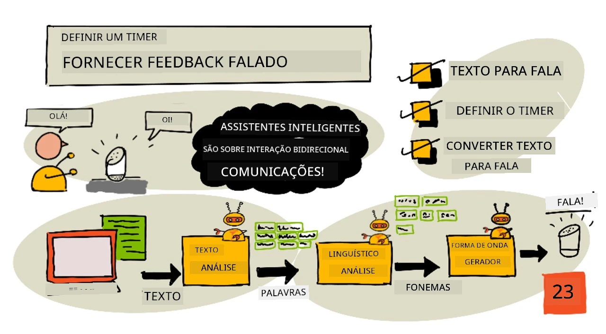
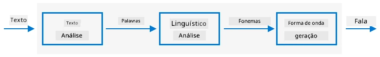

# Configure um temporizador e forneça feedback falado



> Sketchnote por [Nitya Narasimhan](https://github.com/nitya). Clique na imagem para uma versão maior.

## Questionário pré-aula

[Questionário pré-aula](https://black-meadow-040d15503.1.azurestaticapps.net/quiz/45)

## Introdução

Assistentes inteligentes não são dispositivos de comunicação unidirecional. Você fala com eles, e eles respondem:

"Alexa, configure um temporizador de 3 minutos"

"Ok, seu temporizador foi configurado para 3 minutos"

Nas últimas 2 lições, você aprendeu como transformar fala em texto e, em seguida, extrair um comando de configuração de temporizador desse texto. Nesta lição, você aprenderá como configurar o temporizador no dispositivo IoT, respondendo ao usuário com palavras faladas confirmando o temporizador e alertando-o quando o temporizador terminar.

Nesta lição, abordaremos:

* [Texto para fala](../../../../../6-consumer/lessons/3-spoken-feedback)
* [Configurar o temporizador](../../../../../6-consumer/lessons/3-spoken-feedback)
* [Converter texto em fala](../../../../../6-consumer/lessons/3-spoken-feedback)

## Texto para fala

Texto para fala, como o nome sugere, é o processo de converter texto em áudio que contém as palavras faladas. O princípio básico é decompor as palavras do texto em seus sons constituintes (conhecidos como fonemas) e juntar áudios desses sons, seja usando gravações pré-existentes ou áudios gerados por modelos de IA.



Os sistemas de texto para fala geralmente têm 3 etapas:

* Análise de texto
* Análise linguística
* Geração de forma de onda

### Análise de texto

A análise de texto envolve pegar o texto fornecido e convertê-lo em palavras que podem ser usadas para gerar fala. Por exemplo, se você converter "Olá mundo", não há necessidade de análise de texto, as duas palavras podem ser convertidas diretamente em fala. No entanto, se você tiver "1234", isso pode precisar ser convertido em "Mil duzentos e trinta e quatro" ou "Um, dois, três, quatro", dependendo do contexto. Para "Eu tenho 1234 maçãs", seria "Mil duzentos e trinta e quatro", mas para "A criança contou 1234", seria "Um, dois, três, quatro".

As palavras criadas variam não apenas para o idioma, mas também para o local desse idioma. Por exemplo, em inglês americano, 120 seria "One hundred twenty", enquanto em inglês britânico seria "One hundred and twenty", com o uso de "and" após os centenas.

✅ Alguns outros exemplos que requerem análise de texto incluem "in" como abreviação de polegada (inch) e "st" como abreviação de santo (saint) ou rua (street). Você consegue pensar em outros exemplos no seu idioma de palavras que são ambíguas sem contexto?

Depois que as palavras são definidas, elas são enviadas para análise linguística.

### Análise linguística

A análise linguística decompõe as palavras em fonemas. Os fonemas são baseados não apenas nas letras usadas, mas também nas outras letras da palavra. Por exemplo, em inglês, o som da letra 'a' em 'car' e 'care' é diferente. O idioma inglês possui 44 fonemas diferentes para as 26 letras do alfabeto, alguns compartilhados por letras diferentes, como o mesmo fonema usado no início de 'circle' e 'serpent'.

✅ Faça uma pesquisa: Quais são os fonemas do seu idioma?

Depois que as palavras são convertidas em fonemas, esses fonemas precisam de dados adicionais para suportar a entonação, ajustando o tom ou a duração dependendo do contexto. Um exemplo é que, em inglês, o aumento de tom pode ser usado para transformar uma frase em uma pergunta, elevando o tom da última palavra para implicar uma pergunta.

Por exemplo - a frase "You have an apple" é uma afirmação dizendo que você tem uma maçã. Se o tom subir no final, aumentando na palavra "apple", ela se torna a pergunta "You have an apple?", perguntando se você tem uma maçã. A análise linguística precisa usar o ponto de interrogação no final para decidir aumentar o tom.

Depois que os fonemas são gerados, eles podem ser enviados para a geração de forma de onda para produzir a saída de áudio.

### Geração de forma de onda

Os primeiros sistemas eletrônicos de texto para fala usavam gravações únicas de áudio para cada fonema, resultando em vozes muito monótonas e robóticas. A análise linguística produzia fonemas, que eram carregados de um banco de dados de sons e unidos para formar o áudio.

✅ Faça uma pesquisa: Encontre algumas gravações de áudio de sistemas antigos de síntese de fala. Compare com a síntese de fala moderna, como a usada em assistentes inteligentes.

A geração de forma de onda mais moderna usa modelos de aprendizado de máquina (ML) construídos com aprendizado profundo (redes neurais muito grandes que funcionam de maneira semelhante aos neurônios no cérebro) para produzir vozes mais naturais que podem ser indistinguíveis de vozes humanas.

> 💁 Alguns desses modelos de ML podem ser re-treinados usando aprendizado por transferência para soar como pessoas reais. Isso significa que usar a voz como um sistema de segurança, algo que os bancos estão tentando cada vez mais, não é mais uma boa ideia, pois qualquer pessoa com uma gravação de alguns minutos da sua voz pode se passar por você.

Esses grandes modelos de ML estão sendo treinados para combinar todas as três etapas em sintetizadores de fala de ponta a ponta.

## Configurar o temporizador

Para configurar o temporizador, seu dispositivo IoT precisa chamar o endpoint REST que você criou usando código serverless e, em seguida, usar o número de segundos resultante para configurar um temporizador.

### Tarefa - chamar a função serverless para obter o tempo do temporizador

Siga o guia relevante para chamar o endpoint REST do seu dispositivo IoT e configurar um temporizador para o tempo necessário:

* [Arduino - Wio Terminal](wio-terminal-set-timer.md)
* [Computador de placa única - Raspberry Pi/Dispositivo IoT virtual](single-board-computer-set-timer.md)

## Converter texto em fala

O mesmo serviço de fala que você usou para converter fala em texto pode ser usado para converter texto de volta em fala, e isso pode ser reproduzido por um alto-falante no seu dispositivo IoT. O texto a ser convertido é enviado para o serviço de fala, junto com o tipo de áudio necessário (como a taxa de amostragem), e os dados binários contendo o áudio são retornados.

Quando você envia essa solicitação, ela é feita usando a *Speech Synthesis Markup Language* (SSML), uma linguagem de marcação baseada em XML para aplicações de síntese de fala. Isso define não apenas o texto a ser convertido, mas o idioma do texto, a voz a ser usada e pode até ser usado para definir velocidade, volume e tom para algumas ou todas as palavras no texto.

Por exemplo, este SSML define uma solicitação para converter o texto "Seu temporizador de 3 minutos e 5 segundos foi configurado" em fala usando uma voz em inglês britânico chamada `en-GB-MiaNeural`

```xml
<speak version='1.0' xml:lang='en-GB'>
    <voice xml:lang='en-GB' name='en-GB-MiaNeural'>
        Your 3 minute 5 second time has been set
    </voice>
</speak>
```

> 💁 A maioria dos sistemas de texto para fala possui várias vozes para diferentes idiomas, com sotaques relevantes, como uma voz em inglês britânico com sotaque inglês e uma voz em inglês da Nova Zelândia com sotaque neozelandês.

### Tarefa - converter texto em fala

Siga o guia relevante para converter texto em fala usando seu dispositivo IoT:

* [Arduino - Wio Terminal](wio-terminal-text-to-speech.md)
* [Computador de placa única - Raspberry Pi](pi-text-to-speech.md)
* [Computador de placa única - Dispositivo virtual](virtual-device-text-to-speech.md)

---

## 🚀 Desafio

O SSML possui maneiras de alterar como as palavras são faladas, como adicionar ênfase a certas palavras, adicionar pausas ou alterar o tom. Experimente algumas dessas opções, enviando diferentes SSML do seu dispositivo IoT e comparando os resultados. Você pode ler mais sobre SSML, incluindo como alterar a forma como as palavras são faladas, na [especificação Speech Synthesis Markup Language (SSML) Version 1.1 do World Wide Web Consortium](https://www.w3.org/TR/speech-synthesis11/).

## Questionário pós-aula

[Questionário pós-aula](https://black-meadow-040d15503.1.azurestaticapps.net/quiz/46)

## Revisão e autoestudo

* Leia mais sobre síntese de fala na [página sobre síntese de fala na Wikipedia](https://wikipedia.org/wiki/Speech_synthesis)
* Leia mais sobre como criminosos estão usando síntese de fala para roubar na [matéria "Vozes falsas ajudam cibercriminosos a roubar dinheiro" na BBC News](https://www.bbc.com/news/technology-48908736)
* Saiba mais sobre os riscos para dubladores devido a versões sintetizadas de suas vozes no [artigo "Este processo do TikTok está destacando como a IA está prejudicando dubladores" no Vice](https://www.vice.com/en/article/z3xqwj/this-tiktok-lawsuit-is-highlighting-how-ai-is-screwing-over-voice-actors)

## Tarefa

[Cancelar o temporizador](assignment.md)

---

**Aviso Legal**:  
Este documento foi traduzido utilizando o serviço de tradução por IA [Co-op Translator](https://github.com/Azure/co-op-translator). Embora nos esforcemos para garantir a precisão, esteja ciente de que traduções automatizadas podem conter erros ou imprecisões. O documento original em seu idioma nativo deve ser considerado a fonte autoritativa. Para informações críticas, recomenda-se a tradução profissional realizada por humanos. Não nos responsabilizamos por quaisquer mal-entendidos ou interpretações equivocadas decorrentes do uso desta tradução.