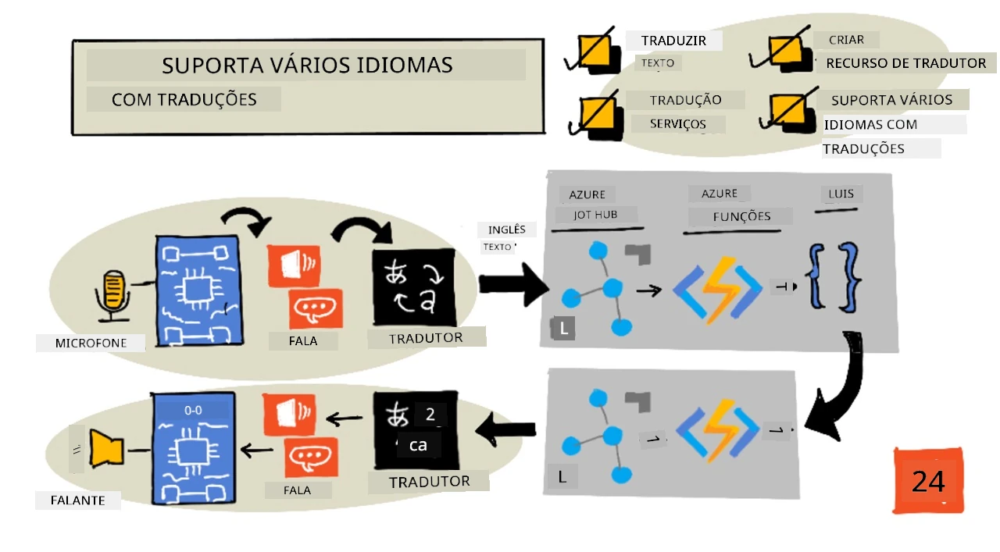
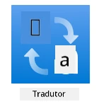
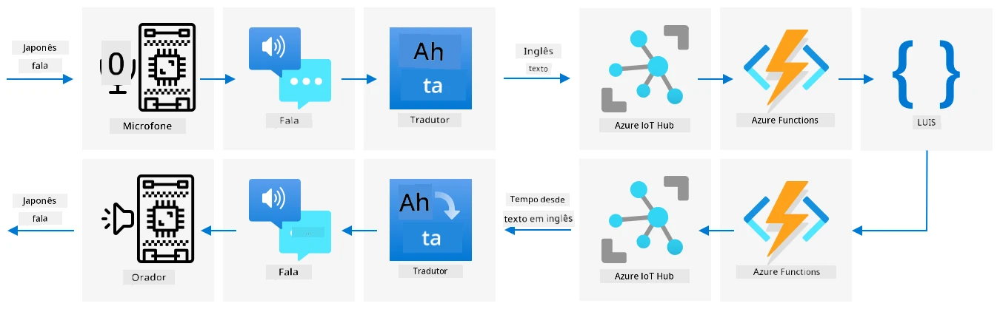

# Suporte a múltiplos idiomas



> Ilustração por [Nitya Narasimhan](https://github.com/nitya). Clique na imagem para uma versão maior.

Este vídeo oferece uma visão geral dos serviços de fala do Azure, abordando conversão de fala para texto e texto para fala das lições anteriores, além de tradução de fala, um tópico abordado nesta lição:

[](https://www.youtube.com/watch?v=h6xbpMPSGEA)

> 🎥 Clique na imagem acima para assistir ao vídeo

## Quiz pré-aula

[Quiz pré-aula](https://black-meadow-040d15503.1.azurestaticapps.net/quiz/47)

## Introdução

Nas últimas 3 lições, você aprendeu sobre conversão de fala para texto, compreensão de linguagem e conversão de texto para fala, tudo impulsionado por IA. Outra área da comunicação humana em que a IA pode ajudar é a tradução de idiomas - convertendo de um idioma para outro, como de inglês para francês.

Nesta lição, você aprenderá a usar IA para traduzir texto, permitindo que seu cronômetro inteligente interaja com usuários em vários idiomas.

Nesta lição, abordaremos:

* [Traduzir texto](../../../../../6-consumer/lessons/4-multiple-language-support)
* [Serviços de tradução](../../../../../6-consumer/lessons/4-multiple-language-support)
* [Criar um recurso de tradutor](../../../../../6-consumer/lessons/4-multiple-language-support)
* [Suporte a múltiplos idiomas em aplicativos com traduções](../../../../../6-consumer/lessons/4-multiple-language-support)
* [Traduzir texto usando um serviço de IA](../../../../../6-consumer/lessons/4-multiple-language-support)

> 🗑 Esta é a última lição deste projeto, então, após concluir esta lição e a tarefa, não se esqueça de limpar seus serviços na nuvem. Você precisará dos serviços para concluir a tarefa, então certifique-se de completá-la primeiro.
>
> Consulte [o guia de limpeza do projeto](../../../clean-up.md) se necessário para instruções sobre como fazer isso.

## Traduzir texto

A tradução de texto tem sido um problema de ciência da computação pesquisado por mais de 70 anos, e só agora, graças aos avanços em IA e poder computacional, está perto de ser resolvido a ponto de ser quase tão bom quanto tradutores humanos.

> 💁 As origens podem ser rastreadas ainda mais longe, até [Al-Kindi](https://wikipedia.org/wiki/Al-Kindi), um criptógrafo árabe do século IX que desenvolveu técnicas para tradução de idiomas.

### Traduções automáticas

A tradução de texto começou como uma tecnologia conhecida como Tradução Automática (MT), que pode traduzir entre diferentes pares de idiomas. A MT funciona substituindo palavras em um idioma por outro, adicionando técnicas para selecionar as formas corretas de traduzir frases ou partes de sentenças quando uma tradução palavra por palavra não faz sentido.

> 🎓 Quando tradutores suportam a tradução entre um idioma e outro, isso é conhecido como *pares de idiomas*. Diferentes ferramentas suportam diferentes pares de idiomas, e esses podem não ser completos. Por exemplo, um tradutor pode suportar inglês para espanhol como um par de idiomas, e espanhol para italiano como outro par, mas não inglês para italiano.

Por exemplo, traduzir "Hello world" do inglês para o francês pode ser feito com uma substituição - "Bonjour" para "Hello" e "le monde" para "world", levando à tradução correta de "Bonjour le monde".

Substituições não funcionam quando diferentes idiomas usam formas diferentes de dizer a mesma coisa. Por exemplo, a frase em inglês "My name is Jim" traduz-se para "Je m'appelle Jim" em francês - literalmente "Eu me chamo Jim". "Je" é francês para "Eu", "moi" é "me", mas é concatenado com o verbo porque começa com uma vogal, tornando-se "m'", "appelle" é "chamar", e "Jim" não é traduzido porque é um nome e não uma palavra que pode ser traduzida. A ordem das palavras também se torna um problema - uma simples substituição de "Je m'appelle Jim" torna-se "Eu me chamo Jim", com uma ordem de palavras diferente do inglês.

> 💁 Algumas palavras nunca são traduzidas - meu nome é Jim, independentemente do idioma usado para me apresentar. Ao traduzir para idiomas que usam alfabetos diferentes ou letras diferentes para sons diferentes, as palavras podem ser *transliteradas*, ou seja, selecionando letras ou caracteres que reproduzam o som apropriado para soar como a palavra original.

Expressões idiomáticas também são um problema para tradução. Essas são frases que têm um significado entendido diferente de uma interpretação direta das palavras. Por exemplo, em inglês, a expressão "I've got ants in my pants" não se refere literalmente a ter formigas na roupa, mas a estar inquieto. Se você traduzir isso para o alemão, acabará confundindo o ouvinte, já que a versão alemã é "Eu tenho abelhas no fundo".

> 💁 Diferentes locais adicionam complexidades diferentes. Com a expressão "ants in your pants", no inglês americano "pants" refere-se a roupas externas, enquanto no inglês britânico, "pants" é roupa íntima.

✅ Se você fala vários idiomas, pense em algumas frases que não traduzem diretamente.

Sistemas de tradução automática dependem de grandes bancos de dados de regras que descrevem como traduzir certas frases e expressões idiomáticas, juntamente com métodos estatísticos para escolher as traduções apropriadas entre as opções possíveis. Esses métodos estatísticos usam enormes bancos de dados de obras traduzidas por humanos em vários idiomas para escolher a tradução mais provável, uma técnica chamada *tradução automática estatística*. Muitos desses sistemas usam representações intermediárias do idioma, permitindo que um idioma seja traduzido para o intermediário e, em seguida, do intermediário para outro idioma. Dessa forma, adicionar mais idiomas envolve traduções para e do intermediário, e não para e de todos os outros idiomas.

### Traduções neurais

Traduções neurais envolvem o uso do poder da IA para traduzir, geralmente traduzindo frases inteiras usando um único modelo. Esses modelos são treinados em grandes conjuntos de dados que foram traduzidos por humanos, como páginas da web, livros e documentação das Nações Unidas.

Modelos de tradução neural geralmente são menores do que modelos de tradução automática, pois não precisam de enormes bancos de dados de frases e expressões idiomáticas. Serviços modernos de IA que fornecem traduções frequentemente misturam várias técnicas, combinando tradução automática estatística e tradução neural.

Não existe uma tradução 1:1 para nenhum par de idiomas. Diferentes modelos de tradução produzirão resultados ligeiramente diferentes, dependendo dos dados usados para treinar o modelo. Traduções nem sempre são simétricas - ou seja, se você traduzir uma frase de um idioma para outro e depois voltar para o primeiro idioma, pode ver uma frase ligeiramente diferente como resultado.

✅ Experimente diferentes tradutores online, como [Bing Translate](https://www.bing.com/translator), [Google Translate](https://translate.google.com) ou o aplicativo de tradução da Apple. Compare as versões traduzidas de algumas frases. Também tente traduzir em um e depois traduzir de volta em outro.

## Serviços de tradução

Existem vários serviços de IA que podem ser usados em seus aplicativos para traduzir fala e texto.

### Serviço de fala dos serviços cognitivos


O serviço de fala que você tem usado nas últimas lições possui capacidades de tradução para reconhecimento de fala. Quando você reconhece fala, pode solicitar não apenas o texto da fala no mesmo idioma, mas também em outros idiomas.

> 💁 Isso está disponível apenas no SDK de fala; a API REST não possui traduções integradas.

### Serviço de tradutor dos serviços cognitivos



O serviço de tradutor é um serviço dedicado de tradução que pode traduzir texto de um idioma para um ou mais idiomas de destino. Além de traduzir, ele suporta uma ampla gama de recursos extras, incluindo mascaramento de palavrões. Ele também permite que você forneça uma tradução específica para uma palavra ou frase, para trabalhar com termos que você não deseja traduzir ou que possuem uma tradução bem conhecida.

Por exemplo, ao traduzir a frase "I have a Raspberry Pi", referindo-se ao computador de placa única, para outro idioma como francês, você gostaria de manter o nome "Raspberry Pi" como está e não traduzi-lo, dando "J’ai un Raspberry Pi" em vez de "J’ai une pi aux framboises".

## Criar um recurso de tradutor

Para esta lição, você precisará de um recurso de tradutor. Você usará a API REST para traduzir texto.

### Tarefa - criar um recurso de tradutor

1. No seu terminal ou prompt de comando, execute o seguinte comando para criar um recurso de tradutor no seu grupo de recursos `smart-timer`.

    ```sh
    az cognitiveservices account create --name smart-timer-translator \
                                        --resource-group smart-timer \
                                        --kind TextTranslation \
                                        --sku F0 \
                                        --yes \
                                        --location <location>
    ```

    Substitua `<location>` pelo local que você usou ao criar o grupo de recursos.

1. Obtenha a chave para o serviço de tradutor:

    ```sh
    az cognitiveservices account keys list --name smart-timer-translator \
                                           --resource-group smart-timer \
                                           --output table
    ```

    Copie uma das chaves.

## Suporte a múltiplos idiomas em aplicativos com traduções

Em um mundo ideal, todo o seu aplicativo deveria entender o maior número possível de idiomas diferentes, desde ouvir a fala até compreender a linguagem e responder com fala. Isso dá muito trabalho, então os serviços de tradução podem acelerar o tempo de entrega do seu aplicativo.



Imagine que você está construindo um cronômetro inteligente que usa inglês de ponta a ponta, entendendo inglês falado e convertendo isso em texto, executando a compreensão de linguagem em inglês, criando respostas em inglês e respondendo com fala em inglês. Se você quisesse adicionar suporte ao japonês, poderia começar traduzindo japonês falado para texto em inglês, mantendo o núcleo do aplicativo o mesmo, e depois traduzir o texto da resposta para japonês antes de falar a resposta. Isso permitiria adicionar suporte ao japonês rapidamente, e você poderia expandir para fornecer suporte completo de ponta a ponta em japonês mais tarde.

> 💁 A desvantagem de depender de tradução automática é que diferentes idiomas e culturas têm formas diferentes de dizer as mesmas coisas, então a tradução pode não corresponder à expressão que você está esperando.

Traduções automáticas também abrem possibilidades para aplicativos e dispositivos que podem traduzir conteúdo criado pelo usuário enquanto ele é criado. A ficção científica frequentemente apresenta "tradutores universais", dispositivos que podem traduzir de idiomas alienígenas para (tipicamente) inglês americano. Esses dispositivos são menos ficção científica e mais fato científico, se ignorarmos a parte alienígena. Já existem aplicativos e dispositivos que fornecem tradução em tempo real de fala e texto escrito, usando combinações de serviços de fala e tradução.

Um exemplo é o aplicativo para celular [Microsoft Translator](https://www.microsoft.com/translator/apps/?WT.mc_id=academic-17441-jabenn), demonstrado neste vídeo:

[](https://www.youtube.com/watch?v=16yAGeP2FuM)

> 🎥 Clique na imagem acima para assistir ao vídeo

Imagine ter um dispositivo como este disponível para você, especialmente ao viajar ou interagir com pessoas cujo idioma você não conhece. Ter dispositivos de tradução automáticos em aeroportos ou hospitais proporcionaria melhorias muito necessárias em acessibilidade.

✅ Faça uma pesquisa: Existem dispositivos IoT de tradução disponíveis comercialmente? E quanto a capacidades de tradução integradas em dispositivos inteligentes?

> 👽 Embora não existam verdadeiros tradutores universais que nos permitam conversar com alienígenas, o [Microsoft Translator suporta Klingon](https://www.microsoft.com/translator/blog/2013/05/14/announcing-klingon-for-bing-translator/?WT.mc_id=academic-17441-jabenn). Qapla’!

## Traduzir texto usando um serviço de IA

Você pode usar um serviço de IA para adicionar essa capacidade de tradução ao seu cronômetro inteligente.

### Tarefa - traduzir texto usando um serviço de IA

Siga o guia relevante para converter texto em seu dispositivo IoT:

* [Arduino - Wio Terminal](wio-terminal-translate-speech.md)
* [Computador de placa única - Raspberry Pi](pi-translate-speech.md)
* [Computador de placa única - Dispositivo virtual](virtual-device-translate-speech.md)

---

## 🚀 Desafio

Como as traduções automáticas podem beneficiar outros aplicativos IoT além de dispositivos inteligentes? Pense em diferentes maneiras pelas quais as traduções podem ajudar, não apenas com palavras faladas, mas também com texto.

## Quiz pós-aula

[Quiz pós-aula](https://black-meadow-040d15503.1.azurestaticapps.net/quiz/48)

## Revisão e autoestudo

* Leia mais sobre tradução automática na [página de tradução automática na Wikipedia](https://wikipedia.org/wiki/Machine_translation)
* Leia mais sobre tradução automática neural na [página de tradução automática neural na Wikipedia](https://wikipedia.org/wiki/Neural_machine_translation)
* Confira a lista de idiomas suportados pelos serviços de fala da Microsoft na [documentação de suporte a idiomas e vozes para o serviço de fala no Microsoft Docs](https://docs.microsoft.com/azure/cognitive-services/speech-service/language-support?WT.mc_id=academic-17441-jabenn)

## Tarefa

[Construa um tradutor universal](assignment.md)

---

**Aviso Legal**:  
Este documento foi traduzido utilizando o serviço de tradução por IA [Co-op Translator](https://github.com/Azure/co-op-translator). Embora nos esforcemos para garantir a precisão, esteja ciente de que traduções automáticas podem conter erros ou imprecisões. O documento original em seu idioma nativo deve ser considerado a fonte oficial. Para informações críticas, recomenda-se a tradução profissional feita por humanos. Não nos responsabilizamos por quaisquer mal-entendidos ou interpretações equivocadas decorrentes do uso desta tradução.