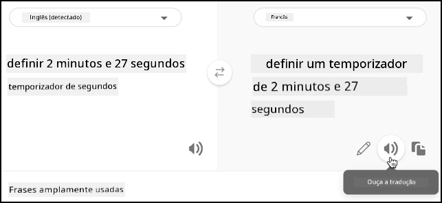

# Traduzir fala - Raspberry Pi

Nesta parte da lição, você escreverá código para traduzir texto usando o serviço de tradução.

## Converter texto em fala usando o serviço de tradução

A API REST do serviço de fala não suporta traduções diretas. Em vez disso, você pode usar o serviço Translator para traduzir o texto gerado pelo serviço de fala para texto e o texto da resposta falada. Este serviço possui uma API REST que você pode usar para traduzir o texto.

### Tarefa - usar o recurso de tradução para traduzir texto

1. Seu cronômetro inteligente terá 2 idiomas configurados - o idioma do servidor que foi usado para treinar o LUIS (o mesmo idioma também é usado para construir as mensagens para falar com o usuário) e o idioma falado pelo usuário. Atualize a variável `language` para ser o idioma que será falado pelo usuário e adicione uma nova variável chamada `server_language` para o idioma usado para treinar o LUIS:

    ```python
    language = '<user language>'
    server_language = '<server language>'
    ```

    Substitua `<user language>` pelo nome do local do idioma que você usará para falar, por exemplo, `fr-FR` para francês ou `zn-HK` para cantonês.

    Substitua `<server language>` pelo nome do local do idioma usado para treinar o LUIS.

    Você pode encontrar uma lista dos idiomas suportados e seus nomes de local na [documentação de suporte a idiomas e vozes nos documentos da Microsoft](https://docs.microsoft.com/azure/cognitive-services/speech-service/language-support?WT.mc_id=academic-17441-jabenn#speech-to-text).

    > 💁 Se você não fala vários idiomas, pode usar um serviço como [Bing Translate](https://www.bing.com/translator) ou [Google Translate](https://translate.google.com) para traduzir do seu idioma preferido para um idioma de sua escolha. Esses serviços podem reproduzir áudio do texto traduzido.
    >
    > Por exemplo, se você treinar o LUIS em inglês, mas quiser usar francês como idioma do usuário, pode traduzir frases como "set a 2 minute and 27 second timer" do inglês para o francês usando o Bing Translate e, em seguida, usar o botão **Ouvir tradução** para falar a tradução no seu microfone.
    >
    > 

1. Adicione a chave da API do tradutor abaixo da `speech_api_key`:

    ```python
    translator_api_key = '<key>'
    ```

    Substitua `<key>` pela chave da API do recurso do serviço de tradução.

1. Acima da função `say`, defina uma função `translate_text` que traduzirá texto do idioma do servidor para o idioma do usuário:

    ```python
    def translate_text(text, from_language, to_language):
    ```

    Os idiomas de origem e destino são passados para esta função - seu aplicativo precisa converter do idioma do usuário para o idioma do servidor ao reconhecer fala e do idioma do servidor para o idioma do usuário ao fornecer feedback falado.

1. Dentro desta função, defina a URL e os cabeçalhos para a chamada da API REST:

    ```python
    url = f'https://api.cognitive.microsofttranslator.com/translate?api-version=3.0'

    headers = {
        'Ocp-Apim-Subscription-Key': translator_api_key,
        'Ocp-Apim-Subscription-Region': location,
        'Content-type': 'application/json'
    }
    ```

    A URL para esta API não é específica de localização; em vez disso, a localização é passada como um cabeçalho. A chave da API é usada diretamente, então, ao contrário do serviço de fala, não há necessidade de obter um token de acesso da API emissora de tokens.

1. Abaixo disso, defina os parâmetros e o corpo para a chamada:

    ```python
    params = {
        'from': from_language,
        'to': to_language
    }

    body = [{
        'text' : text
    }]
    ```

    Os `params` definem os parâmetros a serem passados para a chamada da API, passando os idiomas de origem e destino. Esta chamada traduzirá texto no idioma `from` para o idioma `to`.

    O `body` contém o texto a ser traduzido. Este é um array, pois vários blocos de texto podem ser traduzidos na mesma chamada.

1. Faça a chamada para a API REST e obtenha a resposta:

    ```python
    response = requests.post(url, headers=headers, params=params, json=body)
    ```

    A resposta que retorna é um array JSON, com um item que contém as traduções. Este item possui um array para traduções de todos os itens passados no corpo.

    ```json
    [
        {
            "translations": [
                {
                    "text": "Set a 2 minute 27 second timer.",
                    "to": "en"
                }
            ]
        }
    ]
    ```

1. Retorne a propriedade `text` da primeira tradução do primeiro item no array:

    ```python
    return response.json()[0]['translations'][0]['text']
    ```

1. Atualize o loop `while True` para traduzir o texto da chamada para `convert_speech_to_text` do idioma do usuário para o idioma do servidor:

    ```python
    if len(text) > 0:
        print('Original:', text)
        text = translate_text(text, language, server_language)
        print('Translated:', text)

        message = Message(json.dumps({ 'speech': text }))
        device_client.send_message(message)
    ```

    Este código também imprime as versões original e traduzida do texto no console.

1. Atualize a função `say` para traduzir o texto a ser falado do idioma do servidor para o idioma do usuário:

    ```python
    def say(text):
        print('Original:', text)
        text = translate_text(text, server_language, language)
        print('Translated:', text)
        speech = get_speech(text)
        play_speech(speech)
    ```

    Este código também imprime as versões original e traduzida do texto no console.

1. Execute seu código. Certifique-se de que seu aplicativo de função esteja em execução e solicite um cronômetro no idioma do usuário, seja falando esse idioma você mesmo ou usando um aplicativo de tradução.

    ```output
    pi@raspberrypi:~/smart-timer $ python3 app.py
    Connecting
    Connected
    Using voice fr-FR-DeniseNeural
    Original: Définir une minuterie de 2 minutes et 27 secondes.
    Translated: Set a timer of 2 minutes and 27 seconds.
    Original: 2 minute 27 second timer started.
    Translated: 2 minute 27 seconde minute a commencé.
    Original: Times up on your 2 minute 27 second timer.
    Translated: Chronométrant votre minuterie de 2 minutes 27 secondes.
    ```

    > 💁 Devido às diferentes formas de dizer algo em diferentes idiomas, você pode obter traduções que são ligeiramente diferentes dos exemplos que você deu ao LUIS. Se for o caso, adicione mais exemplos ao LUIS, treine novamente e publique o modelo novamente.

> 💁 Você pode encontrar este código na pasta [code/pi](../../../../../6-consumer/lessons/4-multiple-language-support/code/pi).

😀 Seu programa de cronômetro multilíngue foi um sucesso!

---

**Aviso Legal**:  
Este documento foi traduzido utilizando o serviço de tradução por IA [Co-op Translator](https://github.com/Azure/co-op-translator). Embora nos esforcemos para garantir a precisão, esteja ciente de que traduções automatizadas podem conter erros ou imprecisões. O documento original em seu idioma nativo deve ser considerado a fonte autoritativa. Para informações críticas, recomenda-se a tradução profissional realizada por humanos. Não nos responsabilizamos por quaisquer mal-entendidos ou interpretações incorretas decorrentes do uso desta tradução.