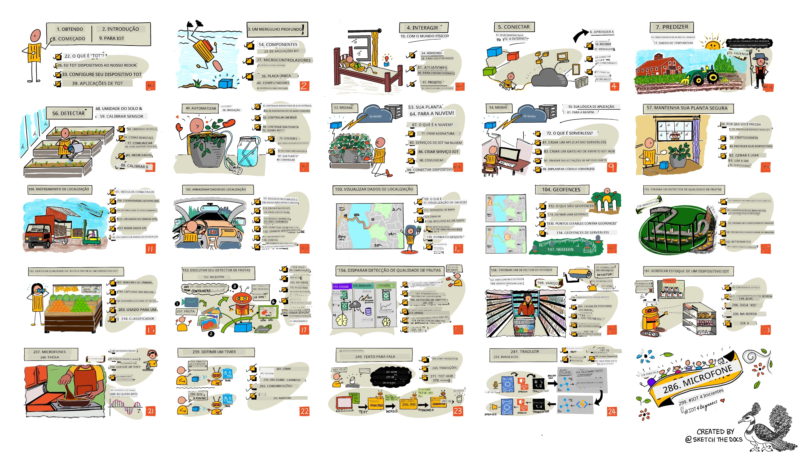

[](https://github.com/microsoft/IoT-For-Beginners/blob/master/LICENSE)
[](https://GitHub.com/microsoft/IoT-For-Beginners/graphs/contributors/)
[](https://GitHub.com/microsoft/IoT-For-Beginners/issues/)
[](https://GitHub.com/microsoft/IoT-For-Beginners/pulls/)
[](http://makeapullrequest.com)

[](https://GitHub.com/microsoft/IoT-For-Beginners/watchers/)
[](https://GitHub.com/microsoft/IoT-For-Beginners/network/)
[](https://GitHub.com/microsoft/IoT-For-Beginners/stargazers/)

### Junte-se à Comunidade Azure AI Foundry

Se você ficar preso ou tiver alguma dúvida sobre como construir aplicativos de IA, junte-se a outros aprendizes e desenvolvedores experientes em discussões sobre o MCP. É uma comunidade de apoio onde perguntas são bem-vindas e o conhecimento é compartilhado livremente.

[](https://discord.gg/nTYy5BXMWG)

Se você tiver feedback sobre o produto ou encontrar erros durante o desenvolvimento, visite:

[](https://aka.ms/foundry/forum)

Siga estas etapas para começar a usar esses recursos:
1. **Faça um Fork do Repositório**: Clique [](https://GitHub.com/microsoft/IoT-For-Beginners/fork)
2. **Clone o Repositório**:   `git clone https://github.com/microsoft/IoT-For-Beginners.git`
3. [**Junte-se ao Discord da Microsoft Foundry e conheça especialistas e outros desenvolvedores**](https://discord.com/invite/ByRwuEEgH4)


### 🌐 Suporte Multi-Idioma

#### Suportado via GitHub Action (Automatizado e Sempre Atualizado)

<!-- CO-OP TRANSLATOR LANGUAGES TABLE START -->
[Arabic](../ar/README.md) | [Bengali](../bn/README.md) | [Bulgarian](../bg/README.md) | [Burmese (Myanmar)](../my/README.md) | [Chinese (Simplified)](../zh-CN/README.md) | [Chinese (Traditional, Hong Kong)](../zh-HK/README.md) | [Chinese (Traditional, Macau)](../zh-MO/README.md) | [Chinese (Traditional, Taiwan)](../zh-TW/README.md) | [Croatian](../hr/README.md) | [Czech](../cs/README.md) | [Danish](../da/README.md) | [Dutch](../nl/README.md) | [Estonian](../et/README.md) | [Finnish](../fi/README.md) | [French](../fr/README.md) | [German](../de/README.md) | [Greek](../el/README.md) | [Hebrew](../he/README.md) | [Hindi](../hi/README.md) | [Hungarian](../hu/README.md) | [Indonesian](../id/README.md) | [Italian](../it/README.md) | [Japanese](../ja/README.md) | [Kannada](../kn/README.md) | [Korean](../ko/README.md) | [Lithuanian](../lt/README.md) | [Malay](../ms/README.md) | [Malayalam](../ml/README.md) | [Marathi](../mr/README.md) | [Nepali](../ne/README.md) | [Nigerian Pidgin](../pcm/README.md) | [Norwegian](../no/README.md) | [Persian (Farsi)](../fa/README.md) | [Polish](../pl/README.md) | [Portuguese (Brazil)](./README.md) | [Portuguese (Portugal)](../pt-PT/README.md) | [Punjabi (Gurmukhi)](../pa/README.md) | [Romanian](../ro/README.md) | [Russian](../ru/README.md) | [Serbian (Cyrillic)](../sr/README.md) | [Slovak](../sk/README.md) | [Slovenian](../sl/README.md) | [Spanish](../es/README.md) | [Swahili](../sw/README.md) | [Swedish](../sv/README.md) | [Tagalog (Filipino)](../tl/README.md) | [Tamil](../ta/README.md) | [Telugu](../te/README.md) | [Thai](../th/README.md) | [Turkish](../tr/README.md) | [Ukrainian](../uk/README.md) | [Urdu](../ur/README.md) | [Vietnamese](../vi/README.md)

> **Prefere Clonar Localmente?**

> Este repositório inclui mais de 50 traduções de idiomas, o que aumenta significativamente o tamanho do download. Para clonar sem traduções, use checkout esparso:
> ```bash
> git clone --filter=blob:none --sparse https://github.com/microsoft/IoT-For-Beginners.git
> cd IoT-For-Beginners
> git sparse-checkout set --no-cone '/*' '!translations' '!translated_images'
> ```
> Isso fornece tudo que você precisa para completar o curso com um download muito mais rápido.
<!-- CO-OP TRANSLATOR LANGUAGES TABLE END -->

# IoT para Iniciantes - Um Currículo

Os Azure Cloud Advocates da Microsoft têm o prazer de oferecer um currículo de 12 semanas com 24 lições sobre os fundamentos da IoT. Cada lição inclui quizzes antes e depois, instruções escritas para completar a lição, uma solução, uma tarefa e mais. Nossa pedagogia baseada em projetos permite que você aprenda enquanto constrói, uma forma comprovada de fixar novas habilidades.

Os projetos cobrem a jornada dos alimentos do campo à mesa. Isso inclui agricultura, logística, manufatura, varejo e consumidor - todas áreas populares para dispositivos IoT.



> Sketchnote por [Nitya Narasimhan](https://github.com/nitya). Clique na imagem para uma versão maior.

**Agradecimentos calorosos aos nossos autores [Jen Fox](https://github.com/jenfoxbot), [Jen Looper](https://github.com/jlooper), [Jim Bennett](https://github.com/jimbobbennett), e nossa artista de sketchnote [Nitya Narasimhan](https://github.com/nitya).**

**Obrigado também à nossa equipe de [Microsoft Learn Student Ambassadors](https://studentambassadors.microsoft.com?WT.mc_id=academic-17441-jabenn) que revisaram e traduziram este currículo - [Aditya Garg](https://github.com/AdityaGarg00), [Anurag Sharma](https://github.com/Anurag-0-1-A), [Arpita Das](https://github.com/Arpiiitaaa), [Aryan Jain](https://www.linkedin.com/in/aryan-jain-47a4a1145/), [Bhavesh Suneja](https://github.com/EliteWarrior315), [Faith Hunja](https://faithhunja.github.io/), [Lateefah Bello](https://www.linkedin.com/in/lateefah-bello/), [Manvi Jha](https://github.com/Severus-Matthew), [Mireille Tan](https://www.linkedin.com/in/mireille-tan-a4834819a/), [Mohammad Iftekher (Iftu) Ebne Jalal](https://github.com/Iftu119), [Mohammad Zulfikar](https://github.com/mohzulfikar), [Priyanshu Srivastav](https://www.linkedin.com/in/priyanshu-srivastav-b067241ba), [Thanmai Gowducheruvu](https://github.com/innovation-platform), e [Zina Kamel](https://www.linkedin.com/in/zina-kamel/).**

Conheça a equipe!

[](https://youtu.be/-wippUJRi5k)

**Gif por** [Mohit Jaisal](https://linkedin.com/in/mohitjaisal)

> 🎥 Clique na imagem acima para um vídeo sobre o projeto!

> **Professores**, incluímos algumas sugestões em [para professores](for-teachers.md) sobre como usar este currículo. Se quiser criar suas próprias lições, também incluímos um [modelo de lição](lesson-template/README.md).

> **[Estudantes](https://aka.ms/student-page)**, para usar este currículo por conta própria, faça o fork do repositório inteiro e complete os exercícios sozinho, começando com um quiz pré-aula, depois lendo a aula e completando o restante das atividades. Tente criar os projetos compreendendo as lições em vez de copiar o código da solução; no entanto, esse código está disponível nas pastas /solutions em cada lição baseada em projeto. Outra ideia seria formar um grupo de estudo com amigos e passar pelo conteúdo juntos. Para estudo adicional, recomendamos [Microsoft Learn](https://docs.microsoft.com/users/jimbobbennett/collections/ke2ehd351jopwr?WT.mc_id=academic-17441-jabenn).

Para uma visão geral em vídeo deste curso, confira este vídeo:

[](https://youtube.com/watch?v=bccEMm8gRuc "Vídeo promocional")

> 🎥 Clique na imagem acima para um vídeo sobre o projeto!

## Pedagogia

Escolhemos dois princípios pedagógicos ao construir este currículo: garantir que ele seja baseado em projetos e que inclua quizzes frequentes. Ao final desta série, os estudantes terão construído um sistema de monitoramento e rega de plantas, um rastreador de veículos, uma configuração de fábrica inteligente para monitorar e verificar alimentos, e um temporizador de cozimento controlado por voz, além de aprender os fundamentos da Internet das Coisas, incluindo como escrever código para dispositivos, conectar-se à nuvem, analisar telemetria e executar IA na borda.

Garantindo que o conteúdo esteja alinhado com projetos, o processo se torna mais envolvente para os estudantes e a retenção de conceitos é aumentada.

Além disso, um quiz de baixa pressão antes da aula define a intenção do estudante em aprender um tópico, enquanto um segundo quiz após a aula garante maior retenção. Este currículo foi projetado para ser flexível e divertido, podendo ser feito integralmente ou em partes. Os projetos começam pequenos e se tornam progressivamente mais complexos ao longo do ciclo de 12 semanas.

Cada projeto é baseado em hardware real disponível para estudantes e hobistas. Cada projeto aborda o domínio específico, fornecendo conhecimento de fundo relevante. Para ser um desenvolvedor de sucesso, ajuda entender o domínio no qual você está resolvendo problemas; fornecer esse conhecimento permite que os estudantes pensem sobre suas soluções IoT e aprendizados no contexto do tipo de problema do mundo real que podem ser solicitados a resolver como desenvolvedor IoT. Os estudantes aprendem o 'porquê' das soluções que estão construindo e desenvolvem uma apreciação pelo usuário final.

## Hardware

Temos duas opções de hardware IoT para usar nos projetos, dependendo da preferência pessoal, conhecimento ou preferência de linguagem de programação, objetivos de aprendizado e disponibilidade. Também fornecemos uma versão 'hardware virtual' para aqueles que não têm acesso ao hardware ou querem aprender mais antes de investir em uma compra. Você pode ler mais e encontrar uma 'lista de compras' na [página de hardware](./hardware.md), incluindo links para comprar kits completos com nossos parceiros da Seeed Studio.
> 💁 Encontre nosso [Código de Conduta](CODE_OF_CONDUCT.md), diretrizes de [Contribuição](CONTRIBUTING.md) e [Tradução](TRANSLATIONS.md). Agradecemos seu feedback construtivo!
>
> 🔧 Está com problemas? Confira nosso [Guia de Solução de Problemas](TROUBLESHOOTING.md) para soluções para problemas comuns.

## Cada lição inclui:

- esboço
- vídeo suplementar opcional
- quiz de aquecimento antes da lição
- lição escrita
- para lições baseadas em projetos, guias passo a passo sobre como construir o projeto
- verificações de conhecimento
- um desafio
- leitura suplementar
- tarefa
- [quiz pós-lição](https://ff-quizzes.netlify.app/en/)

> **Uma nota sobre quizzes**: Todos os quizzes estão contidos na pasta quiz-app, com um total de 48 quizzes de três perguntas cada. Eles são vinculados dentro das lições, mas o aplicativo de quiz pode ser executado localmente ou implantado no Azure; siga as instruções na pasta `quiz-app`. Eles estão sendo gradualmente localizados.

## Lições

|       |              Nome do Projeto              |                       Conceitos Ensinados                       | Objetivos de Aprendizagem                                                                                                                                          |                                                        Lição Vinculada                                                         |
| :---: | :------------------------------------: | :-------------------------------------------------------------: | ----------------------------------------------------------------------------------------------------------------------------------------------------------------- | :----------------------------------------------------------------------------------------------------------------------------: |
|  01   | [Começando](./1-getting-started/README.md) |                     Introdução ao IoT                           | Aprenda os princípios básicos do IoT e os blocos de construção básicos das soluções IoT, como sensores e serviços na nuvem, enquanto configura seu primeiro dispositivo IoT |                  [Introdução ao IoT](./1-getting-started/lessons/1-introduction-to-iot/README.md)                               |
|  02   | [Começando](./1-getting-started/README.md) |                   Um mergulho mais profundo no IoT             | Aprenda mais sobre os componentes de um sistema IoT, assim como microcontroladores e computadores de placa única                                                     |                      [Um mergulho mais profundo no IoT](./1-getting-started/lessons/2-deeper-dive/README.md)                  |
|  03   | [Começando](./1-getting-started/README.md) | Interaja com o mundo físico com sensores e atuadores             | Aprenda sobre sensores para coletar dados do mundo físico e atuadores para enviar feedback, enquanto você constrói um abajur noturno                              |  [Interaja com o mundo físico com sensores e atuadores](./1-getting-started/lessons/3-sensors-and-actuators/README.md)         |
|  04   | [Começando](./1-getting-started/README.md) |             Conecte seu dispositivo à Internet                   | Aprenda sobre como conectar um dispositivo IoT à Internet para enviar e receber mensagens conectando seu abajur a um broker MQTT                                  |               [Conecte seu dispositivo à Internet](./1-getting-started/lessons/4-connect-internet/README.md)                  |
|  05   |            [Fazenda](./2-farm/README.md)            |                    Prever o crescimento das plantas             | Aprenda a prever o crescimento das plantas usando dados de temperatura capturados por um dispositivo IoT                                                          |                          [Prever o crescimento das plantas](./2-farm/lessons/1-predict-plant-growth/README.md)                |
|  06   |            [Fazenda](./2-farm/README.md)            |                    Detectar a umidade do solo                    | Aprenda a detectar a umidade do solo e calibrar um sensor de umidade do solo                                                                                        |                          [Detectar a umidade do solo](./2-farm/lessons/2-detect-soil-moisture/README.md)                      |
|  07   |            [Fazenda](./2-farm/README.md)            |                  Rega automática das plantas                     | Aprenda a automatizar e temporizar a rega usando um relé e MQTT                                                                                                    |                      [Rega automática das plantas](./2-farm/lessons/3-automated-plant-watering/README.md)                     |
|  08   |            [Fazenda](./2-farm/README.md)            |               Migre sua planta para a nuvem                      | Aprenda sobre a nuvem e serviços IoT hospedados na nuvem e como conectar sua planta a um deles em vez de um broker MQTT público                                    |               [Migre sua planta para a nuvem](./2-farm/lessons/4-migrate-your-plant-to-the-cloud/README.md)                  |
|  09   |            [Fazenda](./2-farm/README.md)            |         Migre sua lógica de aplicação para a nuvem               | Aprenda sobre como você pode escrever lógica de aplicação na nuvem que responde a mensagens IoT                                                                     |         [Migre sua lógica de aplicação para a nuvem](./2-farm/lessons/5-migrate-application-to-the-cloud/README.md)           |
|  10   |            [Fazenda](./2-farm/README.md)            |                   Mantenha sua planta segura                      | Aprenda sobre segurança com IoT e como manter sua planta segura com chaves e certificados                                                                          |                        [Mantenha sua planta segura](./2-farm/lessons/6-keep-your-plant-secure/README.md)                       |
|  11   |       [Transporte](./3-transport/README.md)       |                      Rastreamento de localização                  | Aprenda sobre rastreamento de localização por GPS para dispositivos IoT                                                                                          |                         [Rastreamento de localização](./3-transport/lessons/1-location-tracking/README.md)                    |
|  12   |       [Transporte](./3-transport/README.md)       |                     Armazenar dados de localização               | Aprenda como armazenar dados IoT para visualização ou análise posterior                                                                                            |                          [Armazenar dados de localização](./3-transport/lessons/2-store-location-data/README.md)               |
|  13   |       [Transporte](./3-transport/README.md)       |                   Visualizar dados de localização                 | Aprenda sobre a visualização de dados de localização em um mapa, e como mapas representam o mundo 3D real em 2 dimensões                                           |                      [Visualizar dados de localização](./3-transport/lessons/3-visualize-location-data/README.md)             |
|  14   |       [Transporte](./3-transport/README.md)       |                          Geofences                                 | Aprenda sobre geofences e como eles podem ser usados para alertar quando veículos na cadeia de suprimentos estão próximos do seu destino                         |                                   [Geofences](./3-transport/lessons/4-geofences/README.md)                                   |
|  15   |   [Manufatura](./4-manufacturing/README.md)   |               Treine um detector de qualidade de frutas          | Aprenda sobre o treinamento de um classificador de imagens na nuvem para detectar qualidade de frutas                                                              |                 [Treine um detector de qualidade de frutas](./4-manufacturing/lessons/1-train-fruit-detector/README.md)        |
|  16   |   [Manufatura](./4-manufacturing/README.md)   |           Verifique a qualidade da fruta a partir de um dispositivo IoT | Aprenda sobre o uso do seu detector de qualidade de frutas a partir de um dispositivo IoT                                                                         |            [Verifique a qualidade da fruta a partir de um dispositivo IoT](./4-manufacturing/lessons/2-check-fruit-from-device/README.md)          |
|  17   |   [Manufatura](./4-manufacturing/README.md)   |             Execute seu detector de frutas na borda               | Aprenda sobre a execução do seu detector de frutas em um dispositivo IoT na borda                                                                                   |              [Execute seu detector de frutas na borda](./4-manufacturing/lessons/3-run-fruit-detector-edge/README.md)         |
|  18   |   [Manufatura](./4-manufacturing/README.md)   |        Acione a detecção de qualidade de frutas a partir de um sensor | Aprenda sobre acionar a detecção de qualidade de frutas a partir de um sensor                                                                                    |         [Acione a detecção de qualidade de frutas a partir de um sensor](./4-manufacturing/lessons/4-trigger-fruit-detector/README.md)           |
|  19   |          [Varejo](./5-retail/README.md)          |                   Treine um detector de estoque                  | Aprenda a usar detecção de objetos para treinar um detector de estoque para contar produtos em uma loja                                                             |                        [Treine um detector de estoque](./5-retail/lessons/1-train-stock-detector/README.md)                   |
|  20   |          [Varejo](./5-retail/README.md)          |               Verifique estoque a partir de um dispositivo IoT   | Aprenda como verificar o estoque a partir de um dispositivo IoT usando um modelo de detecção de objetos                                                             |                     [Verifique estoque a partir de um dispositivo IoT](./5-retail/lessons/2-check-stock-device/README.md)    |
|  21   |        [Consumidor](./6-consumer/README.md)        |             Reconheça fala com um dispositivo IoT                | Aprenda a reconhecer fala de um dispositivo IoT para construir um temporizador inteligente                                                                          |                  [Reconheça fala com um dispositivo IoT](./6-consumer/lessons/1-speech-recognition/README.md)                 |
|  22   |        [Consumidor](./6-consumer/README.md)        |                     Compreenda a linguagem                         | Aprenda a compreender frases faladas para um dispositivo IoT                                                                                                       |                        [Compreenda a linguagem](./6-consumer/lessons/2-language-understanding/README.md)                      |
|  23   |        [Consumidor](./6-consumer/README.md)        |           Configure um temporizador e forneça feedback falado    | Aprenda a configurar um temporizador em um dispositivo IoT e fornecer feedback falado sobre quando o temporizador é configurado e quando termina                  |                 [Configure um temporizador e forneça feedback falado](./6-consumer/lessons/3-spoken-feedback/README.md)       |
|  24   |        [Consumidor](./6-consumer/README.md)        |                 Suporte a múltiplos idiomas                       | Aprenda a suportar múltiplos idiomas, tanto na fala para o dispositivo quanto nas respostas do seu temporizador inteligente                                         |                   [Suporte a múltiplos idiomas](./6-consumer/lessons/4-multiple-language-support/README.md)                    |

## Acesso offline

Você pode executar esta documentação offline usando [Docsify](https://docsify.js.org/#/). Fork este repositório, [instale o Docsify](https://docsify.js.org/#/quickstart) em sua máquina local e então na pasta raiz deste repositório, digite `docsify serve`. O site será servido na porta 3000 no seu localhost: `localhost:3000`.

## Quiz

Obrigado à comunidade por hospedar o quiz interativo que testa seu conhecimento em cada um dos capítulos. Teste seu conhecimento [aqui](https://ff-quizzes.netlify.app/en/) 

### PDF

Você pode gerar um PDF deste conteúdo para acesso offline, se necessário. Para isso, certifique-se de que tem o [npm instalado](https://docs.npmjs.com/downloading-and-installing-node-js-and-npm) e execute os seguintes comandos na pasta raiz deste repositório:

```sh
npm i
npm run convert
```

### Apresentações de slides

Existem apresentações de slides para algumas das lições na pasta [slides](../../slides).


## Outros Currículos

Nossa equipe produz outros currículos! Confira:

<!-- CO-OP TRANSLATOR OTHER COURSES START -->
### LangChain
[](https://aka.ms/langchain4j-for-beginners)
[](https://aka.ms/langchainjs-for-beginners?WT.mc_id=m365-94501-dwahlin)

---

### Azure / Edge / MCP / Agentes
[](https://github.com/microsoft/AZD-for-beginners?WT.mc_id=academic-105485-koreyst)
[](https://github.com/microsoft/edgeai-for-beginners?WT.mc_id=academic-105485-koreyst)
[](https://github.com/microsoft/mcp-for-beginners?WT.mc_id=academic-105485-koreyst)
[](https://github.com/microsoft/ai-agents-for-beginners?WT.mc_id=academic-105485-koreyst)

---
 
### Série de IA Generativa
[](https://github.com/microsoft/generative-ai-for-beginners?WT.mc_id=academic-105485-koreyst)
[-9333EA?style=for-the-badge&labelColor=E5E7EB&color=9333EA)](https://github.com/microsoft/Generative-AI-for-beginners-dotnet?WT.mc_id=academic-105485-koreyst)
[-C084FC?style=for-the-badge&labelColor=E5E7EB&color=C084FC)](https://github.com/microsoft/generative-ai-for-beginners-java?WT.mc_id=academic-105485-koreyst)
[-E879F9?style=for-the-badge&labelColor=E5E7EB&color=E879F9)](https://github.com/microsoft/generative-ai-with-javascript?WT.mc_id=academic-105485-koreyst)

---
 
### Aprendizado Fundamental
[](https://aka.ms/ml-beginners?WT.mc_id=academic-105485-koreyst)
[](https://aka.ms/datascience-beginners?WT.mc_id=academic-105485-koreyst)
[](https://aka.ms/ai-beginners?WT.mc_id=academic-105485-koreyst)
[](https://github.com/microsoft/Security-101?WT.mc_id=academic-96948-sayoung)
[](https://aka.ms/webdev-beginners?WT.mc_id=academic-105485-koreyst)
[](https://aka.ms/iot-beginners?WT.mc_id=academic-105485-koreyst)
[](https://github.com/microsoft/xr-development-for-beginners?WT.mc_id=academic-105485-koreyst)

---
 
### Série Copilot
[](https://aka.ms/GitHubCopilotAI?WT.mc_id=academic-105485-koreyst)
[](https://github.com/microsoft/mastering-github-copilot-for-dotnet-csharp-developers?WT.mc_id=academic-105485-koreyst)
[](https://github.com/microsoft/CopilotAdventures?WT.mc_id=academic-105485-koreyst)
<!-- CO-OP TRANSLATOR OTHER COURSES END -->

## Atribuições das imagens

Você pode encontrar todas as atribuições para as imagens usadas neste currículo onde necessário em [Atribuições](./attributions.md).

---

<!-- CO-OP TRANSLATOR DISCLAIMER START -->
**Aviso Legal**:
Este documento foi traduzido utilizando o serviço de tradução por IA [Co-op Translator](https://github.com/Azure/co-op-translator). Embora nos esforcemos para garantir a precisão, esteja ciente de que traduções automáticas podem conter erros ou imprecisões. O documento original em seu idioma nativo deve ser considerado a fonte autorizada. Para informações críticas, recomenda-se a tradução profissional humana. Não nos responsabilizamos por quaisquer mal-entendidos ou interpretações incorretas decorrentes do uso desta tradução.
<!-- CO-OP TRANSLATOR DISCLAIMER END -->